## Prerequisites
- **Tutorial group:** [Set Up for the Mobile Development Kit (MDK)](group.mobile-dev-kit-setup)
- **Download and install:** **SAP Mobile Services Client** on your [iOS](https://apps.apple.com/us/app/sap-mobile-services-client/id1413653544) or [Android](https://play.google.com/store/apps/details?id=com.sap.mobileservices.client) device (If you are connecting to `AliCloud` accounts then you will need to brand your [custom MDK client](cp-mobile-dev-kit-build-client) by allowing custom domains.)

## Details
### You will learn
  - How to access Error Archive entity set to display local upload failure
  - How to handle a logic failure errors
  - How to fix these errors

You may clone an existing project from [GitHub repository](https://github.com/SAP-samples/cloud-mdk-tutorial-samples/tree/master/4-Level-Up-with-the-Mobile-Development-Kit/2-Handle-Error-Archive-in-an-MDK-App) and start directly with step 7 in this tutorial.


---

You have built an MDK app with offline functionality. In offline store, you make a change to a local record and upload this change (from request queue) to backend but backend prevents this change to accept due to some business logic failure. This error is recorded in an Offline OData specific entity set named as `ErrorArchive`. This entity set has detailed information about the errors. It's now up-to developers how they handle such errors and then let users to fix it from the app by providing the correct values.

>`ErrorArchive` is exposed to the application as an OData entity set and is accessible through the OData API in the same way that the application accesses any other entity sets from the offline store.

!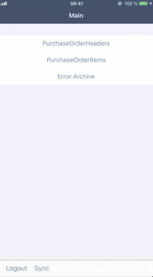

 In this tutorial, you need to carry out the following tasks in order to understand how to display and handle such errors:

*  Create a new project in SAP Business Application Studio using MDK CRUD Project template
*  Create two additional pages to display list of errors and their details
*  Create an action to navigate from error list page to its details page
*  Create a business logic to find the affected entity
*  Navigate to the affected record to handle the error

> For this tutorial, you will use **Mobile Services sample backend** destination. You will modify a `PurchaseOrderHeaders` record by changing `CurrencyCode` field. Offline store saves this record in request queue database and when you sync it with backend, backend prevents updating this record due to business logic failure. This failure record will be listed in Error list page, from here, you can navigate to details page for more information. You will implement a logic to navigate from details page to the affected record.


[ACCORDION-BEGIN [Step 1: ](Create a new MDK project in SAP Business Application Studio)]

This step includes creating the mobile development kit project in the editor.

1. Launch the [Dev space](cp-mobile-bas-setup) in SAP Business Application Studio.

2. Click **Start from template** on Welcome page.

    !

    >If you do not see the Welcome page, you can access it via **Help** menu or via **View** menu > Find Command > Welcome.

3. Select **MDK Project** and click **Start**.

    !  

    >If you do not see the **MDK Project** option check if your Dev Space has finished loading or reload the page in your browser and try again.

4. In *Basic Information* step, select or provide the below information and click **Next**:

    | Field | Value |
    |----|----|
    | `MDK Template Type`| Select `CRUD` from the dropdown |
    | `Your Project Name` | Provide a name of your choice. `MDK_ErrorArchive` is used for this tutorial |
    | `Your Application Name` | <default name is same as project name, you can provide any name of your choice> |
    | `Target MDK Client Version` | Leave the default selection as `MDK 6.0+ (For use with MDK 6.0 or later clients)` |
    | `Choose a target folder` | By default, the target folder uses project root path. However, you can choose a different folder path |

    !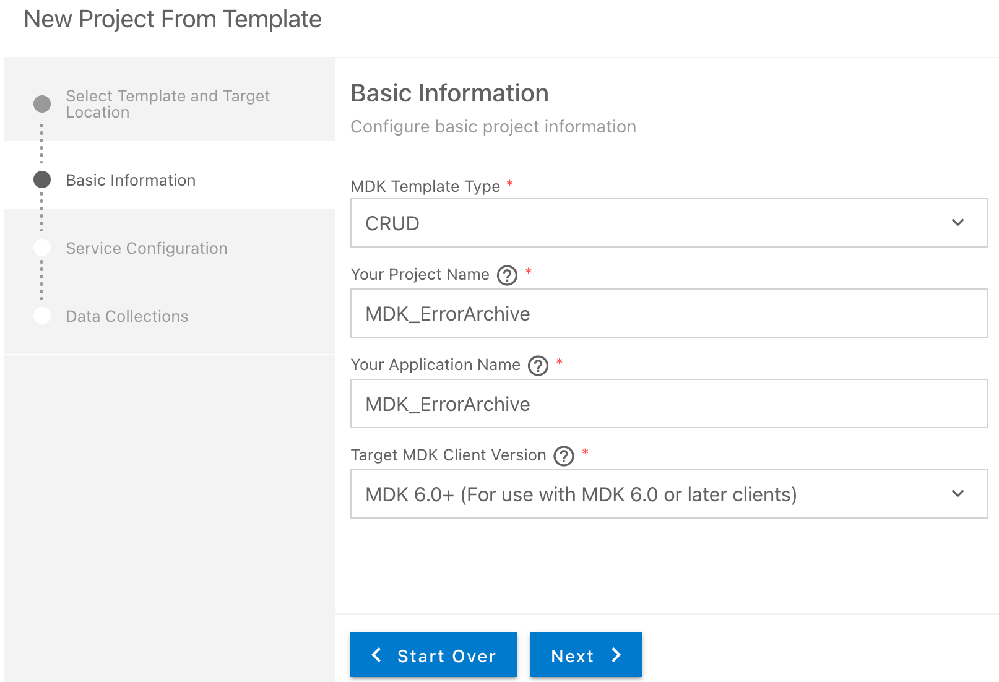

    >The `CRUD` template creates the offline or online actions, rules, messages, List Detail Pages with editable options. More details on _MDK template_ is available in [help documentation](https://help.sap.com/doc/f53c64b93e5140918d676b927a3cd65b/Cloud/en-US/docs-en/guides/getting-started/mdk/bas.html#creating-a-new-project-cloud-foundry).  

    >This screen will only show up when your CF login session has expired. Enter your login credentials, click Login icon and select the org & space where you have set up the initial configuration for your MDK app.

    >!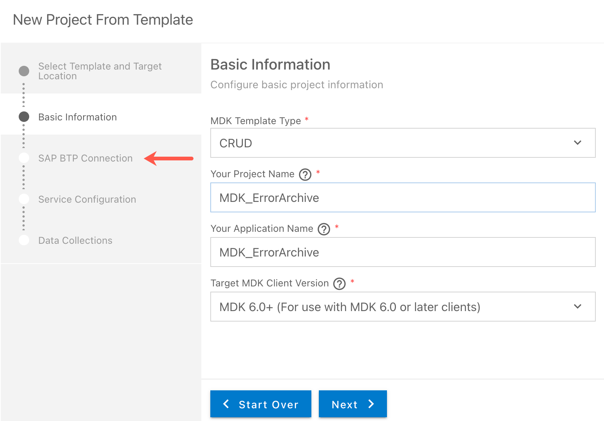

5. In *Service configuration* step, provide or select the below information and click **Next**:

    | Field | Value |
    |----|----|
    | `Data Source` | Select `Mobile Services` from the dropdown |
    | `Mobile Services Landscape` | Select `standard` from the dropdown |
    | `Application Id` | Select `com.sap.mdk.demo` from the dropdown |
    | `Destination` | Select `SampleServiceV2` from the dropdown |
    | `Enter a path to the OData service` | Leave it as it is |
    | `Enable Offline` | It's enabled by default |

    !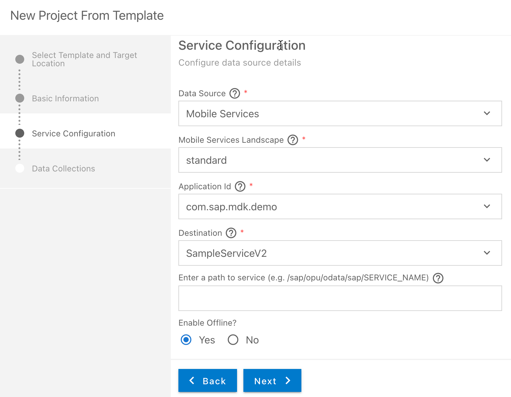

    Regardless of whether you are creating an online or offline application, this step is needed app to connect to an OData service. When building an Mobile Development Kit application, it assumes the OData service created and the destination that points to this service is set up in Mobile Services. Since we have Enable Offline set to Yes, the generated application will be offline enabled in the MDK Mobile client.

6. In *Data Collections* step, unselect `Customers`, select `Suppliers`, `PurchaseOrderHeaders` and `PurchaseOrderItems`.

    !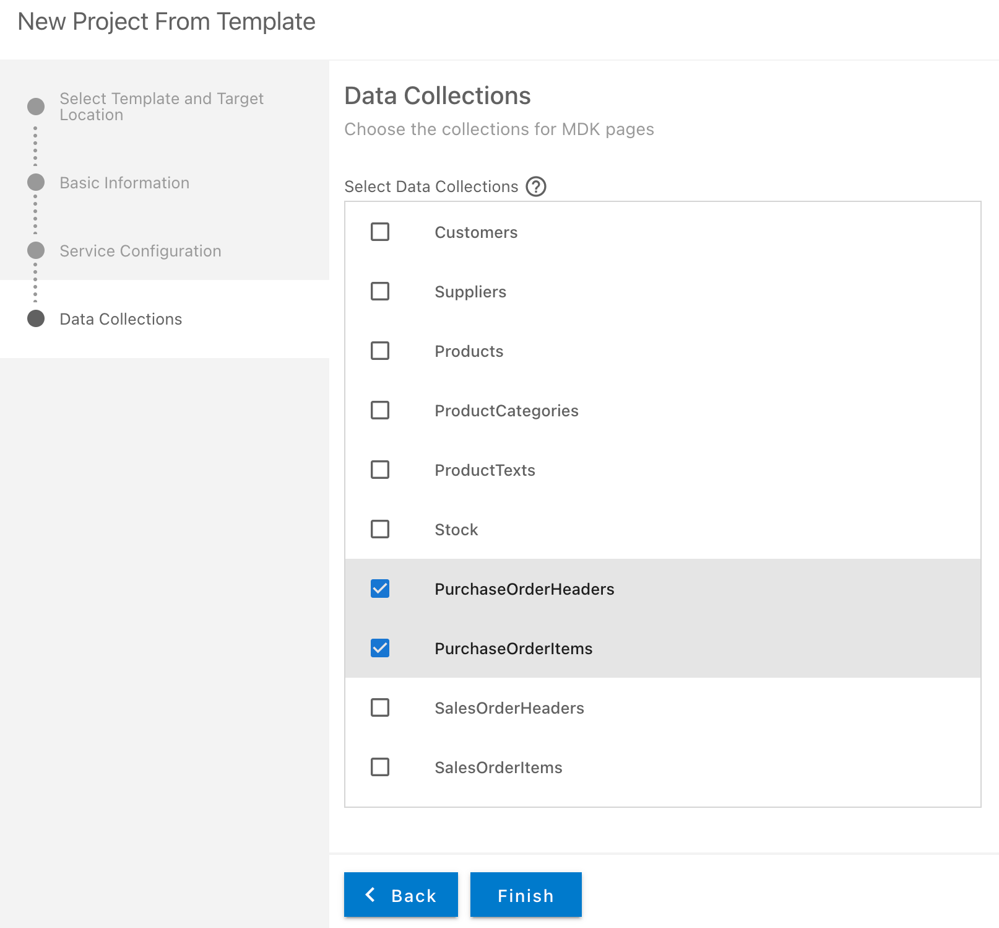

    Click **Finish** to complete the project creation.

7. After clicking **Finish**, the wizard will generate your MDK Application based on your selections. You should now see the `MDK_ErrorArchive` project in the project explorer.

[DONE]
[ACCORDION-END]

[ACCORDION-BEGIN [Step 2: ](Create a new page to display Error list)]

Generated project is offline enabled and includes three entity sets (`Suppliers`, `PurchaseOrderHeaders` and `PurchaseOrderItems`) on main page and these entities are fully CRUD enabled. You can create a new record and also modify an existing one.

!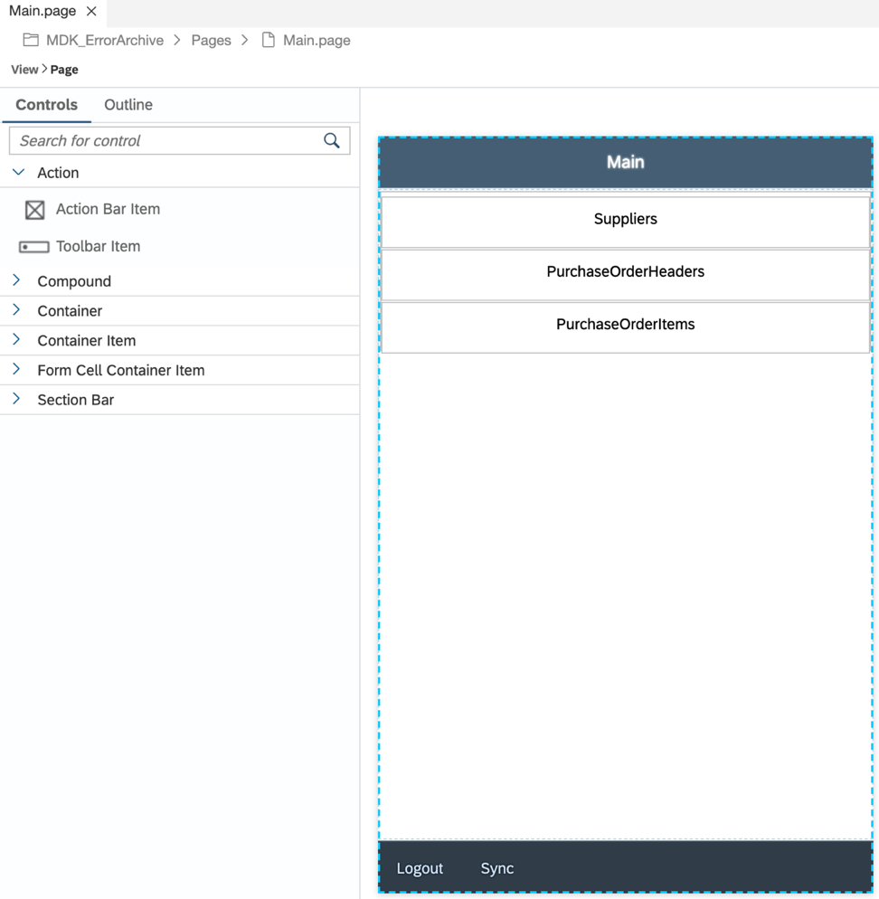

1. Now, you will create a new page to display list of errors.

    In SAP Business Application Studio project, right-click the **Pages** folder | **MDK: New Page** | **Section Page** | **Next**.

    !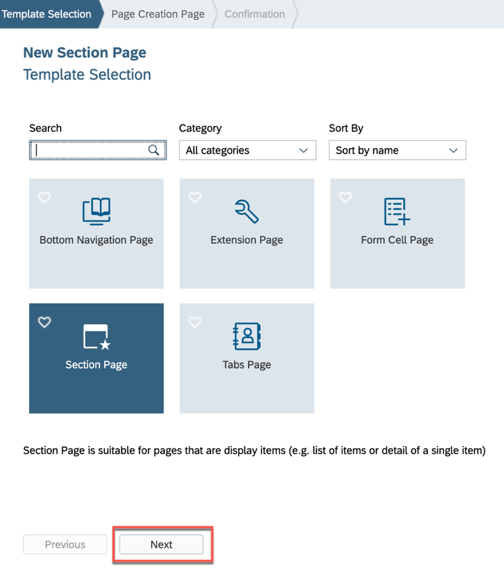

    >You can find more details about [section pages](https://help.sap.com/doc/f53c64b93e5140918d676b927a3cd65b/Cloud/en-US/docs-en/guides/features/fiori-ui/mdk/section-page.html).

    Enter the **Page Name** as `ErrorList` and click **Next** and then **Finish** on the confirmation step.

    !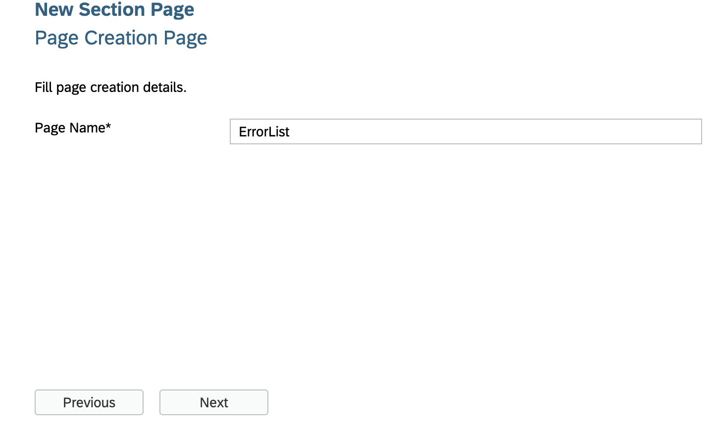

2. In the **Properties** pane, set the caption to **Error List**.

    !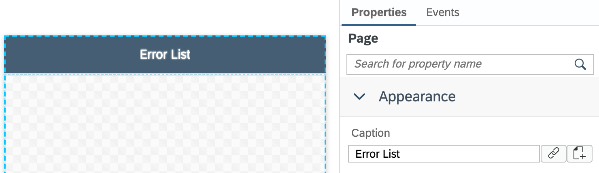

3. Next, add an **Object Table** control to display information like HTTP status code, HTTP method for the affected record.

    In the Layout Editor, expand the **Controls** | **Data Bound Container** group, drag and drop the **Object Table** control onto the page area.

    !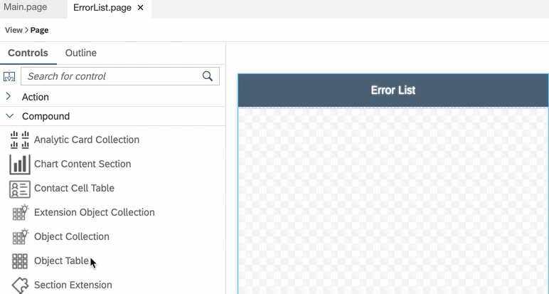

4. In the **Properties** pane, select the previously added service from the **Service** drop down and then select `ErrorArchive` entity set from the dropdown. This way, the Object Table has been bound to `ErrorArchive` entity.

    Provide below properties:

    | Property | Value |
    |----|----|
    | `Service`| Select `SampleServiceV2.service` from the dropdown |
    | `EntitySet` | Select `ErrorArchive` from the dropdown |

    !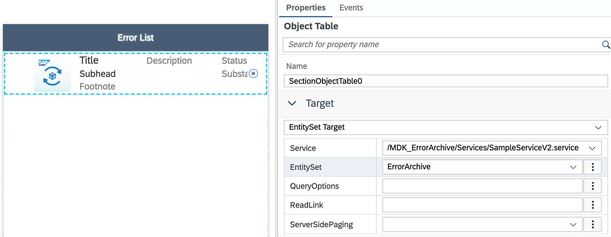

7. In **Appearance** section, provide below properties:

    | Property | Value |
    |----|----|
    | `Description`| leave it empty |
    | `DetailImage` | leave it empty |
    | `Footnote`| leave it empty |
    | `PreserveIconStackSpacing` | Select `false` from the dropdown |
    | `ProgessIndicator`| leave it empty |
    | `Status` | bind it to `{RequestMethod}` |
    | `Subhead` | bind it to `{RequestURL}` |
    | `Substatus` | `leave it empty` |
    | `Title` | bind it to `{HTTPStatusCode}` |

    !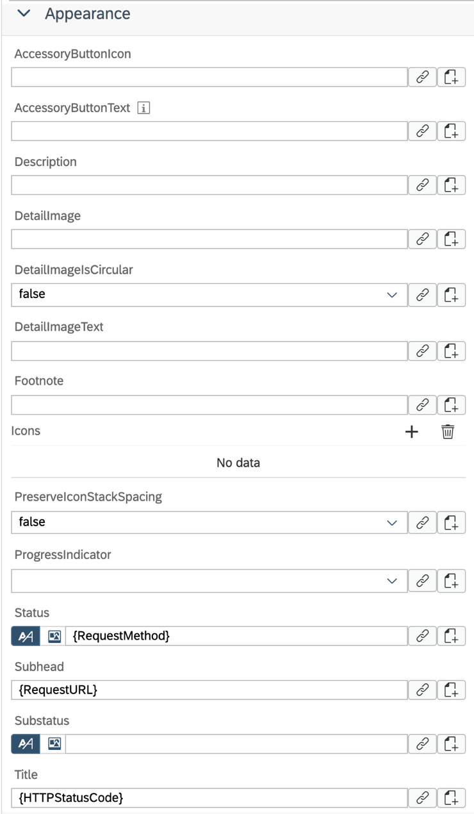

    >You can find more details about [`ErrorArchive` Entity Properties](https://help.sap.com/doc/f53c64b93e5140918d676b927a3cd65b/Cloud/en-US/docs-en/guides/features/offline/android/offline-odata-handling-errors-and-conflicts.html#errorarchive-entity-properties).

8. In **Search** section, update below properties:

    | Property | Value |
    |----|----|
    | `SearchEnabled`| `true` |

    !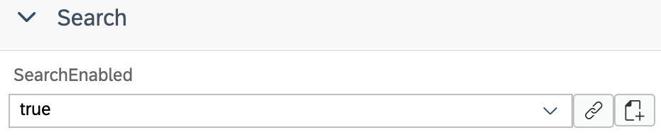

9. In **Behavior** section, update below properties:

    | Property | Value |
    |----|----|
    | `AccessoryType`| `DisclosureIndicator` |

    !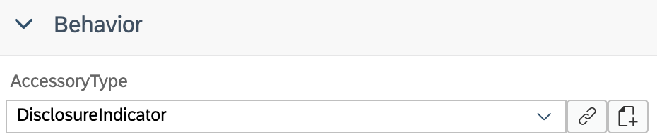

10. In `EmptySection` section, update below properties:

    | Property | Value |
    |----|----|
    | `Caption`| `No Sync Errors Found` |

    !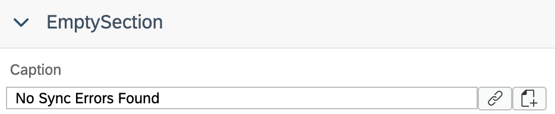

[DONE]
[ACCORDION-END]

[ACCORDION-BEGIN [Step 3: ](Create a new page to display Error details)]

1. Now, you will create another new page to display error details.

    In SAP Business Application Studio project, right-click the **Pages** folder | **MDK: New Page** | **Section Page** | **Next**.

    !

    Enter the **Page Name** as `ErrorDetails` and click **Next** and then **Finish** on the confirmation step.

    !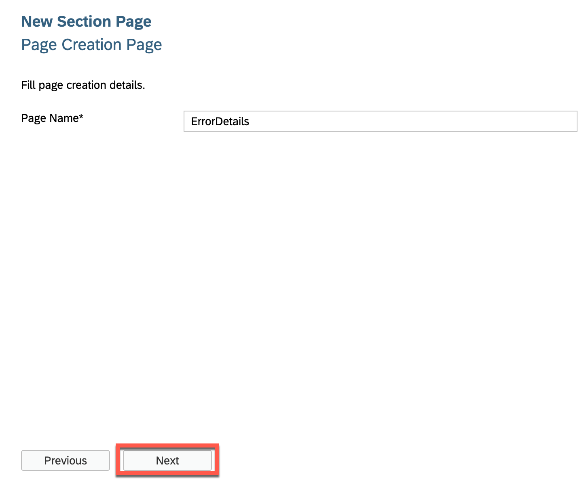

2. In the **Properties** pane, set the caption to **Error Details**.

    !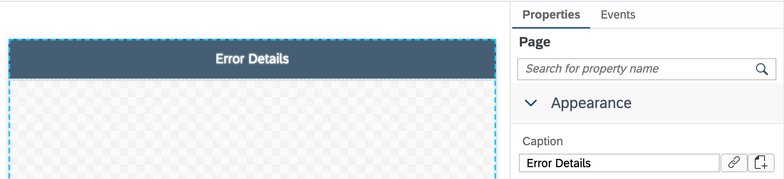

    In this page, you would show which entity has been affected due to business logic failure and also want to display other information like detailed error message, request body, request URL etc.

3. Next, write a business logic to get the **affected entity object** and this object value will be shown in error details page.

    Right-click the **Rules** folder | **MDK: New Rule File** | select **Empty JS Rule**.

      !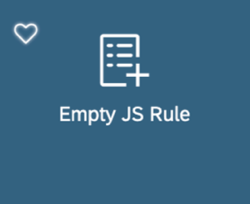

4. Enter the Rule name `GetAffectedEntityHeaderCaption`, click **Next** and then **Finish** on the confirmation step.

      !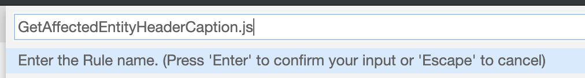

    Replace the generated snippet with below code.

    ```JavaScript
    export default function GetAffectedEntityHeaderCaption(context) {
     //Current binding's root is the errorArchiveEntity:
     //Get the affectedEntity object out of it
     let affectedEntityType = "Unknown EntitySet";
     let affectedEntity = context.getPageProxy().binding.AffectedEntity;
     let id = affectedEntity["@odata.id"];
     if (id.indexOf("(") > 0) {
       affectedEntityType = id.substring(0, id.indexOf("("));
     }
     return "Affected Entity: " + affectedEntityType;
    }
    ```

    >`@odata.id`: an annotation that contains the entity-id. More details can be found [here](http://docs.oasis-open.org/odata/odata-json-format/v4.0/cs01/odata-json-format-v4.0-cs01.html#_Toc36546468).

    >`AffectedEntity`: A navigation property that allows applications to navigate from an `ErrorArchive` entity to an entity in the offline store that is affected by the error.

5. Save the changes to the `GetAffectedEntityHeaderCaption.js` file.

6. Next, add an **Object Table** control in `ErrorDetails.page` to display some information like affected entity and id for affected record.

    Open `ErrorDetails.page`, in the Layout Editor, expand the **Controls** | **Data Bound Container** group, drag and drop the **Object Table** control onto the page area.

    !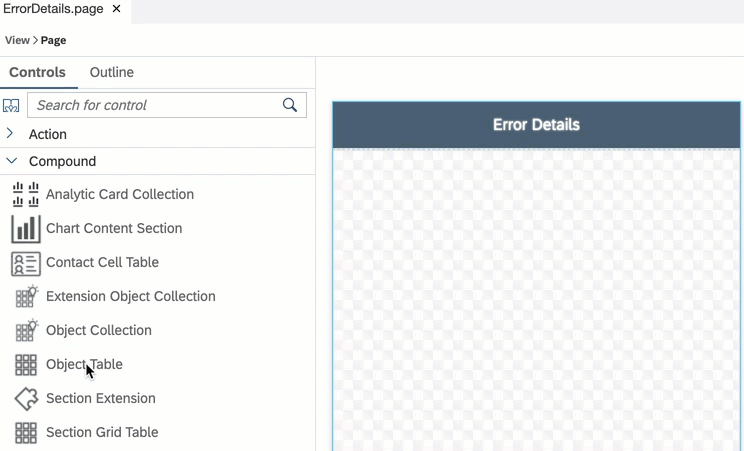

7. In the **Properties** | **Target** pane, choose **String Target** from the dropdown and provide `{AffectedEntity}` value.

    !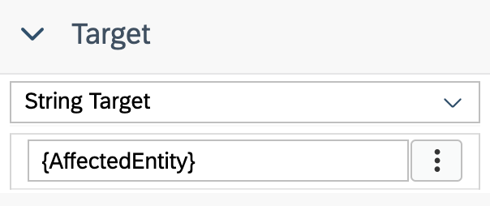

8. In **Appearance** section, provide below properties:

    | Property | Value |
    |----|----|
    | `Description`| leave it empty |
    | `DetailImage` | leave it empty |
    | `Footnote`| leave it empty |
    | `PreserveIconStackSpacing` | Select `false` from the dropdown|
    | `ProgessIndicator`| leave it empty |
    | `Status` | leave it empty  |
    | `Subhead` | `{@odata.id}` |
    | `Substatus` | leave it empty  |
    | `Title` | `Edit Affected Entity` |

    !

10. In **Behavior** section, update below properties:

    | Property | Value |
    |----|----|
    | `AccessoryType`| `DisclosureIndicator` |

    !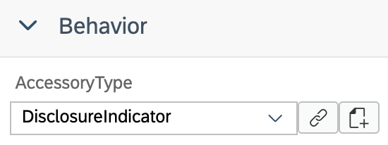

11. Next, add a **Header** section bar to display affected entity information.

    In the Layout Editor, expand the **Controls** | **Section Bar** section, drag and drop the **Header** control onto the **Object Table** control.

    !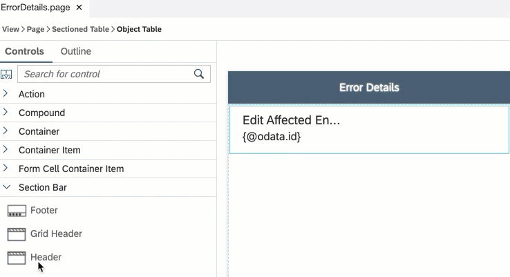

    Now, bind its **Caption** property to `GetAffectedEntityHeaderCaption.js` file.

    !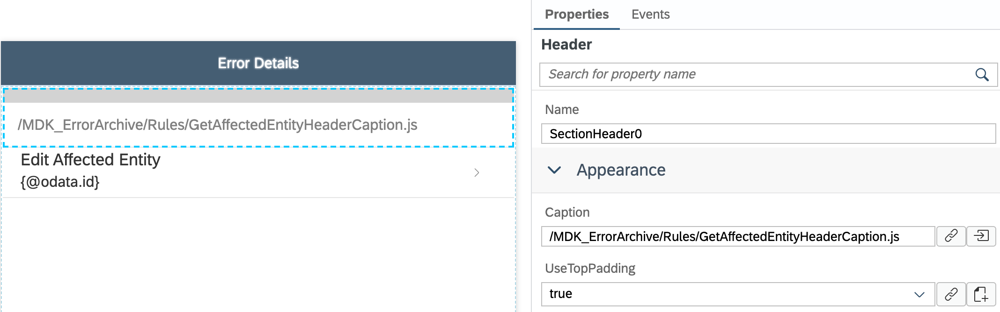

12. Next, you can also display additional information like detailed error message, request body, request URL etc.

    In the Layout Editor, expand the **Controls** | **Static Container** group, drag and drop the **Static Key Value** control on the page area.

    !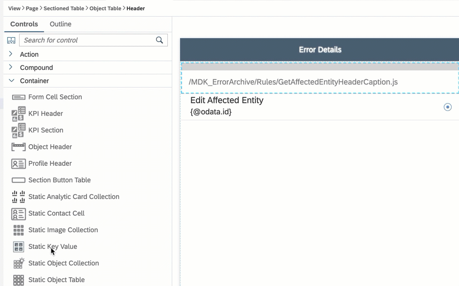

13. Update `NumberOfColumns` value to 1.

    !

    >You can find details on `NumberOfColumns` in the [documentation](https://help.sap.com/doc/69c2ce3e50454264acf9cafe6c6e442c/Latest/en-US/docs-en/reference/schemadoc/definitions/Layout.schema.html#numberofcolumns).

14. Next, you will add items to the container.

    In the Layout Editor, expand the **Controls** | **Static Items** group, drag and drop the **Key Value Item** control in the **Static Key Value** control.

    !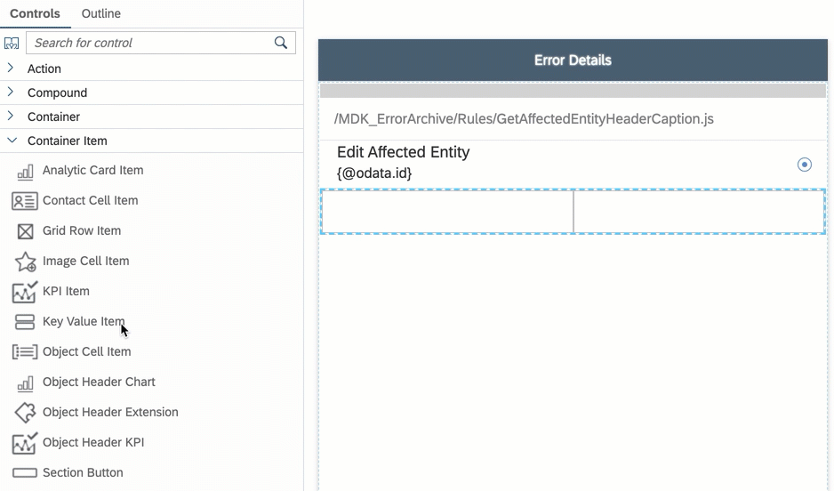


15. Provide the below information:

    | Property | Value |
    |----|----|
    | `KeyName`| `HTTP Status Code` |
    | `Value` | `{HTTPStatusCode}` |

    !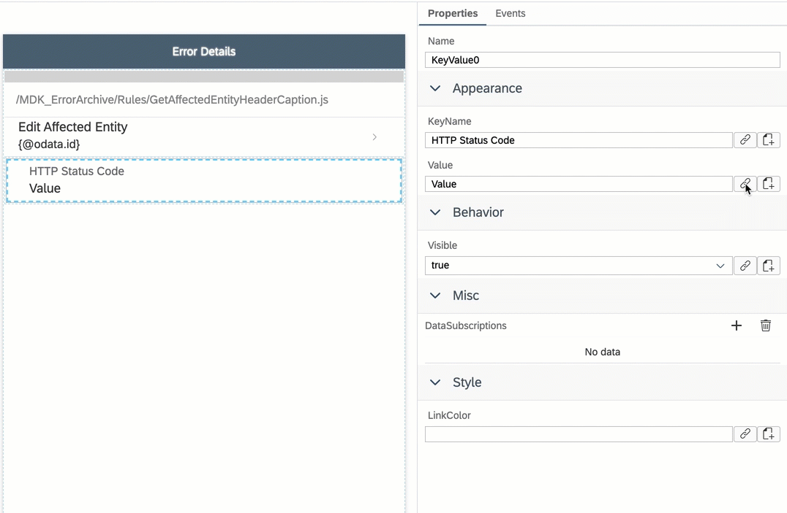

16. Drag and drop 4 more **Key Value Item** control in the **Static Key Value** control and provide the below information:

    | Property | Value |
    |----|----|
    | `KeyName`| `Request Method` |
    | `Value` | `{RequestMethod}` |

    | Property | Value |
    |----|----|
    | `KeyName`| `Request URL` |
    | `Value` | `{RequestURL}` |

    | Property | Value |
    |----|----|
    | `KeyName`| `Request Body` |
    | `Value` | `{RequestBody}` |

    | Property | Value |
    |----|----|
    | `KeyName`| `Error Message` |
    | `Value` | `{Message}` |

    You should have final binding for all the key value items as below:

    !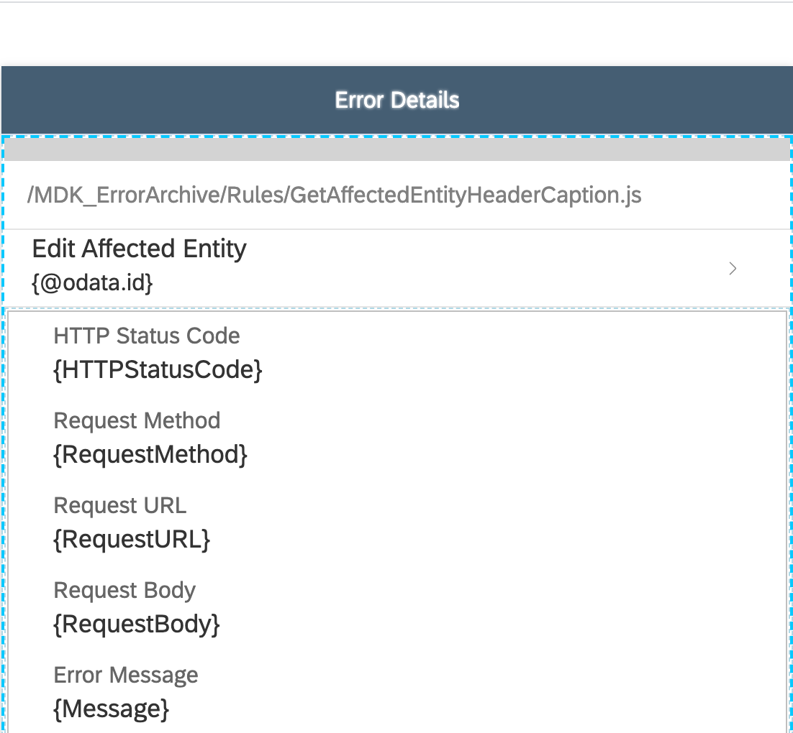

[DONE]
[ACCORDION-END]

[ACCORDION-BEGIN [Step 4: ](Navigate from Error list page to Error details page)]

When you click any record in **Error List** page, you want to navigate to **Error Details** page to view more information about this error.

1. Create a **Navigation Action**.

    Right-click the **Actions** folder | **MDK: New Action** | choose **MDK UI Actions** in **Category** | click **Navigation Action** | **Next**.

    !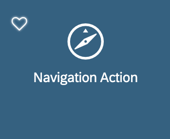

    Provide the below information:

    | Field | Value |
    |----|----|
    | `Action Name`| `ShowErrorDetails` |
    | `PageToOpen` | Select `ErrorDetails.page` from the dropdown |

    !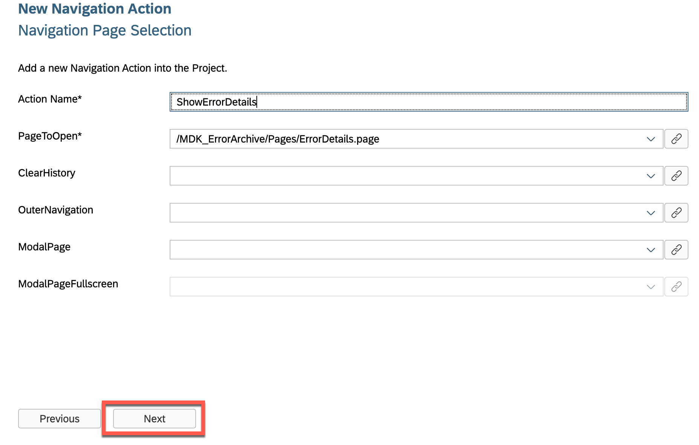

2. Bind this action to `OnPress` of **Object Table** in `ErrorList.page`.

    Open `ErrorList.page` | **Events** tab, click the 3 dots icon for the `OnPress` property to open the **Object Browser**.

    Double click the `ShowErrorDetails.action` action and click **OK** to set it as the `OnPress` action.

    !

[DONE]
[ACCORDION-END]

[ACCORDION-BEGIN [Step 5: ](Navigate from Error details page to affected record)]

When you click an **affected entity** in **Error details** page, you want to bring the affected record so that you can fix business failure by modifying previous changes right there.

You can write a logic in JavaScript to handle the `affectedEntity` and then decide which action to call depends on which `@odata.id` is the `affectedEntity` and if there is no handler for an affected entity, app will display a toast message.

1. Create a **Message Action** to display this toast message.

    Right-click the **Actions** folder | **MDK: New Action** | choose **MDK Message Actions** in **Category** | click **Message Action** | **Next**.

    !

    Provide the below information:

    | Property | Value |
    |----|----|
    | `Action Name`| `UnknownAffectedEntityMessage` |
    | `Type` | Select `ToastMessage` from the dropdown |
    | `Message` | `Affected Entity {AffectedEntity/@odata.id} doesn't have handler yet.` |
    | `Duration` | 4 |
    | `Animated` | Select `true` from the dropdown |

    !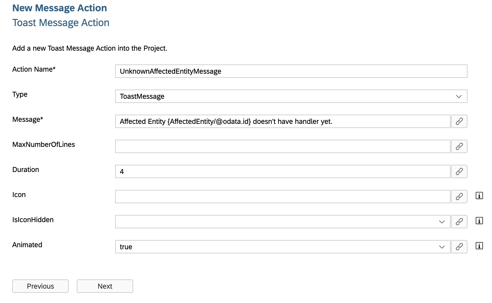

    Click **Next** and then **Finish** on the confirmation step.

2. Write a business logic to decide which action to call depends on which `@odata.type` is the `affectedEntity` and if there is no handler for an affected entity, app will display a toast message saying this affected entity doesn't have a handle yet.

    Right-click the **Rules** folder | **MDK: New Rule File** | select **Empty JS Rule**.

    !

    Enter the Rule name `DecideWhichEditPage`, click **Next** and then **Finish** on the confirmation step.

    !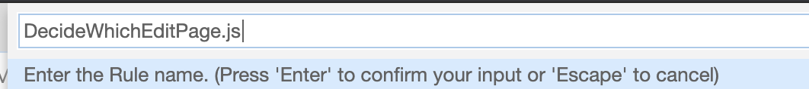

    Replace the generated snippet with below code.

    ```JavaScript
    export default function DecideWhichEditPage(context) {
      //Current binding's root is the errorArchiveEntity:
      let errorArchiveEntity = context.binding;
      //Get the affectedEntity object out of it
      let affectedEntity = errorArchiveEntity.AffectedEntity;
      console.log("Affected Entity Is:");
      console.log(affectedEntity);

      let targetAction = null;
      let id = affectedEntity["@odata.id"]; //e.g. PurchaseOrderHeaders(12345)
      let affectedEntityType = "Unknown Entity Set"; //By default it's unknown type
      if (id.indexOf("(") > 0) {
        //Extracting the entity set type from @odata.id e.g. PurchaseOrderHeaders
        var patt = /\/?(.+)\(/i;
       var result = id.match(patt);
       affectedEntityType = result[1];
      }
      console.log("Affected Entity Type Is:");
      console.log(affectedEntityType);
      //Here we decide which action to call depends on which affectedEntityType is the affectedEntity
      // You can add more complex decision logic if needed
      switch (affectedEntityType) {
        case "PurchaseOrderHeaders":
            targetAction = "/MDK_ErrorArchive/Actions/PurchaseOrderHeaders/NavToPurchaseOrderHeaders_Edit.action";
          break;
        default:
            //Save the affected Entity's type in client data so that it can be displayed by the toast
            context.getPageProxy().getClientData().AffectedEntityType = affectedEntityType;
            // Show a toast for affectedEntityType that we do not handle yet
            return context.executeAction("/MDK_ErrorArchive/Actions/UnknownAffectedEntityMessage.action");
      }

      if (targetAction) {
        let pageProxy = context.getPageProxy();
        //Set the affectedEntity object to root the binding context.
        pageProxy.setActionBinding(affectedEntity);
        //Note: doing 'return' here is important to chain the current context to the action.
        // Without the return the ActionBinding will not be passed to the action because it will consider
        // you are executing this action independent of the current context.
        return context.executeAction(targetAction);
      }
    }
    ```

4. Save your changes to the `DecideWhichEditPage.js` file.

5. Bind this file to `onPress` of **Object Table** in `ErrorDetails.page`.

    Open `ErrorDetails.page` | Select **Object Table** control | **Events** tab, click the 3 dots icon for the `OnPress` property to open the **Object Browser**.

    Double click the `DecideWhichEditPage.js` action and click **OK** to set it as the `OnPress` Action.

    !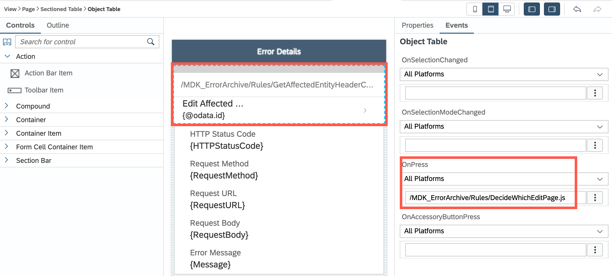

[DONE]
[ACCORDION-END]

[ACCORDION-BEGIN [Step 6: ](Add a button on main page to view Error list)]

Now, that the **Error List** page is created, you will add a button on the **Main** page that navigates to **Error List** page.

1. Create a **Navigation Action**.

    Right-click the **Actions** folder | **MDK: New Action** | choose **MDK UI Actions** in **Category** | click **Navigation Action** | **Next**.

    !

    Provide the below information:

    | Field | Value |
    |----|----|
    | `Action Name`| `ShowErrorList` |
    | `PageToOpen` | Select `ErrorList.page` from the dropdown |

    !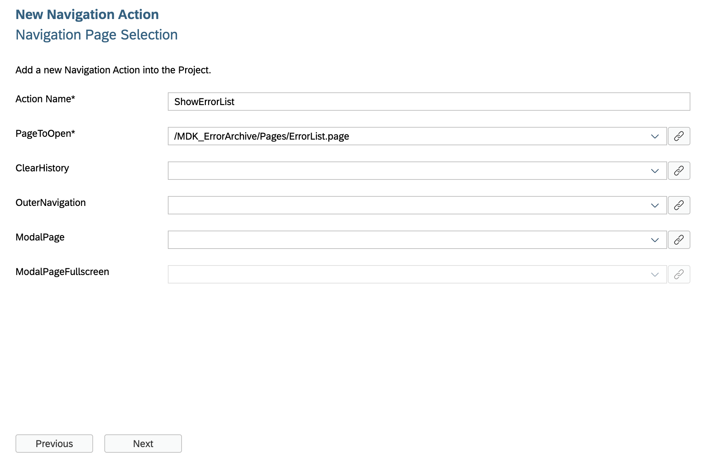

2. On **Main page**, drag and drop the **Button** static Item control onto the Page.

    !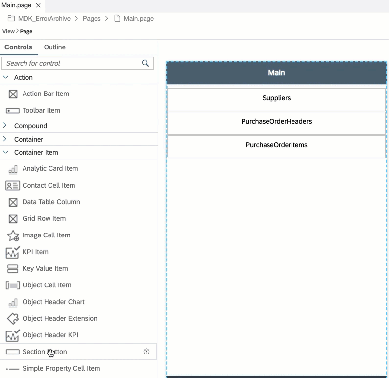

3. Provide **Title** as **Error Archive**.

    !

4. Bind `ShowErrorList.action` to the `onPress` of **Error Archive** section button in **Main** page.

    Go to **Events** tab, click the **link icon** for the `OnPress` property to open the object browser.

    Double click the `ShowErrorList.action` action and click **OK** to set it as the `OnPress` Action.

    !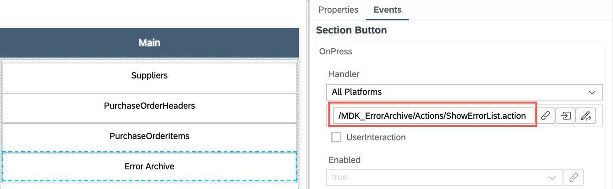

[DONE]
[ACCORDION-END]

[ACCORDION-BEGIN [Step 7: ](Deploy the application)]

1. Right-click `Application.app` and select **MDK: Deploy**.

    !

2. Select deploy target as **Mobile Services**.

    !

    If you want to enable source for debugging the deployed bundle, then choose **Yes**.

    !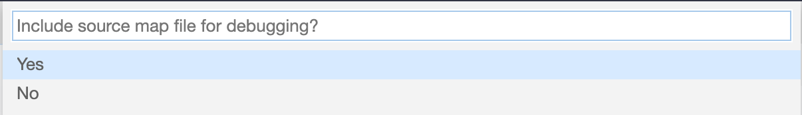

    You should see **Deploy to Mobile Services successfully!** message.

    !

[DONE]
[ACCORDION-END]

[ACCORDION-BEGIN [Step 8: ](Display the QR code for onboarding the Mobile app)]

SAP Business Application Studio has a feature to display the QR code for onboarding in the Mobile client.

Click the **Application.app** to open it in MDK Application Editor and then click the **Application QR Code** icon.

!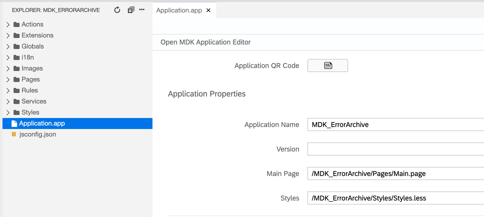

The On-boarding QR code is now displayed.

!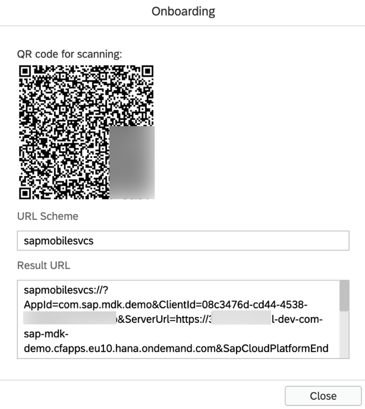

>Leave the Onboarding dialog box open for the next step.

[VALIDATE_1]
[ACCORDION-END]


[ACCORDION-BEGIN [Step 9: ](Run the app in MDK client)]

>Make sure you are choosing the right device platform tab above. Once you have scanned and on-boarded using the onboarding URL, it will be remembered. When you Log out and on-board again, you will be asked either to continue to use current application or to scan new QR code.

[OPTION BEGIN [Android]]

1. Follow [these steps](https://github.com/SAP-samples/cloud-mdk-tutorial-samples/blob/master/Onboarding-Android-client/Onboarding-Android-client.md) to on-board the MDK client.

    After you accept app update, you will see **Main** page with some entity sets being displayed and Offline store will be initialized.

    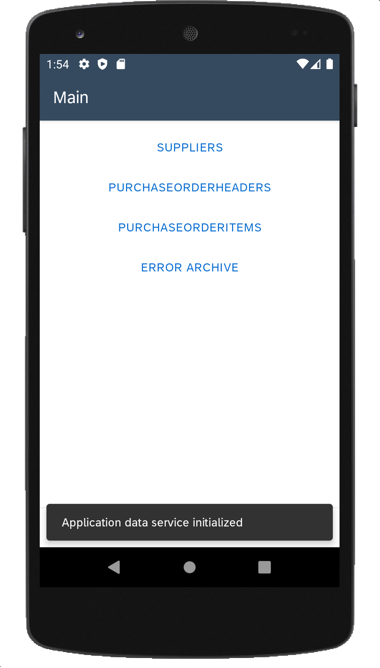

2. You will modify a `PurchaseOrderHeaders` record, save it locally, sync it to the backend and if backend doesn't accept this change due to some business logic failure, this record will appear in **Error Archive** list.

    Navigate to `PurchaseOrderHeaders` list, tap either one of the record.

    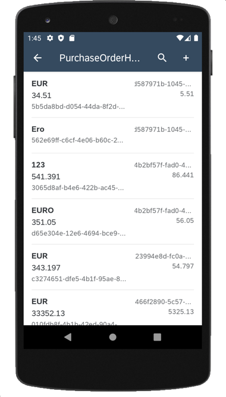

    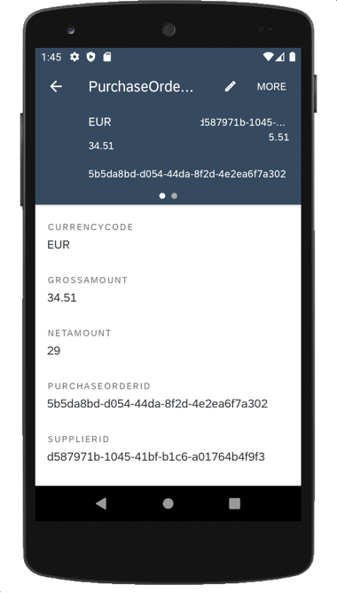

3. Tap edit icon. Make some changes to `CurrencyCode` value (update it to `EUROOO`) and tap the save icon.

    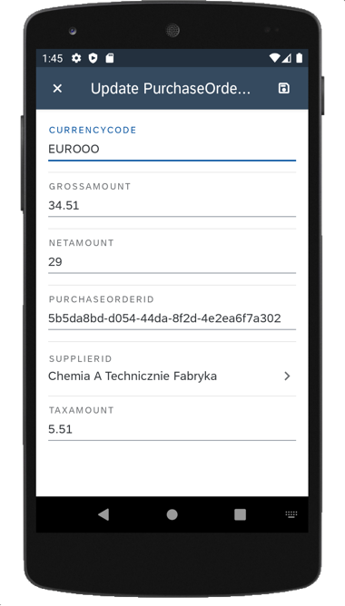

    You will see **Entity Updated** toast message. You can always see this updated record reflecting in `PurchaseOrderHeaders` list which means offline store has accepted this change.

4. Navigate to `Main.page`, click **Sync** to upload local changes from device to the backend and to download the latest changes from backend to the device.

    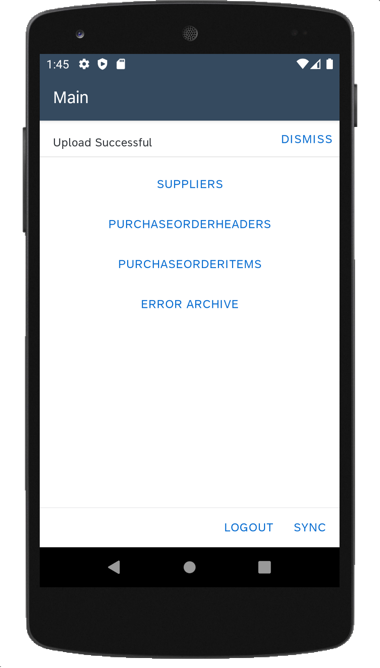

5. Once you see `Upload Successful` message, navigate to **Error Archive** list.

    There you will find affected entity which couldn't get accepted by backend due to some business logic failure.

    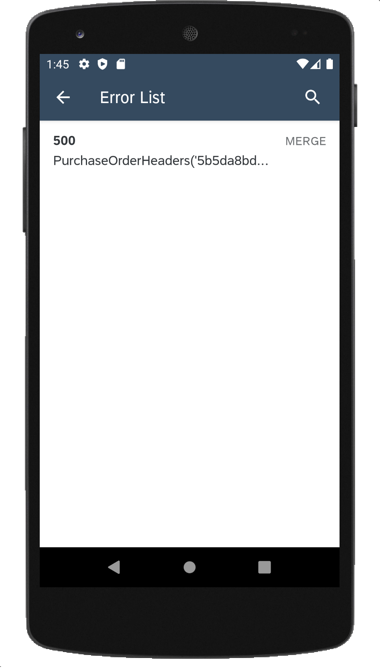

6. Tapping any record navigates to **Error Details** page with more information about error.

    

    Here in **Error Message** you will see `SQLDatabaseException` and in **REQUEST BODY**, it shows the property that caused this failure.

7. Its now up-to developers how to handle such errors and let users to modify record with correct values.

    In this tutorial, you have added a business logic to find out which is affected entity and how to navigate to respective record to let users to modify this record with correct values. Once done, user can again **Sync** it with backend.

    Tap **Edit Affected Entity** and modify record with correct values.

    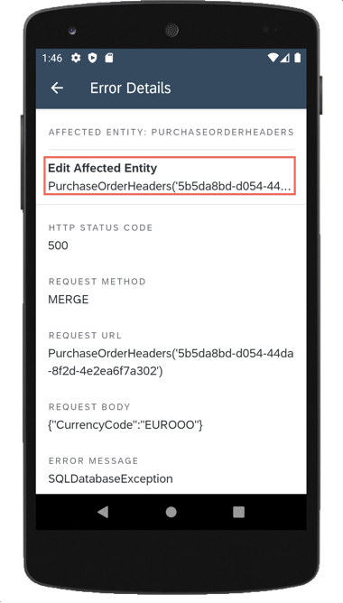

    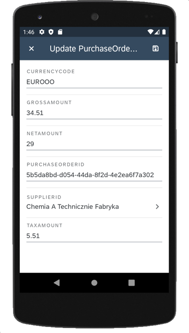

[OPTION END]

[OPTION BEGIN [iOS]]

1. Follow [these steps](https://github.com/SAP-samples/cloud-mdk-tutorial-samples/blob/master/Onboarding-iOS-client/Onboarding-iOS-client.md) to on-board the MDK client.

    After you accept app update, you will see **Main** page with some entity sets being displayed and Offline store will be initialized.

    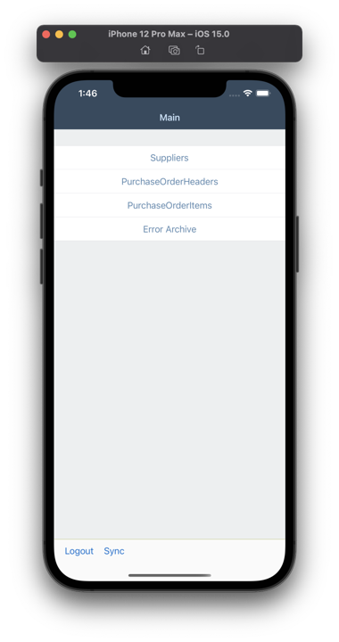

2. You will modify a `PurchaseOrderHeaders` record, save it locally, sync it to the backend and if backend doesn't accept this change due to some business logic failure, this record will appear in **Error Archive** list.

    Navigate to `PurchaseOrderHeaders` list, tap either one of the record.

    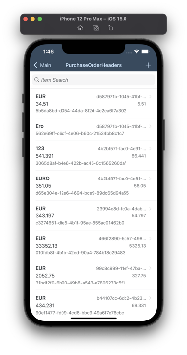

    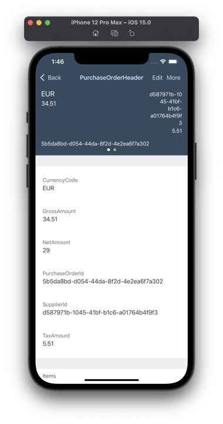

3. Tap **Edit**. Make some changes to `CurrencyCode` value (update it to `EUROOO`) and **Save** it.

    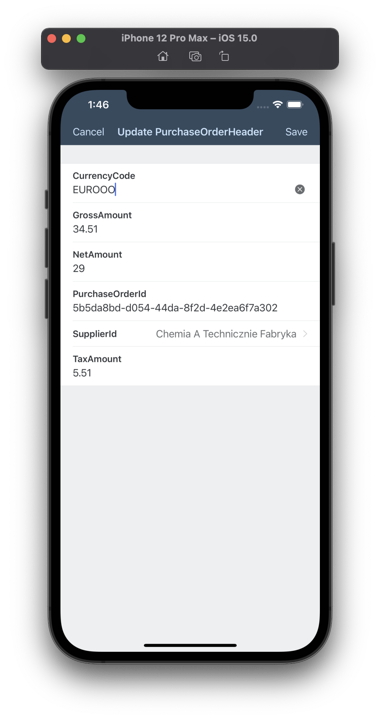

    You will see **Entity Updated** toast message. You can always see this updated record reflecting in `PurchaseOrderHeaders` list which means offline store has accepted this change.

4. Navigate to `Main.page`, click **Sync** to upload local changes from device to the backend and to download the latest changes from backend to the device.

    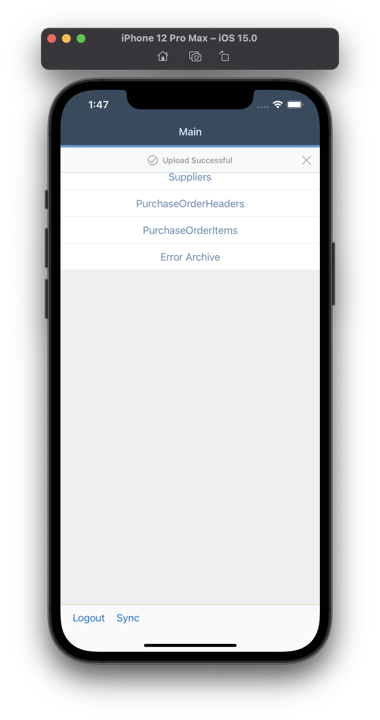

5. Once you see `Upload Successful` message, navigate to **Error Archive** list.

    There you will find affected entity which couldn't get accepted by backend due to some business logic failure.

    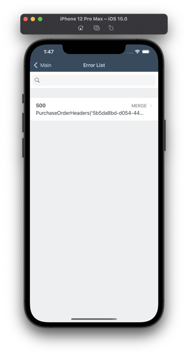

6. Tapping any record navigates to **Error Details** page with more information about error.

    Here in **Error Message** you will see `SQL Exception: Foreign key constraint violation occurred` and in **Request Body**, it shows the property that caused this failure.

    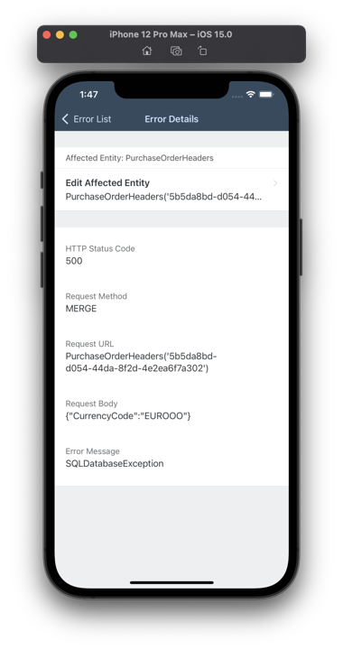

7. It's now up-to developers how to handle such errors and let users to modify record with correct values.

    In this tutorial, we have added a business logic to find out which is affected entity and how to navigate to respective record to let users to modify this record with correct values. Once done, user can again **Sync** it with backend.

    Tap **Edit Affected Entity** and modify record with correct values.

    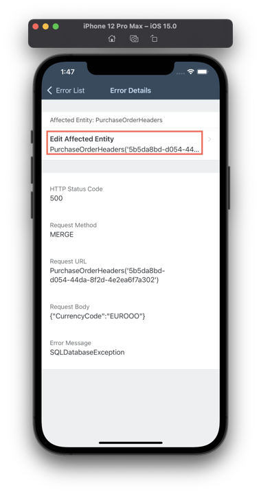

    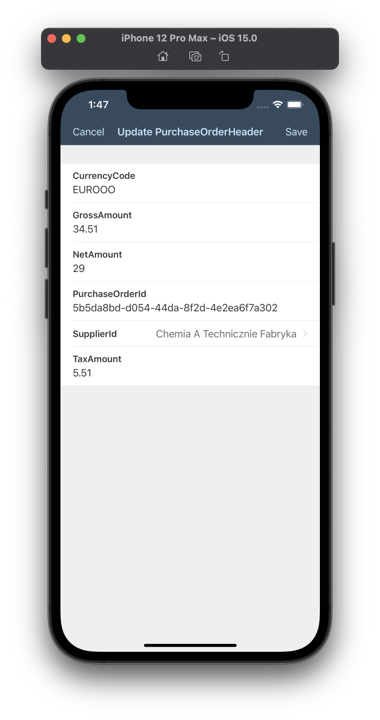

[OPTION END]

>Once you have scanned and on-boarded using the onboarding URL, it will be remembered. When you Log out and on-board again, you will be asked either to continue to use current application or to scan new QR code.

[VALIDATE_2]
[ACCORDION-END]

---
