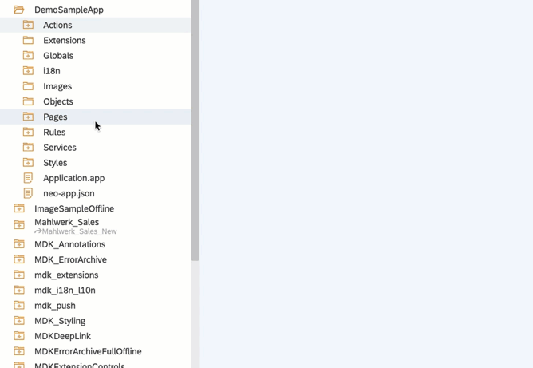
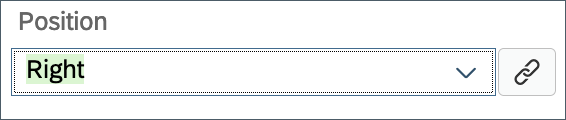
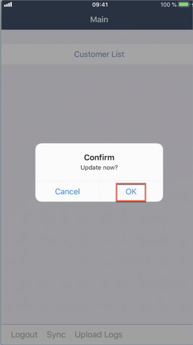

## Details
### You will learn
  - How to create relationship between parent and child entities
  - How to create a local child entity to an existing parent entity
  - How to create a local parent entity first and then a local child  entity
  - How to implement dynamic data subscription

---

For this tutorial, you will use [Mobile Services sample backend](https://developers.sap.com/tutorials/cp-mobile-dev-kit-ms-setup.html#1b6c94ec-ec39-4b11-97c1-c0e028564cf4) which has parent-child relationship setup among entities. For example, A customer can have `n` (>=0) number of sales orders.

To implement deep insert between parent and child OData entities, you need to carry out the following tasks:

*  Create a new page for creating an order
*  Add an action bar item to the new page for cancelling the current activity
*  Create a new `CreateEntity` OData action to  create a new sales order  
*  Create a new message action for displaying failure message if order creation fails
*  Create a navigation action to show order creation page from Customer detail page
*  Implement data subscription to update count value when a new sales order is created

[ACCORDION-BEGIN [Step 1: ](Create new page for new Sales order record)]

In this step, you will create the _Create Order_ page as a **Form Cell Page**. This type of page allows for form input style changes. The page will provide only a subset of items available on the Customer Detail page. You will add the fields that will be editable by the end-user.

Right click on the **Pages** folder | **New MDK Page** | **Form Cell Page** | **Next**.

>A Form Cell Page is suitable for pages that generate new objects or modify existing objects. It includes a form cell container by default. You can add form sections, multiple containers or action controls to this page. Under each container section, you can add various container items.

>You can find more details about [Form Cell page](https://help.sap.com/viewer/977416d43cd74bdc958289038749100e/Latest/en-US/65c0ed1f448346cb89fa84992dc5df9c.html).

Enter the Page Name `CreateOrder` and click **Next** and the **Finish** on the Confirmation step.

In the Properties pane, set the **Caption** to **Create Order**.

Now, you will add the fields (like Currency Code, Net Amount, Tax Amount, Gross Amount, Life cycle status, Life cycle status name and order creation date) for creating a new sales order record by the end-user.

In the Layout Editor, expand the **Control** | **Container Item** section.

>You can find more details about [available controls in Form Cell page](https://help.sap.com/viewer/977416d43cd74bdc958289038749100e/Latest/en-US/a0358d7a9c3b46e0819f28ae779def24.html).

Drag and drop a **Simple Property** onto the Page area.

Drag and drop six additional Simple Property controls and one Date Picker control onto the page so you have seven total controls.

Select the first **Simple Property control** and provide the below information:

| Property | Value |
|----|----|
| `Name`| `FCCreateCurrencyCode` |
| `Caption` | `CurrencyCode` |
| `isEditable`| `true` |
| `Value`| `EUR` |

>Under **Value** property, you can set some default values.

Select the second **Simple Property control** and provide the below information:

| Property | Value |
|----|----|
| `Name`| `FCCreateNetAmount` |
| `Caption` | `NetAmount` |
| `isEditable`| `true` |
| `Value`| `18.010` |

Select the third **Simple Property control** and provide the below information:

| Property | Value |
|----|----|
| `Name`| `FCCreateTaxAmount` |
| `Caption` | `TaxAmount` |
| `isEditable`| `true` |
| `Value`| `108.010` |

Select the forth **Simple Property control** and provide the below information:

| Property | Value |
|----|----|
| `Name`| `FCCreateGrossAmount` |
| `Caption` | `GrossAmount` |
| `isEditable`| `true` |
| `Value`| `126.02` |

Select the fifth **Simple Property control** and provide the below information:

| Property | Value |
|----|----|
| `Name`| `FCCreateLifeCycleStatus` |
| `Caption` | `LifeCycleStatus` |
| `isEditable`| `true` |
| `Value`| `N` |

Select the sixth **Simple Property control** and provide the below information:

| Property | Value |
|----|----|
| `Name`| `FCCreateLifeCycleStatusName` |
| `Caption` | `LifeCycleStatusName` |
| `isEditable`| `true` |
| `Value`| `New` |

Select the last control **Date Picker** and provide the below information:

| Property | Value |
|----|----|
| `Name`| `FCCreatedate` |
| `Caption` | `Creation Date` |
| `isEditable`| `true` |
| `Mode`| `datetime` |
| `Value`| `Enter Date` |

At the end, page should look like below:

Save the changes to the `CreateOrder` page.

[DONE]
[ACCORDION-END]

[ACCORDION-BEGIN [Step 2: ](Add cancel button on create customer page)]

Now, you will add a button on the Create Order page and set its `onPress` to **Close Page-Cancel action**.

Drag and drop an **Action Bar Item** to the upper left corner of the action bar.

>Action Bar Item is a button that users can use to fire actions when pressed. You can add an Action Bar Item only to the Action Bar (normally at the top of the page).

In the **Properties** pane, click the **link icon** to open the object browser for the **System Item** property.

Double click on the **Cancel** type and click **OK**.

>System Item are predefined system-supplied icon or text. Overwrites _Text_ and _Icon_ if specified.

Now, you will set `onPress` to **Close Page-Cancel action**.

In **Events** tab, click the **link icon** for the `OnPress` property to open the object browser.

Double click on the `ClosePageCancel` action and click **OK** to set it as the `OnPress` Action.

Save the changes to the `CreateOrder` page.

[DONE]
[ACCORDION-END]

[ACCORDION-BEGIN [Step 3: ](Create navigation action)]

Now, create a navigation action that will open the _Create Order page_ when executed.

Right click on the **Actions** folder | **New MDK Action** | **Navigation Action** | **Next**.

Provide the below information:

| Property | Value |
|----|----|
| `Action Name`| `ShowCreateOrder` |
| `Page To Open` | select `CreateOrder.page` |
| `ModalPage`| check this option |
| `ModalPage Fullscreen`| check this option |

Click **Next** and then **Finish** on the confirmation step.

[DONE]
[ACCORDION-END]

[ACCORDION-BEGIN [Step 4: ](Add Create Order toolbar item to customer detail page)]

You will add a toolbar item to the _Customer detail page_ called **Create Order**. You will link this button to the navigation action you just created. This event will open the _Create Order page_ when the Add button is pressed by the end-user.

In `CustomerDetail` page, drag and drop a **Toolbar Item** to the lower left of the page.

In the Properties pane, set **Caption** to **Create Order**.

In the Properties pane, click the **Events** tab, click the **link icon** for the `OnPress` property to open the object browser.

Double Click on the `ShowCreateOrder` action and click **OK** to set it as the `OnPress` Action.

Save the changes to the `CustomerDetail` page.

[DONE]
[ACCORDION-END]

[ACCORDION-BEGIN [Step 5: ](Store the created data locally)]

The next step is to store newly created record locally for an offline application or send the new record directly back to the backed for online applications. You will now create an action to map the changes received from the Create Order page to the corresponding field in the OData service. You will also show a failure message if the create action fails to save the changes.

First, define a failure message.

Right click on the **Actions** folder | **New MDK Action** | **Message Action** | **Next**.

Provide the below information:

| Property | Value |
|----|----|
| `Action Name`| `CreateOrderFailure` |
| `Type` | select `Message` |
| `Message` | `Failed to Create Sales Order record` |
| `Title` | `Create Sales Order` |
| `OKCaption` | `OK` |
| `OnOK` | `--None--` |
| `CancelCaption` | leave it blank |
| `OnCancel` | `--None--`|

Click **Next** and then **Finish** on the Confirmation step.

Next, you will create the **OData action** to create a sales order entity.

>You can find more details about [Create Entity Action](https://help.sap.com/viewer/977416d43cd74bdc958289038749100e/Latest/en-US/9cafb37ca8ad49e6930dba857352a3e6.html).

Right click on the **Actions** folder | **New MDK Action** | **OData Action** | **Next**.

Provide the below information:

| Property | Value |
|----|----|
| `Action Name`| `CreateOrder` |
| `Type` | `CreateEntity` |
| `Service`| `SampleServiceV2` |
| `EntitySet` | `SalesOrderHeaders` |

Click **Next**.

Since in _Create Order page_, we have defined seven properties (Currency Code, Net Amount, Tax Amount, Gross Amount, Life Cycle Status, Life Cycle Status Name and Creation Date) to be added, now in this step, we will bind them to respective UI Controls.

Check the `CreatedAt` property (if not already) and click the **link icon** to open the object browser.

Change the drop down in the object browser to `Controls & ClientData`, click the **Current Page** radio button.

In the search box start typing the control name `FCCreatedate`. The list will filter down to show the matching values. Double click on the **Value (Value)** entry under the `FCCreatedate` field and click **OK** to set binding.

Repeat the above step for remaining properties: `CurrencyCode`, `NetAmount`, `TaxAmount`, `GrossAmount`, `LifeCycleStatus` and `LifeCycleStatusName`.

Under `CreateLinks`, select the checkbox for `CustomerDetails` and provide `{{#Page:-Previous/#Property:@odata.readLink}}` value under **Options** column.

>`CreateLinks` allows you to link one or more entity objects to one of the target Entity's navigation property.

>`Page:-Previous`: A target path that when resolved will return the `PageProxy` object of the page before the currently displayed page.

>In [Mobile Services sample backend](https://developers.sap.com/tutorials/cp-mobile-dev-kit-ms-setup.html#1b6c94ec-ec39-4b11-97c1-c0e028564cf4), click **Metadata URL** and you will find `CustomerDetails` navigation property for `SalesOrderHeader` entity.

>

Click **Next** and **Finish** on the confirmation screen. The action editor will open with the `CreateOrder` action loaded.

Next, define _Success_ and _Failure_ actions for `CreateOrder` action.

In the action editor for the new action, expand the **Common Action Properties** and select `ClosePageComplete` action for **Success Action** and `CreateOrderFailure` action for **Failure Action**.

>When `CreateOrder` action gets executed successfully then `ClosePageComplete` action will be triggered or if `CreateOrder` action fails then `CreateOrderFailure` action will be triggered.

Save the changes to the `CreateOrder` action.

Now that the `CreateOrder.action` has been created, you will need to call this action when the end-user presses the **Save** button. You will add a **Save** button on the `CreateOrder.page` and link it to the `CreateOrder.action`.

In `CreateOrder.page`, **drag and drop** an **Action Bar Item** to the upper right corner of the action bar.

In the Properties pane, set **Position** to **Right**.

Click the **link** icon to open the object browser for the **System Item** property.

Double click on the **Save** type and click **OK**.

In the Properties pane | **Events** tab, click the **link** icon for the `OnPress` property to open the object browser, bind it to `CreateOrder.action`.

Save the changes to the `CreateOrder` page.

[VALIDATE_1]
[ACCORDION-END]

[ACCORDION-BEGIN [Step 6: ](Add data subscription to Customer detail page)]

In `CustomerDetail.page` you added total number of order counts for a given customer. When a new `SalesOrder` is created, this count doesn't get updated automatically unless you navigate back and forth to this page.

> `DataSubscriptions` : it is a way to listen to data changes that when triggered should cause a UI element to redraw. If your control or section has a target, that target is automatically subscribed for data change events. Otherwise you can also explicitly subscribe to `DataSubscriptions` by specifying an entity set name or `readLink` in an array. You can find more details [here](https://help.sap.com/viewer/977416d43cd74bdc958289038749100e/Latest/en-US/6e173df205af4d0eb5c0592e94fc5cdb.html).

In `CustomerDetail.page`, select **Customer Orders** object collection. In **Properties** section, click **+** icon under **Misc** and double click `SalesOrderHeaders` and click **OK**.

Save the changes to the `CustomerDetail` page.

[DONE]
[ACCORDION-END]

[ACCORDION-BEGIN [Step 7: ](Deploy, activate and test the application)]

Deploy the updated application to your MDK client.

Right-click the MDK application in the project explorer pane and select **MDK Deploy and Activate**, click **Next**, and deploy to Mobile Services.

>Make sure to select required **Destination Name** and **Application Id** as per your target environment (Neo or Cloud Foundry).

Re-launch the app on your device, you may asked to authenticate with passcode or Touch ID. When you see a confirmation pop-up, click **OK**.

You will see the **Create Order** option in customer detail page. Click on it to create a new sales order.

As we provided default values to the properties, you may change it if required. Click **Save**.

Now, you will notice that count value for **See All** is increased by one as you implemented in step 6.

On Main page, click **Sync** to send local changes to the backend, a successful message will be shown.

[DONE]
[ACCORDION-END]

---
