## Details
### You will learn
  - How to create relationship between parent and child entities
  - How to create a child entity to an existing parent entity
  - How to create a parent entity first and then a child  entity
  - How to implement dynamic data subscription

You may clone an existing project from [GitHub repository](https://github.com/SAP-samples/cloud-mdk-tutorial-samples/tree/master/3-Enhance-Your-First-MDK-App-with-Additional-Functionalities/4-cp-mobile-dev-kit-customer-order) to start with this tutorial.

---

For this tutorial, you will use [Mobile Services sample backend](cp-mobile-dev-kit-ms-setup) (step 3) which has parent-child relationship setup among entities. For example, A customer can have `n` (>=0) number of sales orders.

To create an entity and then link it to another entity, you need to carry out the following tasks:

*  Create a new page for creating an order
*  Add an action bar item to the new page for cancelling the current activity
*  Create a new `CreateRelatedEntity` OData action to  create a new sales order  
*  Create a new message action for displaying failure message if order creation fails
*  Create a navigation action to show order creation page from Customer detail page
*  Implement data subscription to update count value when a new sales order is created

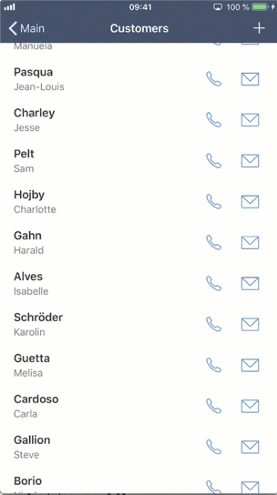

[ACCORDION-BEGIN [Step 1: ](Create new page for new Sales order record)]

In this step, you will create the _Create Order_ page as a **Form Cell Page**. This type of page allows for form input style changes. The page will provide only a subset of items available on the Customer Detail page. You will add the fields that will be editable by the end-user.

1. Right-click the **Pages** folder | **MDK: New Page** | **Form Cell Page** | **Next**.

    !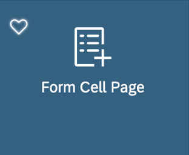

    >A Form Cell Page is suitable for pages that generate new objects or modify existing objects. It includes a form cell container by default. You can add form sections, multiple containers or action controls to this page. Under each container section, you can add various container items.

2. Enter the Page Name `SalesOrderHeaders_Create` and click **Next** and the **Finish** on the Confirmation step.

    !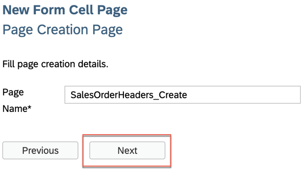

3. In the Properties pane, set the **Caption** to **Create Order**.

    !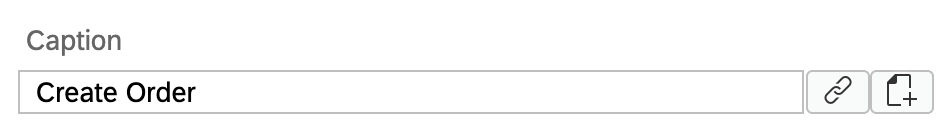

4. Now, you will add the fields (like Currency Code, Net Amount, Tax Amount, Gross Amount, Life cycle status, Life cycle status name and order creation date) for creating a new sales order record by the end-user.

    In the Layout Editor, expand the **Controls** group. Drag and drop a **Simple Property** onto the Page area.

    !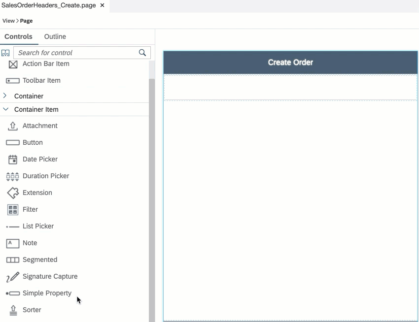

5. Drag and drop five additional **Simple Property** controls and one **Date Picker** control onto the page so you have seven total controls.

    !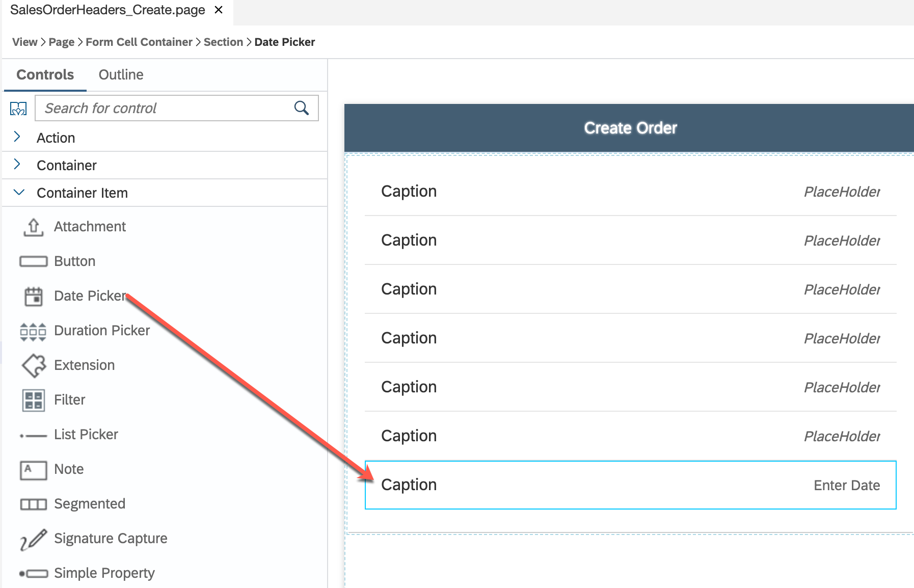

6. Select the first **Simple Property control** and provide the below information:

    | Property | Value |
    |----|----|
    | `Name`| `FCCreateCurrencyCode` |
    | `Caption` | `CurrencyCode` |
    | `Value`| `EUR` |

    !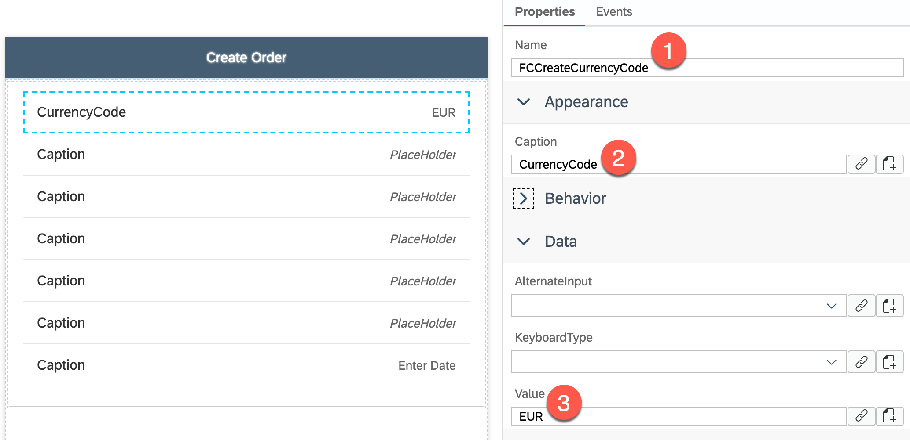

    >Under **Value** property, you can set some default values.

7. Select the second **Simple Property control** and provide the below information:

    | Property | Value |
    |----|----|
    | `Name`| `FCCreateNetAmount` |
    | `Caption` | `NetAmount` |
    | `Value`| `18.010` |

    !

8. Select the third **Simple Property control** and provide the below information:

    | Property | Value |
    |----|----|
    | `Name`| `FCCreateTaxAmount` |
    | `Caption` | `TaxAmount` |
    | `Value`| `108.010` |

    !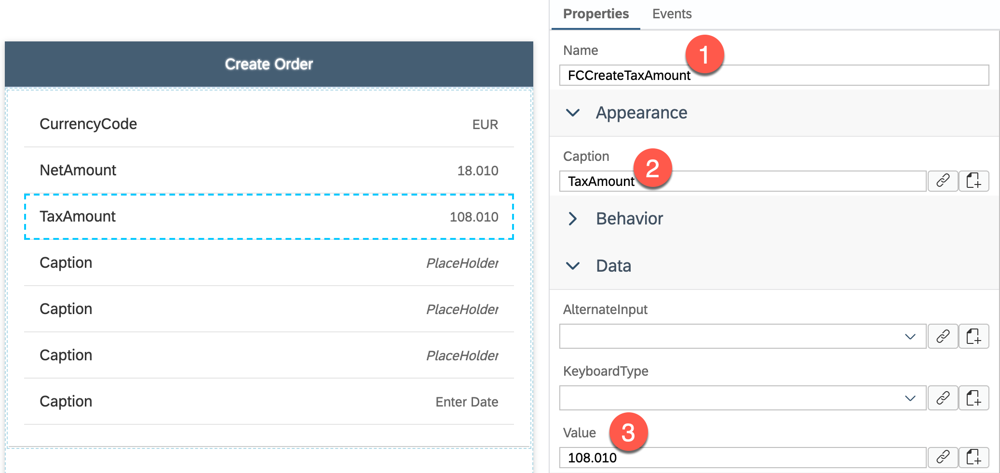

9. Select the forth **Simple Property control** and provide the below information:

    | Property | Value |
    |----|----|
    | `Name`| `FCCreateGrossAmount` |
    | `Caption` | `GrossAmount` |
    | `Value`| `126.02` |

    !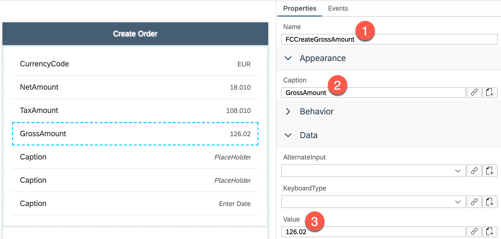

10. Select the fifth **Simple Property control** and provide the below information:

    | Property | Value |
    |----|----|
    | `Name`| `FCCreateLifeCycleStatus` |
    | `Caption` | `LifeCycleStatus` |
    | `Value`| `N` |

    !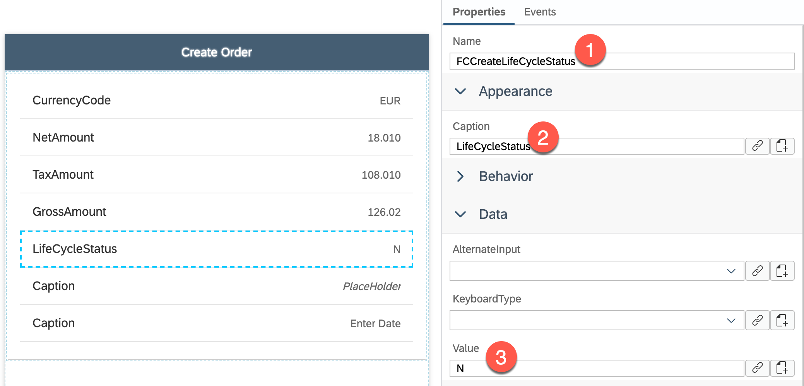

11. Select the sixth **Simple Property control** and provide the below information:

    | Property | Value |
    |----|----|
    | `Name`| `FCCreateLifeCycleStatusName` |
    | `Caption` | `LifeCycleStatusName` |
    | `Value`| `New` |

    !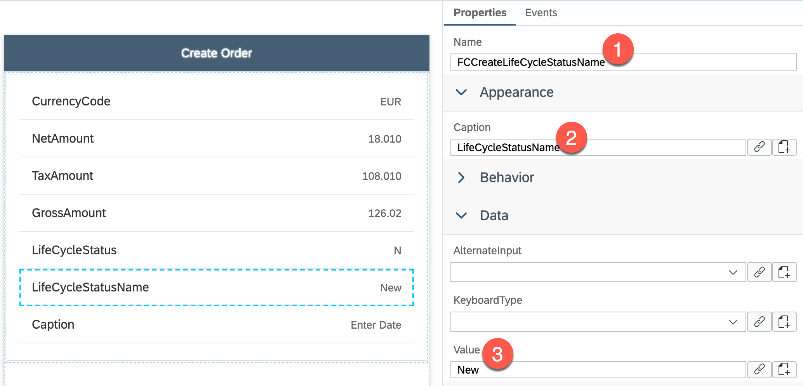

12. Select the last control **Date Picker** and provide the below information:

    | Property | Value |
    |----|----|
    | `Name`| `FCCreatedate` |
    | `Caption` | `Creation Date` |
    | `Mode`| Select `Datetime` from the dropdown if not selected by default |

    !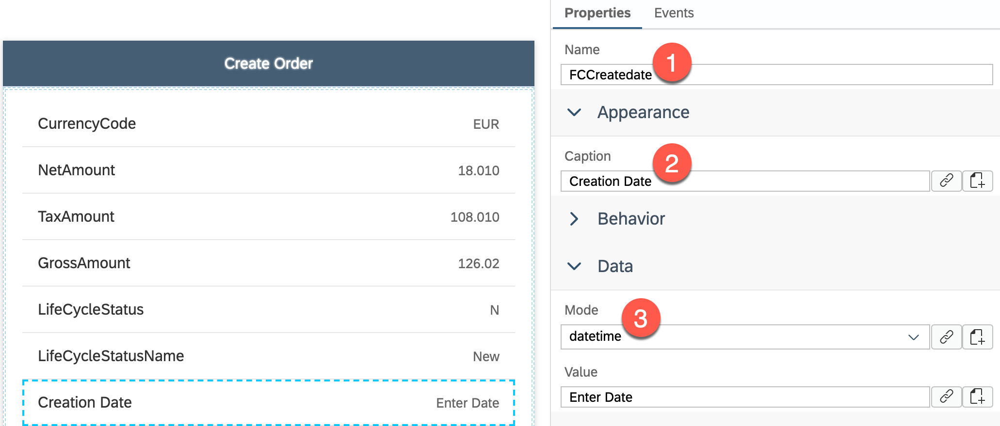

[DONE]
[ACCORDION-END]

[ACCORDION-BEGIN [Step 2: ](Add cancel button on create customer page)]

Now, you will add a button on the Create Order page and set its `onPress` to `CloseModalPage_Cancel.action`.

1. Drag and drop an **Action Bar Item** to the upper left corner of the action bar.

    >Action Bar Item is a button that users can use to fire actions when pressed. You can add an Action Bar Item only to the Action Bar (at the top of the page).

    !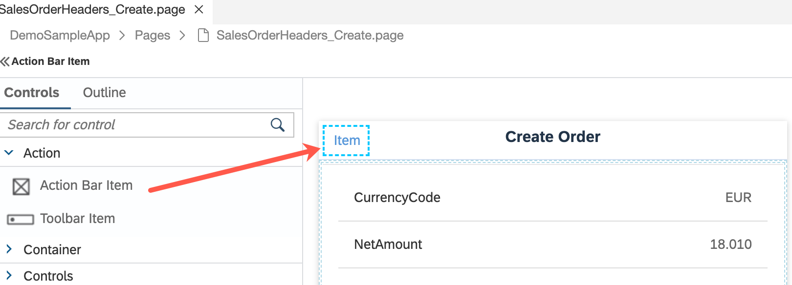

2. In the **Properties** pane, click the **link icon** to open the object browser for the **System Item** property.

    Double click the **Cancel** type and click **OK**.

    !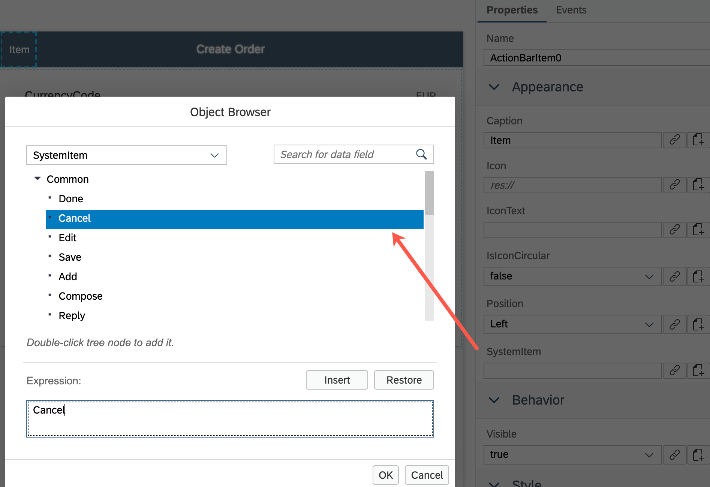

    >System Item are predefined system-supplied icon or text. Overwrites _Text_ and _Icon_ if specified.

3. Now, you will set the `onPress` event to `CloseModalPage_Cancel.action`.

    In **Events** tab, click the 3 dots icon for the `OnPress` property to open the **Object Browser**.

    Double click the `CloseModalPage_Cancel.action` and click **OK** to set it as the `OnPress` Action.

    !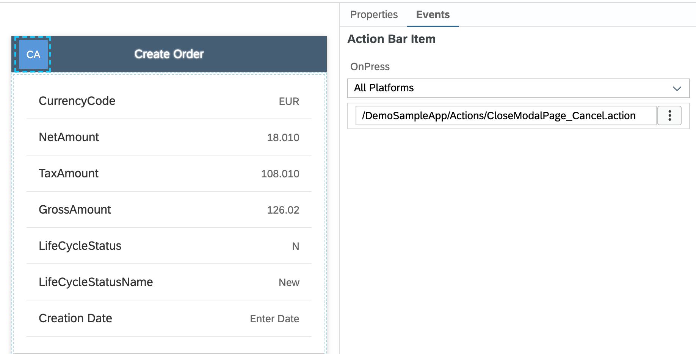

[DONE]
[ACCORDION-END]

[ACCORDION-BEGIN [Step 3: ](Create navigation action)]

1. Now, create a navigation action that will open the `SalesOrderHeaders_Create.page` when executed.

    Right-click the **Actions** folder | **MDK: New Action** | choose **MDK UI Actions** in **Category** | click **Navigation Action** | **Next**.

    !

2. Provide the below information:

    | Property | Value |
    |----|----|
    | `Action Name`| `NavToSalesOrderHeaders_Create` |
    | `PageToOpen` | Select `SalesOrderHeaders_Create.page` from the dropdown |
    | `ModalPage`| Select `true` from the dropdown |

    !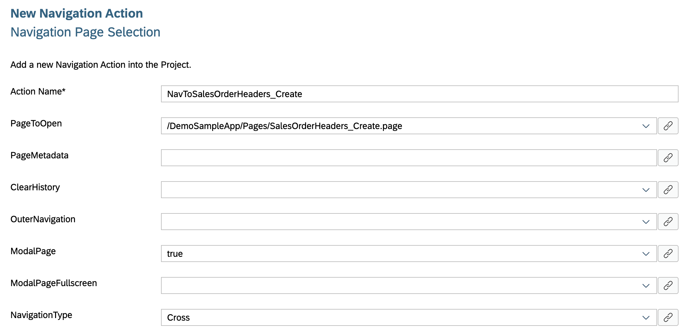

3. Click **Next** and then **Finish** on the confirmation step.

[DONE]
[ACCORDION-END]

[ACCORDION-BEGIN [Step 4: ](Add toolbar item (Create Order) to customer detail page)]

You will add a toolbar item to the `Customers_Detail.page` called **Create Order**. You will link this button to the navigation action you just created. This event will open the `SalesOrderHeaders_Create.page` when the Add button is pressed by the end-user.

1. In `Customers_Detail.page`, drag and drop a **Toolbar Item** to the lower left of the page.

    !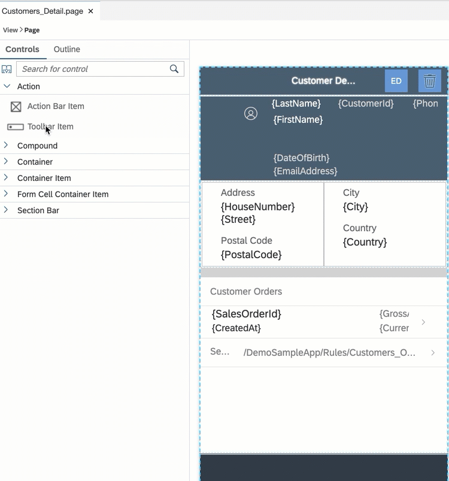

2. In the Properties pane, set **Caption** to **Create Order**.

    !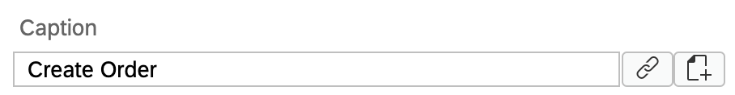

3. In the Properties pane, click the **Events** tab, click the 3 dots icon for the `OnPress` property to open the **Object Browser**.

    Double click the `NavToSalesOrderHeaders_Create.action` and click **OK** to set it as the `OnPress` Action.

    !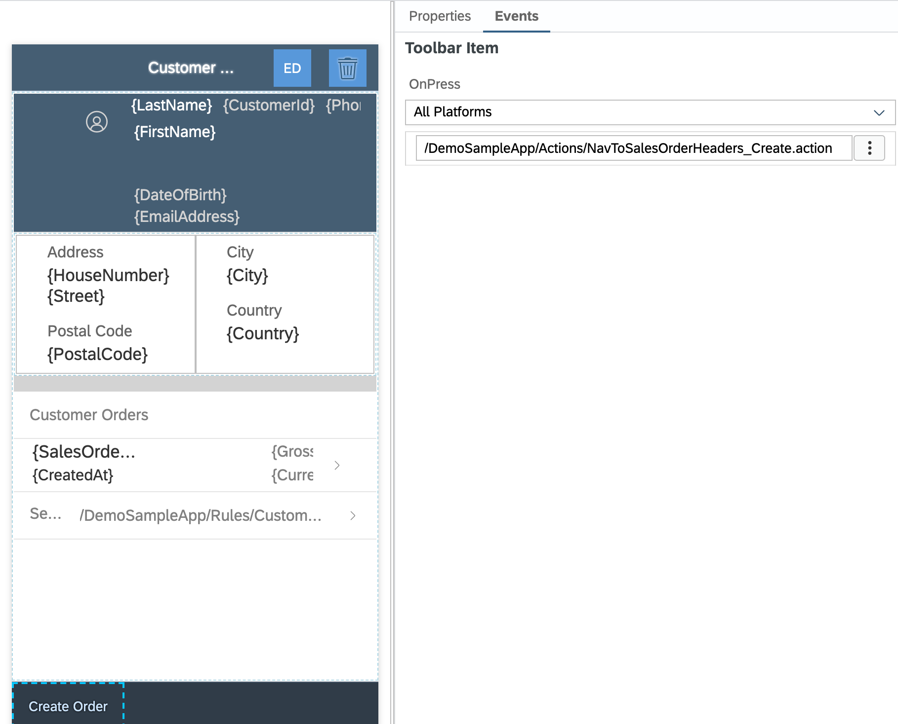

[DONE]
[ACCORDION-END]

[ACCORDION-BEGIN [Step 5: ](Store the created data locally)]

The next step is to store newly created record locally for an offline application or send the new record directly back to the backed for online applications. You will now create an action to map the changes received from the Create Order page to the corresponding field in the OData service. You will also show a failure message if the create action fails to save the changes.

1. Define a failure message.

    Right-click the **Actions** folder | **MDK: New Action** | choose **MDK Message Actions** in **Category** | click **Message Action** | **Next**.

    !

    Provide the below information:

    | Property | Value |
    |----|----|
    | `Action Name`| `CreateSalesOrderHeaderEntityFailureMessage` |
    | `Type` | Select `Message` from the dropdown |
    | `Message` | `Failed to Create Sales Order record` |
    | `Title` | `Create Sales Order` |
    | `OKCaption` | `OK` |
    | `OnOK` | `--None--` |
    | `CancelCaption` | leave it blank |
    | `OnCancel` | `--None--`|

    !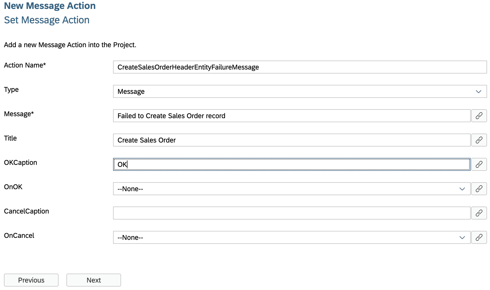

    Click **Next** and then **Finish** on the Confirmation step.

2. You will create the **OData action** to create a sales order entity.

    >You can find more details about [Create Related Entity Action](https://help.sap.com/doc/69c2ce3e50454264acf9cafe6c6e442c/Latest/en-US/docs-en/reference/schemadoc/Action/ODataService/CreateRelatedEntity.schema.html).

    Right-click the **Actions** folder | **MDK: New Action** | choose **MDK Data Actions** in **Category** | click **OData Action** | **Next**.

    !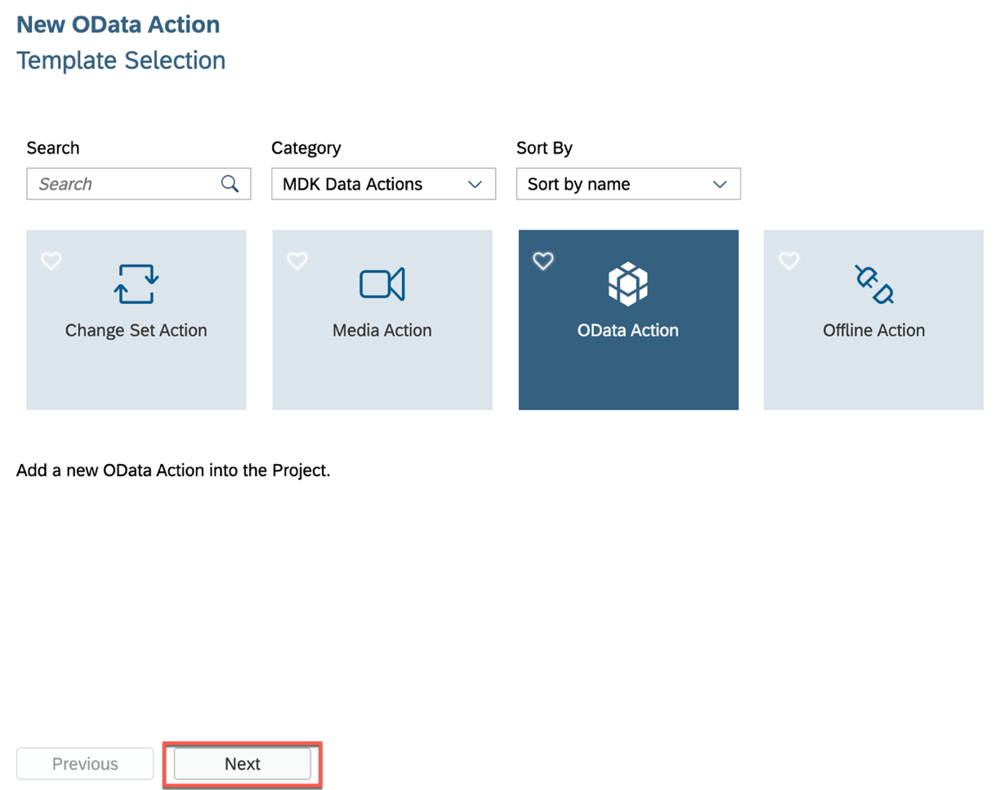

    In **Operation and Service Selection** step, provide the below information:

    | Property | Value |
    |----|----|
    | `Action Name`| `SalesOrderHeaders_CreateEntity` |
    | `Type` | Select `CreateRelatedEntity` from the dropdown |
    | `Service`| Select `SampleServiceV2.service` from the dropdown |
    | `EntitySet` | Select `SalesOrderHeaders` from the dropdown |

    !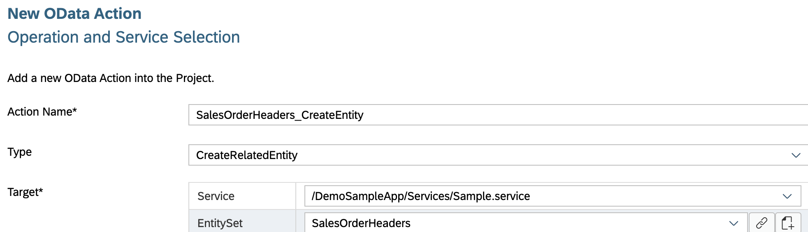

    >`CreateRelatedEntity` action creates the new entity against the navigation property of an existing entity with which the relationship is to be established.

3. Click **Next**.

4. In **Parent Link and Properties Selection** step, provide the below information:

    | Property | Value |
    |----|----|
    | `ParentLink`| `LinkItem Reference` |
    | `Target EntitySet` | Select `Customers` from the dropdown |
    | `ReadLink`| click link icon and double click `readLink` |
    | `Property` | Select `SalesOrders` from the dropdown |

    !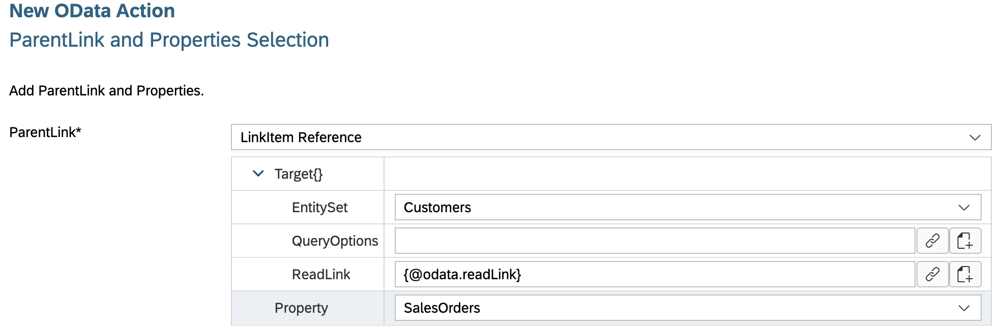

    >In [Mobile Services sample backend](cp-mobile-dev-kit-ms-setup), click **Metadata URL** and you will find `SalesOrders` navigation property for `Customers` entity.

5. Since in `SalesOrderHeaders_Create.page`, we have defined seven properties (Currency Code, Net Amount, Tax Amount, Gross Amount, Life Cycle Status, Life Cycle Status Name and Creation Date) to be added, now in **Properties** section, you will bind them to respective UI Controls.

    Check the `CreatedAt` property and click the **link icon** to open the object browser.

    Change the drop down in the object browser to `Controls & ClientData`, click the **Current Page** radio button.

    In the search box start typing the control name `FCCreatedate`. The list will filter down to show the matching values. Double click the **Value (Value)** entry under the `FCCreatedate` field and click **OK** to set binding.

    !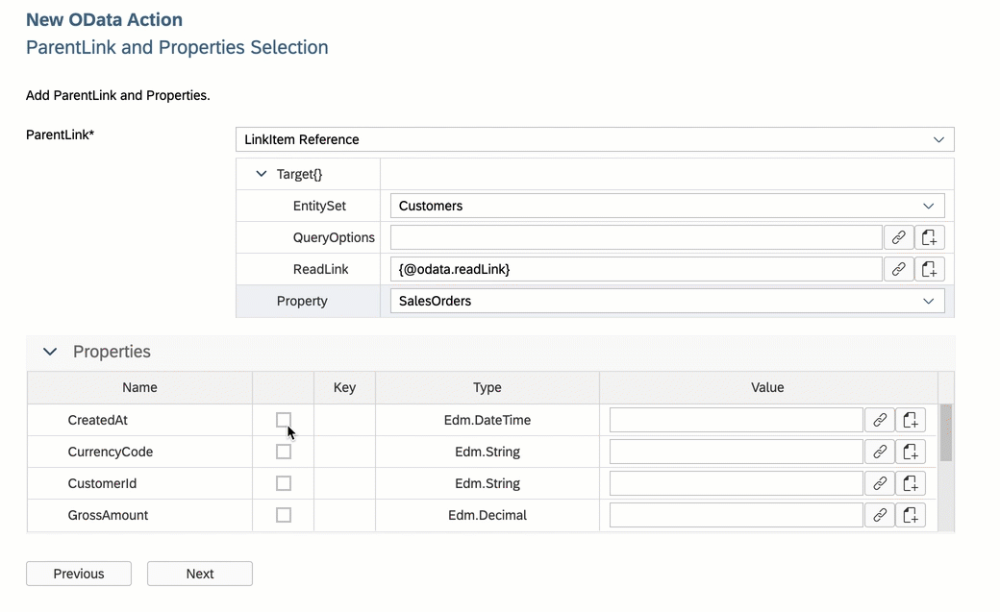

6. Repeat the above step for remaining properties: `CurrencyCode`, `GrossAmount`, `LifeCycleStatus`, `LifeCycleStatusName`, `NetAmount` and `TaxAmount`.

    !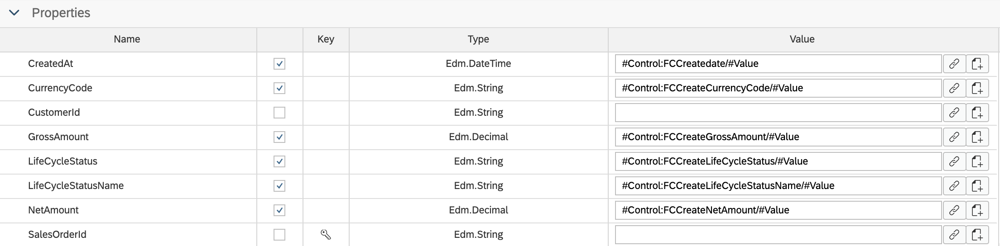

    !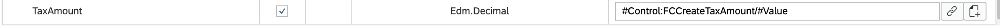

      Click **Next** and **Finish** on the confirmation screen. The action editor will open with the `SalesOrderHeaders_CreateEntity.action` loaded.

7. Define _Success_ and _Failure_ actions for `SalesOrderHeaders_CreateEntity.action`.

    In the action editor for the new action, expand the **Common Action Properties** and provide the below information:

    | Property | Value |
    |----|----|
    | `Success Action` | Click the link icon and bind it to `CloseModalPage_Complete.action` |
    | `Failure Action` | Click the link icon and bind it to `CreateSalesOrderHeaderEntityFailureMessage.action` |

    >When `SalesOrderHeaders_CreateEntity.action` gets executed successfully then `CloseModalPage_Complete.action` will be triggered or if `SalesOrderHeaders_CreateEntity.action` fails then `CreateSalesOrderHeaderEntityFailureMessage.action` will be triggered.

    !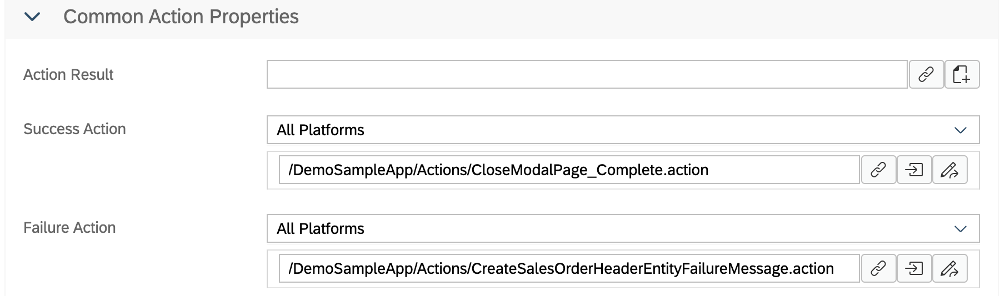

8. Now, that the `SalesOrderHeaders_CreateEntity.action` has been created, you will need to call this action when the end-user presses the **Save** button. You will add a **Save** button on the `SalesOrderHeaders_Create.page` and link it to the `SalesOrderHeaders_CreateEntity.action`.

    In `SalesOrderHeaders_Create.page`, **drag and drop** an **Action Bar Item** to the upper right corner of the action bar.

    !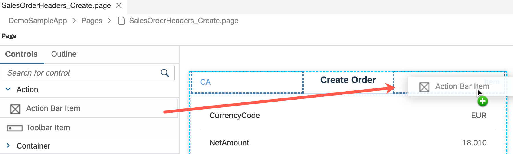

    Click the **link** icon to open the object browser for the **System Item** property.

    Double click the **Save** type and click **OK**.

    !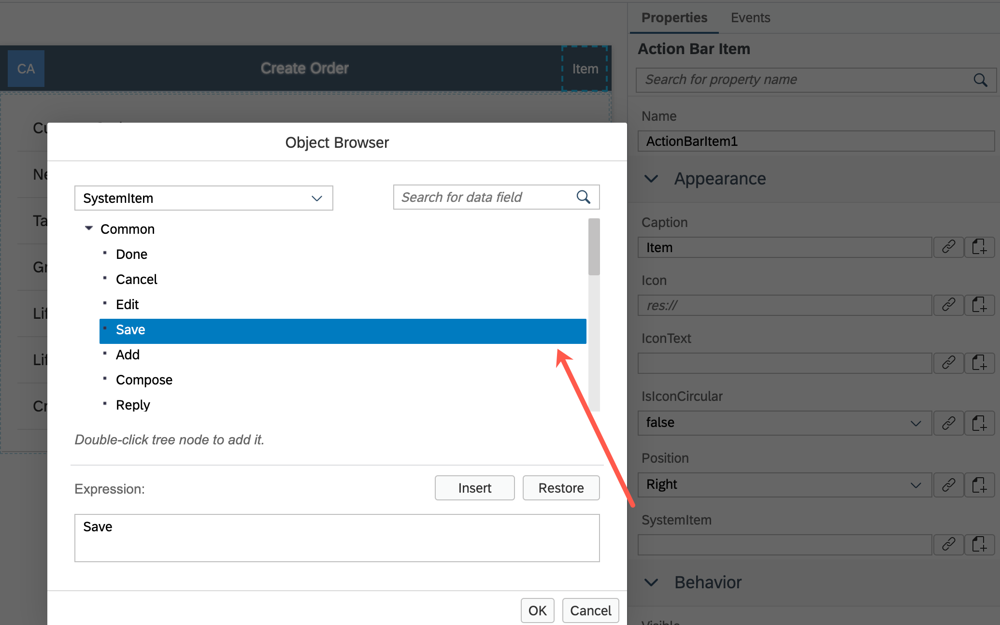

    In the Properties pane | **Events** tab, click the 3 dots icon for the `OnPress` property to open the **Object Browser**, bind it to `SalesOrderHeaders_CreateEntity.action`.

    !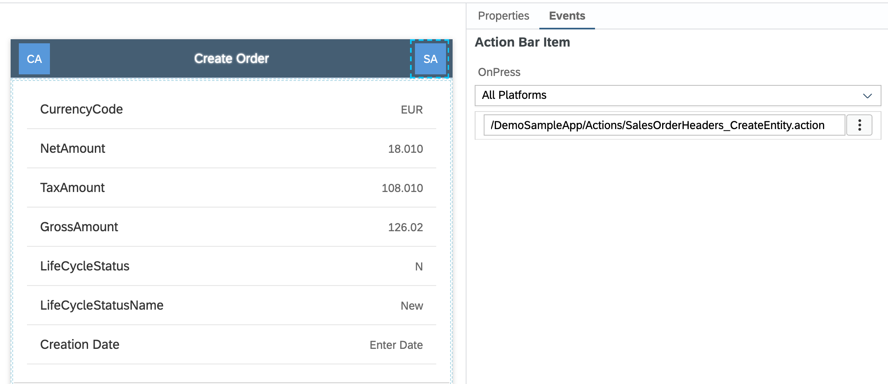

[VALIDATE_1]
[ACCORDION-END]

[ACCORDION-BEGIN [Step 6: ](Add data subscription to Customer detail page)]

In `Customers_Detail.page` you added total number of order counts for a given customer. When a new `SalesOrder` is created, this count doesn't get updated automatically unless you navigate back and forth to this page.

> `DataSubscriptions` : it is a way to listen to data changes that when triggers should cause a UI element to redraw. If your control or section has a target, that target is automatically subscribed for data change events. Otherwise you can also explicitly subscribe to `DataSubscriptions` by specifying an entity set name or `readLink` in an array. You can find more details [here](https://help.sap.com/doc/69c2ce3e50454264acf9cafe6c6e442c/Latest/en-US/docs-en/reference/schemadoc/definitions/DataSubscriptions.schema.html).

In `Customers_Detail.page`, select **Customer Orders** Object Table control. In **Properties** section, click **+** icon under **Misc** | `DataSubscriptions` and double click `SalesOrderHeaders` and click **OK**.

!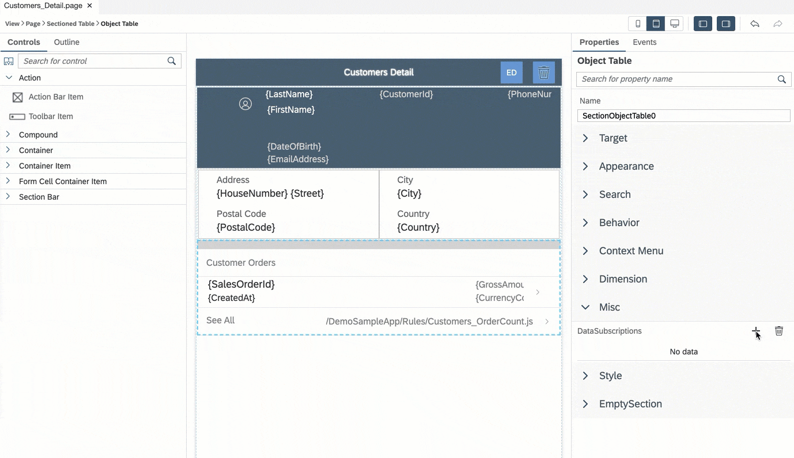

[DONE]
[ACCORDION-END]

[ACCORDION-BEGIN [Step 7: ](Deploy the application)]

Deploy the updated application to your MDK client.

1. Right-click `Application.app` and select **MDK: Deploy**.

    !

2. Select deploy target as **Mobile & Cloud**.

    !

    You should see success message for both deployments.

    !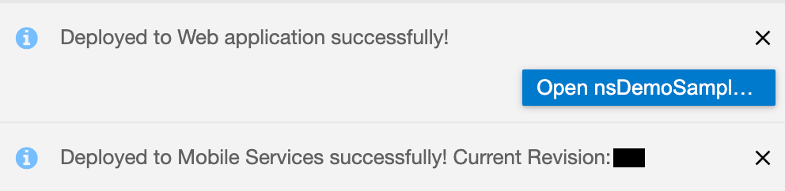

    >Alternatively, you can select *MDK: Redeploy* in the command palette (View menu>Find Command OR press Command+Shift+p on Mac OR press Ctrl+Shift+P on Windows machine), it will perform the last deployment.

    >!

[DONE]
[ACCORDION-END]

[ACCORDION-BEGIN [Step 8: ](Run the app)]

>Make sure you are choosing the right device platform tab above.

[OPTION BEGIN [Android]]

1. Re-launch the app on your device, you may asked to authenticate with passcode or Biometric authentication. You will see a confirmation pop-up, tap **OK**.

2. Tap **Customer List**, tap one of the available customer record, you will then navigate to Customer detail page.

3. You will see the **Create Order** option in customer detail page. Tap it to create a new sales order.

    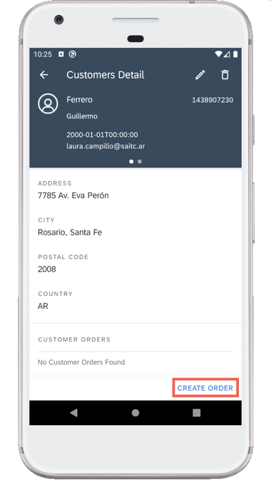

4. As you provided default values to the properties, you may change it if required. Tap **save** icon.

    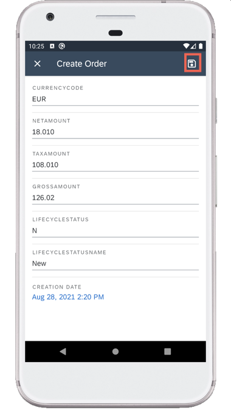

    Now, you will notice that new record has been created and count value for **See All** is now increased by one as you implemented in step 6.

    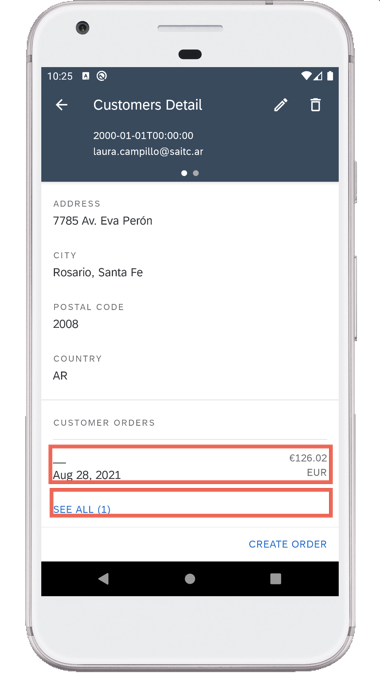

5. On Main page, tap **Sync** to send local changes to the backend, a successful message will be shown.

    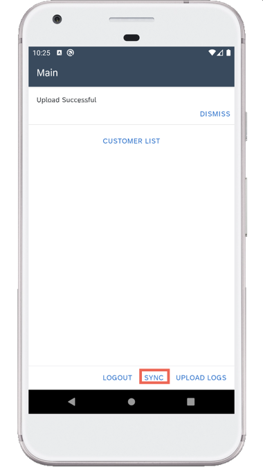
    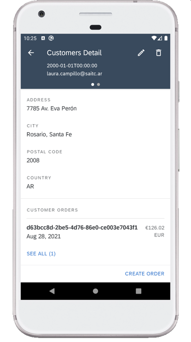

[OPTION END]

[OPTION BEGIN [iOS]]

1. Re-launch the app on your device, you may asked to authenticate with passcode or Biometric authentication. When you see a confirmation pop-up, tap **OK**.

2. Tap **Customer List**, tap one of the available customer record,  you will then navigate to Customer detail page.

3. You will see the **Create Order** option in customer detail page. Tap on it to create a new sales order.

    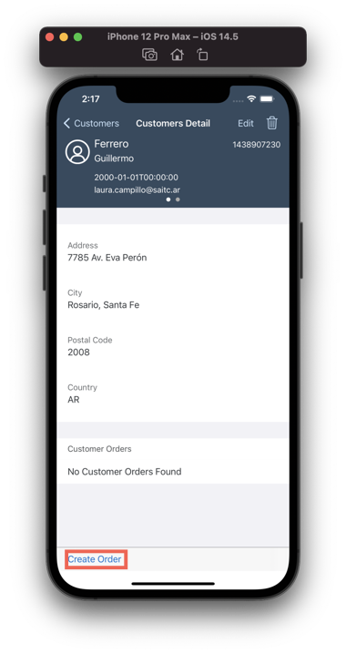

4. As you provided default values to the properties, you may change it if required. Tap **Save**.

    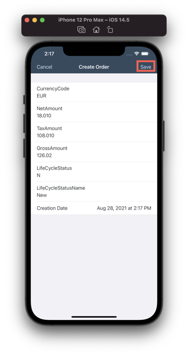

    Now, you will notice that new record has been created and count value for **See All** is increased by one as you implemented in step 6.

    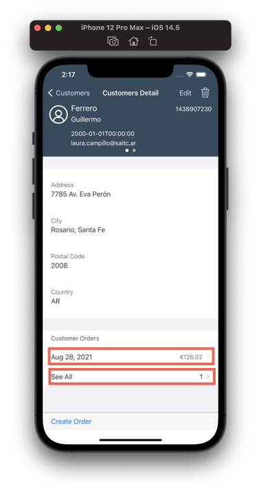

5. On Main page, tap **Sync** to send local changes to the backend, a successful message will be shown.

    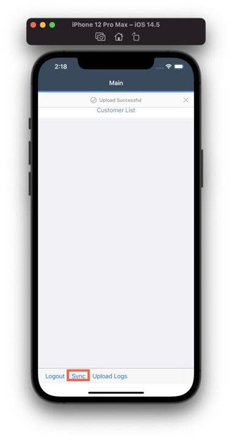  
    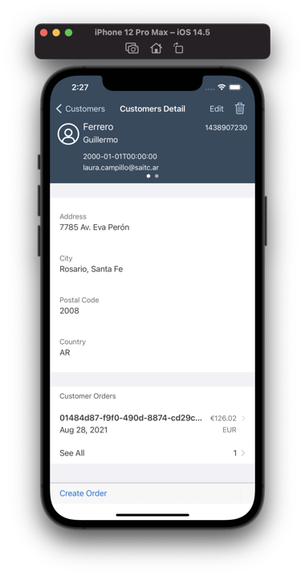  

[OPTION END]

[OPTION BEGIN [Web]]

1. Either click the highlighted button or refresh the web page to load the changes.

    !

    >If you see the error `404 Not Found: Requested route ('xxxxx-dev-nsdemosampleapp-approuter.cfapps.xxxx.hana.ondemand.com') does not exist.` while accessing the web application, make sure that in your space cockpit, highlight applications are in started state.

    >!

2. Click **Customer List** | click one of the available customer record,  you will then navigate to Customer detail page.

3. You will see the **Create Order** option in customer detail page. Click it to create a new sales order.

    !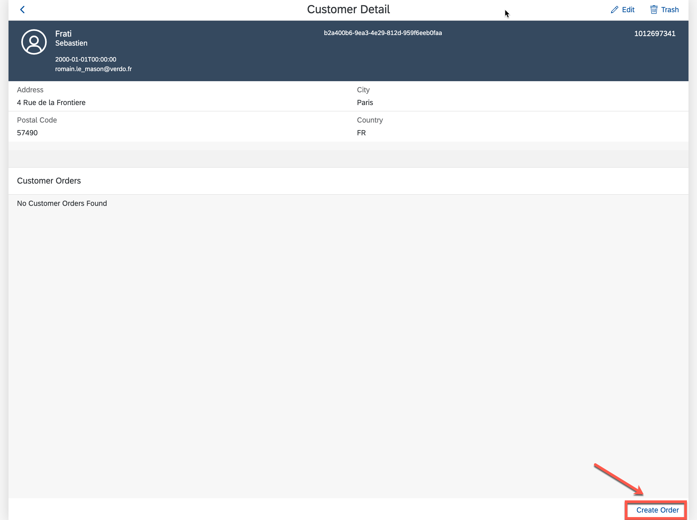

4. As you provided default values to the properties, you may change it if required. Click **Save**.

    !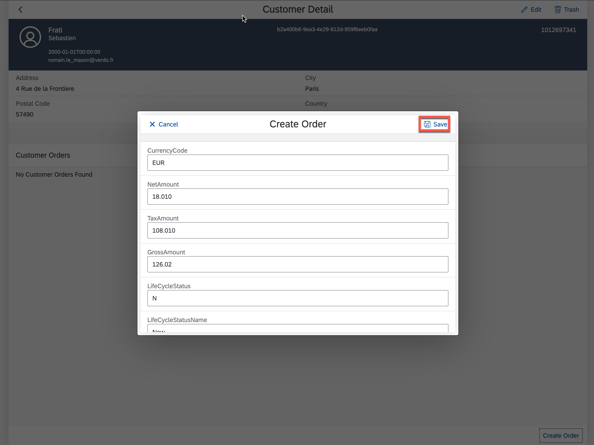

    Now, you will notice that new record has been created and count value for **See All** is increased by one as you implemented in step 6.

    !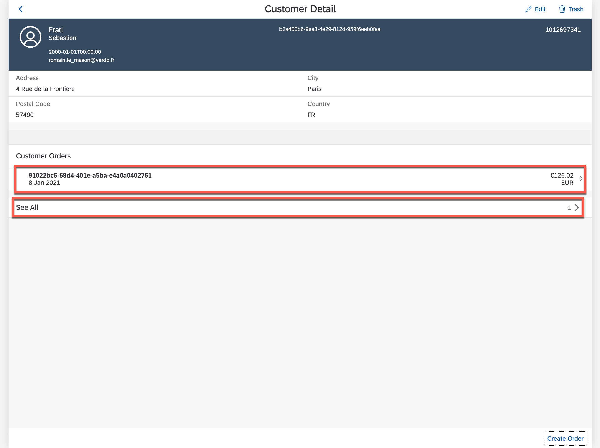

[OPTION END]

Once you complete this tutorial, you can continue with [Level Up with the Mobile Development Kit](mission.mobile-dev-kit-level-up) mission.

[VALIDATE_4]
[ACCORDION-END]

---
