## Details
### You will learn
  - How to create a new page and add some controls to display customer information
  - How to navigate from one page to another page

---

To enhance your MDK app with customer list information, you need to carry out the following tasks:

*  Create a new customer list page
*  Add Contact Cell Table control to the page
*  Create a new navigation action to the customer list page
*  Add a new button on main page and navigate to customer list page when user clicks it
*  Deploy app metadata to SAP Cloud Platform Mobile Services
*  Update the app with new changes

[ACCORDION-BEGIN [Step 1: ](Create a new page for displaying customer list)]

This page is a searchable list that displays all customers.

To create the Customer List page, you will create a **Section page** and drag the Customer **Contact Cell Table** control onto the page. In the property palette, you will link the control to the Customer Collection and then map data and actions to different areas of the cell object in the property palette. One nice feature about the **Contact Cell Table** control is that it has icons that can activate device functionality such as phone, email, video and more.

In SAP Web IDE project, right-click on the **Pages** | **New MDK Page** | **Section Page** | **Next**.

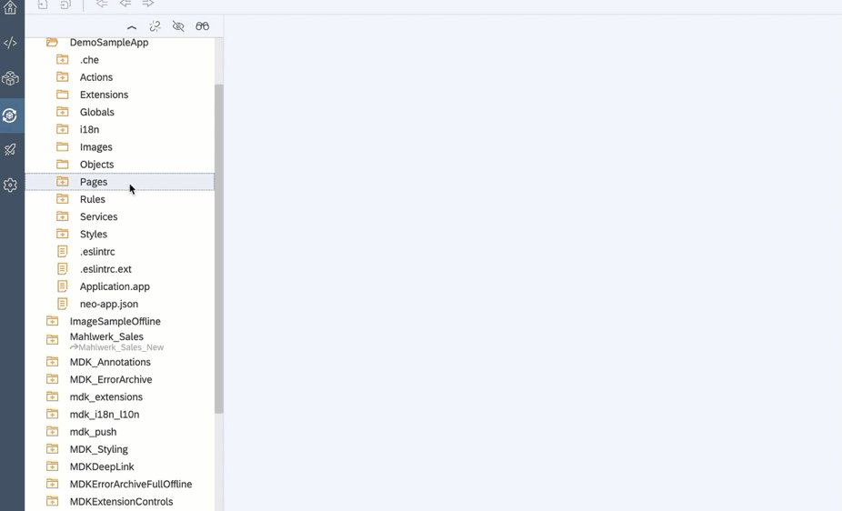

>You can find more details about [section page](https://help.sap.com/viewer/977416d43cd74bdc958289038749100e/Latest/en-US/65c0ed1f448346cb89fa84992dc5df9c.html).

Enter the **Page Name** `Customers_List` and click **Next** and the **Finish** on the confirmation step.

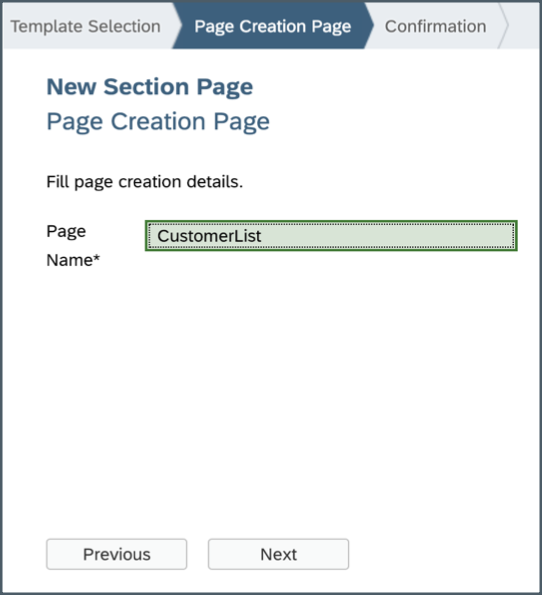

In the **Properties** pane, set the **Caption** to **Customers**.

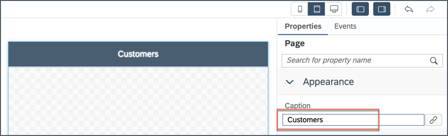

In the Layout Editor, expand the **Controls** | **Compound** section, drag and drop the **Contact Cell Table** control onto the Page area.

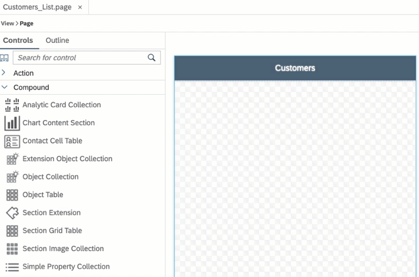

>A **Compound** control contains a group of other controls. Unlike in a container control where you can add your own child controls (container items), the child controls in a compound control are fixed. You can populate each of its child control by defining its data binding, depending on which the child controls are created.

In the Properties pane, select the previously added service from the **Service** drop down and then select **Customers** Entity Set from the dropdown. This way, the _Object Table_ has been bound to **Customers** Entity.

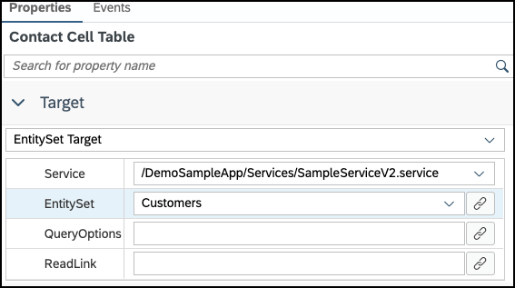

In the **Properties** pane, click the **link icon** to open the Object Browser for the **Description** property.

Double click on the `City` property of the Customer entity to set it as the binding expression and click **OK**.

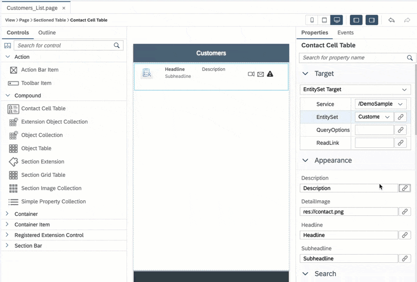

>Be careful **not** to select `City` from `Address (ESPM.Address)`.

>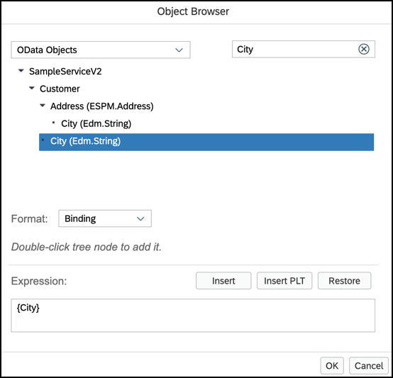

Repeat the above steps for `Headline` and `Subheadline` properties binding to `FirstName` and `City` properties of the Customer entity respectively.

You should have final results as below.

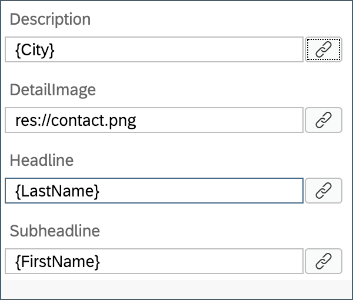

In the **Search** section of the Properties pane, change both the **Search Enabled** property and **Barcode Scanner** property to **true**.

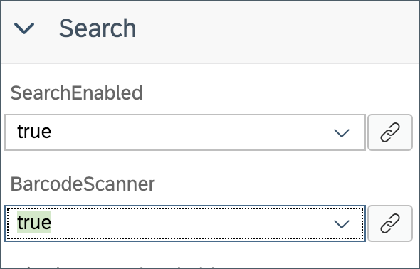

In the **Activity Items** section of the Properties pane, change `VideoCall` on the first activity to **Phone**.

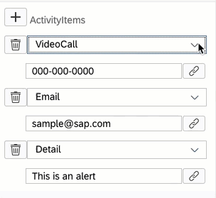

Click the **link icon** to open the Object browser for the **Phone** activity and bind it to the `PhoneNumber` property of the Customer entity.

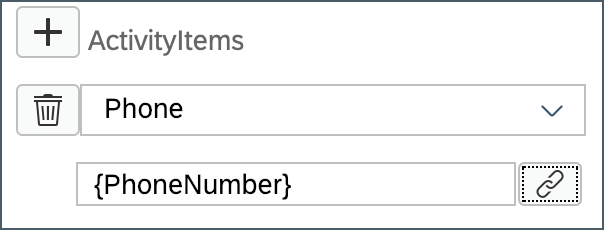

Repeat the above step for **Email** activity and bind it to `EmailAddress` property of the Customer entity.

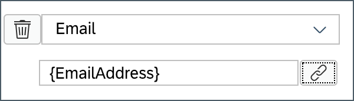

Click the **trash** can icon for the Detail activity to remove it from the Activity list.

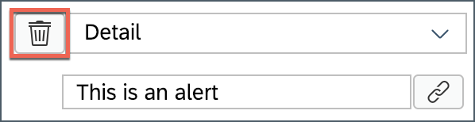

Save your changes to the `Customers_List.page`.

[DONE]
[ACCORDION-END]

[ACCORDION-BEGIN [Step 2: ](Create navigation action)]

Now, you will create a Navigation action that opens the `Customers_List.page` when called.

Right-click on the **Actions** folder | **New MDK Action** | choose **MDK UI Actions** in **Category** | click **Navigation Action** | **Next**.

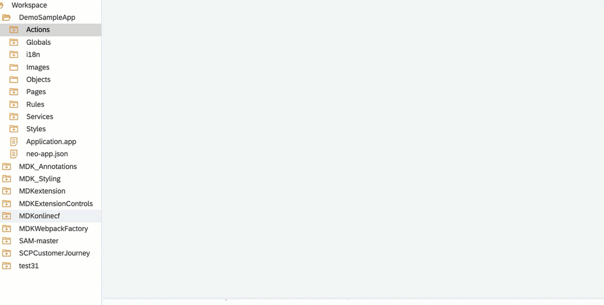

Provide the below information:

| Field | Value |
|----|----|
| `Action Name`| `NavToCustomers_List` |
| `Page to Open` | select `Customers_List.page` |

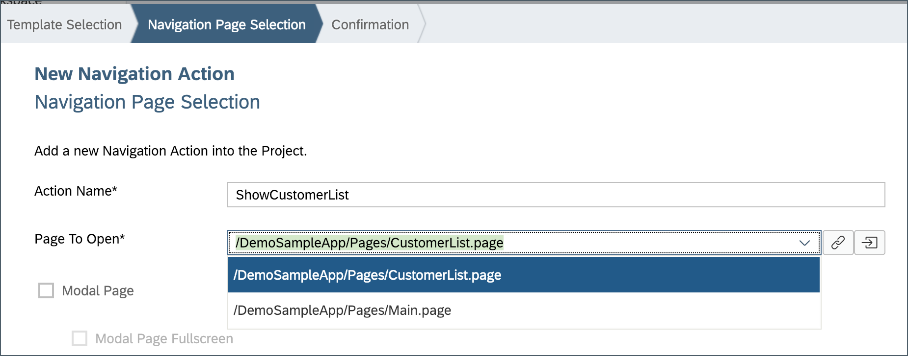

Click **Next** and then **Finish** on the confirmation step.

[DONE]
[ACCORDION-END]

[ACCORDION-BEGIN [Step 3: ](Add a button to view customer list)]

Now that the Customer List page is created, you will add a button to the Main page to display the Customers. You will use a **Section Button Table** control.

In `Main_page`, drag and drop the **Section Button Table** container control onto the Page.

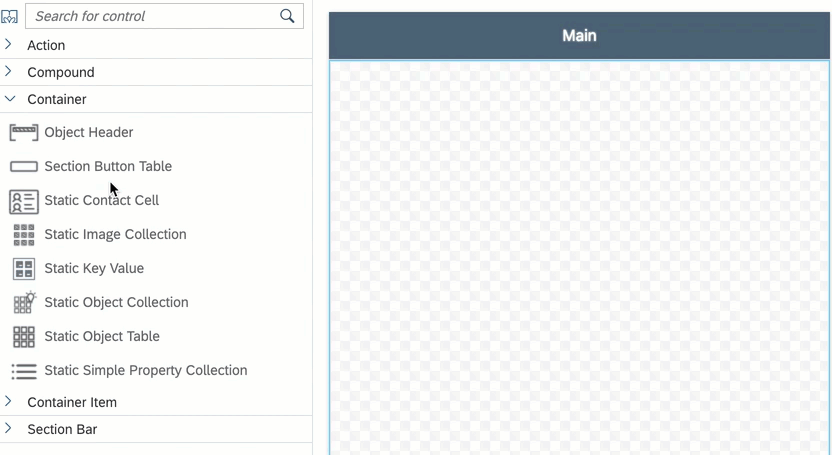

>**Container** includes controls that act as containers for other controls, such as container items. A container is constant for all pages. The size of a container depends on the controls and contents included inside.

Expand the **Container Item** section of the Controls palette.

Drag and drop a **Section Button** onto the Section Button Table container on the page.

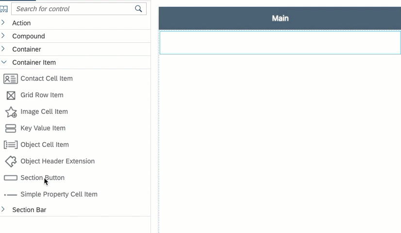

>Each container type in a Section Page can contain specific controls (container items).

>You can find more details about [Container and Container Item](https://help.sap.com/viewer/977416d43cd74bdc958289038749100e/Latest/en-US/65c0ed1f448346cb89fa84992dc5df9c.html).

In the Properties pane, set the **Title** of the button to **Customer List**.

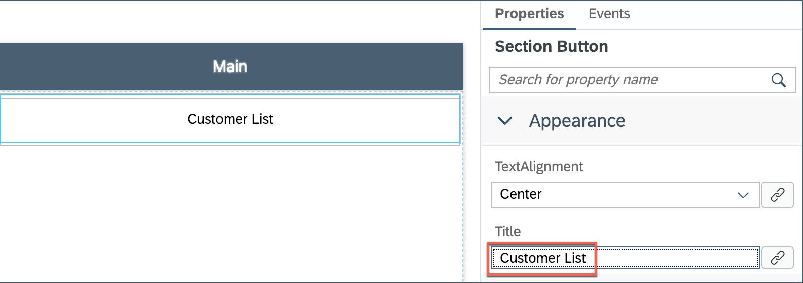

Under **Events** tab, click the **link icon** for the `OnPress` Handler property to open the Object Browser.

Double Click on the `NavToCustomers_List` action and click **OK** to set it as the `OnPress` Handler Action.

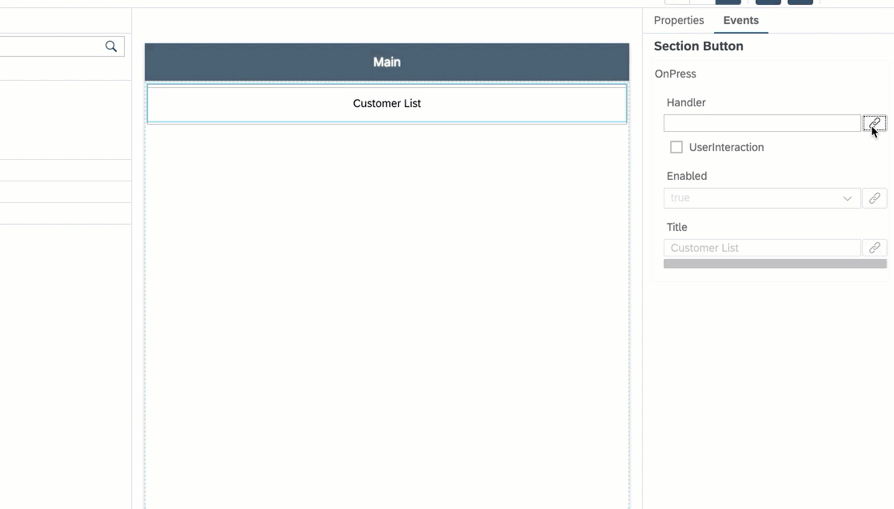

Save the changes to the `Main_page`.

[DONE]
[ACCORDION-END]

[ACCORDION-BEGIN [Step 4: ](Deploy and activate the application)]

Deploy the updated application to your MDK client.

Right-click on the `DemoSampleApp` MDK Application in the project explorer pane and select **MDK Deploy and Activate**.

Since we have deployed already both the destination and app id should be pre-selected based on the last time you deployed our application.  Confirm the **Destination Name** is `mobileservices_cf` and the **Application Id** is `com.sap.mdk.demo` and click **Next**.

[VALIDATE_1]
[ACCORDION-END]

[ACCORDION-BEGIN [Step 5: ](Test the application)]

>Make sure you are choosing the right device platform tab above.

[OPTION BEGIN [Android]]

Re-launch the app on your device, you may asked to authenticate with passcode or Fingerprint. You will see a _Confirmation_ pop-up, tap **OK**.

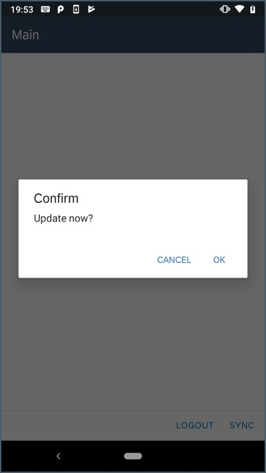

You will notice, newly added button on the main page. Tap **CUSTOMER LIST**.

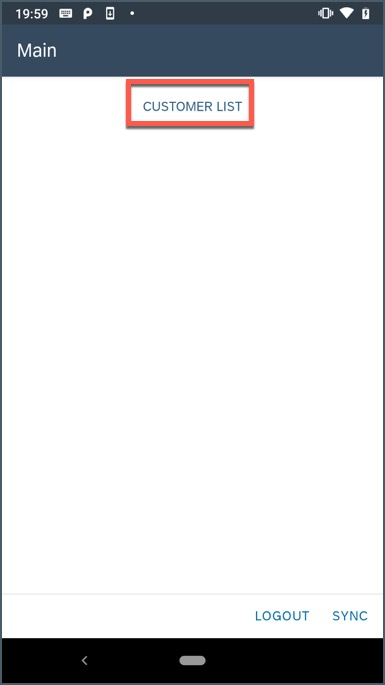

Here, you will see list of all the Customers. You can search a record by by First Name or Last Name or City. Controls are rendered natively on device, you can email to the customer, make a phone call etc.

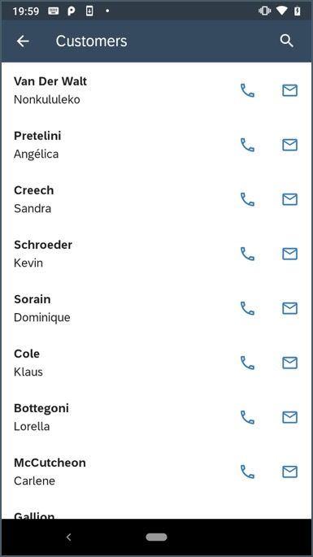

[OPTION END]

[OPTION BEGIN [iOS]]

Re-launch the app on your device, you may asked to authenticate with passcode or Touch ID. You will see a _Confirmation_ pop-up, tap **OK**.

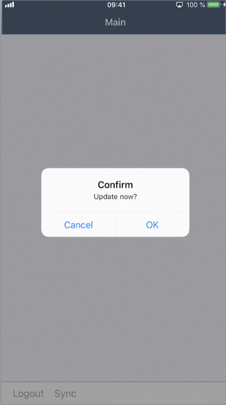

You will notice, newly added button on the main page. Tap **Customer List**.

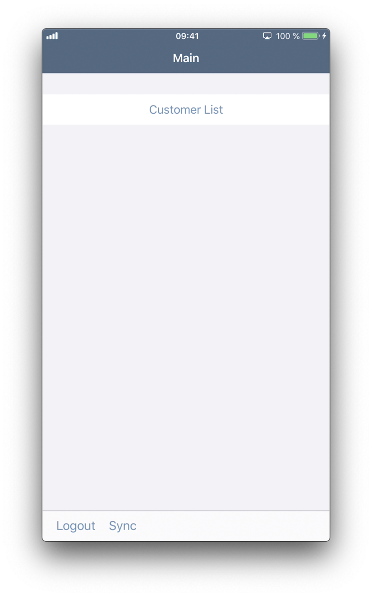

Here, you will see list of all the Customers. You can search a record by by First Name or Last Name or City. Controls are rendered natively on device, you can email to the customer, make a phone call etc.

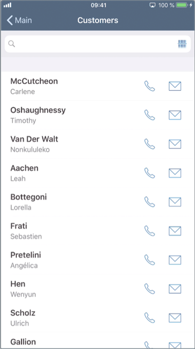

>Here, you may notice that **City** is not showing up on screen, this is by design. Since in portrait mode, the device width is considered _compact_ , if you change device orientation to landscape mode, you will see **City**.

>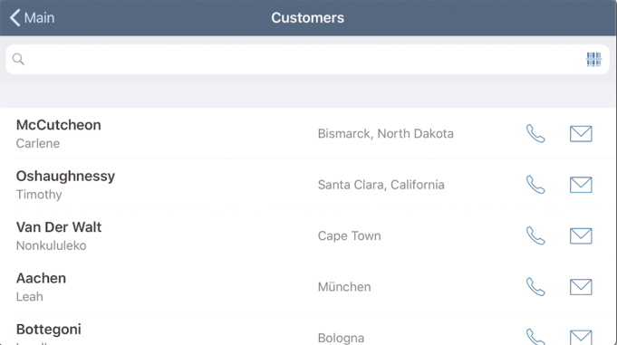

>If it was an iPad (where both portrait and landscape are considered _regular_ instead of _compact_) you would see **City** on either orientation.

[OPTION END]

[DONE]
[ACCORDION-END]

---
