## Details
### You will learn
  - How to create a new page and add some controls to display customer information
  - How to navigate from one page to another page

---

To enhance your MDK app with customer list information, you need to carry out the following tasks:

*  Create a new customer list page
*  Add Contact Cell Table control to the page
*  Create a new navigation action to the customer list page
*  Add a new button on main page and navigate to customer list page when user clicks it
*  Deploy the app metadata to SAP Mobile Services & Cloud Foundry
*  Update the app with new changes

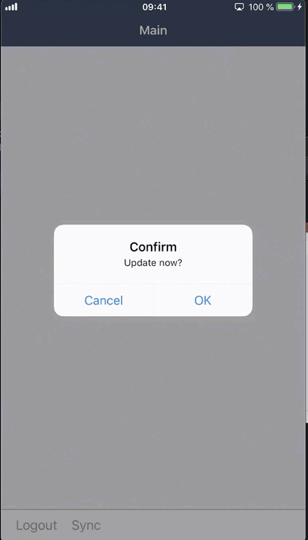

[ACCORDION-BEGIN [Step 1: ](Create a new page for displaying customer list)]

This page is a searchable list that displays all customers.

To create the Customer List page, you will create a **Section page** and drag the Customer **Contact Cell Table** control onto the page. In the property palette, you will link the control to the Customer Collection and then map data and actions to different areas of the cell object in the property palette. One nice feature about the **Contact Cell Table** control is that it has icons that can activate device functionality such as phone, email, video and more.

1. In SAP Business Application Studio project, right-click the **Pages** | **MDK: New Page**.

    !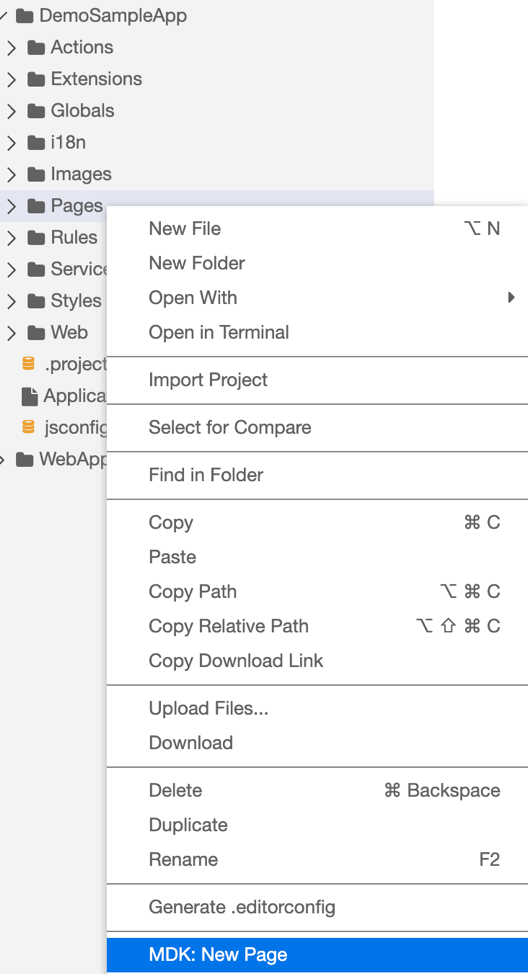

2. Select | **Section Page** and click **Next**.

    !

    >You can find more details about [Section Page](https://help.sap.com/doc/f53c64b93e5140918d676b927a3cd65b/Cloud/en-US/docs-en/guides/features/fiori-ui/mdk/section-page.html).

3. Enter the **Page Name** `Customers_List` and click **Next** and the **Finish** on the confirmation step.

    !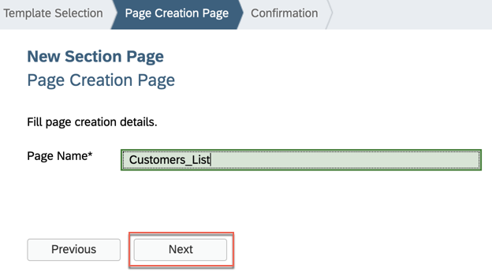

4. In the **Properties** pane, set the **Caption** to **Customers**.

    !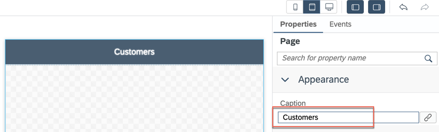

5. In the Layout Editor, expand the **Controls** | **Data Bound Container** group, drag and drop the **Contact Cell Table** control onto the Page area.

    !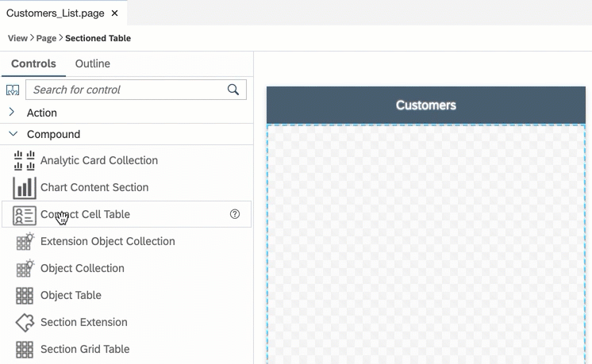

6. In the Properties pane, provide the below information:

    | Field | Value |
    |----|----|
    | `Service`| Select `SampleServiceV2.service` from the dropdown |
    | `EntitySet` | Select `Customers` from the dropdown |
    | `QueryOptions` | `$orderby=LastName` |

    !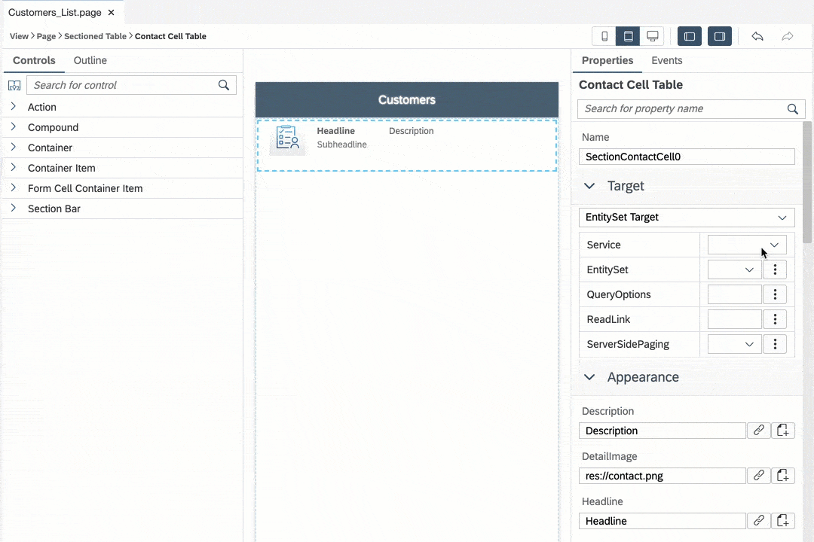

7. In the **Properties** pane, click the **link icon** to open the Object Browser for the **Description** property. Double click the `City` property of the Customer entity to set it as the binding expression and click **OK**.

    !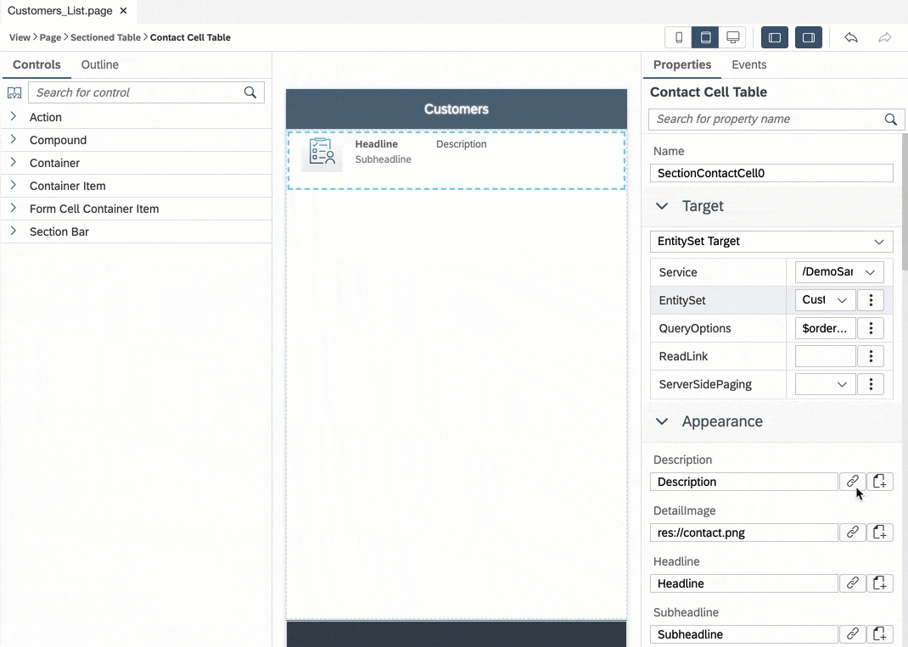

    >Be careful **not** to select `City` from `Address (ESPM.Address)`.

    >!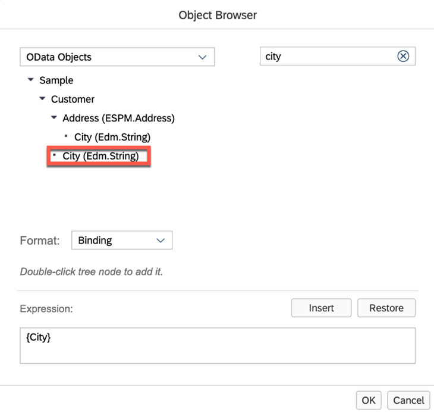

8. Remove the default value for the `DetailImage` property. Repeat the above steps for `Headline` and `Subheadline` properties binding to `LastName` and `FirstName` properties of the Customer entity respectively.

    You should have final results as below.

    !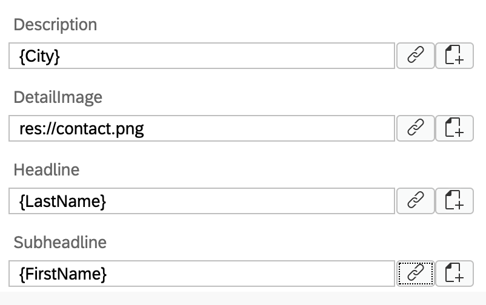

9. In the **Search** section of the Properties pane, change both the **Search Enabled** property and **Barcode Scanner** property to **true**.

    !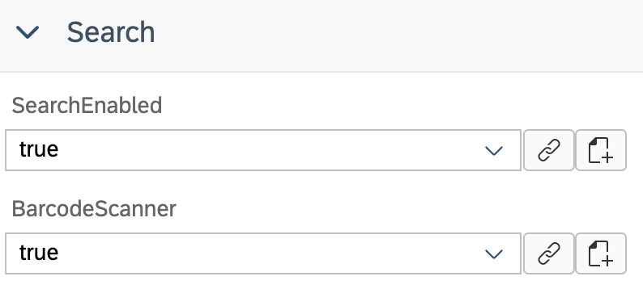

10. In the **Activity Items** section of the Properties pane, click **Add** to add a new activity item.

    !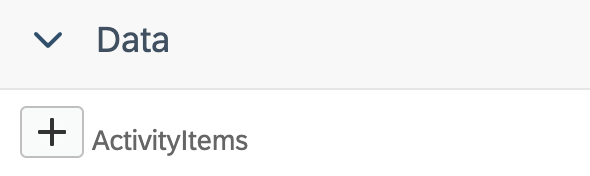

11. Expand the added item, click the 3 dots icon to open the Object browser to bind the `ActivityValue` to the `PhoneNumber` property of the Customer entity.

    !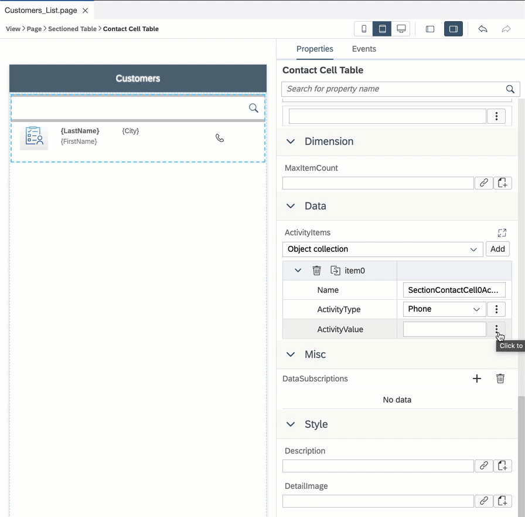

12. Similarly, add one more activity item, select **Email** from the dropdown and bind it to `EmailAddress` property of the Customer entity.

    !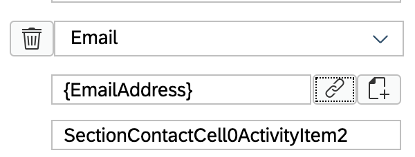

[VALIDATE_2]
[ACCORDION-END]

[ACCORDION-BEGIN [Step 2: ](Create navigation action)]

Now, you will create a Navigation action that opens the `Customers_List.page` when called.

1. In SAP Business Application Studio project, right-click the **Actions** | **MDK: New Action**.

    !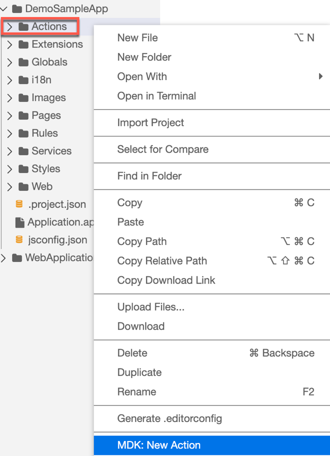

2. Choose **MDK UI Actions** in **Category** | click **Navigation Action** | **Next**.

    !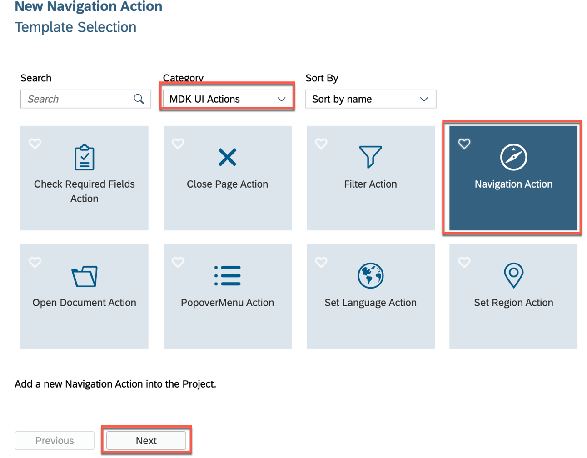

2. Provide the below information:

    | Field | Value |
    |----|----|
    | `Action Name`| `NavToCustomers_List` |
    | `PageToOpen` | Select `Customers_List.page` from the dropdown |

    !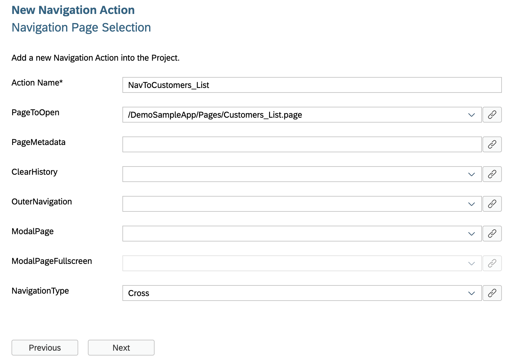

3. Click **Next** and then **Finish** on the confirmation step.

[DONE]
[ACCORDION-END]

[ACCORDION-BEGIN [Step 3: ](Add a button to view customer list)]

Now, that the Customer List page is created, you will add a button to the Main page to display the Customers. You will use a **Button Table** control.

1. In `Main.page`, expand the **Controls** | **Static Container** group, drag and drop the **Button Table** control onto the Page area.

    !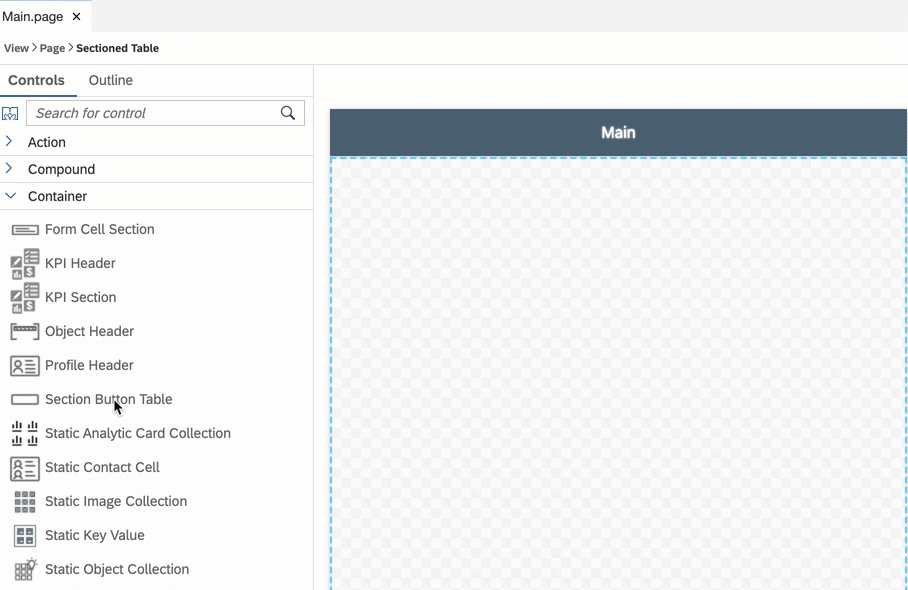

    >**Container** includes controls that act as containers for other controls, such as container items. A container is constant for all pages. The size of a container depends on the controls and contents included inside.

2. Expand the **Static Items** section of the Controls palette.

    Drag and drop a **Button** onto the Button Table container on the page.

    !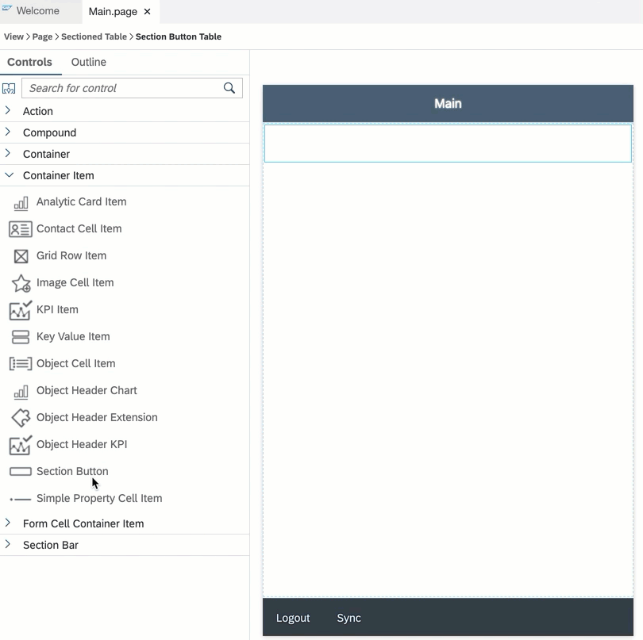

    >Each static container type in a Section Page can contain specific controls (static items).

    >You can find more details about [Container and Container Item](https://help.sap.com/doc/69c2ce3e50454264acf9cafe6c6e442c/Latest/en-US/docs-en/reference/schemadoc/Page/SectionedTable/SectionedTable.schema.html).

3. In the Properties pane, set the **Title** of the button to **Customer List**.

    !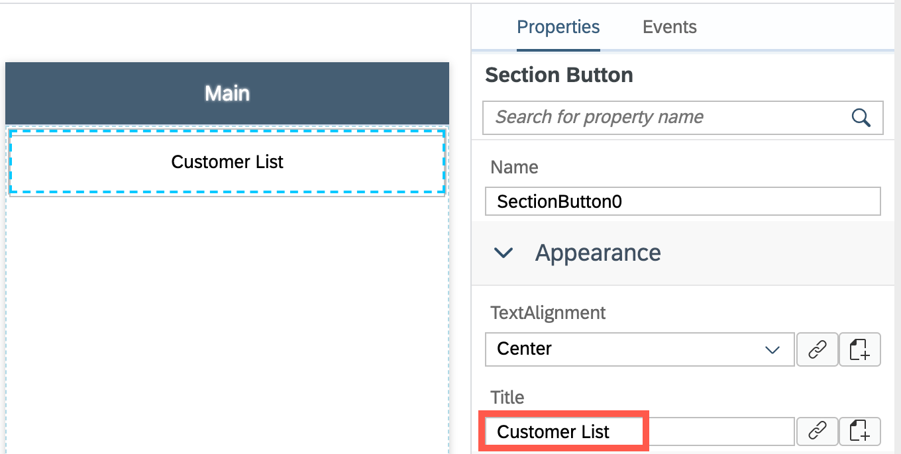

4. Under **Events** tab, click the **link icon** for the `OnPress Handler` property to open the Object Browser. Double click the `NavToCustomers_List` action and click **OK** to set it as the `OnPress Handler` Action.

    !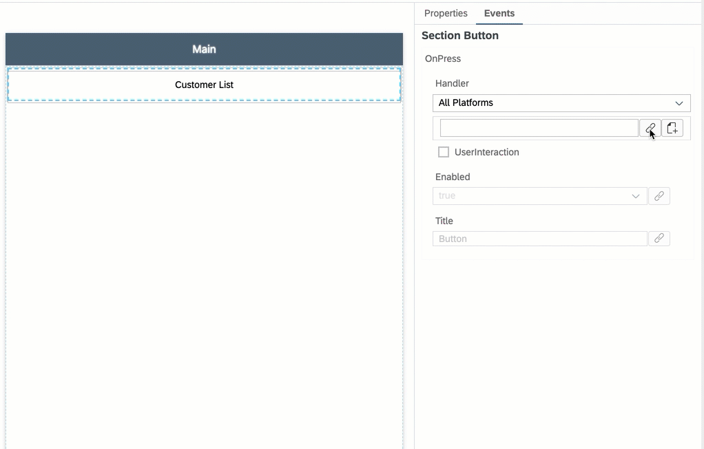

[DONE]
[ACCORDION-END]

[ACCORDION-BEGIN [Step 4: ](Deploy the application)]

Deploy the updated application to your MDK client.

1. Right-click `Application.app` and select **MDK: Deploy**.

    !

2. Select deploy target as **Mobile & Cloud**.

    !

    You should see success message for both deployments.

    !

    >Alternatively, you can select *MDK: Redeploy* in the command palette (View menu>Find Command OR press Command+Shift+p on Mac OR press Ctrl+Shift+P on Windows machine), it will perform the last deployment.

    >!

[VALIDATE_1]
[ACCORDION-END]

[ACCORDION-BEGIN [Step 5: ](Run the app)]

>Make sure you are choosing the right platform tab above.

[OPTION BEGIN [Android]]

1. Re-launch the app on your device, you may asked to authenticate with passcode or Biometric authentication. You will see a _Confirmation_ pop-up, tap **OK**.

    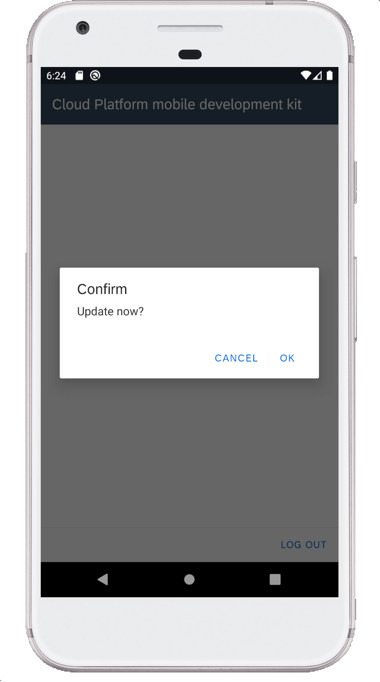

2. You will notice, newly added button on the main page. Tap **Customer List**.

    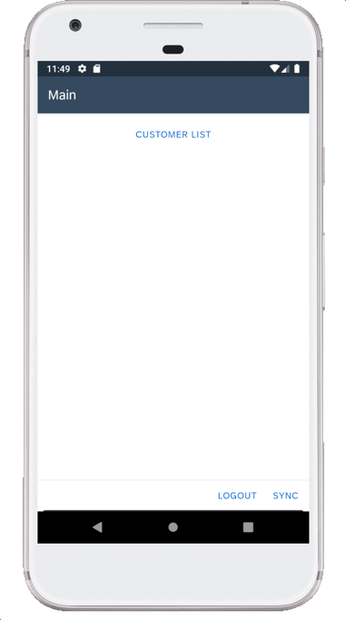

    Here, you will see list of all the Customers. You can search a record by by First Name or Last Name or City. Controls are rendered natively on device, you can email to the customer, make a phone call etc.

    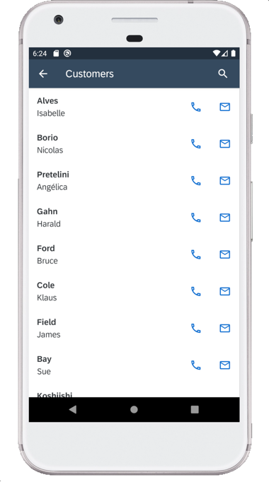

    >Here, you may notice that City is not showing up on screen, this is by design. In portrait mode, the device width is considered compact, if it was a tablet device (where both portrait and landscape are considered regular instead of compact) you would see City on either orientation.

[OPTION END]

[OPTION BEGIN [iOS]]

1. Re-launch the app on your device, you may asked to authenticate with passcode or Biometric authentication. You will see a _Confirmation_ pop-up, tap **OK**.

    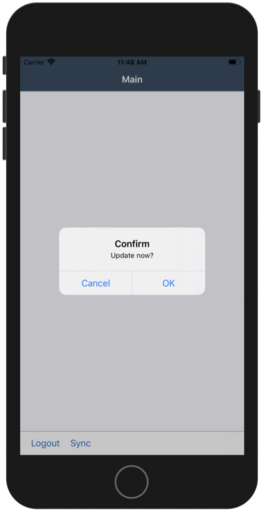

2. You will notice, newly added button on the main page. Tap **Customer List**.

    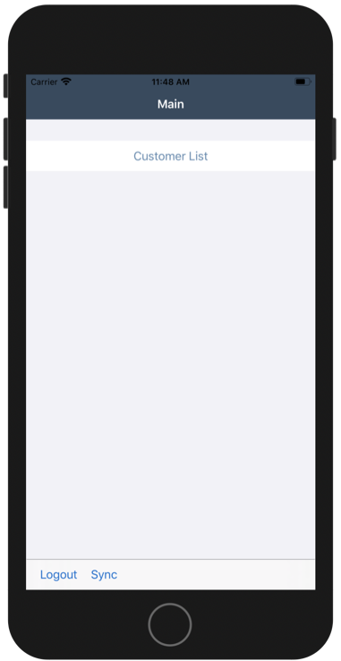

    Here, you will see list of all the Customers. You can search a record by by First Name or Last Name or City. Controls are rendered natively on device, you can email to the customer, make a phone call etc.

    

    >Here, you may notice that **City** is not showing up on screen, this is by design. In portrait mode, the device width is considered _compact_ , if you change device orientation to landscape mode, you will see **City**.

    >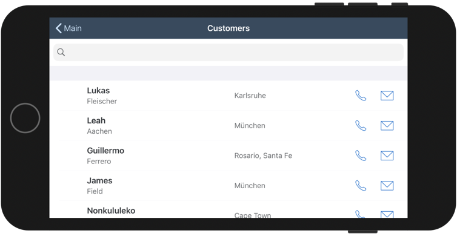

    >If it was an iPad (where both portrait and landscape are considered *regular* instead of *compact*) you would see **City** on either orientation.

[OPTION END]

[OPTION BEGIN [Web]]

1. Either click the highlighted button or refresh the web page to load the changes.

    !

    >If you see the error `404 Not Found: Requested route ('xxxxx-dev-nsdemosampleapp-approuter.cfapps.xxxx.hana.ondemand.com') does not exist.` while accessing the web application, make sure that in your space cockpit, highlight applications are in started state.

    >!

2. You will notice, newly added button on the main page. Click **Customer List**.

    !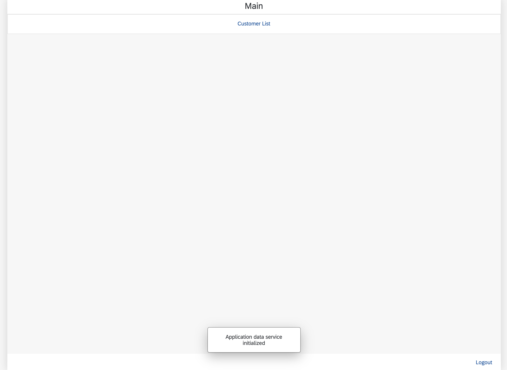

    Here, you will see list of all the Customers. You can search (case-sensitive) a record by by First Name or Last Name or City. The rendered Controls are UI5 web components, you can email to the customer, make a phone call etc.

    !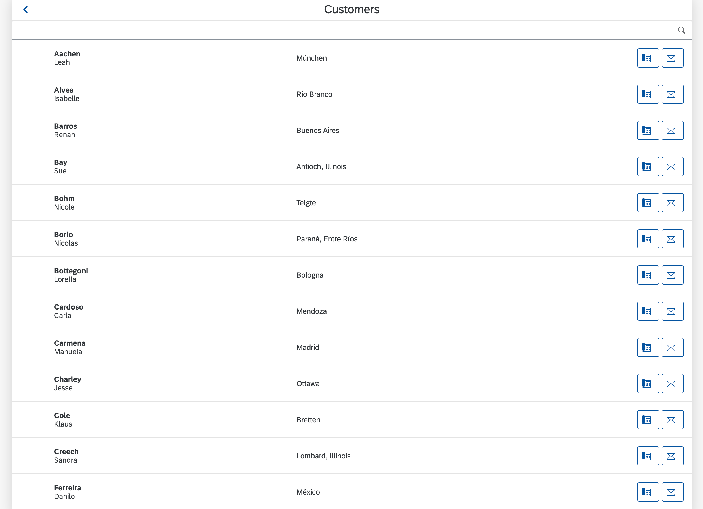

[OPTION END]

[VALIDATE_3]
[ACCORDION-END]

---
