## Prerequisites
- **Tutorial**: [Set Up for the Mobile Development Kit (MDK)](group.mobile-dev-kit-setup)
- **Download and install:** **SAP Mobile Services Client** on your [iOS](https://apps.apple.com/us/app/sap-mobile-services-client/id1413653544) device (If you are connecting to `AliCloud` accounts then you will need to brand your [custom MDK client](cp-mobile-dev-kit-build-client) by allowing custom domains.)
- **Download the latest version of Mobile Development Kit SDK** either from community [download page](https://developers.sap.com/trials-downloads.html?search=Mobile%20development%20kit) or [SAP Software Center](https://launchpad.support.sap.com/#/softwarecenter/search/Mobile%2520development%2520kit) if you are a SAP Mobile Services customer

## Details
### You will learn
  - How to register and consume an Extension control in MDK Metadata
  - How to write an extension via NativeScript
  - How to build a Mobile development kit client for iOS and Android
  - How to connect to SAP Mobile application

You may clone an existing metadata project from [GitHub repository](https://github.com/SAP-samples/cloud-mdk-tutorial-samples/tree/master/6-Create-Extension-Controls-in-Mobile-Development-Kit-Apps/3-Extend-Your-MDK-App-With-Map-Custom-Control-using-Metadata-approach) and start directly with step 5 in this tutorial.

---

To extend the functionality, or customize the look and feel, and behavior of your client app, you can create extension controls other than the already existing MDK built-in controls using **NativeScript** (TypeScript/JavaScript applicable for both Android and iOS)

In this tutorial, you will create a Map extension via NativeScript (in TypeScript language), you will view the Map in Apple Maps on iOS devices and in Google Maps on Android devices.

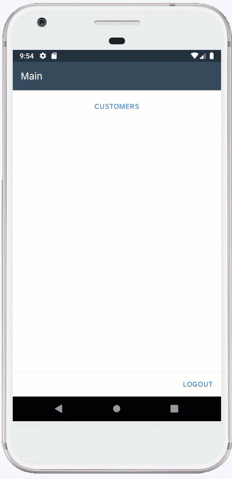

[ACCORDION-BEGIN [Step 1: ](Create a new MDK project in SAP Business Application Studio)]

This step includes creating the mobile development kit project in the editor.

1. Launch the [Dev space](cp-mobile-bas-setup) in SAP Business Application Studio.

2. Click **Start from template** on Welcome page.

    !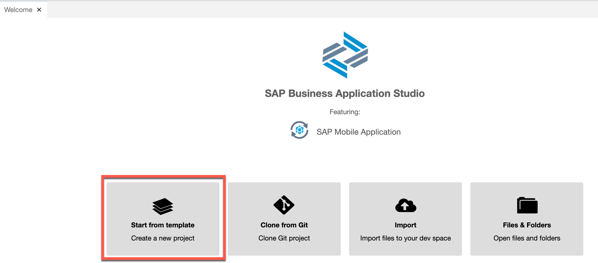

    >If you do not see Welcome page, you can access it via **Help** menu.

3. Select **MDK Project** and click **Next**.

    !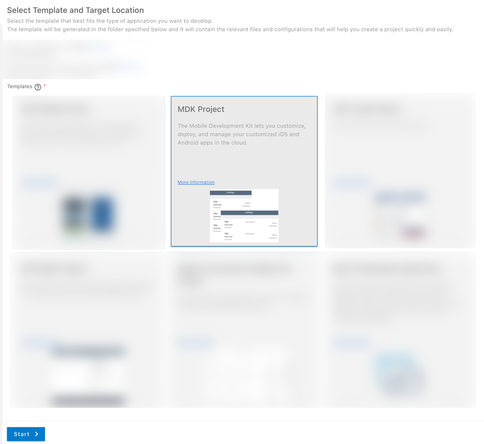

4. In *Type* step, select or provide the below information and click **Next**:

    | Field | Value |
    |----|----|
    | `MDK template type`| Select `List Detail` from the dropdown |
    | `Your project name` | `MDK_Maps` |
    | `Your application name` | <default name is same as project name, you can provide any name of your choice> |    

    !

    >If you see *Cloud foundry token expired, continue without mobile services connection?* message, then set up the Cloud Foundry environment again by navigating to **View** menu > **Find Command**> **CF: Login to Cloud foundry** to initiate a valid session and click Start Over.

5. In *Service Name* step, provide or select the below information and click **Next**:

    | Field | Value |
    |----|----|
    | `Service File Name`| `<Provide any name of your choice>` |
    | `OData Source` | Select `Mobile Services` from the dropdown |
    | `Mobile Services Landscape` | Select `standard` from the dropdown |
    | `Application Id` | Select `com.sap.mdk.demo` from the dropdown |
    | `Destination` | Select `SampleServiceV2` from the dropdown |
    | `Enter a path to the OData service` | Leave it as it is |
    | `Language URL` | Leave it with the default value |
    | `Enable Offline` | Choose `No` |  

    !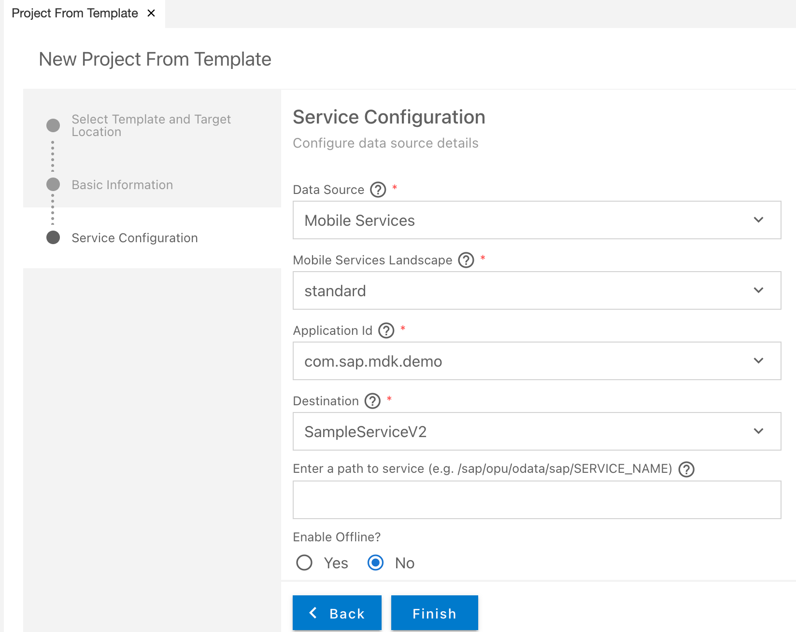

    >Regardless of whether you are creating an online or offline application, this step is needed app to connect to an OData service. When building an Mobile Development Kit application, it assumes the OData service created and the destination that points to this service is set up in Mobile Services and SAP Business Technology Platform.

    Since you will create an online based app, hence _Enable Offline Store_ option is unchecked.

6. In *Collection* step, select `Customers` (if not selected by default). Click **Next** to finish the project creation.

    !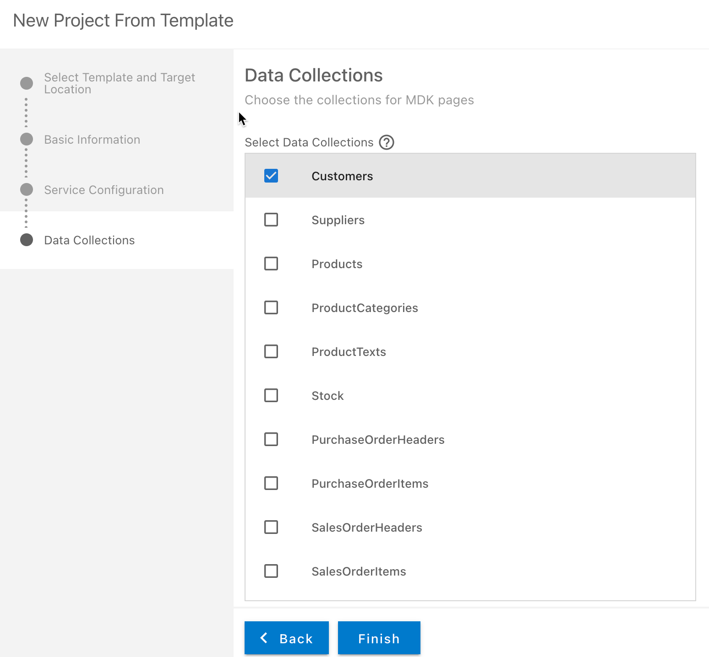    

7. After clicking **Next**, the wizard will generate your MDK Application based on your selections. You should now see the `MDK_Maps` project in the project explorer.

[DONE]
[ACCORDION-END]

[ACCORDION-BEGIN [Step 2: ](Register an Extension Control)]

The extension control that you will be creating to extend the functionality of your app can be used as base controls by registering it using the MDK editor.

1. Download [this](https://github.com/SAP-samples/cloud-mdk-tutorial-samples/blob/master/Images/map.png) image and save it locally. This image will be used as a display image on the page editor to represent the extension control.

2. Drag & drop `map.png` file on **Images** folders.

    !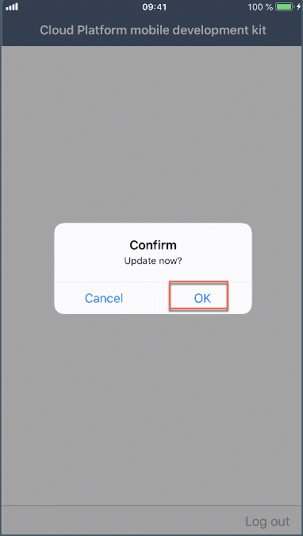

3. Right-click **Extensions** | select **MDK: Register Extension Control**.

    !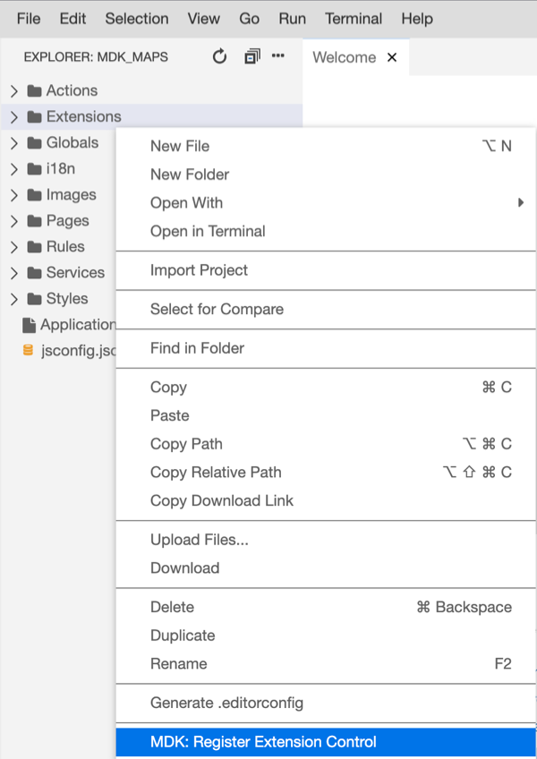

4. In `Template Selection` step, select **New and register Metadata Extension Control**. Click **Next**.

    !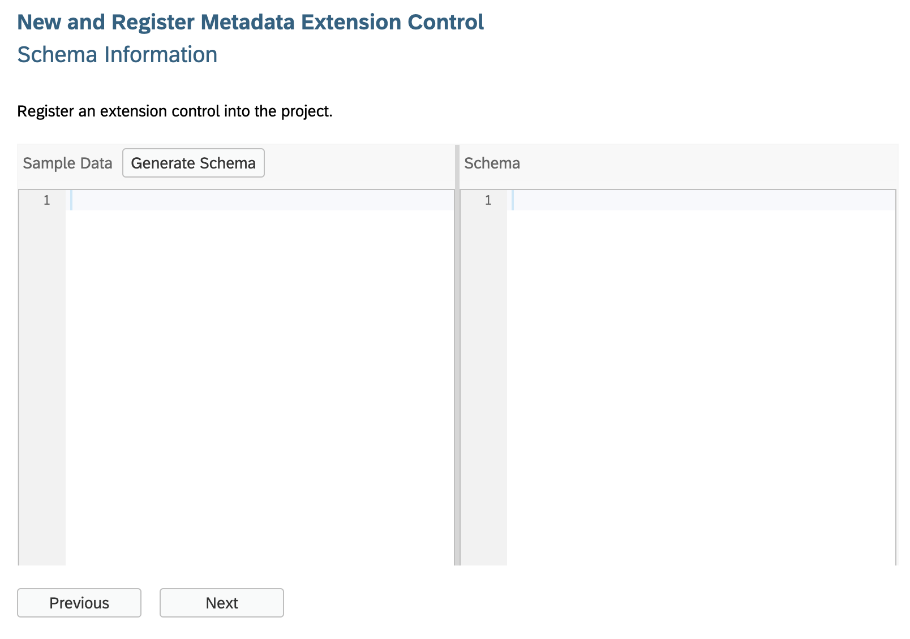

5. Provide the below information:

    | Field | Value |
    |----|----|
    | `Control Name`| `mdk_maps` |
    | `Module` | `MyMapModule` |
    | `Control` | `MyMapExtension` |
    | `Class` | `MyMapClass` |
    | `Display` | bind it to `map.png` file  |

    Here is the basic definition for properties you defined above:

    **Module**: It is used to identify the extension control.
      The path to the extension module under `<MetadataProject>/Extensions/`.

    **Control**: The name of the file under the `<MetadataProject>/Extensions/<Module>/controls` that contains the extension class. If not specified, module name would be used as the value for this property.

    **Class**: The class name of your custom extension class. The client will check for this class at runtime and if it's found, your extension will be instantiated. Otherwise, a stub with an error message will be shown.

    **Display**: This property is used for the image to be displayed on the page editor to represent the extension control.

    !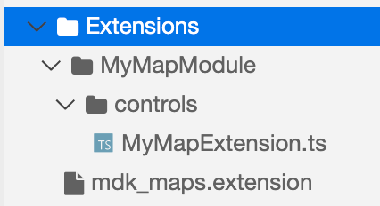

6. In **Schema Information** step, fill schema details in **Schema** column and click **Next**.

    ```JSON
    {
    	"type": "object",
    	"BindType": "",
    	"properties": {
    		"Prop": {
    			"type": "object",
    			"BindType": "",
    			"properties": {
    				"City": {
    					"type": "string",
    					"BindType": ""
    				},
    				"Country": {
    					"type": "string",
    					"BindType": ""
    				},
    				"HouseNumber": {
    					"type": "string",
    					"BindType": ""
    				},
    				"LastName": {
    					"type": "string",
    					"BindType": ""
    				},
    				"PostalCode": {
    					"type": "string",
    					"BindType": ""
    				},
    				"Street": {
    					"type": "string",
    					"BindType": ""
    				}
    			}
    		}
    	}
    }
    ```

    !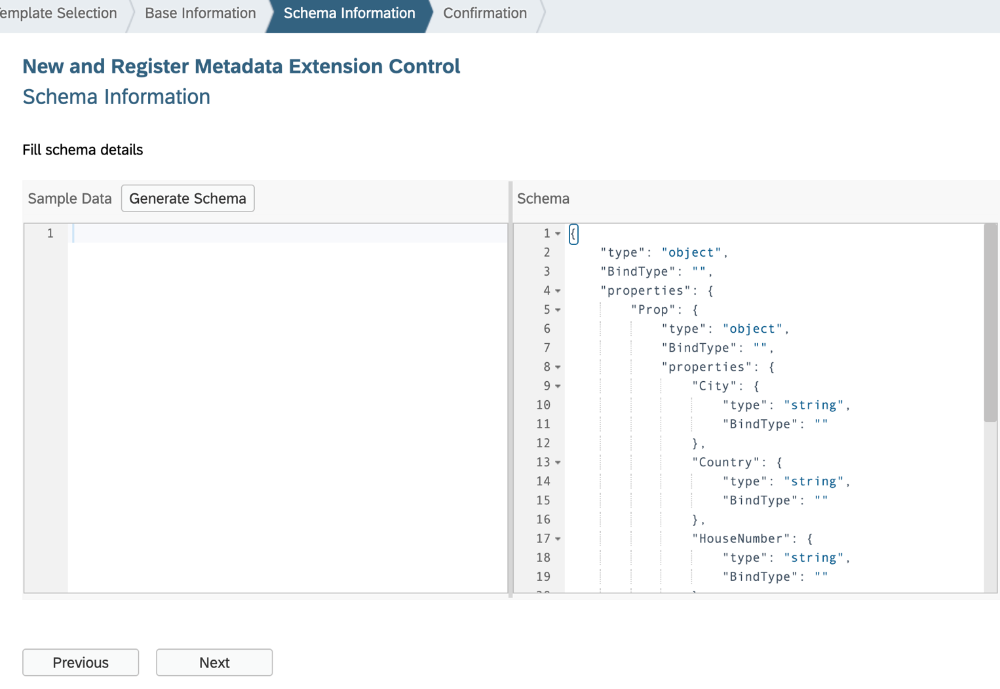

    >Above schema will add these predefined properties (`City`, `Country`, `HouseNumber`, `LastName`, `PostalCode`, `Street`) in the map extension control which you will bind to **Customer** entity properties in next step.

7. Click **Finish** to confirm.

    Some additional files and folders are added to the **Extensions** folder. You will learn more about it in following steps.

    !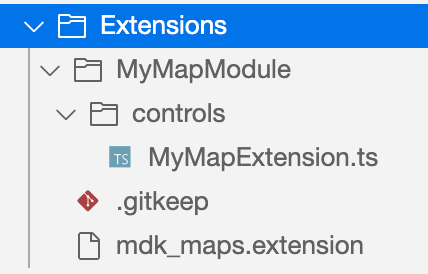

    >You can find more details about registering extension control in [this](https://help.sap.com/doc/f53c64b93e5140918d676b927a3cd65b/Cloud/en-US/docs-en/guides/getting-started/mdk/advanced/extensions/registering-extension-in-bas.html) guide.

[DONE]
[ACCORDION-END]

[ACCORDION-BEGIN [Step 3: ](Consume Extension Control in MDK Metadata)]

You will add this registered control in the generated `Customers_Detail.page`.

  1. Navigate to **Pages** folder | **Customers** | `Customers_Detail.page`.

  2. Remove the body section of the page.

    !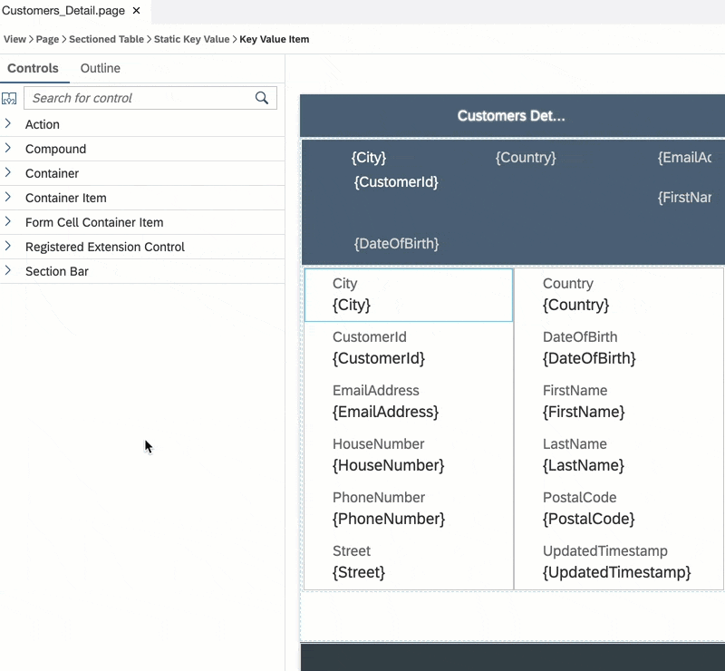

  3. Drag & drop the registered `mdk_maps` control on the page area.

    !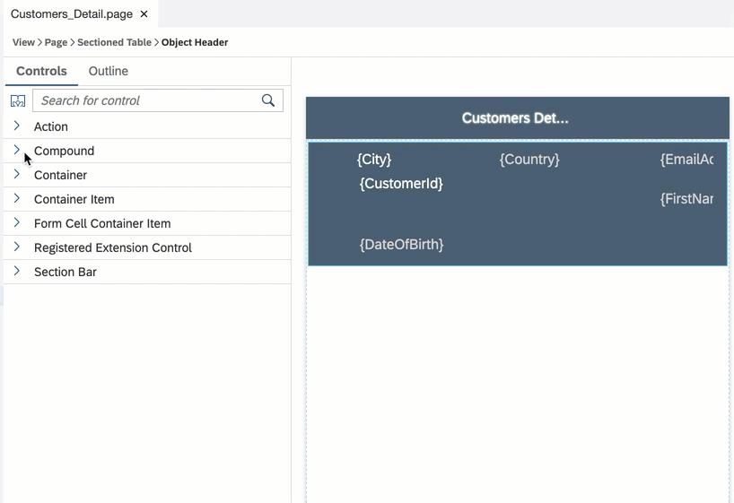

    >You can find more details about the **Section Extension** in [this](https://help.sap.com/doc/69c2ce3e50454264acf9cafe6c6e442c/Latest/en-US/docs-en/reference/schemadoc/Page/SectionedTable/Container/Extension.schema.html) guide.

  4. In the **Properties** section, set the **Height** to 600.

    !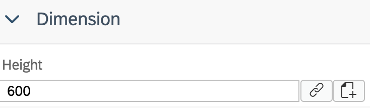  

  5. Bind the registered Extension control properties to **Customers** properties.

    Under **Extension Properties** section, expand `Prop{}`, click the **link** icon to open the Object Browser for the **City** property. Double click the **City** property of the **Customer** entity to set it as the binding expression and click **OK**.

    !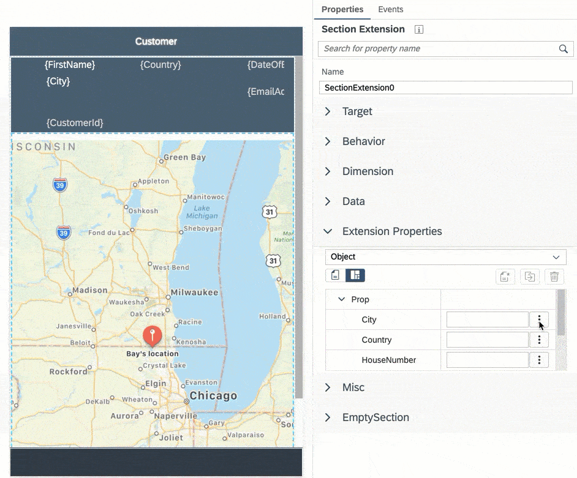

    Repeat the above step and bind other properties.

    !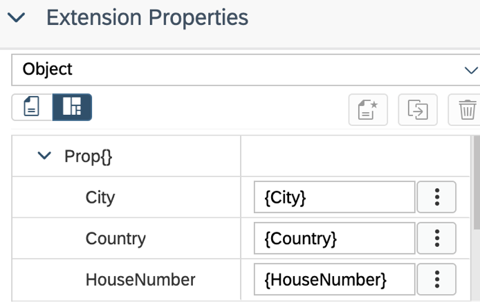  
    !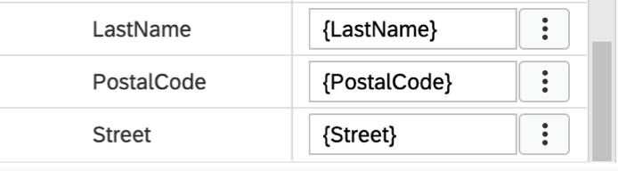  

    >Be careful not to bind properties from Address (ESPM.Address).


[DONE]
[ACCORDION-END]

[ACCORDION-BEGIN [Step 4: ](Implement Extension using metadata approach)]

1. Navigate to **Extensions** | `MyMapModule` | `controls` | `MyMapExtension.ts`, replace the code with the following.

    ```JavaScript / TypeScript
    import * as app from 'tns-core-modules/application';
    import { IControl } from 'mdk-core/controls/IControl';
    import { BaseObservable } from 'mdk-core/observables/BaseObservable';
    import { EventHandler } from 'mdk-core/EventHandler'

    export class MyMapClass extends IControl {
        private _observable: BaseObservable;
        private _mapView: any;
        private _geo: any;
        private _gMap: any;
        private _marker: any;
        private _customerInfo = {
            lastName: "",
            houseNumber: "",
            street: "",
            city: "",
            country: "",
            postalCode: "",
            latitiude: "",
            longitude: ""
        }

        public initialize(props: any): any {
            super.initialize(props);

            //Access the properties passed from Customers_Detail.page to the extension control.
            //in this tutorial, you will be accessing the customer's last name and address
            if (this.definition().data.ExtensionProperties.Prop) {
                var property = this.definition().data.ExtensionProperties.Prop;
                this._customerInfo.lastName = property.LastName;
                this._customerInfo.houseNumber = property.HouseNumber;
                this._customerInfo.street = property.Street;
                this._customerInfo.city = property.City;
                this._customerInfo.country = property.Country;
                this._customerInfo.postalCode = property.PostalCode;
            }

            if (app.android) {
                //You will display the Google Maps in a MapView.For more details on Google Maps API for android, visit
                //https://developers.google.com/android/reference/com/google/android/gms/maps/package-summary

                this._mapView = new com.google.android.gms.maps.MapView(this.androidContext());
                var localeLanguage = java.util.Locale;

                //GeoCoder is required to convert a location to get latitude and longitude
                this._geo = new android.location.Geocoder(this.androidContext(), localeLanguage.ENGLISH);
                this._mapView.onCreate(null);
                this._mapView.onResume();

                //when mapview control is used, all the lifecycle activities has to be frowaded to below methods.
                app.android.on(app.AndroidApplication.activityPausedEvent, this.onActivityPaused, this);
                app.android.on(app.AndroidApplication.activityResumedEvent, this.onActivityResumed, this);
                app.android.on(app.AndroidApplication.saveActivityStateEvent, this.onActivitySaveInstanceState, this);
                app.android.on(app.AndroidApplication.activityDestroyedEvent, this.onActivityDestroyed, this);
                var that = this;

                //A GoogleMap must be acquired using getMapAsync(OnMapReadyCallback).
                //The MapView automatically initializes the maps system and the view

                var mapReadyCallBack = new com.google.android.gms.maps.OnMapReadyCallback({
                    onMapReady: (gMap) => {
                        console.log("inside onMapReady function");
                        that._gMap = gMap;
                        var zoomValue = 6.0;
                        that._gMap.setMinZoomPreference = zoomValue;
                        var customerAddress = that._customerInfo.houseNumber + ' ' + that._customerInfo.street + ' ' + that._customerInfo.city + ' ' +
                            that._customerInfo.country + ' ' + that._customerInfo.postalCode;
                        var data = that._geo.getFromLocationName(customerAddress, 1);
                        var latLng = new com.google.android.gms.maps.model.LatLng(data.get(0).getLatitude(), data.get(0).getLongitude());
                        that._gMap.addMarker(new com.google.android.gms.maps.model.MarkerOptions().position(latLng).title(this._customerInfo.lastName +
                            "'s " + "location"));
                        that._gMap.moveCamera(new com.google.android.gms.maps.CameraUpdateFactory.newLatLng(latLng));
                    }
                });
                this._mapView.getMapAsync(mapReadyCallBack);
            }

            if (app.ios) {

                /*initiating Apple Maps
                For more details on the Apple Maps visit
                https://developer.apple.com/documentation/mapkit */
                this._mapView = MKMapView.alloc().initWithFrame(CGRectMake(0, 0, 1000, 1000));
            }
        }

        private onActivityPaused(args) {
            console.log("onActivityPaused()");
            if (!this._mapView || this != args.activity) return;
            this._mapView.onPause();
        }

        private onActivityResumed(args) {
            console.log("onActivityResumed()");
            if (!this._mapView || this != args.activity) return;
            this._mapView.onResume();
        }

        private onActivitySaveInstanceState(args) {
            console.log("onActivitySaveInstanceState()");
            if (!this._mapView || this != args.activity) return;
            this._mapView.onSaveInstanceState(args.bundle);
        }

        private onActivityDestroyed(args) {
            console.log("onActivityDestroyed()");
            if (!this._mapView || this != args.activity) return;
            this._mapView.onDestroy();
        }

        //In case of iOS you'll use CLGeocoder API to convert an address to get latitude and longitude.
        //NOTE - API getlatlang is called only on ios devices

        private getlatlang(customerAddress) {
            const that = this;
            return new Promise((resolve, reject) => {
                var latLng = new CLGeocoder();
                latLng.geocodeAddressStringCompletionHandler(customerAddress, function (placemarks, error) {
                    if (error === null && placemarks && placemarks.count > 0) {
                        var pm = placemarks[0];
                        var cordinates = {
                            latitiude: "",
                            longitude: ""
                        }
                        cordinates.latitiude = pm.location.coordinate.latitude;
                        cordinates.longitude = pm.location.coordinate.longitude;
                        resolve(cordinates);
                    } else {
                        reject();
                    }
                });
            });
        }

        public view() {
            this.valueResolver().resolveValue([this._customerInfo.houseNumber, this._customerInfo.street, this._customerInfo.city, this._customerInfo
                .country, this._customerInfo.postalCode, this._customerInfo.lastName
            ], this.context)
                .then((address) => {

                    this._customerInfo.houseNumber = address[0];
                    this._customerInfo.street = address[1];
                    this._customerInfo.city = address[2];
                    this._customerInfo.country = address[3];
                    this._customerInfo.postalCode = address[4];
                    this._customerInfo.lastName = address[5];

                    var customerAddress = address[0] + ' ' + address[1] + ' ' + address[2] + ' ' + address[3] + ' ' + address[4];
                    console.log("customer's address = " + customerAddress);

                    if (app.ios) {
                        return this.getlatlang(customerAddress)
                            .then((cordinates) => {
                                /* below code is for the apple maps */
                                var latlong = CLLocationCoordinate2DMake(cordinates.latitiude, cordinates.longitude);
                                var annotation = MKPointAnnotation.alloc().init();
                                annotation.coordinate = latlong;
                                annotation.title = this._customerInfo.lastName + "'s" + " location";
                                this._mapView.centerCoordinate = latlong;
                                this._mapView.addAnnotation(annotation);
                            });
                    }
                });

            if (app.android) {
                return this._mapView;
            }
            if (app.ios) {
                return this._mapView;
            }
        }

        public viewIsNative() {
            return true;
        }

        public observable() {
            if (!this._observable) {
                this._observable = new BaseObservable(this, this.definition(), this.page());
            }
            return this._observable;
        }

        public setContainer(container: IControl) {
            // do nothing
        }

        public setValue(value: any, notify: boolean, isTextValue?: boolean): Promise<any> {
            // do nothing
            return Promise.resolve();
        }
    }
    ```
    >In your import function, if you see errors related to `tns-core-modules` or `mdk-core`, you can ignore them. There is currently no reference of such libraries in the MDK editor.

2. Save the `MyMapExtension.ts` file.

[VALIDATE_1]
[ACCORDION-END]

[ACCORDION-BEGIN [Step 5: ](Deploy the application)]

So far, you have learned how to build an MDK application in the SAP Business Application Studio editor. Now, you will deploy this application definition to Mobile Services.

1. Right-click `Application.app` and select **MDK: Deploy**.

    !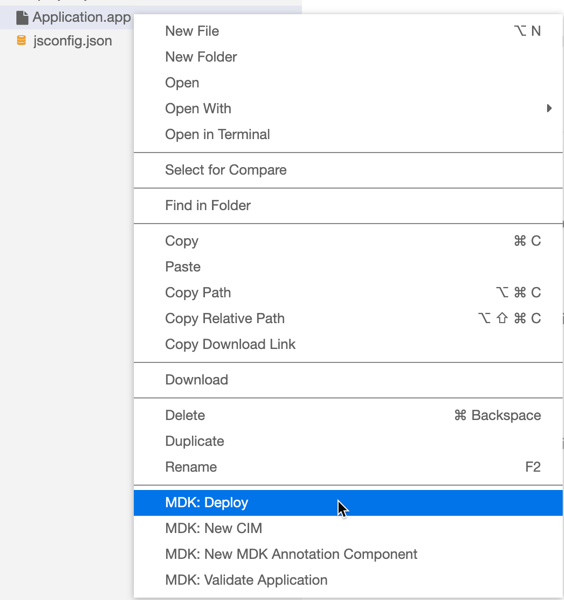

2. Select deploy target as **Mobile Services**.

    !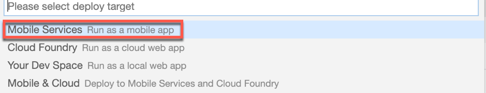

    You should see **Deploy to Mobile Services successfully!** message.

    !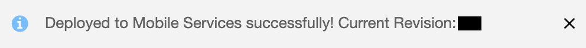


[DONE]
[ACCORDION-END]

[ACCORDION-BEGIN [Step 6: ](Get the API Key to use the Maps SDK for Android (Required only for Android client))]

Since you will display the customer's address in Google Maps on Android device, you will need to provide an API key in generated MDK project (step 8).

  1. Visit the [Google Cloud Platform Console](https://cloud.google.com/console/google/maps-apis/overview).

  2. Click the project drop-down and select or create the project for which you want to add an API key.

    !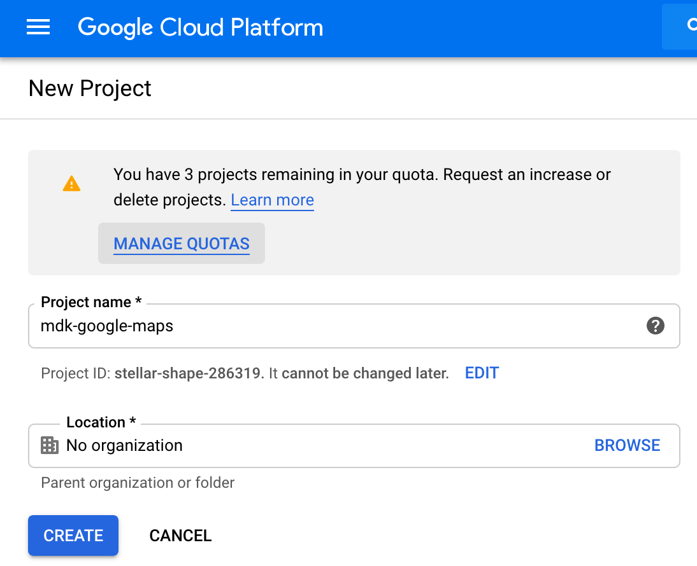

2. Click **Explore and enable APIs**.

    !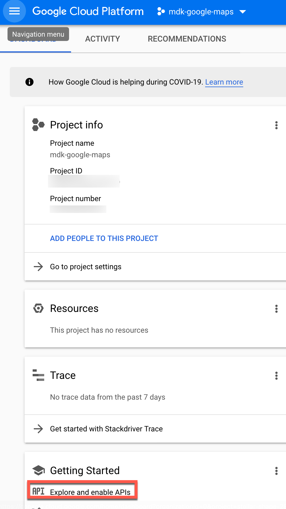

3. Click **Enable APIS and SERVICES**.

    !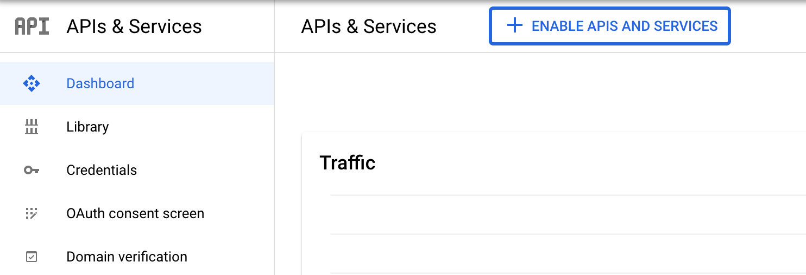    

4. Click **Maps SDK for Android** API.

    !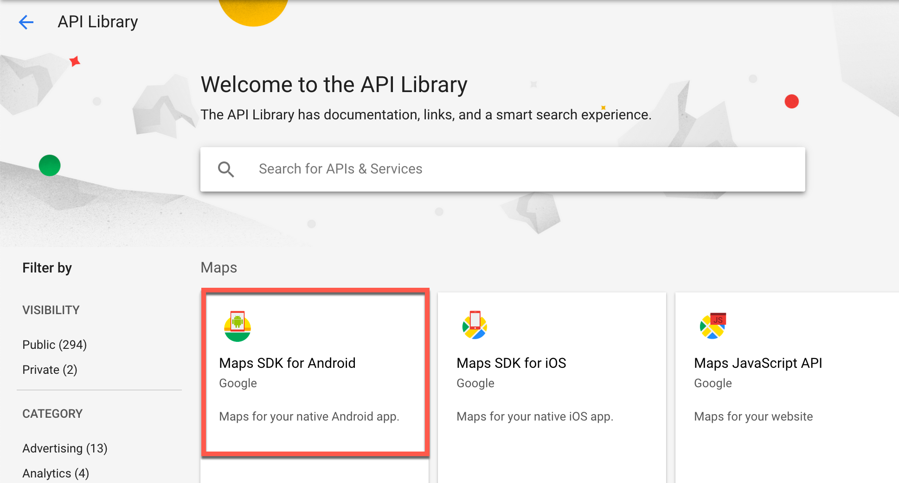

5. Click **ENABLE**.

    !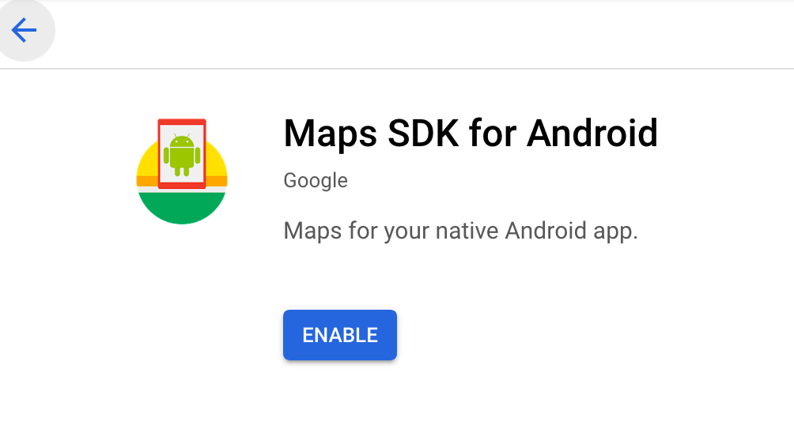

6. Open [Credentials console](https://console.cloud.google.com/apis/credentials), click **CREATE CREDENTIALS** and click **API Key**.

    !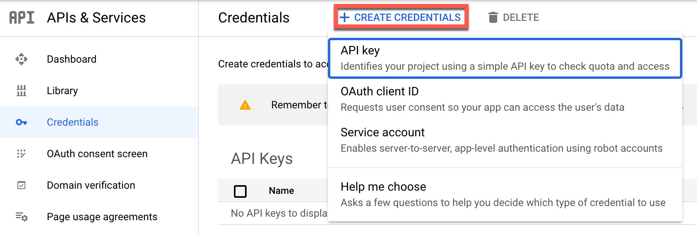

7. Copy this generated key and save it locally. This will be required in step 8.

[DONE]
[ACCORDION-END]

[ACCORDION-BEGIN [Step 7: ](Create Your Branded MDK Client (Required only for Android))]

For iOS, you can just use the App store client. Continue with next step.

For Android, you will pass the API key to the MDK client, there is no way public store client can access it, hence you will create a branded client using MDK SDK.

1.  Follow steps 1 to 3 from [this tutorial](cp-mobile-dev-kit-build-client).

2. Create below file structure under `DemoSampleApp.mdkproject`.

            DemoSampleApp.mdkproject
            ├── App_Resources_Merge
               └── Android
                   ├── app.gradle


      !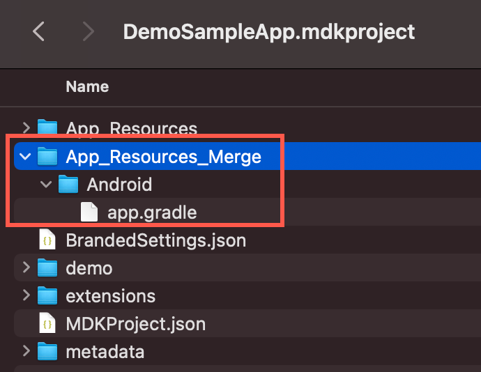

    >Files specified in the `.mdkproject/App_Resources_Merge` folder override a part of the files in `<generated-project>/app/App_Resources`. You can find more details about it in [help documentation](https://help.sap.com/doc/f53c64b93e5140918d676b927a3cd65b/Cloud/en-US/docs-en/guides/getting-started/mdk/custom-client/app-resources-merge.html).

3. Provide below information in the `app.gradle` file. Save the changes.

    ```Java
    dependencies { implementation 'com.google.android.gms:play-services-maps:17.0.0' }
    ```

4. Follow step 4 from [this tutorial](cp-mobile-dev-kit-build-client) to create your branded MDK client.

[DONE]
[ACCORDION-END]


[ACCORDION-BEGIN [Step 8: ](Run the MDK Client)]

>Make sure you are choosing the right device platform tab above.

[OPTION BEGIN [Android]]

In this step, you will run the app on an Android device.


1. Navigate to `/DemoSampleApp/app/App_Resources/Android/src/main/AndroidManifest.xml`.

    !

2. Provide below information before `application` closing tag.

    ```XML
     <meta-data android:name="com.google.android.geo.API_KEY" android:value="Enter your API Key generated in step 6" />
    ```

    !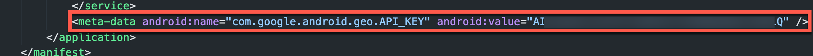

3. Attach the device to your Mac or Windows machine and run `tns device android` command to print a list of attached devices.

    !

    >Make sure **Developer option** and **USB debugging** option is enabled in android device.

6. Copy the **Device Identifier** value for your device.

7. In terminal or command line window, navigate to the app name folder **`DemoSampleApp`** (in `MDClient_SDK` path) and use `tns run android --device <device identifier>` command to run the MDK client on android device.

    !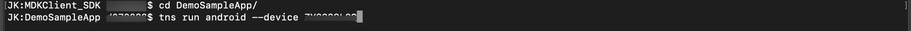

8. Once, above command gets successfully executed, you will see new MDK client up and running in Android device.

    In Welcome screen, tap **START** to connect MDK client to SAP Business Technology Platform (BTP).

    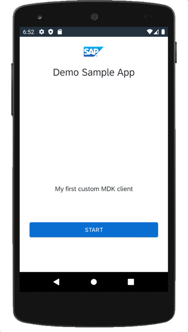

9. Tap **AGREE** on End User License Agreement.

    

10. Enter your credentials to login to SAP BTP and tap **Log On** to authenticate.

    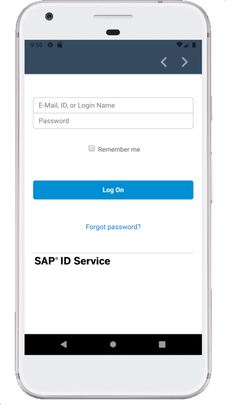

11. Choose a passcode with at least 8 characters for unlocking the app and tap **NEXT**.

    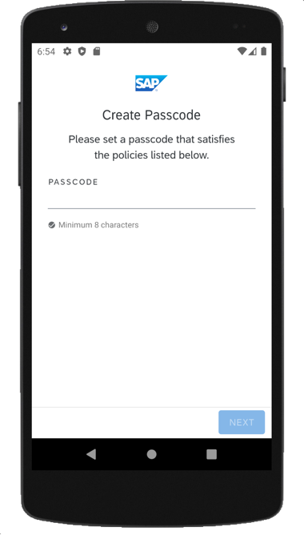

12. Confirm the passcode and tap **DONE**.

    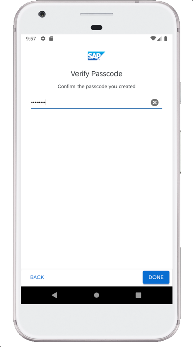

    Optionally, you can enable fingerprint to get faster access to the app data.

    

13. Tap **OK** to update the client with new MDK metadata.

    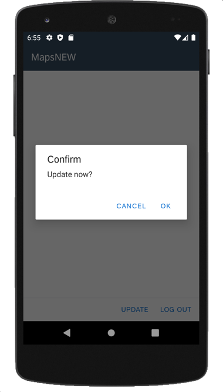    

14. Tap **CUSTOMERS** to navigate to customer list.

    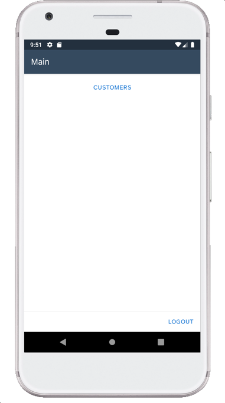  

15. Tap any of customer record to navigate to details page.

    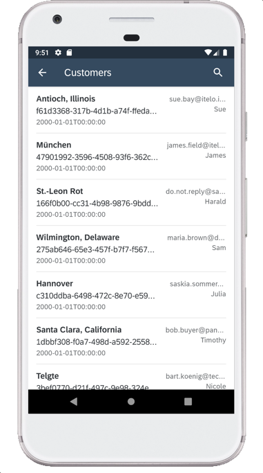    

16. In Customer Details page, you will see the Customer's address loading in Google Maps.

    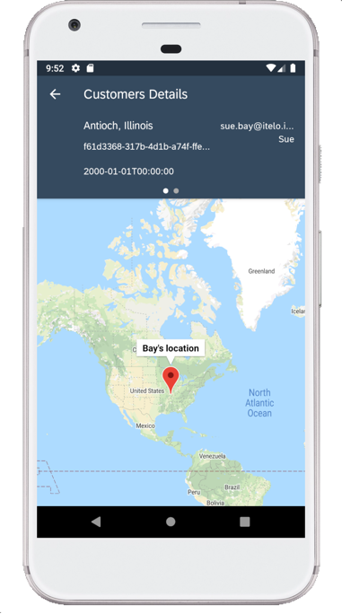  

[OPTION END]

[OPTION BEGIN [iOS]]

1. SAP Business Application Studio has a feature to generate QR code for app onboarding.

    Double-click the `Application.app` to open it in MDK Application Editor and click **Application QR Code** icon to display the QR code.

    !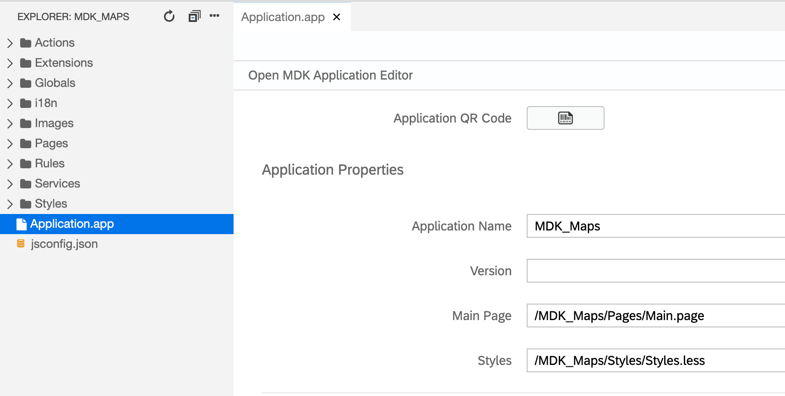

    !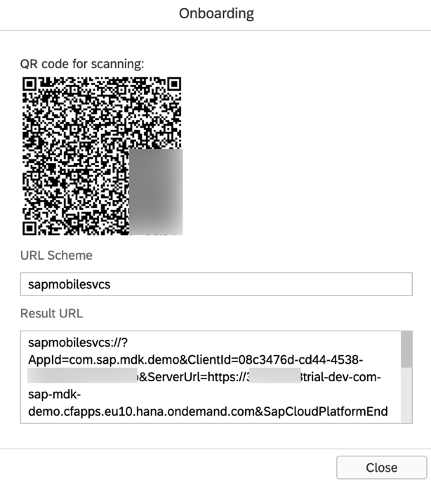

    >Leave the Onboarding dialog box open for next step.

2. Follow [these steps](https://github.com/SAP-samples/cloud-mdk-tutorial-samples/blob/master/Onboarding-iOS-client/Onboarding-iOS-client.md) to on-board the MDK client.

3. Once you have accepted the app update, tap **Customers** to navigate to customer list.

    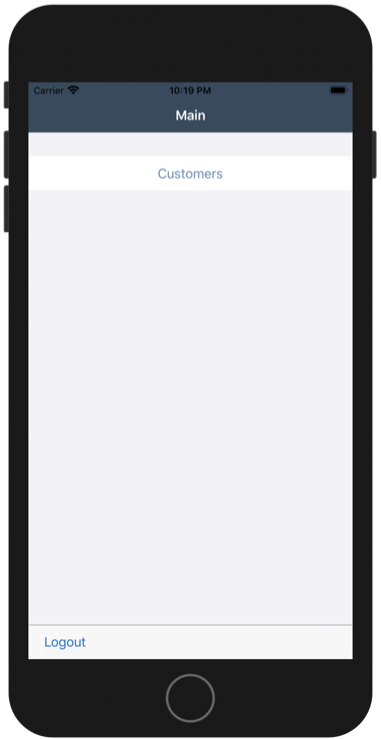  

4. Tap any of customer record to navigate to details page.

    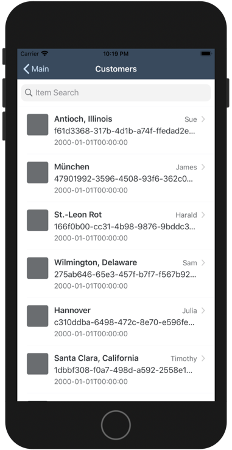     

5. In Customer Details page, you will see the Customer's address loading in Apple Maps.

    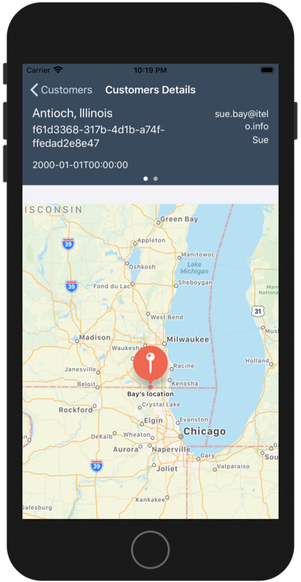  

[OPTION END]

Congratulations, you have extended Your MDK App With a Map Custom Control and you can continue with the remaining tutorials in this mission.

[VALIDATE_4]
[ACCORDION-END]

---
