## Prerequisites
- **Tutorial:** If you don't have an SAP Cloud Platform account, follow the tutorial to [set up a free developer account](hcp-create-trial-account).
- **Tutorial:** [Create a Cloud Foundry Sub-account](cp-cf-create-account), if you want to enable Mobile Services in Cloud Foundry environment.
- **Tutorial:** [Enable SAP Cloud Platform Mobile Services](fiori-ios-hcpms-setup)

## Details
### You will learn
  - How to configure MDK apps in the Mobile Services cockpit

---

>**This tutorial has been executed with Mobile Services in SAP Cloud Platform Neo and Cloud Foundry environment, please switch to either tab according to your environment.**

[ACCORDION-BEGIN [Step 1: ](Understand the mobile development kit feature)]

Mobile Development Kit (MDK) allows developers and technical business users to build new native mobile applications and customize select SAP native mobile applications in a highly productive environment. It's architecture is based on `NativeScript`, so it supports native cross platform development which means you build your native mobile application once and deploy it to Apple and Android devices.

Mobile Development Kit provides robust online and offline capabilities, business logic, and mobile qualities such as access to the camera and barcode scanner. The first application developed with the Mobile Development Kit is SAP Asset Manager and can easily be customized using the Mobile Development Kit.

You can find more details in the [Mobile Development Kit developer page](https://developers.sap.com/topics/mobile-development-kit.html).

[DONE]
[ACCORDION-END]

[ACCORDION-BEGIN [Step 2: ](Configure a new MDK app in Mobile Services Cockpit)]

[OPTION BEGIN [Neo]]

Login to [SAP Cloud Platform Mobile Services Cockpit](fiori-ios-hcpms-setup) with user id and password.

On the home screen, select **Create new app**.

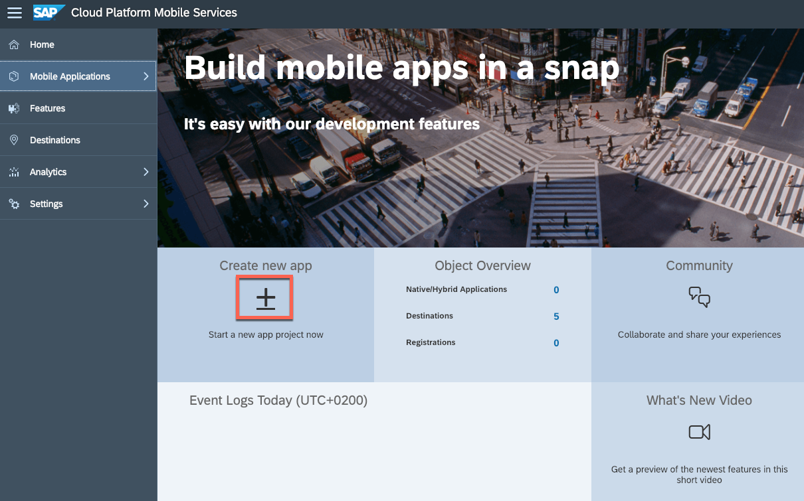

Provide the required information:

| Field | Value |
|----|----|
| `Config Templates`| Choose `Mobile Development Kit` |
| `ID` | `com.sap.mdk.demo` |
| `Name` | `SAP MDK Demo App` |

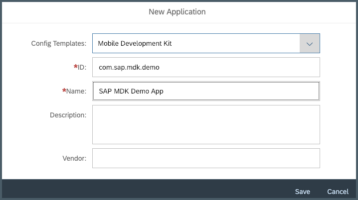

>Description and Vendor are optional fields. For more information about these fields, see [Defining Applications](https://help.sap.com/viewer/38dbd9fbb49240f3b4d954e92335e670/Cloud/en-US/17ccff786448442ab2c665ed1cce1505.html) in the SAP Cloud Platform documentation.

Once you have created your application, you see a list of features that are automatically assigned to the app.

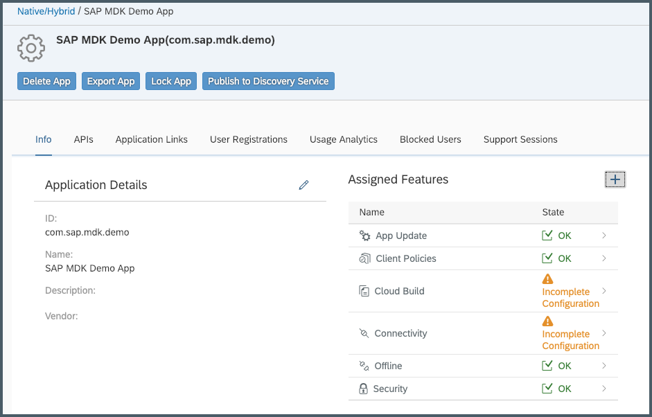

[OPTION END]

[OPTION BEGIN [Cloud Foundry]]

Login to [SAP Cloud Platform Mobile Services Cockpit](fiori-ios-hcpms-setup) with your email address and password.

On the home screen, select **Create new app**.

Provide the required information:

| Field | Value |
|----|----|
| `ID` | `com.sap.mdk.demo` |
| `Name` | `SAP MDK Demo App` |

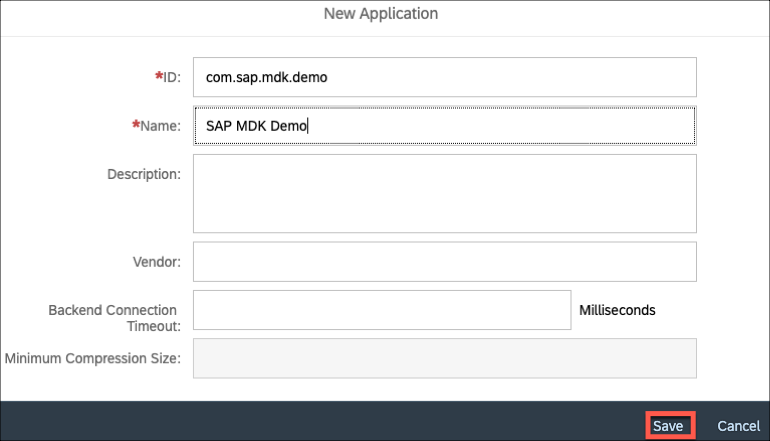

>Other fields are optional. For more information about these fields, see [Defining Applications](https://help.sap.com/viewer/468990a67780424a9e66eb096d4345bb/Cloud/en-US/17ccff786448442ab2c665ed1cce1505.html) in the SAP Cloud Platform documentation.

Click **Save**.

Once you have created your application, you see a default feature **Mobile Settings Exchange** that is automatically assigned to the app.

>**Mobile Settings Exchange** handles device registrations and provides exchange of general settings between mobile client and server, such as client policies.

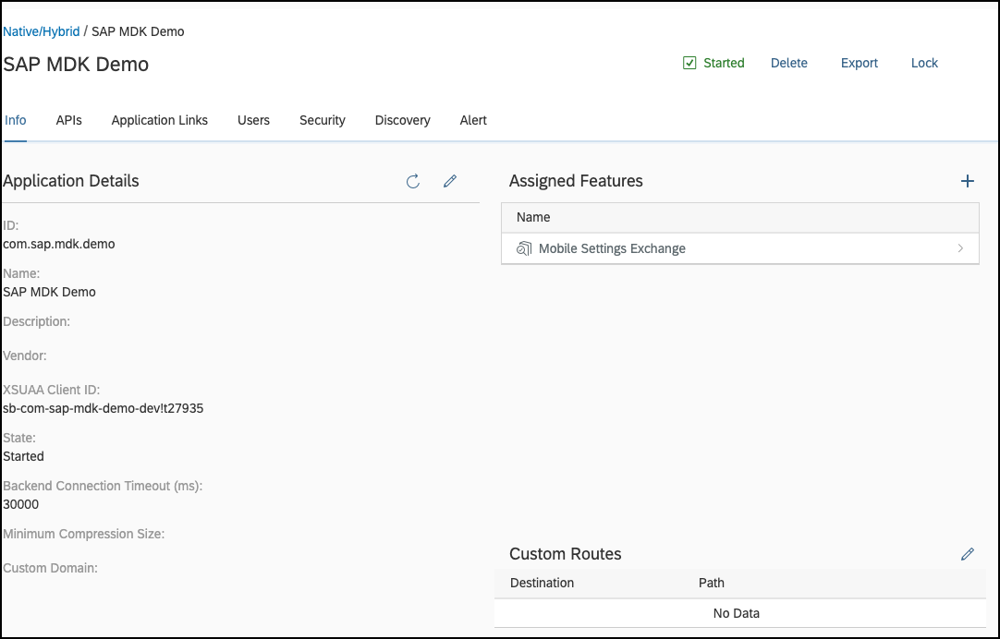

Now, we will assign few more features like App Update, Offline in the app configuration. First, start with **Mobile App Update**. Click **+** icon to add this feature.

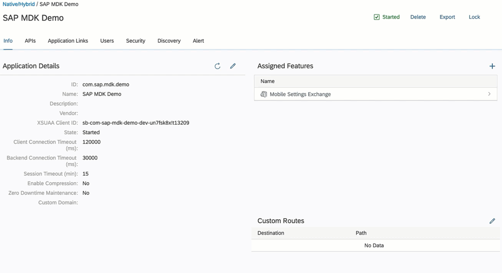

>**Mobile App Update** keeps MDK apps up-to-date and manage the apps' life cycles.

Click `com.sap.mdk.demo` and navigate back to app configuration page.

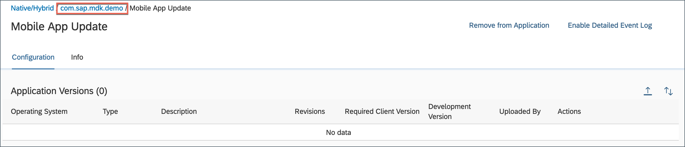

Repeat above step and assign **Mobile Offline Access** feature as well.

>**Mobile Offline Access** enable secure, offline access to data on the device.

You will end up with below features assigned to the app.

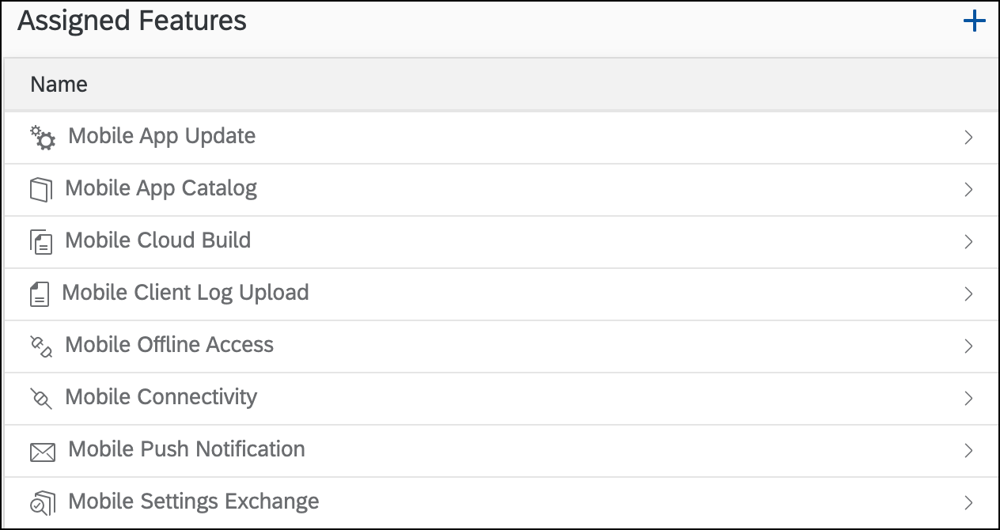

[OPTION END]

[DONE]
[ACCORDION-END]

[ACCORDION-BEGIN [Step 3: ](Add a sample backend to your MDK app)]

[OPTION BEGIN [Neo]]

A sample OData service is available for developers to use during development and testing. The sample OData service also lets you evaluate how delta tokens are handled in your test application.

>For more information about these fields, see [Sample Back End](https://help.sap.com/viewer/38dbd9fbb49240f3b4d954e92335e670/Cloud/en-US/1c2e51a24361487f8b0649702d59dd0f.html) in the SAP Cloud Platform documentation.

Click on the **+** icon to add Sample Back End feature to your MDK app.

Select **Sample Back End** option, and click **OK**.

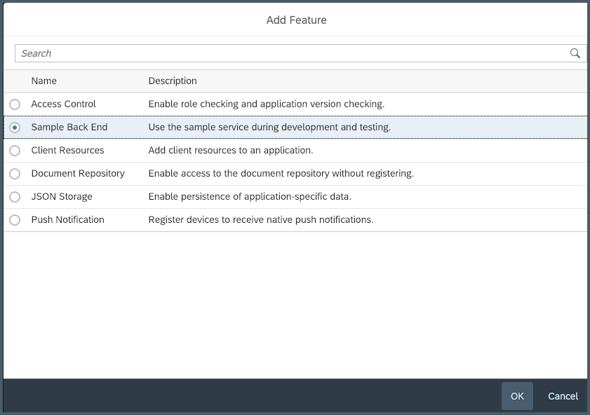

Here, you can view the root service and metadata URLs, and generate sample sales orders and purchase orders for multiple entity sets. You can view the data for each entity in a separate text file, and even can reset the sample data.

Select OData Version `V2` and click **Save**.

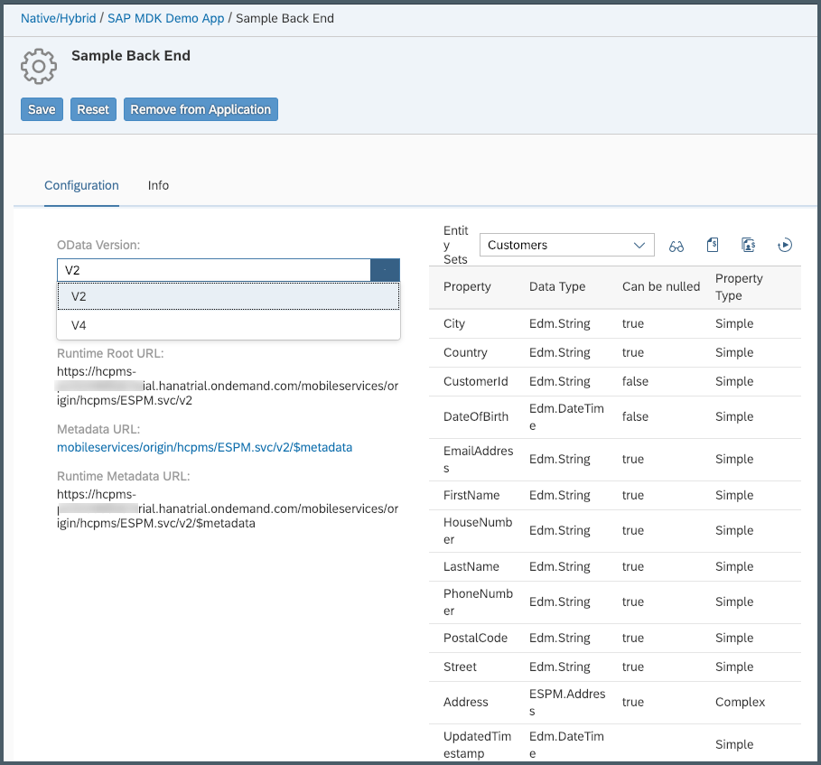

>For Offline OData capability only OData V2 is supported. OData V2 and V4 are supported for Online OData.

Click **SAP MDK Demo App** to navigate back to app configuration page.

[OPTION END]

[OPTION BEGIN [Cloud Foundry]]

A sample OData service is available for developers to use during development and testing. The sample OData service also lets you evaluate how delta tokens are handled in your test application.

>For more information about these fields, see [Sample Back End](https://help.sap.com/viewer/468990a67780424a9e66eb096d4345bb/Cloud/en-US/1c2e51a24361487f8b0649702d59dd0f.html) in the SAP Cloud Platform documentation.

Click on the **+** icon to add **Mobile Sample OData ESPM** feature to your MDK app.

Here, you can view the root service and metadata URLs, and generate sample sales orders and purchase orders for multiple entity sets. You can view the data for each entity in a separate text file, and even can reset the sample data.

Select OData Version `V2` and click **Save**.

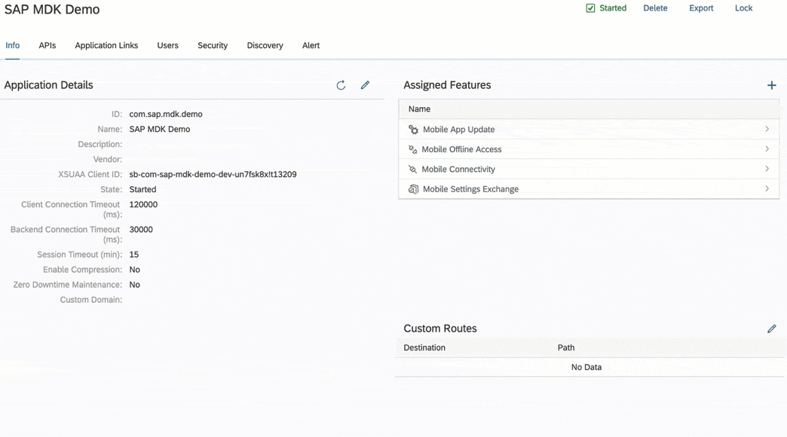

>For Offline OData capability only OData V2 is supported. OData V2 and V4 are supported for Online OData.

Click `com.sap.mdk.demo` to navigate back to app configuration page.

[OPTION END]

[VALIDATE_1]
[ACCORDION-END]

[ACCORDION-BEGIN [Step 4: ](Get familar with other assigned features)]

[OPTION BEGIN [Neo]]

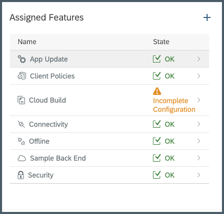

**App Update:** - Since we specified Mobile Development Kit as the app type, the App Update feature is assigned to the app by default. This feature keeps MDK apps up-to-date and manage the apps' life cycles.

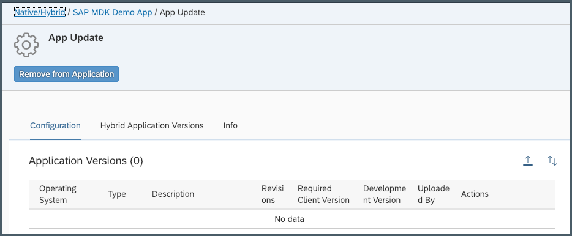

**Client Policies:** - Set client policies like Client Password, Client Logs, Usage report etc. for the selected mobile application.

**Cloud Build:** - Use the cloud build service to configure and build custom Mobile Development Kit clients, SAP Asset Manager Client, SAP Fiori Clients.

**Connectivity:** - Define destinations for the selected application.

**Offline:** - Define offline settings for the selected application. Offline support enables client applications to access back-end data without a connection. When offline, applications access data from an offline store on the client. SAP Cloud Platform Mobile Services moves data between the back end and the client offline store.

**Security:** -  OAuth security is configured to the app by default.

>You can find more information on available features in SAP Cloud Platform Mobile Services in [help documentation](https://help.sap.com/viewer/38dbd9fbb49240f3b4d954e92335e670/Cloud/en-US/8c474e7315354db5a7a6c6d76a00bcdc.html).

[OPTION END]

[OPTION BEGIN [Cloud Foundry]]

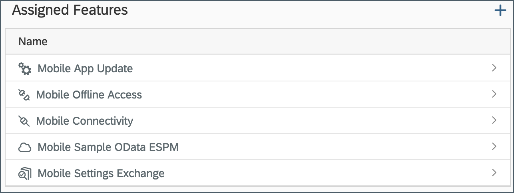

**Mobile App Update:** - Since we specified Mobile Development Kit as the app type, the App Update feature is assigned to the app by default. This feature keeps MDK apps up-to-date and manage the apps' life cycles.

**Mobile Offline Access:** - Define offline settings for the selected application. Offline support enables client applications to access back-end data without a connection. When offline, applications access data from an offline store on the client. SAP Cloud Platform Mobile Services moves data between the back end and the client offline store.

**Mobile Connectivity:** - Define destinations for the selected application.

**Mobile Sample OData ESPM:** - Use OData sample service during development and testing.

**Mobile Settings Exchange:** - Set client policies like Client Passcode, locking and wiping, feature restriction, and network synchronization etc. for the selected mobile application.

>You can find more information on available features in SAP Cloud Platform Mobile Services in [help documentation](https://help.sap.com/viewer/468990a67780424a9e66eb096d4345bb/Cloud/en-US/99f9cedcd0974faeb12c20cb3efa94b3.html).

[OPTION END]

[DONE]
[ACCORDION-END]

---
