## Prerequisites
- **Tutorial:** [Access SAP Mobile Services](fiori-ios-hcpms-setup)

## Details
### You will learn
  - How to configure MDK apps in the Mobile Services cockpit
  - How to configure destination for MDK Mobile and applications

---

[ACCORDION-BEGIN [Step 1: ](Understand the mobile development kit feature)]

The Mobile Development Kit (MDK) enables developers and technical business users to build [multi-channel]((https://blogs.sap.com/2020/10/27/moving-to-multi-channel-with-mobile-development-kit/)) applications. It allows you to build your application once, in an integrated development environment, and run it natively on mobile devices (Android & iOS) and as a web application (online) in the browser.

You can find more details in the [Mobile Development Kit developer page](https://developers.sap.com/topics/mobile-development-kit.html).

!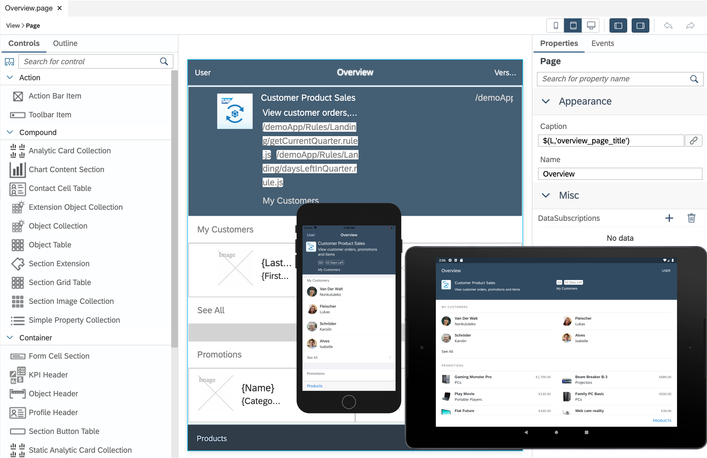

[VALIDATE_2]
[ACCORDION-END]

[ACCORDION-BEGIN [Step 2: ](Configure a new MDK application in Mobile Services cockpit)]

Make sure that you have completed required prerequisites mentioned in this tutorial.

1. Navigate to [SAP Mobile Services cockpit](fiori-ios-hcpms-setup).

2. On the home screen, select **Create new app**.

    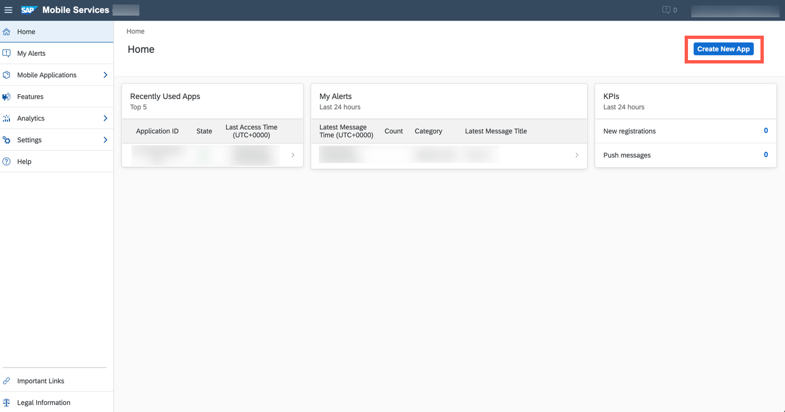

3. Provide the required information and click **Next**.

    | Field | Value |
    |----|----|
    | `ID` | com.sap.mdk.demo |
    | `Name` | SAP MDK Demo App |

    !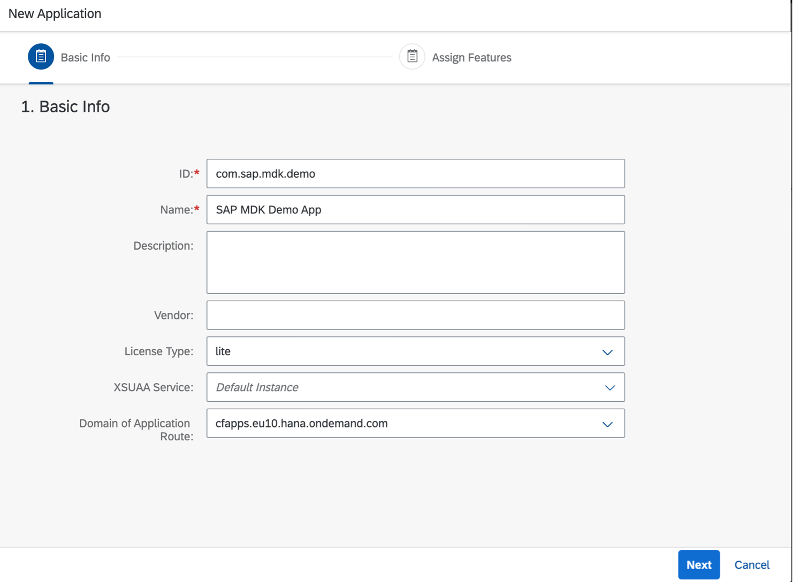

    >Other fields are optional. For more information about these fields, see [Creating Applications](https://help.sap.com/doc/f53c64b93e5140918d676b927a3cd65b/Cloud/en-US/docs-en/guides/getting-started/admin/manage.html#creating-applications) in the SAP documentation.

4. Choose **Mobile Development Kit Application** from the dropdown, select **Mobile Sample OData ESPM** to add a sample backend to your MDK app and the click **Finish**.

    !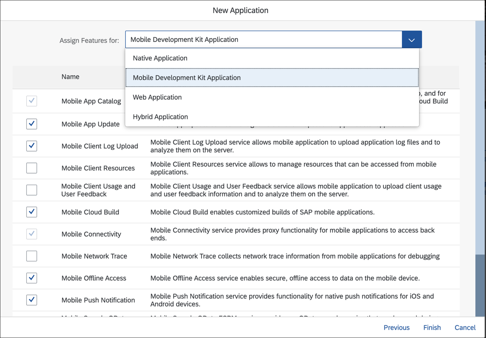

    >If you see a _Confirm Finish_ window, click **OK**.

    Once you have created your application, you see a list of default features have been automatically assigned to the app.

    !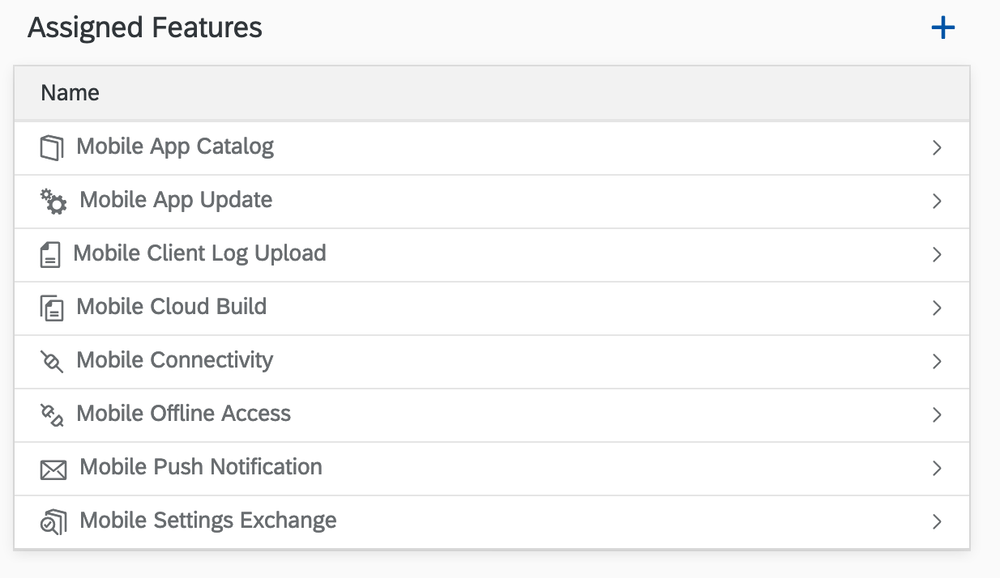

    >You can find more information on available features in SAP Mobile Services in [help documentation](https://help.sap.com/doc/f53c64b93e5140918d676b927a3cd65b/Cloud/en-US/docs-en/guides/getting-started/admin/features.html).

[VALIDATE_3]
[ACCORDION-END]

[ACCORDION-BEGIN [Step 3: ](Create a new destination to your MDK Mobile application)]

1. Click **Mobile Connectivity**.  

    !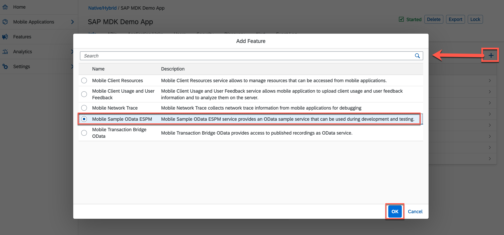

2. Copy the URL from existing destination and click the **Create** icon to add a new destination.

    !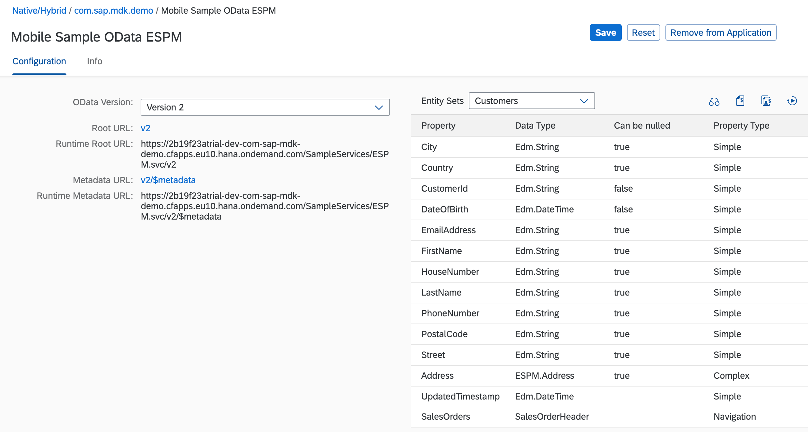

3. Provide the required information and click **Next**.

    | Field | Value |
    |----|----|
    | `Destination Name` | SampleServiceV2 |
    | `URL` | paste the URL from above step  |

    !

4. For this tutorial, there is no Custom Headers, Annotations required. Select **SSO Mechanism** as **Forward Authentication**, click **Next** and Finish the form.    

    !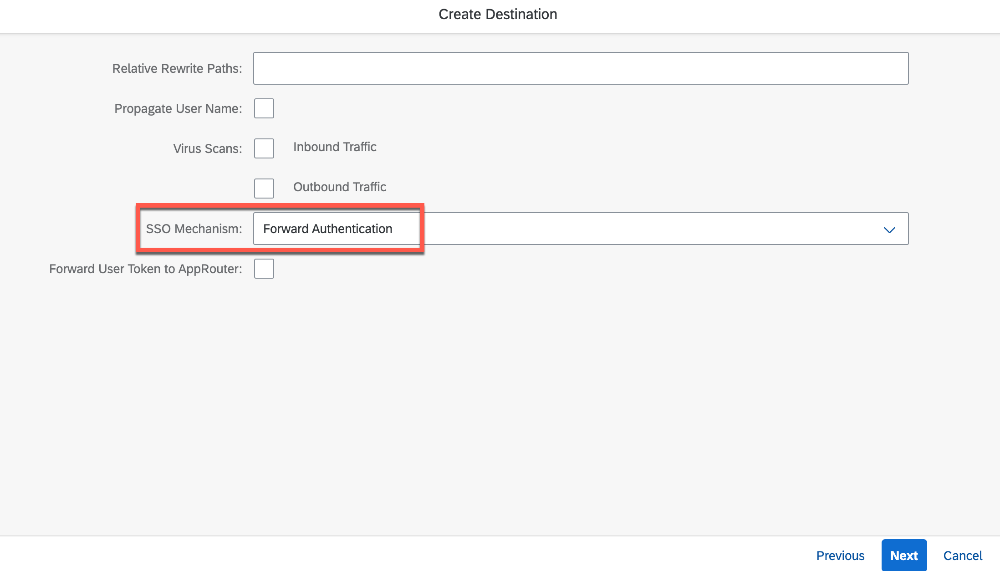

[DONE]
[ACCORDION-END]

[ACCORDION-BEGIN [Step 4: ](Create a new destination to your MDK Web application)]

MDK Web application accesses the data sources via BTP destination. You will now create a new destination in BTP cockpit that will point to the same backend as your Mobile destination.

1. Click `com.sap.mdk.demo` to navigate to Mobile Services application details.

    !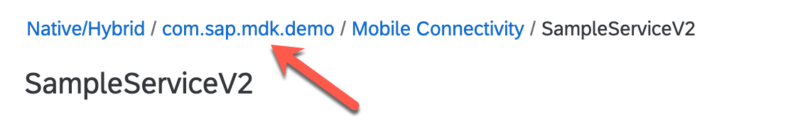

2. Open the `APIs` tab, click _copy to clipboard_ icon to copy the highlighted URL and paste it in a text file. This URL will be used in configuring the  BTP destination.

    !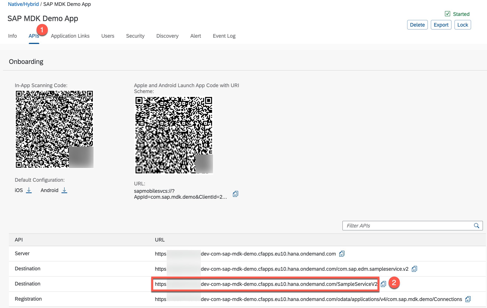

3. Navigate to the **Instances and Subscriptions** in your SAP BTP space cockpit page, select **Authorization & Trust Management** service from the list, click `com-sap-mdk-demo-xsuaa` instance and click **View** to open the configuration details.

    !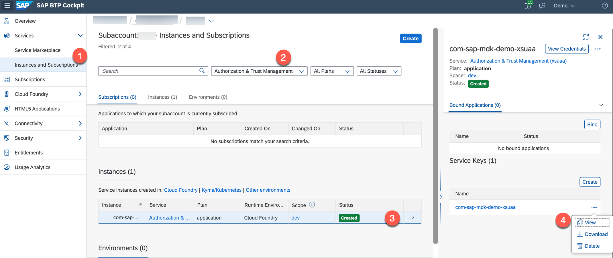

4. Switch to **Form** tab, copy values for `clientid`, `clientsecret`, `url` parameters and paste these values in the text file. These parameters will be used in configuring the BTP destination.  

    !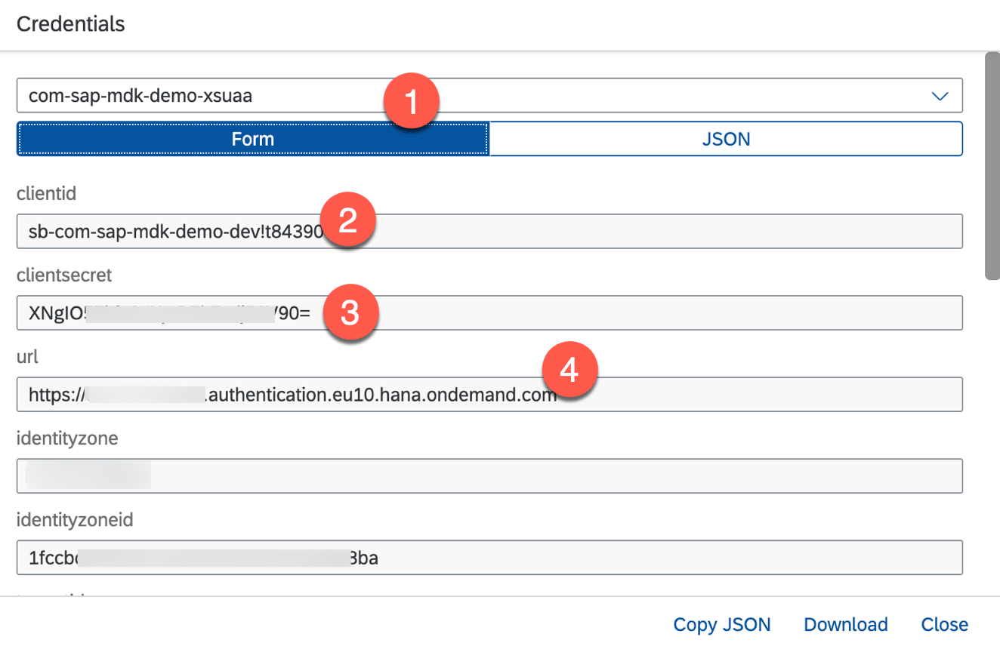

5. Download the zip file from [here](https://github.com/SAP-samples/cloud-mdk-tutorial-samples/blob/master/0-Set-Up-for-the-Mobile-Development-Kit/SampleServiceV2.zip) and unzip it on your machine.

6. Navigate to **Destinations** to create a BTP destination, click **Import Destination** to import the extracted file and provide the required information and click **Save**.

    | Field | Value |
    |----|----|
    | `URL` | Paste the URL from step 2 |
    | `Client ID` | Paste the value from step 4  |
    | `Client Secret` | Paste the value from step 4 |
    | `Token Service URL` | Paste the URL from step 4 and add **`/oauth/token`** suffix at the end |
    | `Use Default JDK truststore` | Select the checkbox if not selected before |

    !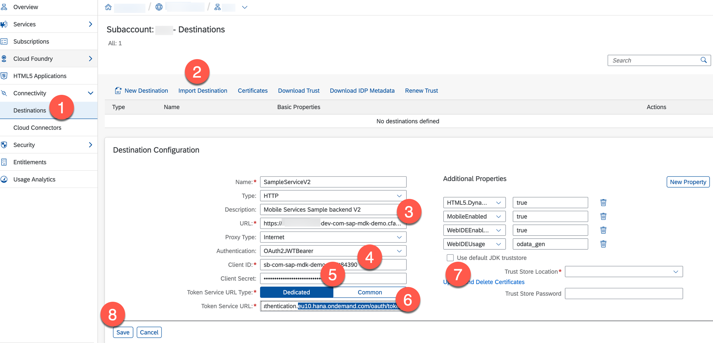

[DONE]
[ACCORDION-END]

---

Congratulations, you have successfully configured the setup for your MDK Mobile and Web applications.

You can now continue with [this tutorial](cp-mobile-bas-setup) to set up the development environment in the SAP Business Application Studio.

---
