## Prerequisites
- **Tutorial**: [Set Up for the Mobile Development Kit (MDK)](group.mobile-dev-kit-setup)
- **Tutorial**: [Build Your Mobile Development Kit Client Using MDK SDK](cp-mobile-dev-kit-build-client) (Steps 1 to 3)

## Details
### You will learn
  - How to reference the NativeScript Geolocation plugin from a rule
  - How to add a NativeScript plugin to your branded MDK client
  - How to build a Mobile development kit client for iOS & Android and connect to SAP Cloud Platform Mobile application
  - How to capture the device's current location

You may clone an existing metadata project from [GitHub repository](https://github.com/SAP-samples/cloud-mdk-tutorial-samples/tree/master/5-Brand-Your-Customized-App-with-Mobile-Development-Kit-SDK/4-Add-NativeScript-Plugin-in-an-MDK-App) and start directly with step 4 in this tutorial.

---

To extend the functionality, or customize the look and feel, and behavior of your client app, you can use the existing NativeScript plugins like nativescript-geolocation, nativescript-nfc etc. , add this to the client and reference it from a rule.

In this tutorial, you will use the existing NativeScript plugin nativescript-geolocation to capture the device location: latitude & longitude.

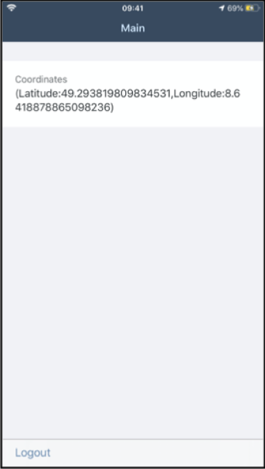

[ACCORDION-BEGIN [Step 1: ](Set up the application foundation)]

This step includes creating the Mobile Development Kit project in the Editor.

Launch the SAP Web IDE and select the **MDK perspective** by clicking on the icon in the left panel.

1. Right-click the workspace folder and select **New** | **MDK Empty Project**.

    

    >More details on _MDK template_ is available in [help documentation](https://help.sap.com/viewer/977416d43cd74bdc958289038749100e/Latest/en-US/cfd84e66bde44d8da09f250f1b8ecee6.html).

2. Enter the **Project Name** as `mdk_geolocation` and click **Next**.

    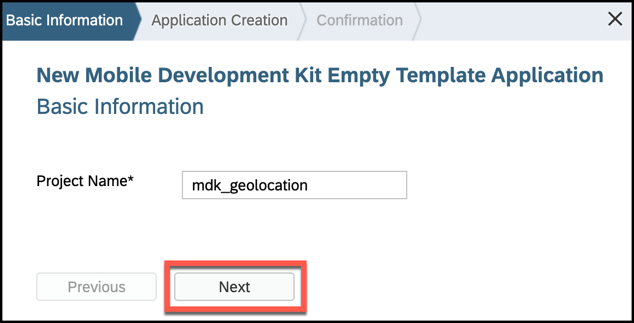

3. Leave the default values in _Application Creation_ step as it is, click **Finish**.

After clicking Finish, the wizard will generate your MDK project `mdk_geolocation` based on your selections.

[DONE]
[ACCORDION-END]


[ACCORDION-BEGIN [Step 2: ](Create a new rule to capture the device location)]

In the MDK editor, you will create a new JavaScript file called `GetCoordinates.js` to capture the device location: latitude & longitude.

>You can find more details about [writing a Rule](https://help.sap.com/viewer/977416d43cd74bdc958289038749100e/Latest/en-US/ef1e3404ff5f4ca68676acbda10e4bd0.html).

1. Right click on the **Rules** folder | **New** | **File**.

    

2. Enter the file name `GetCoordinates.js`, click **OK**.

3. Copy and paste the following code.

    ```JavaScript
    export default function GetCoordinates(context) {
    	var geolocation = require('nativescript-geolocation');
    	var Accuracy = require('tns-core-modules/ui/enums').Accuracy;
    	var logger = context.getLogger();
    	console.log("Current Log Level: " + logger.getLevel());
    	// check if geolocation is not enabled
    	if (!geolocation.isEnabled()) {
    		// request for the user to enable it
    		geolocation.enableLocationRequest();
    	}
    	// Get current location with high accuracy
    	return geolocation.getCurrentLocation({
    		desiredAccuracy: Accuracy.high, //This will return the finest location available
    		updateDistance: 5, //Update distance filter in meters.
    		timeout: 11000 //How long to wait for a location in ms.
    	}).then(function (loc) {
    		if (loc) {
    			console.log(loc);
    			console.log('\nCurrent Location: (' + loc.latitude + ',' + loc.longitude + ')');
    			logger.log(loc.toString());

    			var locMessage = '(' + "Latitude:" + loc.latitude + ',' + "Longitude:" + loc.longitude + ')';
    			logger.log('Current Location: ' + locMessage, 'INFO');
    			return locMessage;
    		}
    	}, function (e) {
    		logger.log(e.message, 'ERROR');
    	});
    }
    ```

  4. Save the changes.

[DONE]
[ACCORDION-END]


[ACCORDION-BEGIN [Step 3: ](Display the coordinates on a page)]

You will add this registered control in a Form Cell page.

  1. Double-click the Main.page, drag & drop **Static Key Value** container control to the page area.

    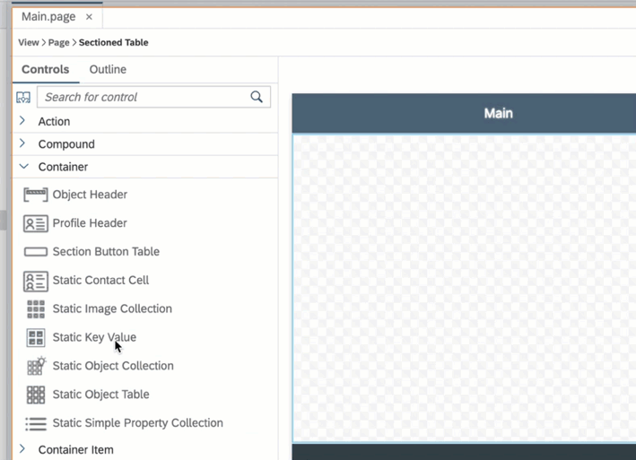

  2. In **Properties** | **Layout**, change `NumberOfColumns` to 1.

    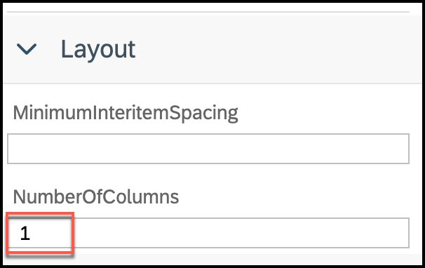

  3. Drag & drop **Key Value Item** to the container.

    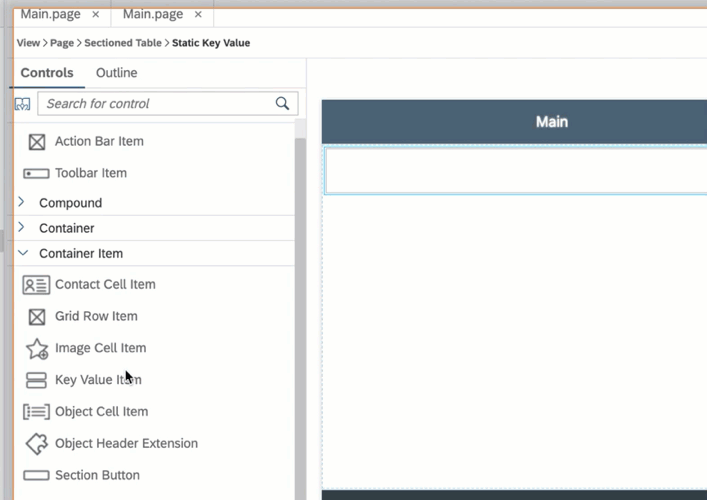

  4. Provide the following information:

    | Property | Value |
    |----|----|
    | `KeyName`| `Coordinates` |
    | `Value`| Bind it to `GetCoordinates.js` |

    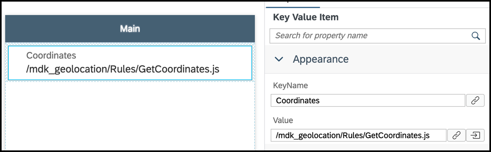


  5. Save the changes to the `Main.page`.

[DONE]
[ACCORDION-END]

[ACCORDION-BEGIN [Step 4: ](Deploy and activate application)]

So far, you have learned how to build an MDK application in the SAP Web IDE editor. Now, we deploy this application definition to Mobile Services.

1. Right-click the `mdk_geolocation` MDK Application in the project explorer pane and select **MDK Deploy and Activate**.

    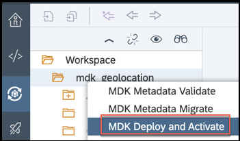

2. Add `;nativescript-geolocation;ui/enums` in the **Externals** and click **Next**.

    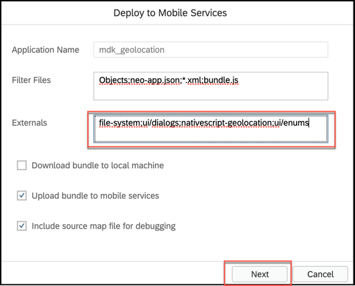

    >**Filter Files**: will be filtered and ignored in web packing process.

    >**Externals**: are the list of NPM modules that are part of the MDK Client application and should not be validated in the bundle.

3. Click the drop down for Destination Name and select the `mobileservices_cf` destination, you will find list of existing application IDs, select the one you have chosen while creating the project.

    

    >By default, automatically deploy option is selected, In other words, the application is automatically deployed from Mobile Services to your MDK client.

4. Click **Next** to finish the deployment from SAP Web IDE.

You should see **Application deployed successfully** message in console log.


[DONE]
[ACCORDION-END]

[ACCORDION-BEGIN [Step 5: ](Add NativeScript plugin and External dependencies in your local .mdkproject)]

In order to use the existing NativeScript plugin in MDK client, you will need to first add it in `.mdkproject` and then create your branded MDK client.

1. Make sure that you have already completed steps 1 to 3 from [this](cp-mobile-dev-kit-build-client) tutorial.

2. Open `MDKProject.json` file and replace existing content with below:

    ```JSON
    {
      "AppName": "Demo Sample App",
      "AppVersion": "1.0.0",
      "BundleID": "com.sap.mdk.demo",
      "Externals": ["nativescript-geolocation","ui/enums"],
      "NSPlugins": ["nativescript-geolocation"],
      "UrlScheme": "mdkclient"
    }
    ```

[DONE]
[ACCORDION-END]

[ACCORDION-BEGIN [Step 6: ](Add googlePlayServicesVersion in Android App Resources (Required only for Android client))]

With [Google Play services](https://developers.google.com/android/guides/overview), your app can take advantage of the latest, Google-powered features such as Maps, Google+, and more.

1. Navigate to `/demosampleapp.mdkproject/App_Resources/Android` and create a new file `before-plugins.gradle`.

    

2. Provide the below information:

    ```Java
    android {  
      project.ext {
          googlePlayServicesVersion = "16+"
      }
    }
    ```

[VALIDATE_1]
[ACCORDION-END]


[ACCORDION-BEGIN [Step 7: ](Create & Run the MDK client)]

Follow steps 4 & 5 from [this](cp-mobile-dev-kit-build-client) tutorial to create your branded MDK client and run it in your device/simulator.

[OPTION BEGIN [Android]]

Tap **OK** to update the client with new MDK metadata.


Allow your app to access your location.

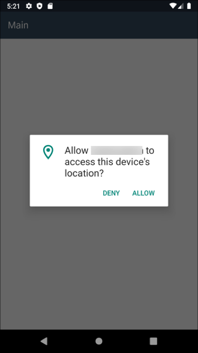

In Main page, you will see device's current location.

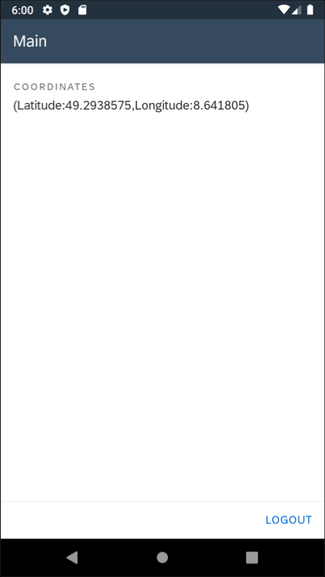

[OPTION END]

[OPTION BEGIN [iOS]]

Tap **OK** to update the client with new MDK metadata.


Allow your app to access your location.

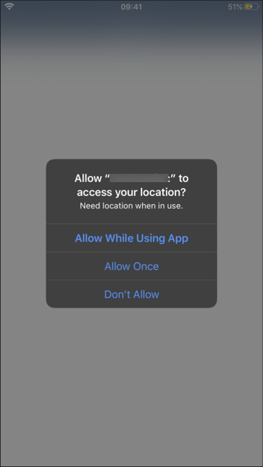

In Main page, you will see device's current location.


[OPTION END]

Congratulations, you have learned how to capture device's current location in an MDK app.

[DONE]
[ACCORDION-END]

---
