## Prerequisites
- **Tutorial group:** [Set Up for the Mobile Development Kit (MDK)](group.mobile-dev-kit-setup)
- **Download and install:** **SAP Mobile Services Client** on your [iOS](https://apps.apple.com/us/app/sap-mobile-services-client/id1413653544) or [Android](https://play.google.com/store/apps/details?id=com.sap.mobileservices.client) device (If you are connecting to `AliCloud` accounts then you will need to brand your [custom MDK client](cp-mobile-dev-kit-build-client) by allowing custom domains.)

## Details
### You will learn
  - How to create an MDK app using a template in SAP Business Application Studio
  - How to deploy an MDK app to Mobile Services and run it offline enabled in a mobile client
  - How to deploy an MDK app to Cloud Foundry and run it as a web application

---

[ACCORDION-BEGIN [Step 1: ](Create a new MDK project in SAP Business Application Studio)]

This step includes creating the mobile development kit project in the editor.

1. Launch the [Dev space](cp-mobile-bas-setup) in SAP Business Application Studio.

2. Click **Start from template** on Welcome page.

    !

    >If you do not see the Welcome page, you can access it via **Help** menu or via **View** menu > Find Command > Welcome.

3. Select **MDK Project** and click **Start**.

    !

    >If you do not see the **MDK Project** option check if your Dev Space has finished loading or reload the page in your browser and try again.

5. In *Basic Information* step, provide the below information and click **Next**:

    | Field | Value |
    |----|----|
    | `MDK Template Type`| Select `Base` from the dropdown |
    | `Your Project Name` | Provide a name of your choice. `DemoSampleApp` is used for this tutorial |
    | `Your Application Name` | <default name is same as project name, you can provide any name of your choice> |
    | `Target MDK Client Version` | Leave the default selection as `MDK 6.0+ (For use with MDK 6.0 or later clients)` |
    | `Choose a target folder` | By default, the target folder uses project root path. However, you can choose a different folder path |

    !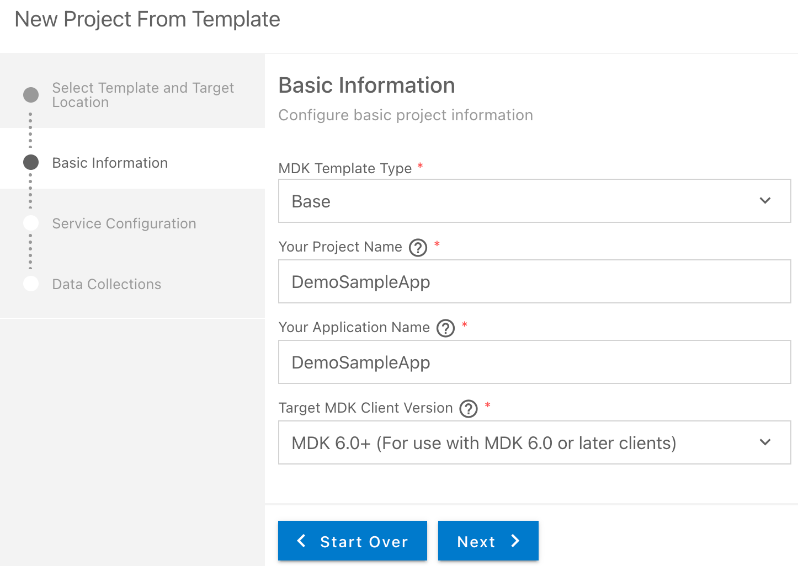

    >The `Base` template creates the offline or online actions, rules, messages and an empty page (`Main.page`). After using this template, you can focus on creating your pages, other actions, and rules needed for your application. More details on _MDK template_ is available in [help documentation](https://help.sap.com/doc/f53c64b93e5140918d676b927a3cd65b/Cloud/en-US/docs-en/guides/getting-started/mdk/bas.html#creating-a-new-project-cloud-foundry).

    >This screen will only show up when your CF login session has expired. Enter your login credentials, click Login icon and select the org & space where you have set up the initial configuration for your MDK app.

    >!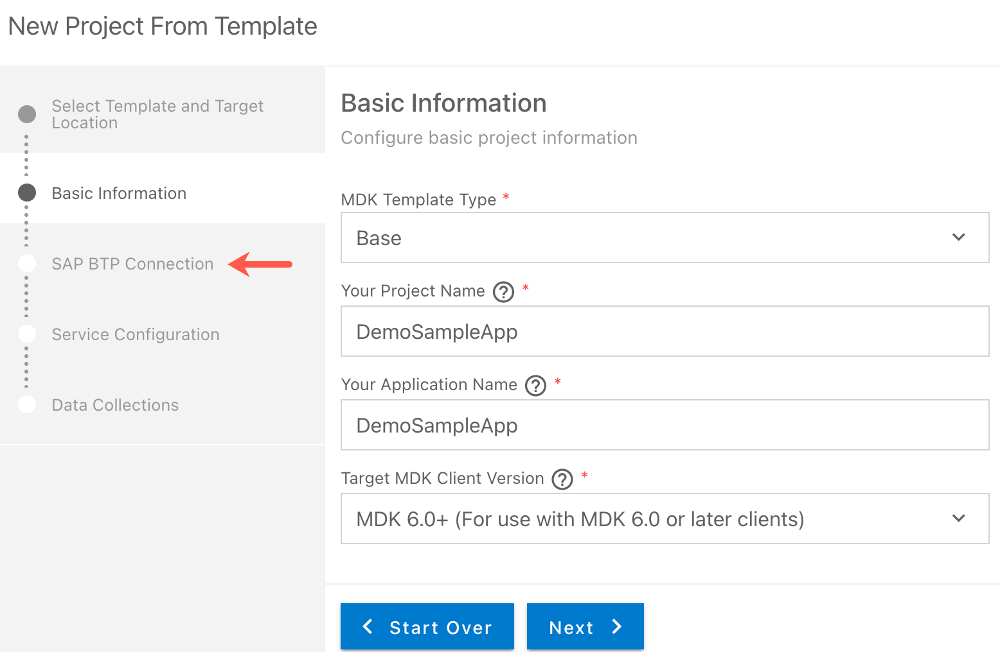

6. In *Service configuration* step, provide the below information and click **Next**:

    | Field | Value |
    |----|----|
    | `Data Source` | Select `Mobile Services` from the dropdown |
    | `Mobile Services Landscape` | Select `standard` from the dropdown |
    | `Application Id` | Select `com.sap.mdk.demo` from the dropdown |
    | `Destination` | Select `SampleServiceV2` from the dropdown |
    | `Enter a path to the OData service` | Leave it as it is |
    | `Enable Offline` | It's enabled by default |

    !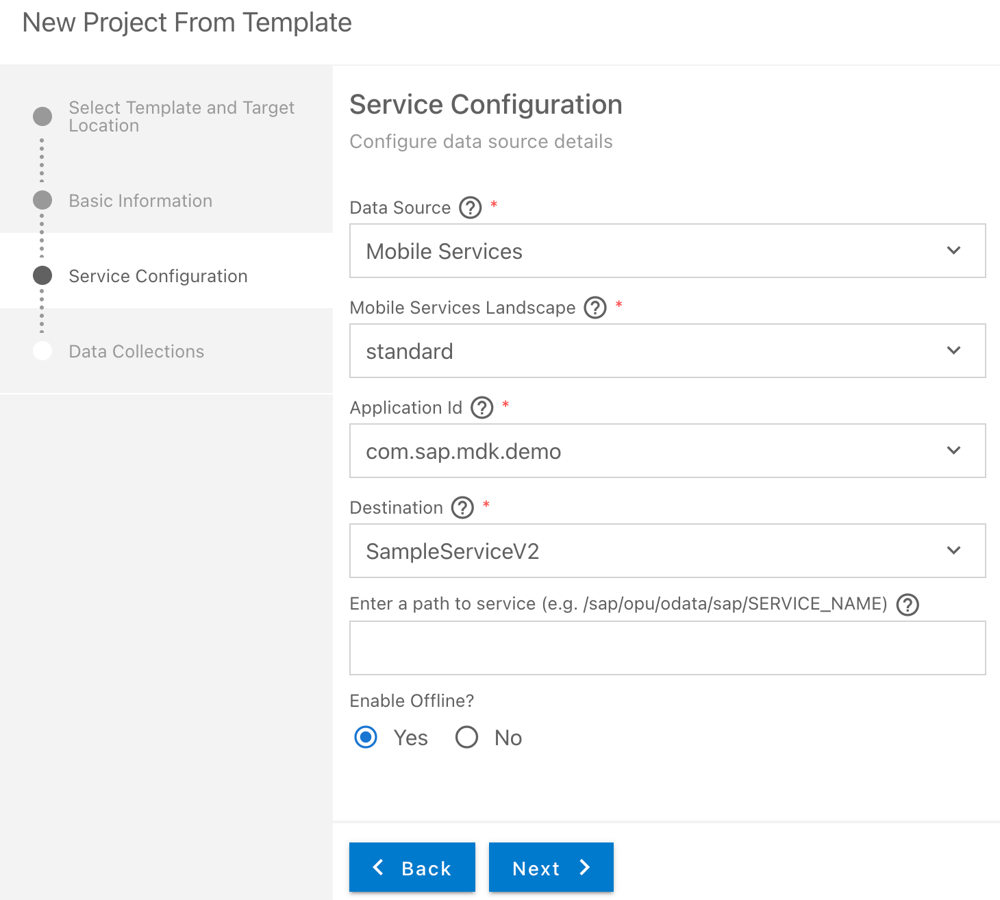

    >Regardless of whether you are creating an online or offline application, this step is needed for the app to connect to an OData service. When building an MDK application, it assumes the OData service created and the destination that points to this service is set up in [Mobile Services](cp-mobile-dev-kit-ms-setup) (for Mobile consumption) and in [Cloud Foundry cockpit](cp-mobile-dev-kit-ms-setup) (for Web consumption).

    >**Enable Offline** option allows MDK mobile app to be offline enabled. This configuration will be ignored on Web environment and the MDK web application will be treated as online only.

7. In **Data Collections** step, select `Customers`, `Products`, `SalesOrderHeaders` and `SalesOrderItems` data collections. Click Finish.

    !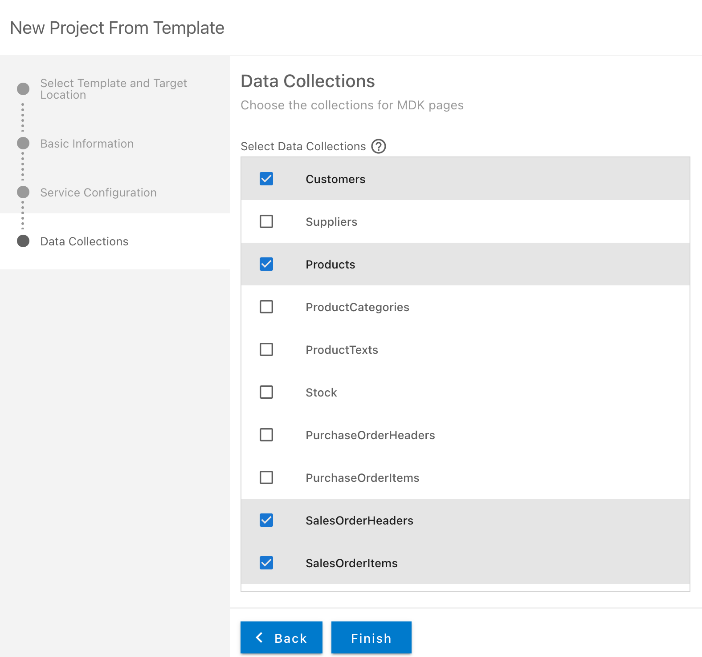

    After clicking **Finish**, the wizard will generate your MDK Application based on your selections. You should now see the `DemoSampleApp` project in the project explorer.

[DONE]
[ACCORDION-END]

[ACCORDION-BEGIN [Step 2: ](Get familiar with generated project structure)]

This is how the project structure looks like within the workspace.

!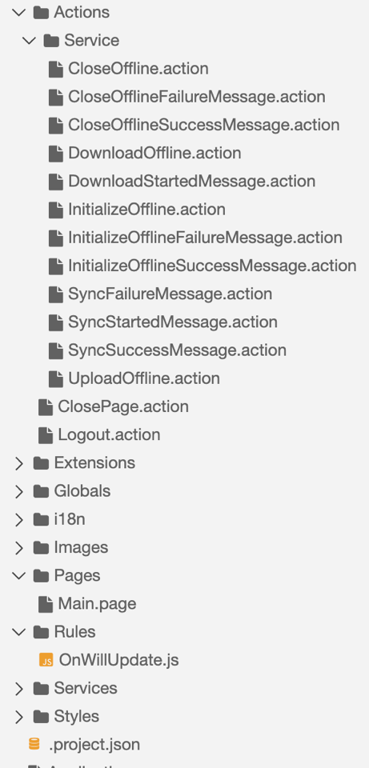

These are the [metadata definitions](https://help.sap.com/doc/69c2ce3e50454264acf9cafe6c6e442c/Latest/en-US/docs-en/reference/schemadoc/App.schema.html) available in the editor and the format in which these metadata definitions are stored in the editor. Just to brief on some of these:

- **`InitializeOffline.action`**: For Mobile applications, this action binds the application to the Mobile Services Offline OData server and downloads the required data to the offline store on the mobile device. For Web applications, it will initialize the service to be consumed in online mode.

- **`DownloadOffline.action`** and **`UploadOffline.action`**: These actions are applicable to Mobile client only. Using Mobile app initialization, data is downloaded to the offline store. If you want to have the application download any updated data from the backend server or upload changed data to the backend server, these actions will be needed.

- **`Success & Failure Message action`**: Here are some messages showing up in the app on a successful or failure of data initialization, sync etc.

- **`Main.page`**: This is the first page of your MDK application that is shown. For this application you will use this as a launching page to get to application functionality.

- **`OnWillUpdate.js`**: This rule is applicable to Mobile client only. MDK applications automatically download updates and apply them to the client without the end-user needing to take any action. The `OnWillUpdate` rule empowers the user to run business logic before the new definitions are applied. This allows the app designer to include logic to prompt the user to accept or defer applying the new definitions based on their current activity. For example, if the end-user is currently adding new customer details or in the middle of a transaction, they will be able to defer the update. The app will prompt again the next time it checks for updates.

- **`Web`**: In this folder, you can provide web specific app resource files and configurations.

- **`Application.app`**: this is the main configuration file for your application from within SAP Business Application Studio. Here you define your start page (here in this tutorial, it is main.page), action settings for different stages of the application session lifecycle, push notifications, and more.

[DONE]
[ACCORDION-END]

[ACCORDION-BEGIN [Step 3: ](Deploy the application)]

So far, you have learned how to build an MDK application in the SAP Business Application Studio editor. Now, you will deploy the application definitions to Mobile Services and Cloud Foundry to use it in the Mobile client and Web application respectively.

1. Right-click `Application.app` and select **MDK: Deploy**.

    !

2. Select deploy target as **Mobile & Cloud**.

   MDK editor will deploy the metadata to Mobile Services (for Mobile application) followed by to Cloud Foundry (for Web application).

   !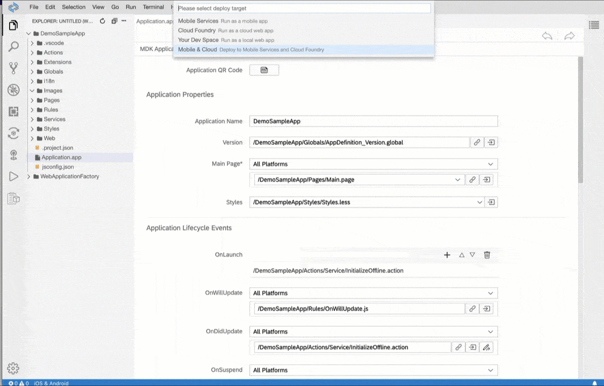

>First web deployment takes 2-3 minutes as it creates five service instances for the application, you can find these details in space cockpit.

>-	XSUAA

>- destination

>- connectivity

>- HTML Repo host

>- HTML repo runtime

You should see successful messages for both deployments.

!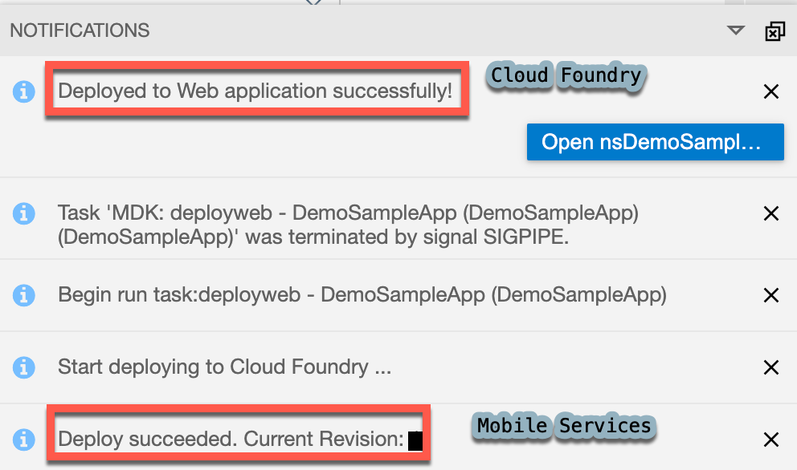

[DONE]
[ACCORDION-END]

[ACCORDION-BEGIN [Step 4: ](Display the QR code for onboarding the Mobile app)]

SAP Business Application Studio has a feature to display the QR code for onboarding in the Mobile client.

Click the `Application.app` to open it in MDK Application Editor and then click the **Application QR Code** icon.

!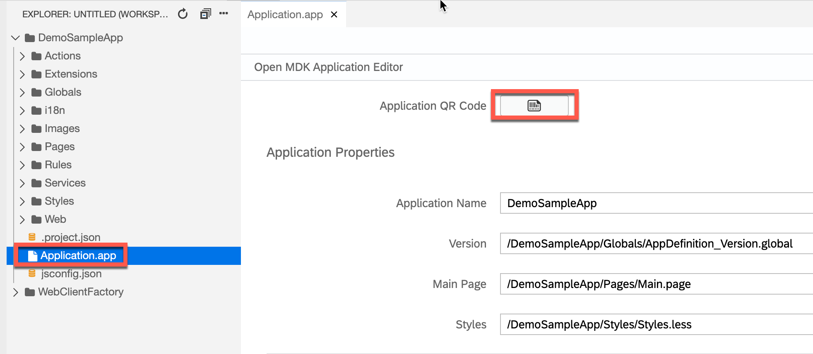

The On-boarding QR code is now displayed.

!

>Leave the Onboarding dialog box open for the next step.

[DONE]
[ACCORDION-END]

[ACCORDION-BEGIN [Step 5: ](Run the app)]

[OPTION BEGIN [Android]]

>Make sure you are choosing the right device platform tab above. Once you have scanned and on-boarded using the onboarding URL, it will be remembered. When you Log out and onboard again, you will be asked either to continue to use current application or to scan new QR code.

Follow [these steps](https://github.com/SAP-samples/cloud-mdk-tutorial-samples/blob/master/Onboarding-Android-client/Onboarding-Android-client.md) to on-board the MDK client.

After you accept the app update, you will see the **Main** page (with **Logout** and **Sync** options at bottom of the page) being displayed and Offline store will be initialized. **Since you selected the Base template during the project creation, which generated this empty page without any UI controls on it. In next tutorials, you will add some UI controls to this page and create more pages.**

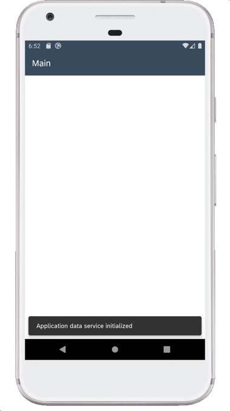

[OPTION END]

[OPTION BEGIN [iOS]]

>Make sure you are choosing the right device platform tab above. Once you have scanned and on-boarded using the onboarding URL, it will be remembered. When you Log out and onboard again, you will be asked either to continue to use current application or to scan new QR code.

Follow [these steps](https://github.com/SAP-samples/cloud-mdk-tutorial-samples/blob/master/Onboarding-iOS-client/Onboarding-iOS-client.md) to on-board the MDK client.

After you accept the app update, you will see the **Main** page (with **Logout** and **Sync** options at bottom of the page) being displayed and Offline store will be initialized. **Since you selected the Base template during the project creation, which generated this empty page without any UI controls on it. In next tutorials, you will add some UI controls to this page and create more pages.**

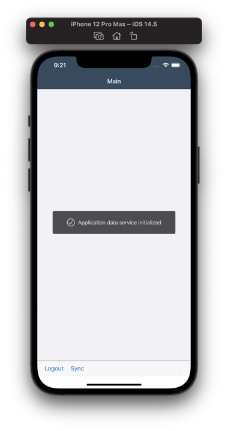

[OPTION END]

[OPTION BEGIN [Web]]

1. Click the highlighted button to open the MDK Web application in a browser. Enter your cloud platform credentials if asked.

    !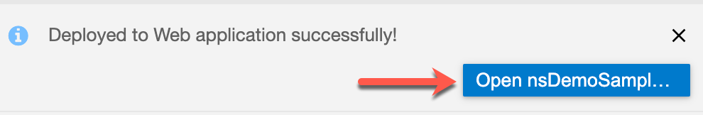

    >You can also open the MDK web application by accessing its URL in *CF* from `.project.json` file.
    !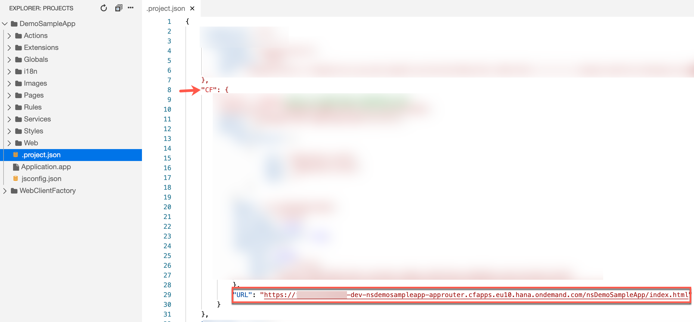

    You will see the **Main** page (with **Logout** option at bottom of the page) and application data service will be initialized. **Since you selected the Base template during the project creation, which generated this empty page without any UI controls on it. In next tutorials, you will add some UI controls to this page and create more pages.**

    !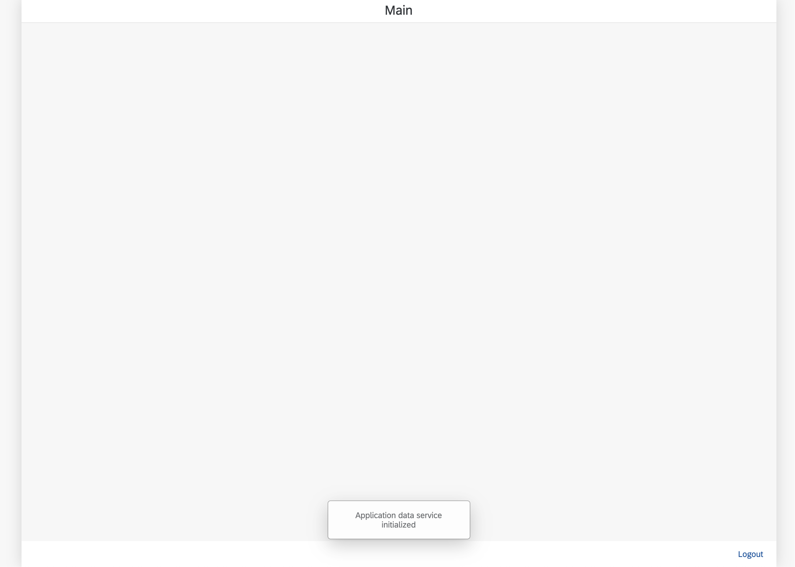

[OPTION END]

[VALIDATE_1]
[ACCORDION-END]

---
