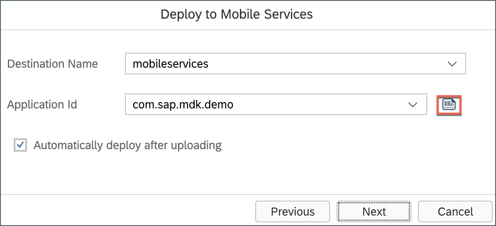
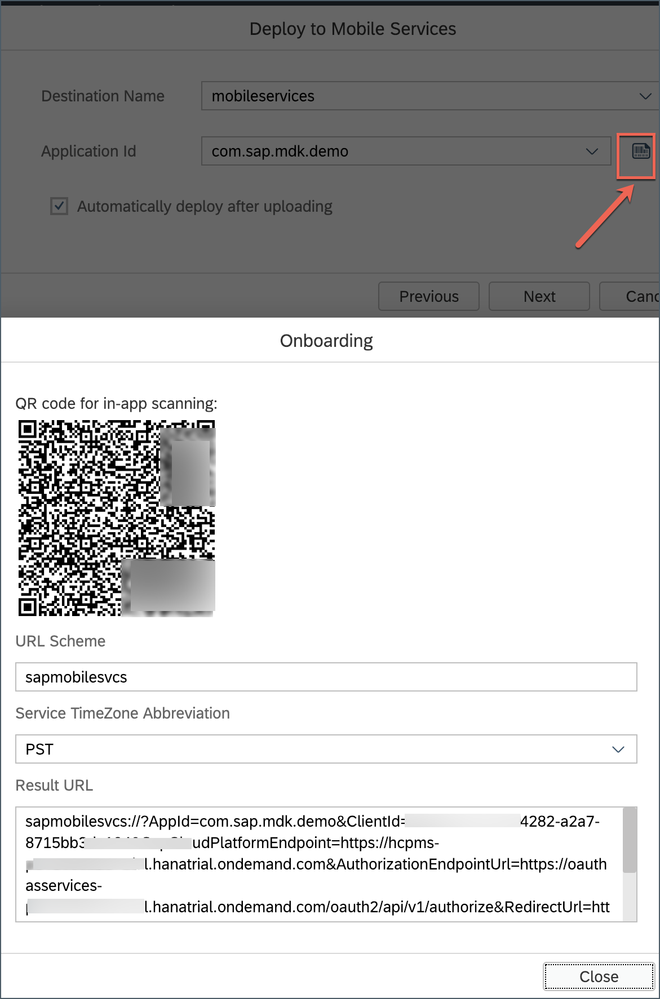
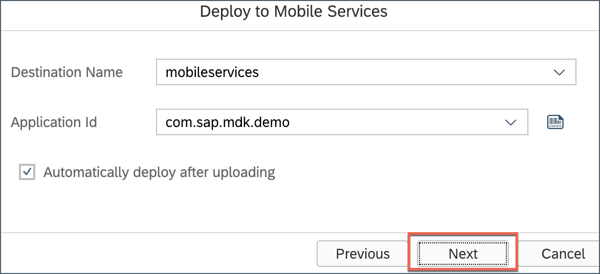
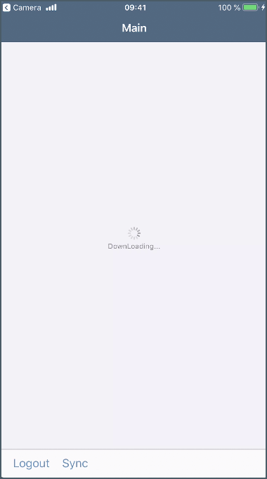

## Prerequisites
- [Enable SAP Web IDE Full-Stack](webide-multi-cloud)
- [Setup initial configuration for an MDK App in SAP Cloud Platform Mobile Services](cp-mobile-dev-kit-ms-setup)
- Download and install **SAP Mobile Services Client** on your [iPhone](https://itunes.apple.com/us/app/sap-mobile-services-client/id1413653544?mt=8)

## Details
### You will learn
  - How to create an MDK app using an existing template in SAP Web IDE
  - How to deploy an MDK app to Mobile Services and run it in a client

---

[ACCORDION-BEGIN [Step 1: ](Set up the application foundation)]

This includes creating the Mobile Development Kit project in the Editor.

Launch the SAP Web IDE and select the **MDK perspective** by clicking on the icon in the left panel.

Right click on Workspace folder and select **New** | **MDK Base Project**.

Enter the Project Name as `DemoSampleApp` and click **Next**.

Leave the default values in _Application Creation_ step as it is, click **Next**.

In _Service Creation_ step, provide and select the below information:

| Field | Value |
|----|----|
| `Name`| `SampleServiceV2` |
| `Service URL` | `/destinations/mobileservices` |
| `Application ID` | `com.sap.mdk.demo` |
| `Service URL` | `com.sap.edm.sampleservice.v2` |
| `Enable Offline Store` | `Should be checked` |

>For Offline OData capability only OData V2 is supported. OData V2 and V4 are supported for Online OData.

>In [previous tutorial](cp-mobile-dev-kit-ms-setup), server-side configuration for this MDK app were already done.

Regardless of whether you are creating an online or offline application, this step is needed app to connect to an OData service. When building an Mobile Development Kit application, it assumes the OData service created and the destination that points to this service is setup in Mobile Services and SAP Cloud Platform.

Since you will create an offline based app, hence _Enable Offline Store_ option is selected.

Click **Check Service** to validate the service properties. If all the details are fine, you will see a success message. Click **Next**.

>Wondering how _Service URL_, _Application ID_ & _Destination Name_ were populated? Well, when you [enabled Mobile Services](fiori-ios-hcpms-setup), a destination `mobileservices` was created under **Destinations** in Cloud Platform Cockpit.

>With help of `mobileservices` destination, SAP Web IDE fetches and populates all the MDK apps (of configuration template type as Mobile Development Kit) and their respective destinations.

>You can look in Mobile Services Cockpit for the destination belongs to the MDK app by clicking on **Connectivity** feature.

>More details on _Sample Back End_ is available in
[help documentation](https://help.sap.com/viewer/38dbd9fbb49240f3b4d954e92335e670/Cloud/en-US/1c2e51a24361487f8b0649702d59dd0f.html).

Select `Customers`, `products`, `SalesOrderHeaders` and  `SalesOrderItems` queries from the dropdown and click **Finish**.

[DONE]
[ACCORDION-END]

[ACCORDION-BEGIN [Step 2: ](Get familar with generated project structure)]

This is how the project structure looks like within the workspace.

These are the metadata definitions available in the editor and the format in which these metadata definitions are stored in the editor. Just to brief on some of these -

**`InitializeOffline.action`**: For offline applications, this action binds the application to the Offline OData server and downloads the required data to the offline store on the mobile device.

**`DownloadOffline.action`** and **`UploadOffline.action`**: Using app initialization, data is downloaded to the offline store. If you want to have the application download any updated data from the backend server or upload changed data to the backend server, these actions will be needed.

**`Success & Failure Message action`**: Here are some messages showing up in the app on a successful or failure of data initialization, sync etc.

**`Main.page`**: This is the first page of your Mobile Development Kit application that is shown. For this application we will use this as a launching page to get to application functionality. We will add the logout action to this page.

**`OnWillUpdate.js`**: MDK applications automatically download updates and apply them to the client without the end-user needing to take any action. The `OnWillUpdate` rule empowers the user to run business logic before the new definitions are applied. This allows the application designer to include logic to prompt the user to accept or defer applying the new definitions based on their current activity. For example, if the end-user is currently adding new customer details or in the middle of a transaction, they will be able to defer the update. The application will prompt again the next time it checks for updates.

**`Application.app`**: this is the main configuration file for your application from within SAP Web IDE. Here you set your start page (here in this tutorial, it is main.page), action settings for different stages of the application session lifecycle, push notifications, and more.

>You can find more details about [metadata definitions](https://help.sap.com/viewer/977416d43cd74bdc958289038749100e/Latest/en-US/78e21fae61044df8ae8a78a43157fe8f.html).

Open the application settings in the application editor by double clicking on the Application.app in the project explorer pane.

[DONE]
[ACCORDION-END]

[ACCORDION-BEGIN [Step 3: ](Deploy and activate the application)]

So far, you have learnt how to build an MDK application in the SAP Web IDE editor. Now, we deploy this application definition to Mobile Services.

Right click on the MDK Application in the project explorer pane and select **MDK Deploy and Activate**.

Let the default configuration as it is and click **Next**.

>_Filter Files_ will be filtered and ignored in web packing process.

>_Externals_ is a list of NPM modules to be excluded from the bundle.

Based on the `mobileservices` destination, you will find list of existing MDK application IDs , select the one you have chosen while creating the project in step 1

>By default, automatically deploy option is selected, In other words, the application is automatically deployed from Mobile Services to your MDK client.

Click on QR code icon to populate QR code for app on-boarding.

Open your phone camera app and start scanning the QR code, as shown below.

Click the toast message to launch **SAP Mobile Services Client**.

>At this moment, **SAP Mobile Services Client** is available only for iOS device.

Before you click on **Start** in client app, first finish the deployment from SAP Web IDE. Click **Next**.

You should see **Application deployed successfully** message in console log.

[DONE]
[ACCORDION-END]

[ACCORDION-BEGIN [Step 4: ](Run the app in MDK client)]

The MDK client receives deployed metadata definitions as a bundle.

Click **Start** to connect MDK client to SAP Cloud Platform.

Enter your SAP Cloud Platform credentials and click **Log On** to authenticate.

**Agree** on `End User License Agreement`.

Choose a passcode with at least 8 characters for unlocking the app and click **Next**.

Confirm the passcode and click **Done**.

Optionally, you can enable Touch ID to get faster access to the app data, click **Enable**.

Click **OK**.

Now, you will see Main page being displayed and Offline store is being initialized.

[VALIDATE_1]
[ACCORDION-END]

---
