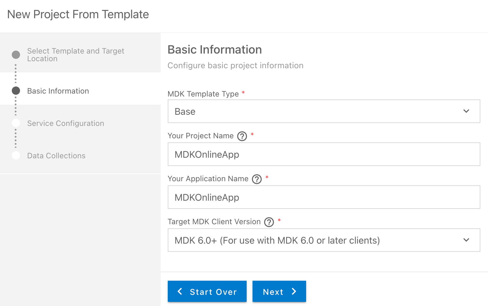
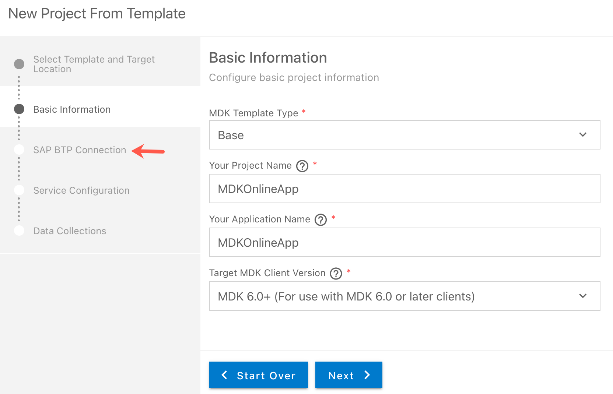
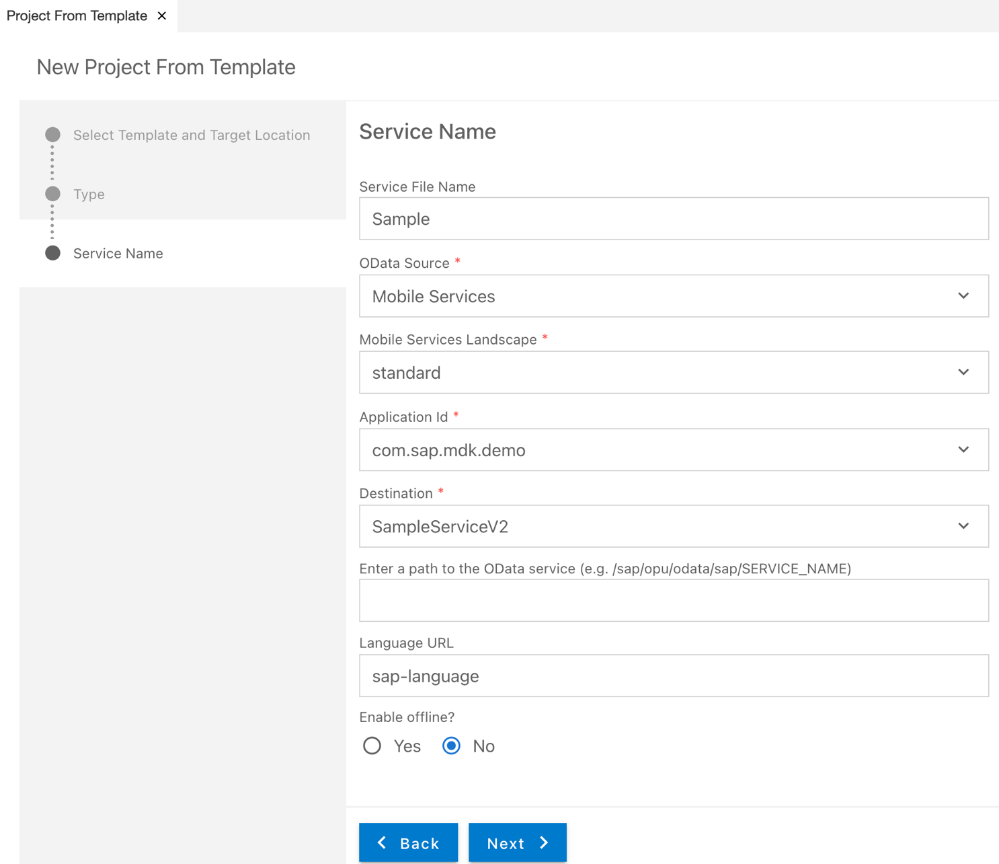
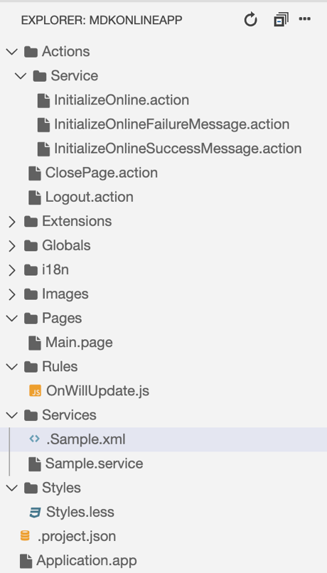
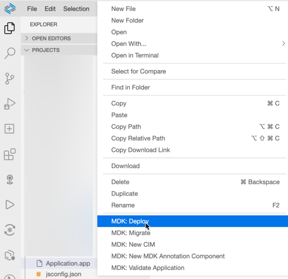
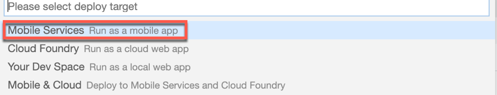
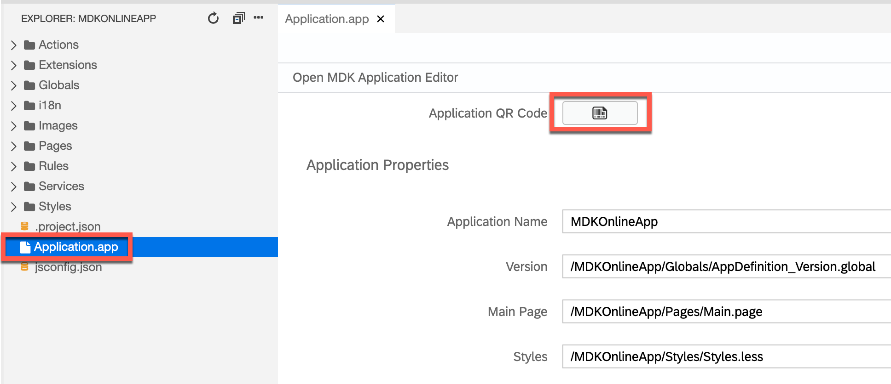
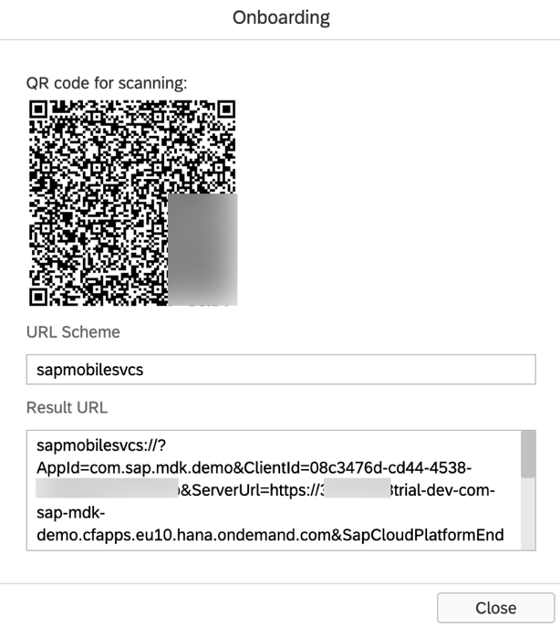
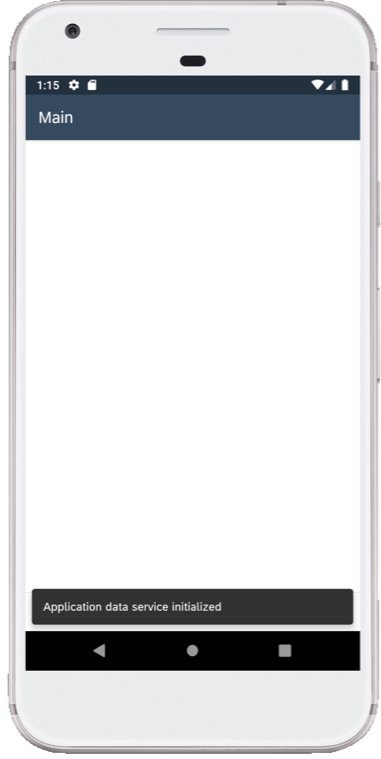
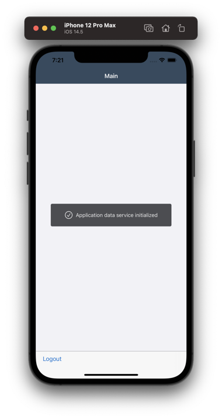

## Prerequisites
- **Tutorial group:** [Set Up for the Mobile Development Kit (MDK)](group.mobile-dev-kit-setup)
- **Download and install:** **SAP Mobile Services Client** on your [iOS](https://apps.apple.com/us/app/sap-mobile-services-client/id1413653544) or [Android](https://play.google.com/store/apps/details?id=com.sap.mobileservices.client) device (If you are connecting to `AliCloud` accounts then you will need to brand your [custom MDK client](cp-mobile-dev-kit-build-client) by allowing custom domains.)

## Details
### You will learn
  - How to create an MDK Online app using an existing template in SAP Business Application Studio
  - How to deploy an MDK app to Mobile Services and run it in a client

You may clone an existing project from [GitHub repository](https://github.com/SAP-samples/cloud-mdk-tutorial-samples/tree/master/4-Level-Up-with-the-Mobile-Development-Kit/1-Create-an-MDK-Online-App) and start directly with step 4 in this tutorial.

---

[ACCORDION-BEGIN [Step 1: ](Get familiar with use case)]

With Mobile Development Kit, you can also create applications that are online or always connected and make calls to the backend servers for each action you take in the application.

[DONE]
[ACCORDION-END]

[ACCORDION-BEGIN [Step 2: ](Create a new MDK project in SAP Business Application Studio)]

This step includes creating the mobile development kit project in the editor.

1. Launch the [Dev space](cp-mobile-bas-setup) in SAP Business Application Studio.

2. Click **Start from template** on Welcome page.

    !

    >If you do not see the Welcome page, you can access it via **Help** menu or via **View** menu > Find Command > Welcome.

3. Select **MDK Project** and click **Start**.

    !

    >If you do not see the **MDK Project** option check if your Dev Space has finished loading or reload the page in your browser and try again.

4. In *Basic Information* step, provide the below information and click **Next**:

    | Field | Value |
    |----|----|
    | `MDK Template Type`| Select `Base` from the dropdown |
    | `Your Project Name` | Provide a name of your choice. `MDKOnlineApp` is used for this tutorial | 
    | `Your Application Name` | <default name is same as project name, you can provide any name of your choice> |
    | `Target MDK Client Version` | Leave the default selection as `MDK 6.0+ (For use with MDK 6.0 or later clients)` |
    | `Choose a target folder` | By default, the target folder uses project root path. However, you can choose a different folder path |

    !

    >The `Base` template creates the offline or online actions, rules, messages and an empty page (`Main.page`). After using this template, you can focus on creating your pages, other actions, and rules needed for your application. More details on _MDK template_ is available in [help documentation](https://help.sap.com/doc/f53c64b93e5140918d676b927a3cd65b/Cloud/en-US/docs-en/guides/getting-started/mdk/bas.html#creating-a-new-project-cloud-foundry).

    >This screen will only show up when your CF login session has expired. Enter your login credentials, click Login icon and select the org & space where you have set up the initial configuration for your MDK app.

    >!

5. In *Service configuration* step, provide the below information and click **Next**:

    | Field | Value |
    |----|----|
    | `Data Source` | Select `Mobile Services` from the dropdown |
    | `Mobile Services Landscape` | Select `standard` from the dropdown |
    | `Application Id` | Select `com.sap.mdk.demo` from the dropdown |
    | `Destination` | Select `SampleServiceV2` from the dropdown |
    | `Enter a path to the OData service` | Leave it as it is |
    | `Enable Offline` | Choose `No` |

    !

    >Regardless of whether you are creating an online or offline application, this step is needed for the app to connect to an OData service. When building an Mobile Development Kit application, it assumes the OData service created and the destination that points to this service is set up in Mobile Services.

6. After clicking **Finish**, the wizard will generate your MDK Application based on your selections. You should now see the `MDKOnlineApp` project in the project explorer.

[DONE]
[ACCORDION-END]

[ACCORDION-BEGIN [Step 3: ](Get familiar with generated project structure)]

This is how the project structure looks like within the workspace.

!

These are the metadata definitions available in the editor and the format in which these metadata definitions are stored in the editor. Just to brief on some of these:

  - **`InitializeOnline.action`**: This action initializes the application data service .

  - **`InitializeOnline Success & Failure Message action`**: Here are some messages showing up in the app on a successful or failure of application data service initialization.

  - **`Main.page`**: This is the first page of your MDK application that is shown. For this application we will use this as a launching page to get to application functionality. We will add the logout action to this page.

  - **`OnWillUpdate.js`**: MDK applications automatically download updates and apply them to the client without the end-user needing to take any action. The `OnWillUpdate` rule empowers the user to run business logic before the new definitions are applied. This allows the application designer to include logic to prompt the user to accept or defer applying the new definitions based on their current activity. For example, if the end-user is currently adding new customer details or in the middle of a transaction, they will be able to defer the update. The application will prompt again the next time it checks for updates.

  - **`Web`**: In this folder, you can provide web specific app resource files and configurations.

- **`Application.app`**: this is the main configuration file for your application from within SAP Business Application Studio. Here you set your start page (here in this tutorial, it is main.page), action settings for different stages of the application session lifecycle, push notifications, and more.

>You can find more details about [metadata definitions](https://help.sap.com/doc/69c2ce3e50454264acf9cafe6c6e442c/Latest/en-US/docs-en/reference/schemadoc/App.schema.html).

[DONE]
[ACCORDION-END]

[ACCORDION-BEGIN [Step 4: ](Deploy the application)]

So far, you have learned how to build an MDK application in the SAP Business Application Studio editor. Now, you will deploy the application definitions to Mobile Services to use in the Mobile client.

1. Right-click `Application.app` and select **MDK: Deploy**.

    !

2. Select deploy target as **Mobile Services**.

    !

    If you want to enable source for debugging the deployed bundle, then choose **Yes**.

    !

    You should see **Deploy to Mobile Services successfully!** message.

    !

[DONE]
[ACCORDION-END]

[ACCORDION-BEGIN [Step 5: ](Display the QR code for onboarding the Mobile app)]

SAP Business Application Studio has a feature to display the QR code for onboarding in the Mobile client.

Click the **Application.app** to open it in MDK Application Editor and then click the **Application QR Code** icon.

!

The On-boarding QR code is now displayed.

!

>Leave the Onboarding dialog box open for the next step.

[DONE]
[ACCORDION-END]

[ACCORDION-BEGIN [Step 6: ](Run the app)]

>Make sure you are choosing the right device platform tab above. Once you have scanned and on-boarded using the onboarding URL, it will be remembered. When you Log out and on-board again, you will be asked either to continue to use current application or to scan new QR code.

[OPTION BEGIN [Android]]

Follow [these steps](https://github.com/SAP-samples/cloud-mdk-tutorial-samples/blob/master/Onboarding-Android-client/Onboarding-Android-client.md) to on-board the MDK client.

After you accept app update, you will see **Main** page being displayed and application data service is initialized.

[OPTION END]

[OPTION BEGIN [iOS]]

Follow [these steps](https://github.com/SAP-samples/cloud-mdk-tutorial-samples/blob/master/Onboarding-iOS-client/Onboarding-iOS-client.md) to on-board the MDK client.

Once you accept app update, you will see **Main** page being displayed and application data service is initialized.

[OPTION END]

>Once you have scanned and on-boarded using the onboarding URL, it will be remembered. When you Log out and on-board again, you will be asked either to continue to use current application or to scan new QR code.

[VALIDATE_1]
[ACCORDION-END]

---
