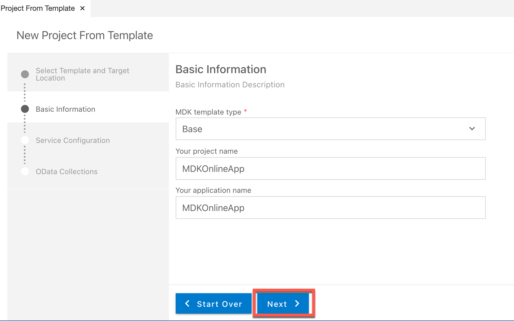
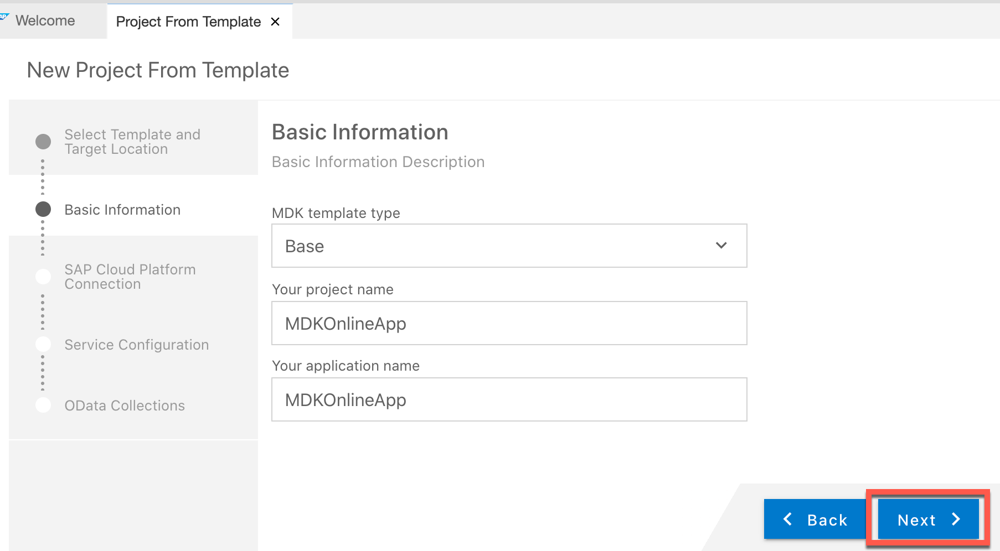
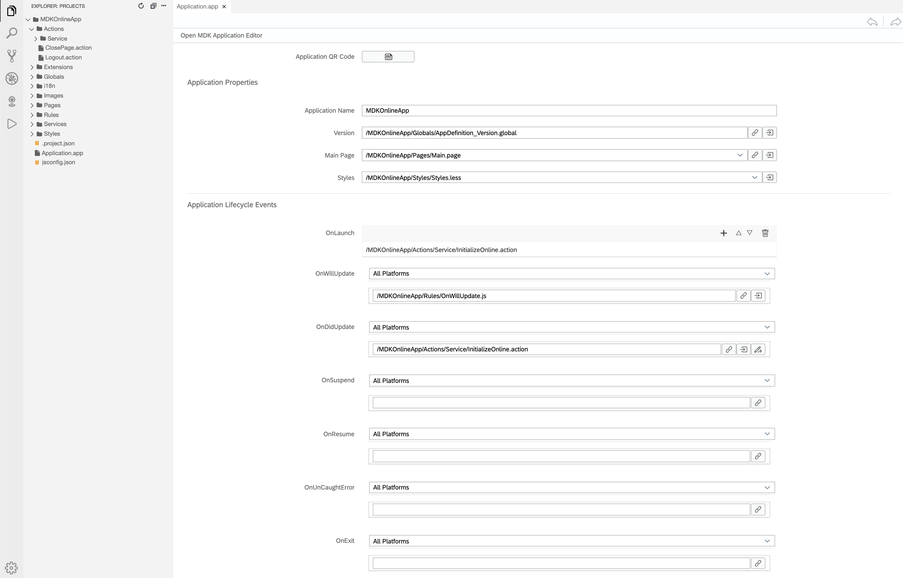
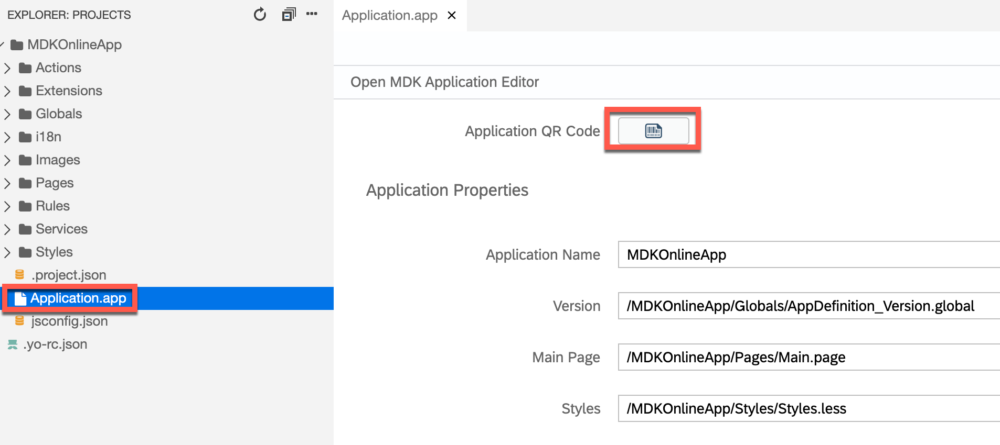
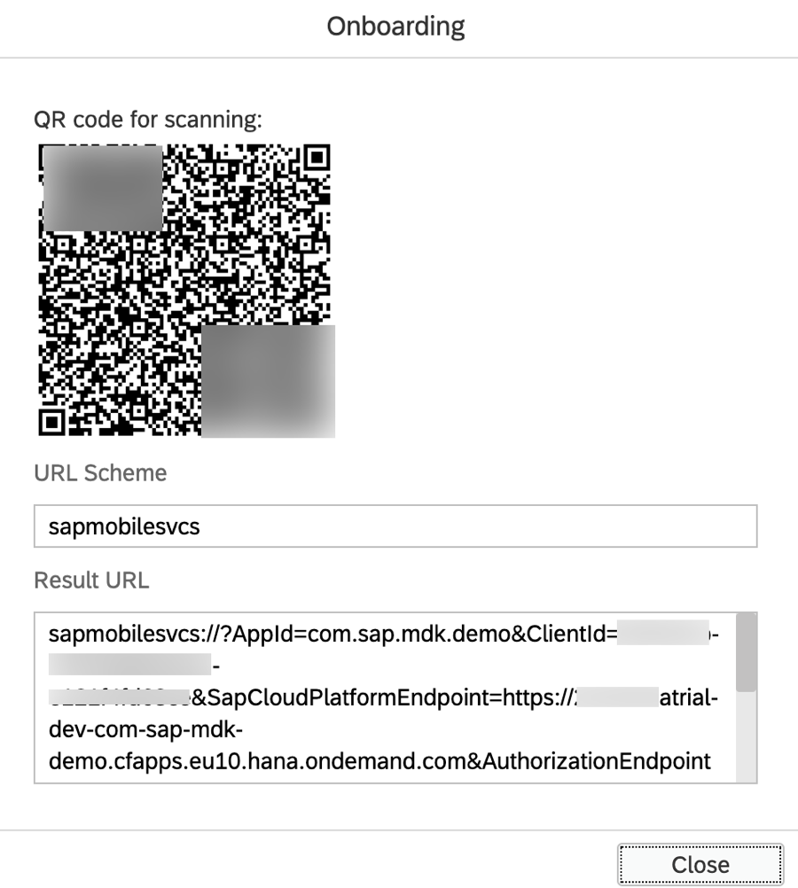
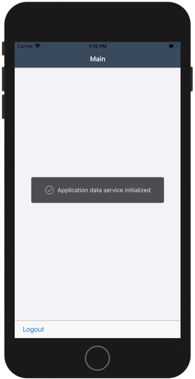

## Prerequisites
- **Tutorial group:** [Set Up for the Mobile Development Kit (MDK)](group.mobile-dev-kit-setup)
- **Download and install:** **SAP Mobile Services Client** on your [iOS](https://apps.apple.com/us/app/sap-mobile-services-client/id1413653544) or [Android](https://play.google.com/store/apps/details?id=com.sap.mobileservices.client) device

## Details
### You will learn
  - How to create an MDK Online app using an existing template in SAP Business Application Studio
  - How to deploy an MDK app to Mobile Services and run it in a client

You may clone an existing project from [GitHub repository](https://github.com/SAP-samples/cloud-mdk-tutorial-samples/tree/master/4-Level-Up-with-the-Mobile-Development-Kit/1-Create-an-MDK-Online-App) and start directly with step 4 in this tutorial.

---

[ACCORDION-BEGIN [Step 1: ](Get familiar with use case)]

With Mobile Development Kit, you can also create applications that are online or always connected and make calls to the backend servers for each action you take in the application.

[DONE]
[ACCORDION-END]

[ACCORDION-BEGIN [Step 2: ](Create a new MDK project in SAP Business Application Studio)]

This step includes creating the mobile development kit project in the editor.

1. Launch the [Dev space](cp-mobile-bas-setup) in SAP Business Application Studio.

2. If you do not see the **Welcome** page, navigate to *View* menu &rarr; *Find Command* &rarr; search with *Welcome* to launch the Welcome page.

    !

3. In Welcome page, click **New project from template** .

    !

4. Select **MDK Project** and click **Next**.

    !

5. In *Basic Information* step, select or provide the below information and click **Next**:

    | Field | Value |
    |----|----|
    | `MDK Template Type`| Select `Base` from the dropdown |
    | `Your Project Name` | `MDKOnlineApp` |
    | `Your Project Name` | <default name is same as Project name, you can provide any name of your choice> |

    !

    >The `Base` template creates the offline or online actions, rules, messages and an empty page (`Main.page`). After using this template, you can focus on creating your pages, other actions, and rules needed for your application.

    >More details on _MDK template_ is available in [help documentation](https://help.sap.com/doc/f53c64b93e5140918d676b927a3cd65b/Cloud/en-US/docs-en/guides/getting-started/mdk/bas.html#creating-a-new-project-cloud-foundry).  

6. In *SAP Cloud Platform Connection* step, you will see your Cloud Foundry Organization and Space information. If you are not logged on yet, provide required credentials to retrieve your details. Click **Next**.

    !

7. In *Service Configuration* step, provide or select the below information and click **Next**:

    | Field | Value |
    |----|----|
    | `Service File Name`| `<You can continue with default name or provide any name of your choice>` |
    | `OData Source` | Select `Mobile Services` from the dropdown |
    | `Application Id` | Select `com.sap.mdk.demo` from the dropdown |
    | `Destination` | Select `com.sap.edm.sampleservice.v2` from the dropdown |
    | `Enable Offline` | Choose `No` |

    >For Offline OData capability only OData V2 is supported. OData V2 and V4 are supported for Online OData.

    !

    >In [this tutorial](cp-mobile-dev-kit-ms-setup), server-side configuration for this MDK app were already done.  

    Regardless of whether you are creating an online or offline application, this step is needed app to connect to an OData service. When building an Mobile Development Kit application, it assumes the OData service created and the destination that points to this service is setup in Mobile Services.

9. After clicking **Next**, the wizard will generate your MDK Application based on your selections. You should now see the `DemoSampleApp` project in the project explorer. As you have already opened the workspace, there is no need to open the generated project in new workspace or to add it to workspace. Ignore the pop-up or click the cross icon to hide the window.

    !

[DONE]
[ACCORDION-END]

[ACCORDION-BEGIN [Step 3: ](Get familiar with generated project structure)]

This is how the project structure looks like within the workspace.

!

These are the metadata definitions available in the editor and the format in which these metadata definitions are stored in the editor. Just to brief on some of these:

  - **`CreateService.action`**: This action binds the OData service to your application.

  - **`OpenService.action`**: This action allows your application to see the data within the OData service.

  - **`CreateOpenService Success & Failure Message action`**: Here are some messages showing up in the app on a successful or failure of application data service initialization.

  - **`Main.page`**: This is the first page of your Mobile Development Kit application that is shown. For this application we will use this as a launching page to get to application functionality. We will add the logout action to this page.

  - **`OnWillUpdate.js`**: MDK applications automatically download updates and apply them to the client without the end-user needing to take any action. The `OnWillUpdate` rule empowers the user to run business logic before the new definitions are applied. This allows the application designer to include logic to prompt the user to accept or defer applying the new definitions based on their current activity. For example, if the end-user is currently adding new customer details or in the middle of a transaction, they will be able to defer the update. The application will prompt again the next time it checks for updates.

- **`Application.app`**: this is the main configuration file for your application from within SAP Business Application Studio. Here you set your start page (here in this tutorial, it is main.page), action settings for different stages of the application session lifecycle, push notifications, and more.

>You can find more details about [metadata definitions](https://help.sap.com/doc/69c2ce3e50454264acf9cafe6c6e442c/Latest/en-US/docs-en/reference/schemadoc/App.schema.html).

Open the application settings in the application editor by double clicking on the `Application.app`.

!

>In MDK online use case, you need **create** and **open** service actions chained together for your online provider.

>`CreateService.action` should be set at `OnLaunch` and success of this action should call `OpenService.action`.
!

>You can find more details about [OData actions](https://help.sap.com/doc/69c2ce3e50454264acf9cafe6c6e442c/Latest/en-US/docs-en/reference/schemadoc/Action/ODataService/Create.schema.html).

[DONE]
[ACCORDION-END]

[ACCORDION-BEGIN [Step 4: ](Deploy and activate the application)]

So far, you have learned how to build an MDK application in the SAP Business Application Studio editor. Now, we deploy this application definition to Mobile Services.

Right-click `Application.app` and select **MDK: Deploy**.

!

You should see **Deploy Succeeded** message.

!

[DONE]
[ACCORDION-END]

[ACCORDION-BEGIN [Step 5: ](Populate the QR code for app onboarding)]

SAP Business Application Studio has a feature to generate QR code for app onboarding.

Double-click the `Application.app` to open it in MDK Application Editor and click **Application QR Code** icon to populate the QR code.

!

!

[DONE]
[ACCORDION-END]

[ACCORDION-BEGIN [Step 6: ](Run the app in MDK client)]

>Make sure you are choosing the right device platform tab above. Once you have scanned and onboarded using the onboarding URL, it will be remembered. When you Log out and onboard again, you will be asked either to continue to use current application or to scan new QR code.

[OPTION BEGIN [Android]]

Follow [these steps](https://github.com/SAP-samples/cloud-mdk-tutorial-samples/blob/master/Onboarding-Android-client/Onboarding-Android-client.md) to on-board the MDK client.

Once you accept app update, you will see **Main** page being displayed and application data service is initialized.

[OPTION END]

[OPTION BEGIN [iOS]]

Follow [these steps](https://github.com/SAP-samples/cloud-mdk-tutorial-samples/blob/master/Onboarding-iOS-client/Onboarding-iOS-client.md) to on-board the MDK client.

Once you accept app update, you will see **Main** page being displayed and application data service is initialized.

[OPTION END]

>Once you have scanned and onboarded using the onboarding URL, it will be remembered. When you Log out and onboard again, you will be asked either to continue to use current application or to scan new QR code.

**Congratulations!** You have successfully created an MDK online app and you are now all set to [Handle Error Archive in an MDK App](cp-mobile-dev-kit-error-archive).

[VALIDATE_1]
[ACCORDION-END]

---
