## Prerequisites
- - **Tutorial:** [Set Up Initial Configuration for an MDK App](cp-mobile-dev-kit-ms-setup)
- - **Tutorial:** [Enable Mobile Services App Development Tools](cp-mobile-dev-tools-setup)
- **Download and install** **SAP Mobile Services Client** on your [iOS](https://itunes.apple.com/us/app/sap-mobile-services-client/id1413653544?mt=8) or [Android](https://play.google.com/store/apps/details?id=com.sap.mobileservices.client) device
- **Download and install** [Barcode Scanner](https://play.google.com/store/apps/details?id=com.google.zxing.client.android&hl=en) (required only for Android device)

## Details
### You will learn
  - How to create an MDK Online app using an existing template in SAP Web IDE
  - How to deploy an MDK app to Mobile Services and run it in a client

---

[ACCORDION-BEGIN [Step 1: ](Get familiar with use case)]

With Mobile Development Kit, you can also create applications that are online or always connected and make calls to the backend servers for each action you take in the application.

[DONE]
[ACCORDION-END]

[ACCORDION-BEGIN [Step 2: ](Set up the application foundation)]

Make sure that you have already created a new destination `mobileservices_cf` as per [previous tutorial](fiori-ios-hcpms-setup). This is required to connect SAP Web IDE to Mobile Services  on Cloud Foundry environment.

This step includes creating the Mobile Development Kit project in the Editor.

Launch the SAP Web IDE and select the **MDK perspective** by clicking on the icon in the left panel.

Right click on Workspace folder and select **New** | **MDK Base Project**.

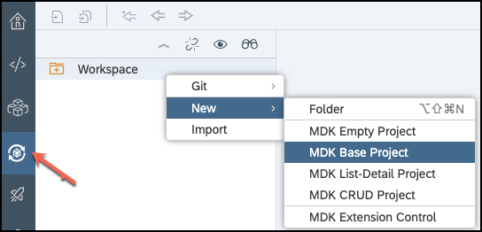

>The _MDK Base Project_ template creates the offline or online actions, rules, messages and an empty page (`Main.page`). After using this template, you can focus on creating your pages, other actions, and rules needed for your application.

>More details on _MDK template_ is available in [help documentation](https://help.sap.com/viewer/977416d43cd74bdc958289038749100e/Latest/en-US/cfd84e66bde44d8da09f250f1b8ecee6.html).

Enter the **Project Name** as `MDKOnlineApp` and click **Next**.

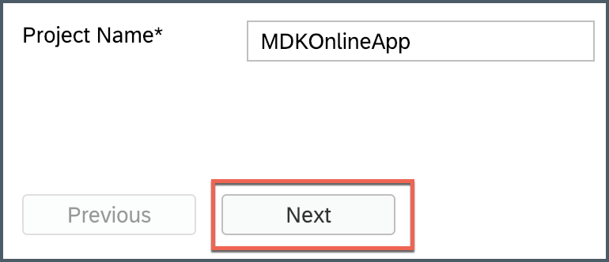

Leave the default values in _Application Creation_ step as it is, click **Next**.

In _Service Creation_ step, provide and select the below information:

| Field | Value |
|----|----|
| `Name`| `SampleServiceV2` |
| `Service URL` | `/destinations/mobileservices_cf` |
| `Application ID` | `com.sap.mdk.demo` |
| `Service URL` | `com.sap.edm.sampleservice.v2` |

> If you do not find `mobileservices_cf` destination, please ensure that you have followed [this tutorial](fiori-ios-hcpms-setup) to setup this destination in SAP Cloud Platform cockpit.

>If a pop-up appears then enter your cloud platform User Name and password to authenticate.

>For Offline OData capability only OData V2 is supported. OData V2 and V4 are supported for Online OData.

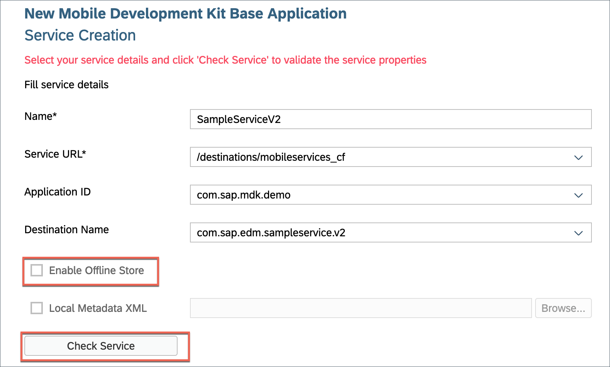

>In [previous tutorial](cp-mobile-dev-kit-ms-setup), server-side configuration for this MDK app were already done.

Regardless of whether you are creating an online or offline application, this step is needed app to connect to an OData service. When building an Mobile Development Kit application, it assumes the OData service created and the destination that points to this service is setup in Mobile Services and SAP Cloud Platform.

Click **Check Service** to validate the service properties. If all the details are fine, you will see a success message. Click **Next**.

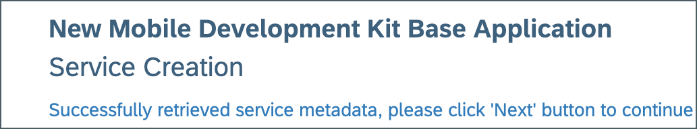

>Wondering how _Service URL_, _Application ID_ & _Destination Name_ were populated? As part of [this](fiori-ios-hcpms-setup) tutorial, you created a destination `mobileservices_cf` in Cloud Platform cockpit, SAP Web IDE fetches all these details based on this destination.

>You can look in SAP Cloud Platform Mobile Services cockpit for the destination belongs to the MDK app by clicking on **Mobile Connectivity** feature.

>More details on _Sample Back End_ is available in [help documentation](https://help.sap.com/viewer/468990a67780424a9e66eb096d4345bb/Cloud/en-US/1c2e51a24361487f8b0649702d59dd0f.html).

Leave the default configuration as it is and click **Next** and then click **Finish**.

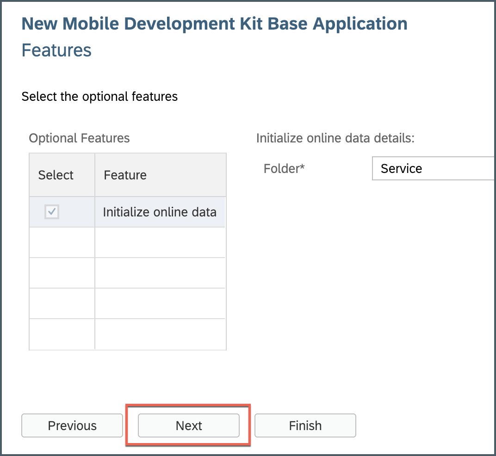

After clicking Finish, the wizard will generate your MDK Application based on your selections. You should now see the `MDKOnlineApp` project in the project explorer.

[DONE]
[ACCORDION-END]

[ACCORDION-BEGIN [Step 3: ](Get familiar with generated project structure)]

This is how the project structure looks like within the workspace.

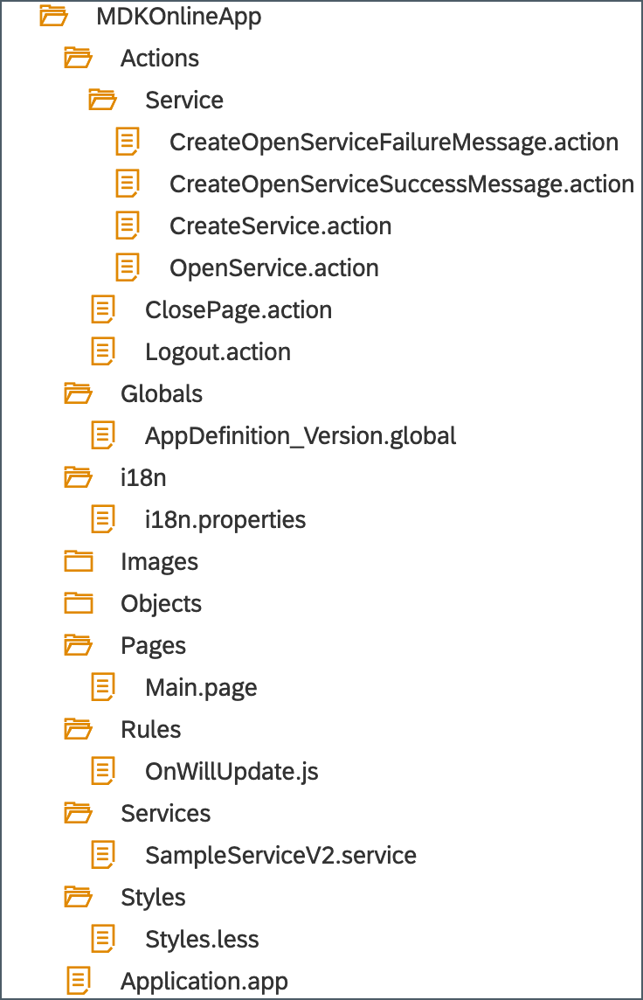

These are the metadata definitions available in the editor and the format in which these metadata definitions are stored in the editor. Just to brief on some of these:

  - **`CreateService.action`**: This action binds the OData service to your application.

  - **`OpenService.action`**: This action allows your application to see the data within the OData service.

  - **`CreateOpenService Success & Failure Message action`**: Here are some messages showing up in the app on a successful or failure of application data service initialization.

  - **`Main.page`**: This is the first page of your Mobile Development Kit application that is shown. For this application we will use this as a launching page to get to application functionality. We will add the logout action to this page.

  - **`OnWillUpdate.js`**: MDK applications automatically download updates and apply them to the client without the end-user needing to take any action. The `OnWillUpdate` rule empowers the user to run business logic before the new definitions are applied. This allows the application designer to include logic to prompt the user to accept or defer applying the new definitions based on their current activity. For example, if the end-user is currently adding new customer details or in the middle of a transaction, they will be able to defer the update. The application will prompt again the next time it checks for updates.

  - **`Application.app`**: this is the main configuration file for your application from within SAP Web IDE. Here you set your start page (here in this tutorial, it is main.page), action settings for different stages of the application session lifecycle, push notifications, and more.

>You can find more details about [metadata definitions](https://help.sap.com/viewer/977416d43cd74bdc958289038749100e/Latest/en-US/78e21fae61044df8ae8a78a43157fe8f.html).

Open the application settings in the application editor by double clicking on the Application.app in the project explorer pane.

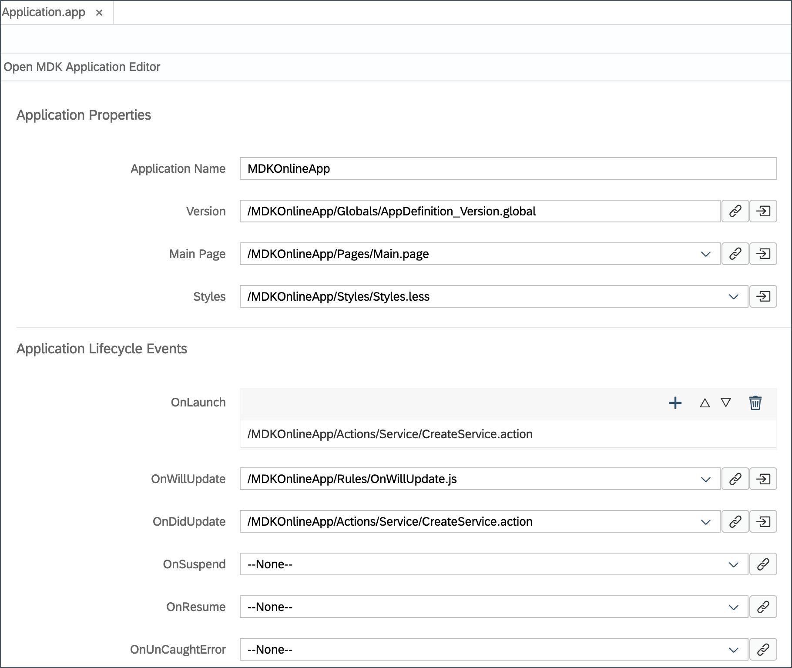

>In MDK online use case, you need **create** and **open** service actions chained together for your online provider.

>`CreateService.action` should be set at `OnLaunch` and success of this action should call `OpenService.action`.
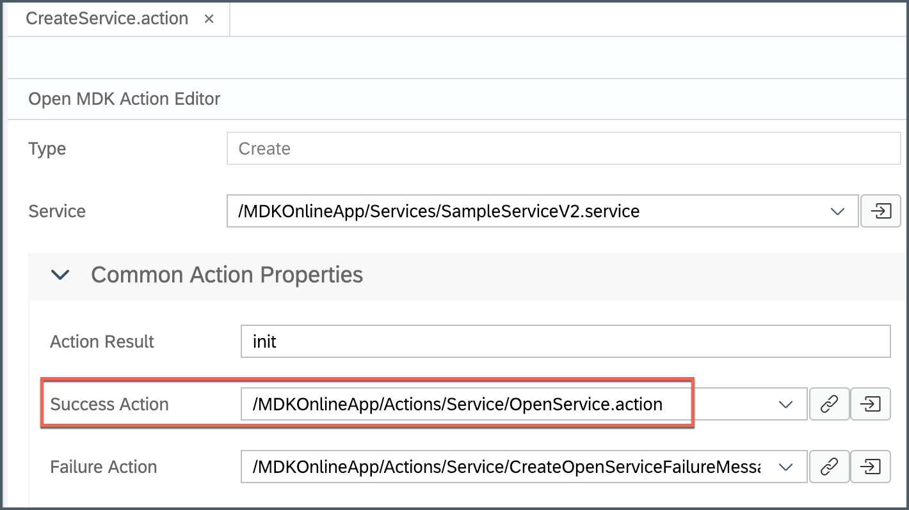

>You can find more details about [OData actions](https://help.sap.com/viewer/977416d43cd74bdc958289038749100e/Latest/en-US/3f462c086df846439d59fa88a2b4536b.html).

[DONE]
[ACCORDION-END]

[ACCORDION-BEGIN [Step 4: ](Deploy and activate the application)]

So far, you have learnt how to build an MDK application in the SAP Web IDE editor. Now, we deploy this application definition to Mobile Services.

Right click on the `MDKOnlineApp` MDK Application in the project explorer pane and select **MDK Deploy and Activate**.

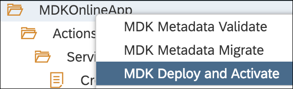

Let the default configuration as it is and click **Next**.

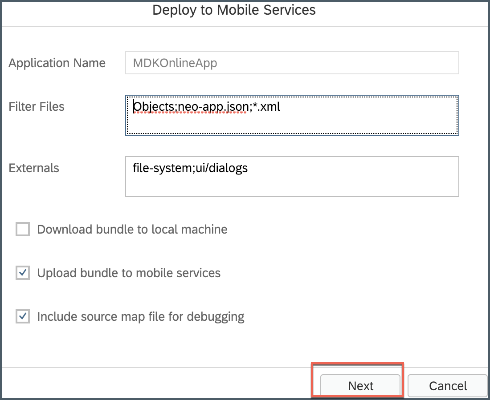

>_Filter Files_ will be filtered and ignored in web packing process.

>_Externals_ are the list of NPM modules that are part of the MDK Client application and should not be validated in the bundle.

Click the drop down for Destination Name and select the `mobileservices_cf` destination, you will find list of existing application IDs, select the one you have chosen while creating the project.

>By default, automatically deploy option is selected, In other words, the application is automatically deployed from Mobile Services to your MDK client.

Click **Next** to finish the deployment from SAP Web IDE.

You should see **Application deployed successfully** message in console log.

[DONE]
[ACCORDION-END]

[ACCORDION-BEGIN [Step 5: ](Populate the QR code for app on-boarding)]

SAP Web IDE has a feature to generate QR code for app on-boarding.

Right click on the `MDKOnlineApp` MDK Application in the project explorer pane and select **MDK Deploy and Activate**.

Let the default configuration as it is and click **Next**.

Click on QR code icon to populate QR code for app on-boarding.

[DONE]
[ACCORDION-END]

[ACCORDION-BEGIN [Step 6: ](Run the app in MDK client)]

>Make sure you are choosing the right device platform tab above.

[OPTION BEGIN [Android]]

On Android, the camera app does not support scanning the QR-code. As alternative you can use the [Barcode scanner app](https://play.google.com/store/apps/details?id=com.application_4u.qrcode.barcode.scanner.reader.flashlight&hl=en_IN) to scan it.

Open the Barcode scanner app and start scanning the QR code showing in SAP Web IDE.

Tap **Open browser**. It will open SAP Mobile Services Client app.

Tap **GET STARTED** to connect MDK client to SAP Cloud Platform.

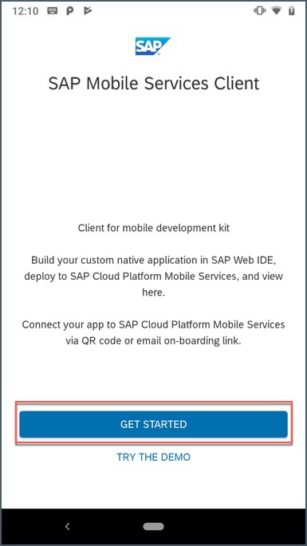

Enter Email address and password to login to SAP Cloud Platform and tap **Log On** to authenticate.

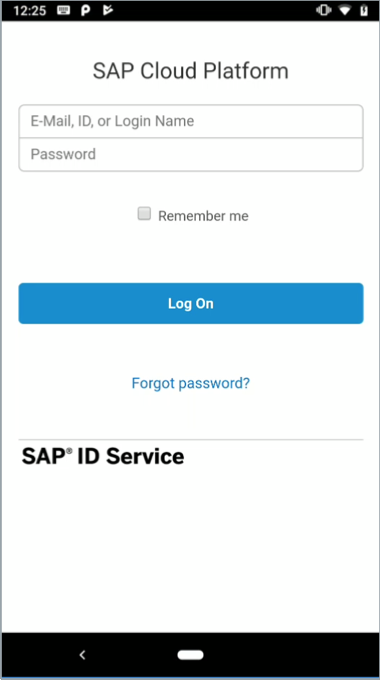

Tap **AGREE** on `End User License Agreement`.

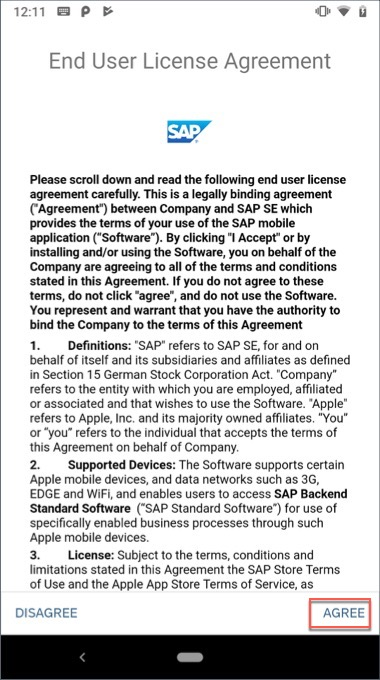

Choose a passcode with at least 8 characters for unlocking the app and tap **NEXT**.

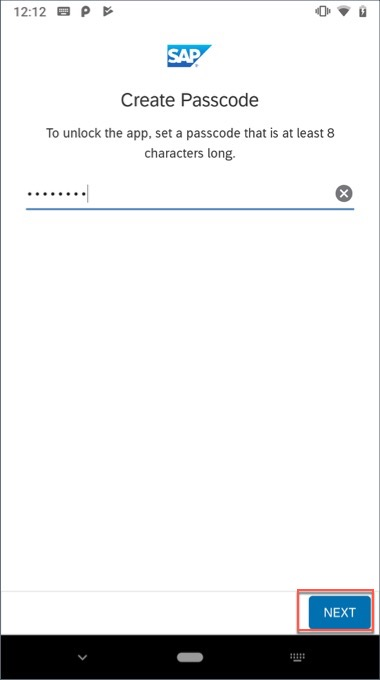

Confirm the passcode and tap **DONE**.

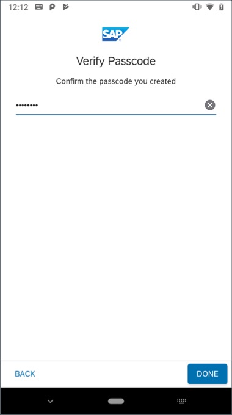

Optionally, you can enable fingerprint to get faster access to the app data.

Tap **OK**.

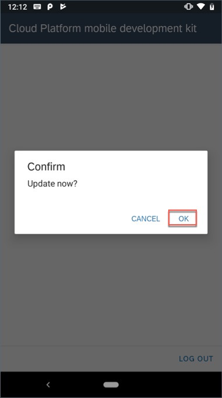

The MDK client receives deployed metadata definitions as a bundle.

Now, you will see **Main** page being displayed and application data service is initialized.

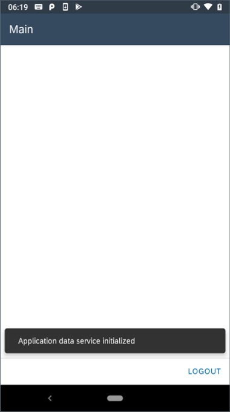

[OPTION END]

[OPTION BEGIN [iOS]]

On iPhone, open your camera app and start scanning the QR code, as shown below.

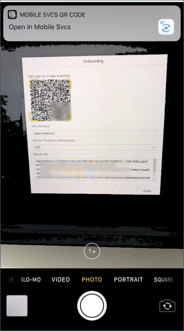

Tap the toast message to launch **SAP Mobile Services Client**. It will open SAP Mobile Services Client app.

Tap **Start** to connect MDK client to SAP Cloud Platform.

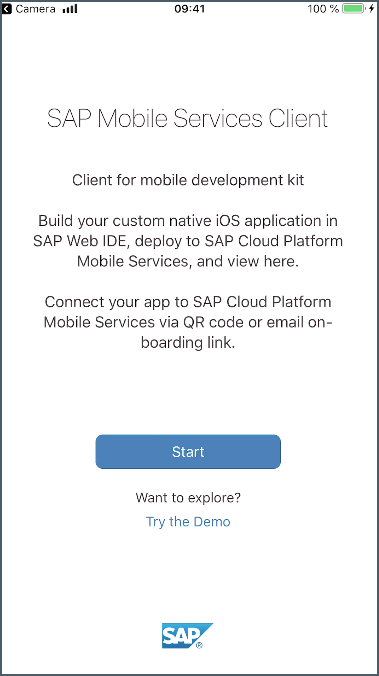

Enter Email address and password to login to SAP Cloud Platform and tap **Log On** to authenticate.

Tap **Agree** on `End User License Agreement`.

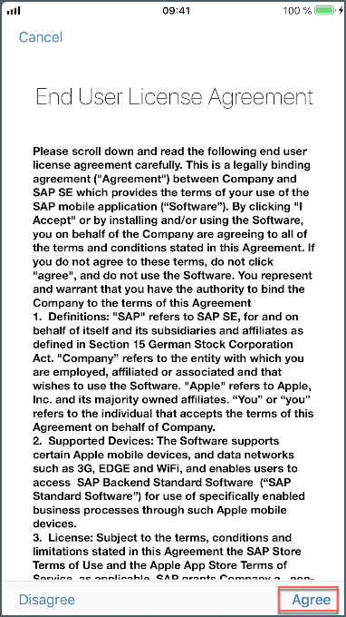

Choose a passcode with at least 8 characters for unlocking the app and tap **Next**.

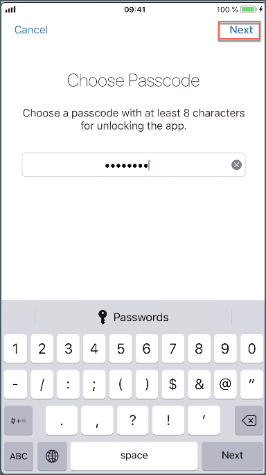

Confirm the passcode and tap **Done**.

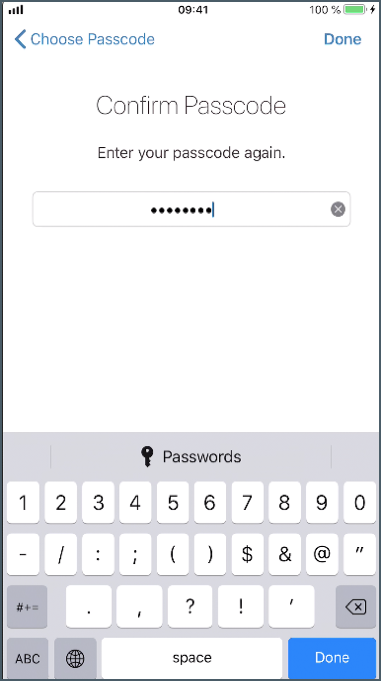

Optionally, you can enable Touch ID to get faster access to the app data, tap **Enable**.

Tap **OK**.

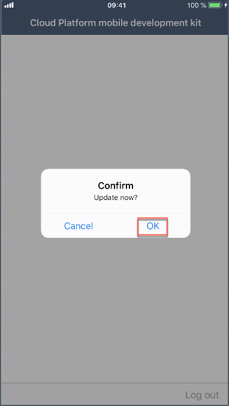

The MDK client receives deployed metadata definitions as a bundle.

Now, you will see **Main** page being displayed and application data service is initialized.

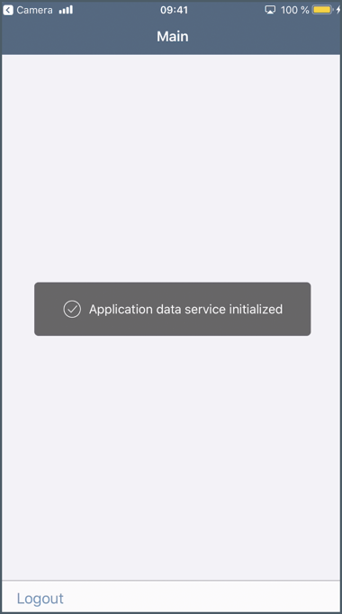

[OPTION END]

You can now continue creating your first page to show [customers list](https://developers.sap.com/tutorials/cp-mobile-dev-kit-list-page.html).

[VALIDATE_1]
[ACCORDION-END]

---
