- **Tutorial group:** [Set Up for the Mobile Development Kit (MDK)](group.mobile-dev-kit-setup)
- **Download and install:** **SAP Mobile Services Client** on your [iOS](https://apps.apple.com/us/app/sap-mobile-services-client/id1413653544) or [Android](https://play.google.com/store/apps/details?id=com.sap.mobileservices.client) device
- **Download and install** [Barcode Scanner](https://play.google.com/store/apps/details?id=com.google.zxing.client.android&hl=en) (required only for Android device)

## Details
### You will learn
  - How to use MDK push register action
  - How to use predefined push configuration for the public store version of SAP Mobile Services client (MDK client)
  - How to send push notification to an MDK app

You may clone an existing metadata project from [GitHub repository](https://github.com/SAP-samples/cloud-mdk-tutorial-samples/tree/master/4-Level-Up-with-the-Mobile-Development-Kit/6-Enable-Push-Notifications-in-the-MDK-Public-Store-Client) and start directly with step 4 in this tutorial.

---

[ACCORDION-BEGIN [Step 1: ](Set up the application foundation)]

Make sure that you have already created a new destination `mobileservices_cf` as per [previous tutorial](fiori-ios-hcpms-setup). This is required to connect SAP Web IDE to Mobile Services on Cloud Foundry environment and have setup initial configuration in SAP Cloud Platform Mobile Services as per [this tutorial](cp-mobile-dev-kit-ms-setup).

This step includes creating the Mobile Development Kit project in the Editor.

1.  Launch the SAP Web IDE and select the **MDK perspective** by clicking on the icon in the left panel.

    Right-click the workspace folder and select **New** | **MDK Empty Project**.

    

    >More details on _MDK template_ is available in [help documentation](https://help.sap.com/doc/f53c64b93e5140918d676b927a3cd65b/Cloud/en-US/docs-en/guides/getting-started/mdk/webide.html#creating-a-new-project).

2.  Enter the **Project Name** as `mdk_push` and click **Next**.

    

3. Leave the default values in _Application Creation_ step as it is, click **Finish**.

4. After clicking Finish, the wizard will generate your MDK project `mdk_push` based on your selections.

[DONE]
[ACCORDION-END]

[ACCORDION-BEGIN [Step 2: ](Create MDK actions to register for push notifications)]

In this step, you will create the following actions:

* **Push Notification Register action**: this will register the device with SAP Cloud Platform Mobile Services for push notification.

* **Message actions**: these will display a message if Push Notification Register action has succeeded or failed.

1. Create a Push Notification Register action.

    Right-click the **Actions** folder | **New MDK Action** | choose **MDK Other Actions** in **Category** | click **Push Notification Register Action** | **Next**.

    

    Provide the below information:

    | Property | Value |
    |----|----|
    | `Action Name`| `PushRegister` |

    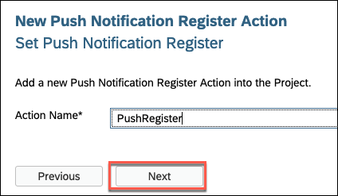

    >More details on _Push Notification Action_ is available in [help documentation](https://help.sap.com/doc/69c2ce3e50454264acf9cafe6c6e442c/Latest/en-US/docs-en/reference/schemadoc/Action/PushNotificationRegister.schema.html).

    Click **Next** and then **Finish** on the confirmation step.

2. Define a success message if the Push Register Notification action is succeeded.

    Right-click the **Actions** folder | **New MDK Action** | choose **MDK Message Actions** in **Category** | click **Message Action** | **Next**.

    

    Provide the below information:

    | Property | Value |
    |----|----|
    | `Action Name`| `PushRegisterSuccessMessage` |
    | `Type` | select `Message` |
    | `Message` | `Push Notification registered` |
    | `Title` | `Success` |
    | `OKCaption` | `OK` |
    | `OnOK` | `--None--` |
    | `CancelCaption` | leave it blank |
    | `OnCancel` | `--None--` |

    

    Click **Next** and then **Finish** on the confirmation step.

3. Define a failure message if the Push Register Notification action is failed.

    Right-click the **Actions** folder | **New MDK Action** | choose **MDK Message Actions** in **Category** | click **Message Action** | **Next**.

    

    Provide the below information:

    | Property | Value |
    |----|----|
    | `Action Name`| `PushRegisterFailureMessage` |
    | `Type` | select `Message` |
    | `Message` | `Push Notification didn't register` |
    | `Title` | `Failure` |
    | `OKCaption` | `OK` |
    | `OnOK` | `--None--` |
    | `CancelCaption` | leave it blank |
    | `OnCancel` | `--None--` |

    

    Click **Next** and then **Finish** on the confirmation step.

4. Define _Success_ and _Failure_ actions for `PushRegister.action`.

    In the action editor for the new action, expand the **Common Action Properties** and provide the below information:

    | Property | Value |
    |----|----|
    | `Success Action` | `PushRegisterSuccessMessage.action` |
    | `Failure Action` | `PushRegisterFailureMessage.action` |

    >When `PushRegister.action` gets executed successfully then `PushRegisterSuccessMessage.action` will be triggered or if `PushRegister.action` fails then `PushRegisterFailureMessage.action` will be triggered.

      

5. Save the changes to the `PushRegister.action`.

[DONE]
[ACCORDION-END]

[ACCORDION-BEGIN [Step 3: ](Call the push register action)]

In the step, you will set and call the Push Register Notification action when app is updated with the new metadata.

>It is up to developers how they want to call a Push Register Notification action.

1.  Double-click `Application.app` file, select the `PushRegister.action` for the `OnDidUpdate` event.

    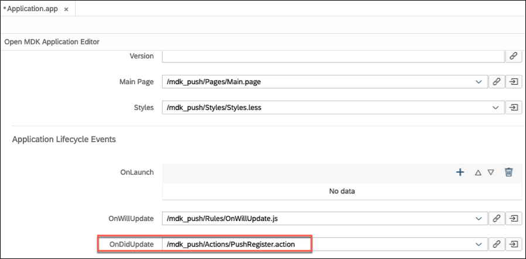

2. Save the changes to `Application.app` file.

[DONE]
[ACCORDION-END]

[ACCORDION-BEGIN [Step 4: ](Deploy and activate application)]

So far, you have learned how to build an MDK application in the SAP Web IDE editor. Now, we deploy this application definition to Mobile Services.

1.  Right-click the `mdk_push` MDK Application in the project explorer pane and select **MDK Deploy and Activate**.

    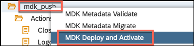

2. Let the default configuration as it is and click **Next**.

    

    >**Filter files**: will be filtered and ignored in web packing process.

    >**Externals**: are the list of NPM modules that are part of the MDK Client application and should not be validated in the bundle.

3.  Confirm the destination name and application id match where you want to deploy.

    

    >By default, automatically deploy option is selected, In other words, the application is automatically deployed from Mobile Services to your MDK client.

4.  Click **Next** to finish the deployment from SAP Web IDE.

You should see **Application deployed successfully** message in console log.

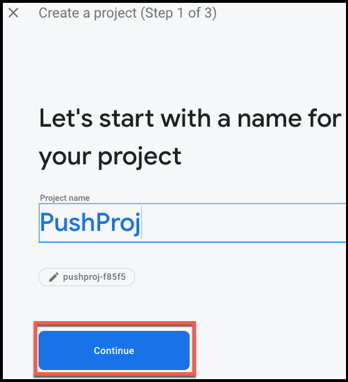

[DONE]
[ACCORDION-END]

[ACCORDION-BEGIN [Step 5: ](Define push notification settings in app configuration)]

1. Open the [SAP Cloud Platform Mobile Services cockpit](cp-mobile-dev-kit-ms-setup), click **Mobile Push Notification** feature.

    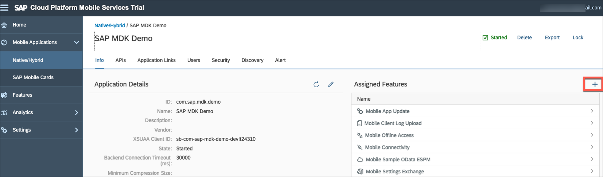

2. Select **SAP Mobile Services Client** under **Predefined for** option, click **Save**.

    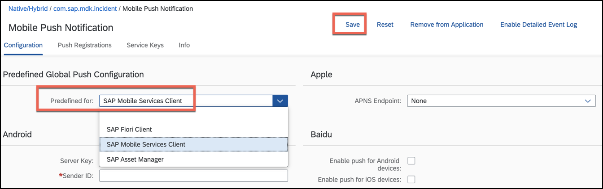

    >Predefined push is supported only for the MDK (SAP Mobile Services client) public store client.

    >If you want to enable push notification in your custom MDK client then follow [this](cp-mobile-dev-kit-push-customclient) tutorial.

[VALIDATE_1]
[ACCORDION-END]

[ACCORDION-BEGIN [Step 6: ](Populate the QR code for app onboarding)]

SAP Web IDE has a feature to generate QR code for app onboarding.

Right click the `mdk_push` MDK Application in the project explorer pane and select **MDK Show QR Code**.

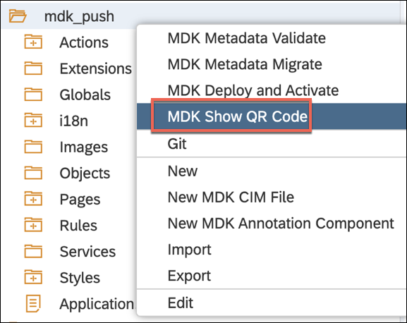

>**MDK Show QR Code** option is greyed out if MDK project is not yet deployed and activated as per step 3.

[DONE]
[ACCORDION-END]

[ACCORDION-BEGIN [Step 7: ](Run the app in MDK client)]

>Make sure you are choosing the right device platform tab above. Once you have scanned and onboarded using the onboarding URL, it will be remembered. When you Log out and onboard again, same onboarding URL settings will be reused without the need to scan. You will need to use 3rd party QR scanner app in Android or device Camera in iOS, if you would like to scan a different onboarding URL.

[OPTION BEGIN [Android]]

1. Launch **`Mobile Svcs`** app on your Android device. Tap **GET STARTED** to connect MDK client to SAP Cloud Platform.

    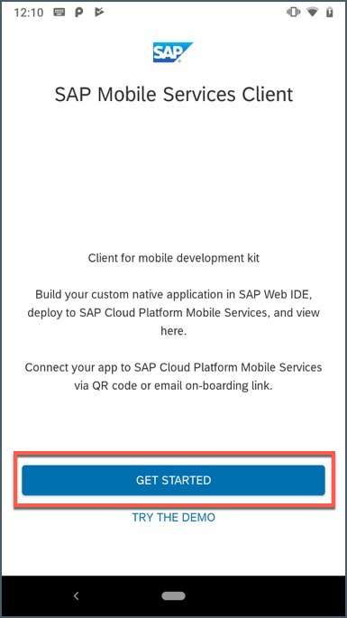

2. Tap **QR CODE SCAN** to start the device camera for scanning the onboarding QR code.

    

3. Once scan is succeeded, tap **CONTINUE**.

    

4. Enter Email address and password to login to SAP Cloud Platform and tap **Log On** to authenticate.

    

5. Tap **AGREE** on `End User License Agreement`.

    

6. Choose a passcode with at least 8 characters for unlocking the app and tap **NEXT**.

    

7. Confirm the passcode and tap **DONE**.

    

8. The MDK client receives deployed metadata definitions as a bundle. Click **OK** to confirm.

    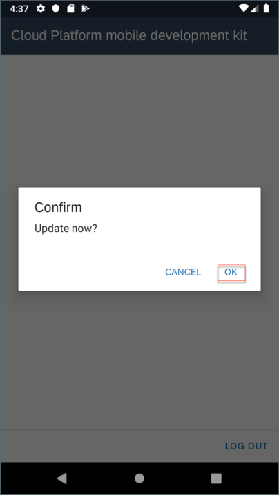

9. If push registration is successful, a message should show **Push Notification Registered**. Click **OK**.

    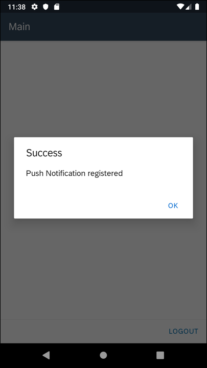

    >Once you have scanned and onboarded using the onboarding URL, it will be remembered. When you Log out and onboard again, same onboarding URL settings will be reused without the need to scan. You will need to use 3rd party QR scanner app in Android or device Camera in iOS, if you would like to scan a different onboarding URL.

    It is time now to send the first push notification from the **SAP Cloud Platform Mobile Services push notification feature**.

10. Navigate to Mobile Services cockpit. In **Mobile Push Notification** feature, switch to **Push Registrations** tab.

11. There you will find information about user registered for push notification and also details about Push providers. Identify your Device ID and click **Send Notification**.

    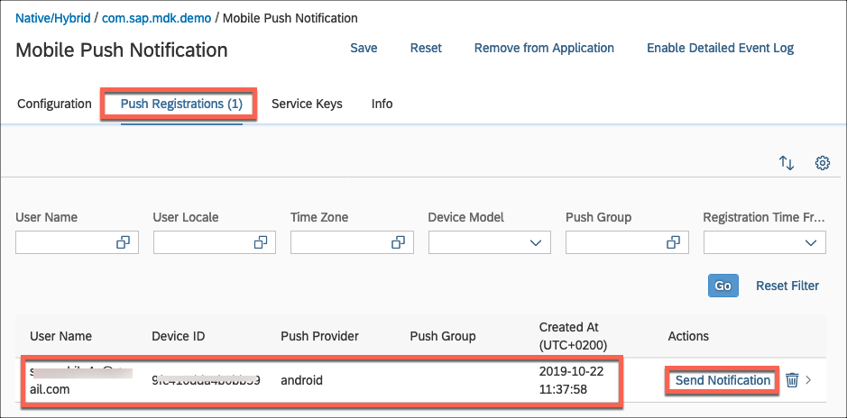

12. In notification dialog, type a notification message and click **Send**.

    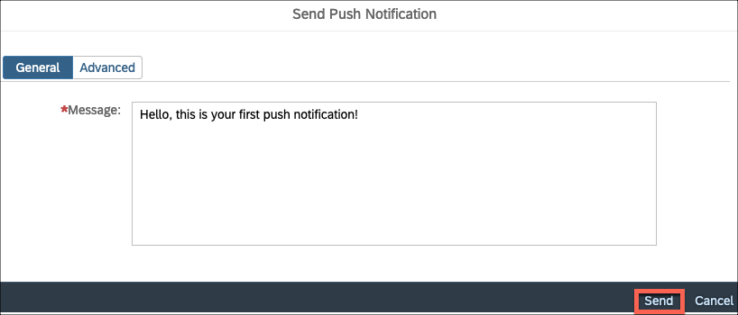

    You will see a success toast message.

    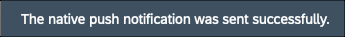

    After sending notification, mobile device should receive the message.

    

[OPTION END]

[OPTION BEGIN [iOS]]

1. Launch **`Mobile Svcs`** app on your iOS device. Tap **Scan** to start the device camera for scanning the onboarding QR code.

    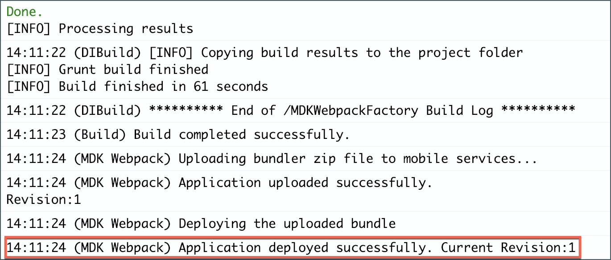

2. Once scan is succeeded, tap **Continue**.

    

3. Enter Email address and password to login to SAP Cloud Platform and tap **Log On** to authenticate.

    

4. Tap **Agree** on `End User License Agreement`.

    

5. Choose a passcode with at least 8 characters for unlocking the app and tap **Next**.

    

6. Confirm the passcode and tap **Done**.

    

7. The MDK client receives deployed metadata definitions as a bundle. Click **OK** to confirm.

    

    You will also notice that it will first ask permission to display notifications.

    

8. If push registration is successful, a message should show **Push Notification Registered**. Click **OK**.

    

    >Once you have scanned and onboarded using the onboarding URL, it will be remembered. When you Log out and onboard again, same onboarding URL settings will be reused without the need to scan. You will need to use 3rd party QR scanner app in Android or device Camera in iOS, if you would like to scan a different onboarding URL.

    It is time now to send the first push notification from the **SAP Cloud Platform Mobile Services push notification feature**.

9. Navigate to Mobile Services cockpit. In **Mobile Push Notification** feature, switch to **Push Registrations** tab.

10. There you will find information about user registered for push notification and also details about Push providers. Identify your Device ID and click **Send Notification**.

    

11. In notification dialog, type a notification message and click **Send**.

    

    You will see a success toast message.

    

    After sending notification, mobile device should receive the message.

    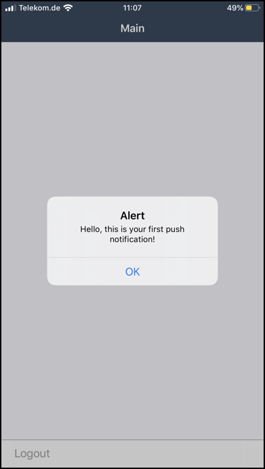

    If you have Apple watch connected to the iPhone device, you can also see same push notification on the Apple Watch.

    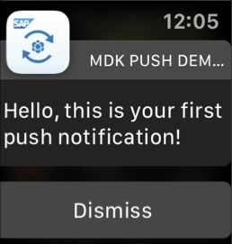

    >MDK supports rich push notification. MDK does not run on smart watches or as an Apple watch application.

[OPTION END]

Congratulations, you have successfully completed **Level Up with the Mobile Development Kit** mission and you are now all set to [Brand Your Customized App with Mobile Development Kit SDK](mission.mobile-dev-kit-brand) mission.

[DONE]
[ACCORDION-END]

---
