## Prerequisites
- - **Tutorial:** [Set Up Initial Configuration for an MDK App](cp-mobile-dev-kit-ms-setup)
- - **Tutorial:** [Enable Mobile Services App Development Tools](cp-mobile-dev-tools-setup)
- **Download and install** **SAP Mobile Services Client** on your [iOS](https://itunes.apple.com/us/app/sap-mobile-services-client/id1413653544?mt=8) or [Android](https://play.google.com/store/apps/details?id=com.sap.mobileservices.client) device
- **Download and install** [Barcode Scanner](https://play.google.com/store/apps/details?id=com.google.zxing.client.android&hl=en) (required only for Android device)

## Details
### You will learn
  - How to create an MDK sample app using a template in SAP Web IDE
  - How to deploy an MDK app to Mobile Services and run it in a client

---

[ACCORDION-BEGIN [Step 1: ](Set up the application foundation)]

This step includes creating the Mobile Development Kit project in the Editor.

Launch the SAP Web IDE and select the **MDK perspective** by clicking on the icon in the left panel.

Right click on Workspace folder and select **New** | **MDK CRUD Project**.

>The `MDK CRUD Project` template creates the offline or online actions, rules, messages, List Detail Pages with editable options.

>More details on _MDK template_ is available in [help documentation](https://help.sap.com/viewer/977416d43cd74bdc958289038749100e/Latest/en-US/cfd84e66bde44d8da09f250f1b8ecee6.html).    

Enter the Project Name as `MDKSampleApp` and click **Next**.

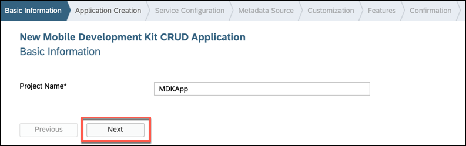

Leave the default values in _Application Creation_ step as it is, click **Next**.

In _Service Configuration_ step, provide and select the below information:

| Field | Value |
|----|----|
| `Name`| `SampleServiceV2` |
| `Service URL` | select `/destinations/mobileservices_cf` destination |
| `Application ID` | `com.sap.mdk.demo` |
| `Destination Name` | `com.sap.edm.sampleservice.v2` |
| `Enable Offline Store` | `Should be checked` |

> If you do not find `mobileservices_cf` destination, please ensure that you have followed [this tutorial](fiori-ios-hcpms-setup) to setup this destination in SAP Cloud Platform cockpit.

>If you see a _Authentication Required_ pop-up, then enter your cloud platform User Name and password to authenticate.

>For Offline OData capability only OData V2 is supported. OData V2 and V4 are supported for Online OData.

>In [previous tutorial](cp-mobile-dev-kit-ms-setup), server-side configuration for this MDK app were already done.

Regardless of whether you are creating an online or offline application, this step is needed app to connect to an OData service. When building an Mobile Development Kit application, it assumes the OData service created and the destination that points to this service is setup in Mobile Services.

Since you will create an offline based app, hence _Enable Offline Store_ option is selected.

Click **Check Service** to validate the service properties. If all the details are fine, you will see a success message. Click **Next**.

>Wondering how _Service URL_, _Application ID_ & _Destination Name_ were populated? As part of [enabled Mobile Services](fiori-ios-hcpms-setup) tutorial, you created a destination `mobileservices_cf` in Cloud Platform Cockpit, SAP Web IDE fetches all these details based on this destination.

>You can look in SAP Cloud Platform Mobile Services Cockpit for the destination belongs to the MDK app by clicking on **Mobile Connectivity** feature.

>More details on _Sample Back End_ is available in [help documentation](https://help.sap.com/viewer/468990a67780424a9e66eb096d4345bb/Cloud/en-US/1c2e51a24361487f8b0649702d59dd0f.html).

In the **Metadata Source** step, select all **Entity Type** and click **Next**.

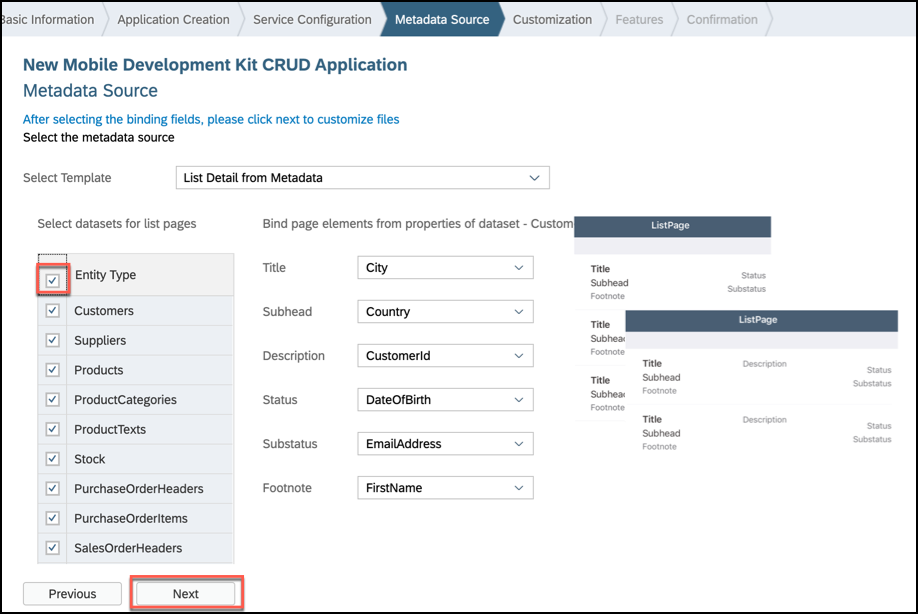

>You can overwrite default binding of page elements from properties of dataset by clicking on the dropdown.

In the **Customization** step, click **Next**, let's stick to the defaults.

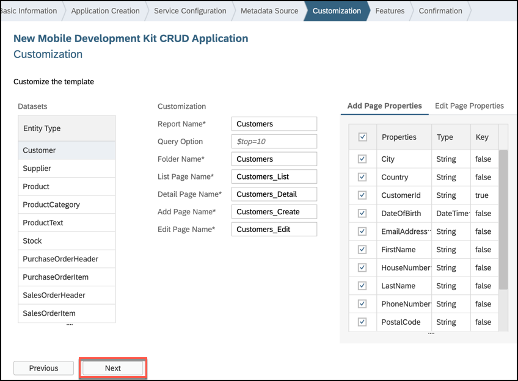

>In this step, You can customize your template, for instance, just ask for the first 10 customers, so that the list is not too long. You can also add other page properties or change the list of the pages that will be generated.

In the **Feature** step, click **Finish**, let's stick to the defaults.

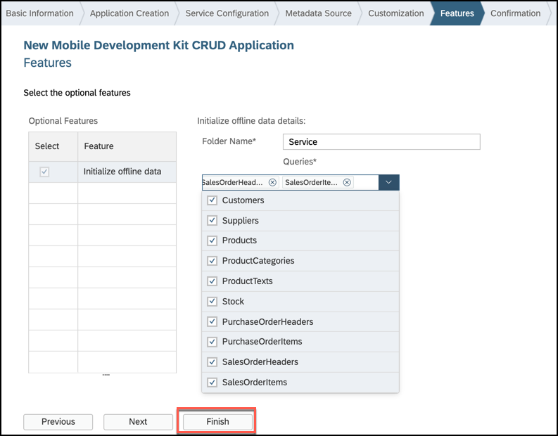

>In this step, you can rename the Folder name which will have initialize offline data details, you can also select which defining queries you want to get initialized.

After clicking Finish, the wizard will generate your MDK Application based on your selections. You should now see the `MDKApp` project in the project explorer.

[DONE]
[ACCORDION-END]

[ACCORDION-BEGIN [Step 2: ](Get familiar with generated project structure)]

This is how the project structure looks like within the workspace.

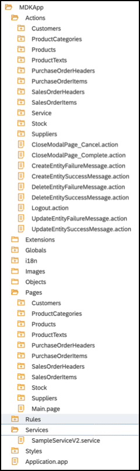

These are the metadata definitions available in the editor and the format in which these metadata definitions are stored in the editor. Just to brief on some of these:

**`InitializeOffline.action`**: For offline applications, this action binds the application to the Offline OData server and downloads the required data to the offline store on the mobile device.

**`DownloadOffline.action`** and **`UploadOffline.action`**: Using app initialization, data is downloaded to the offline store. If you want to have the application download any updated data from the backend server or upload changed data to the backend server, these actions will be needed.

**`Success & Failure Message action`**: Here are some messages showing up in the app on a successful or failure of data initialization, sync etc.

**`Main.page`**: This is the first page of your Mobile Development Kit application that is shown. For this application we will use this as a launching page to get to application functionality. We will add the logout action to this page.

**`OnWillUpdate.js`**: MDK applications automatically download updates and apply them to the client without the end-user needing to take any action. The `OnWillUpdate` rule empowers the user to run business logic before the new definitions are applied. This allows the application designer to include logic to prompt the user to accept or defer applying the new definitions based on their current activity. For example, if the end-user is currently adding new customer details or in the middle of a transaction, they will be able to defer the update. The application will prompt again the next time it checks for updates.

**`Application.app`**: this is the main configuration file for your application from within SAP Web IDE. Here you set your start page (here in this tutorial, it is main.page), action settings for different stages of the application session lifecycle, push notifications, and more.

>You can find more details about [metadata definitions](https://help.sap.com/viewer/977416d43cd74bdc958289038749100e/Latest/en-US/78e21fae61044df8ae8a78a43157fe8f.html).

Open the application settings in the application editor by double clicking on the `Application.app` in the project explorer pane.

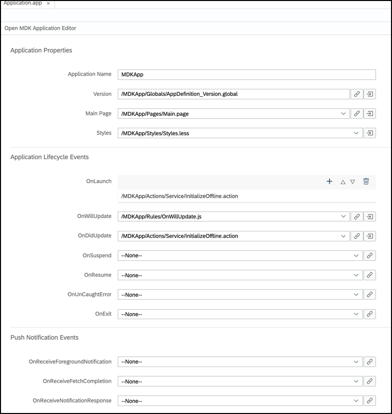

[DONE]
[ACCORDION-END]

[ACCORDION-BEGIN [Step 3: ](Deploy and activate the application)]

So far, you have learned how to build an MDK application in the SAP Web IDE editor. Now, we deploy this application definition to Mobile Services.

Right click on the `MDKApp` MDK Application in the project explorer pane and select **MDK Deploy and Activate**.

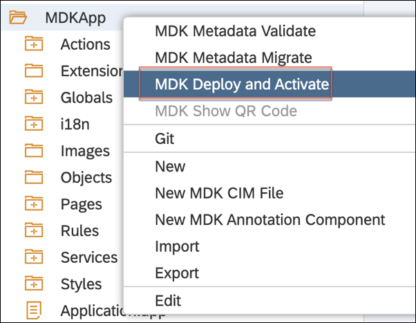

Let the default configuration as it is and click **Next**.

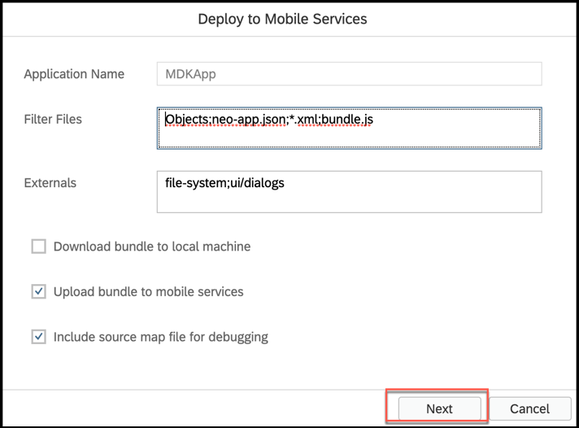

>_Filter Files_ will be filtered and ignored in web packing process.

>_Externals_ are the list of NPM modules that are part of the MDK Client application and should not be validated in the bundle.

Click the drop down for Destination Name and select the `mobileservices_cf` destination, you will find list of existing application IDs, select the one you have chosen while creating the project.

>By default, automatically deploy option is selected, In other words, the application is automatically deployed from Mobile Services to your MDK client.

Click **Next** to finish the deployment from SAP Web IDE.

You should see **Application deployed successfully** message in console log.

[DONE]
[ACCORDION-END]

[ACCORDION-BEGIN [Step 4: ](Populate the QR code for app on-boarding)]

SAP Web IDE has a feature to generate QR code for app on-boarding.

Right click on the `DemoSampleApp` MDK Application in the project explorer pane and select **MDK Deploy and Activate**.

Click **Next**.

Click on the **QR-code icon** to populate the QR-code for app on-boarding.

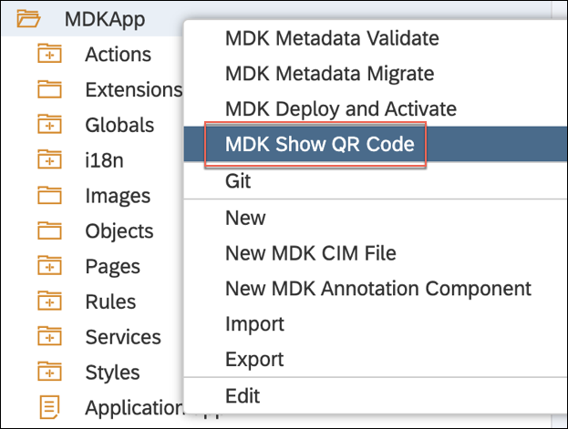

[DONE]
[ACCORDION-END]

[ACCORDION-BEGIN [Step 5: ](Run the app in MDK client)]

>Make sure you are choosing the right device platform tab above.

[OPTION BEGIN [Android]]

On Android, the camera app does not support scanning the QR-code. As alternative you can use the [Barcode scanner app](https://play.google.com/store/apps/details?id=com.application_4u.qrcode.barcode.scanner.reader.flashlight&hl=en_IN) to scan it.

Open the Barcode scanner app and start scanning the QR code showing in SAP Web IDE.

Tap **Open browser**. It will open SAP Mobile Services Client app.

Tap **GET STARTED** to connect MDK client to SAP Cloud Platform.

Enter Email address and password to login to SAP Cloud Platform and tap **Log On** to authenticate.

Tap **AGREE** on `End User License Agreement`.

Choose a passcode with at least 8 characters for unlocking the app and tap **NEXT**.

Confirm the passcode and tap **DONE**.

Optionally, you can enable fingerprint to get faster access to the app data.

Tap **OK**.

The MDK client receives deployed metadata definitions as a bundle.

  Now, you will see the list of entities on the **Main** page, **LOGOUT** and **SYNC** options at bottom of the page and Offline store is being initialized. Click on either entity, it navigates to detail page, you can create, update, delete a record. This record gets saved to offline request queue database, navigate back to main page and press **SYNC** to upload local changes to the backend. Once the upload is successful, it will also download the data from the backend to the offline store to have same dataset on both ends.

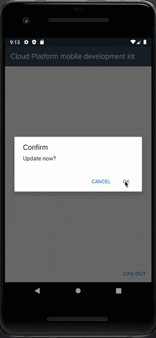

[OPTION END]

[OPTION BEGIN [iOS]]

On iPhone, open your camera app and start scanning the QR code, as shown below.

Tap the toast message to launch **SAP Mobile Services Client**. It will open SAP Mobile Services Client app.

Tap **Start** to connect MDK client to SAP Cloud Platform.

Enter Email address and password to login to SAP Cloud Platform and tap **Log On** to authenticate.

Tap **Agree** on `End User License Agreement`.

Choose a passcode with at least 8 characters for unlocking the app and tap **Next**.

Confirm the passcode and tap **Done**.

Optionally, you can enable Touch ID to get faster access to the app data, tap **Enable**.

Tap **OK**.

The MDK client receives deployed metadata definitions as a bundle.

Now, you will see the list of entities on the **Main** page, **Logout** and **Sync** options at bottom of the page and Offline store is being initialized. Click on either entity, it navigates to detail page, you can create, update, delete a record. This record gets saved to offline request queue database, navigate back to main page and press **Sync** to upload local changes to the backend. Once the upload is successful, it will also download the data from the backend to the offline store to have same dataset on both ends.

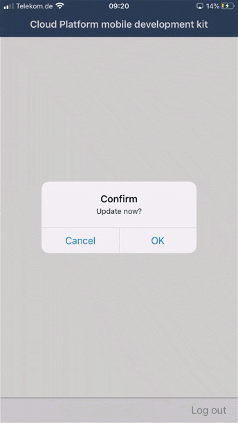

[OPTION END]

[VALIDATE_1]
[ACCORDION-END]

---
