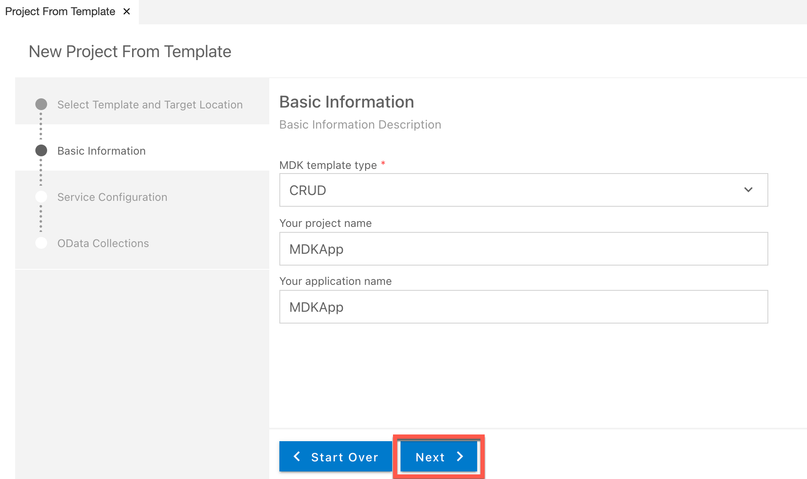
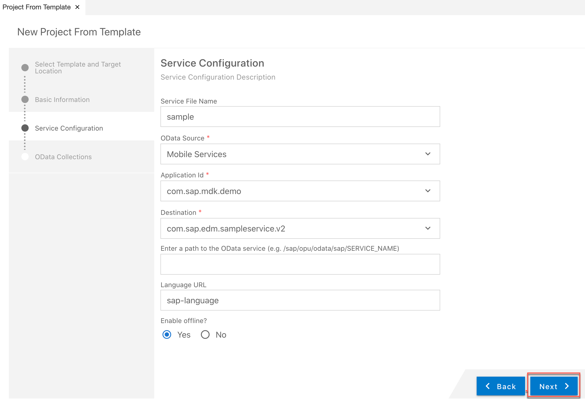
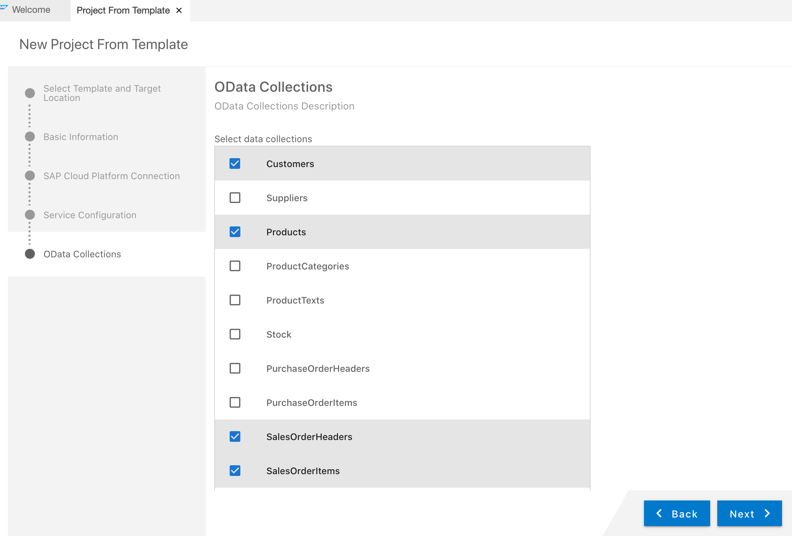
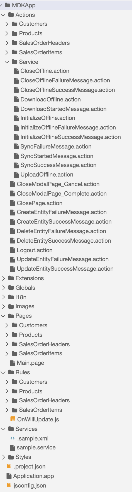
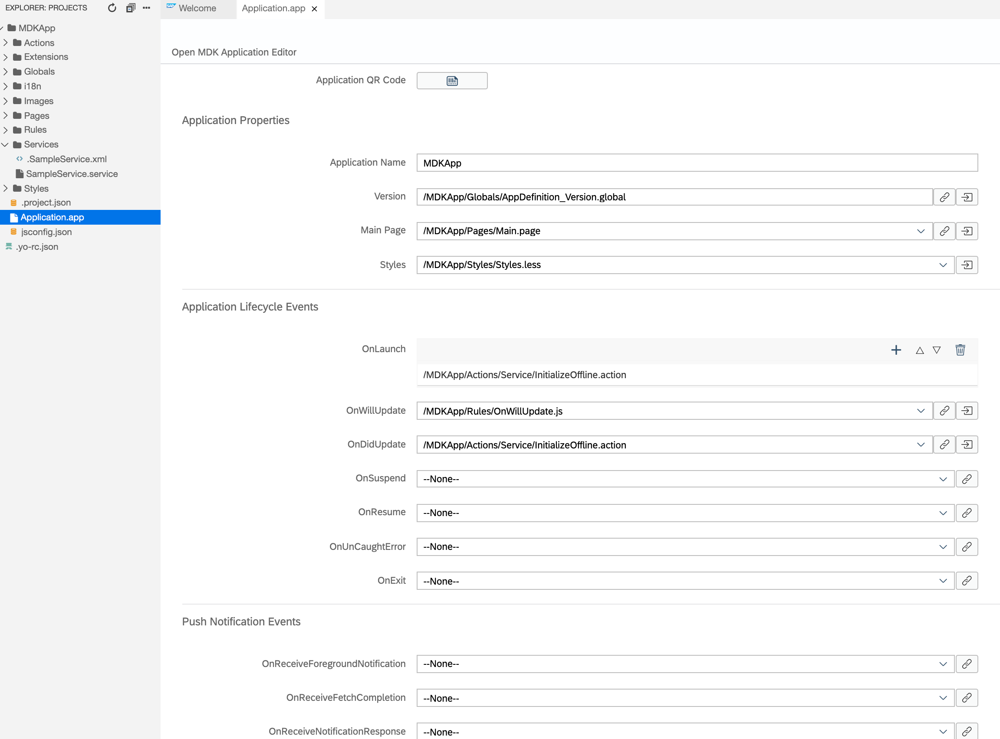
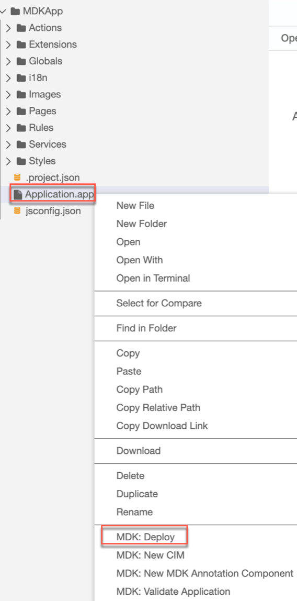
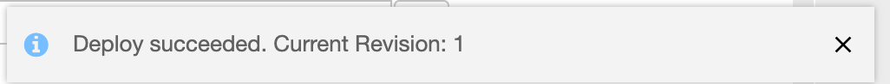
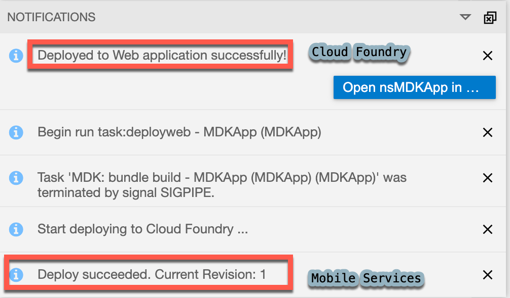
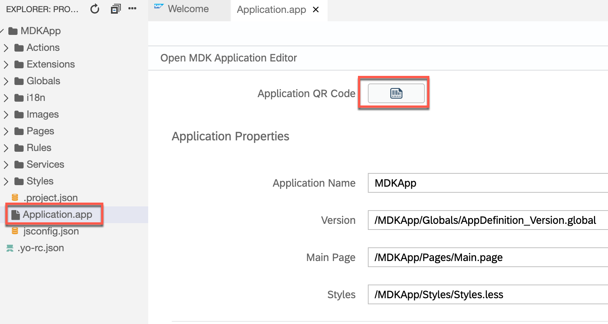
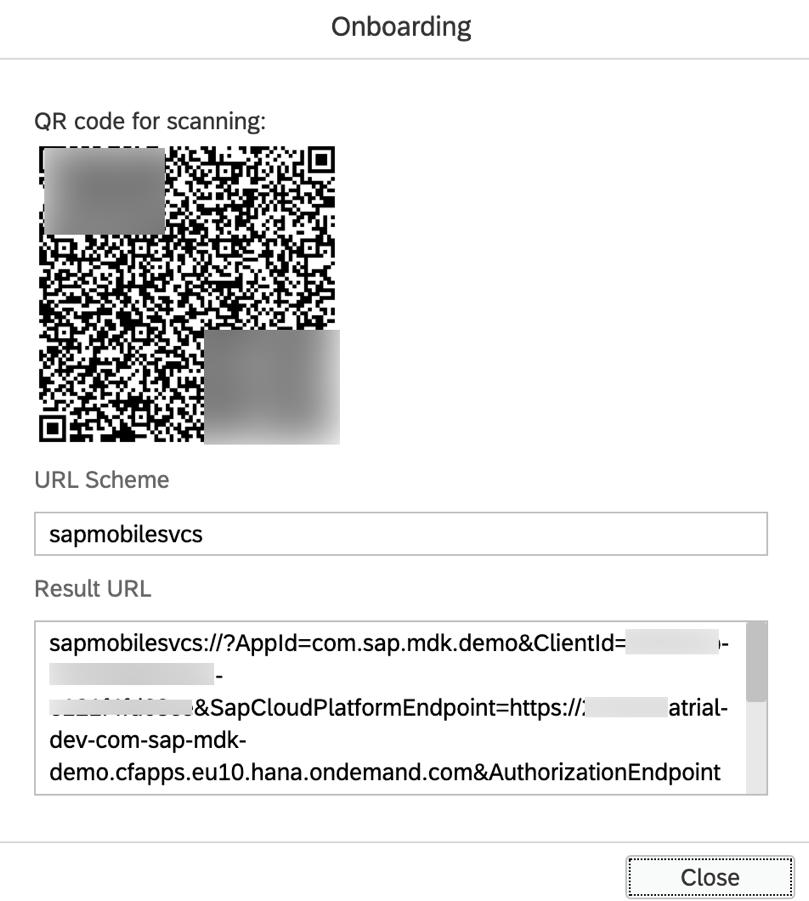

## Prerequisites
- **Tutorial group:** [Set Up for the Mobile Development Kit (MDK)](group.mobile-dev-kit-setup)
- **Download and install:** **SAP Mobile Services Client** on your [iOS](https://apps.apple.com/us/app/sap-mobile-services-client/id1413653544) or [Android](https://play.google.com/store/apps/details?id=com.sap.mobileservices.client) device (If you are connecting to `AliCloud` accounts then you will need to brand your [custom MDK client](cp-mobile-dev-kit-build-client) by whitelisting custom domains as allowed domains restrictions that exist by default in App store clients.)

## Details
### You will learn
  - How to create an MDK sample app using a template in SAP Business Application Studio
  - How to deploy an MDK app to Mobile Services and run it in a client

---

[ACCORDION-BEGIN [Step 1: ](Create a new MDK project in SAP Business Application Studio)]

This step includes creating the mobile development kit project in the editor.

1. Launch the [Dev space](cp-mobile-bas-setup) in SAP Business Application Studio.

2. Navigate to *File* menu &rarr; click **New Project from Template**.

    !

3. Select **MDK Project** and click **Next**.

    !

4. In *Basic Information* step, provide the below information and click **Next**:

    | Field | Value |
    |----|----|
    | `MDK template type`| Select `CRUD` from the dropdown |
    | `Your project name` | `MDKApp` |
    | `Your application name` | <default name is same as project name, you can provide any name of your choice> |

    !

    >The `CRUD` template creates the offline or online actions, rules, messages, List Detail Pages with editable options. More details on _MDK template_ is available in [help documentation](https://help.sap.com/doc/f53c64b93e5140918d676b927a3cd65b/Cloud/en-US/docs-en/guides/getting-started/mdk/bas.html#creating-a-new-project-cloud-foundry).  

    >If you see *Cloud foundry token expired, continue without mobile services connection?* message, then set the Cloud Foundry environment again by clicking at bottom left corner of your status bar to initiate a valid session and repeat above steps.

5. In *Service Configuration* step, provide or select the below information and click **Next**:

    | Field | Value |
    |----|----|
    | `Service File Name`| `<Provide any name of your choice>` |
    | `OData Source` | Select `Mobile Services` from the dropdown |
    | `Application Id` | Select `com.sap.mdk.demo` from the dropdown |
    | `Destination` | Select `com.sap.edm.sampleservice.v2` from the dropdown |
    | `Enter a path to the OData service` | Leave it as it is |
    | `Language URL` | Leave it with the default value |
    | `Enable Offline` | It's enabled by default |

    >Offline supports only OData V2 while online supports both OData V2 and V4.

    !

    >In [this tutorial](cp-mobile-dev-kit-ms-setup), server-side configuration for this MDK app were already done.

    Regardless of whether you are creating an online or offline application, this step is needed app to connect to an OData service. When building an Mobile Development Kit application, it assumes the OData service created and the destination that points to this service is setup in Mobile Services.

    Since you will create an offline based app, hence **Enable Offline** option is selected.

8. In *OData Collections* step, select `Customers`, `Products`, `SalesOrderHeaders` and `SalesOrderItems`. Click **Finish** to complete the project creation.

    !

9. After clicking **Finish**, the wizard will generate your MDK Application based on your selections. You should now see the `MDKApp` project in the project explorer. As you have already opened the workspace, there is no need to open the generated project in a new workspace. Ignore the pop-up or click the cross icon to hide the window.

    !

[DONE]
[ACCORDION-END]

[ACCORDION-BEGIN [Step 2: ](Get familiar with generated project structure)]

This is how the project structure looks like within the workspace.

!

These are the metadata definitions available in the editor and the format in which these metadata definitions are stored in the editor. Just to brief on some of these:

- **`InitializeOffline.action`**: For offline applications, this action binds the application to the Offline OData server and downloads the required data to the offline store on the mobile device.

- **`DownloadOffline.action`** and **`UploadOffline.action`**: Using app initialization, data is downloaded to the offline store. If you want to have the application download any updated data from the backend server or upload changed data to the backend server, these actions will be needed.

- **`Success & Failure Message action`**: Here are some messages showing up in the app on a successful or failure of data initialization, sync etc.

- **`Main.page`**: This is the first page of your Mobile Development Kit application that is shown. For this application you will use this as a launching page to get to application functionality.

- **`OnWillUpdate.js`**: MDK applications automatically download updates and apply them to the client without the end-user needing to take any action. The `OnWillUpdate` rule empowers the user to run business logic before the new definitions are applied. This allows the app designer to include logic to prompt the user to accept or defer applying the new definitions based on their current activity. For example, if the end-user is currently adding new customer details or in the middle of a transaction, they will be able to defer the update. The app will prompt again the next time it checks for updates.

- **`Application.app`**: this is the main configuration file for your application from within SAP Business Application Studio. Here you set your start page (here in this tutorial, it is main.page), action settings for different stages of the application session lifecycle, push notifications, and more.

>You can find more details about [metadata definitions](https://help.sap.com/doc/69c2ce3e50454264acf9cafe6c6e442c/Latest/en-US/docs-en/reference/schemadoc/App.schema.html).

Open the application settings in the application editor by double clicking on the `Application.app`.

!

[VALIDATE_2]
[ACCORDION-END]

[ACCORDION-BEGIN [Step 3: ](Deploy and activate the application)]

So far, you have learned how to build an MDK application in the SAP Business Application Studio editor. Now, we deploy this application definition to Mobile Services.

1. Right-click `Application.app` and select **MDK: Deploy**.

    !

2. Select deploy target as **Mobile Services**.

    !

    You should see **Deploy succeeded** message.

    !

[DONE]
[ACCORDION-END]

[ACCORDION-BEGIN [Step 4: ](Populate the QR code for app onboarding)]

SAP Business Application Studio has a feature to generate QR code for app onboarding.

Double-click the `Application.app` to open it in MDK Application Editor and click **Application QR Code** icon to populate the QR code.

!

!

[DONE]
[ACCORDION-END]

[ACCORDION-BEGIN [Step 5: ](Run the app in MDK client)]

>Make sure you are choosing the right device platform tab above. Once you have scanned and onboarded using the onboarding URL, it will be remembered. When you Log out and onboard again, you will be asked either to continue to use current application or to scan new QR code.

[OPTION BEGIN [Android]]

Follow [these steps](https://github.com/SAP-samples/cloud-mdk-tutorial-samples/blob/master/Onboarding-Android-client/Onboarding-Android-client.md) to on-board the MDK client.

Once you accept app update, you will see the list of entities on the **Main** page, **LOGOUT** and **SYNC** options at bottom of the page and Offline store is being initialized. click either entity, it navigates to detail page, you can create, update, delete a record. This record gets saved to offline request queue database, navigate back to main page and press **SYNC** to upload local changes to the backend. Once the upload is successful, it will also download the data from the backend to the offline store to have same dataset on both ends.

[OPTION END]

[OPTION BEGIN [iOS]]

Follow [these steps](https://github.com/SAP-samples/cloud-mdk-tutorial-samples/blob/master/Onboarding-iOS-client/Onboarding-iOS-client.md) to on-board the MDK client.

Once you accept app update, you will see the list of entities on the **Main** page, **Logout** and **Sync** options at bottom of the page and Offline store is being initialized. click either entity, it navigates to detail page, you can create, update, delete a record. This record gets saved to offline request queue database, navigate back to main page and press **Sync** to upload local changes to the backend. Once the upload is successful, it will also download the data from the backend to the offline store to have same dataset on both ends.

[OPTION END]

>Once you have scanned and onboarded using the onboarding URL, it will be remembered. When you Log out and onboard again, you will be asked either to continue to use current application or to scan new QR code.

**Congratulations**! You have created an MDK app with just couple of clicks. You may now follow [these tutorials](mission.mobile-dev-kit-get-started) to create an MDK app from scratch.

[VALIDATE_1]
[ACCORDION-END]

---
