## Prerequisites
- **Tutorial:** [Set Up Business Application Studio for Mobile Technologies](cp-mobile-bas-setup)
- **Download and install:** **SAP Mobile Services Client** on your [iOS](https://apps.apple.com/us/app/sap-mobile-services-client/id1413653544) or [Android](https://play.google.com/store/apps/details?id=com.sap.mobileservices.client) device (If you are connecting to `AliCloud` accounts then you will need to brand your [custom MDK client](cp-mobile-dev-kit-build-client) by allowing custom domains.)

## Details
### You will learn
  - How to configure an application in Mobile Services
  - How to define a REST endpoint as a destination in Mobile Services
  - How to define a REST endpoint as a destination in Cloud Foundry
  - How to create MDK applications in SAP Business Application Studio
  - How to create a MDK Service file pointing to REST endpoint destination
  - How to use `RestService SendRequest` Action to make directly call to `Petstore` API

You may clone an existing project from [GitHub repository](https://github.com/SAP-samples/cloud-mdk-tutorial-samples/tree/master/4-Level-Up-with-the-Mobile-Development-Kit/8-Consume-rest-api-in-mdk-app) and start directly with step 7 or 17 in this tutorial but make sure you complete step 2&3.

---

Mobile Development Kit allows you to consume REST APIs. You need to first define REST endpoint as a destination and then easily bind a `RestServiceTarget` to an MDK control e.g., `ObjectTable`, `ContactCell`, `ObjectCollection` etc. This assumes the REST service returns JSON similar to how OData requests are returned.

A publicly available `Petstore` API from [swagger.io](https://petstore.swagger.io) is used as an example in this tutorial.

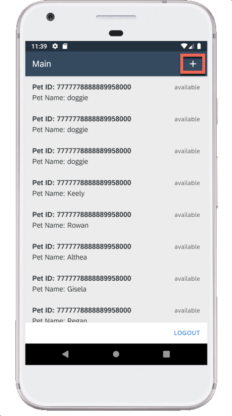

[ACCORDION-BEGIN [Step 1: ](Understand the Petstore API to retrieve data)]

1. Open *[`Swagger Petstore`](https://petstore.swagger.io/)*, find all pets with status as `available`.

    !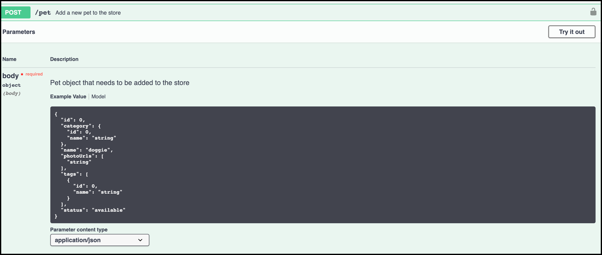

2. Click **Execute** to get the response.

    !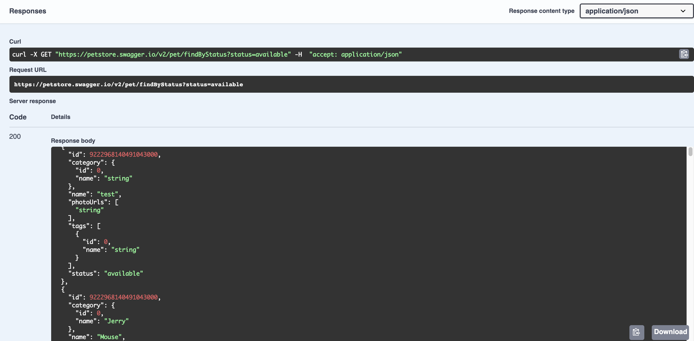

    By looking at results, you now have understood

    -	what is the Request URL to retrieve pet information
    -	what is header parameter to be passed in GET call
    -	what is the response code
    -	how the response body looks like

With above details, you will next configure an app in Mobile Services, add root of request URL as a destination and then consume it in MDK.

[DONE]
[ACCORDION-END]

[ACCORDION-BEGIN [Step 2: ](Configure new MDK app in Mobile Services cockpit)]

1. Navigate to [SAP Mobile Services cockpit on Cloud Foundry environment](fiori-ios-hcpms-setup).

2. On the home screen, select **Create new app** or navigate to **Mobile Applications** **&rarr;** **Native/MDK** **&rarr;** **New**.

    !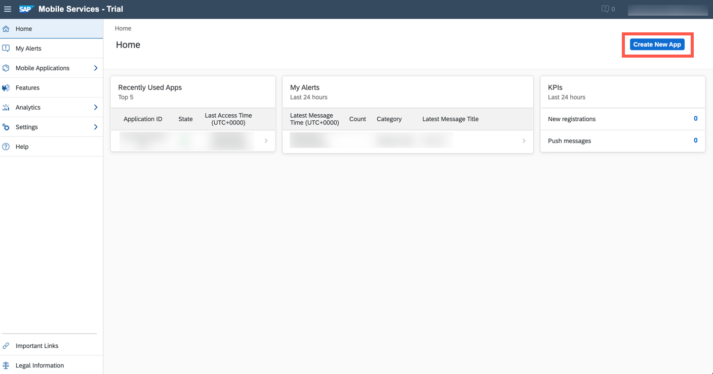

3. In the **Basic Info** step, provide the required information and click **Next**.

    | Field | Value |
    |----|----|
    | `ID` | `com.sap.mdk.restapi` |
    | `Name` | `SAP MDK REST API` |

    !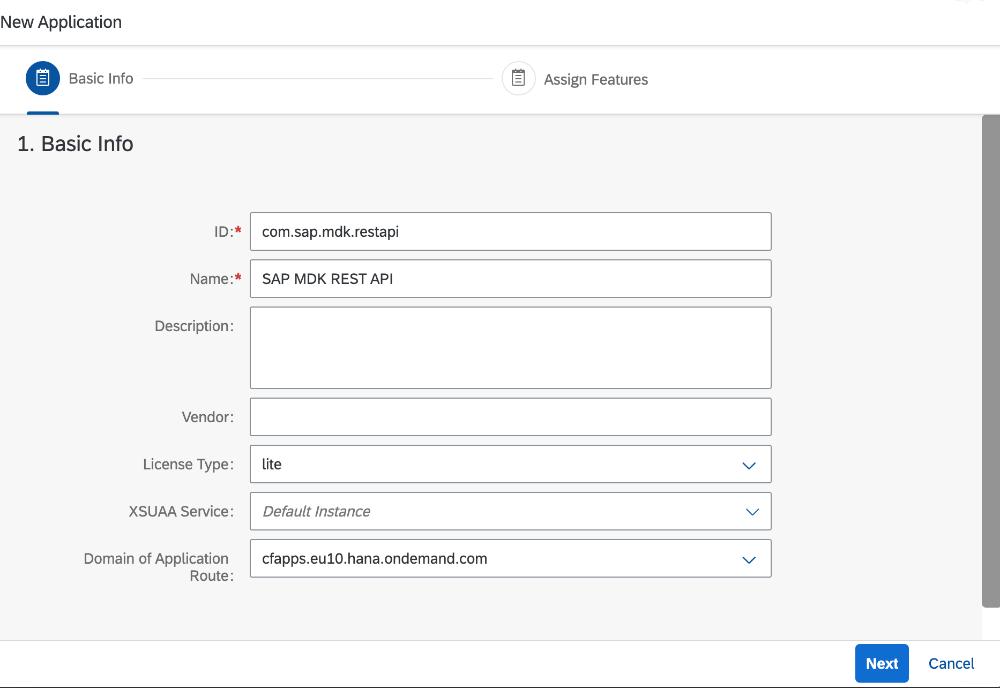

    > If you are configuring this app in a trial account, make sure to select **License Type** as *lite*.

    >Other fields are optional. For more information about these fields, see [Creating Applications](https://help.sap.com/doc/f53c64b93e5140918d676b927a3cd65b/Cloud/en-US/docs-en/guides/getting-started/admin/manage.html#creating-applications) in the help documentation.

4. In the **XSUAA Settings** step, continue with the default settings and click **Next** to navigate to further steps.

    !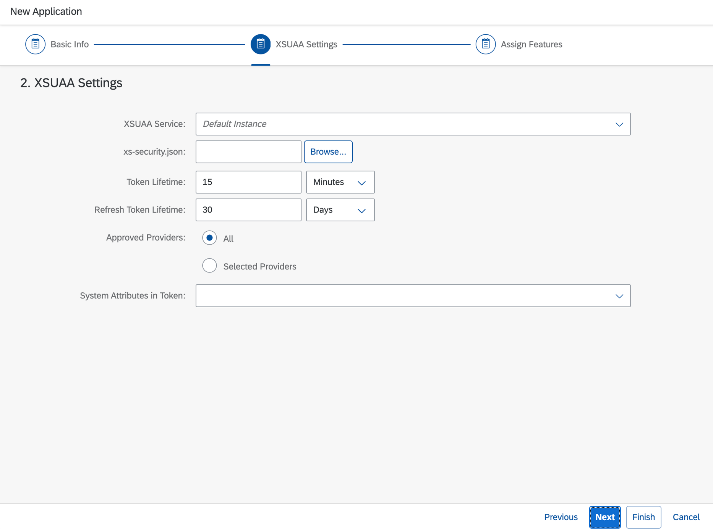

4. In the **Assign Features** step, choose **Mobile Development Kit Application** from the dropdown and Click **Finish**.

    !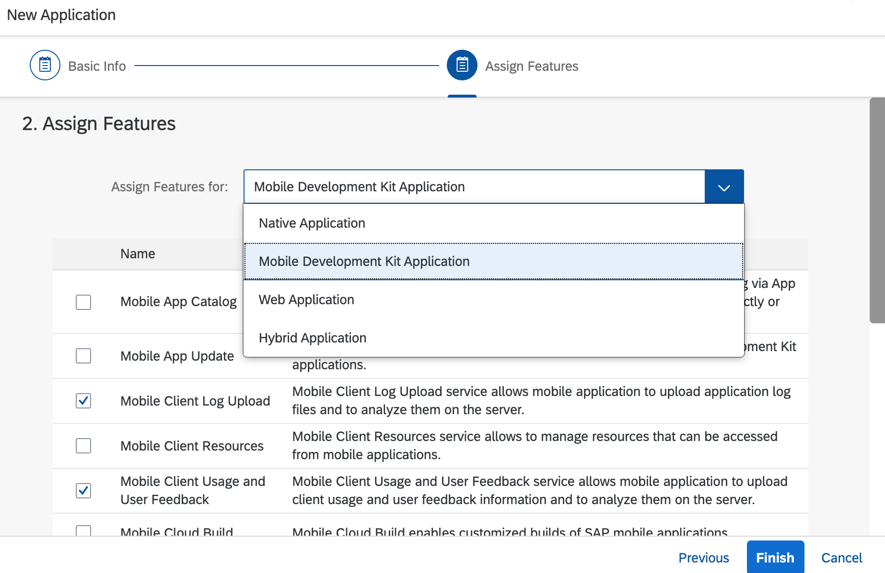

5. Click **Mobile Connectivity** to add `petstore` root API as a destination.

    !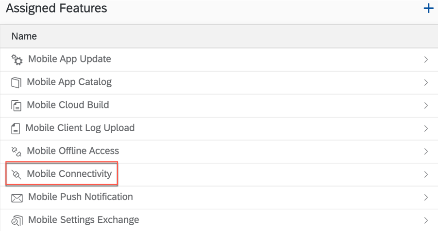

6. Click **Create** icon to add a new destination.  

    !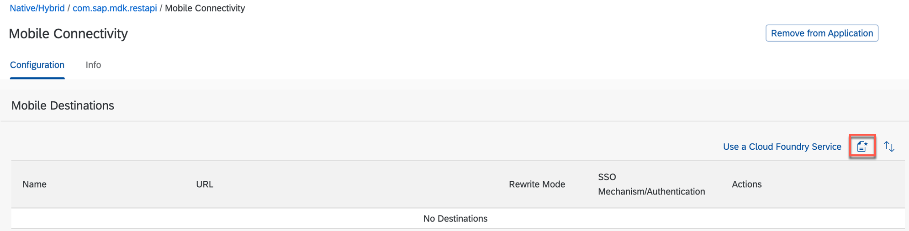

7. Provide the required information and click **Next**.

    | Field | Value |
    |----|----|
    | `Destination Name` | `swagger_petstore` |
    | `URL` | `https://petstore.swagger.io/v2` |

    !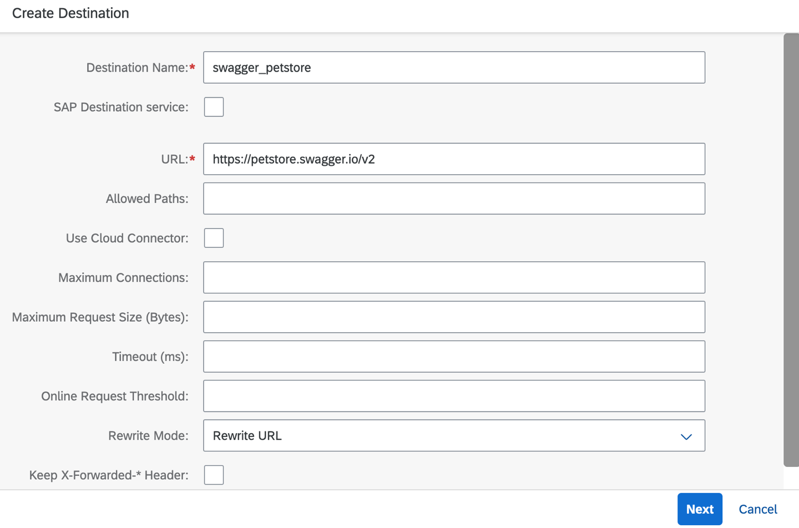

8. For this tutorial, there is no Custom Headers, Annotations, Authentication required, click **Next** and Finish the form.

[DONE]
[ACCORDION-END]

[ACCORDION-BEGIN [Step 3: ](Create a new destination to your MDK Web application)]

1. Download the zip file from [here](https://github.com/SAP-samples/cloud-mdk-tutorial-samples/blob/master/4-Level-Up-with-the-Mobile-Development-Kit/8-Consume-rest-api-in-mdk-app/swagger_petstore.zip) and unzip it on your machine.

    !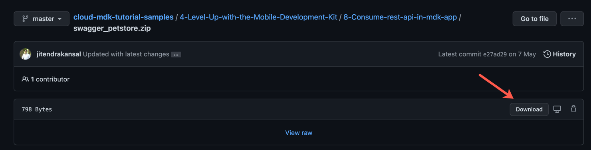

2. Navigate to **Connectivity** **&rarr;** **Destinations** to create a BTP destination, click **Import Destination** to import the extracted file and click **Save**.

    !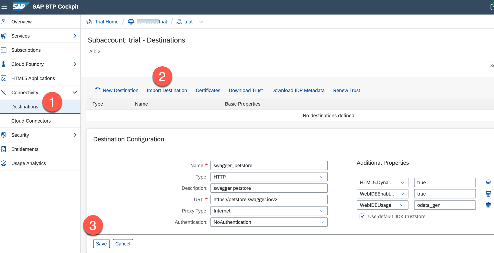


[DONE]
[ACCORDION-END]

[ACCORDION-BEGIN [Step 4: ](Create a new MDK project in SAP Business Application Studio)]

1. Launch the [Dev space](cp-mobile-bas-setup) in SAP Business Application Studio.

2. Click **Start from template** on Welcome page.

    !

    >If you do not see the Welcome page, you can access it via **Help** menu or via **View** menu > Find Command > Welcome.

3. Select **MDK Project** and click **Start**.

    !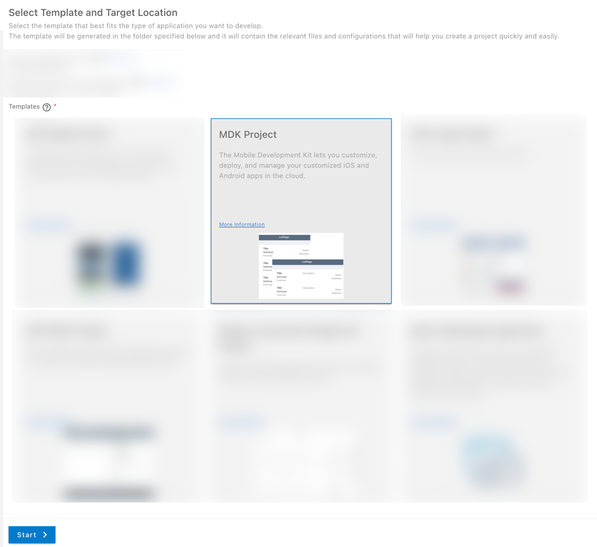  

    >If you do not see the **MDK Project** option check if your Dev Space has finished loading or reload the page in your browser and try again.

4. In *Basic Information* step, provide the below information and click **Finish**:

    | Field | Value |
    |----|----|
    | `MDK Template Type`| Select `Empty` from the dropdown |
    | `Your Project Name` | Provide a name of your choice. `MDK_Petstore` is used for this tutorial |
    | `Your Application Name` | <default name is same as project name, you can provide any name of your choice> |
    | `Target MDK Client Version` | Leave the default selection as `MDK 6.0+ (For use with MDK 6.0 or later clients)` |
    | `Choose a target folder` | By default, the target folder uses project root path. However, you can choose a different folder path |

    !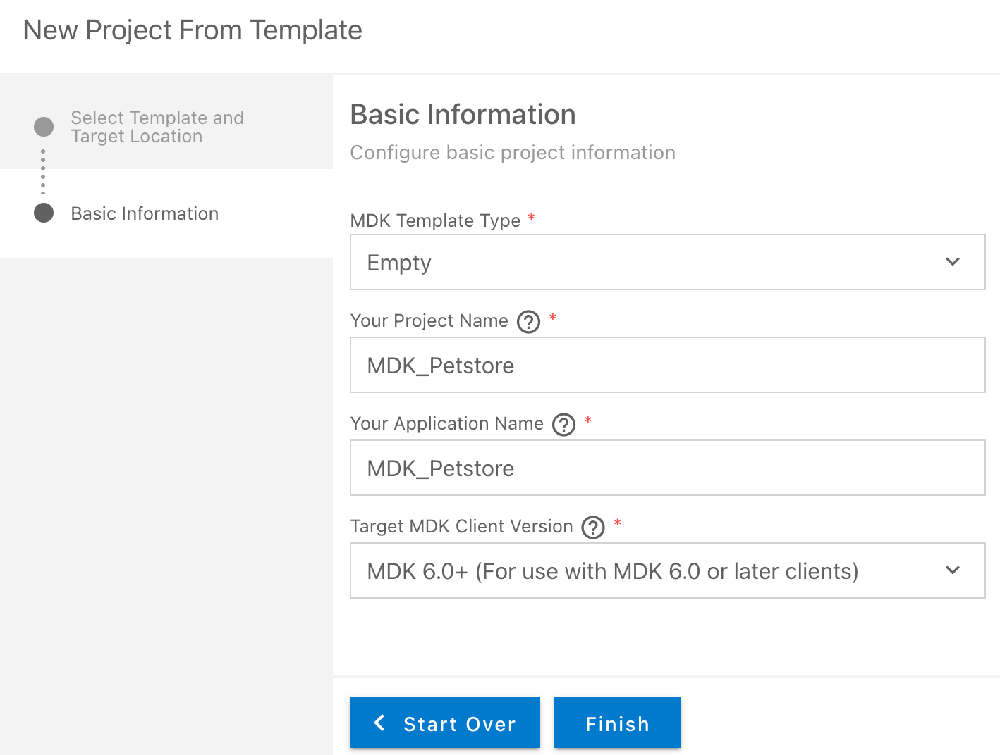

    >More details on _MDK template_ is available in [help documentation](https://help.sap.com/doc/f53c64b93e5140918d676b927a3cd65b/Cloud/en-US/docs-en/guides/getting-started/mdk/bas.html#creating-a-new-project-cloud-foundry).

5. After clicking **Finish**, the wizard will generate your MDK Application based on your selections. You should now see the `MDK_Petstore` project in the project explorer.

[DONE]
[ACCORDION-END]


[ACCORDION-BEGIN [Step 5: ](Create a new MDK Service file)]

1. Right-click the **Services** folder | **MDK: New Service**.

    !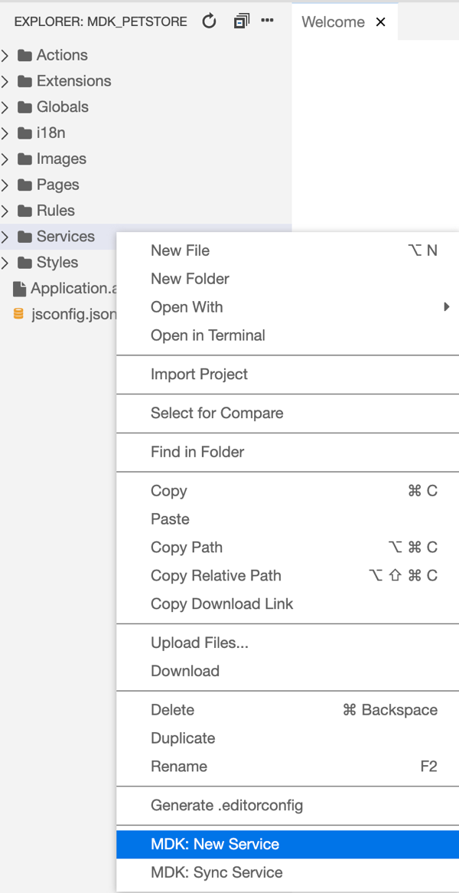

2. Select the Mobile Services landscape where you have configured the MDK app (step 2).    

    !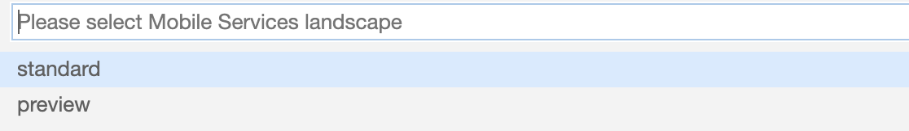    

3. Select the application `com.sap.mdk.restapi` from Mobile Services.    

    !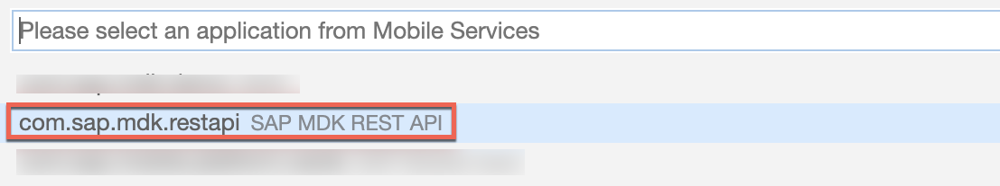

4. Provide or select the below information:

    | Field | Value |
    |----|----|
    | `Name`| `<Provide any name of your choice>` |
    | `Data Source` | Select `Mobile Services` from the dropdown |
    | `Destination` | Select `swagger_petstore` from the dropdown |
    | `Path Suffix` | Leave it as it is |
    | `Language URL Param` | Leave it as it is |
    | `REST Service` | Check it |

    !


5. Click **Next** and Finish the step.

    .service and `.xml` (empty file) have been created under Services folder.

    !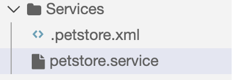

[DONE]
[ACCORDION-END]

[ACCORDION-BEGIN [Step 6: ](Display Pets list in MDK page)]

You will add an **Object Table** control  item on `Main.page` to display the list of Pets.

1. In `Main.page`, drag and drop **Object Table** control on the page.

    !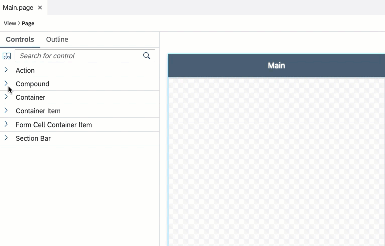

2. Provide the required information for **Target** section:

    | Field | Value |
    |----|----|
    | `Target` | Select `REST Service Target` from the dropdown |
    | `Service` | Select `petstore.service` from the dropdown |
    | `Path` | Enter `/pet/findByStatus?status=available` |

    !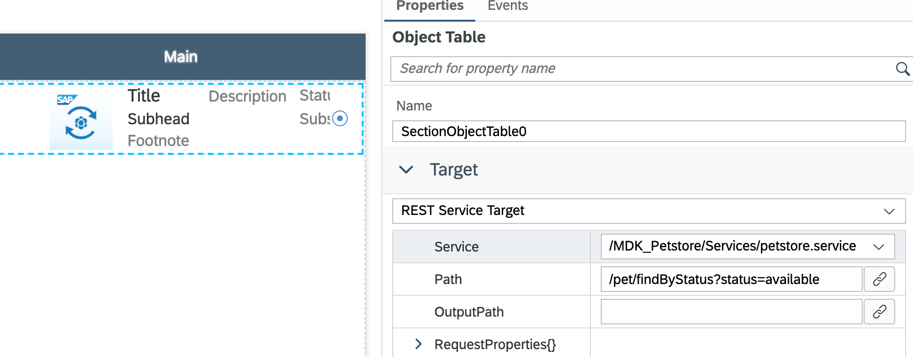

    >You can find more details on **Target** in [documentation](https://help.sap.com/doc/69c2ce3e50454264acf9cafe6c6e442c/Latest/en-US/docs-en/reference/schemadoc/definitions/Target.schema.html).

    >Method GET is pre-selected for binding the `ObjectTable` control to a `RestServiceTarget`.

    >!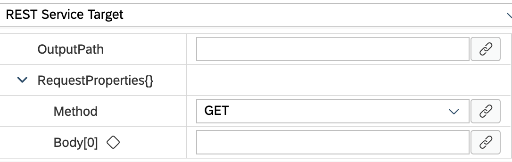


3. Under **Appearance**, provide below information:

    | Property | Value |
    |----|----|
    | `Description`| leave it empty |
    | `DetailImage` | leave it empty |
    | `Footnote`| leave it empty |
    | `PreserveIconStackSpacing` | Select `false` from the dropdown |
    | `ProgessIndicator`| leave it empty |
    | `Status` | `{status}` |
    | `Subhead` | `Pet Name: {name}` |
    | `Substatus` | leave it empty |
    | `Title` | `Pet ID: {id}` |

    !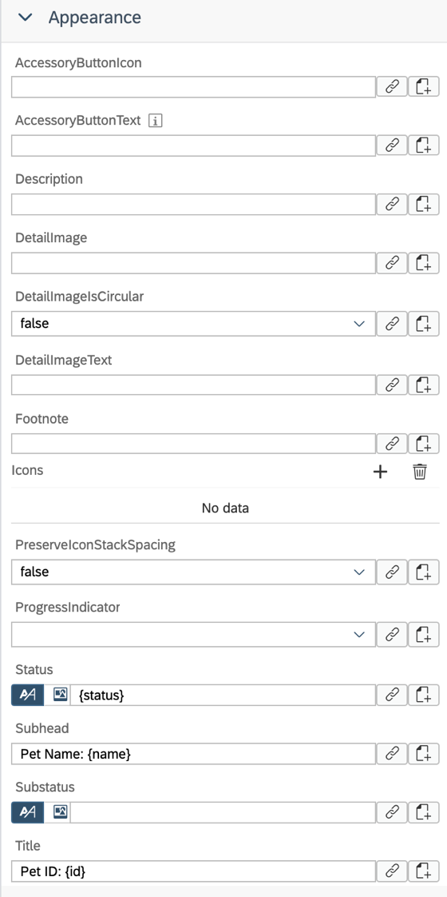

    >If you see any error in Main.page (code editor), ignore it as MDK editor currently can't validate such REST Service endpoint properties.

[DONE]
[ACCORDION-END]

[ACCORDION-BEGIN [Step 7: ](Deploy the application)]

So far, you have learned how to build an MDK application in the SAP Business Application Studio editor. Now, you will deploy the application definitions to Mobile Services and Cloud Foundry to use it in the Mobile client and Web application respectively.


1. Right-click `Application.app` and select **MDK: Deploy**.

    !

2. Select deploy target as **Mobile & Cloud**.

    MDK editor will deploy the metadata to Mobile Services (for Mobile application) followed by to Cloud Foundry (for Web application).

    !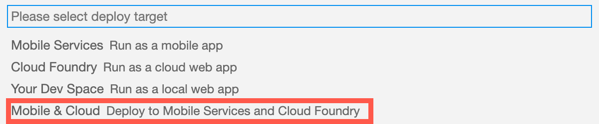

    You should see successful messages for both deployments.

    !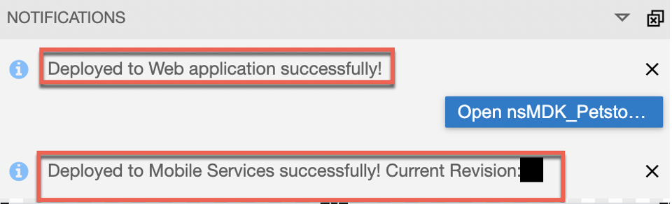

[DONE]
[ACCORDION-END]

[ACCORDION-BEGIN [Step 8: ](Run the app)]

[OPTION BEGIN [Android]]

>Make sure you are choosing the right device platform tab above. Once you have scanned and on-boarded using the onboarding URL, it will be remembered. When you Log out and onboard again, you will be asked either to continue to use current application or to scan new QR code.

SAP Business Application Studio has a feature to display the QR code for onboarding in the Mobile client.

Click the **Application.app** to open it in MDK Application Editor and then click the **Application QR Code** icon.

!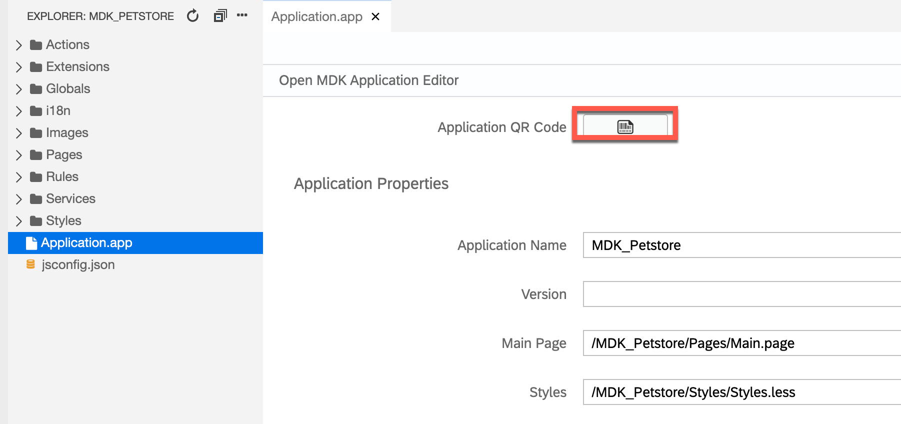

!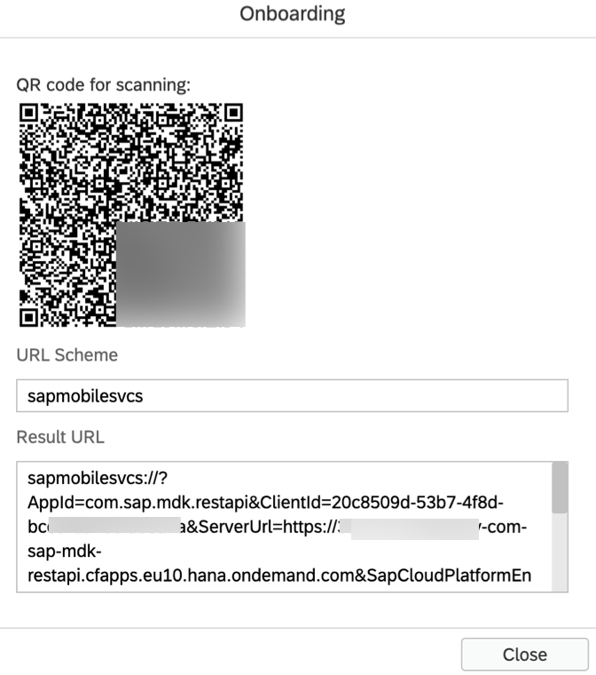

Follow [these steps](https://github.com/SAP-samples/cloud-mdk-tutorial-samples/blob/master/Onboarding-Android-client/Onboarding-Android-client.md) to on-board the MDK client.

After you accept the app update, you will see the Pets list on the **Main** page.

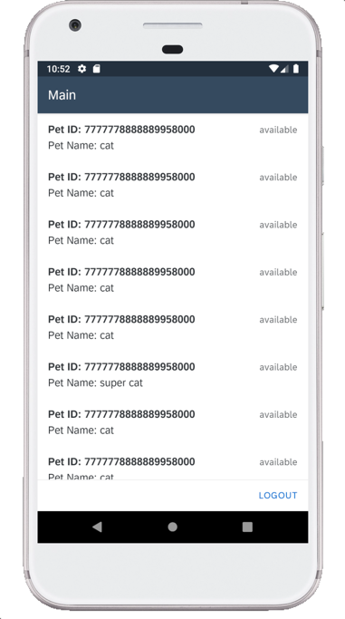

[OPTION END]

[OPTION BEGIN [iOS]]

>Make sure you are choosing the right device platform tab above. Once you have scanned and on-boarded using the onboarding URL, it will be remembered. When you Log out and onboard again, you will be asked either to continue to use current application or to scan new QR code.

SAP Business Application Studio has a feature to display the QR code for onboarding in the Mobile client.

Click the **Application.app** to open it in MDK Application Editor and then click the **Application QR Code** icon.

!

!


Follow [these steps](https://github.com/SAP-samples/cloud-mdk-tutorial-samples/blob/master/Onboarding-iOS-client/Onboarding-iOS-client.md) to on-board the MDK client.

After you accept the app update, you will see the Pets list on the **Main** page.

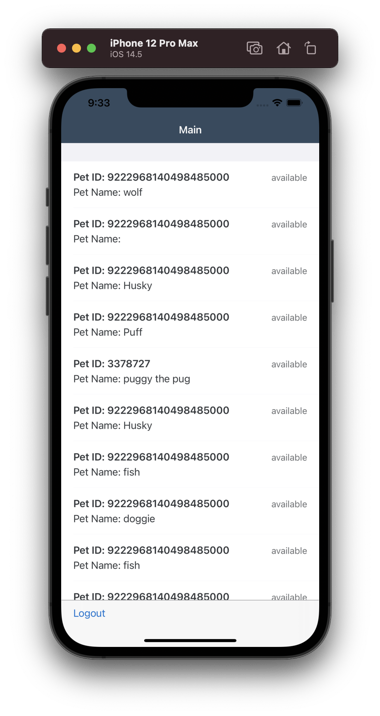

[OPTION END]

[OPTION BEGIN [Web]]

Click the highlighted button to open the MDK Web application in a browser. Enter your SAP BTP credentials if asked.

!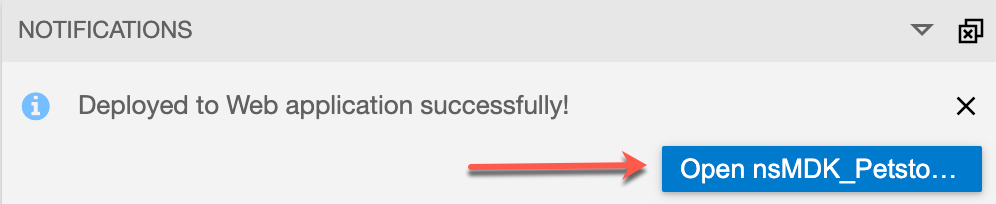

>You can also open the MDK web application by accessing its URL from `.project.json` file.
!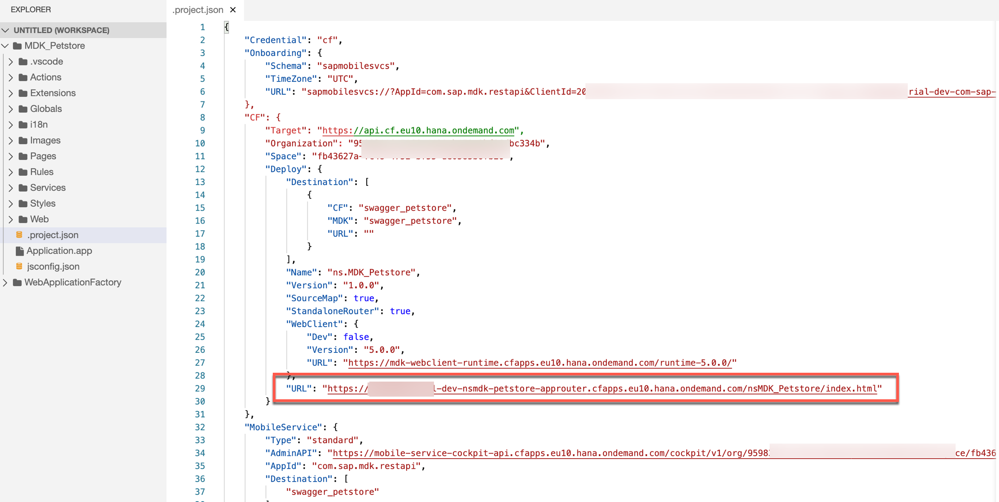

You will see the Pets list on the **Main** page.

!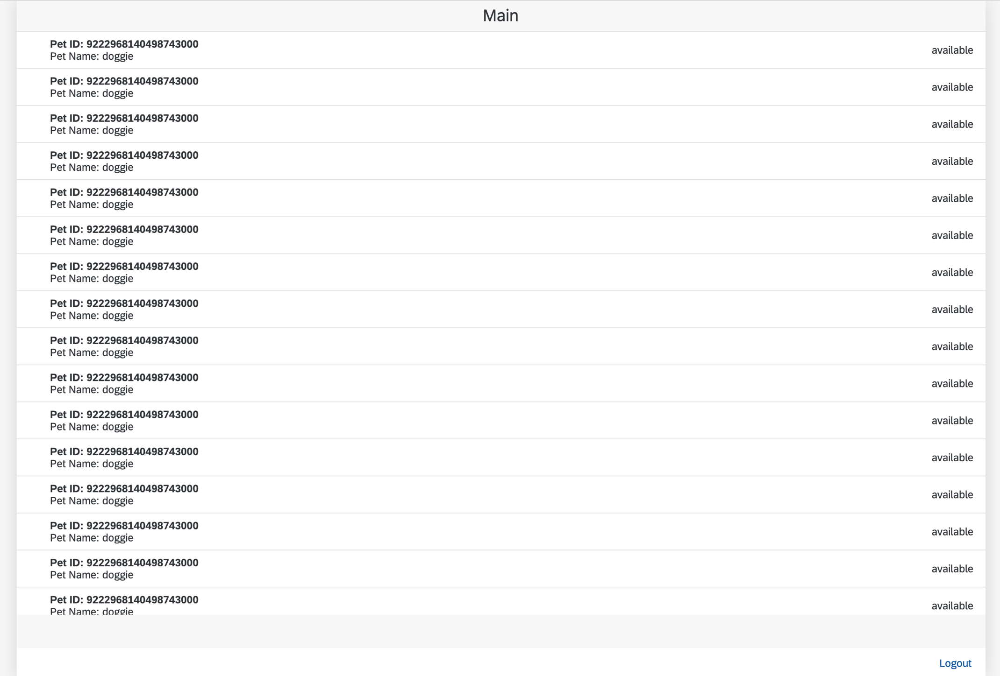


[OPTION END]

Congratulations, you have learned how to consume a REST API in MDK app to display Pets list.

Next, you will learn how to create a new pet record.

[DONE]
[ACCORDION-END]


[ACCORDION-BEGIN [Step 9: ](Understand the Petstore API to create new record)]

1. In [`Swagger Petstore`](https://petstore.swagger.io/), add a new pet to the store.

    !

    There is payload example to be passed for adding a new pet.

2. For testing, use below payload.

    ```JSON
    {
      "name": "pet-test",
      "status": "available"
    }
    ```

3. Click **Execute** to get the response.

    !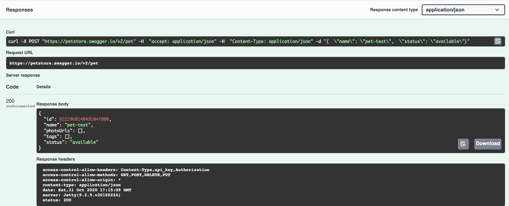

    By looking at results, you now have understood

    -	what is the Request URL & body to create a new pet record
    -	what are header parameters to be passed in POST call
    -	what is the response code
    -	how the response body looks like

With above details, you will now create a new MDK rule to create a new Pet record.

[DONE]
[ACCORDION-END]

[ACCORDION-BEGIN [Step 10: ](Create new page for new pet record)]

In this step, you will create the `Pet_Create.page` as a **Form Cell Page**. This type of page allows for form input style changes. You will add the fields that will be editable by the end-user.

1. Right-click the **Pages** folder | **MDK: New Page** | **Form Cell Page** | **Next**.

    !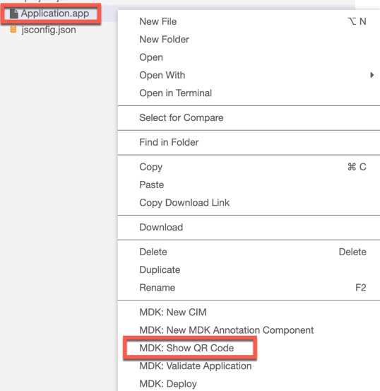

    >You can find more details about [Form Cell page](https://help.sap.com/doc/f53c64b93e5140918d676b927a3cd65b/Cloud/en-US/docs-en/guides/features/fiori-ui/mdk/formcell-page.html).

2. Enter the Page Name `Pet_Create` and click **Next** and the **Finish** on the Confirmation step.

    !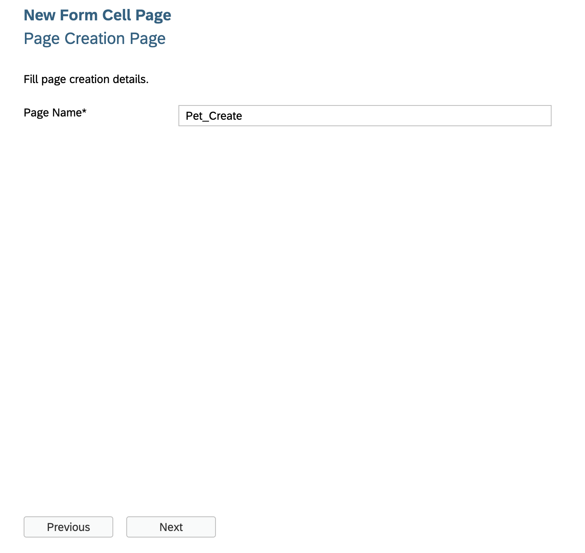

3. In the **Properties** pane, set the **Caption** to **Create Pet**.

    !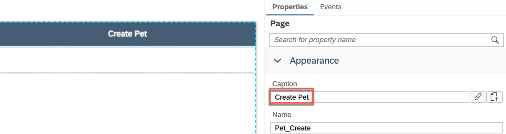

4. Now, you will add the fields (Pet name and Status) for creating a new pet record by the end-user.

    In the Layout Editor, expand the **Controls** group, drag and drop a **Simple Property** onto the Page area.

    >You can find more details about [available controls in Form Cell page](https://help.sap.com/doc/69c2ce3e50454264acf9cafe6c6e442c/Latest/en-US/docs-en/reference/schemadoc/Page/FormCell/Container.schema.html).

    !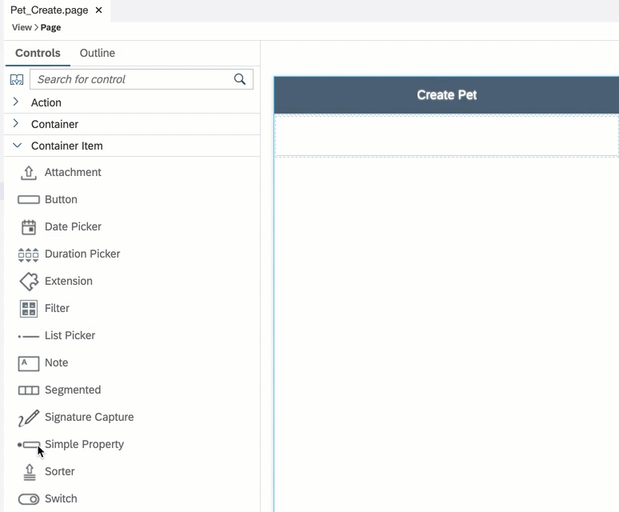

5. Drag and drop one more Simple Property control onto the page so you have two total controls.

    !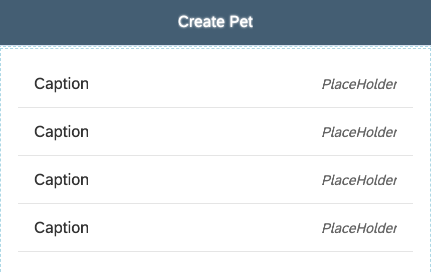

6. Select the first **Simple Property control** and provide the below information:

    | Property | Value |
    |----|----|
    | `Name`| `FCCreatePet` |
    | `Caption` | `Pet Name` |
    | `PlaceHolder`| `Enter Value` |

    !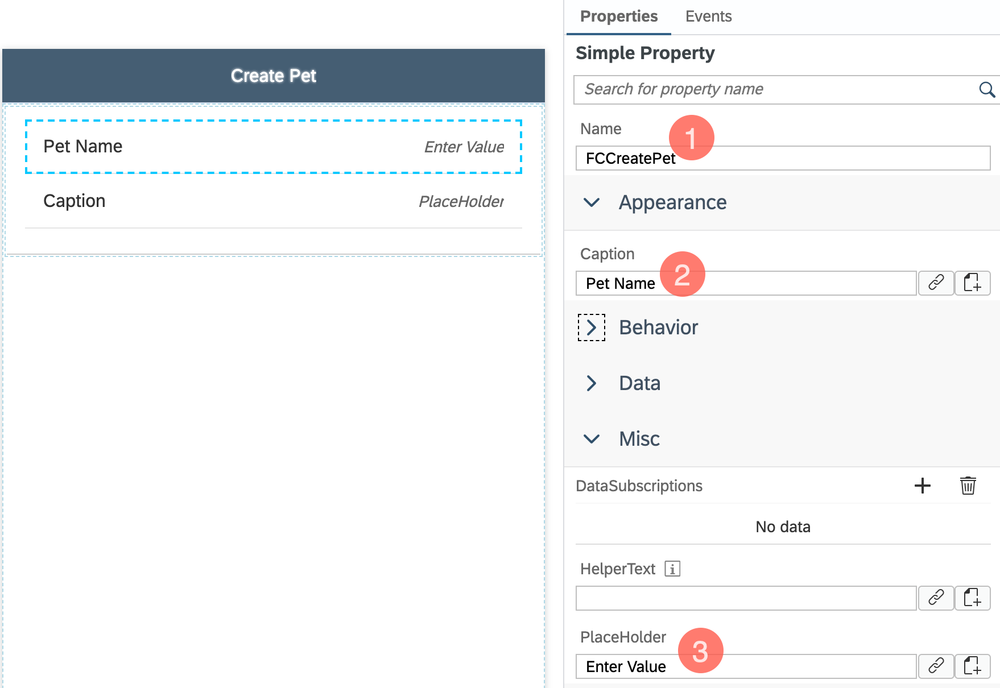

7. Select the second **Simple Property control** and provide the below information:

    | Property | Value |
    |----|----|
    | `Name`| `FCCreateStatus` |
    | `Caption` | `Status` |
    | `PlaceHolder`| `Enter Value` |

    !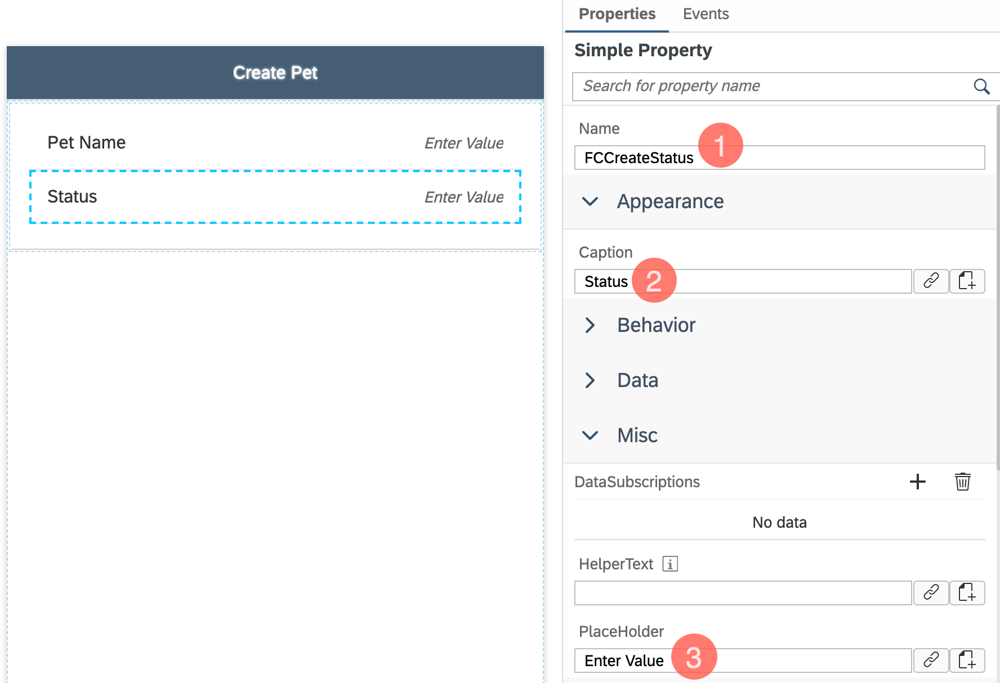    

[DONE]
[ACCORDION-END]


[ACCORDION-BEGIN [Step 11: ](Create an action to POST pet record)]

1. Create a  `RestService SendRequest` action:

    Right-click the **Actions** folder | **MDK: New Action** | choose **`MDK RestService Actions`** in **Category** | click **`RestService SendRequest` Action** | **Next**.

    !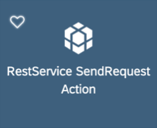        

2. Provide the below information:

    | Field | Value |
    |----|----|
    | `Action Name`| `CreatePet` |
    | `Service` | Select `petstore.service` from the dropdown |
    | `Path` | `/pet` |

    !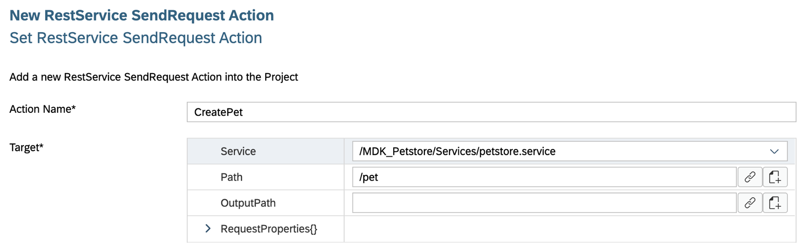

3. Expand `RequestProperties` and provide the below information.

    | Field | Value |
    |----|----|
    | `Method`| `POST` |

4. Under `Body`, switch to `object type` by clicking the icon, once it's color has changed, click on `Body[0]` to add array items, this should now display a create icon in front of `Body[0]`. Click Create icon to create an array item(0).

    Provide the below information:

    | Field | Value |
    |----|----|
    | `Key`| `name` |
    | `Value{}`| Bind it to input control `#Control:FCCreatePet/#Value` |

    !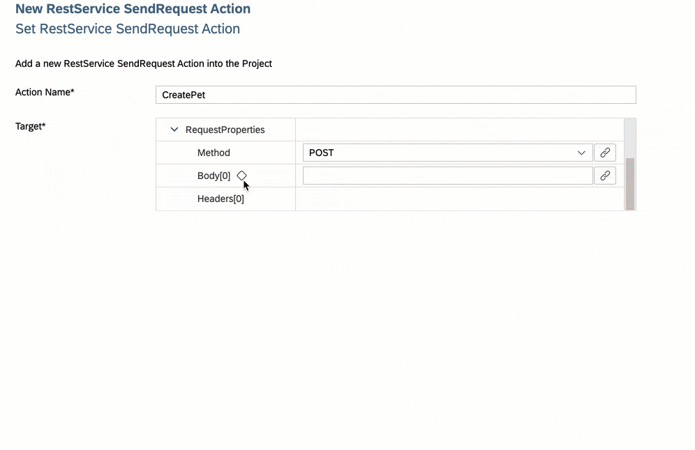

    Repeat above step to create another array item(1).  

    | Field | Value |
    |----|----|
    | `Key`| `status` |
    | `Value{}`| Bind it to input control `#Control:FCCreateStatus/#Value` |

    !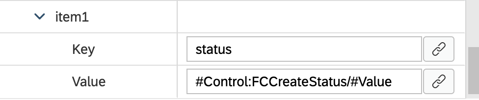

5. Click **Next** and **Finish** the confirmation step.

    >You can find more details about `SendRequest` action in [help documentation](https://help.sap.com/doc/69c2ce3e50454264acf9cafe6c6e442c/Latest/en-US/docs-en/reference/schemadoc/Action/RestService/SendRequest.schema.html).

[DONE]
[ACCORDION-END]

[ACCORDION-BEGIN [Step 12: ](Add cancel button on create pet page)]

Now, you will add a button on the `Pet_Create.page` and set it's `onPress` to `ClosePage.action`.

1. Drag and drop an **Action Bar Item** to the left corner of the action bar.

    !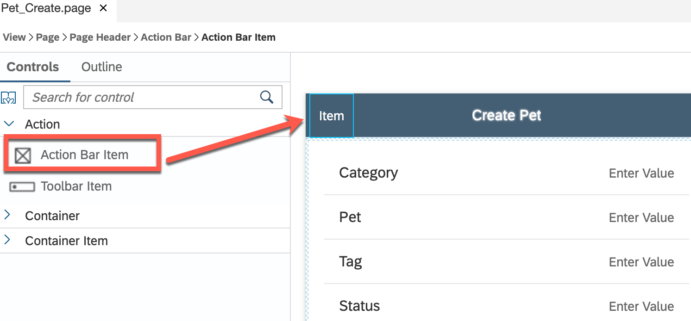

2. In the **Properties** pane, click the **link icon** to open the object browser for the **System Item** property. Double click the **Cancel** type and click **OK**.

    !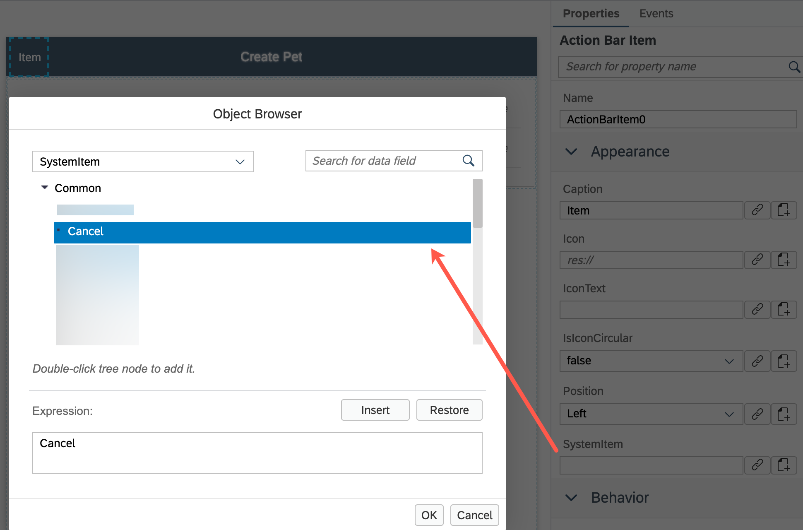

    >System Item are predefined system-supplied icon or text. Overwrites _Text_ and _Icon_ if specified.

3. Now, you will set the `onPress` event to `ClosePage.action`.

    In **Events** tab, click the 3 dots icon for the `OnPress` property to open the **Object Browser**.

    Double click the `ClosePage.action` and click **OK** to set it as the `OnPress` Action.

    !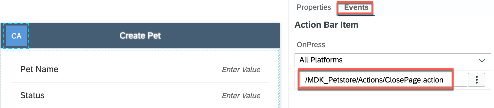

[DONE]
[ACCORDION-END]

[ACCORDION-BEGIN [Step 13: ](Call the SendRequest Action in MDK page)]

1. In `Pet_Create.page`, drag & drop an action bar item to the right corner of the action bar.

    !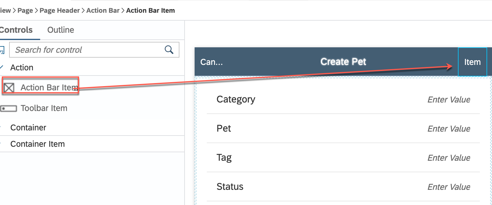

2. In the **Properties** pane, click the **link icon** to open the object browser for the **System Item** property. Double click the **Save** type and click **OK**.

    !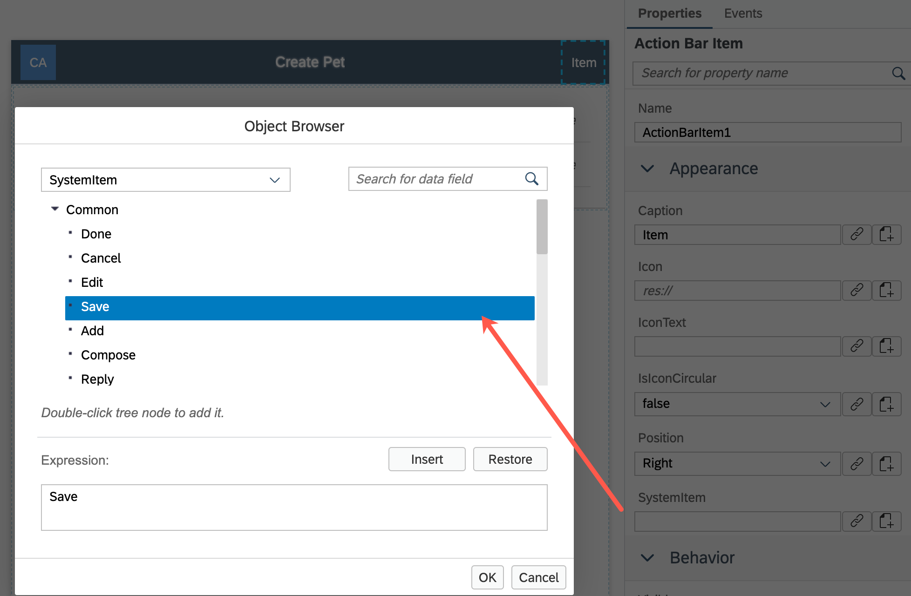

3. Navigate to **Events** tab and bind `CreatePet.action` rule to `OnPress` event.

    !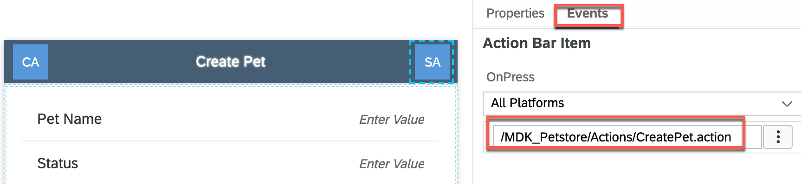

[DONE]
[ACCORDION-END]

[ACCORDION-BEGIN [Step 14: ](Create navigation action)]

Now, create a navigation action that will open the `Pet_Create.page` when executed.

1. Right-click the **Actions** folder | **MDK: New Action** | choose **MDK UI Actions** in **Category** | click **Navigation Action** | **Next**.

2. Provide the below information:

    | Property | Value |
    |----|----|
    | `Action Name`| `NavToPet_Create` |
    | `PageToOpen` | Select `Pet_Create.page` from the dropdown |
    | `ModalPage`| Select `true` from the dropdown |

    !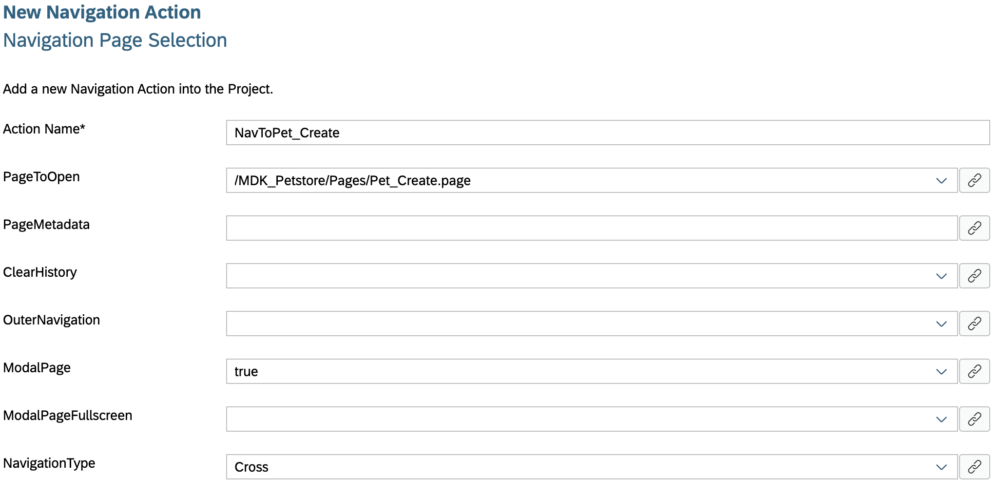

3. Click **Next** and then **Finish** on the confirmation step.

[DONE]
[ACCORDION-END]

[ACCORDION-BEGIN [Step 15: ](Add create button to pet list page)]

You will add a button to the `Main.page` called **Add**. You will link this button to the navigation action you just created. This event will open the `NavToPet_Create.action` when the Add button is pressed by the end-user.

1. In `Main.page`, drag and drop an **Action Bar Item** to the upper right of the action bar.

2. Click the **link icon** to open the object browser for the `SystemItem` property.

    Double click the **Add** type and click **OK**.

    !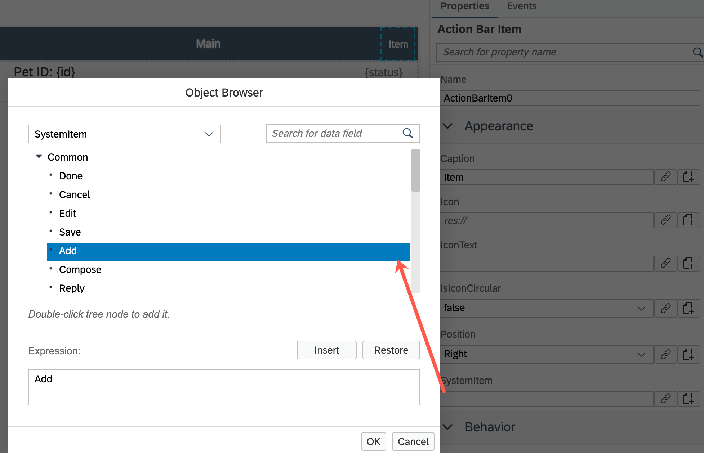

3. In the Properties pane, click the **Events** tab, click the 3 dots icon for the `OnPress` property to open the **Object Browser**.

    Double click the `NavToPet_Create.action` action and click **OK** to set it as the `OnPress` Action.

    !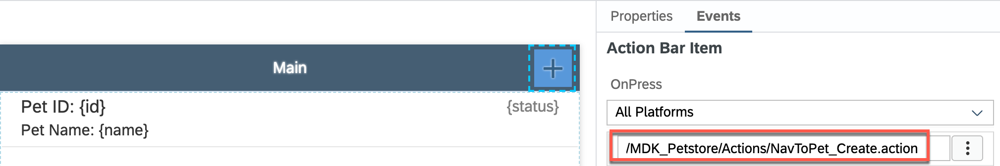

[DONE]
[ACCORDION-END]

[ACCORDION-BEGIN [Step 16: ](Create Close Page Complete action)]

Now, you will create a new action `ClosePage_Complete.action` that will be called after `CreatePet.action` is successful.


1. Right-click the **Actions** folder | **MDK: New Action** | choose **MDK UI Actions** in **Category** | click **Close Page Action** | **Next**.

2. Provide the below information:

    | Property | Value |
    |----|----|
    | `Action Name`| `ClosePage_Complete` |
    | `DismissModal` | Select `Completed` from the dropdown |
    | `CancelPendingActions`| Select `false` from the dropdown |

    !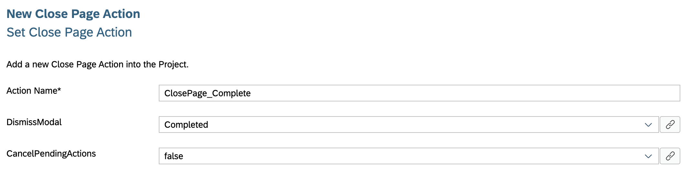

3. Click **Next** and then **Finish** on the confirmation step.

4. Next, define _Success_ actions for `CreatePet.action`.

    Open `CreatePet.action` in the action editor, expand the **Common Action Properties** and provide the below information:

    | Property | Value |
    |----|----|
    | `Success Action` | Click link icon and bind it to `CloseModalPage_Complete.action` |     

    !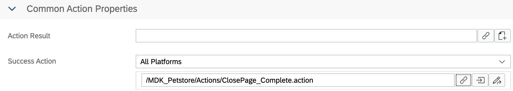

    >When `CreatePet.action` gets executed successfully then `CloseModalPage_Complete.action` will be triggered. You may create a message action and set it as failure action if  `CreatePet.action` fails.

[VALIDATE_1]
[ACCORDION-END]

[ACCORDION-BEGIN [Step 17: ](Redeploy the application)]

Right-click the `Application.app` file in the project explorer pane,  select **MDK: Deploy** and then select deploy target as **Mobile & Cloud**.

>Alternatively, you can select *MDK: Redeploy* in the command palette (View menu>Find Command OR press Command+Shift+p on Mac OR press Ctrl+Shift+P on Windows machine), it will perform the last deployment.

>!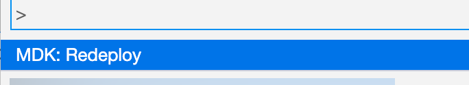

[DONE]
[ACCORDION-END]

[ACCORDION-BEGIN [Step 18: ](Update the app)]

[OPTION BEGIN [Android]]

1. Re-launch the app on your device, authenticate with passcode or Biometric authentication if asked. You will see a _Confirmation_ pop-up, tap **OK**.

2. Tap **+** icon on `Main.page` to navigate to Create Pet page.

    

3.  Fill out the details to create a new Pet record.

    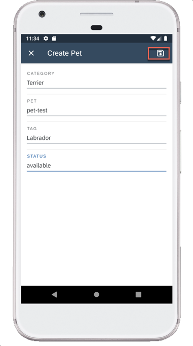

[OPTION END]

[OPTION BEGIN [iOS]]

1. Re-launch the app on your device, authenticate with passcode or Biometric authentication if asked. You will see a _Confirmation_ pop-up, tap **OK**.

2. Tap **+** icon on `Main.page` to navigate to Create Pet page.

    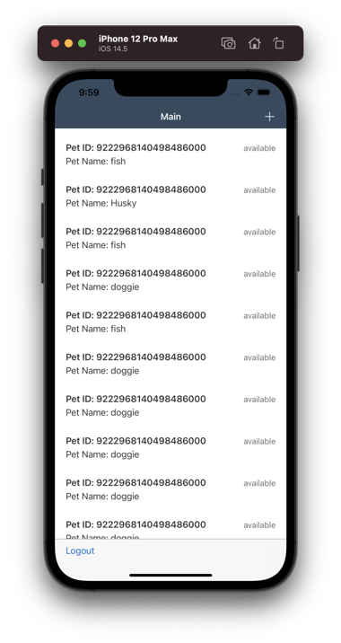

3.  Fill out the details to create a new Pet record.

    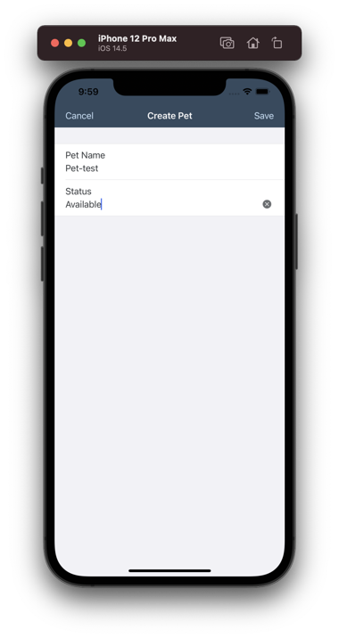

[OPTION END]

[OPTION BEGIN [Web]]

1. Either click the highlighted button or refresh the web page to load the changes.

    !

2. Tap **+** icon on `Main.page` to navigate to Create Pet page.

    !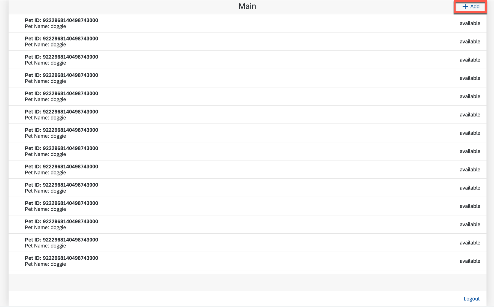

3.  Fill out the details to create a new Pet record.

    !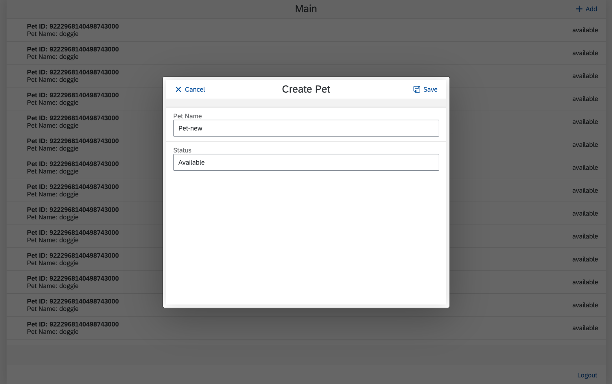

[OPTION END]

You have created a new record consuming REST API. Similarly, you can also modify and delete an existing record.

[VALIDATE_2]
[ACCORDION-END]

---
