## Prerequisites
- **Download and install:** **SAP Mobile Services Client** on your [iOS](https://apps.apple.com/us/app/sap-mobile-services-client/id1413653544) or [Android](https://play.google.com/store/apps/details?id=com.sap.mobileservices.client) device
- **Download and install** [Barcode Scanner](https://play.google.com/store/apps/details?id=com.google.zxing.client.android&hl=en) (required only for Android device)

## Details
### You will learn
  - How to configure an application in Mobile Services
  - How to write a MDK rule to parse the response from REST API
  - How to retrieve and modify the data with calls to `Petstore` API

To be updated:  You may clone an existing project from [GitHub repository](https://github.com/SAP-samples/cloud-mdk-tutorial-samples/tree/master/4-Level-Up-with-the-Mobile-Development-Kit/7-Consume-rest-api-in-mdk-app) and start directly with step 8 or 13 in this tutorial but make sure you complete step 2.


---

Mobile Development Kit allows you to consume REST APIs. You need to first define REST endpoint as a destination in Mobile Services and then need to write MDK rules (JavaScript) to consume it. A rule will be needed to parse the response and then decide what to do.

A publicly available `Petstore` API from [swagger.io](https://petstore.swagger.io) is used as an example in this tutorial.

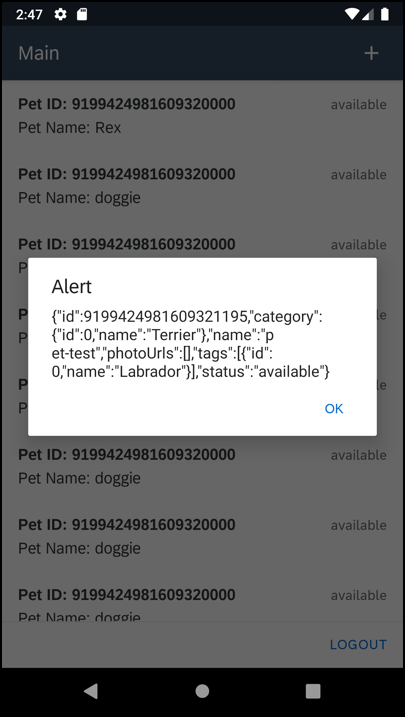

[ACCORDION-BEGIN [Step 1: ](Understand the Petstore API to retrieve data )]

1. Open [`Swagger Petstore`](https://petstore.swagger.io/), find all pets with status as `available`.

    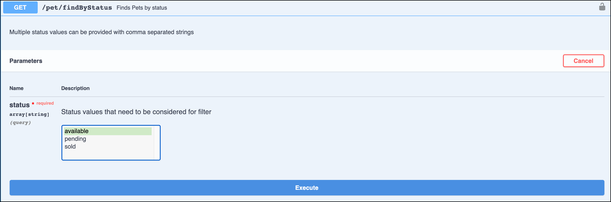

2. Click **Execute** to get the response.

    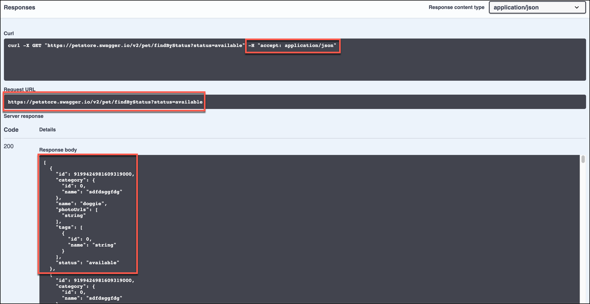

    By looking at results, you now have understood

    -	what is the Request URL to retrieve pet information
    -	what is header parameter to be passed in GET call
    -	what is the response code
    -	how the response body looks like

With above details, you will next configure an app in Mobile Services, add root of request URL as a destination and then consume it in MDK.

[DONE]
[ACCORDION-END]

[ACCORDION-BEGIN [Step 2: ](Configure a new MDK app in Mobile Services cockpit)]

1. Navigate to [SAP Cloud Platform Mobile Services cockpit on Cloud Foundry environment](fiori-ios-hcpms-setup).

2. On the home screen, select **Create new app**.

    

3. Provide the required information and click **Next**.

    | Field | Value |
    |----|----|
    | `ID` | `com.sap.mdk.demo` |
    | `Name` | `SAP MDK Demo App` |

    !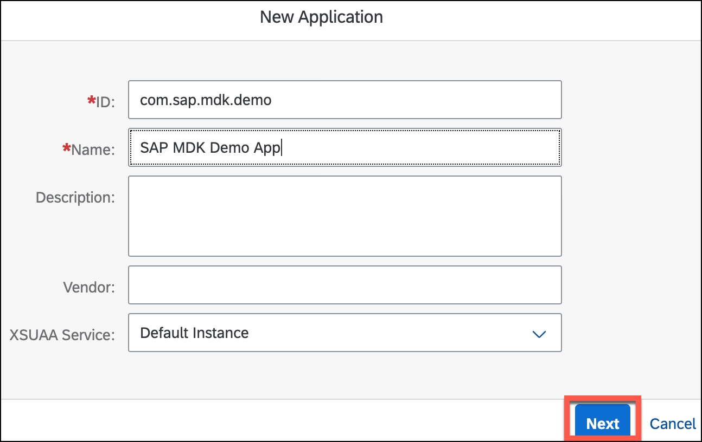

    >Other fields are optional. For more information about these fields, see [Creating Applications](https://help.sap.com/doc/f53c64b93e5140918d676b927a3cd65b/Cloud/en-US/docs-en/guides/getting-started/admin/manage.html#creating-applications) in the SAP Cloud Platform documentation.

4. Select **Mobile Development Kit Application** from the dropdown and Click **Finish**.

    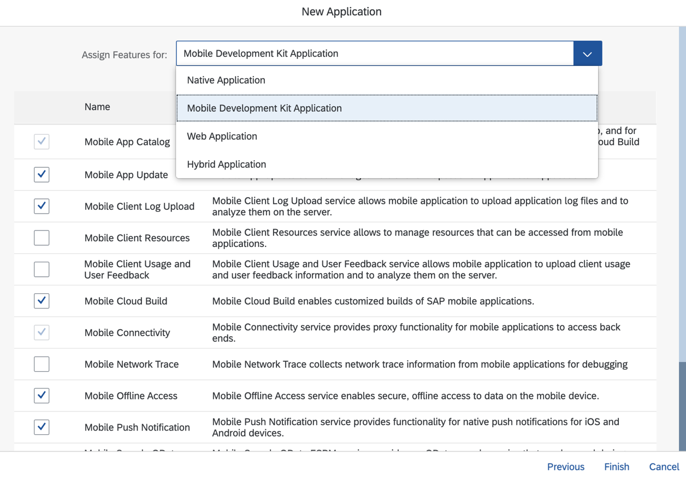

5. Click **Mobile Connectivity** to add `Petstore` root API as a destination.

    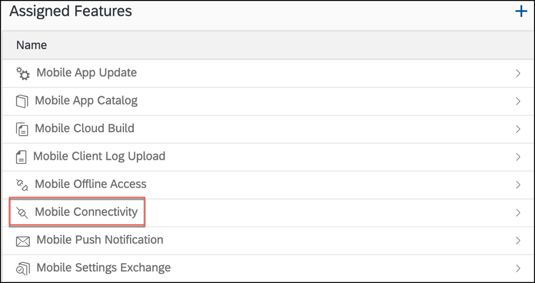

6. Click **Create** icon to add a new destination.  

    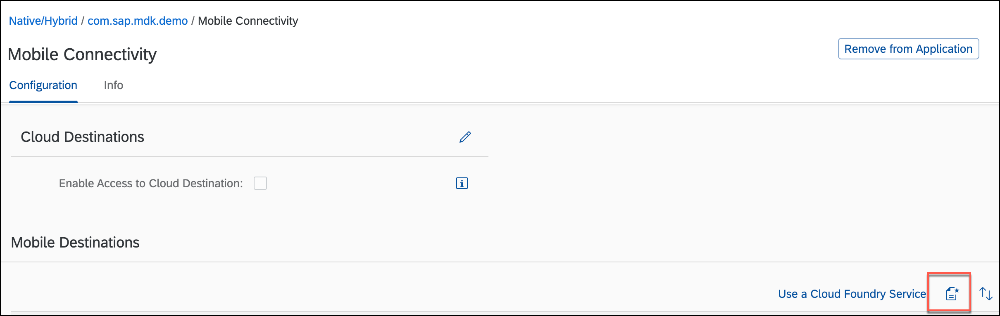

7. Provide the required information and click **Next**.

    | Field | Value |
    |----|----|
    | `Destination Name` | `com.sap.mdk.petstore` |
    | `URL` | `https://petstore.swagger.io/v2` |

    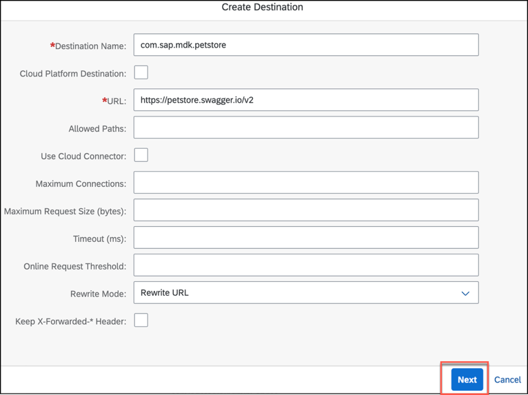

8. For this tutorial, there is no Custom Headers, Annotations, Authentication required, click **Next** and Finish the form.

    In MDK rule, you will reference `Petstore` root URL via newly added destination `com.sap.mdk.petstore`.

[DONE]
[ACCORDION-END]

[ACCORDION-BEGIN [Step 3: ](Create a new MDK project in SAP Web IDE)]

Ensure that you have already created a new destination `mobileservices_cf` as per [this](fiori-ios-hcpms-setup) tutorial. This is required to connect SAP Web IDE (NEO) to Mobile Services in Cloud Foundry environment.

This step includes creating the Mobile Development Kit project in the Editor.

1. Launch the SAP Web IDE and select the **MDK perspective** by clicking on the icon in the left panel.

2. Right-click Workspace folder and select **New** | **MDK Empty Project**.

    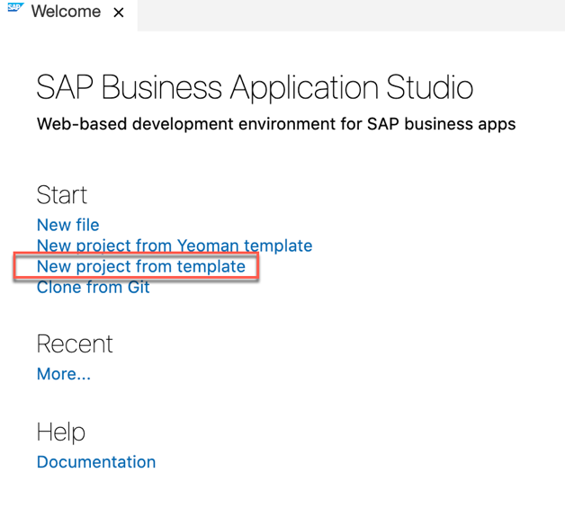

    >More details on _MDK template_ is available in [help documentation](https://help.sap.com/doc/f53c64b93e5140918d676b927a3cd65b/Cloud/en-US/docs-en/guides/getting-started/mdk/webide.html#creating-a-new-project).

3. Enter the Project Name as `MDK_Petstore` and click **Next**.

    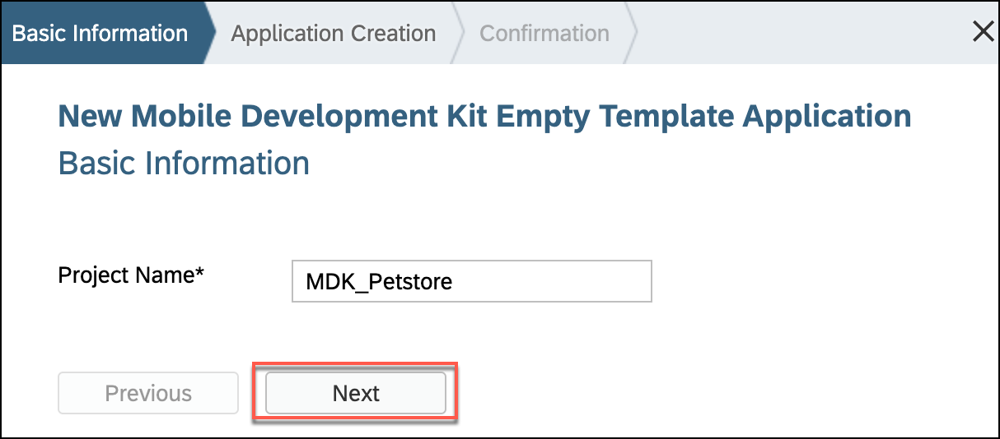

4. Leave the default values in _Application Creation_ step as it is, click **Finish**.

    After clicking Finish,  the wizard will generate your MDK Application based on your selections. You should now see the `MDK_Petstore` project in the project explorer.

[DONE]
[ACCORDION-END]

[ACCORDION-BEGIN [Step 4: ](Create a rule to retrieve Pet information)]

A rule will be needed to parse the response from REST API.

>You can find more details about [writing a Rule](https://help.sap.com/doc/f53c64b93e5140918d676b927a3cd65b/Cloud/en-US/docs-en/guides/getting-started/mdk/development/rules.html).

1. Right-click the **Rules** folder | **New** | **File**.

    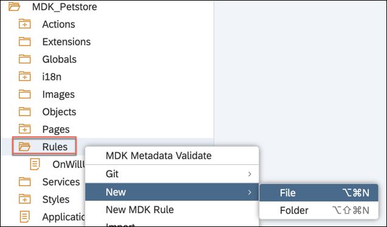

2. Enter the file name `GetPetFindByStatus.js`, click **OK**.

    Copy and paste the following code.

    ```JavaScript
    export default function GetPetFindByStatus(context) {
    	//appId Returns the App ID com.sap.mdk.demo of application in Mobile Services on SAP Cloud Platform.
    	let appId = context.evaluateTargetPath('#Application/#ClientData/#Property:MobileServiceAppId');
    	// GET "https://petstore.swagger.io/v2/pet/findByStatus?status=available" -H "accept: application/json"
    	let destination = 'com.sap.mdk.petstore';
    	let relativePath = 'pet/findByStatus?status=available';
    	let requestPath = destination + '/' + relativePath;
    	let params = {
    		'method': 'GET',
    		'header': {
    			'x-smp-appid': appId,
    			'Accept': 'application/json'
    		}
    	};
      //sendMobileServiceRequest Client API is used to send a request to SAP Cloud Platform Mobile Services.
    	return context.sendMobileServiceRequest(requestPath, params).then((response) => {
    		if (response.statusCode == 200) {
    			console.log(response.content.toString());
    			// Parse and act on results
    			let result = JSON.parse(response.content.toString());
    			return result;
    		}
    	});
    }
    ```

    >You can find more details about [targeting properties on Application's `ClientData` Object] (https://help.sap.com/doc/69c2ce3e50454264acf9cafe6c6e442c/Latest/en-US/docs-en/reference/schemadoc/definitions/TargetPath.schema.html#targeting-properties-on-a-pages-clientdata-object) and about [Client API `sendMobileServiceRequest`](https://help.sap.com/doc/69c2ce3e50454264acf9cafe6c6e442c/Latest/en-US/docs-en/reference/apidoc/interfaces/ipageproxy.html#sendmobileservicerequest) in documentation.

3. Save the changes.

[DONE]
[ACCORDION-END]

[ACCORDION-BEGIN [Step 5: ](Display Pets list in MDK page)]

You will add an **Object Table** control  item on `Main.page` to display the list of Pets.

1. In `Main.page`, drag and drop **Object Table** control on the page.

    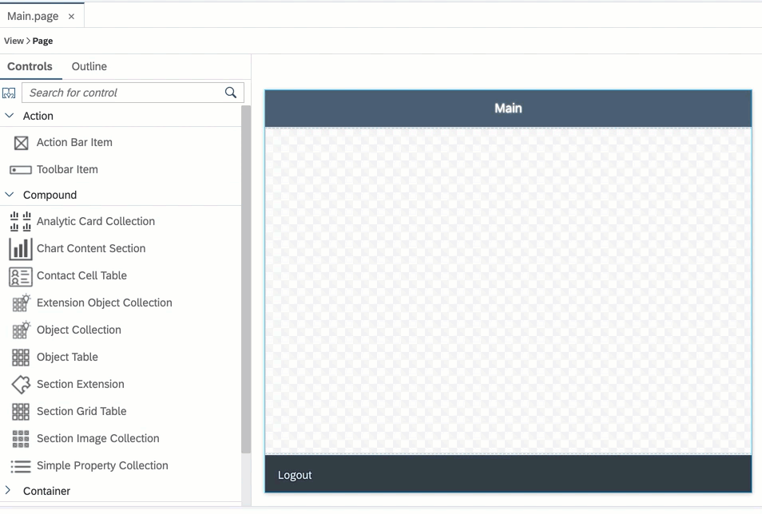

2. Provide the required information for **Target** section:

    | Field | Value |
    |----|----|
    | `Select Data Type` | `String Target` |
    | `Bind to` | `/MDK_Petstore/Rules/GetPetFindByStatus.js` |

    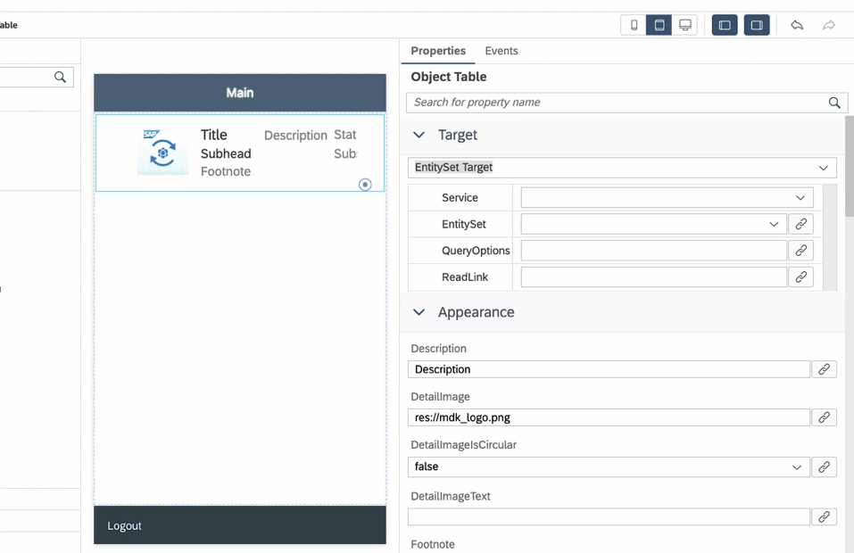

    >You can find more details on **Target** in [documentation](https://help.sap.com/doc/69c2ce3e50454264acf9cafe6c6e442c/Latest/en-US/docs-en/reference/schemadoc/definitions/Target.schema.html).


7. Under **Appearance**, provide below information:

    | Property | Value |
    |----|----|
    | `Description`| leave it empty |
    | `DetailImage` | leave it empty |
    | `DetailImageIsCircular` | `false` |
    | `Footnote`| leave it empty |
    | `PreserveIconStackSpacing` | `false` |
    | `ProgessIndicator`| leave it empty |
    | `Status` | `{status}` |
    | `Subhead` | `Pet Name: {{#Property:name}}` |
    | `SubStatus` | leave it empty |
    | `Title` | `Pet ID: {{#Property:id}}` |

    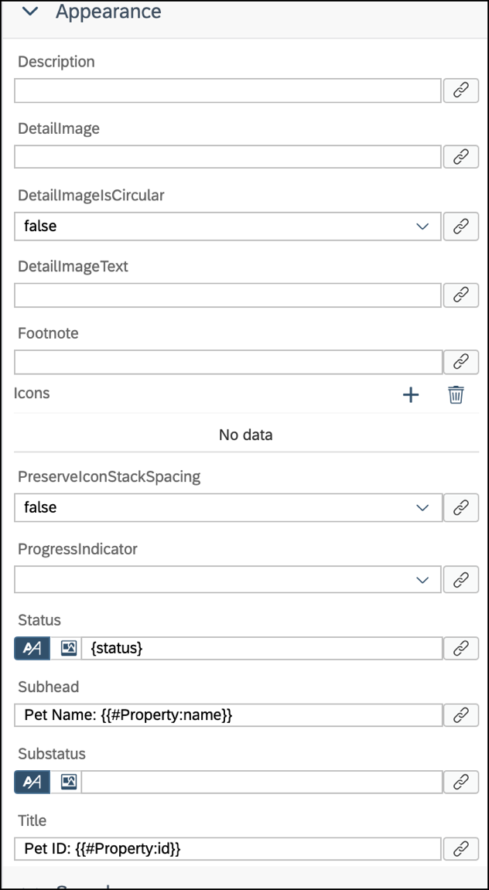

[DONE]
[ACCORDION-END]


[ACCORDION-BEGIN [Step 6: ](Deploy and activate the application)]

So far, you have learned how to build an MDK application in the SAP Web IDE editor. Now, we deploy this application definition to Mobile Services.

1. Right click the `MDK_Petstore` MDK Application in the project explorer pane and select **MDK Deploy and Activate**.

    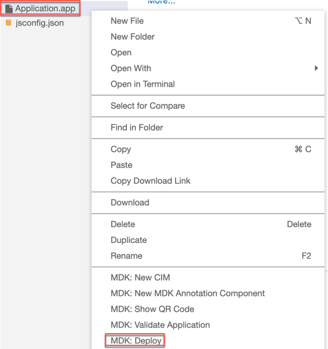

2. Let the default configuration as it is and click **Next**.

    !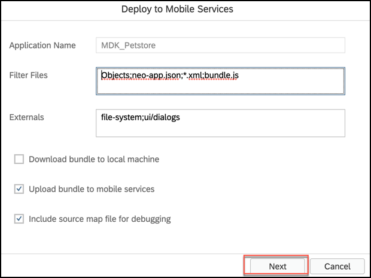

    >_Filter Files_ will be filtered and ignored in web packing process.

    >_Externals_ is the list of NPM modules that are part of the MDK Client application and should not be validated in the bundle.

3. Select the Destination `mobileservices_cf` from the dropdown and application id where you want to deploy.

    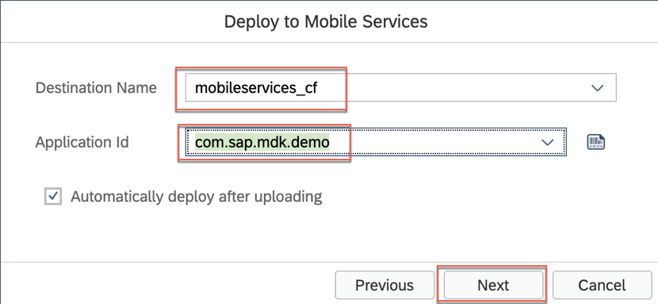

    >By default, automatically deploy option is selected, In other words, the application is automatically deployed from Mobile Services to your MDK client.

4. Click **Next** to finish the deployment from SAP Web IDE.

    You should see **Application deployed successfully** message in console log.

[DONE]
[ACCORDION-END]

[ACCORDION-BEGIN [Step 7: ](Populate the QR code for app onboarding)]

SAP Web IDE has a feature to generate QR code for app onboarding.

Right click the `MDK_Petstore` MDK Application in the project explorer pane and select **MDK Show QR Code**.


>**MDK Show QR Code** option is greyed out if MDK project is not yet deployed and activated as per step 6.

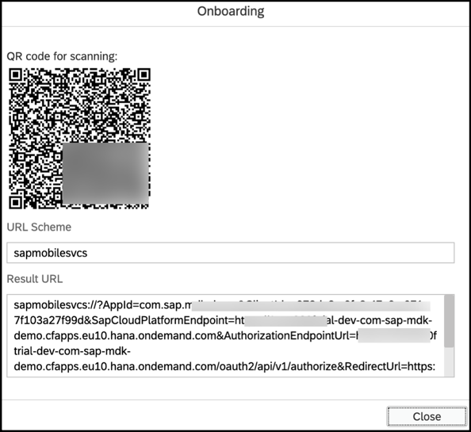

[DONE]
[ACCORDION-END]

[ACCORDION-BEGIN [Step 8: ](Run the app in MDK client)]

>Make sure you are choosing the right device platform tab above. Once you have scanned and onboarded using the onboarding URL, it will be remembered. When you Log out and onboard again, same onboarding URL settings will be reused without the need to scan. You will need to use 3rd party QR scanner app in Android or device Camera in iOS, if you would like to scan a different onboarding URL.

[OPTION BEGIN [Android]]

1. Launch **`Mobile Svcs`** app on your Android device. Tap **GET STARTED** to connect MDK client to SAP Cloud Platform.

    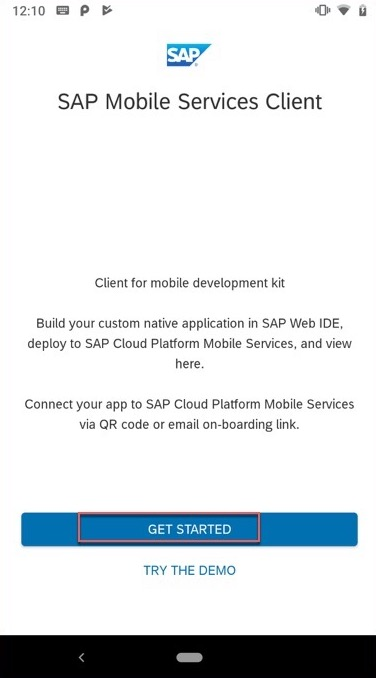

2. Tap **QR CODE SCAN** to start the device camera for scanning the onboarding QR code.

    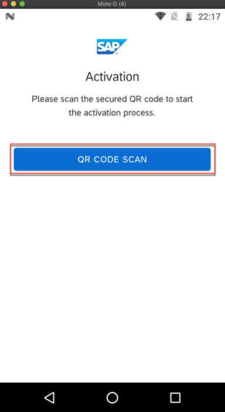

3. Once scan is succeeded, tap **CONTINUE**.

    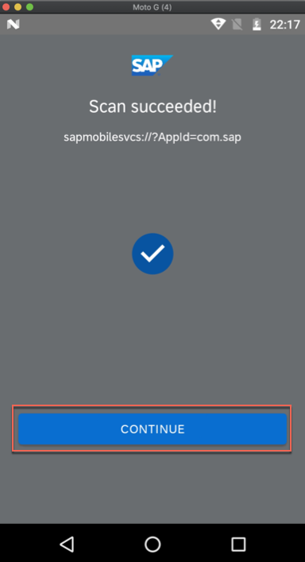

4. Enter Email address and password to login to SAP Cloud Platform and tap **Log On** to authenticate.

    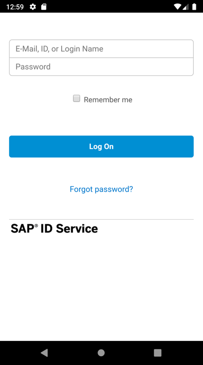

5. Tap **AGREE** on `End User License Agreement`.

    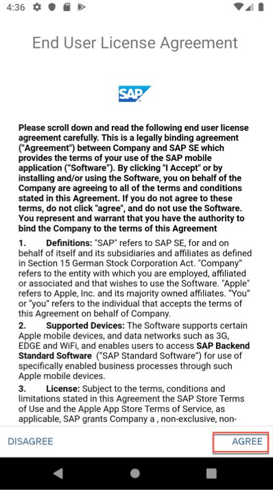

6. Choose a passcode with at least 8 characters for unlocking the app and tap **NEXT**.

    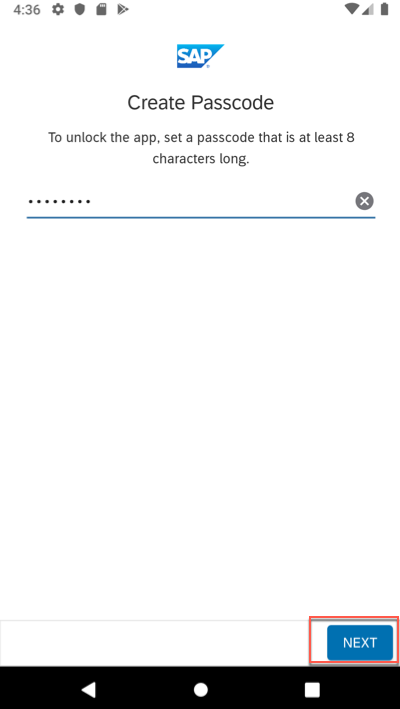

7. Confirm the passcode and tap **DONE**.

    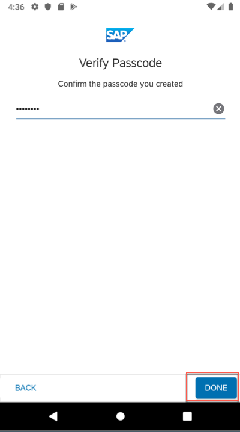

    Optionally, you can enable fingerprint to get faster access to the app data.

    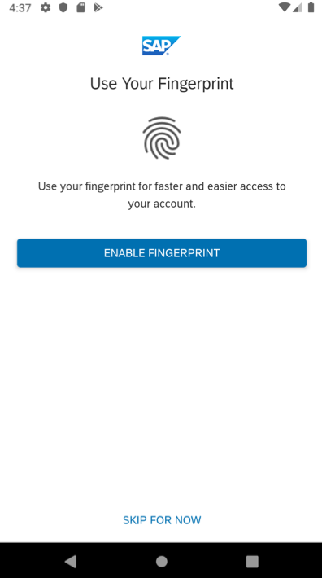

8. Tap **OK**.

    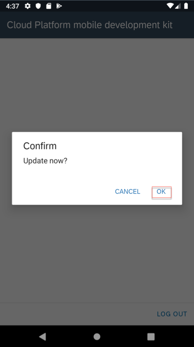

    The MDK client receives deployed metadata definitions as a bundle.

    Now, you will see the Pets list on the **Main** page.

    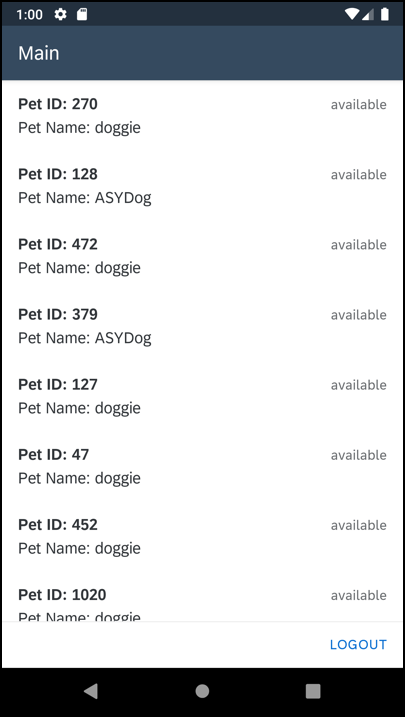

    >Once you have scanned and onboarded using the onboarding URL, it will be remembered. When you Log out and onboard again, same onboarding URL settings will be reused without the need to scan. You will need to use 3rd party QR scanner app in Android or device Camera in iOS, if you would like to scan a different onboarding URL.

[OPTION END]

[OPTION BEGIN [iOS]]

1. Launch **`Mobile Svcs`** app on your iOS device. Tap **Scan** to start the device camera for scanning the onboarding QR code.

    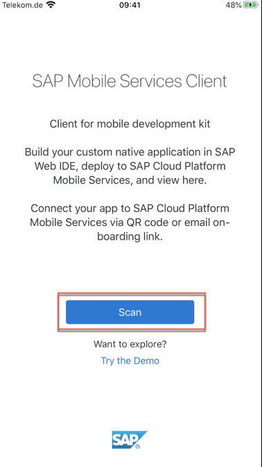

2. Once scan is succeeded, tap **Continue**.

    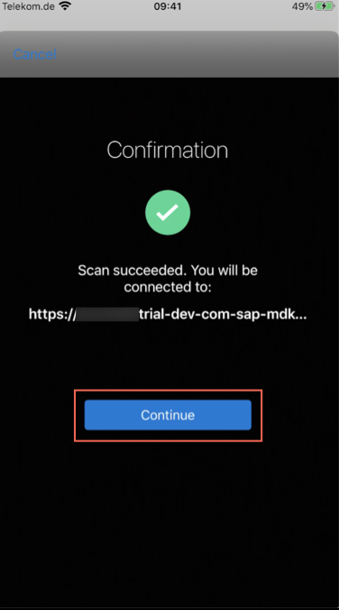

3. Enter Email address and password to login to SAP Cloud Platform and tap **Log On** to authenticate.

    

4. Tap **Agree** on `End User License Agreement`.

    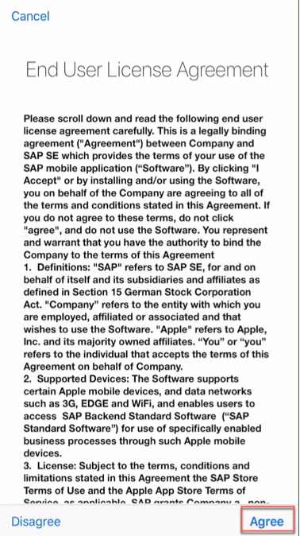

5. Choose a passcode with at least 8 characters for unlocking the app and tap **Next**.

    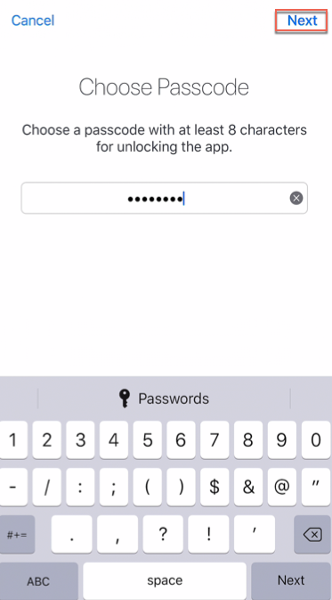

6. Confirm the passcode and tap **Done**.

    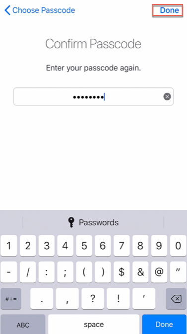

    Optionally, you can enable Touch ID to get faster access to the app data, click **Enable**.

    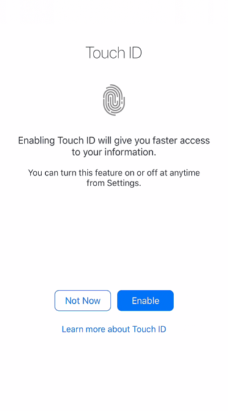

7. Tap **OK**.

    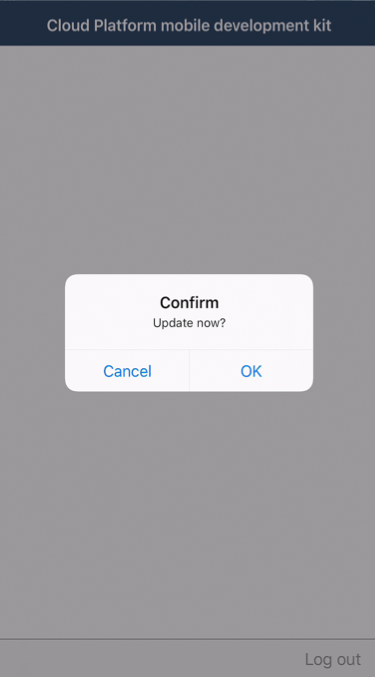

    The MDK client receives deployed metadata definitions as a bundle.

    Now, you will see the Pets list on the **Main** page.

    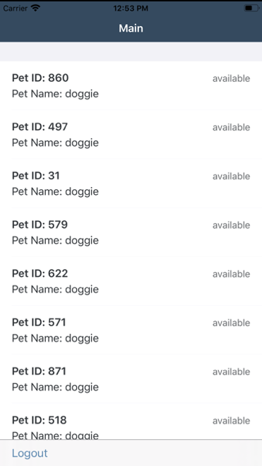

    Congratulations, you have now learned how to parse a REST API and displaying it's result in MDK page.

[OPTION END]

Congratulations, you have learned how to consume a REST API in MDK app to display Pets list.

Next, you will learn how to create a new pet record.

[DONE]
[ACCORDION-END]


[ACCORDION-BEGIN [Step 9: ](Understand the Petstore API to create a new record)]

1. In [`Swagger Petstore`](https://petstore.swagger.io/), add a new pet to the store.

    

    There is payload example to be passed for adding a new pet.

2. For testing, use below payload.

    ```JSON
    {
      "category": {
        "name": "Terrier"
      },
      "name": "pet-test",
      "tags": [
        {
          "name": "Labrador"
        }
      ],
      "status": "available"
    }
    ```

2. Click **Execute** to get the response.

    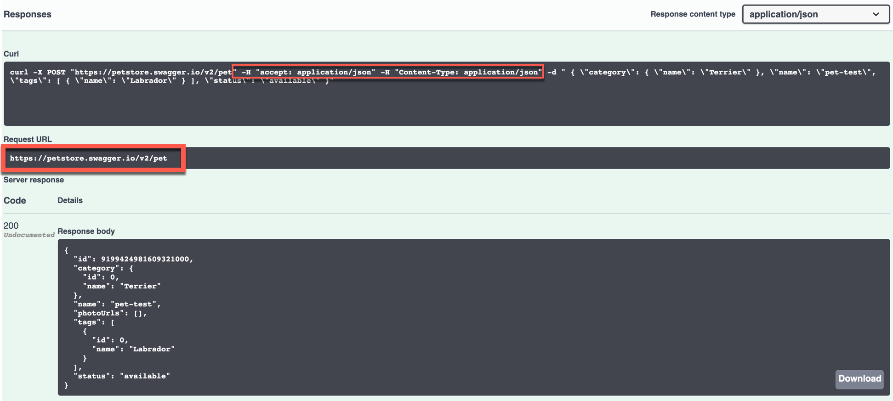

    By looking at results, you now have understood

    -	what is the Request URL & body to create a new pet record
    -	what are header parameters to be passed in POST call
    -	what is the response code
    -	how the response body looks like

With above details, you will now create a new MDK rule to create a new Pet record.

[DONE]
[ACCORDION-END]

[ACCORDION-BEGIN [Step 10: ](Create a rule to POST pet record)]

1. Switch back to SAP Web IDE. Right-click the **Rules** folder | **New** | **File**. Enter the file name `PostPet.js`, click **OK**.

    Copy and paste the following code.

    ```JavaScript
    export default function PostPet(context) {
    	let appId = context.evaluateTargetPath('#Application/#ClientData/#Property:MobileServiceAppId');
    	// POST "https://petstore.swagger.io/v2/pet" -H "accept: application/json" -H "Content-Type: application/json"
    	let destination = 'com.sap.mdk.petstore';
    	let relativePath = 'pet';
    	let requestPath = destination + '/' + relativePath;
    	let requestBodyJSON = {
    		"category": {
    			"name": "Terrier"
    		},
    		"name": "pet-test",
    		"tags": [{
    			"name": "Labrador"
    		}],
    		"status": "available"
    	}
    	let params = {
    		'method': 'POST',
    		'header': {
    			'x-smp-appid': appId,
    			'Accept': 'application/json',
    			'Content-Type': 'application/json'
    		},
    		'body': JSON.stringify(requestBodyJSON)
    	};
    	return context.sendMobileServiceRequest(requestPath, params).then((response) => {
    		if (response.statusCode == 200) {
    			alert(response.content.toString());
    		} else {
    			alert('didnt work');
    		}

    	});
    }
    ```

3. Save the changes.

[DONE]
[ACCORDION-END]

[ACCORDION-BEGIN [Step 11: ](Call the rule in MDK page)]

1. Open `Main.page`, drag & drop an action bar item to the page.

    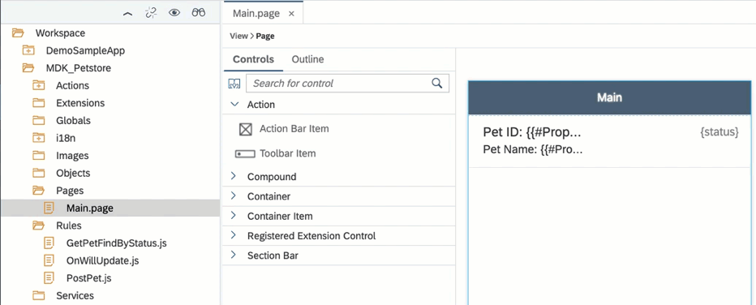

2. In the **Properties** pane, click the **link icon** to open the object browser for the **System Item** property. Double click the **Add** type and click **OK**.

    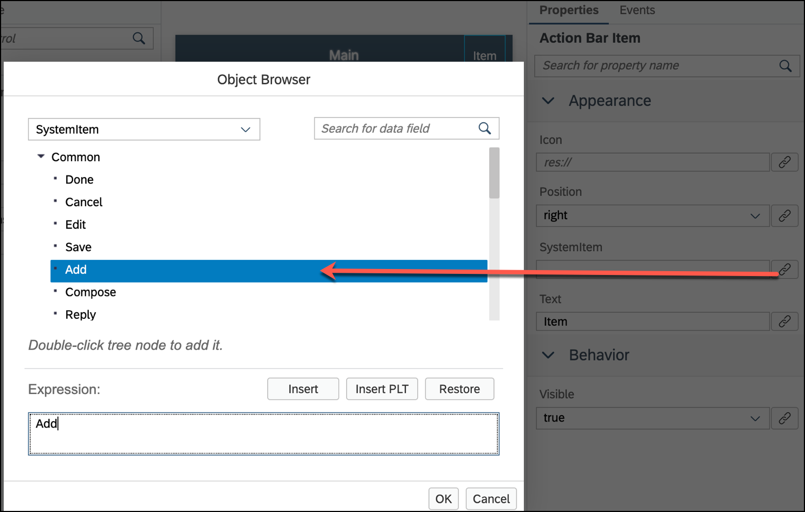

2. Navigate to **Events** tab and bind `PostPet.js` rule to `OnPress` event.

    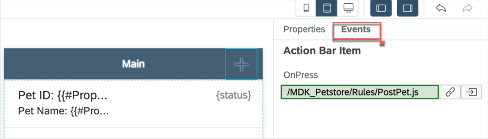

3. Save the changes.

[DONE]
[ACCORDION-END]

[ACCORDION-BEGIN [Step 12: ](Redeploy and reactivate the application)]

1. Right click the `MDK_Petstore` MDK Application in the project explorer pane and select **MDK Deploy and Activate**.

    

2. Let the default configuration as it is and click **Next**.

    !

3. Confirm the destination name and application id match where you want to deploy and click **Next** to finish the deployment from SAP Web IDE.

    

[DONE]
[ACCORDION-END]

[ACCORDION-BEGIN [Step 13: ](Update the MDK app with new metadata)]

[OPTION BEGIN [Android]]

1. Re-launch the app on your device, authenticate with passcode or Touch ID if asked. You will see a _Confirmation_ pop-up, tap **OK**.

2. Tap **+** icon on `Main.page` to create a new Pet record. A new record has been created and results are displaying in alert pop-up.

    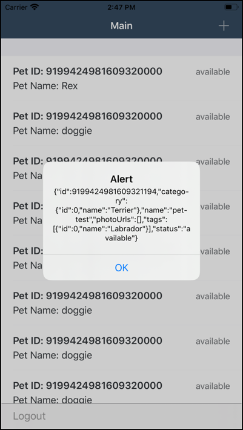

[OPTION END]

[OPTION BEGIN [iOS]]

1. Re-launch the app on your device, authenticate with passcode or Touch ID if asked. You will see a _Confirmation_ pop-up, tap **OK**.

2. Tap **+** icon on `Main.page` to create a new Pet record. A new record has been created and results are displaying in alert pop-up.

    

[OPTION END]

Congratulations, you have successfully created a new record consuming REST API. Similarly, you can also modify and delete an existing record.

[VALIDATE_2]
[ACCORDION-END]


---
