## Prerequisites
- **Tutorial:** [Set Up SAP Business Application Studio for Development](appstudio-onboarding)
- **Download and install:** **SAP Mobile Services Client** on your [iOS](https://apps.apple.com/us/app/sap-mobile-services-client/id1413653544) or [Android](https://play.google.com/store/apps/details?id=com.sap.mobileservices.client) device
- **Download and install** [Barcode Scanner](https://play.google.com/store/apps/details?id=com.google.zxing.client.android&hl=en) (required only for Android device)

## Details
### You will learn
  - How to configure an application in Mobile Services
  - How to create MDK applications in SAP Business Application Studio
  - How to write a MDK rule to parse the response from REST API
  - How to retrieve and modify the data with calls to `Petstore` API

You may clone an existing project from [GitHub repository](https://github.com/SAP-samples/cloud-mdk-tutorial-samples/tree/master/4-Level-Up-with-the-Mobile-Development-Kit/7-Consume-rest-api-in-mdk-app) and start directly with step 7 or 17 in this tutorial but make sure you complete step 2.


---

Mobile Development Kit allows you to consume REST APIs. You need to first define REST endpoint as a destination in Mobile Services and then need to write MDK rules (JavaScript) to consume it. A rule will be needed to parse the response and then decide what to do.

A publicly available `Petstore` API from [swagger.io](https://petstore.swagger.io) is used as an example in this tutorial. For this tutorial, you will use the new SAP Business Application Studio as the development tool of choice. SAP Business Application Studio provides a web-based Visual Studio Code-like experience.

!

!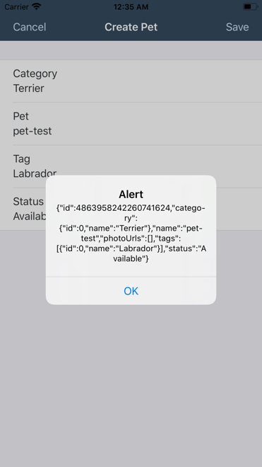

[ACCORDION-BEGIN [Step 1: ](Understand the Petstore API to retrieve data)]

1. Open [`Swagger Petstore`](https://petstore.swagger.io/), find all pets with status as `available`.

    !

2. Click **Execute** to get the response.

    !

    By looking at results, you now have understood

    -	what is the Request URL to retrieve pet information
    -	what is header parameter to be passed in GET call
    -	what is the response code
    -	how the response body looks like

With above details, you will next configure an app in Mobile Services, add root of request URL as a destination and then consume it in MDK.

[DONE]
[ACCORDION-END]

[ACCORDION-BEGIN [Step 2: ](Configure new MDK app in Mobile Services cockpit)]

1. Navigate to [SAP Cloud Platform Mobile Services cockpit on Cloud Foundry environment](fiori-ios-hcpms-setup).

2. On the home screen, select **Create new app**.

    !

3. Provide the required information and click **Next**.

    | Field | Value |
    |----|----|
    | `ID` | `com.sap.mdk.restapi` |
    | `Name` | `SAP MDK REST API` |

    !

    >Other fields are optional. For more information about these fields, see [Creating Applications](https://help.sap.com/doc/f53c64b93e5140918d676b927a3cd65b/Cloud/en-US/docs-en/guides/getting-started/admin/manage.html#creating-applications) in the SAP Cloud Platform documentation.

4. Select **Mobile Development Kit Application** from the dropdown and Click **Finish**.

    !

5. Click **Mobile Connectivity** to add `Petstore` root API as a destination.

    !

6. Click **Create** icon to add a new destination.  

    !

7. Provide the required information and click **Next**.

    | Field | Value |
    |----|----|
    | `Destination Name` | `swagger.petstore` |
    | `URL` | `https://petstore.swagger.io/v2` |

    !

8. For this tutorial, there is no Custom Headers, Annotations, Authentication required, click **Next** and Finish the form.

    In MDK rule, you will reference `Petstore` root URL via newly added destination `swagger.petstore`.

[DONE]
[ACCORDION-END]

[ACCORDION-BEGIN [Step 3: ](Create your Dev Space in SAP Business Application Studio)]

Ensure that you have already [Set Up SAP Business Application Studio for Development](appstudio-onboarding).

1. Choose **Create Dev Space**.

    !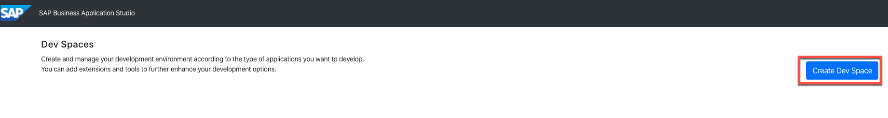

2. Choose `MDKTutorial` as the name for your dev space and **SAP Cloud Platform Mobile Services** as the application type. Continue with **Create Dev Space**.

    !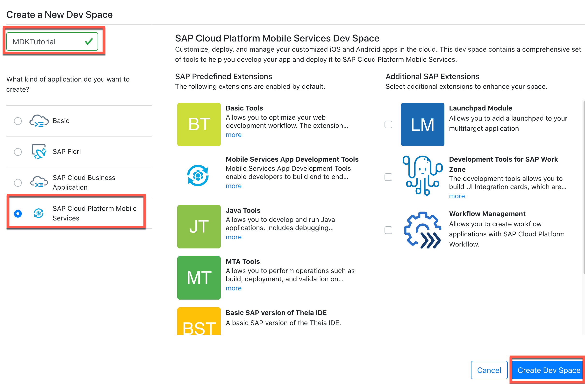

3. When it is ready, open your dev space by clicking on the name.

    !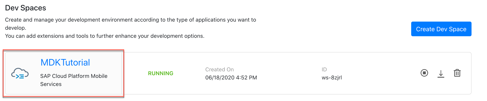

[DONE]
[ACCORDION-END]

[ACCORDION-BEGIN [Step 4: ](Create new MDK project)]

This step includes creating the Mobile Development Kit project in the Editor.

1. In Welcome page, click **New Project from template**.

    !

    >If you don't see Welcome page, you can launch it by navigating to View menu> Find Command > Welcome.

2. Choose **MDK Project** and click **Next**.

    !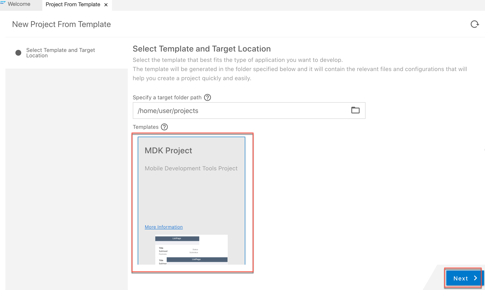

3. Provide the required information and click **Next**.

    | Field | Value |
    |----|----|
    | `MDK template type` | `Empty` |
    | `Your project name` | `MDK_Petstore` |
    | `Your application name` | `MDK_Petstore` |

    !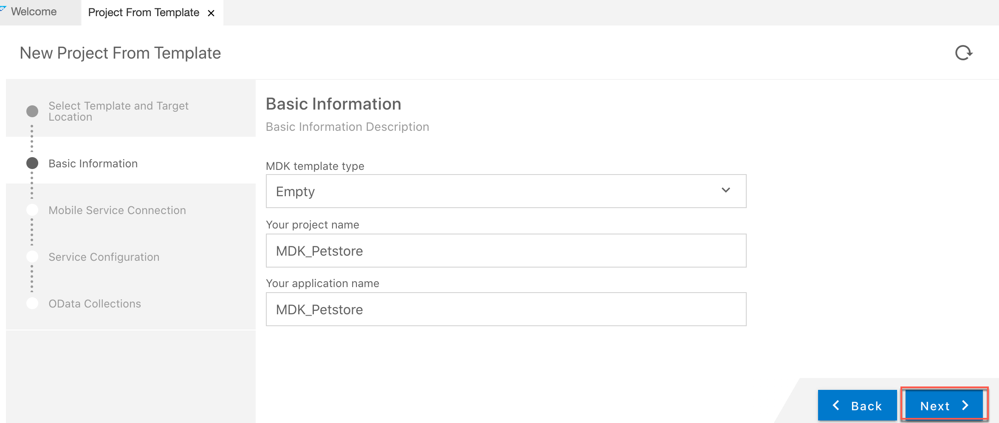

4. Click **Open in New Workspace** to open the generated project.

    !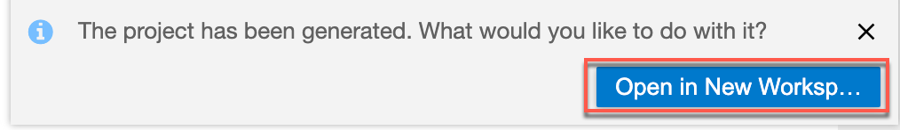

    Page will be refreshed and you should now see the `MDK_Petstore` project in the project explorer.

    !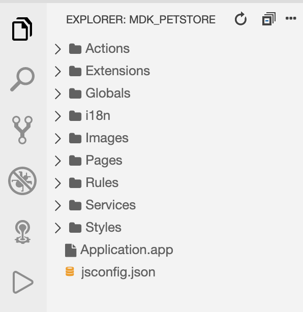

[DONE]
[ACCORDION-END]

[ACCORDION-BEGIN [Step 5: ](Create rule to retrieve Pet information)]

A rule will be needed to parse the response from REST API.

>You can find more details about [writing a Rule](https://help.sap.com/doc/f53c64b93e5140918d676b927a3cd65b/Cloud/en-US/docs-en/guides/getting-started/mdk/development/rules.html).

1. Right-click the **Rules** folder | **New** | **File**.

    !

2. Enter the file name `GetPetFindByStatus.js`, click **OK**.

    Copy and paste the following code.

    ```JavaScript
    export default function GetPetFindByStatus(context) {
    	//appId Returns the App ID com.sap.mdk.demo of application in Mobile Services on SAP Cloud Platform.
    	let appId = context.evaluateTargetPath('#Application/#ClientData/#Property:MobileServiceAppId');
    	// GET "https://petstore.swagger.io/v2/pet/findByStatus?status=available" -H "accept: application/json"
    	let destination = 'swagger.petstore';
    	let relativePath = 'pet/findByStatus?status=available';
    	let requestPath = destination + '/' + relativePath;
    	let params = {
    		'method': 'GET',
    		'header': {
    			'x-smp-appid': appId,
    			'Accept': 'application/json'
    		}
    	};
      //sendMobileServiceRequest Client API is used to send a request to SAP Cloud Platform Mobile Services.
    	return context.sendMobileServiceRequest(requestPath, params).then((response) => {
    		if (response.statusCode == 200) {
    			console.log(response.content.toString());
    			// Parse and act on results
    			let result = JSON.parse(response.content.toString());
          //result returns an array of objects and this result will be used in binding the Target in step 6.2
    			return result;
    		}
        else {
          alert('something went wrong');
        }
    	});
    }
    ```

    >You can find more details about [targeting properties on Application's `ClientData` Object] (https://help.sap.com/doc/69c2ce3e50454264acf9cafe6c6e442c/Latest/en-US/docs-en/reference/schemadoc/definitions/TargetPath.schema.html#targeting-properties-on-a-pages-clientdata-object) and about [Client API `sendMobileServiceRequest`](https://help.sap.com/doc/69c2ce3e50454264acf9cafe6c6e442c/Latest/en-US/docs-en/reference/apidoc/interfaces/ipageproxy.html#sendmobileservicerequest) in documentation.

3. Save the changes.

[DONE]
[ACCORDION-END]

[ACCORDION-BEGIN [Step 6: ](Display Pets list in MDK page)]

You will add an **Object Table** control  item on `Main.page` to display the list of Pets.

1. In `Main.page`, drag and drop **Object Table** control on the page.

    !

2. Provide the required information for **Target** section:

    | Field | Value |
    |----|----|
    | `Select Data Type` | `String Target` |
    | `Bind to` | `/MDK_Petstore/Rules/GetPetFindByStatus.js` |

    !

    >You can find more details on **Target** in [documentation](https://help.sap.com/doc/69c2ce3e50454264acf9cafe6c6e442c/Latest/en-US/docs-en/reference/schemadoc/definitions/Target.schema.html).


7. Under **Appearance**, provide below information:

    | Property | Value |
    |----|----|
    | `Description`| leave it empty |
    | `DetailImage` | leave it empty |
    | `DetailImageIsCircular` | `false` |
    | `Footnote`| leave it empty |
    | `PreserveIconStackSpacing` | `false` |
    | `ProgessIndicator`| leave it empty |
    | `Status` | `{status}` |
    | `Subhead` | `Pet Name: {{#Property:name}}` |
    | `SubStatus` | leave it empty |
    | `Title` | `Pet ID: {{#Property:id}}` |

    !

[DONE]
[ACCORDION-END]


[ACCORDION-BEGIN [Step 7: ](Deploy the application)]

So far, you have learned how to build an MDK application in the SAP Business Application Studio editor. Now, we deploy this application definition to Mobile Services.

1. Right-click the `Application.app` file in the project explorer pane and select **MDK: Deploy**.

    !

2. Press Enter to confirm Cloud Foundry API endpoint.

    !

3. Enter your Cloud Foundry user (email address) and press `Enter`.

    !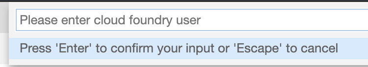

4. Enter password and press `Enter`.

    !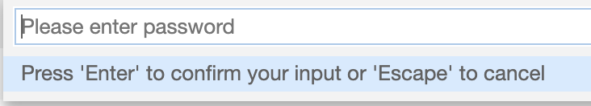

5. After successful login, you will be asked to select Cloud Foundry organization.

    !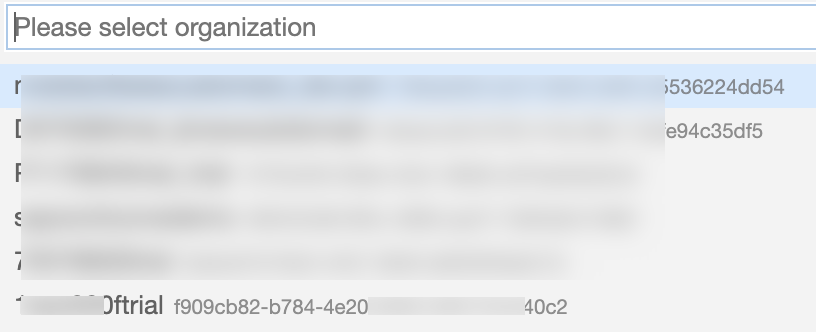

6. Select related space.

    !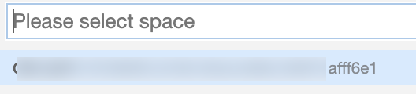

7.  Select the application id `com.sap.mdk.restapi` you created in step 2 to finish the deployment.

    !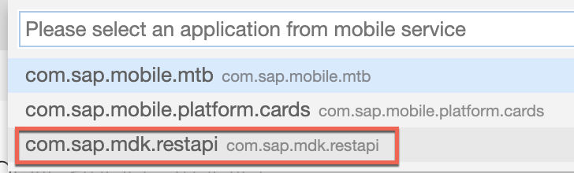

    You should see **Deployed succeeded** message.

    !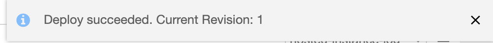

[DONE]
[ACCORDION-END]

[ACCORDION-BEGIN [Step 8: ](Populate the QR code for app onboarding)]

SAP Business Application Studio IDE a feature to generate QR code for app onboarding.

1. Click `Application.app` file to open it in Editor.

2. Right-click the `Application.app` file in the project explorer pane and select **MDK: Show QR Code**.

    !

[DONE]
[ACCORDION-END]

[ACCORDION-BEGIN [Step 9: ](Run the app in MDK client)]

>Make sure you are choosing the right device platform tab above. Once you have scanned and onboarded using the onboarding URL, it will be remembered. When you Log out and onboard again, same onboarding URL settings will be reused without the need to scan. You will need to use 3rd party QR scanner app in Android or device Camera in iOS, if you would like to scan a different onboarding URL.

[OPTION BEGIN [Android]]

1. Launch **`Mobile Svcs`** app on your Android device. Tap **GET STARTED** to connect MDK client to SAP Cloud Platform.

    !

2. Tap **QR CODE SCAN** to start the device camera for scanning the onboarding QR code.

    !

3. Once scan is succeeded, tap **CONTINUE**.

    !

4. Enter Email address and password to login to SAP Cloud Platform and tap **Log On** to authenticate.

    !

5. Tap **AGREE** on `End User License Agreement`.

    !

6. Choose a passcode with at least 8 characters for unlocking the app and tap **NEXT**.

    !

7. Confirm the passcode and tap **DONE**.

    !

    Optionally, you can enable fingerprint to get faster access to the app data.

    !

8. Tap **OK**.

    !

    The MDK client receives deployed metadata definitions as a bundle.

    Now, you will see the Pets list on the **Main** page.

    !

    >Once you have scanned and onboarded using the onboarding URL, it will be remembered. When you Log out and onboard again, same onboarding URL settings will be reused without the need to scan. You will need to use 3rd party QR scanner app in Android or device Camera in iOS, if you would like to scan a different onboarding URL.

[OPTION END]

[OPTION BEGIN [iOS]]

1. Launch **`Mobile Svcs`** app on your iOS device. Tap **Scan** to start the device camera for scanning the onboarding QR code.

    !

2. Once scan is succeeded, tap **Continue**.

    !

3. Enter Email address and password to login to SAP Cloud Platform and tap **Log On** to authenticate.

    !

4. Tap **Agree** on `End User License Agreement`.

    !

5. Choose a passcode with at least 8 characters for unlocking the app and tap **Next**.

    !

6. Confirm the passcode and tap **Done**.

    !

    Optionally, you can enable Touch ID to get faster access to the app data, click **Enable**.

    !

7. Tap **OK**.

    !

    The MDK client receives deployed metadata definitions as a bundle.

    Now, you will see the Pets list on the **Main** page.

    !

    Congratulations, you have now learned how to parse a REST API and displaying it's result in MDK page.

[OPTION END]

Congratulations, you have learned how to consume a REST API in MDK app to display Pets list.

Next, you will learn how to create a new pet record.

[DONE]
[ACCORDION-END]


[ACCORDION-BEGIN [Step 10: ](Understand the Petstore API to create new record)]

1. In [`Swagger Petstore`](https://petstore.swagger.io/), add a new pet to the store.

    !

    There is payload example to be passed for adding a new pet.

2. For testing, use below payload.

    ```JSON
    {
      "category": {
        "name": "Terrier"
      },
      "name": "pet-test",
      "tags": [
        {
          "name": "Labrador"
        }
      ],
      "status": "available"
    }
    ```

2. Click **Execute** to get the response.

    !

    By looking at results, you now have understood

    -	what is the Request URL & body to create a new pet record
    -	what are header parameters to be passed in POST call
    -	what is the response code
    -	how the response body looks like

With above details, you will now create a new MDK rule to create a new Pet record.

[DONE]
[ACCORDION-END]

[ACCORDION-BEGIN [Step 11: ](Create new page for new pet record)]

In this step, you will create the `Pet_Create.page` as a **Form Cell Page**. This type of page allows for form input style changes. You will add the fields that will be editable by the end-user.

1. Right-click the **Pages** folder | **MDK: New Page** | **Form Cell Page** | **Next**.

    !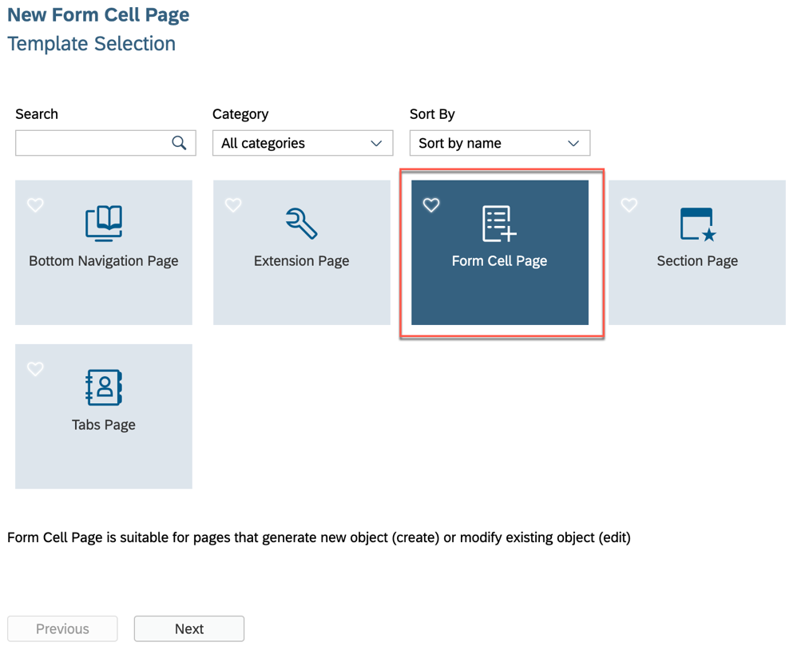

    >You can find more details about [Form Cell page](https://help.sap.com/doc/f53c64b93e5140918d676b927a3cd65b/Cloud/en-US/docs-en/guides/features/fiori-ui/mdk/formcell-page.html).

2. Enter the Page Name `Pet_Create` and click **Next** and the **Finish** on the Confirmation step.

    !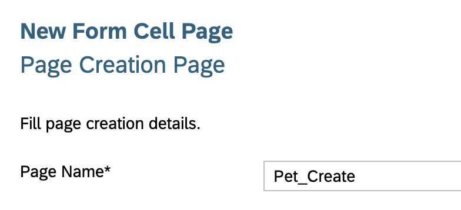

3. In the **Properties** pane, set the **Caption** to **Create Pet**.

    !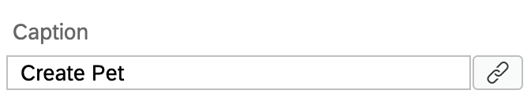

    Now, you will add the fields (like Category name, Pet name, Tag Name, Status) for creating a new pet record by the end-user.

4. In the Layout Editor, expand the **Control** | **Container Item** section.

    >You can find more details about [available controls in Form Cell page](https://help.sap.com/doc/69c2ce3e50454264acf9cafe6c6e442c/Latest/en-US/docs-en/reference/schemadoc/Page/FormCell/Container.schema.html).

5. Drag and drop a **Simple Property** onto the Page area.

    !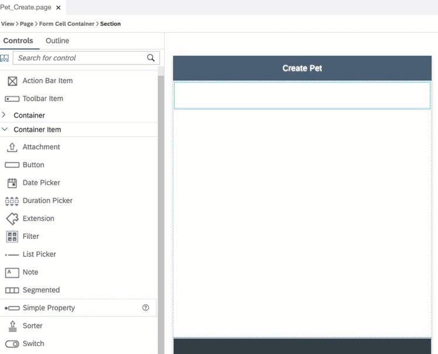

6. Drag and drop three additional Simple Property controls onto the page so you have four total controls.

    !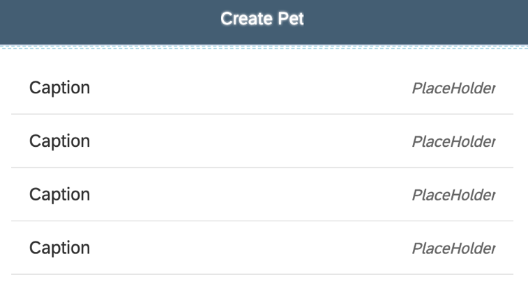

7. Select the first **Simple Property control** and provide the below information:

    | Property | Value |
    |----|----|
    | `Name`| `FCCreateCategory` |
    | `Caption` | `Category` |
    | `isEditable`| `true` |
    | `PlaceHolder`| `Enter Value` |

    !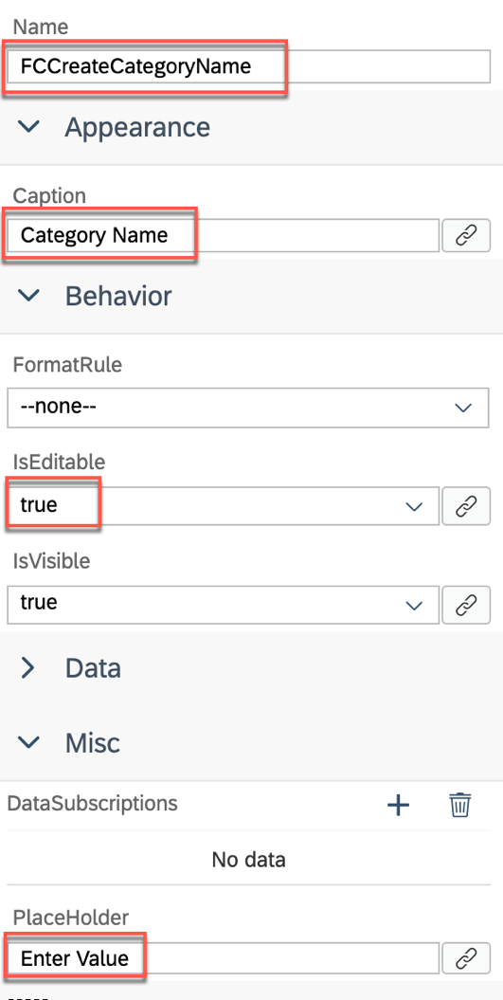

8. Select the second **Simple Property control** and provide the below information:

    | Property | Value |
    |----|----|
    | `Name`| `FCCreatePet` |
    | `Caption` | `Pet` |
    | `isEditable`| `true` |
    | `PlaceHolder`| `Enter Value` |

9. Select the third **Simple Property control** and provide the below information:

    | Property | Value |
    |----|----|
    | `Name`| `FCCreateTag` |
    | `Caption` | `Tag` |
    | `isEditable`| `true` |
    | `PlaceHolder`| `Enter Value` |

10. Select the last **Simple Property control** and provide the below information:

    | Property | Value |
    |----|----|
    | `Name`| `FCCreateStatus` |
    | `Caption` | `Status` |
    | `isEditable`| `true` |
    | `PlaceHolder`| `Enter Value` |

12. Save the changes to the `Pet_Create.page`.

[DONE]
[ACCORDION-END]


[ACCORDION-BEGIN [Step 12: ](Create rule to POST pet record)]

1. Switch back to SAP Business Application Studio. Right-click the **Rules** folder | **New** | **File**. Enter the file name `PostPet.js`, click **OK**.

    Copy and paste the following code.

    ```JavaScript
    export default function PostPet(context) {
    	let appId = context.evaluateTargetPath('#Application/#ClientData/#Property:MobileServiceAppId');
    	// POST "https://petstore.swagger.io/v2/pet" -H "accept: application/json" -H "Content-Type: application/json"
    	let destination = 'swagger.petstore';
    	let relativePath = 'pet';
      let requestPath = destination + '/' + relativePath;
      //Retrieve the individual input values from Pet_Create page and store them in local variables  
      let petCategory = context.evaluateTargetPath('#Page:Pet_Create/#Control:FCCreateCategory/#Value');
      let petName = context.evaluateTargetPath('#Page:Pet_Create/#Control:FCCreatePet/#Value');
      let petTag = context.evaluateTargetPath('#Page:Pet_Create/#Control:FCCreateTag/#Value');
      let petStatus = context.evaluateTargetPath('#Page:Pet_Create/#Control:FCCreateStatus/#Value');
    	let requestBodyJSON = {
    		"category": {
    			"name": petCategory
    		},
    		"name": petName,
    		"tags": [{
    			"name": petTag
    		}],
    		"status": petStatus
    	}
    	let params = {
    		'method': 'POST',
    		'header': {
    			'x-smp-appid': appId,
    			'Accept': 'application/json',
    			'Content-Type': 'application/json'
    		},
    		'body': JSON.stringify(requestBodyJSON)
    	};
    	return context.sendMobileServiceRequest(requestPath, params).then((response) => {
    		if (response.statusCode == 200) {
    			alert(response.content.toString());
    		} else {
    			alert('something went wrong');
    		}

    	});
    }
    ```

3. Save the changes.

[DONE]
[ACCORDION-END]

[ACCORDION-BEGIN [Step 13: ](Add cancel button on create pet page)]

Now, you will add a button on the Create Pet page and set it's `onPress` to `ClosePage.action`.

1. Drag and drop an **Action Bar Item** to the upper left corner of the action bar.

    !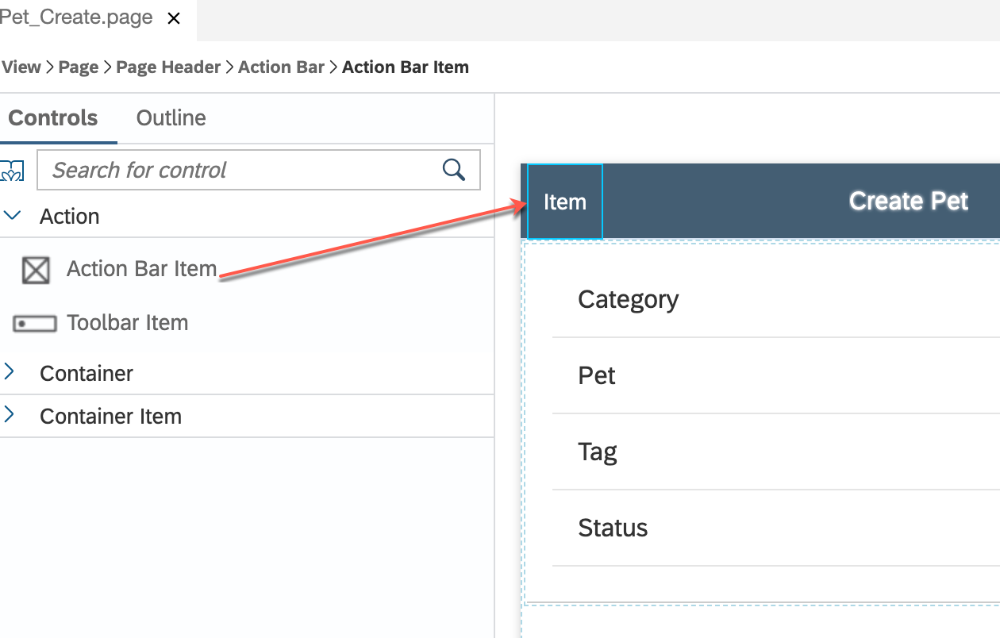

2. In the **Properties** pane, click the **link icon** to open the object browser for the **System Item** property.

3. Double click the **Cancel** type and click **OK**.

    !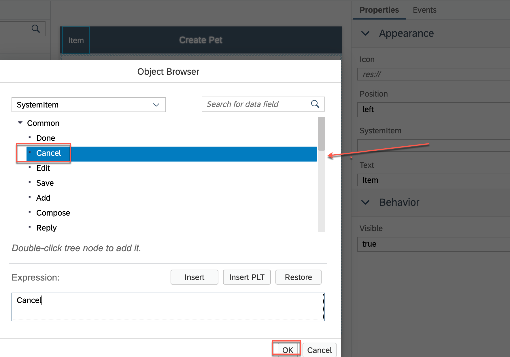

    >System Item are predefined system-supplied icon or text. Overwrites _Text_ and _Icon_ if specified.

4. Now, you will set the `onPress` event to `ClosePage.action`.

    In **Events** tab, click the **link icon** for the `OnPress` property to open the object browser.

    Double click the `ClosePage.action` and click **OK** to set it as the `OnPress` Action.

    !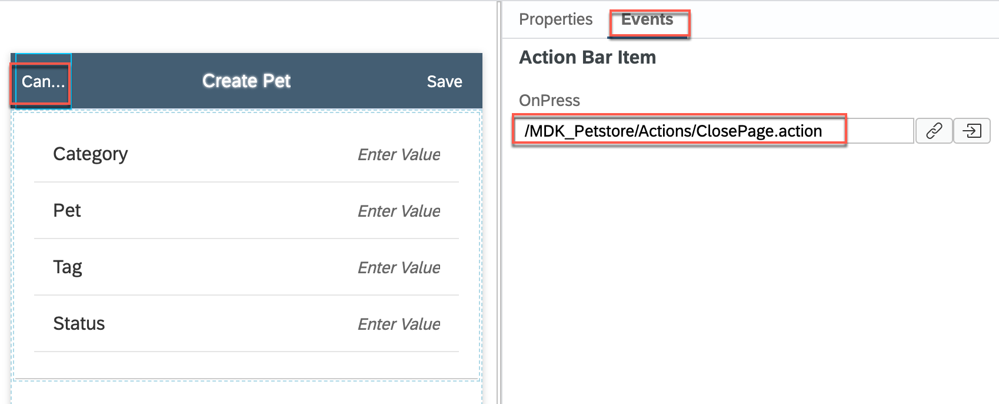

5. Save the changes to the `Pet_Create.page`.

[DONE]
[ACCORDION-END]

[ACCORDION-BEGIN [Step 14: ](Call the rule in MDK page)]

1. Open `Pet_Create.page`, drag & drop an action bar item to the page.

    !

2. In the **Properties** pane, click the **link icon** to open the object browser for the **System Item** property. Double-click the **Add** type and click **OK**.

    !

2. Navigate to **Events** tab and bind `PostPet.js` rule to `OnPress` event.

    !

3. Save the changes.

[DONE]
[ACCORDION-END]

[ACCORDION-BEGIN [Step 15: ](Create navigation action)]

Now, create a navigation action that will open the `Pet_Create.page` when executed.

1. Right-click the **Actions** folder | **MDK: New Action** | choose **MDK UI Actions** in **Category** | click **Navigation Action** | **Next**.

2. Provide the below information:

    | Property | Value |
    |----|----|
    | `Action Name`| `NavToPet_Create` |
    | `Page To Open` | select `Pet_Create.page` |
    | `ModalPage`| check this option |

    !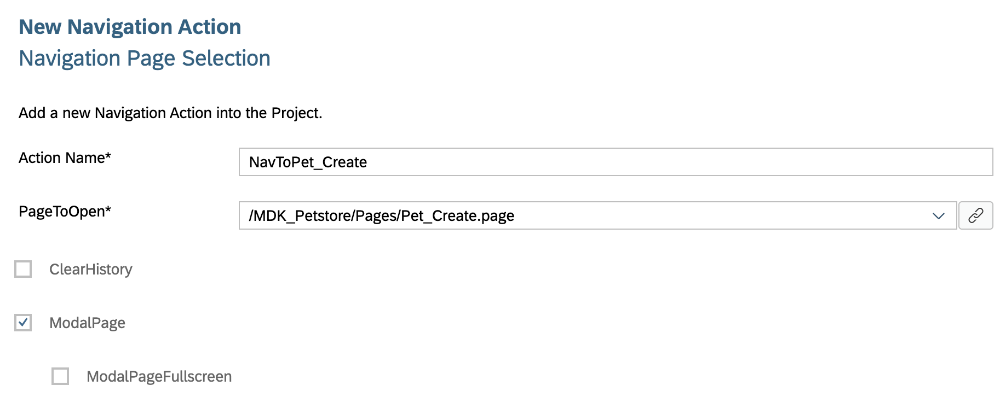

3. Click **Next** and then **Finish** on the confirmation step.

[DONE]
[ACCORDION-END]

[ACCORDION-BEGIN [Step 16: ](Add create button to pet list page)]

You will add a button to the `Main.page` called **Add**. You will link this button to the navigation action you just created. This event will open the `NavToPet_Create.action` when the Add button is pressed by the end-user.

1. In `Main.page`, drag and drop an **Action Bar Item** to the upper right of the action bar.

2. Click the **link icon** to open the object browser for the `SystemItem` property.

    Double click the **Add** type and click **OK**.

    !

3. In the Properties pane, click the **Events** tab, click the **link icon** for the `OnPress` property to open the object browser.

    Double click the `NavToPet_Create.action` action and click **OK** to set it as the `OnPress` Action.

4. Save the changes to the `Main.page`.

[DONE]
[ACCORDION-END]

[ACCORDION-BEGIN [Step 17: ](Redeploy the application)]

Right-click the `Application.app` file in the project explorer pane and select **MDK: Deploy**.

[DONE]
[ACCORDION-END]

[ACCORDION-BEGIN [Step 18: ](Update the MDK app with new metadata)]

[OPTION BEGIN [Android]]

1. Re-launch the app on your device, authenticate with passcode or Touch ID if asked. You will see a _Confirmation_ pop-up, tap **OK**.

2. Tap **+** icon on `Main.page` to navigate to Create Pet page.

    !

3.  Fill-up the details to create a new Pet record.

    !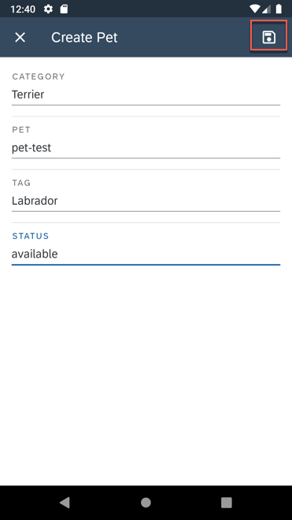

    A new record has been created and results are displaying in alert pop-up.

    !

[OPTION END]

[OPTION BEGIN [iOS]]

1. Re-launch the app on your device, authenticate with passcode or Touch ID if asked. You will see a _Confirmation_ pop-up, tap **OK**.

2. Tap **+** icon on `Main.page` to navigate to Create Pet page.

    !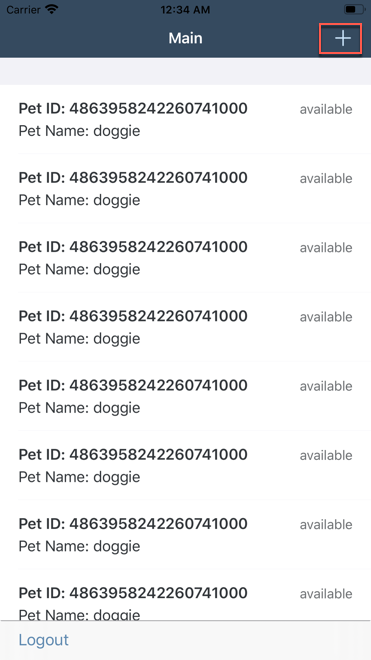

3.  Fill-up the details to create a new Pet record.

    !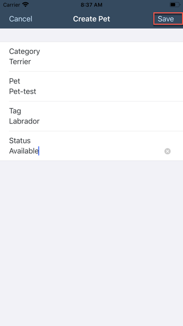

    A new record has been created and results are displaying in alert pop-up.

    !

[OPTION END]

Congratulations, you have successfully created a new record consuming REST API. Similarly, you can also modify and delete an existing record.

[VALIDATE_2]
[ACCORDION-END]


---
