## Prerequisites
- **Tutorial**: [Set Up Initial Configuration for an MDK App](cp-mobile-dev-kit-ms-setup)
- **Download the latest version of Mobile Development Kit SDK** either from [SAP Software Content Downloads](https://developers.sap.com/trials-downloads.html) or [SAP Marketplace](https://launchpad.support.sap.com/#/softwarecenter/template/products/%20_APP=00200682500000001943&_EVENT=DISPHIER&HEADER=Y&FUNCTIONBAR=N&EVENT=TREE&NE=NAVIGATE&ENR=73555000100900002601&V=MAINT&TA=ACTUAL&PAGE=SEARCH/MDK%20CLIENT%203.0) if you are a SAP Cloud Platform Mobile Services customer
- **Install** [Visual Code Studio on your local machine](https://code.visualstudio.com/download)

## Details
### You will learn
  - How to register and consume an Extension Control in MDK Metadata
  - How to write an extension via `NativeScript`
  - How to build a Mobile development kit client for iOS and Android
  - How to connect to SAP Cloud Platform Mobile application

---

To extend the functionality, or customize the look and feel, and behavior of your client app, you can create extension controls other than the already existing MDK built-in controls using below ways:

1.  Via `NativeScript` (TypeScript/JavaScript applicable for both Android and iOS)

2.  Via Swift class (iOS only)

In this tutorial, you will create an Slider extension via `NativeScript` (in TypeScript language) which will common for both device platforms.

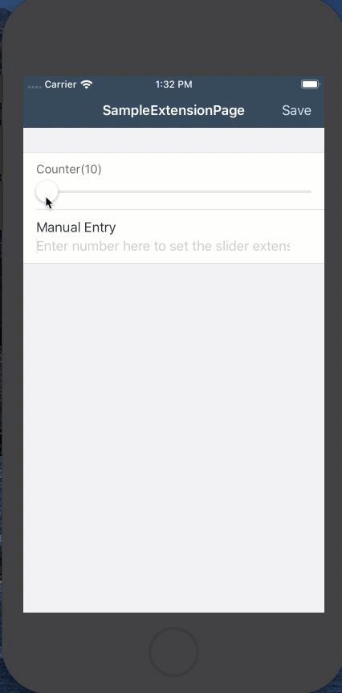

 In this tutorial, you need to carry out the following tasks in order to understand how to create a custom extension control using `NativeScript` and display it in a custom MDK client:

*  Create a new project in SAP Web IDE using **MDK Empty Project** template
*  Register a new MDK extension control
*  Add the registered control placeholder to the page in Web IDE
*  Write some logic to store the value of the control
*  Create a `mdkproject` folder
*  Build the client

[ACCORDION-BEGIN [Step 1: ](Set up the application foundation)]

Make sure that you have already created a new destination `mobileservices_cf` as per [previous tutorial](fiori-ios-hcpms-setup). This is required to connect SAP Web IDE to Mobile Services on Cloud Foundry environment.

This step includes creating the Mobile Development Kit project in the Editor.

Launch the SAP Web IDE and select the **MDK perspective** by clicking on the icon in the left panel.

Right click on Workspace folder and select **New** | **MDK Empty Project**.

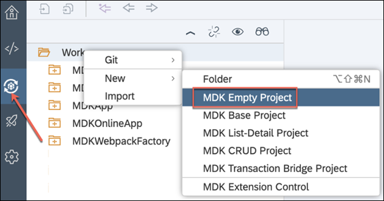

>More details on _MDK template_ is available in [help documentation](https://help.sap.com/viewer/977416d43cd74bdc958289038749100e/Latest/en-US/cfd84e66bde44d8da09f250f1b8ecee6.html).

Enter the **Project Name** as `mdk_extensions` and click **Next**.


Leave the default values in _Application Creation_ step as it is, click **Finish**.

After clicking Finish, the wizard will generate your MDK project `mdk_extensions` based on your selections.

[DONE]
[ACCORDION-END]

[ACCORDION-BEGIN [Step 2: ](Register an Extension Control)]

The extension control that you will be creating to extend the functionality of your app can be used as base controls by registering it using the MDK editor.

In the editor, right-click the project folder, and select **New** | **MDK Extension Control**.

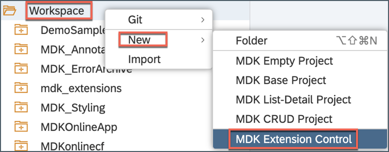

Provide the below information:

| Field | Value |
|----|----|
| `Control Name`| `mdk_slider` |
| `Module` | `MySliderModule` |
| `Control` | `MySliderExtension` |
| `Class` | `MySliderClass` |
| `Display` | leave it blank |

Here is the basic definition for properties you defined above:

**Module** : It is used to identify the extension control.
The path to the extension module under `<mdkproject>/extensions/`.

**Control**: The name of the file under the `<mdkproject>/extensions/<Module>/controls` that contains the extension class. If not specified, module name would be used as the value for this property.

**Class** : The name of the exported class in the module that is to be used for the extension.

**Display**: This property is used for the image to be displayed on the page editor to represent the extension control. Use the binding button to select an image from the `Workspace\MDKExtensionControls\Image` folder.

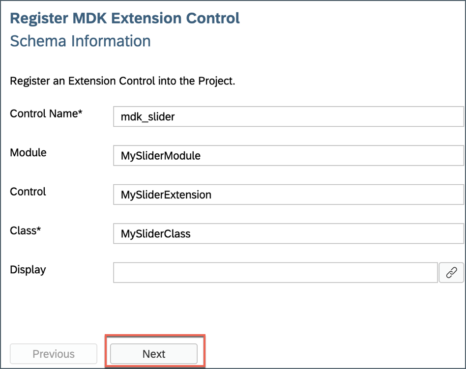

>In step 4, you will create a local `NativeScript` project referencing above properties.

In **Schema Information** window, click **Next**. For this tutorial, you will not need any schema.

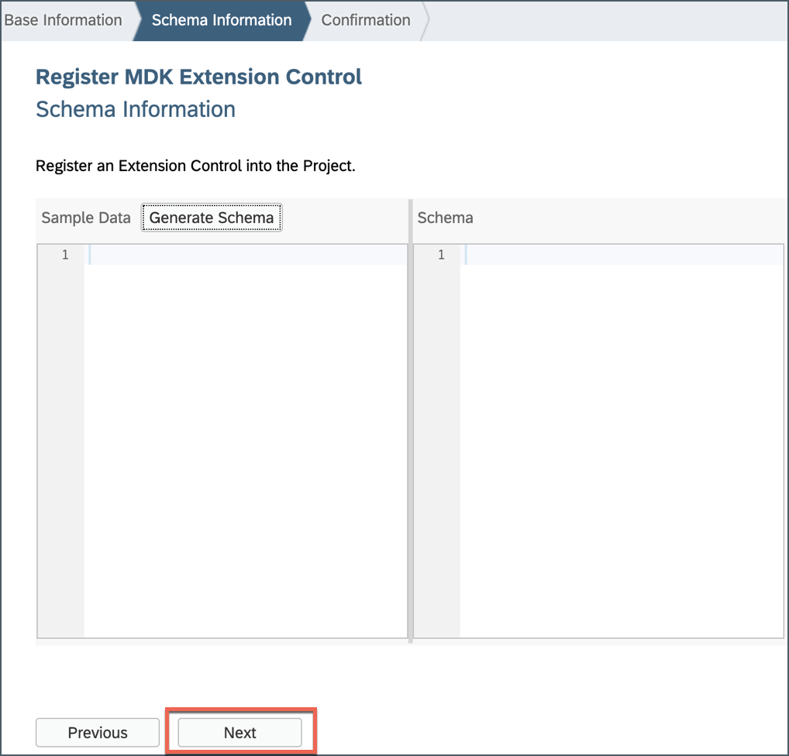

>Here you can define the properties of the extension control or import a property sample.

Click **Finish** to confirm.

The first time you create an extension control, a directory named `MDKExtensionControls` is automatically created under the MDK app project workspace. Also, a file named `ControlName.extension` (`mdk_slider.extension`) is generated based on the control name you provided.

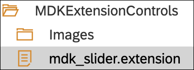

>You can find more details about registering extension control in [this](https://help.sap.com/viewer/977416d43cd74bdc958289038749100e/Latest/en-US/bcc1a204cb614cd99f75c6b2120c5f2e.html) guide.

[DONE]
[ACCORDION-END]

[ACCORDION-BEGIN [Step 3: ](Consume Registered Extension Control in MDK Metadata)]

In this step, you will add the registered control to the page.

First, create a new page of Form Cell type

Right-click on the **Pages** folder | **New MDK Page** | **Form Cell Page** | **Next**.


>A Form Cell Page is suitable for pages that generate new objects or modify existing objects. It includes a form cell container by default. You can add form sections, multiple containers or action controls to this page. Under each container section, you can add various container items.

>You can find more details about [Form Cell page](https://help.sap.com/viewer/977416d43cd74bdc958289038749100e/Latest/en-US/65c0ed1f448346cb89fa84992dc5df9c.html).

Enter the **Page Name** as `SampleExtensionPage` and click **Next** and the **Finish** on the Confirmation step.

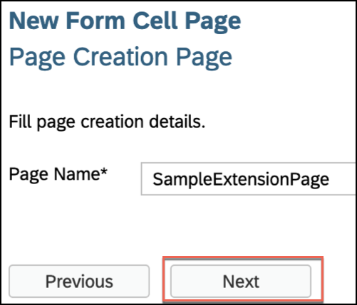

In MDK Page Editor, drag & drop the registered `mdk_slider` control on the page area.

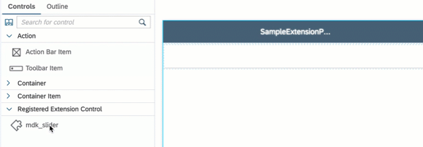

>You can find more details about the properties of a **Registered Extension Control** in [this](https://help.sap.com/viewer/977416d43cd74bdc958289038749100e/Latest/en-US/4d5a2f75239b48789d7a9a10c0756011.html) guide.

Next, you will set the height and some minimum & maximum counter value for the control.

In the **Properties** section, scroll down to the **Dimension** section and set the **Height** to 72.

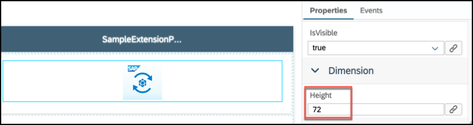

Scroll down to the **Extension Properties**, switch to **Text** mode and paste the following information:

```JSON
{
	"Title": "Counter",
	"MinValue": 10,
	"MaxValue": 200
}
```

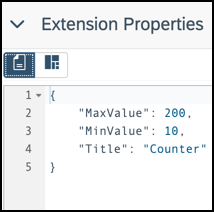

Next, you will fetch the value of the Slider control and would display this value in a message.

First, rename the default name for the control. Right-click on `SampleExtensionPage.page`, open it in **Code Editor**.

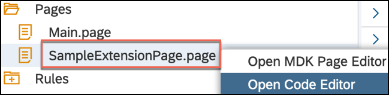

Rename the value for `_Name` property to `MyExtensionControlName`.

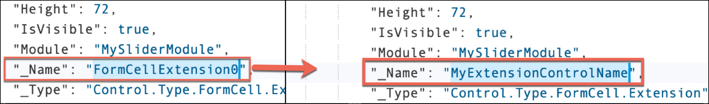

>Renaming the name property is not a mandatory step, it is done just to have a meaningful name for the control.

Next, create a new Message action.

Right-click on the **Actions** folder | **New MDK Action** | choose **MDK Message Actions** in **Category** | click **Message Action** | **Next**.


Provide the below information:

| Property | Value |
|----|----|
| `Action Name`| `ShowMessage` |
| `Type` | select `Message` |
| `Message` | `#Control:MyExtensionControlName/#Value` |
| `Title` | `Value of the Slider is:` |
| `OKCaption` | `OK` |
| `OnOK` | `--None--` |
| `CancelCaption` | leave it blank |
| `OnCancel` | `--None--` |

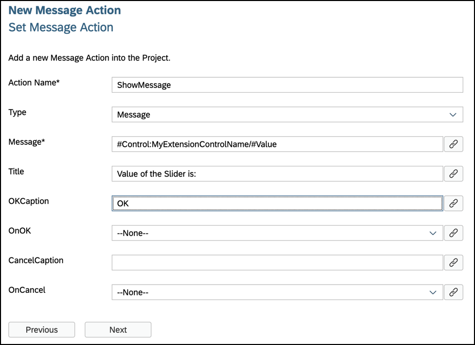

>Here `MyExtensionControlName` is the name of the control that you renamed in code editor.

Click **Next** and then **Finish** on the confirmation step.

Next, you will add an item on action bar in `MySampleExtensionPage.page` and set `ShowMessage.action` on its `onPress` event.

In `MySampleExtensionPage.page`, **drag and drop** an **Action Bar Item** to the upper right corner of the action bar.


Click the **link** icon to open the object browser for the **System Item** property.

Double click on the **Save** type and click **OK**.


In the **Properties** pane | **Events** tab, click the **link** icon for the `OnPress` property to open the object browser, bind it to `ShowMessage.action`.

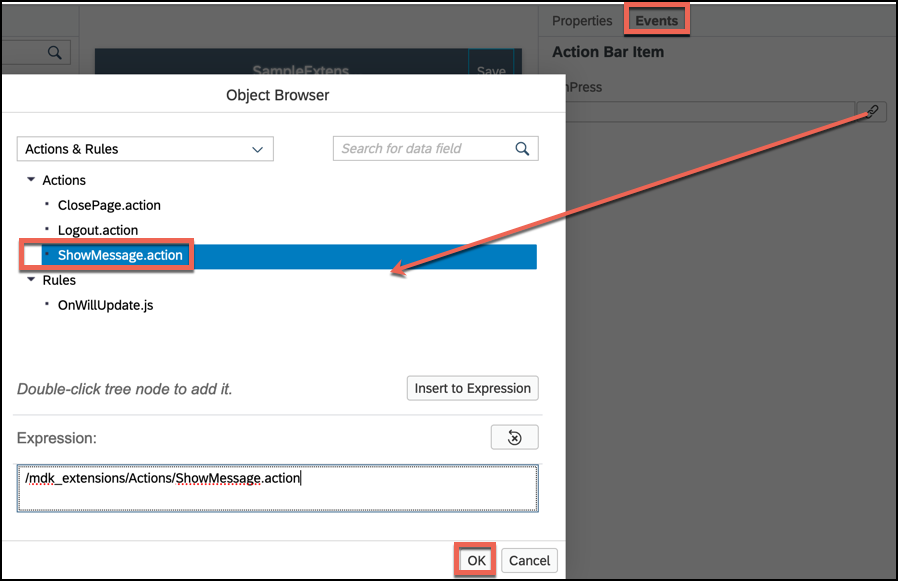

Save the changes to the `SampleExtensionPage.page`.

You can also add an input field where you can provide a manual entry for the slider value and the counter will adapt accordingly.

For this, first you will write a business logic to set the extension value and then bind it to the input field.

Right click on the **Rules** folder | **New** | **File**.


Enter the file name `SetExtensionValue.js`, click **OK**.

Copy and paste the following code.

```JavaScript
export default function SetExtensionValue(controlProxy) {
  console.log("In SetExtensionValue");
  let srcValue = controlProxy.getValue();
  let targetCtrl = controlProxy.evaluateTargetPath("#Page:SampleExtensionPage/#Control:MyExtensionControlName");
  targetCtrl.setValue(srcValue);
}
```


Save the changes.

In `MySampleExtensionPage.page`, drag and drop the **Simple Property** item control below the slider control.


Provide the following information:

| Property | Value |
|----|----|
| `Caption`| `Manual Entry` |
| `isEditable`| `true` |
| `placeholder` | `Enter number here to set the slider extension's value` |


Navigate to **Events** tab, click the **link** icon for the `OnPress` property to open the object browser, bind it to `SetExtensionValue.js`.


Save the changes.

[DONE]
[ACCORDION-END]


[ACCORDION-BEGIN [Step 4: ](Set the first page as the Extension page)]

In the template generated project, there is already a page called `Main.page` which is also the page that opens after successful on-boarding. For this tutorial, we will change the default behavior of the app launch.

Double-click on `Application.app` file, select the `MySampleExtensionPage.page` for the **Main Page** field.

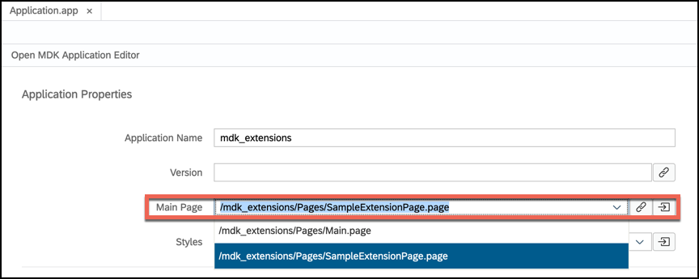

Save the changes.

[DONE]
[ACCORDION-END]

[ACCORDION-BEGIN [Step 5: ](Deploy and activate the application)]

So far, you have learned how to build an MDK application in the SAP Web IDE editor. Now, we deploy this application definition to Mobile Services.

Right click on the `mdk_extensions` MDK Application in the project explorer pane and select **MDK Deploy and Activate**.

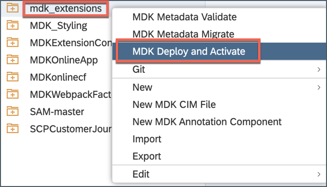

Let the default configuration as it is and click **Next**.

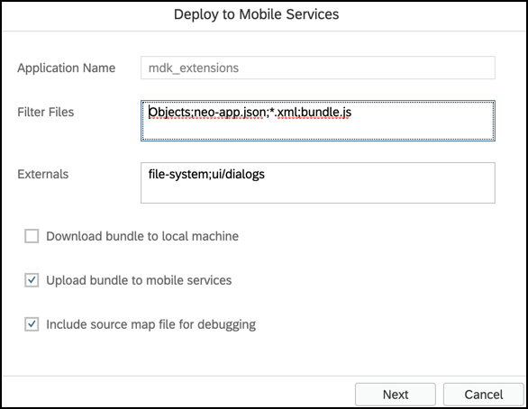

>_Filter Files_ will be filtered and ignored in web packing process.

>_Externals_ are the list of NPM modules that are part of the MDK Client application and should not be validated in the bundle.

Click the drop down for Destination Name and select the `mobileservices_cf` destination, you will find list of existing application IDs, select the one you have chosen while creating the project.


>By default, automatically deploy option is selected, In other words, the application is automatically deployed from Mobile Services to your MDK client.

Click **Next** to finish the deployment from SAP Web IDE.

You should see **Application deployed successfully** message in console log.


[DONE]
[ACCORDION-END]

[ACCORDION-BEGIN [Step 6: ](Implement extension in your .mdkproject folder)]

>Make sure that you have already installed MDK SDK and created an `.mdkproject` folder as per steps 1, 2 & 3 in [this](cp-mobile-dev-kit-build-client) tutorial.

Open `demosampleapp.mdkproject` folder in Visual Studio Code editor.

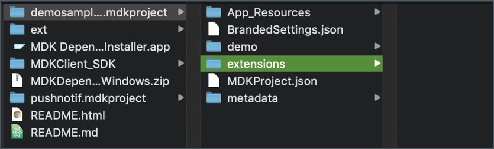

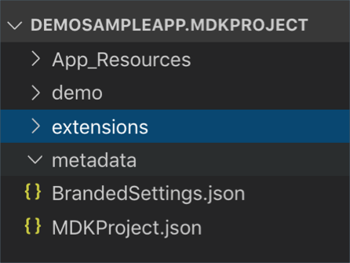

In **extensions** folder, create below files & folders as per below.

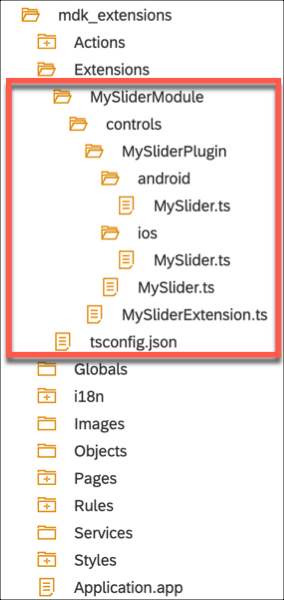


      MySliderModule
        controls
          MySliderExtension.ts
        plugin
          MyNativescriptPlugin
            MySliderPlugin
              MySlider.android.ts
              MySlider.ios.ts
              MySlider.ts
           index.ts
           package.json


In `MySliderExtension.ts` file, copy and paste the following code.

```JavaScript / TypeScript
import app = require('tns-core-modules/application/application');
import { BaseObservable } from '../../../observables/BaseObservable';
import { BaseControl } from '../../../controls/BaseControl';
import { MySlider } from 'my-nativescript-plugin'; //Import MySlider NS Plugin

export class MySliderClass extends BaseControl {
  private _slider: MySlider;
  private _minVal: number = 0;
  private _maxVal: number = 10000;

  public initialize(props) {
    super.initialize(props);

    //Create the Slider plugin control
    this.createSlider();
    //Assign the slider's native view as the main view of this extension
    this.setView(this._slider.getView());
  }

  private createSlider() {
    //Create MySlider and initialize its native view
    this._slider = new MySlider(this.androidContext());
    this._slider.initNativeView();

    this._slider.setMinValue(this._minVal);
    this._slider.setMaxValue(this._maxVal);

    //Set the slider's properties if "ExtensionProperties" is defined
    let extProps = this.definition().data.ExtensionProperties;
    if (extProps) {
      //In here we will use ValueResolver to resolve binding/rules for the properties
      // This will allow the app to use binding/rules to set the properties' value

      // Resolve title's value
      this.valueResolver().resolveValue(extProps.Title, this.context, true).then(function(title){
        this._slider.setText(title);
      }.bind(this));

      // Resolve min value
      this.valueResolver().resolveValue(extProps.MinValue, this.context, true).then(function(minVal){
        if (minVal !== null && minVal !== undefined) {
          this._minVal = minVal;
          this._slider.setMinValue(this._minVal);
        }
      }.bind(this));

      // Resolve max value
      this.valueResolver().resolveValue(extProps.MaxValue, this.context, true).then(function(maxVal){
        if (maxVal !== null && maxVal !== undefined) {
          this._maxVal = maxVal;
          this._slider.setMaxValue(this._maxVal);
        }
      }.bind(this));

      // Resolve value
      this.valueResolver().resolveValue(extProps.Value, this.context, true).then(function(value){
        this.setValue(value, false, false);
      }.bind(this));
    }

    //Set up listener for MySlider's OnSliderValueChanged event that will be triggered when user let of the slider's handle
    // It's eventData object contain a property 'value' that will contain the value of the slider
    this._slider.on("OnSliderValueChanged", function(eventData){
      //We will call the setValue
      this.setValue(eventData.value, true, false);
    }.bind(this));
  }

  // Override
  protected createObservable() {
    let extProps = this.definition().data.ExtensionProperties;
    //Pass ExtensionProperties.OnValueChange to BaseControl's OnValueChange
    if (extProps && extProps.OnValueChange) {
      this.definition().data.OnValueChange = extProps.OnValueChange;
    }
    return super.createObservable();
  }

  public setValue(value: any, notify: boolean, isTextValue?: boolean): Promise<any> {
    //Check the value
    if (value != null && value != undefined && !isNaN(value)) {
      if (typeof value == "string" && value.trim() == "") {
        return Promise.reject("Error: Value is not a number");
      }
      let val = Number.parseInt(value);
      //Don't let value go lower than permitted minimum or higher than permitted maximum
      val = val < this._minVal ? this._minVal : val;
      val = val > this._maxVal ? this._maxVal : val;

      if (this._slider) {
        //Set the slider's value
        this._slider.setValue(val);
      }
      //Store the value. The observable will trigger "OnValueChange" to the MDK app
      // MDK app can register to this event in the metadata with property "OnValueChange"
      return this.observable().setValue(val, notify, isTextValue);
    } else if (isNaN(value)) {
      return Promise.reject("Error: Value is not a number");
    }
    return Promise.resolve();
  }

  public viewIsNative() {
    return true;
  }
}
```

Save the `MySliderExtension.ts` file.

In `MySlider.android.ts` file, copy and paste the following code.

```JavaScript / TypeScript
import { Observable } from "tns-core-modules/data/observable";
import { View } from "tns-core-modules/ui/core/view";
import { layout } from "tns-core-modules/ui/core/view";
import { device as Device } from 'tns-core-modules/platform';

/**
 * IMPLEMENT THE ANDROID VERSION OF YOUR PLUGIN HERE
 * In this sample we have 2 controls a label and a seekbar (slider)
 * We extends this control with Observable class so that we can accept listeners
 *  and notify them when UI interaction is triggered
 */
declare var com: any;
declare var android: any;
function getPadding() {
  // Return left & right padding in dp
  // For tablet we want 24dp, for other type we use 16dp
  return Device.deviceType === 'Tablet' ? 24 : 16;
}

export class MySlider extends View {
  private _androidcontext;
  private _label;
  private _labelText = "";
  private _seekbar;
  private _layout;
  private _value = 0;

  private updateText() {
    this._label.setText(this._labelText + "(" + this._value + ")")
  }

  public constructor(context: any) {
    super();
    this._androidcontext = context;
    this.createNativeView();
  }

  /**
   * Creates new native controls.
   */
  public createNativeView(): Object {
    //Create an Android label
    this._label = new android.widget.TextView(this._androidcontext);
    const labelBottomPaddingInPx = layout.round(layout.toDevicePixels(8)); // For top & bottom padding, always 16dp
    this._label.setPadding(0, 0, 0, labelBottomPaddingInPx);
    this._label.setLayoutParams(new android.view.ViewGroup.LayoutParams(-1,-2));

    //Create an Android seekbar
    this._seekbar = new android.widget.SeekBar(this._androidcontext);
    this._seekbar.setLayoutParams(new android.view.ViewGroup.LayoutParams(-1,-2));

    //Create a LinearLayout container to contain the label and seekbar
    this._layout = new android.widget.LinearLayout(this._androidcontext);
    this._layout.setOrientation(android.widget.LinearLayout.VERTICAL);
    this._layout.setLayoutParams(new android.view.ViewGroup.LayoutParams(-1,-1));

    const hortPaddingInPx = layout.round(layout.toDevicePixels(getPadding()));
    const vertPaddingInPx = layout.round(layout.toDevicePixels(16)); // For top & bottom padding, always 16dp
    this._layout.setPadding(hortPaddingInPx, vertPaddingInPx, hortPaddingInPx, vertPaddingInPx);
    this._layout.addView(this._label);
    this._layout.addView(this._seekbar);
    this.setNativeView(this._layout);
    return this._layout;
  }

  /**
   * Initializes properties/listeners of the native view.
   */
  initNativeView(): void {
      // Attach the owner to nativeView.
      // When nativeView is tapped we get the owning JS object through this field.
      (<any>this._seekbar).owner = this;
      (<any>this._layout).owner = this;
      super.initNativeView();

      //Attach a listener to be notified whenever the native Seekbar is changed so that we can notify the MDK Extension
      this._seekbar.setOnSeekBarChangeListener(new android.widget.SeekBar.OnSeekBarChangeListener({
        onStartTrackingTouch(seekBar: any){
          // We do not have any use for this event, so do nothing here
        },
        //This handler function will be called when user let go of the handle
        // This is where we will trigger an event called "OnSliderValueChanged" to the MDK Extension Class
        onStopTrackingTouch(seekBar: any){
          var eventData = {
            eventName: "OnSliderValueChanged",
            object: seekBar.owner,
            value: seekBar.owner._value
          };
          seekBar.owner.notify(eventData);
        },
        //This handler function will be called whenever the slider's value is changed
        // i.e. whenever user drag the slider's handle
        onProgressChanged(seekBar: any, progress: number, fromUser: boolean) {
          seekBar.owner._value = progress;
          seekBar.owner.updateText();
        }
      }));
  }

  /**
   * Clean up references to the native view and resets nativeView to its original state.
   * If you have changed nativeView in some other way except through setNative callbacks
   * you have a chance here to revert it back to its original state
   * so that it could be reused later.
   */
  disposeNativeView(): void {
      // Remove reference from native view to this instance.
      (<any>this._seekbar).owner = null;
      (<any>this._layout).owner = null;

      // If you want to recycle nativeView and have modified the nativeView
      // without using Property or CssProperty (e.g. outside our property system - 'setNative' callbacks)
      // you have to reset it to its initial state here.
  }

  //Must return the native view of the control for MDK FormCell and Section Extension
  public getView(): any {
    return this._layout;
  }

  public setText(newText: string): void {
    if (newText != null && newText != undefined) {
      this._labelText = newText;
      this._label.setText(newText);
    }
  }

  public setValue(newVal: number): void {
    if (newVal != null && newVal != undefined) {
      this._value = newVal;
      this.updateText();
      this._seekbar.setProgress(newVal);
    }
  }

  public setMinValue(newMin: number): void {
    if (newMin != null && newMin != undefined) {
      this._seekbar.setMin(newMin);
    }
  }

  public setMaxValue(newMax: number): void {
    if (newMax != null && newMax != undefined) {
      this._seekbar.setMax(newMax);
    }
  }
}
```

Save the `MySlider.android.ts` file.

In `MySlider.ios.ts` file, copy and paste the following code.

```JavaScript / TypeScript
import { View } from "tns-core-modules/ui/core/view";

/**
 * IMPLEMENT THE IOS VERSION OF YOUR PLUGIN HERE
 */

// This is a class that handles the native event callbacks
class SliderHandler extends NSObject {

  //This handler function will be called whenever the slider's value is changed
  // i.e. whenever user drag the slider's handle
  public valueChanged(nativeSlider: UISlider, nativeEvent: _UIEvent) {
    nativeSlider.value = Math.round(nativeSlider.value);
    const owner: MySlider = (<any>nativeSlider).owner;
    if (owner) {
        owner.setValue(nativeSlider.value);
    }
  }

  //This handler function will be called when user let go of the handle
  // This is where we will trigger an event called "OnSliderValueChanged" to the MDK Extension Class
  public afterValueChanged(nativeSlider: UISlider, nativeEvent: _UIEvent) {
    nativeSlider.value = Math.round(nativeSlider.value);
    const owner: MySlider = (<any>nativeSlider).owner;
    if (owner) {
        owner.setValue(nativeSlider.value);
        var eventData = {
          eventName: "OnSliderValueChanged",
          object: owner,
          value: nativeSlider.value
        };
        owner.notify(eventData);
    }
  }

  public static ObjCExposedMethods = {
      "valueChanged": { returns: interop.types.void, params: [interop.types.id, interop.types.id] },
      "afterValueChanged": { returns: interop.types.void, params: [interop.types.id, interop.types.id] }
  };
}

const handler = SliderHandler.new();

 export class MySlider extends View {
  private _label;
  private _labelText = "";
  private _slider;
  private _layout;
  private _value = 0;

  private updateText() {
    this._label.text = this._labelText + "(" + this._value + ")";
  }

  public constructor(context: any) {
    super();
    this.createNativeView();
  }

  /**
   * Creates new native controls.
   */
  public createNativeView(): Object {
    //Create the Stack view - this is the main view of this extension
    this._layout = UIStackView.new();
    //Configuring the paddings around the stack view
    this._layout.autoresizingMask = UIViewAutoresizing.FlexibleWidth;
    this._layout.layoutMarginsRelativeArrangement = true;
    let inset = new NSDirectionalEdgeInsets();
    inset.top = 8; inset.leading = 16; inset.bottom = 8; inset.trailing = 16;
    this._layout.directionalLayoutMargins = inset;
    // Set the layout stacking to be vertical
    this._layout.axis =  UILayoutConstraintAxis.Vertical;

    //Create the label view
    this._label = UILabel.new();
    this._label.font = this._label.font.fontWithSize(15); //Set font size
    this._label.textColor = UIColor.colorWithRedGreenBlueAlpha(106/255,109/255,112/255,1.0); //Set text color
    this._layout.setCustomSpacingAfterView(4, this._label); //Set the bottom margin of label

    //Create the slider control
    this._slider = UISlider.new();

    //Assign a handler for whenever value changed i.e. when user is dragging the slider handle
    this._slider.addTargetActionForControlEvents(handler, "valueChanged", UIControlEvents.ValueChanged);
    //Assign a handler for when user let go of the handle
    this._slider.addTargetActionForControlEvents(handler, "afterValueChanged", UIControlEvents.TouchUpInside | UIControlEvents.TouchUpOutside);

    //Add the label and slider to the stack view
    this._layout.addArrangedSubview(this._label);
    this._layout.addArrangedSubview(this._slider);

    //store the native view
    this.setNativeView(this._layout);

    //return the stack view
    return this._layout;
  }
  /**
   * Initializes properties/listeners of the native view.
   */
  initNativeView(): void {
    // Attach the owner to nativeViews.
    // When nativeViews are tapped we get the owning JS object through this field.
    (<any>this._slider).owner = this;
    (<any>this._layout).owner = this;
    super.initNativeView();
  }

  /**
   * Clean up references to the native view and resets nativeView to its original state.
   * If you have changed nativeView in some other way except through setNative callbacks
   * you have a chance here to revert it back to its original state
   * so that it could be reused later.
   */
  disposeNativeView(): void {
      // Remove reference from native view to this instance.
      (<any>this._slider).owner = null;
      (<any>this._layout).owner = null;

      // If you want to recycle nativeView and have modified the nativeView
      // without using Property or CssProperty (e.g. outside our property system - 'setNative' callbacks)
      // you have to reset it to its initial state here.
  }

  //Must return the native view of the control for MDK FormCell and Section Extension
  public getView(): any {
    return this._layout;
  }

  public setText(newText: string): void {
    if (newText != null && newText != undefined) {
      this._labelText = newText;
      this._label.text = newText;
    }
  }

  public setValue(newVal: number): void {
    if (newVal != null && newVal != undefined) {
      this._value = newVal;
      this.updateText();
      this._slider.value = newVal;
    }
  }

  public setMinValue(newMin: number): void {
    if (newMin != null && newMin != undefined) {
      this._slider.minimumValue = newMin;
    }
  }

  public setMaxValue(newMax: number): void {
    if (newMax != null && newMax != undefined) {
      this._slider.maximumValue = newMax;
    }
  }
}
```

Save the `MySlider.ios.ts` file.

In `MySlider.ts` file, copy and paste the following code.

```JavaScript / TypeScript
import { View } from "tns-core-modules/ui/core/view";

export class MySlider extends View {
  public constructor(context: any) {
    super();
  }
  public getView(): any {
    return null;
  }
  public setText(newText: string): void {  
  }
  public setValue(newVal: number): void {
  }
  public setMinValue(newMin: number): void {
  }  
  public setMaxValue(newMax: number): void {    
  }
}
```

Save the `MySlider.ts` file.

In `index.ts` file, copy and paste the following code.

```JavaScript / TypeScript
export { MySlider } from './MySliderPlugin/MySlider'
```

Save the `index.ts` file.

In `package.json` file, copy and paste the following code.

```JSON
{
  "name": "my-nativescript-plugin",
  "version": "1.0.0",
  "description": "SAP Mobile Development Kit (MDK) Client Extensions Example. ",
  "main": "index.js",
  "nativescript": {
    "platforms": {
      "ios": "5.2.1",
      "android": "5.2.1"
    },
    "tns-ios": {
      "version": "5.2.1"
    },
    "tns-android": {
      "version": "5.2.1"
    }
  },
  "scripts": {
    "test": "test"
  },
  "author": "SAP"
}
```

Save the `package.json` file.

>`tns-android.version`: specifies the version of the Android runtime. If the property is missing, the latest version of the runtime will be added on the first run or build for Android.

>`tns-ios.version`:specifies the version of the iOS runtime. If the property is missing, the latest version of the runtime will be added on the first run or build for iOS.

[VALIDATE_1]
[ACCORDION-END]

[ACCORDION-BEGIN [Step 5: ](Create the MDK Client)]

>Make sure you are choosing the right development platform tab above.

[OPTION BEGIN [Mac]]

You can create a client by running `./create-client.command` and providing the path to a valid `.mdkproject` directory.

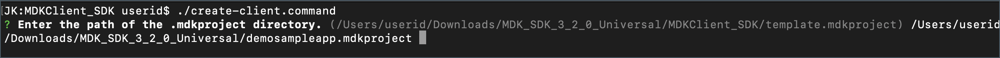

You will be asked whether you would like to build for iOS or Android or All?


>**All** option was chosen in this tutorial as you will learn how to create the MDK client for iOS and Android.

Then, you will be asked whether you would like to build for device or simulator?

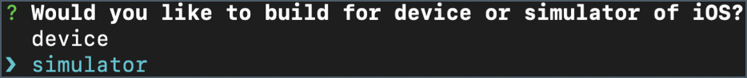

>**simulator** option was chosen for this tutorial.

Once the `create-client.command` script executed successfully, you will see **Application ready** message in terminal console.


You will also find your app created under the `MDKClient_SDK` folder.

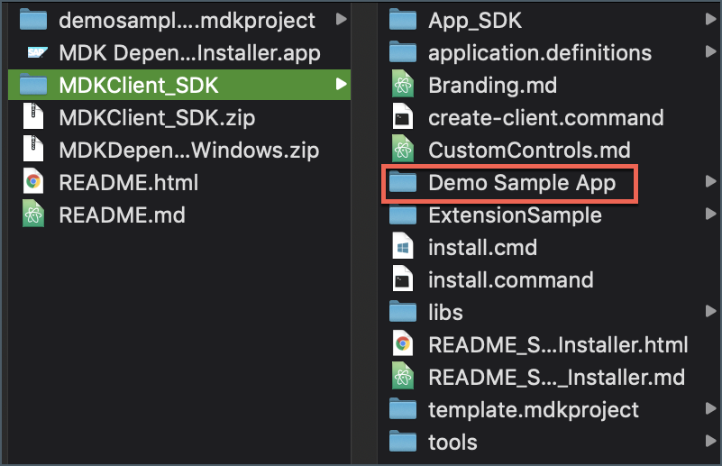

[OPTION END]

[OPTION BEGIN [Windows]]

You can create a client by running `create-client.cmd` and providing the path to a valid `.mdkproject` directory.


Once the `create-client.cmd` script executed successfully, you will see **Application ready** message in terminal console.


 You will also find your app created under the `MDKClient_SDK` folder.


[OPTION END]

>This name of this folder is based on the `<App Name>` provided in the `MDKProject.json file` and this is the `NativeScript` project.

[DONE]
[ACCORDION-END]

[ACCORDION-BEGIN [Step 5: ](Run the MDK Client)]

>Make sure you are choosing the right device platform tab above.

[OPTION BEGIN [Android]]

In this step, you will run the app on an android emulator.

Navigate to **Demo Sample App** folder and execute `tns run android --emulator` command.

>Make sure that you have created a virtual device in Android Studio prior to running this command.


>To run the MDK client on Android device, first run `tns device android` command to print a list of attached devices. Make sure **Developer option** and **USB debugging** option is enabled in android device. Copy the **Device Identifier** value for your device. In terminal or command line window, navigate to the app name folder **Demo Sample App** (in `MDClient_SDK` path) and use `tns run android --device <device identifier>` command to run the MDK client on android device.

Once, above command gets successfully executed, you will see new MDK client up and running in Android emulator.


Here, you will notice that **app name**, **detailed label text** and **signing button text** have been updated as per changes done in step 3.

Tap **START** to connect MDK client to SAP Cloud Platform.

Enter Email address and password to login to SAP Cloud Platform and tap **Log On** to authenticate.


Tap **AGREE** on `End User License Agreement`.


Choose a passcode with at least 8 characters for unlocking the app and tap **NEXT**.


Confirm the passcode and tap **DONE**.


Optionally, you can enable fingerprint to get faster access to the app data.

The MDK client receives deployed metadata definitions as a bundle. Click **OK** to confirm.

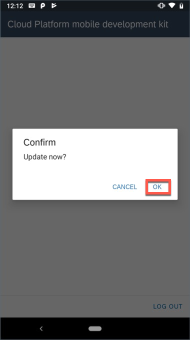

Here you see Slider control.

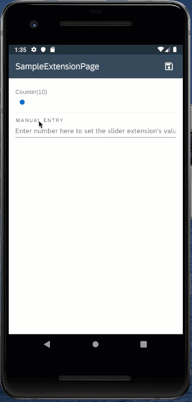

>You can always interrupt running process in terminal window by pressing `control + C`.

>To build an **`APK` for an Android device**, use `tns build android --release`. More information about archiving can be found in `NativeScript` documentation [here](https://docs.nativescript.org/tooling/docs-cli/project/testing/build-android).

[OPTION END]

[OPTION BEGIN [iOS]]

In this step, you will run the app on an iOS simulator.

Navigate to **Demo Sample App** folder and execute `tns run ios --emulator` command.

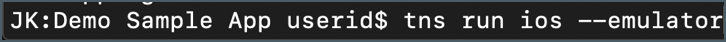

>To run the MDK client on iOS device, first run `tns device ios` command to print a list of attached devices. Copy the **Device Identifier** value for your device. In terminal window, navigate to the app name folder **Demo Sample App** (in `MDClient_SDK` path) and use `tns run ios --device <device identifier>` command to run the MDK client on iOS device.

>You can also run the app in Xcode. Open the project in Xcode with the command `open platforms/ios/<app name>.xcworkspace`, or open the workspace using the `File -> Open...` dialog in Xcode. Configure the application's code signing settings, then run the application for the target device.

Once, above command gets successfully executed, you will see new MDK client up and running in your device.


Here, you will notice that **app name**, **detailed label text** and **signing button text** have been updated as per changes done in step 3.

Tap **Start** to connect MDK client to SAP Cloud Platform.

Enter Email address and password to login to SAP Cloud Platform and tap **Log On** to authenticate.


Tap **Agree** on `End User License Agreement`.


Choose a passcode with at least 8 characters for unlocking the app and tap **Next**.

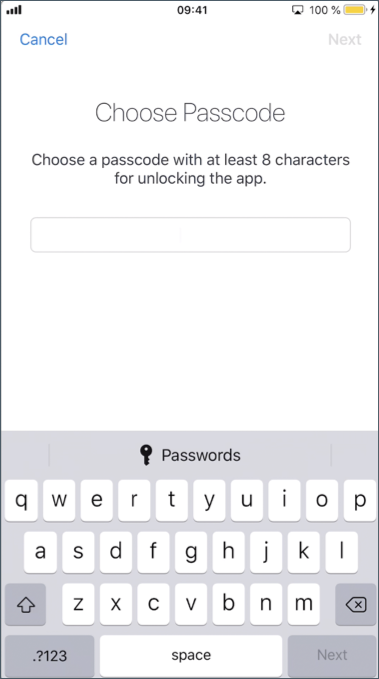

Confirm the passcode and tap **Done**.


Optionally, you can enable Touch ID to get faster access to the app data, tap **Enable**.


The MDK client receives deployed metadata definitions as a bundle. Click **OK** to confirm.


Here you see Slider control.


>You can always interrupt running process in terminal window by pressing `control + C`.

>To build an **IPA for an iOS device**, use `tns build ios --for-device --release`. This can also be accomplished in Xcode by opening the workspace and selecting the Archive option. More information about archiving can be found in Apple's documentation [here](https://developer.apple.com/library/content/documentation/IDEs/Conceptual/AppDistributionGuide/UploadingYourApptoiTunesConnect/UploadingYourApptoiTunesConnect.html).

[OPTION END]

[DONE]
[ACCORDION-END]

---
