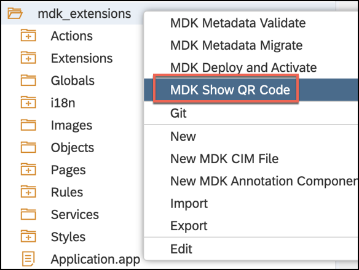
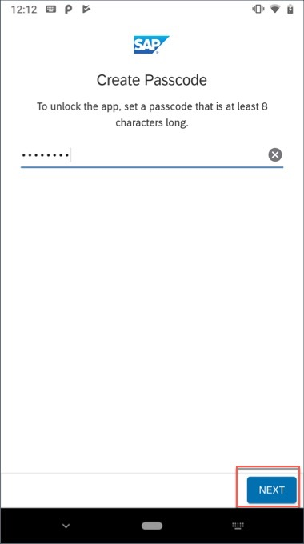
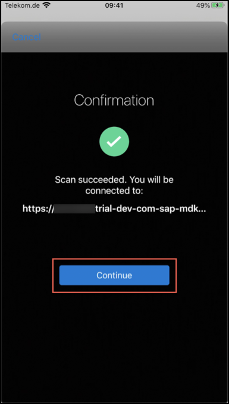
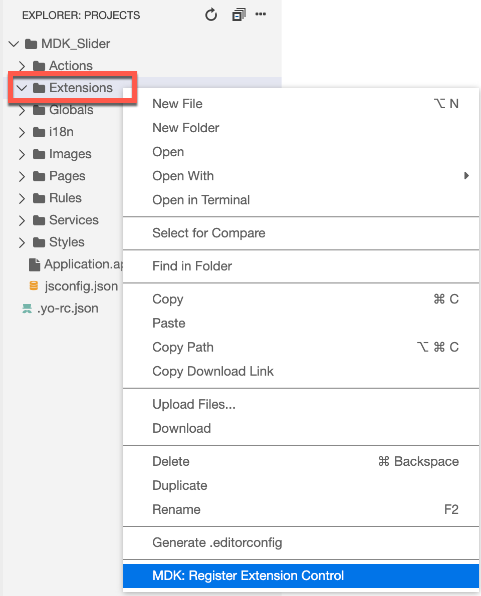

## Prerequisites
- **Tutorial**: [Set Up for the Mobile Development Kit (MDK)](group.mobile-dev-kit-setup)
- **Download and install** **SAP Mobile Services Client** on your [iOS](https://apps.apple.com/us/app/sap-mobile-services-client/id1413653544) or [Android](https://play.google.com/store/apps/details?id=com.sap.mobileservices.client) device
- **Download and install** [Barcode Scanner](https://play.google.com/store/apps/details?id=com.google.zxing.client.android&hl=en) (required only for Android device)

## Details
### You will learn
  - How to register and consume an Extension control in MDK Metadata
  - How to write an extension via NativeScript
  - How to build a Mobile development kit client for iOS and Android
  - How to connect to SAP Cloud Platform Mobile application

You may clone an existing project from [GitHub repository](https://github.com/SAP-samples/cloud-mdk-tutorial-samples/tree/master/6-Create-Extension-Controls-in-Mobile-Development-Kit-Apps/1-Create-a-Slider-Custom-Control-Using-Metadata-Approach) and start directly with step 6 in this tutorial.

---

To extend the functionality, or customize the look and feel, and behavior of your client app, you can create extension controls other than the already existing MDK built-in controls using the following:

-  NativeScript (TypeScript/JavaScript applicable for both Android and iOS)

-  Swift class (iOS only)

In this tutorial, you will create a Slider extension via NativeScript (in TypeScript language) which will be common for both device platforms.


[ACCORDION-BEGIN [Step 1: ](Set up the application foundation)]

This step includes creating the Mobile Development Kit project in the Editor.

Launch the SAP Web IDE and select the **MDK perspective** by clicking on the icon in the left panel.

1. Right-click the workspace folder and select **New** | **MDK Empty Project**.

    

    >More details on _MDK template_ is available in [help documentation](https://help.sap.com/viewer/977416d43cd74bdc958289038749100e/Latest/en-US/cfd84e66bde44d8da09f250f1b8ecee6.html).

2. Enter the **Project Name** as `mdk_extensions` and click **Next**.

    

3. Leave the default values in _Application Creation_ step as it is, click **Finish**.

After clicking Finish, the wizard will generate your MDK project `mdk_extensions` based on your selections.

[DONE]
[ACCORDION-END]

[ACCORDION-BEGIN [Step 2: ](Register an Extension Control)]

The extension control that you will be creating to extend the functionality of your app can be used as base controls by registering it using the MDK editor.

1. In the editor, right-click the project folder, and select **New** | **MDK Extension Control**.

    

2. Provide the below information:

    | Field | Value |
    |----|----|
    | `Control Name`| `mdk_slider` |
    | `Module` | `MySliderModule` |
    | `Control` | `MySliderExtension` |
    | `Class` | `MySliderClass` |
    | `Display` | leave it blank |

    Here is the basic definition for properties you defined above:

      **Module**: It is used to identify the extension control.
      The path to the extension module under `<MetadataProject>/Extensions/`.

    **Control**: The name of the file under the `<MetadataProject>/Extensions/<Module>/controls` that contains the extension class. If not specified, module name would be used as the value for this property.

    **Class**: The class name of your custom extension class. The client will check for this class at runtime and if it's found, your extension will be instantiated. Otherwise, a stub with an error message will be shown.

    **Display**: This property is used for the image to be displayed on the page editor to represent the extension control. Use the binding button to select an image from the `Workspace\MDKExtensionControls\Image` folder.

      

    >You will refer all these properties in step 4.

3. In **Schema Information** window, click **Next**. For this tutorial, you will not need any schema.

      

    >Here you can define the properties of the extension control or import a property sample.

4. Click **Finish** to confirm.

The first time you create an extension control, a directory named `MDKExtensionControls` is automatically created under the MDK app project workspace. Also, a file named `ControlName.extension` (`mdk_slider.extension`) is generated based on the control name you provided.


>You can find more details about registering extension control in [this](https://help.sap.com/viewer/977416d43cd74bdc958289038749100e/Latest/en-US/bcc1a204cb614cd99f75c6b2120c5f2e.html) guide.

[DONE]
[ACCORDION-END]

[ACCORDION-BEGIN [Step 3: ](Consume Extension Control in MDK Metadata)]

You will add this registered control in a Form Cell page.

1. Create a new page of Form Cell type.

    Right-click the **Pages** folder | **New MDK Page** | **Form Cell Page** | **Next**.

    

    >A Form Cell Page is suitable for pages that generate new objects or modify existing objects. It includes a form cell container by default. You can add form sections, multiple containers or action controls to this page. Under each container section, you can add various container items.

    >You can find more details about [Form Cell page](https://help.sap.com/viewer/977416d43cd74bdc958289038749100e/Latest/en-US/65c0ed1f448346cb89fa84992dc5df9c.html).

2. Enter the **Page Name** as `SampleExtensionPage` and click **Next** and the **Finish** on the Confirmation step.

    

3. In MDK Page Editor, drag & drop the registered `mdk_slider` control on the page area.

    

    >You can find more details about the properties of a **Registered Extension Control** in [this](https://help.sap.com/viewer/977416d43cd74bdc958289038749100e/Latest/en-US/4d5a2f75239b48789d7a9a10c0756011.html) guide.

4. You will set the height and some minimum & maximum counter value for the control.

    In the **Properties** section, scroll down to the **Dimension** section and set the **Height** to 72.

    

5. Scroll down to the **Extension Properties**, switch to **Text** mode and paste the following information:
    ```JSON
    {
        "Title": "Counter",
            "MinValue": 10,
            "MaxValue": 200
        }
    ```

    

6. You will fetch the value of the Slider control and would display this value in a message.

    Right-click the  `SampleExtensionPage.page`, open it in **Code Editor**.

    

    Rename the value for `_Name` property to `MyExtensionControlName`.

    

7. Create a new Message action.

    Right-click the **Actions** folder | **New MDK Action** | choose **MDK Message Actions** in **Category** | click **Message Action** | **Next**.

    

    Provide the below information:

    | Property | Value |
    |----|----|
    | `Action Name`| `ShowMessage` |
    | `Type` | select `Message` |
    | `Message` | `#Control:MyExtensionControlName/#Value` |
    | `Title` | `Value of the Slider is:` |
    | `OKCaption` | `OK` |
    | `OnOK` | `--None--` |
    | `CancelCaption` | leave it blank |
    | `OnCancel` | `--None--` |

    

    >Here `MyExtensionControlName` is the name of the control that you renamed in code editor.

8. Click **Next** and then **Finish** on the confirmation step.

9. You will add an item on action bar in `SampleExtensionPage.page` and set `ShowMessage.action` on its `onPress` event.

    In `SampleExtensionPage.page`, **drag and drop** an **Action Bar Item** to the upper right corner of the action bar.

    

10. Click the **link** icon to open the object browser for the **System Item** property.

    Double-click the **Save** type and click **OK**.

    

11. In the **Properties** pane | **Events** tab, click the **link** icon for the `OnPress` property to open the object browser, bind it to `ShowMessage.action`.

    

12. Save the changes to the `SampleExtensionPage.page`.

13. You can also add an input field where you can provide a manual entry for the slider value and the counter will adapt accordingly.

    For this, first you will write a business logic to set the extension value and then bind it to the input field.

    Right-click the **Rules** folder | **New** | **File**.

    

    Enter the file name `SetExtensionValue.js`, click **OK**.

    Copy and paste the following code.

    ```JavaScript
    export default function SetExtensionValue(controlProxy) {
      console.log("In SetExtensionValue");
      let srcValue = controlProxy.getValue();
      let targetCtrl = controlProxy.evaluateTargetPath("#Page:SampleExtensionPage/#Control:MyExtensionControlName");
      targetCtrl.setValue(srcValue);
    }
    ```

    

14. Save the changes to the `SetExtensionValue.js` file.

15. In `SampleExtensionPage.page`, drag and drop the **Simple Property** item control below the slider control.

    

17. Provide the following information:

    | Property | Value |
    |----|----|
    | `Caption`| `Manual Entry` |
    | `isEditable`| `true` |
    | `placeholder` | `Enter number here to set the slider extension's value` |

    

18. Navigate to **Events** tab, click the **link** icon for the `OnPress` property to open the object browser, bind it to `SetExtensionValue.js`.

    

19. Save the changes to the `SampleExtensionPage.page`.

[DONE]
[ACCORDION-END]

[ACCORDION-BEGIN [Step 4: ](Implement Extension using metadata approach)]

1. In **Extensions** folder, create files & folders as per below.

    


          MySliderModule
            controls
              MySliderPlugin
                android
                  MySlider.ts
                ios
                  MySlider.ts
                MySlider.ts
              MySliderExtension.ts
          tsconfig.json


2. In `MySliderExtension.ts` file, copy and paste the following code.

    ```JavaScript / TypeScript
    import { BaseControl } from 'mdk-core/controls/BaseControl';
    import { MySlider } from './MySliderPlugin/MySlider'

    export class MySliderClass extends BaseControl {
      private _slider: MySlider;
      private _minVal: number = 0;
      private _maxVal: number = 10000;

      public initialize(props) {
        super.initialize(props);

        //Create the Slider plugin control
        this.createSlider();
        //Assign the slider's native view as the main view of this extension
        this.setView(this._slider.getView());
      }

      private createSlider() {
        //Create MySlider and initialize its native view
        this._slider = new MySlider(this.androidContext());
        this._slider.initNativeView();

        this._slider.setMinValue(this._minVal);
        this._slider.setMaxValue(this._maxVal);

        //Set the slider's properties if "ExtensionProperties" is defined
        let extProps = this.definition().data.ExtensionProperties;
        if (extProps) {
          //In here you will use ValueResolver to resolve binding/rules for the properties
          // This will allow the app to use binding/rules to set the properties' value

          // Resolve title's value
          this.valueResolver().resolveValue(extProps.Title, this.context, true).then(function(title){
            this._slider.setText(title);
          }.bind(this));

          // Resolve min value
          this.valueResolver().resolveValue(extProps.MinValue, this.context, true).then(function(minVal){
            if (minVal !== null && minVal !== undefined) {
              this._minVal = minVal;
              this._slider.setMinValue(this._minVal);
            }
          }.bind(this));

          // Resolve max value
          this.valueResolver().resolveValue(extProps.MaxValue, this.context, true).then(function(maxVal){
            if (maxVal !== null && maxVal !== undefined) {
              this._maxVal = maxVal;
              this._slider.setMaxValue(this._maxVal);
            }
          }.bind(this));

          // Resolve value
          this.valueResolver().resolveValue(extProps.Value, this.context, true).then(function(value){
            this.setValue(value, false, false);
          }.bind(this));
        }

        //Set up listener for MySlider's OnSliderValueChanged event that will be triggered when user let of the slider's handle
        // It's eventData object contain a property 'value' that will contain the value of the slider
        this._slider.on("OnSliderValueChanged", function(eventData){
          //We will call the setValue
          this.setValue(eventData.value, true, false);
        }.bind(this));
      }

      // Override
      protected createObservable() {
        let extProps = this.definition().data.ExtensionProperties;
        //Pass ExtensionProperties.OnValueChange to BaseControl's OnValueChange
        if (extProps && extProps.OnValueChange) {
          this.definition().data.OnValueChange = extProps.OnValueChange;
        }
        return super.createObservable();
      }

      public setValue(value: any, notify: boolean, isTextValue?: boolean): Promise<any> {
        //Check the value
        if (value != null && value != undefined && !isNaN(value)) {
          if (typeof value == "string" && value.trim() == "") {
            return Promise.reject("Error: Value is not a number");
          }
          let val = Number.parseInt(value);
          //Don't let value go lower than permitted minimum or higher than permitted maximum
          val = val < this._minVal ? this._minVal : val;
          val = val > this._maxVal ? this._maxVal : val;

          if (this._slider) {
            //Set the slider's value
            this._slider.setValue(val);
          }
          //Store the value. The observable will trigger "OnValueChange" to the MDK app
          // MDK app can register to this event in the metadata with property "OnValueChange"
          return this.observable().setValue(val, notify, isTextValue);
        } else if (isNaN(value)) {
          return Promise.reject("Error: Value is not a number");
        }
        return Promise.resolve();
      }

      public viewIsNative() {
        return true;
      }
    }
    ```

3. Save the `MySliderExtension.ts` file.

4. In `MySliderPlugin/MySlider.ts` file, copy and paste the following code.

    ```JavaScript / TypeScript
    import * as application from 'tns-core-modules/application';

    export let MySlider;
    let MySliderModule;
    /*
    This is a sample of how to implement iOS and Android codes separately in a metadata extension.
    Because all ts files in metadata Extensions folder will be bundled together using webpack,
    if you execute any iOS codes in Android vice versa, it will likely cause issue such as crash.

    By splitting the implementation into different files and encapsulate them in a function, it allows
    us to load only the required module for the platform at runtime.
    */
    if (!MySlider) {
        //Here you will check what platform the app is in at runtime.
        if (application.ios) {
            //if app is in iOS platform, load the MySlider module from ios folder
            MySliderModule = require('./ios/MySlider');
        } else {
            //otherise, assume app is in Android platform, load the MySlider module from android folder
            MySliderModule = require('./android/MySlider');
        }
        // calling GetMySliderClass() will return MySlider class for the correct platform.
        //  See the MySlider.ts in ios/andrid folder for details
        MySlider = MySliderModule.GetMySliderClass();
    }
    ```

5. Save the `MySliderPlugin/MySlider.ts` file.

6. In `MySliderPlugin/android/MySlider.ts` file, copy and paste the following code.

    ```JavaScript / TypeScript
    import { Observable } from "tns-core-modules/data/observable";
    import { View } from "tns-core-modules/ui/core/view";
    import { layout } from "tns-core-modules/ui/core/view";
    import { device as Device } from 'tns-core-modules/platform';
    /*
      This is a way to keep iOS and Android implementation of your extension separate
      We will encapsulate the MySlider class definition inside a function called GetMySliderClass
      This is so that the class definition won't be executed when you load this javascript
      via require function.
      The class definition will only be executed when you execute GetMySliderClass
    */
    declare var com: any;
    declare var android: any;
    export function GetMySliderClass() {
      /**
       * IMPLEMENT THE ANDROID VERSION OF YOUR PLUGIN HERE
       * In this sample you have 2 controls a label and a seekbar (slider)
       * You extends this control with Observable (View) class so that you can accept listeners
       *  and notify them when UI interaction is triggered
       */
      function getPadding() {
        // Return left & right padding in dp
        // For tablet you want 24dp, for other type you use 16dp
        return Device.deviceType === 'Tablet' ? 24 : 16;
      }

      class MySlider extends View {
        private _androidcontext;
        private _label;
        private _labelText = "";
        private _seekbar;
        private _layout;
        private _value = 0;
        private _min = 0; //Used to track min for API 25 or lower

        private updateText() {
          this._label.setText(this._labelText + "(" + this._value + ")")
        }

        public constructor(context: any) {
          super();
          this._androidcontext = context;
          this.createNativeView();
        }

        /**
         * Creates new native controls.
         */
        public createNativeView(): Object {
          //Create an Android label
          this._label = new android.widget.TextView(this._androidcontext);
          const labelBottomPaddingInPx = layout.round(layout.toDevicePixels(8)); // For top & bottom padding, always 16dp
          this._label.setPadding(0, 0, 0, labelBottomPaddingInPx);
          this._label.setLayoutParams(new android.view.ViewGroup.LayoutParams(-1,-2));

          //Create an Android seekbar
          this._seekbar = new android.widget.SeekBar(this._androidcontext);
          this._seekbar.setLayoutParams(new android.view.ViewGroup.LayoutParams(-1,-2));

          //Create a LinearLayout container to contain the label and seekbar
          this._layout = new android.widget.LinearLayout(this._androidcontext);
          this._layout.setOrientation(android.widget.LinearLayout.VERTICAL);
          this._layout.setLayoutParams(new android.view.ViewGroup.LayoutParams(-1,-1));

          const hortPaddingInPx = layout.round(layout.toDevicePixels(getPadding()));
          const vertPaddingInPx = layout.round(layout.toDevicePixels(16)); // For top & bottom padding, always 16dp
          this._layout.setPadding(hortPaddingInPx, vertPaddingInPx, hortPaddingInPx, vertPaddingInPx);
          this._layout.addView(this._label);
          this._layout.addView(this._seekbar);
          this.setNativeView(this._layout);
          return this._layout;
        }

        /**
         * Initializes properties/listeners of the native view.
         */
        initNativeView(): void {
          console.log("initNativeView called");
            // Attach the owner to nativeView.
            // When nativeView is tapped you get the owning JS object through this field.
            (<any>this._seekbar).owner = this;
            (<any>this._layout).owner = this;
            super.initNativeView();

            //Attach a listener to be notified whenever the native Seekbar is changed so that you can notify the MDK Extension
            this._seekbar.setOnSeekBarChangeListener(new android.widget.SeekBar.OnSeekBarChangeListener({
              onStartTrackingTouch(seekBar: any){
                // You do not have any use for this event, so do nothing here
              },
              //This handler function will be called when user let go of the handle
              // This is where you will trigger an event called "OnSliderValueChanged" to the MDK Extension Class
              onStopTrackingTouch(seekBar: any){
                var eventData = {
                  eventName: "OnSliderValueChanged",
                  object: seekBar.owner,
                  value: seekBar.owner._value
                };
                seekBar.owner.notify(eventData);
              },
              //This handler function will be called whenever the slider's value is changed
              // i.e. whenever user drag the slider's handle
              onProgressChanged(seekBar: any, progress: number, fromUser: boolean) {
                seekBar.owner._value = progress;
                seekBar.owner.updateText();
              }
            }));
        }

        /**
         * Clean up references to the native view and resets nativeView to its original state.
         * If you have changed nativeView in some other way except through setNative callbacks
         * you have a chance here to revert it back to its original state
         * so that it could be reused later.
         */
        disposeNativeView(): void {
            // Remove reference from native view to this instance.
            (<any>this._seekbar).owner = null;
            (<any>this._layout).owner = null;

            // If you want to recycle nativeView and have modified the nativeView
            // without using Property or CssProperty (e.g. outside our property system - 'setNative' callbacks)
            // you have to reset it to its initial state here.
        }

        //Must return the native view of the control for MDK FormCell and Section Extension
        public getView(): any {
          return this._layout;
        }

        public setText(newText: string): void {
          if (newText != null && newText != undefined) {
            this._labelText = newText;
            this._label.setText(newText);
          }
        }

        public setValue(newVal: number): void {
          if (newVal != null && newVal != undefined) {
            this._value = newVal;
            this.updateText();
            if (this._seekbar.getProgress() < this._min ) {
              this._seekbar.setProgress(this._min);
            }
            else {
              this._seekbar.setProgress(newVal);
            }
          }
        }

        public setMinValue(newMin: number): void {
          if (newMin != null && newMin != undefined) {
            if (Device.sdkVersion >= 26) { //setMin is only available in set API Level 26 or newer
               this._seekbar.setMin(newMin);
             }
             else {
              this._min = newMin;
              if (this._seekbar.getProgress() < this._min ) {
                this._seekbar.setProgress(this._min);
              }
            }
          }
        }

        public setMaxValue(newMax: number): void {
          if (newMax != null && newMax != undefined) {
            this._seekbar.setMax(newMax);
          }
        }
      }
      return MySlider;
    }
    ```

7. Save the `MySliderPlugin/android/MySlider.ts` file.

8. In `MySliderPlugin/iOS/MySlider.ts` file, copy and paste the following code.

    ```JavaScript / TypeScript
    import { View } from "tns-core-modules/ui/core/view";

    /*
      This is a way to keep iOS and Android implementation of your extension separate
      You will encapsulate the MySlider class definition inside a function called GetMySliderClass
      This is so that the class definition won't be executed when you load this javascript
      via require function.
      The class definition will only be executed when you execute GetMySliderClass
    */
    export function GetMySliderClass() {
      /**
       * IMPLEMENT THE IOS VERSION OF YOUR PLUGIN HERE
       */

      // This is a class that handles the native event callbacks
      class SliderHandler extends NSObject {

        //This handler function will be called whenever the slider's value is changed
        // i.e. whenever user drag the slider's handle
        public valueChanged(nativeSlider: UISlider, nativeEvent: _UIEvent) {
          nativeSlider.value = Math.round(nativeSlider.value);
          const owner: MySlider = (<any>nativeSlider).owner;
          if (owner) {
              owner.setValue(nativeSlider.value);
          }
        }

        //This handler function will be called when user let go of the handle
        // This is where you will trigger an event called "OnSliderValueChanged" to the MDK Extension Class
        public afterValueChanged(nativeSlider: UISlider, nativeEvent: _UIEvent) {
          nativeSlider.value = Math.round(nativeSlider.value);
          const owner: MySlider = (<any>nativeSlider).owner;
          if (owner) {
              owner.setValue(nativeSlider.value);
              var eventData = {
                eventName: "OnSliderValueChanged",
                object: owner,
                value: nativeSlider.value
              };
              owner.notify(eventData);
          }
        }

        public static ObjCExposedMethods = {
            "valueChanged": { returns: interop.types.void, params: [interop.types.id, interop.types.id] },
            "afterValueChanged": { returns: interop.types.void, params: [interop.types.id, interop.types.id] }
        };
      }

      const handler = SliderHandler.new();

      class MySlider extends View {
        private _label;
        private _labelText = "";
        private _slider;
        private _layout;
        private _value = 0;

        private updateText() {
          this._label.text = this._labelText + "(" + this._value + ")";
        }

        public constructor(context: any) {
          super();
          this.createNativeView();
        }

        /**
         * Creates new native controls.
         */
        public createNativeView(): Object {
          //Create the Stack view - this is the main view of this extension
          this._layout = UIStackView.new();
          //Configuring the paddings around the stack view
          this._layout.autoresizingMask = [UIViewAutoresizing.FlexibleHeight, UIViewAutoresizing.FlexibleWidth];
          this._layout.layoutMarginsRelativeArrangement = true;
          let inset = new NSDirectionalEdgeInsets();
          inset.top = 8; inset.leading = 16; inset.bottom = 8; inset.trailing = 16;
          this._layout.directionalLayoutMargins = inset;
          // Set the layout stacking to be vertical
          this._layout.axis =  UILayoutConstraintAxis.Vertical;

          //Create the label view
          this._label = UILabel.new();
          this._label.font = this._label.font.fontWithSize(15); //Set font size
          this._label.textColor = UIColor.colorWithRedGreenBlueAlpha(106/255,109/255,112/255,1.0); //Set text color
          this._layout.setCustomSpacingAfterView(4, this._label); //Set the bottom margin of label

          //Create the slider control
          this._slider = UISlider.new();

          //Assign a handler for whenever value changed i.e. when user is dragging the slider handle
          this._slider.addTargetActionForControlEvents(handler, "valueChanged", UIControlEvents.ValueChanged);
          //Assign a handler for when user let go of the handle
          this._slider.addTargetActionForControlEvents(handler, "afterValueChanged", UIControlEvents.TouchUpInside | UIControlEvents.TouchUpOutside);

          //Add the label and slider to the stack view
          this._layout.addArrangedSubview(this._label);
          this._layout.addArrangedSubview(this._slider);

          //store the native view
          this.setNativeView(this._layout);

          //return the stack view
          return this._layout;
        }
        /**
         * Initializes properties/listeners of the native view.
         */
        initNativeView(): void {
          // Attach the owner to nativeViews.
          // When nativeViews are tapped you get the owning JS object through this field.
          (<any>this._slider).owner = this;
          (<any>this._layout).owner = this;
          super.initNativeView();
        }

        /**
         * Clean up references to the native view and resets nativeView to its original state.
         * If you have changed nativeView in some other way except through setNative callbacks
         * you have a chance here to revert it back to its original state
         * so that it could be reused later.
         */
        disposeNativeView(): void {
            // Remove reference from native view to this instance.
            (<any>this._slider).owner = null;
            (<any>this._layout).owner = null;

            // If you want to recycle nativeView and have modified the nativeView
            // without using Property or CssProperty (e.g. outside our property system - 'setNative' callbacks)
            // you have to reset it to its initial state here.
        }

        //Must return the native view of the control for MDK FormCell and Section Extension
        public getView(): any {
          return this._layout;
        }

        public setText(newText: string): void {
          if (newText != null && newText != undefined) {
            this._labelText = newText;
            this._label.text = newText;
          }
        }

        public setValue(newVal: number): void {
          if (newVal != null && newVal != undefined) {
            this._value = newVal;
            this.updateText();
            this._slider.value = newVal;
          }
        }

        public setMinValue(newMin: number): void {
          if (newMin != null && newMin != undefined) {
            this._slider.minimumValue = newMin;
          }
        }

        public setMaxValue(newMax: number): void {
          if (newMax != null && newMax != undefined) {
            this._slider.maximumValue = newMax;
          }
        }
      }

      return MySlider;
    }
    ```

9. Save the `MySliderPlugin/iOS/MySlider.ts` file.

10. In `tsconfig.json` file, copy and paste the following code.

    ```JSON
    {
       "compilerOptions":{
          "module":"commonjs",
          "target":"es5",
          "experimentalDecorators":true,
          "emitDecoratorMetadata":true,
          "removeComments":true,
          "inlineSourceMap":false,
          "sourceMap":false,
          "noEmitOnError":false,
          "noEmitHelpers":true,
          "declaration":true,
          "lib":[
             "es6",
             "dom"
          ],
          "baseUrl":".",
          "paths":{
             "tns-core-modules/*":[
                "./node_modules/tns-core-modules/*"
             ],
             "mdk-sap":[
                "./node_modules/mdk-sap"
             ],
             "toolbar-plugin":[
                "./node_modules/toolbar-plugin"
             ],
             "zip-plugin":[
                "./node_modules/zip-plugin"
             ]
          }
       },
       "exclude":[
          "node_modules",
          "platforms",
          "modules",
          "plugins",
          "build.definitions"
       ]
    }
    ```

    >This file is used for using types defined in MDK SDK or NativeScript. You can find more details about it in [help documentation](https://help.sap.com/viewer/977416d43cd74bdc958289038749100e/Latest/en-US/e6f08b787bf14850ac3f2df272908eeb.html).

11. Save the `tsconfig.json` file.

[VALIDATE_1]
[ACCORDION-END]

[ACCORDION-BEGIN [Step 5: ](Set first page as the extension page)]

In the template generated project, there is already a page called `Main.page` which is also the page that opens after successful on-boarding. For this tutorial, we will change the default behavior of the app launch.

1. Double-click the `Application.app` file, select the `SampleExtensionPage.page` for the **Main Page** field.

    

2. Save the changes to the `Application.app`.

[DONE]
[ACCORDION-END]

[ACCORDION-BEGIN [Step 6: ](Deploy and activate application)]

So far, you have learned how to build an MDK application in the SAP Web IDE editor. Now, we deploy this application definition to Mobile Services.

1. Right-click the `mdk_extensions` MDK Application in the project explorer pane and select **MDK Deploy and Activate**.

    

2. Add `;./controls/BaseControl` in the **Externals** and click **Next**.

    

    >**Filter Files**: will be filtered and ignored in web packing process.

    >**Externals**: are the list of NPM modules that are part of the MDK Client application and should not be validated in the bundle.

3. Click the drop down for Destination Name and select the `mobileservices_cf` destination, you will find list of existing application IDs, select the one you have chosen while creating the project.

    

    >By default, automatically deploy option is selected, In other words, the application is automatically deployed from Mobile Services to your MDK client.

4. Click **Next** to finish the deployment from SAP Web IDE.

You should see **Application deployed successfully** message in console log.


[DONE]
[ACCORDION-END]

[ACCORDION-BEGIN [Step 7: ](Populate the QR code for app on-boarding)]

SAP Web IDE has a feature to generate QR code for app on-boarding.

Right click the `mdk_extensions` MDK Application in the project explorer pane and select **MDK Show QR Code**.



>**MDK Show QR Code** option is greyed out if MDK project is not yet deployed and activated as per step 3.


[DONE]
[ACCORDION-END]

[ACCORDION-BEGIN [Step 8: ](Run the app in MDK client)]

>Make sure you are choosing the right device platform tab above. Once you has scanned and onboarded using the onboarding URL, it will be remembered and next time you logged out and onboard again, same onboarding URLs settings will be reused without the need to scan. You will need to use 3rd party QR scanner app in Android or device Camera in iOS, if you would like to scan a different onboarding URL.

[OPTION BEGIN [Android]]

1. Launch **`Mobile Svcs`** app on your Android device. Tap **GET STARTED** to connect MDK client to SAP Cloud Platform.

    

2. Tap **QR CODE SCAN** to start the device camera for scanning the on-boarding QR code.

    

3. Once scan is succeeded, tap **CONTINUE**.

    

4. Enter Email address and password to login to SAP Cloud Platform and tap **Log On** to authenticate.

    

5. Tap **AGREE** on `End User License Agreement`.

    

6. Choose a passcode with at least 8 characters for unlocking the app and tap **NEXT**.

    

7. Confirm the passcode and tap **DONE**.

    

    Optionally, you can enable fingerprint to get faster access to the app data.

    

8. Tap **OK**.

    

The MDK client receives deployed metadata definitions as a bundle.

Here you see Slider control.


[OPTION END]

[OPTION BEGIN [iOS]]

1. Launch **`Mobile Svcs`** app on your iOS device. Tap **Scan** to start the device camera for scanning the on-boarding QR code.

    

2. Once scan is succeeded, tap **Continue**.

    

3. Enter Email address and password to login to SAP Cloud Platform and tap **Log On** to authenticate.

    

4. Tap **Agree** on `End User License Agreement`.

    

5. Choose a passcode with at least 8 characters for unlocking the app and tap **Next**.

    

6. Confirm the passcode and tap **Done**.

    

    Optionally, you can enable Touch ID to get faster access to the app data, tap **Enable**.

    

7. Tap **OK**.

    

    The MDK client receives deployed metadata definitions as a bundle.

    Here you see Slider control.

    

    >Once you has scanned and onboarded using the onboarding URL, it will be remembered and next time you logged out and onboard again, same onboarding URLs settings will be reused without the need to scan. You will need to use device Camera in iOS, if you would like to scan a different onboarding URL.

[OPTION END]

Congratulations, you have successfully created a Slider Custom Control in your MDK App Using Metadata Approach and you are now all set to [Add NativeScript Plugins in an MDK App](cp-mobile-dev-kit-nativescript-geolocation).

[DONE]
[ACCORDION-END]

---
