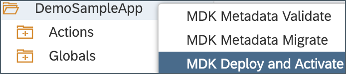
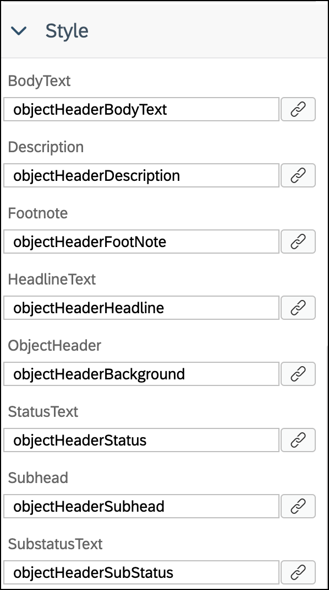
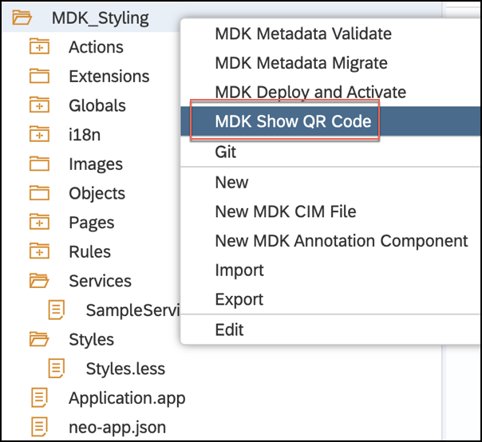
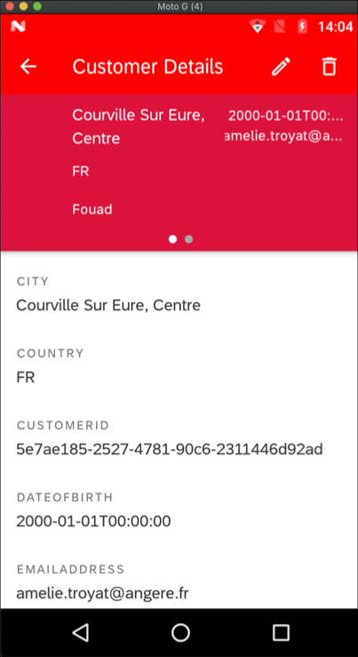
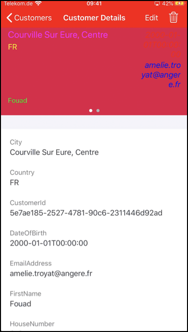

## Prerequisites
- **Tutorial group:** [Set Up for the Mobile Development Kit (MDK)](group.mobile-dev-kit-setup)
- **Download and install:** **SAP Mobile Services Client** on your [iOS](https://apps.apple.com/us/app/sap-mobile-services-client/id1413653544) or [Android](https://play.google.com/store/apps/details?id=com.sap.mobileservices.client) device
- **Download and install** [Barcode Scanner](https://play.google.com/store/apps/details?id=com.google.zxing.client.android&hl=en) (required only for Android device)

## Details
### You will learn
  - How to change color of action bar and tool bar
  - How to change font color and background color of SDK control properties in a section page

You may clone an existing project from [GitHub repository](https://github.com/SAP-samples/cloud-mdk-tutorial-samples/tree/master/4-Level-Up-with-the-Mobile-Development-Kit/3-Add-Styling-to-an-MDK-App) and start directly with step 4 in this tutorial.

---

MDK Template supports Style **LESS** file for styling for `NativeScript`, Android SDK & iOS SDK controls.


[ACCORDION-BEGIN [Step 1: ](Create a new MDK project in SAP Web IDE)]

1. Make sure that you have already created a new destination `mobileservices_cf` as per [this tutorial](fiori-ios-hcpms-setup). This is required to connect SAP Web IDE to Mobile Services on Cloud Foundry environment.

    This step includes creating the Mobile Development Kit project in the Editor.

2. Launch the SAP Web IDE and select the **MDK perspective** by clicking on the icon in the left panel.

3. Right click on Workspace folder and select **New** | **MDK CRUD Project**.

    

    >_The MDK CRUD Project_ template creates the offline or online actions, rules, messages and list detail pages along with editable capability in respective pages. You can use such template to handle error archive situation.

    >More details on _MDK template_ is available in [help documentation](https://help.sap.com/viewer/977416d43cd74bdc958289038749100e/Latest/en-US/cfd84e66bde44d8da09f250f1b8ecee6.html).

4. Enter the Project Name as `MDK_Styling` and click **Next**.

    

5. Leave the default values in _Application Creation_ step as it is, click **Next**.

6. In _Service Creation_ step, provide and select the below information:

    | Field | Value |
    |----|----|
    | `Name`| `SampleServiceV2` |
    | `Service URL` | `/destinations/mobileservices_cf` |
    | `Application ID` | `com.sap.mdk.demo` |
    | `Destination Name` | `com.sap.edm.sampleservice.v2` |
    | `Enable Offline Store` | `Should be checked` |

    > If you do not find `mobileservices_cf` destination, please ensure that you have followed [this tutorial](fiori-ios-hcpms-setup) to setup this destination in SAP Cloud Platform cockpit.

    >If you see a _Authentication Required_ pop-up, then enter your cloud platform User Name and password to authenticate.

    >For Offline OData capability only OData V2 is supported. OData V2 and V4 are supported for Online OData.

    

    Regardless of whether you are creating an online or offline application, this step is needed app to connect to an OData service. When building an Mobile Development Kit application, it assumes the OData service created and the destination that points to this service is setup in Mobile Services and SAP Cloud Platform.

    Since you will create an offline based app, hence _Enable Offline Store_ option is selected.

7. Click **Check Service** to validate the service properties. If all the details are fine, you will see a success message. Click **Next**.

    

    >More details on _Sample Back End_ is available in [help documentation](https://help.sap.com/viewer/468990a67780424a9e66eb096d4345bb/Cloud/en-US/1c2e51a24361487f8b0649702d59dd0f.html).

8. In **Metadata Source** step, select checkbox before **Entity Type** to select all available entities‚ and click **Next**.

    

9. In following steps go with default selections and **Finish** the project creation.

    

    After clicking Finish, the wizard will generate your MDK Application based on your selections.  You should now see the `MDK_Styling` project in the project explorer.

[DONE]
[ACCORDION-END]

[ACCORDION-BEGIN [Step 2: ](Add style metadata in LESS file)]

The `LESS` stylesheet provides the ability to define styling styles that can be used to style the UI in the MDK app.

>You can find more details about [styling in MDK](https://help.sap.com/viewer/977416d43cd74bdc958289038749100e/Latest/en-US/fb52430105254f9b8869cad9039c1529.html).

1. In the SAP Web IDE project, expand the **Styles** folder and open the `Styles.less` file.

    

2. Copy and paste the following code.

    ```LESS

    @mdkYellow1: #ffbb33;
    @mdkRed1: #ff0000;

    //// This style applies to all the ActionBars in the application
    ActionBar {
        color: white;
        background-color: red;
    }

    //// This style applies to all the ToolBars in the application
    ToolBar {
        color: white;
        background-color: blue;
    }

    //// LogoutToolbarItem is tool bar item for Logout in Main.page
    #LogoutToolbarItem  {
        color: brown;
    }

    //// UploadToolbarItem is tool bar item for Sync in Main.page
    #UploadToolbarItem  {
        color: green;
    }

    //// By-Class style: These style classes can be referenced from rules and set using ClientAPI setStyle function
    //// below snippet is to style SalesOrder button on Main.page
    .MySalesOrderButton {
      font-color: @mdkRed1;
      background-color: black;
    }

    //// below snippet is to style Title property of an Object Table control in Customers_List.page
    .ObjectTableTitle {
      font-color: @mdkYellow1;
      background-color: @mdkRed1;
    }

    //// below snippet is to style Object Header control in Customers_Detail.page

    .objectHeaderBodyText {
      font-color: red;
    }

    .objectHeaderDescription {
      font-color: blue;
    }

    .objectHeaderFootNote {
      font-color: green;
    }

    .objectHeaderHeadline {
      font-color: #ff00ff;
    }

    .objectHeaderBackground {
    background-color: #DC143C;
    }

    .objectHeaderStatus {
      background-color: #cccccc;
      font-color: red;
      font-name: italicSystem;
      font-style: italic;
      font-size: 18;
    }

    .objectHeaderSubhead {
      font-color: yellow;
    }

    .objectHeaderSubStatus {
      background-color: #cccccc;
      font-color: blue;
      font-name: italicSystem;
      font-style: italic;
      font-size: 18;
    }
    ```

    >By default there is a tint overlay overlay on the toolbar.  If you want a solid color toolbar that matches the action bar you need to use the `bartintcolor` property in the style instead of the background color (or in addition to). `bartintcolor: blue;`

3. Save your changes to the `Styles.less` file.

    `Styles.less` is already bound to Styles properties in Application.app file.

    

[VALIDATE_1]
[ACCORDION-END]

[ACCORDION-BEGIN [Step 3: ](Set the styling for SDK controls)]

In this step, you will bind style classes:

* `MySalesOrderButton` to `SalesOrderHeaders` section button control on `Main.page`
* `ObjectTableTitle` to Title property of Object Table in `Customers_List.page`
* `objectHeaderBodyText` to `BodyText` property of Object Header in `Customers_Detail.page`
* `objectHeaderDescription` to `Description` property of Object Header in `Customers_Detail.page`
* `objectHeaderFootNote` to `Footnote` property of Object Header in `Customers_Detail.page`
* `objectHeaderHeadline` to `HeadlineText` property of Object Header in `Customers_Detail.page`
* `objectHeaderBackground` to `ObjectHeader` property of Object Header in `Customers_Detail.page`
* `objectHeaderStatus` to `StatusText` property of Object Header in `Customers_Detail.page`
* `objectHeaderSubhead` to `Subhead` property of Object Header in `Customers_Detail.page`
* `objectHeaderSubStatus` to `SubstatusText` property of Object Header in `Customers_Detail.page`

1.  Double-click on `Main.page`, select `SalesOrderHeaders` section button, click on **link** icon next to **Style** property.

    

2. In Object browser, select **SDK Style Classes** from dropdown, double-click on `MySalesOrderButton` class to bind style property and click **OK**.

    

3. Save the changes to `Main.page`.

4. Navigate to **Pages** | **Customers**, double-click on `Customers_List.page`, select **Object Table** control, scroll-down to **Style** section.

5. Click on **link** icon next to **Title** property.

    

5. In Object browser, select **SDK Style Classes** from dropdown, double-click on `ObjectTableTitle` class to bind style property and click **OK**.

    

6. Save the changes to `Customers_List.page`.

7. Navigate to **Pages** | **Customers**, double-click on `Customers_Detail.page`, select **Object Header** control, scroll-down to **Style** section and bind control properties to style properties.

    

6. Save the changes to `Customers_Detail.page`.


[DONE]
[ACCORDION-END]

[ACCORDION-BEGIN [Step 4: ](Deploy and activate the application)]

So far, you have learned how to build an MDK application in the SAP Web IDE editor. Now, we deploy this application definition to Mobile Services.

1. Right click on the `MDK_Styling` MDK Application in the project explorer pane and select **MDK Deploy and Activate**.

    

2. Let the default configuration as it is and click **Next**.

    

    >_Filter Files_ will be filtered and ignored in web packing process.

    >_Externals_ is the list of NPM modules that are part of the MDK Client application and should not be validated in the bundle.

    >By default, automatically deploy option is selected, In other words, the application is automatically deployed from Mobile Services to your MDK client.

3. Click the drop down for Destination Name and select the `mobileservices_cf` destination , you will find list of existing application IDs, select the one you have chosen while creating the project in step 1.

    

4. Click **Next** to finish the deployment from SAP Web IDE.

    You should see **Application deployed successfully** message in console log.

    

[DONE]
[ACCORDION-END]

[ACCORDION-BEGIN [Step 5: ](Populate the QR code for app on-boarding)]

SAP Web IDE has a feature to generate QR code for app on-boarding.

Right click on the `MDK_Styling` MDK Application in the project explorer pane and select **MDK Show QR Code**.



>**MDK Show QR Code** option is greyed out if MDK project is not yet deployed and activated as per step 3.


[DONE]
[ACCORDION-END]

[ACCORDION-BEGIN [Step 6: ](Run the app in MDK client)]

>Make sure you are choosing the right device platform tab above. Once you has scanned and onboarded using the onboarding URL, it will be remembered and next time you logged out and onboard again, same onboarding URLs settings will be reused without the need to scan. You will need to use 3rd party QR scanner app in Android or device Camera in iOS, if you would like to scan a different onboarding URL.

[OPTION BEGIN [Android]]

1. Launch **`Mobile Svcs`** app on your Android device. Tap **GET STARTED** to connect MDK client to SAP Cloud Platform.

    

2. Tap **QR CODE SCAN** to start the device camera for scanning the on-boarding QR code.

    

3. Once scan is succeeded, tap **CONTINUE**.

    

4. Enter Email address and password to login to SAP Cloud Platform and tap **Log On** to authenticate.

    

5. **AGREE** on `End User License Agreement`.

    

6. Choose a passcode with at least 8 characters for unlocking the app and tap **NEXT**.

    

7. Confirm the passcode and tap **DONE**.

    

    Optionally, you can enable fingerprint to get faster access to the app data.

    

8. Tap **OK**.

    

    The MDK client receives deployed metadata definitions as a bundle.

    Now, you will see the **Main** page (with **LOGOUT** and **SYNC** options at bottom of the page) and list of entity sets to navigate to List-Detail pages. In Main page, you will notice styling on action bar, tool bar, items (Logout & Sync) available on tool bar, `SALESORDERHEADERS` button.

    

9. Tap on **CUSTOMERS** to navigate to Customer List. You will see that Title property has been styled.

    

10. Tap on any record to navigate to Customer Detail page. You will see that Object Header control has been styled.

            

    >Once you has scanned and onboarded using the onboarding URL, it will be remembered and next time you logged out and onboard again, same onboarding URLs settings will be reused without the need to scan. You will need to use 3rd party QR scanner app in Android, if you would like to scan a different onboarding URL.

[OPTION END]

[OPTION BEGIN [iOS]]

1. Launch **`Mobile Svcs`** app on your iOS device. Tap **Scan** to start the device camera for scanning the on-boarding QR code.

    

2. Once scan is succeeded, tap **Continue**.

    

3. Enter Email address and password to login to SAP Cloud Platform and tap **Log On** to authenticate.

    

4. **Agree** on `End User License Agreement`.

    

5. Choose a passcode with at least 8 characters for unlocking the app and click **Next**.

    

6. Confirm the passcode and click **Done**.

    

    Optionally, you can enable Touch ID to get faster access to the app data, click **Enable**.

    

7. Tap **OK**.

    

    The MDK client receives deployed metadata definitions as a bundle.

    Now, you will see the **Main** page (with **Logout** and **Sync** options at bottom of the page) and list of entity sets to navigate to List-Detail pages. In Main page, you will notice styling on action bar, tool bar, items (Logout & Sync) available on tool bar, `SalesOrderHeaders` button.

    

8. Tap on **Customers** to navigate to Customer List. You will see that Title property has been styled.

    

9. Tap on any record to navigate to Customer Detail page. You will see that Object Header control has been styled.

        

    >Once you has scanned and onboarded using the onboarding URL, it will be remembered and next time you logged out and onboard again, same onboarding URLs settings will be reused without the need to scan. You will need to use device Camera in iOS, if you would like to scan a different onboarding URL.

[OPTION END]

Congratulations, you have successfully styled your MDK app and you are now all set to [Implement Deep Linking to Another App from an MDK App](cp-mobile-dev-kit-deep-link).

[DONE]
[ACCORDION-END]


---
