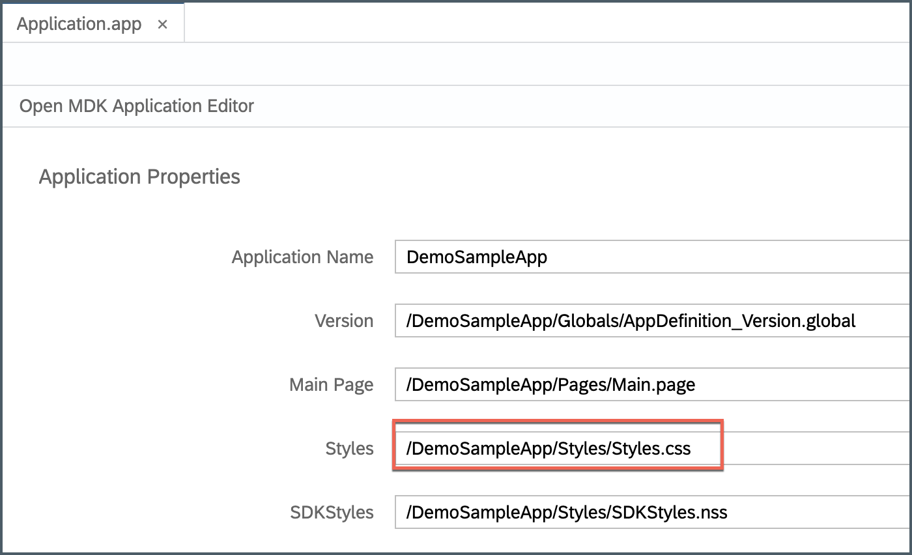

## Details
### You will learn
  - How to change background color of action bar in the application
  - How to change color of tool bar items

---

To customize your MDK app with various styling, you need to carry out the following tasks:

*  Update existing Styles metadata in `Styles.css` file


[ACCORDION-BEGIN [Step 1: ](Add style metadata in CSS file)]

The Styles metadata provides the client with a `NativeScript` CSS-like style file used to style the `NativeScript` controls.

>You can find more details about [styling in MDK](https://help.sap.com/viewer/977416d43cd74bdc958289038749100e/Latest/en-US/fb52430105254f9b8869cad9039c1529.html).

In SAP Web IDE project, expand **Styles** folder | open `Styles.css` file.


Copy and paste the following code.

```css
/* This style applies to all the ActionBars in the application */
ActionBar {
    color: #3A835B;
    background-color: #854442;
}


/* LogoutToolbarItem is tool bar item for Logout in Main.page */
#LogoutToolbarItem  {
    color: #FFF4E6;
}

/* UploadToolbarItem is tool bar item for Upload in Main.page */
#UploadToolbarItem  {
    color: #B0D450;
}
```

>This is how tool bar item name is being referenced in style file.

>

Save your changes to the `Styles.css` file.

>`Styles.css` is already bound to Styles properties in Application.app file.

>

[VALIDATE_1]
[ACCORDION-END]

[ACCORDION-BEGIN [Step 2: ](Deploy, activate and test the application)]

Deploy the updated application to your MDK client.

Right click on the MDK Application in the project explorer pane and select **MDK Deploy and Activate**, click **Next** and deploy to Mobile Services.


>Make sure to select same App ID as you chose in previous tutorial.

Re-launch the app on your device, you may asked to authenticate with passcode or Touch ID or Fingerprint. You will see a _Confirmation_ pop-up, click **OK**.


You will have updated page with new styling.


>Styling to action bar applies to all `ActionBars` in the application.

[DONE]
[ACCORDION-END]


---
