## Details
### You will learn
  - How to enable log upload feature in Mobile Services
  - How to upload logs from the app
  - How to examine log details for troubleshooting

---

[ACCORDION-BEGIN [Step 1: ](Define client log policy in Mobile Services cockpit )]

SAP Cloud Platform Mobile Services provides administrators, developers and support staff with extensive logs and traces functionality to troubleshoot application issues. You can control the amount of information that is captured by setting the log level for individual logging components.

In this step, you will enable client log upload policy in **SAP Cloud Platform Mobile Services Cockpit** for a given MDK app.

Login to [Mobile Services Cockpit](fiori-ios-hcpms-setup), click `com.sap.mdk.demo` | click **+** icon to add client log upload feature to the app.

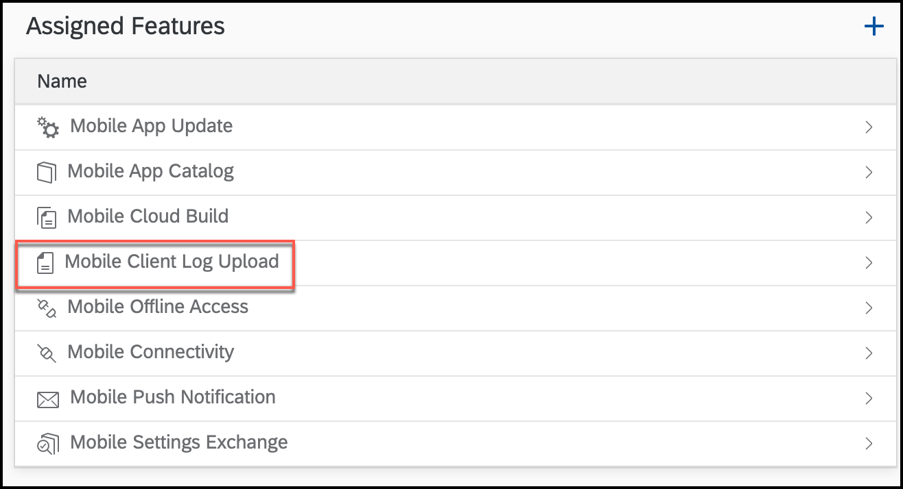

Select **Mobile Client Log Upload** option and click **OK**.

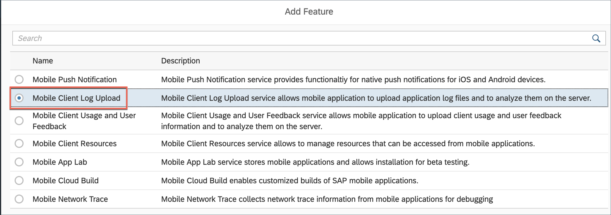

Check **Log Upload** option and click **Save**.

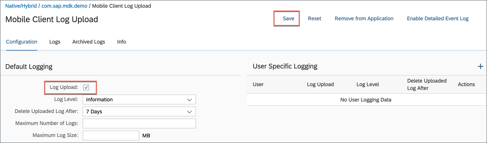

>Other policy parameters like Log Level, Delete Uploaded Log After, Maximum Number of Logs and Maximum Log Size currently have no effect.

>You can find more details about [Client Log Upload feature](https://help.sap.com/viewer/38dbd9fbb49240f3b4d954e92335e670/Cloud/en-US/ee280404f7ea4bb1ac12d2271815e3e0.html).

[DONE]
[ACCORDION-END]

[ACCORDION-BEGIN [Step 2: ](Create log actions)]

Logs help you trace events that occur while your application is running. You can create logging actions, set their priority levels and upload stored log entries.

You will create 3 actions:

* Log action of Type `SetState`: to turn the logger On, Off or Toggle

* Log action of Type `SetLevel`: to set log level (Debug, Info, Warn or Error)

* Log action of Type `Upload`: to upload logs from app to Mobile Services

>You can find more details about [MDK Log Actions](https://help.sap.com/viewer/977416d43cd74bdc958289038749100e/Latest/en-US/f906d3ed1919484c8f54050dfd0143ae.html).

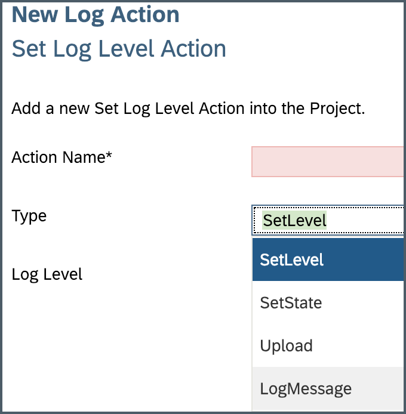

First, create a log action of type `SetState`:

Right-click on the **Actions** folder | **New MDK Action** | choose **MDK Log Actions** in **Category** | click **Log Action** | **Next**.

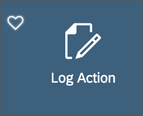

Provide the below information:

| Property | Value |
|----|----|
| `Action Name`| `LogSetState` |
| `Type` | `SetState` |
| `Log State`| On |

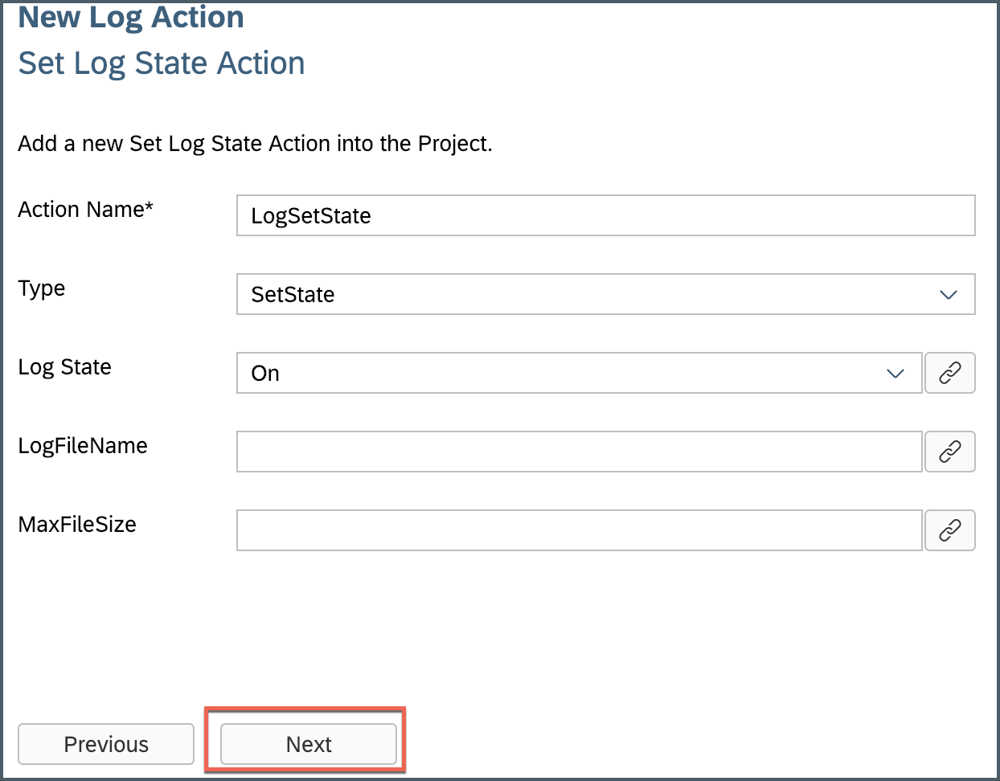

Click **Next** and then **Finish** on the confirmation step.

Next, create a log action of type `SetLevel`:

Right-click on the **Actions** folder | **New MDK Action** | choose **MDK Log Actions** in **Category** | click **Log Action** | **Next**.

Provide the below information:

| Property | Value |
|----|----|
| `Action Name`| `LogSetLevel` |
| `Type` | `SetLevel` |
| `Log Level`| Debug |

>Setting log level to debug is not recommended for productive environment.

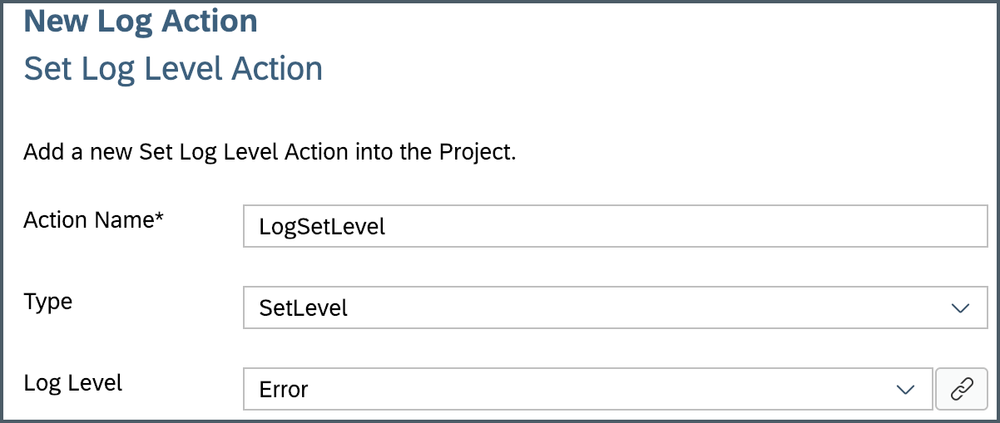

Click **Next** and then **Finish** on the confirmation step.

Next, create a log action of type `Upload`:

Right-click on the **Actions** folder | **New MDK Action** | choose **MDK Log Actions** in **Category** | click **Log Action** | **Next**.

Provide the below information:

| Property | Value |
|----|----|
| `Action Name`| `LogUpload` |
| `Type` | `Upload` |

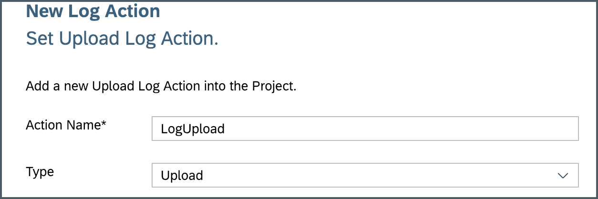

Click **Next** and then **Finish** on the confirmation step.

[DONE]
[ACCORDION-END]

[ACCORDION-BEGIN [Step 3: ](Bind Set Level log action to the success of Set State action)]

Double click on the `LogSetState.action` file | expand **Common Action Properties** and select `LogSetLevel.action` for **Success Action**.

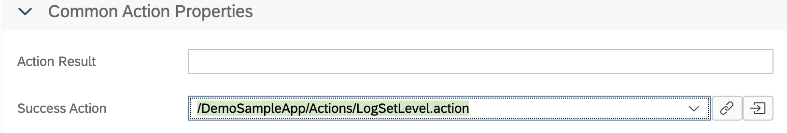

Click **Save**.

[DONE]
[ACCORDION-END]

[ACCORDION-BEGIN [Step 4: ](Bind Set State log action to success of InitializeOffline action)]

When the metadata is downloaded from App Update, `OnDidUpdate` event is being called which eventually triggers `InitializeOffline.action`. You can look at `Application.app` file for the details.

You will bind `LogSetState.action` at success of  `InitializeOffline.action`.

Open the `InitializeOffline.action`, scroll-down and expand **Common Action Properties** section, select `LogSetState.action` for the **Success Action**.  

Click **Save**.

[DONE]
[ACCORDION-END]

[ACCORDION-BEGIN [Step 5: ](Define success/failure messages for Log Upload action)]

You will define two message actions for displaying success or failure when _Log upload action_ is triggered. Later, you will bind these actions in **Common Action Properties** of `LogUpload.action`.

First, you will create a success message action.

Right-click on the **Actions** folder | **New MDK Action** | choose **MDK Message Actions** in **Category** | click **Message Action** | **Next**.

Provide the below information:

| Property | Value |
|----|----|
| `Action Name`| `LogUploadSuccessful` |
| `Type` | `ToastMessage` |
| `Message`| `Log File Uploaded` |
| `MaxNumberOfLines`| 1 |
| `Duration` | 3 |
| `IsIconHidden`| `true` |
| `Animated` | `true` |

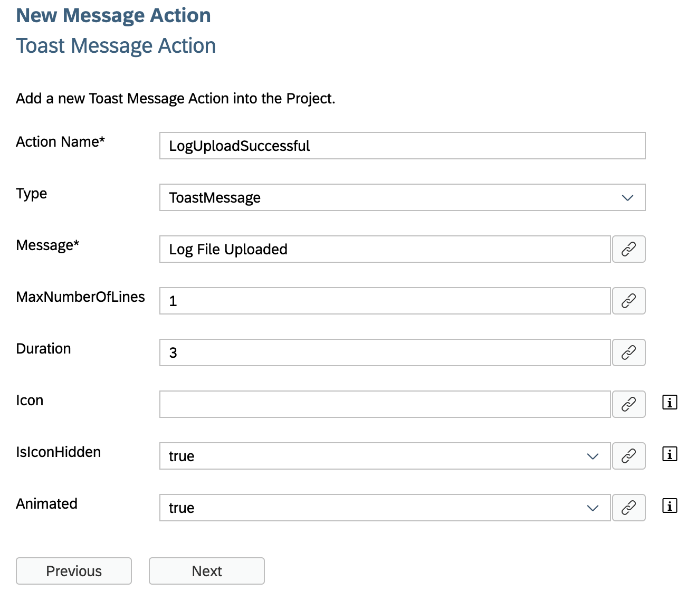

Click **Next** and then **Finish** on the confirmation step.

Next, create a failure message action.

Right-click on the **Actions** folder | **New MDK Action** | choose **MDK Message Actions** in **Category** | click **Message Action** | **Next**.

Provide the below information:

| Property | Value |
|----|----|
| `Action Name`| `LogUploadFailure` |
| `Type` | `Message` |
| `Message`| `Uploading log file failed` |
| `Title`| `Log Upload Failed` |
| `OKCaption` | `OK` |
| `OnOK` | `--None--` |
| `CancelCaption` | leave it blank |
| `OnCancel` | `--None--` |

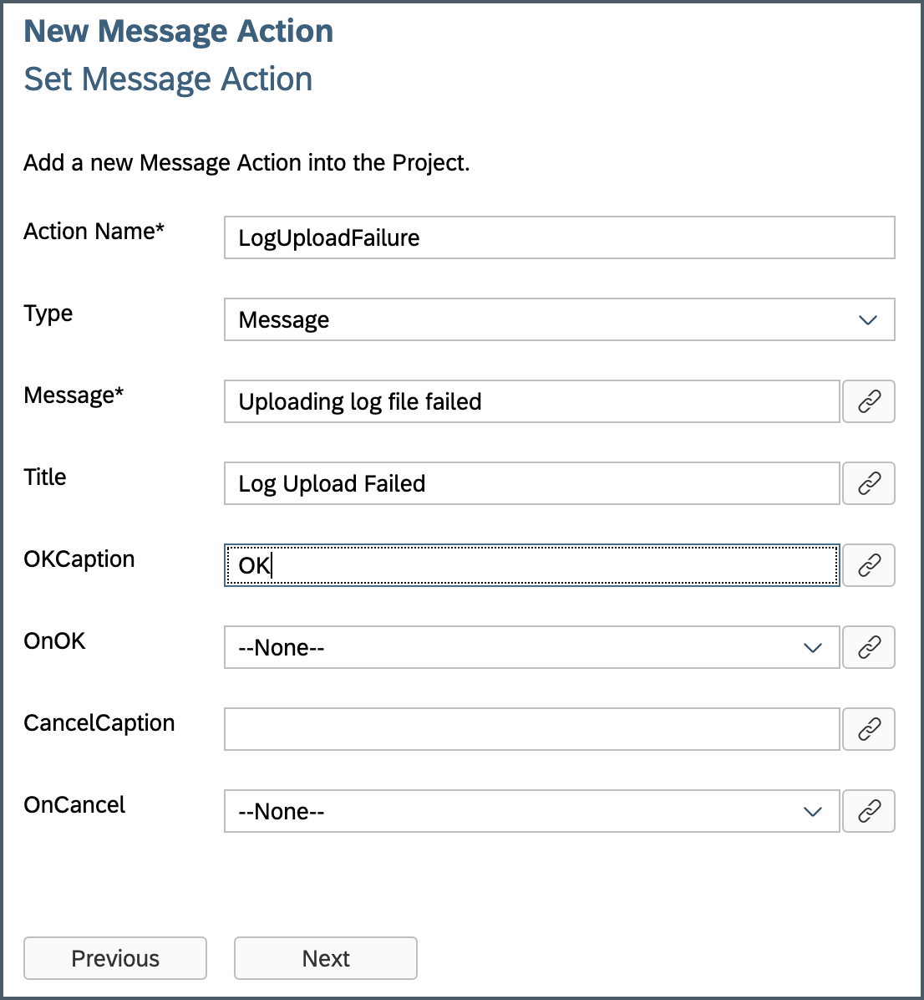

Click **Next** and then **Finish** on the confirmation step.

Next, bind both actions in **Common Action Properties** of `LogUpload.action`.

Double click on the `LogUpload.action` and provide the below information:

| Property | Value |
|----|----|
| `Success Action`| `LogUploadSuccessful.action` |
| `Failure Action`| `LogUploadFailure.action`
| `Show Activity Indicator` | select it |
| `Activity Indicator Text`| `Uploading Logs...` |

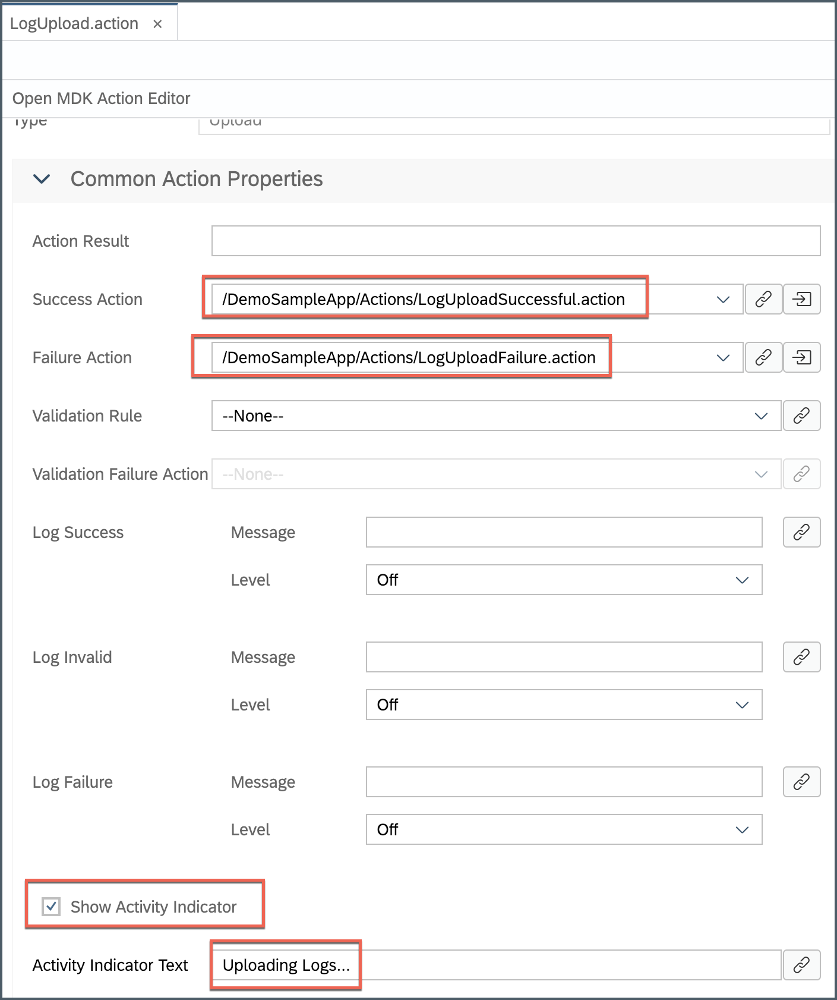

[DONE]
[ACCORDION-END]

[ACCORDION-BEGIN [Step 6: ](Add Upload Log button to main page)]

You will add a toolbar item to the _main page_ called **Upload Logs**. You will link toolbar item to `LogUpload.action` you just created in step 2.

In `Main` page, drag and drop an **Toolbar Item** to the bottom right of the page.

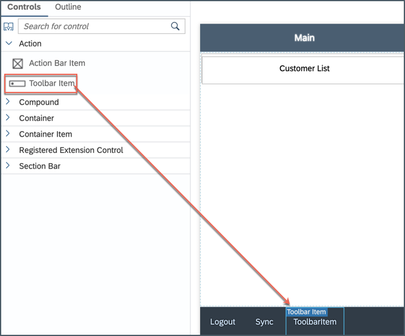

Replace **Caption** to _Upload Logs_.

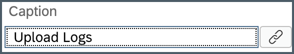

In the Properties pane, click the **Events** tab, click the **link icon** for the `OnPress` property to open the object browser.

Double Click on the `LogUpload.action` action and click **OK** to set it as the `OnPress` Action.

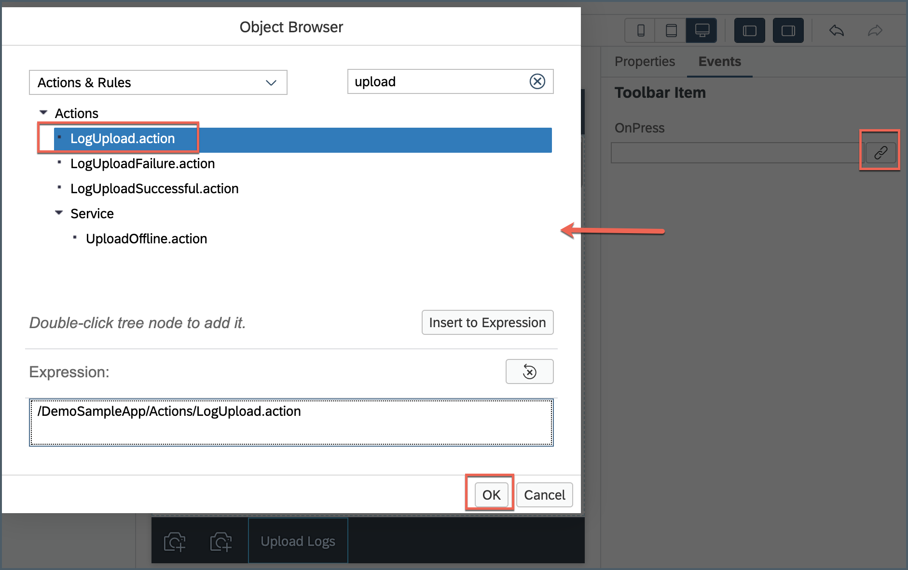

Save the changes to the `Main.page`.

[DONE]
[ACCORDION-END]

[ACCORDION-BEGIN [Step 7: ](Deploy and activate the application)]

Deploy the updated application to your MDK client.

Right-click on the `DemoSampleApp` MDK Application in the project explorer pane and select **MDK Deploy and Activate**.

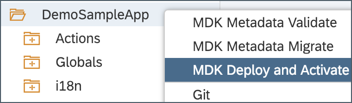

Since we have deployed already both the destination and app id should be pre-selected based on the last time you deployed our application.  Confirm the **Destination Name** is `mobileservices_cf` and the **Application Id** is `com.sap.mdk.demo` and click **Next**.

[DONE]
[ACCORDION-END]

[ACCORDION-BEGIN [Step 8: ](Test the application)]

[OPTION BEGIN [Android]]

Re-launch the app on your device, you may asked to authenticate with passcode or Fingerprint. You will see a _Confirmation_ pop-up, tap **OK**.

At `OnLaunch` event, app starts gathering logs.

Tap **UPLOAD LOGS** to upload client logs from app to SAP Cloud Platform Mobile Services.

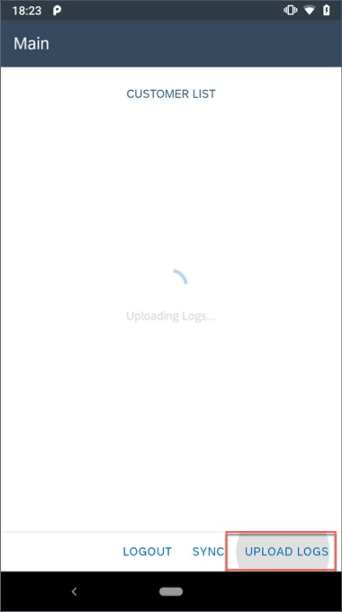

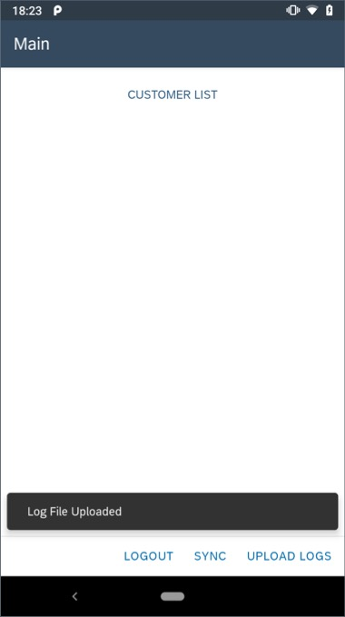

[OPTION END]

[OPTION BEGIN [iOS]]

Re-launch the app on your device, you may asked to authenticate with passcode or Touch ID. You will see a _Confirmation_ pop-up, tap **OK**.

At `OnLaunch` event, app starts gathering logs.

Tap **Upload Logs** to upload client logs from app to SAP Cloud Platform Mobile Services.

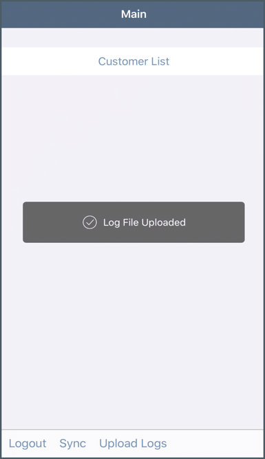

[OPTION END]

[DONE]
[ACCORDION-END]

[ACCORDION-BEGIN [Step 8: ](Examine uploaded logs in Mobile Services cockpit)]

Open SAP Cloud Platform Mobile Services Cockpit, click **Mobile Applications** | **Native/Hybrid** | click on MDK app | **Mobile Client Log Upload** | **Logs**.

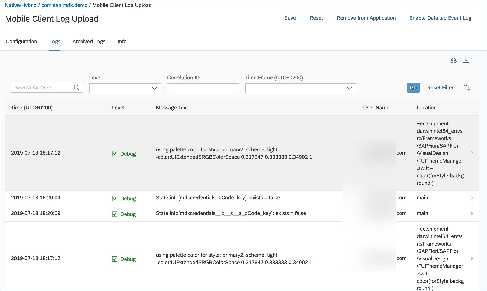

You may view log entries directly in Mobile Services Cockpit or download them locally.

>You can find more details about [Uploading and Viewing Client Logs](https://help.sap.com/viewer/468990a67780424a9e66eb096d4345bb/Cloud/en-US/38f23c1381344df9a3ab2d0ea22e689d.html).

[VALIDATE_1]
[ACCORDION-END]

---
