## Details
### You will learn
  - How to enable log upload feature in Mobile Services
  - How to upload logs from the app
  - How to examine log details for troubleshooting

You may clone an existing project from [GitHub repository](https://github.com/SAP-samples/cloud-mdk-tutorial-samples/tree/master/3-Enhance-Your-First-MDK-App-with-Additional-Functionalities/2-cp-mobile-dev-kit-delete-customer) to start with this tutorial.

---

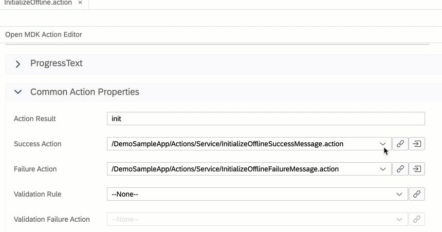

[ACCORDION-BEGIN [Step 1: ](Define client log policy in Mobile Services cockpit )]

SAP Mobile Services provides administrators, developers and support staff with extensive logs and traces functionality to troubleshoot application issues. You can control the amount of information that is captured by setting the log level for individual logging components.

In this step, you will enable client log upload policy in **SAP Mobile Services Cockpit** for a given MDK app.

1. Login to [Mobile Services Cockpit](fiori-ios-hcpms-setup), click `com.sap.mdk.demo` | **Mobile Client Log Upload**.

    !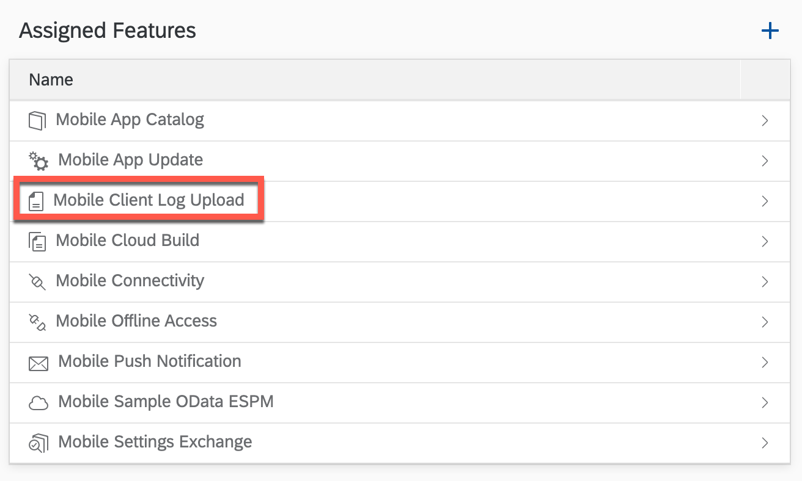

2. Check **Log Upload** option and click **Save**.

    !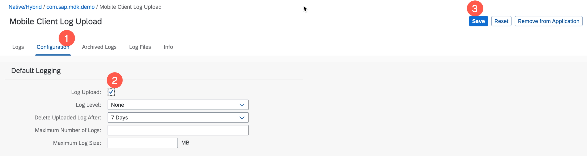

    >Other policy parameters like Log Level, Delete Uploaded Log After, Maximum Number of Logs and Maximum Log Size currently have no effect.

    >You can find more details about [Client Log Upload feature](https://help.sap.com/doc/f53c64b93e5140918d676b927a3cd65b/Cloud/en-US/docs-en/guides/features/logging/admin/policies.html).

[DONE]
[ACCORDION-END]

[ACCORDION-BEGIN [Step 2: ](Create log actions)]

Logs help you trace events that occur while your application is running. You can create logging actions, set their priority levels and upload stored log entries.

You will create 3 actions:

* Log action of Type `SetState`: to turn the logger On, Off or Toggle

* Log action of Type `SetLevel`: to set log level (Debug, Info, Warn or Error)

* Log action of Type `Upload`: to upload logs from app to Mobile Services

>You can find more details about [MDK Log Actions](https://help.sap.com/doc/69c2ce3e50454264acf9cafe6c6e442c/Latest/en-US/docs-en/reference/schemadoc/Action/Logger/LogMessage.schema.html).

!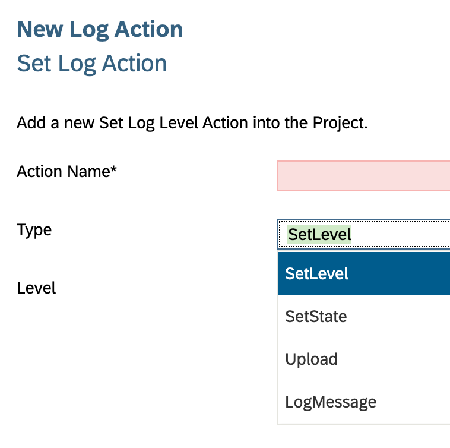

1. Create a log action of type `SetState`:

    Right-click the **Actions** folder | **MDK: New Action** | choose **MDK Log Actions** in **Category** | click **Log Action** | **Next**.

    !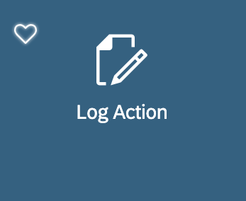

    Provide the below information:

    | Property | Value |
    |----|----|
    | `Action Name`| `LogSetState` |
    | `Type` | Select `SetState` from the dropdown |
    | `LoggerState`| Select `On` from the dropdown |

    !

    Click **Next** and then **Finish** on the confirmation step.

2. Create a log action of type `SetLevel`:

    Right-click the **Actions** folder | **MDK: New Action** | choose **MDK Log Actions** in **Category** | click **Log Action** | **Next**.

    Provide the below information:

    | Property | Value |
    |----|----|
    | `Action Name`| `LogSetLevel` |
    | `Type` | Select `SetLevel` from the dropdown |
    | `Level`| Select `Trace` from the dropdown |

    !

    Click **Next** and then **Finish** on the confirmation step.

3. Create a log action of type `Upload`:

    Right-click the **Actions** folder | **MDK: New Action** | choose **MDK Log Actions** in **Category** | click **Log Action** | **Next**.

    Provide the below information:

    | Property | Value |
    |----|----|
    | `Action Name`| `LogUpload` |
    | `Type` | Select `Upload` from the dropdown |

    !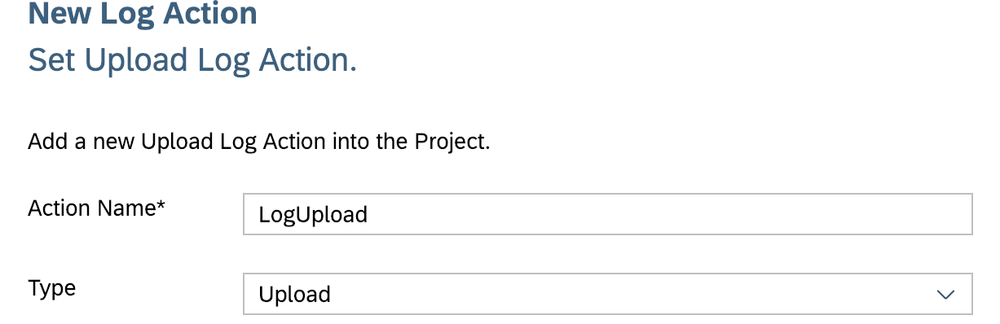

    Click **Next** and then **Finish** on the confirmation step.

[DONE]
[ACCORDION-END]

[ACCORDION-BEGIN [Step 3: ](Bind Set Level log action to the success of Set State action)]

Double click the `LogSetState.action` file | expand **Common Action Properties** | click the link icon for **Success Action** and bind it to  `LogSetLevel.action`

!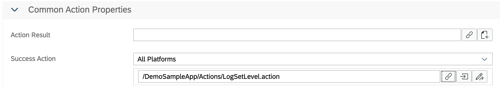

[DONE]
[ACCORDION-END]

[ACCORDION-BEGIN [Step 4: ](Bind Set State log action to success of InitializeOffline action)]

When the metadata is downloaded from App Update, `OnDidUpdate` event is being called which eventually triggers `InitializeOffline.action`. You can look at `Application.app` file for the details.

You will bind `LogSetState.action` at success of  `InitializeOffline.action`.

Navigate to `DemoSampleApp` | `Actions` | `Service` | `InitializeOffline.action` | scroll-down and expand **Common Action Properties** section | click the link icon for **Success Action** and bind it to  `LogSetState.action`

!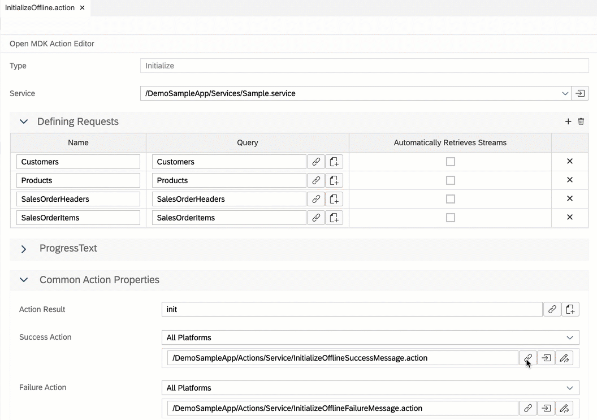

[DONE]
[ACCORDION-END]

[ACCORDION-BEGIN [Step 5: ](Define success/failure messages for Log Upload action)]

You will define two message actions for displaying success or failure when _Log upload action_ is triggered. Later, you will bind these actions in **Common Action Properties** of `LogUpload.action`.

1. You will create a success message action.

    Right-click the **Actions** folder | **MDK: New Action** | choose **MDK Message Actions** in **Category** | click **Message Action** | **Next**.

    Provide the below information:

    | Property | Value |
    |----|----|
    | `Action Name`| `LogUploadSuccessful` |
    | `Type` | Select `ToastMessage` from the dropdown |
    | `Message`| `Log File Uploaded` |
    | `NumberOfLines`| 1 |
    | `Duration` | 3 |
    | `IsIconHidden`| Select `true` from the dropdown |
    | `Animated` | Select `true` from the dropdown |

    !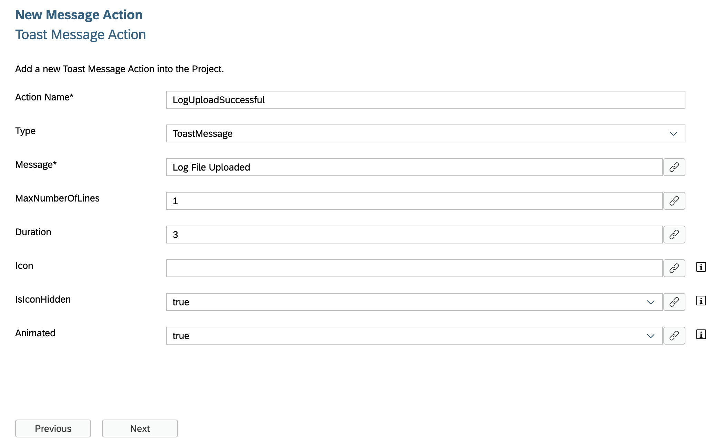

    Click **Next** and then **Finish** on the confirmation step.

2. Create a failure message action.

    Right-click the **Actions** folder | **MDK: New Action** | choose **MDK Message Actions** in **Category** | click **Message Action** | **Next**.

    Provide the below information:

    | Property | Value |
    |----|----|
    | `Action Name`| `LogUploadFailure` |
    | `Type` | Select `Message` from the dropdown |
    | `Message`| `Uploading log file failed` |
    | `Title`| `Log Upload Failed` |
    | `OKCaption` | `OK` |
    | `OnOK` | `--None--` |
    | `CancelCaption` | leave it blank |
    | `OnCancel` | `--None--` |

    !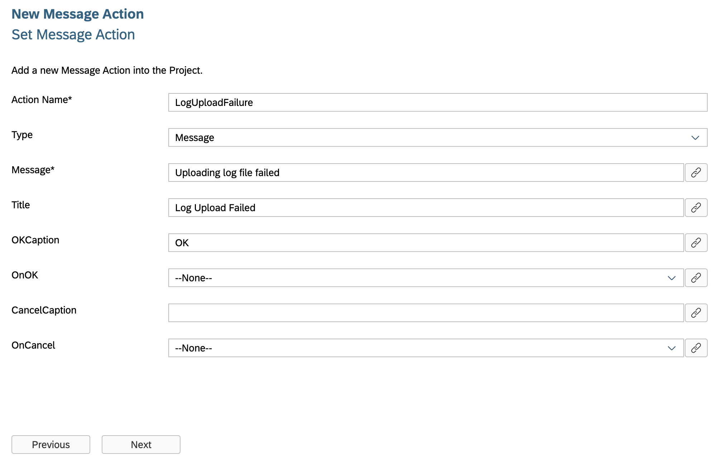

    Click **Next** and then **Finish** on the confirmation step.

3. Bind both actions in **Common Action Properties** of `LogUpload.action`.

    Double click the `LogUpload.action` and provide the below information:

    | Property | Value |
    |----|----|
    | `Success Action`| Click the link icon and bind it to `LogUploadSuccessful.action`  |
    | `Failure Action`| Click the link icon and bind it to `LogUploadFailure.action` |
    | `Show Activity Indicator` | Select `true` from the dropdown ||
    | `Activity Indicator Text`|  `Uploading Logs...` |

    !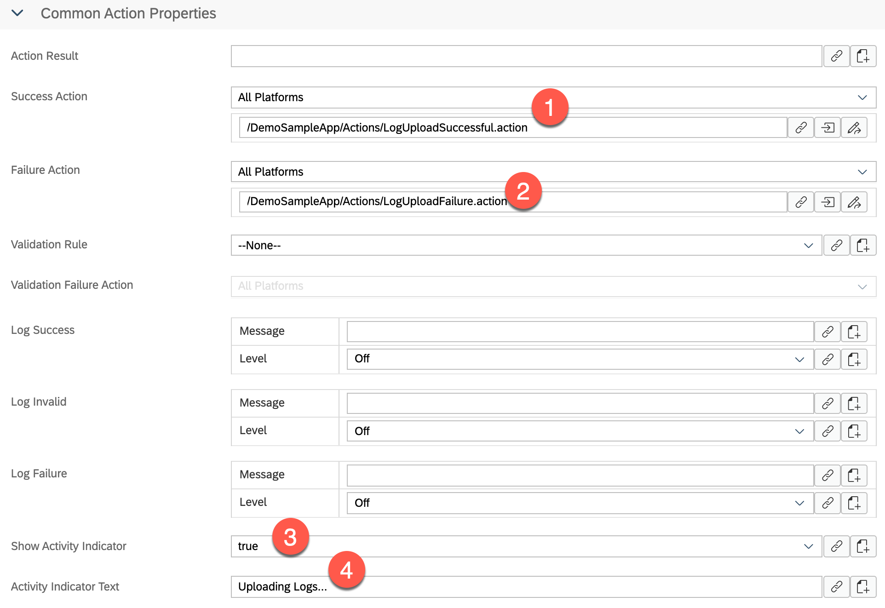

[DONE]
[ACCORDION-END]

[ACCORDION-BEGIN [Step 6: ](Add Upload Log button to main page)]

You will add a toolbar item to the _main page_ called **Upload Logs**. You will link toolbar item to `LogUpload.action` you just created in step 2.

1. In `Main` page, drag and drop an **Toolbar Item** to the bottom right of the page.

    !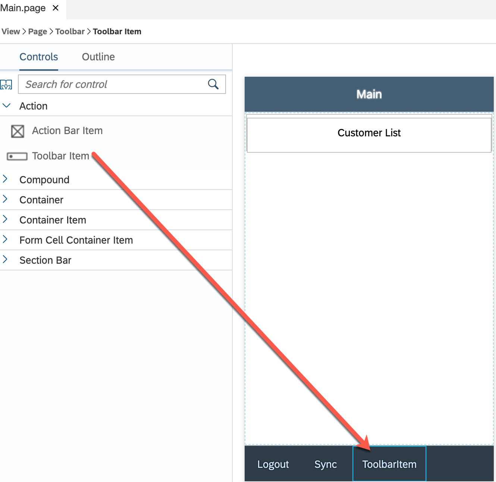

2. Provide the below information:

    | Property | Value |
    |----|----|
    | `Caption`| `Upload Logs`  |
    | `Visible`| `$(PLT,true,true,false)`  |

    !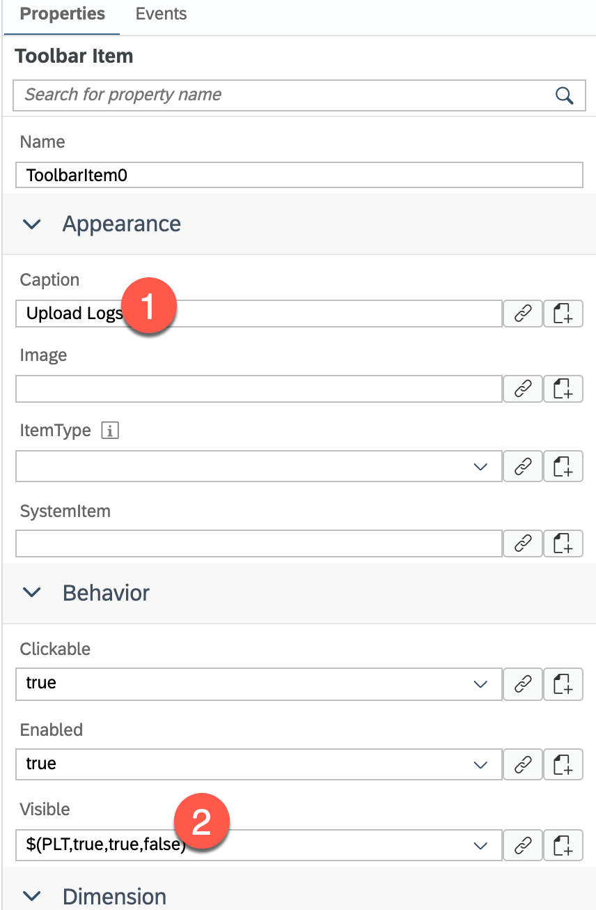

    >Platform (PLT) function `$(PLT, <iOS>, <Android>, <Web>)` lets you to define a platform specific value for metadata property as Upload Logs functionality is not applicable in MDK Web environment, this option will not be visible in Web application. You can find more details on PLT function in [help documentation](https://help.sap.com/doc/f53c64b93e5140918d676b927a3cd65b/Cloud/en-US/docs-en/guides/getting-started/mdk/development/property-binding/platform-specific-binding.html#plt-formatter-for-events-supported-for-both-mobile-and-web).

3. In the Properties pane, click the **Events** tab, click the 3 dots icon for the `OnPress` property to open the **Object Browser**.

    Double click the `LogUpload.action` action and click **OK** to set it as the `OnPress` Action.

    !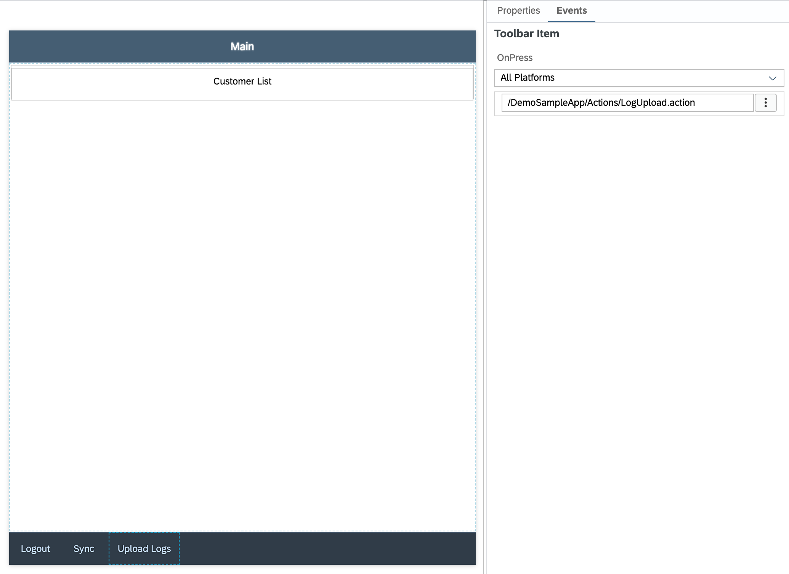

[VALIDATE_2]
[ACCORDION-END]

[ACCORDION-BEGIN [Step 7: ](Deploy the application)]

Deploy the updated application to your MDK client.

1. Right-click `Application.app` and select **MDK: Deploy**.

    !

2. Select deploy target as **Mobile Services**.

    !

    You should see **Deploy to Mobile Services successfully!** message.

    !

    >Alternatively, you can select *MDK: Redeploy* in the command palette (View menu>Find Command OR press Command+Shift+p on Mac OR press Ctrl+Shift+P on Windows machine), it will perform the last deployment.

    >!

[DONE]
[ACCORDION-END]

[ACCORDION-BEGIN [Step 8: ](Run the app)]

[OPTION BEGIN [Android]]

1. Re-launch the app on your device, you may asked to authenticate with passcode or Biometric authentication. You will see a _Confirmation_ pop-up, tap **OK**.

    Once the reinitialization is completed, app starts gathering the client logs.

2. Tap **Upload Logs** to upload client logs from app to SAP Mobile Services.

    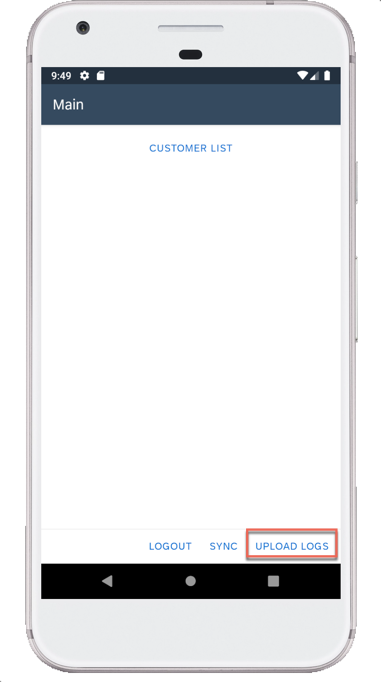

    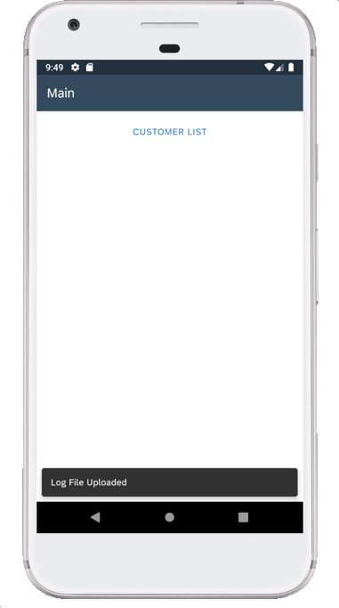

[OPTION END]

[OPTION BEGIN [iOS]]

1. Re-launch the app on your device, you may asked to authenticate with passcode or Biometric authentication. You will see a _Confirmation_ pop-up, tap **OK**.

    Once the reinitialization is completed, app starts gathering the client logs.

2. Tap **Upload Logs** to upload client logs from app to SAP Mobile Services.

    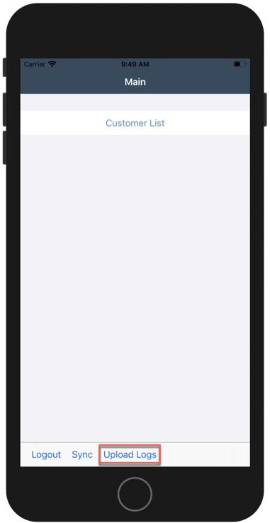

    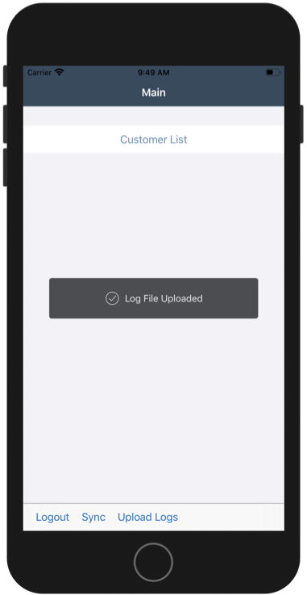

[OPTION END]

[DONE]
[ACCORDION-END]

[ACCORDION-BEGIN [Step 9: ](Examine uploaded logs in Mobile Services cockpit)]

Open SAP Mobile Services Cockpit, click **Mobile Applications** | **Native/Hybrid** | click `com.sap.mdk.demo` app | **Mobile Client Log Upload** | **Log Files**.

!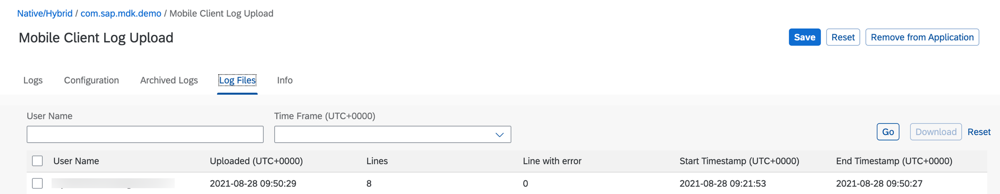

A log file is created for each upload. All the uploaded files, including all levels, not just error or fatal will be listed here.

You can view any Error and Fatal client logs under *Logs* tab.

!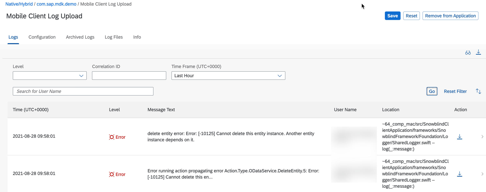

>Check [documentation](https://help.sap.com/doc/f53c64b93e5140918d676b927a3cd65b/Cloud/en-US/docs-en/guides/features/logging/admin/config.html) for more details about Uploading and Viewing Client Logs.

[VALIDATE_1]
[ACCORDION-END]

---
