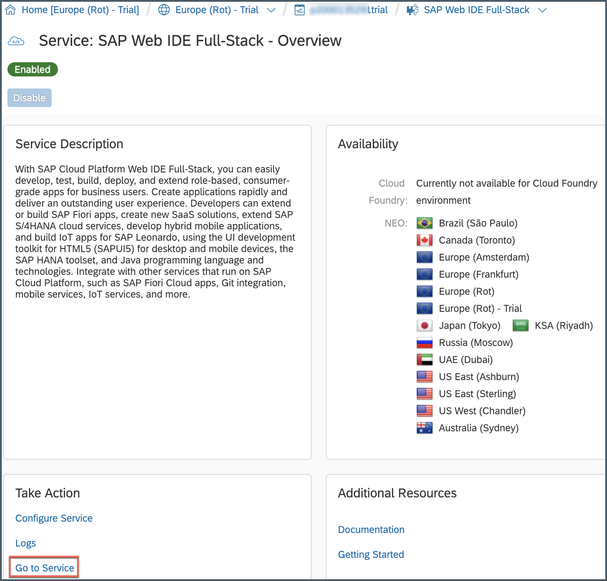
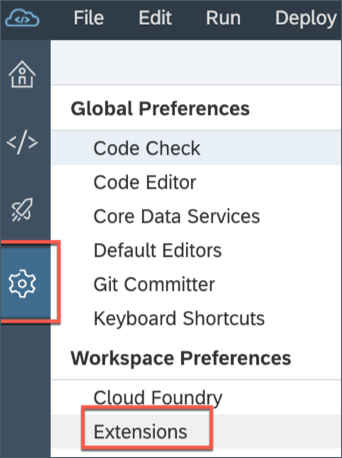
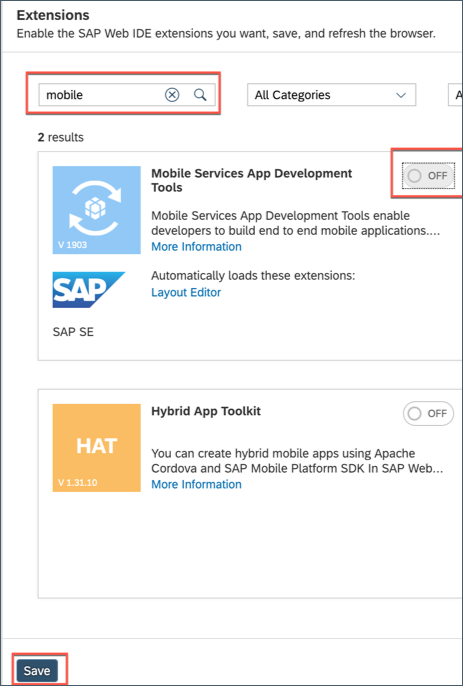
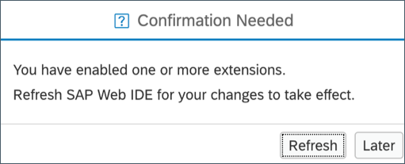
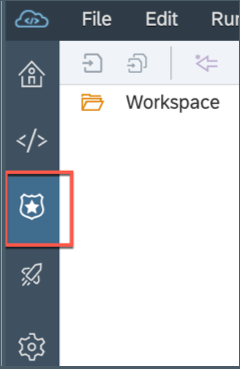

## Details
### You will learn
  - How to enable Mobile Services app development tools in SAP Web IDE (which enable developers to build end-to-end mobile applications)

---

[ACCORDION-BEGIN [Step 1: ](Log onto SAP Web IDE)]

Open your SAP Cloud Platform account (if you have a free developer account, click [here](https://cockpit.hanatrial.ondemand.com/cockpit) to open the home page).

Click **Launch SAP Web IDE** to open SAP Web IDE page.

[DONE]
[ACCORDION-END]

[ACCORDION-BEGIN [Step 2: ](Enable Mobile Services tools extension)]

Open **Preferences** window by clicking on the gear icon and click **Extensions**.

Search with **mobile** to find required extension, toggle it to **ON** and choose **Save**.

>This extension is used for creating and developing Mobile development kit and SAP Mobile Cards based applications along with creating backend OData service (from Scratch) that provides capabilities enabling you to quickly build an mobile enabled OData service that constitutes your mobile back-end service for mobile applications.  

Click **Refresh** to reload the SAP Web IDE page for the changes to take effect.

>You will notice that there is now a dedicated workspace for MDK based applications.

You can now use the Mobile Development Kit editor feature to create and develop your project.

>You can find more information on Mobile Services App Development Tools [help documentation](https://help.sap.com/viewer/product/MS_APPDEV_ON_WEBIDE/Latest/en-US).

[VALIDATE_1]
[ACCORDION-END]

---
