## Details

### You will learn

 - How to generate a sample iOS native application using SAP Cloud Platform SDK for iOS Assistant
 - How to enable passcode policy in that generated application

> Before you start, make sure you:

> - have downloaded SAP Cloud Platform SDK for iOS **version 2.2 (2.0 SP02)**.
> - have a trial account on SAP Cloud Platform. See [Sign up for a free trial account on SAP Cloud Platform](https://developers.sap.com/tutorials/hcp-create-trial-account.html) for more information.
> - enabled SAP Cloud Platform mobile service for development and operations. See [Enable SAP Cloud Platform mobile service for development and operations](https://developers.sap.com/tutorials/fiori-ios-hcpms-setup.html) for more information.

### Time to Complete
**20 Min**

---
[ACCORDION-BEGIN [Step 1: ](Create an Xcode project)]

Open SAP Cloud Platform SDK for iOS Assistant application. Click  to create a new project

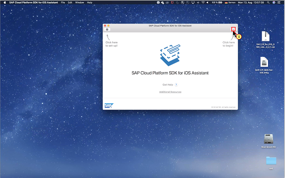

Click the Product Name and enter a name here. Avoid special characters and spaces.
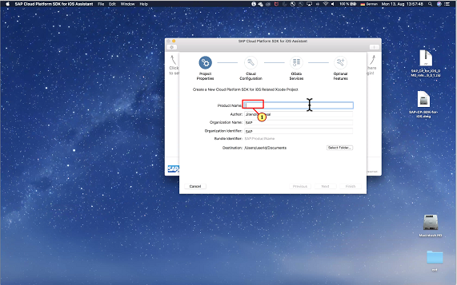

Click 

Click  to let the iOS Assistant create an application end point in the SAP Cloud Platform mobile services for your project.

Click 
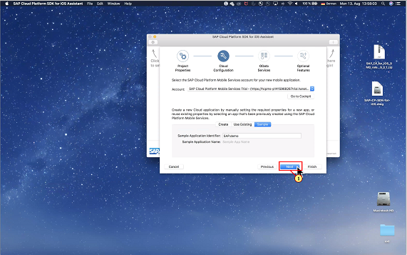
Click 
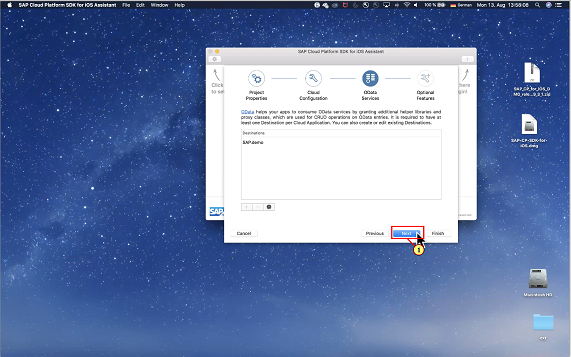

Click 
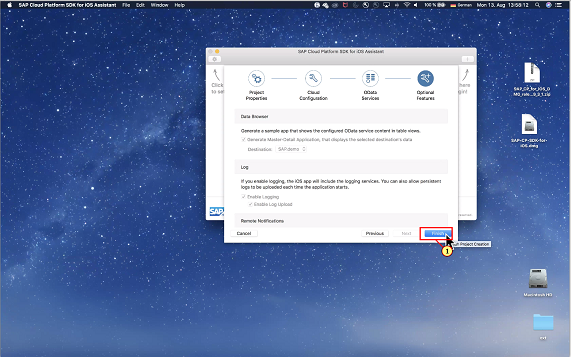

[DONE]
[ACCORDION-END]

[ACCORDION-BEGIN [Step 2: ](Build and run the Xcode project)]

Click on  **Build and Run** icon to let the iOS Assistant create an application end point in the SAP Cloud Platform mobile services for your project.

Click  **Don't Allow**
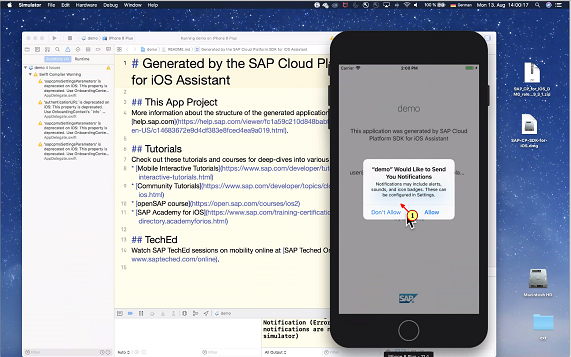

Click  **Start**

Enter your SAP Cloud Platform Credentials

Click 

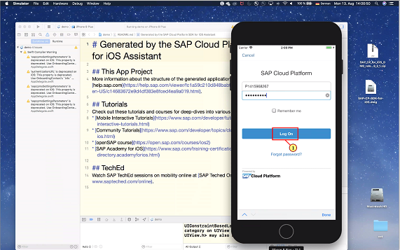

Click  for Privacy Consent Forms

Click 

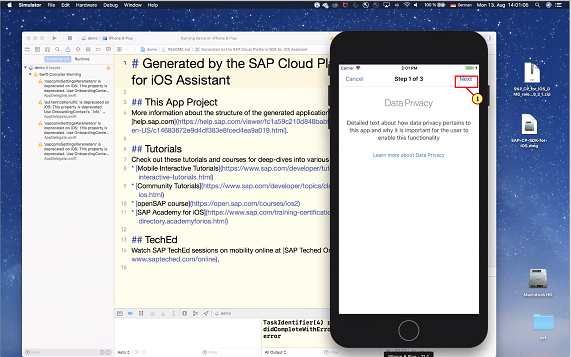

Click 
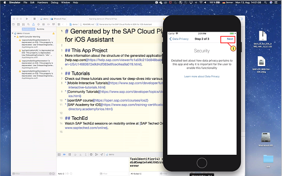

Click 
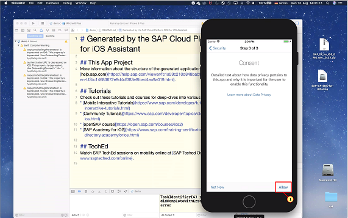

Click `SalesOrderHeaders` collection to navigate to the list of Sales Orders from the OData Sample Service

Click on any entry to navigate into the `salesorder` of the OData Sample Service
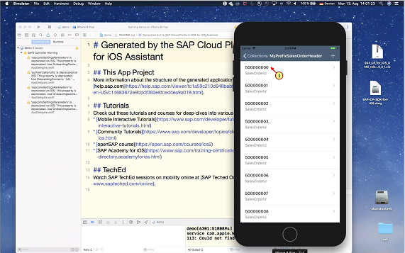

Click  ** ** to put application into background

Click  to bring application in foreground.
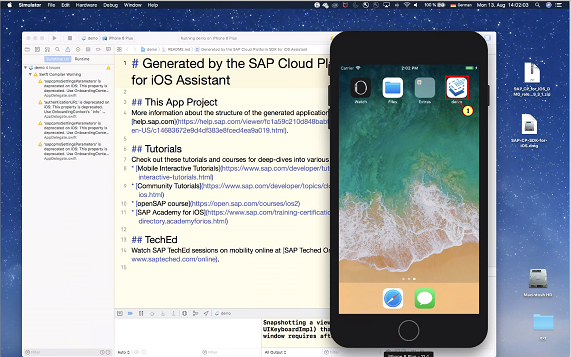

You noticed that there was no passcode/finger print required while restoring the application from background to foreground.
 **Note** :  *In an Assistant generated Xcode project, default passcode Policy is disabled in `OnboardingManager.swift` class.*  *But if you would like to have passcode policy get enabled in your application, you need to enable it manually from SAP Cloud Platform Mobile Services Cockpit. Then these policies will be pulled from Mobile Services at runtime.*

[DONE]
[ACCORDION-END]

[ACCORDION-BEGIN [Step 3: ](Enable passcode policy in SAP Cloud Platform Mobile Services Cockpit)]

Switch back to Mobile Services cockpit to look into application created by iOS SDK Assistant. Click .

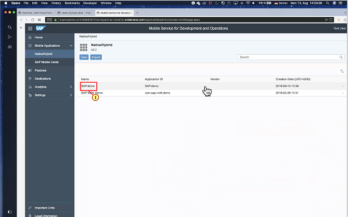

Click 
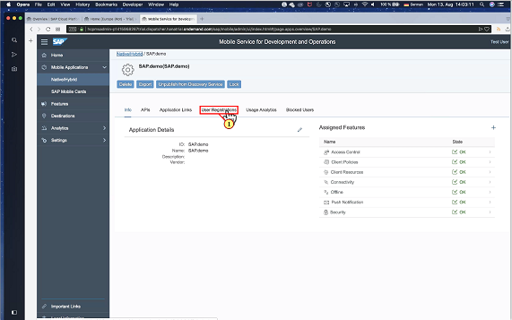
Here you can see User registration details and then Click .
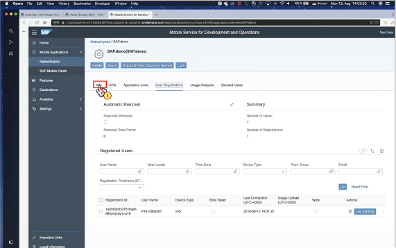

Click 
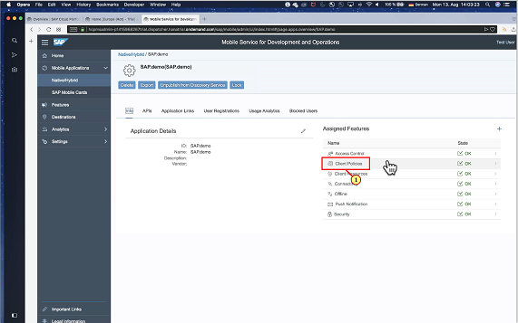

Click 
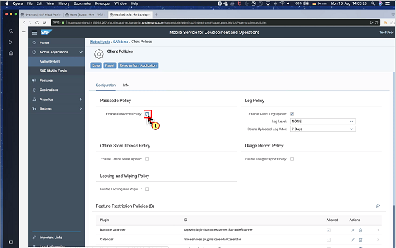

Change Min. length to 5
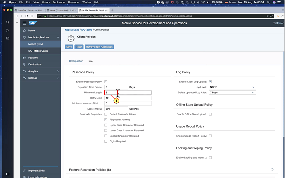

[VALIDATE_1]

Since application is already running on simulator, Finger print doesn't work here. Uncheck .
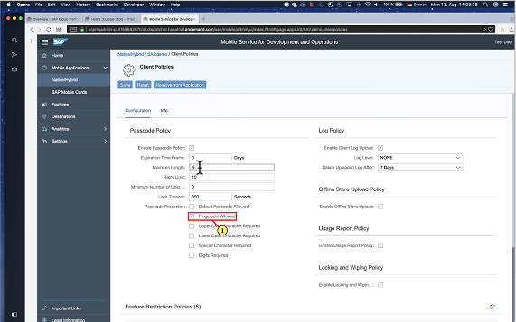

Click 

Click on  **Build and Run** icon to let the iOS Assistant create an application end point in the SAP Cloud Platform mobile services for your project.

Click  **Continue**
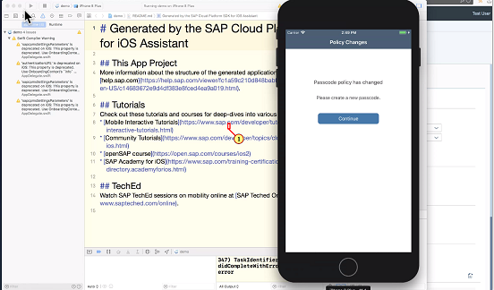

Choose a passcode

Click 

 re-enter same passcode
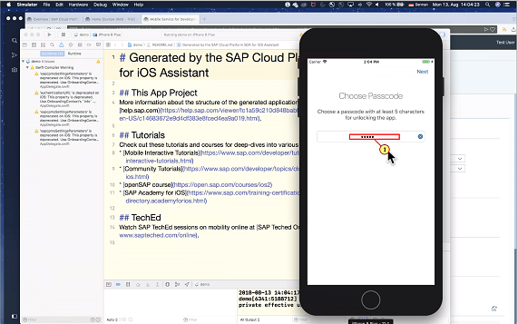

Click 
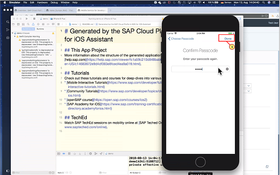

Click on simulator home icon to put application in background 
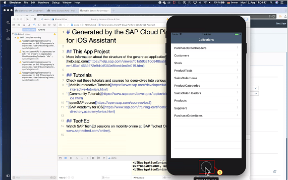

Click on application icon to bring app in foreground.
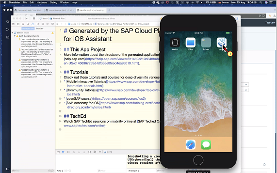

Enter the chosen passcode to application data
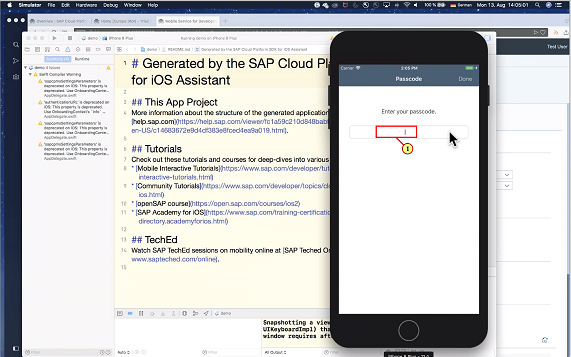

Click 
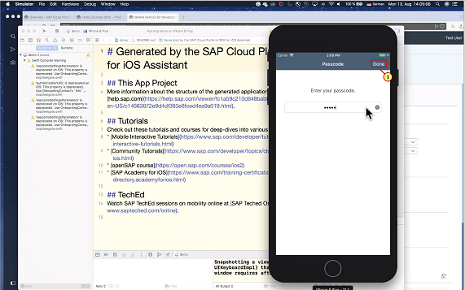

Application is restored and now protected with a passcode.
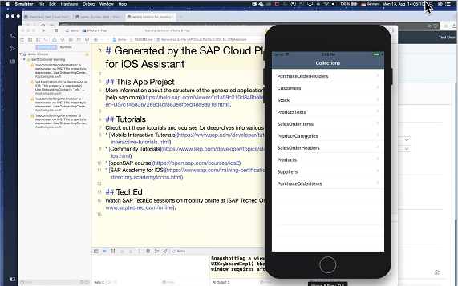

[ACCORDION-END]
