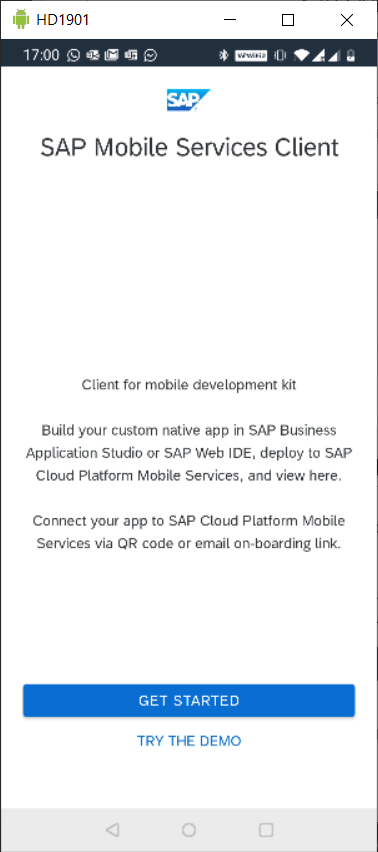

## Prerequisites
- **Tutorial** : [Set Up SAP Business Application Studio for Mobile Development](cp-mobile-bas-setup)

## Details
### You will learn
- To use the MTB wizard in BAS to build a MDK app.

Mobile Transaction Bridge offers the end user full flexibility in the choice of the consumption vehicle for the OData service that has been published. One may build a mobile app, a web app, deploy/publish the API endpoint from API Management Hub and so on.

However, in order to remain true to the core of the tool, templates made available in SAP Business Application Studio (BAS) allow for creation of fully usable apps based on the mobile development kit client (which is a metadata-driven app with a bunch of cool features).

In this tutorial, the focus is on using BAS and the related template.

---

[ACCORDION-BEGIN [Step 1: ](Invoke template to create an MDK app)]

1. In the **File** menu, click **New Project from Template**.

    !

2. In the following screen, scroll down if you need to, and click the **MTB Project** tile and then **Next**.

    !

    This will kick off the wizard which feeds basic elements the template requires to generate our app.

    >For the purposes of this wizard, unless otherwise specified, please press **Next** or **Finish** as required.

3. For the project name, enter `MTB_TUT`.

    !

    For target, you have an org `DW-PM` and a space called `MTB-Demo`. **Your details will vary**. The API details are picked up automatically and for this tutorial there is no need to edit this information.

    !

    For the service name section:

    - For **Service File Name**, enter `MTB_TUT_SRV`.  You can safely replace the text "Sample Service" as this is simply a placeholder.

    - In the **OData Source** dropdown, choose **Mobile Service**.

        A list of apps from your Mobile Services instance will be displayed.

        !

        Choose the application you are using, in this case, `com.sap.demo`.

[DONE]
[ACCORDION-END]

[ACCORDION-BEGIN [Step 2: ](Deploy the MDK app)]

Now it's time to deploy this application.

1. Expand the project, and find the file named `Application.app`.

    !

2. Right-click the file and from the context menu, click **MDK Deploy**.

    !

    This gives you a selection popup at the top of the main pane. Choose **Mobile Services**, since that is your starting point.

    !

    When the app has successfully deployed, you will see a success message in the bottom-right corner of the main pane.

    !

[VALIDATE_1]
[ACCORDION-END]

[ACCORDION-BEGIN [Step 3: ](Test the app on a mobile device)]

The mobile development kit client is a metadata driven application, meaning the app container stays the same but all the content can be manipulated on the fly.

Devices are onboarded by scanning a QR code.

1. Expand your project and find the `Application.app` file.

    !

    Click the file to open it in the main pane.

2. Once the file is open, find the **Application QR Code** label at the top of the file.

    !

    This will open a modal popup with a QR code. If you have to, close the console at the bottom of your screen by clicking the **X** for each open tab.

    !

3. On your mobile device, install the Mobile Services Client app from the store of your choice.

    !

4. Run the app. The first time you will get a license and T&C page.

    Press **Agree** if you wish to continue.

    !

5. The next screen provides a choice of working with a demo or pointing the app to a real app (which is what you want).

    Press **Get Started**.

    !

    If this is the first time you are using the app, the only option displayed is **QR Code Scan**. If you previously have configured an app, you will be asked if you want to load the current app or scan a QR code for a new app.

    Scan the QR code and, when finished scanning, press **Continue**.

    !

6. Log in to your SAP Cloud Platform tenant.

    !

    You will be asked to maintain a passcode and given the choice of using biometric id.

    Once you are done, the app update feature will ask if you want to update. Press **OK**.

    !

    Once the app is ready with the update, you will see a message at the bottom of your phone screen saying the service has been initialized. See the screenshot below as an example.

7. This is excellent, as you are now ready to use the application.

    !

    Press the **Find** link in the app.

    !

    In the resulting fields, choose any of the fields to fill out. For example, fill in the **LASTNAME** field and press **Execute**.

    !

    And voila!

    !

Here you have data, from the ABAP system, in a mobile application, using the OData service, built using the Mobile Transaction Bridge.

[DONE]
[ACCORDION-END]

---
