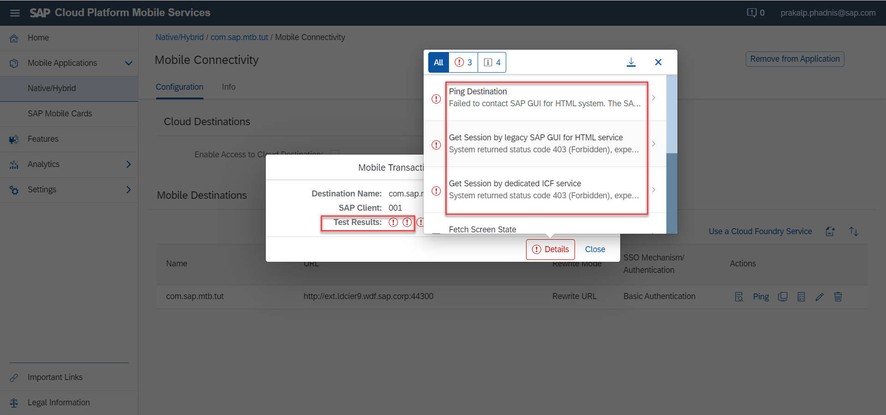

## Prerequisites
- [Set up your ABAP for Mobile Transaction Bridge](https://help.sap.com/doc/f53c64b93e5140918d676b927a3cd65b/Cloud/en-US/docs-en/guides/getting-started/mtb/prerequisites.html)
- **Tutorial** : [Liberate Your ABAP Transactions Using Mobile Transaction Bridge](cp-mobile-mtb-rec)

## Details
### You will learn
- To create and configure a Mobile Services app using a Mobile Transaction Bridge (MTB) OData service

Previously, you saw how to configure an ABAP system to support Mobile Transaction Bridge and then use the MTB to create and publish an OData Service. While you can use this service to build any type of modern front-end, you will see how to build a mobile application based on the mobile development kit client (MDK client) in just a few clicks.

---

[ACCORDION-BEGIN [Step 1: ](Create a Mobile Services app)]

1. Navigate to your Mobile Services admin cockpit.

    !

2. In the left navigation pane, choose **Native/Hybrid**, and then click **New** the top-right corner of the main pane.

    !

    Enter the details for the application, as follows:

    |  Field Name     | Value
    |  :------------- | :-------------
    |  ID           | **`com.sap.mtb.tut`**
    |  Name           | **`Tutorial Example App`**
    |  Description    | **`  - Description : An app to demonstrate Mobile Services configuration in the MTB tutorial.`**
    |  Vendor          | **`SAP`**
    |  License type   | **`Standard`**
    |  XSUAA Service | **`Default Instance`**

    Click **Next**.

    !

3. In the following popup, from the **Assign Features for:** dropdown, choose **Mobile Development Kit**.

    Some features in the list are automatically checked.

    - Leave the defaults as they are.

    - In addition, select **Mobile Transaction Bridge OData**.

    !

    Click **Finish**.

4. In the next popup, **Confirm Finish**, click **OK**.

    The app generation takes a few seconds

    !

    After the app is generated, the app details screen is shown.

    !

You now have a mobile services app. Let us configure it to point to the MTB service previously generated.

[VALIDATE_1]
[ACCORDION-END]

[ACCORDION-BEGIN [Step 2: ](Configure app to use MTB as the data source)]

Now that you have the app, connect it to your MTB service.

1. Navigate to the Mobile Services admin cockpit.

    !

2. In the left navigation pane, choose **Native/Hybrid**, and in the main pane choose the app you created in the previous step.

    !

    You should now see the app's details page.

3. In the **Assigned Features** pane, click the navigation link **Mobile Connectivity**.

    !

4. On the following page, create a new destination by clicking the **Create** icon.

    !

    In the modal popup, fill in the as follows (see the screenshot at the bottom of this section):

    |  Field Name     | Value
    |  :------------- | :-------------
    |  Destination Name           | Leave it as it is
    |  URL           | This is the target system URL (e.g., `_https://FQDN-of-ABAP-SYSTEM:port_number`)
&nbsp;

Usually, the ABAP system is located on-premise and requires a SAP Cloud Connector to be configured. Please retrieve the **Virtual host** URL as configured in your cloud connector if you are using one. If your system is accessible on the internet, then simply provide the URL to your system.

    |  Use Cloud Connector    | Checked (if using SAP Cloud Connector)
&nbsp;

Enter a Location ID for your SAP Cloud Connector if it is configured, else leave empty.

    |  Use Mobile Transaction Bridge          | Checked
    |  Mobile Transaction Bridge Recording   | **MTB-TUT**
    |  SAP Client | Your SAP Client number

    !

5. Click **Next** to go to the **Custom Headers** step.

    Click **Next** again to go to the **Annotations** step.

    Click **Next** to set the SSO mechanism for the connection. For this tutorial, set it to **Basic Authentication** and enter your credentials to access the ABAP backend system.

    !

6. Click **Finish**.

Excellent! Now a data source has been configured to match your app.

[DONE]
[ACCORDION-END]

[ACCORDION-BEGIN [Step 3: ](Run the pre-flight checklist)]

Debugging applications which traverse multiple layers of landscape topology can be difficult, if not downright daunting. MTB offers a simple tool that enables the user to run an automated checklist that determines if the basic technical criteria are met.

We call it the Pre-Flight Checklist.

At the end of the previous step, when you clicked on **Finish**, the resulting page was the **Destination Details** page.

1. In this page, at the top-left corner of the main pane, click on the **Mobile Connectivity** navigation link in the breadcrumbs.

    !

2. On the **Mobile Connectivity** overview page, click the pre-flight check icon.

    !

    Click **OK** in the resulting modal popup.

    The results popup shows an overview of the test. Click **Details** to see more details (reasons for failure) on each of the tests.

    Here is an example of some errors ...

    !

    ... and here is an example of a successful pre-flight check.

    !

3. Resolve any issues before moving on to the next step, which is building the MDK client.

Congratulations!! You have successfully created and configured a Mobile Services app to use the OData service built using MTB.

[DONE]
[ACCORDION-END]
