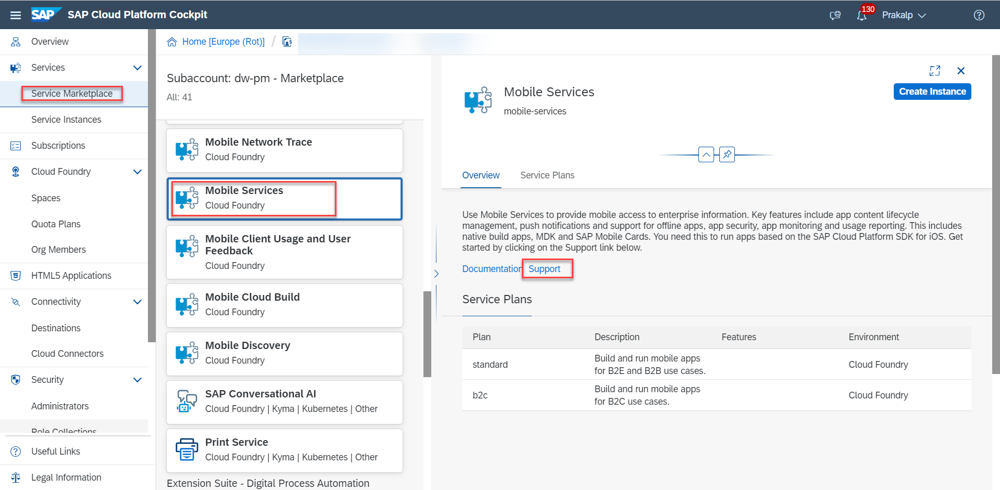
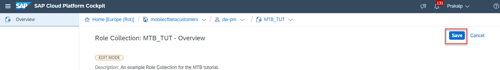
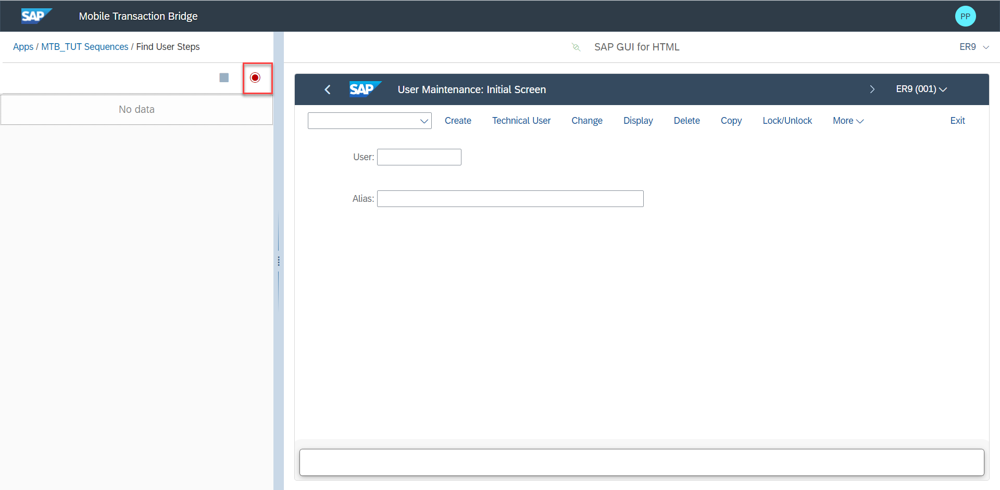

## Prerequisites
 - An ABAP system.
    - See [here](https://help.sap.com/doc/f53c64b93e5140918d676b927a3cd65b/Cloud/en-US/docs-en/guides/getting-started/mtb/prerequisites.html) for support matrix.
 - **Tutorial:** [How To access SAP Cloud Platform Mobile Services](fiori-ios-hcpms-setup)

## Details
### You will learn
  - How to enable Mobile Transaction Bridge.
  - How to connect Mobile Transaction Bridge to a backend ABAP system.
  - How to create a recording using Mobile Transaction Bridge.

### Background

Using the Mobile Transaction Bridge feature within Mobile Services cloud foundry, one can record classical ABAP transactions and generate an OData service on the fly which can then be consumed via any frontend of your choice. In the case of Business Application Studio or SAP Web IDE (if you are still using that), we have published templates that will help you generate mobile apps based on the Mobile Development Kit client.

---

[ACCORDION-BEGIN [Step 1: ](Enable Mobile Transaction Bridge)]

 In order to begin working with Mobile Transaction Bridge, you will need to initialize the feature in your Mobile Services Admin Cockpit.

1. Login to your accounts admin cockpit
2. Search for **Mobile Services** in the **Service Marketplace**
    !
3. Enter the **Mobile Services Admin cockpit** by clicking on the support link.
    !
4. In the left navigation pane, choose **Settings** and then choose **Mobile Transaction Bridge**.
    1. You should see an empty page with the Initialize button in the top right hand corner. Click on **Initialize**.
        !

The initialization takes a minute or so, please wait. Once done you should see the blank page populated with various options.

[DONE]
[ACCORDION-END]

[ACCORDION-BEGIN [Step 2: ](Familiarize yourself with the  Mobile Transaction Bridge Cockpit)]
The default selection is **Recordings**. In this pane it is self explanatory that one can either open the Recorder UI or copy it's link for distribution.

!

The **Back-end Systems** pane provides an overview of the configured ABAP backend systems and allows you to add new systems by clicking on the "Plus" icon. These systems are used during **design-time**.

!

The **Destinations** pane provides an overview of the destinations to backend systems (generally via the SAP Cloud Connector) that are used to retrieve data. You can of course create new destinations here as well, by clicking on the "Create" icon.

!

The **Security** pane displays information about the OAuth Client and API endpoints. Generally, it is not necessary to make any changes in this pane.

!

Now that we have initialized the MTB feature and looked at some of its configuration options, let us begin with maintaining the necessary configuration in order to be able to start creating our first recording.

[VALIDATE_1]
[ACCORDION-END]

[ACCORDION-BEGIN [Step 3: ](Maintain Back-end ABAP system)]

1. Go to the MTB landing page and click on **Back-end Systems**

2. Since this is the first time we are looking at MTB in this space, there are no systems maintained. In order to do so, click on the **+** icon.

    !

3. In the resulting modal window, give the target system a descriptive name, I have used the SID of the ABAP system here. In the URL field, use the URL where the **`webgui`** (SAP GUI for HTML) is accessible for your system.

    !

    Once you save the pane should show you the system you have just created.

    !

4. Now that we have a back-end ABAP system to target, let us open the Recorder. We can do this by clicking on the **Open Recorder** button in the top right corner of the page.

    !

[DONE]
[ACCORDION-END]

[ACCORDION-BEGIN [Step 4: ](Open Mobile Transaction Bridge Recorder)]

If you are running through this tutorial sequentially, then you will have pressed the **Open Recorder** button as the last action in Step 2.

If not and you are returning to this point in the tutorial, then go to **Mobile Services Admin cockpit** in the left navigation pane, choose **Mobile Transaction Bridge** and on the landing page, in the top right corner of the pane, click on the **Open Recorder** button.

In both cases, it should result in a new tab being opened in your browser and you being presented with a logon screen.

Please enter your credentials for your cloud account to login.

!

**NOTE :** When accessing the Recorder for the first time, you will see the following authorization error.

!

To fix this, we need to assign the MTB application and users the relevant role.

1. Navigate back to the subaccount level.

    !

2. In the left navigation pane, click on **Security** (see screenshot in #1)

    1. In the same pane click on **Role Collections** (see screenshot in #1)

      !

3. On the following page, in the main pane, click on the **plus icon**, located in the top right corner.

    !   

4. In the following modal window, enter a name for your collection and a description if you wish and click on **Create**.

    !

5. Now that the role collection has been created, let us edit this collection by adding roles and users to it.

    !

6. Click on the role collection (here, `"MTB_TUT"`) which will open up the Role Collection Overview page. Here click on the **Edit** button in the top right corner of the main pane.

    **NOTE :** Please be patient, it may take a few seconds before the UI will allow you to enter or search for roles.

    !

7. Now that we are in **Edit Mode** let us add a Role and a User to this collection.
    1. We add a Role by choosing the dropdown beside **Role Name** and finding the `**TransactionBridgeAdministrator**` role.   
    2. Under **Application Identifier** find `**com-sap-mobile-mtb-<your-space-and-some-numbers>**`.

        !

**NOTE :** We are using the Administrator Role here as an example. You will of course choose between the usage types that are appropriate.

Now let us save the Role Collection by pressing the **Save** button in the top right hand corner.

  !

Go back to the recorder and **Log Off**
    !

Now, Logging back in should bring you into the Recorder.
    !

Take special note of the message in the left pane of the browser window and the little red icon indicating a disconnected message in the middle of the right pane header.

This is because we have not yet enabled the `WebGUIConnector`. This connector provides the hooks if you will into the SAP GUI for HTML (aka. Web GUI) that you see in the right pane and is a key component in enabling us to record the transactions we want to use.

[DONE]
[ACCORDION-END]

[ACCORDION-BEGIN [Step 5: ](Enable the `WebGUIConnector`)]

### The SAP GUI and the SAP GUI for HTML (`WebGUI`) both allow for theming. Therefore the `WebGUI` screenshots may look different from what you see. Please try to either change the theme or identify the settings based on your theme.

The `WebGUIConnector` setting is accessed via the menu found under the **More** navigation link in the main pane.

!

Here we are going to change or rather enable two settings,
1. The **OK field**, which is where one types in the various ABAP Transactions.
    ! !
2. The `**WebGUIConnector**`
    ! !

Once you press **Save** make sure you refresh your browser window.

*Note* The `WebGUIConnector` is made available via the explicit allocation of the `**S_WEBGUI**` authorization in the backend system. See the **Configuring the ABAP Backend** prerequisites for more details.

Having refreshed the browser window, you should now see the following,

 !

 Press the **OK** button which will allow the `WebGUIConnector`to connect and will in turn remove the error message in the left pane and turn the icon **Green**.

 !

 Great! Now we are ready to start creating a recording.

[DONE]
[ACCORDION-END]

[ACCORDION-BEGIN [Step 6: ](Record an ABAP Transaction)]

Now that we have all the bits an pieces in place, lets go create our recording.

For the purposes of universality, we are going to use the ABAP transaction **SU01**.

Picking up from where we were at the end of the last step, enter **SU01** in the OK field of your `WebGUI` in the main pane and press the Enter button.

!

Since this is a fresh space, there are no apps currently built in the left pane. To do so, let us press the **Plus** icon in the recorder pane.

!

In the following modal pop-up, enter a name for your app and optionally a description. Then press the **Create** button.

!

In the next screen, you will see that the app you created previously, has appeared in the **Recorder** pane on the left and the transaction is open in the pane on the right.

!

### We are now ready to add **Sequences** and **Steps** to our recording.

Let us begin with a simple sequence to find a user.

1. Click on the app in the **Recorder**, the left pane, to begin by adding a **Sequence**.
  1. Do so, by clicking on the **Plus** icon within the Recorder.
      !
  2. Now, in the modal popup, enter a name for the sequence and optionally a description. Once done, press the **Create** button.
      !
  3. Now we are ready to fill the sequence with steps.

*Note* Clicking on the newly created sequence will open the pane from within which you will start the recording.

The **red** record button within the recorder is used to start a recording.

!

Once pressed, a red border appears around the `webgui` and indicates that all the following steps, clicks, actions and so on will be recorder as steps. These will immediately be visible in the recorder pane.

!

1. Place the cursor in the "User" field.
    1. When the "Magnifying glass" icon appears, press it.
      !
2. In the following modal window, choose the fields you want to use as input fields.
    !
      1. In this case, let us use
          1. First name
          2. Last name
          3. Building
      2. We will choose the fields want to add by
          1. Clicking on the **Configure** button in the top left corner of the main pane.
          2. Then click on the **plus** icon beside each of the displayed fields.
          3. After which we will **Add** the result in the **Recorder** pane.
            1. *Note* -  In this case, I am unchecking the Mandatory checkbox in the recorder for simplicity.
              !
            2. *Note* - When a field has been successfully added, a **Green tick mark** replaces the plus icon.
              !
3. Once done,
    1. First leave the selection mode by clicking on the **Configure** button.

    2. Click on the **Find** button in the main pane.

        !

4. This will bring up a table of results (remember we did not specify any particular user).
5. Here when we press the **Configure** button, we are given the option of adding the result set as an output.
    1. Choose the entire table by clicking on the **plus** icon at the top right corner of the results table.

    2. and in the **Recorder** mark the checkbox next to the **Label**. This will choose the entire result set.

        !

6. Once you see the green tick marks, we are ready to exit the recorder for this step by
    1. Clicking on the **Configure** button to exit selection mode.

    2. Pressing the **Stop** button in the **Recorder**

    3. And finally, as an option, pressing the red 'X' at the bottom right, in the window in our main pane.

!

[DONE]
[ACCORDION-END]

[ACCORDION-BEGIN [Step 7: ](Publish the Recording)]

### We are now ready to publish the recording to the Mobile Services account. ###

1. Using the breadcrumbs in the **Recorder**, navigate back to the list of Apps.

!

2. When you can see the app, find and click on the **Magic Wand** icon.

!

3. In the following modal popup, click on, **OK**.

!

4. Finally, confirm the next popup which should inform you that the app has been successfully published.

!

Once this is done, let us navigate to the Mobile Services cockpit from where we started the recorder.

Here in the Mobile Transaction Bridge pane, under **Recordings** we should see the app / recording we have just published!

!

### Congratulations!! You have now created and published your first recording using the Mobile Transaction Bridge.

[DONE]
[ACCORDION-END]
---
