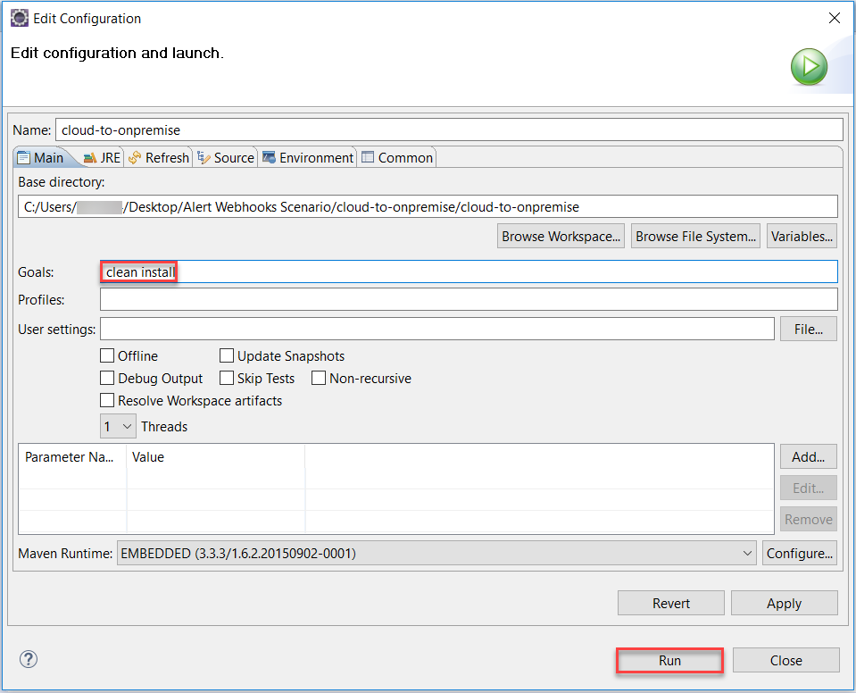
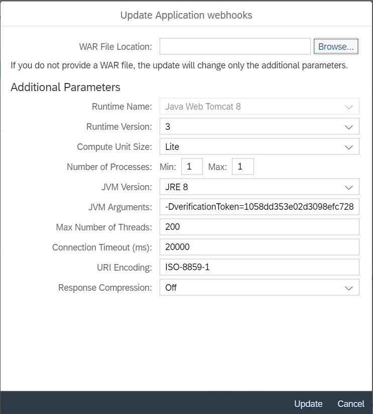
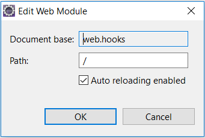
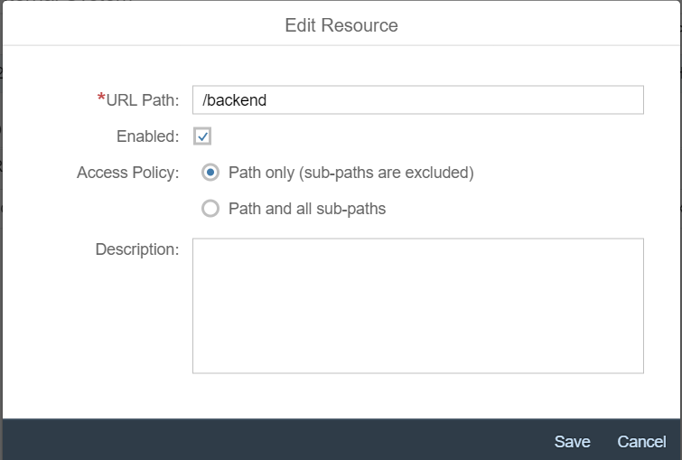
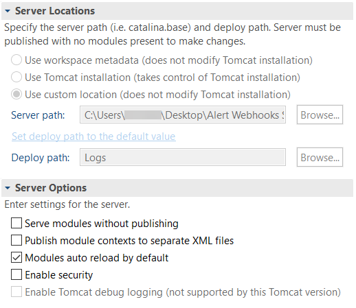

<!-- loio152a1abd1a1f4618baaa6e43f55e37df -->

## Prerequisites
 - **Proficiency:** Intermediate
- You have an SAP Cloud Platform account and subaccount. See [Getting Started](https://help.sap.com/viewer/65de2977205c403bbc107264b8eccf4b/Cloud/en-US/144e1733d0d64d58a7176e817fa6aeb3.html).
- You have active SAP Cloud Platform resources (applications) to receive alerts for.
- You have installed Maven. See [Apache Maven](http://maven.apache.org/).
- You have downloaded and set up your Eclipse IDE, SAP Cloud Platform Tools for Java, and SDK. See [Set Up Your Development Environment](https://help.sap.com/viewer/65de2977205c403bbc107264b8eccf4b/Cloud/en-US/d75fd1cd44e74f1eb134dec95337baaa.html#loio87430948ec0f4b0ca82465600ab6e219).
    > To build the project into a WAR file, you need `Maven Integration for Eclipse WTP`.
- You have set up Java Web Tomcat 8 as a runtime environment. See **Java Web Tomcat 8 Runtime** in [Set Up the Runtime Environment](https://help.sap.com/viewer/65de2977205c403bbc107264b8eccf4b/Cloud/en-US/7613f000711e1014839a8273b0e91070.html).
- You have downloaded and initially configured the Cloud Connector. For this tutorial, you can use the portable version. See [Cloud Connector](https://help.sap.com/viewer/cca91383641e40ffbe03bdc78f00f681/Cloud/en-US/e6c7616abb5710148cfcf3e75d96d596.html).


## Details
### You will learn
  - How to connect with an on-premise system so that your alerts will be processed locally.

### Time to Complete
50 min

This tutorial describes the configuration with a Java Web Tomcat 8 runtime. However, you can change these settings to match with your runtime environment.

---

[ACCORDION-BEGIN [Step 1: ](Download the cloud-to-onpremise project)]

Download the project as a ZIP file from [https://github.com/SAP/cloud-sample-webhooks](https://github.com/SAP/cloud-sample-webhooks) and extract the files into a local folder.

[DONE]

[ACCORDION-END]

[ACCORDION-BEGIN [Step 2: ](Import the folder into Eclipse as a Maven project)]

Choose **File** > **Import…** > **Maven** > **Existing Maven Projects** and follow the steps from the wizard.

[DONE]

[ACCORDION-END]

[ACCORDION-BEGIN [Step 3: ](Build the project with Maven to generate a WAR file)]

Choose **Run As** > **Maven build…**, specify **clean install** for the **Goals** field, and run the build.



You should find the generated WAR file in a **target** directory of your local folder.

In the text area below, enter the text you inserted in the **Goals** field, and then choose **Validate**.

[VALIDATE_1]

[ACCORDION-END]

[ACCORDION-BEGIN [Step 4: ](Deploy the WAR file on the cloud)]

Deploy the file on Java Web Tomcat 8 runtime and then start the application. See [Deploying Applications](https://help.sap.com/viewer/65de2977205c403bbc107264b8eccf4b/Cloud/en-US/e5dfbc6cbb5710149279f67fb43d4e5d.html#loioe5dfbc6cbb5710149279f67fb43d4e5d__deploying).

[DONE]

[ACCORDION-END]

[ACCORDION-BEGIN [Step 5: ](Register an OAuth client)]

The webhooks application is protected with OAuth. See [Register an OAuth Client](https://help.sap.com/viewer/65de2977205c403bbc107264b8eccf4b/Cloud/en-US/7e658b3e4cea4a79b035d0f1d2798c1f.html#loio61d8095aa39547c7b30d9aeda771497f).

> You also need to select the **Client Credentials** authorization grant.

[DONE]

[ACCORDION-END]

[ACCORDION-BEGIN [Step 6: ](Create an OAuth client and obtain access token)]

You need the access token to call the Alerting Channels REST API. See [Using Platform APIs](https://help.sap.com/viewer/65de2977205c403bbc107264b8eccf4b/Cloud/en-US/392af9d162694d6595499f1549978aa6.html).

> Select **Monitoring Service** API and make sure that the **Manage Alerting Channels** scope is included.

Answer the question below, and then choose **Validate**.

[VALIDATE_2]

[ACCORDION-END]

[ACCORDION-BEGIN [Step 7: ](Create POST request to get verification token)]

Use the following code in the body of the Alerting Channels REST call:

```json

{
 "type": "WEBHOOK",
"application": "app_to_receive_alerts_for",
 "parameters": {
                    "url": "application_URL/webhook",
                    "authentication": {
                        "authenticationType": "OAUTH2",
                        "client": "registered_client_ID",
                        "secret": "registered_client_secret",
                        "oAuthServerUrl": "token_endpoint_URL?grant_type=client_credentials"
                    }
                }
}

```

- Replace `application_URL` with the **webhook** application URL. You can find it in the cloud cockpit when you select the deployed **webhook** application.

- Replace `registered_client_ID` and `registered_client_secret` with the client ID and secret created when registering the OAuth client for the **webhook** application.

- Replace `token_endpoint_URL` with the URL shown for the subaccount at **Security** > **OAuth** > **Branding** > **Token Endpoint** in the cloud cockpit.

> The **application** parameter is optional, and you do not specify it for alerts on account level. See [Alerting Channels REST API](https://api.sap.com/api/HCP_Alerting).

[DONE]

[ACCORDION-END]

[ACCORDION-BEGIN [Step 8: ](Provide the token as a system property)]

Select the application in the cloud cockpit, choose the **Update** button, and enter the verification token as a JVM argument (`-DverificationToken=<verification_token>`).



Finally, restart the application for your change to take effect.

In the text area below, enter the text you inserted in the **JVM Arguments** field, and then choose **Validate**.

[VALIDATE_3]

[ACCORDION-END]

[ACCORDION-BEGIN [Step 9: ](Deploy the WAR file locally)]

Use Java Web Tomcat 8 server and **com.sap.cloud.samples.web.hooks.web** > **BackendSystemServlet.java** servlet. Furthermore, on the **Web Modules** page of **Java Web Tomcat 8 Server**, set the path `/`. See [Deploy Locally from Eclipse IDE](https://help.sap.com/viewer/65de2977205c403bbc107264b8eccf4b/Cloud/en-US/0f16c9db4a9c407abb1b4987c0afe714.html).



[DONE]

[ACCORDION-END]

[ACCORDION-BEGIN [Step 10: ](Configure the Cloud Connector)]

1.   Start the cloud connector.

2.   Configure the access control.

    Go to the **Cloud to On-Premise** view and add the mapping `/backend`.

    

In the text area below, enter the text you inserted in the **URL Path** field, and then choose **Validate**.

[VALIDATE_4]

[ACCORDION-END]

[ACCORDION-BEGIN [Step 11: ](Configure cloud destination to the on-premise system)]

1.   Log on to the cloud cockpit.

2.   Select the subaccount.

3.   Go to **Connectivity** > **Destinations**.

4.   Create a new destination with the following values:

    |Field Name    |Value                                            |
    |:-------------|:------------------------------------------------|
    |Name          |`on-premise-destination`                         |
    |Type          |`HTTP`                                           |
    |URL           |`http://<virtual host>:<virtual port>/backend`   |
    |Proxy Type    |`OnPremise`                                      |
    |Authentication|`NoAuthentication`                               |

    See [Configure the Destination in the Cloud](https://help.sap.com/viewer/cca91383641e40ffbe03bdc78f00f681/Cloud/en-US/e76f9e75bb571014a7218bcd30a8771b.html#loioe76f9e75bb571014a7218bcd30a8771b__configure_destination_cloud).

    > The virtual host and port are configured in the cloud connector under **Cloud To On-Premise** > **Access Control** > **Mapping Virtual to Internal System**.

In the text area below, enter the name you used for the destination, and then choose **Validate**.

[VALIDATE_5]

[ACCORDION-END]

[ACCORDION-BEGIN [Step 12: ](Test that you receive alerts)]

Trigger an alert by setting low threshold values (for example, Warning Threshold = 0.00001 and Critical Threshold = 0.0001). You should receive the alert as an `alert_<timestamp>.json` file locally in the server's workspace folder.

> You can set a custom location by updating the server and deploy paths in Eclipse. In that case, the file will be generated in the deploy path that is inside the server path.
>
> 

[DONE]

[ACCORDION-END]
