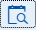
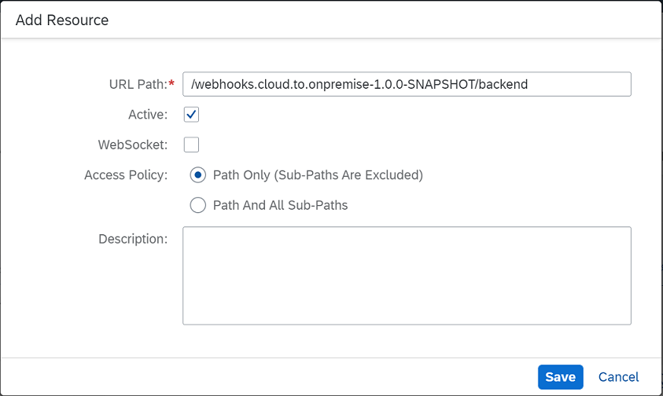

# Receive Alerts in Your On-Premise System Using Java Web Tomcat 8
<!-- description --> Configure a connection with an on-premise system to receive alert notifications locally. For example, extend your on-premise application in the corporate network to show alerts for critical or warning metrics of an SAP BTP application in the Neo environment or to take self-healing actions. Furthermore, use the Alerting Channels REST API to configure the channel for receiving such alert notifications.


<!-- loio152a1abd1a1f4618baaa6e43f55e37df -->

## Prerequisites
- **You have a productive global account and a subaccount.**
  For more information, See [Getting Started with a Customer Account in the Neo Environment](https://help.sap.com/viewer/ea72206b834e4ace9cd834feed6c0e09/Cloud/en-US/1b335bad21724350b0afca66b2db2ce6.html).
- You have active resources (applications) to receive alerts for.
- You have installed Maven. See [Welcome to Apache Maven](http://maven.apache.org/).
- You have installed SAP BTP SDK for the Neo environment (Java Web Tomcat 8) and set up the Console Client. See [Setting Up the Development Environment](https://help.sap.com/viewer/ea72206b834e4ace9cd834feed6c0e09/Cloud/en-US/e815ca4cbb5710148376c549fd74c0db.html).
- You have Installed SAP JVM. See [(Optional) Install SAP JVM](https://help.sap.com/viewer/ea72206b834e4ace9cd834feed6c0e09/Cloud/en-US/76137f42711e1014839a8273b0e91070.html).
- You have configured the environment variables as you specify the **JAVA HOME** variable to the **`jre`** folder of the installed SAP JVM and the **Path** variable to the **bin** folder of the installed Apache Maven.
- You have downloaded and initially configured the Cloud Connector.
  For this tutorial, you can use the portable version. For more information, see [Cloud Connector](https://help.sap.com/viewer/cca91383641e40ffbe03bdc78f00f681/Cloud/en-US/e6c7616abb5710148cfcf3e75d96d596.html).

## You will learn
- How to connect with an on-premise system so that your alerts will be processed locally

## Intro
This tutorial describes the configuration with a Java Web Tomcat 8 runtime. However, you can change these settings to match with your runtime environment.

To learn more about the whole scenario, read [Receiving Alerts in the Corporate On-Premise System](https://blogs.sap.com/2021/02/05/receiving-alerts-in-the-corporate-on-premise-system-2/).

---

### Download the cloud-to-onpremise project


Download the project as a ZIP file from [https://github.com/SAP/cloud-sample-webhooks](https://github.com/SAP/cloud-sample-webhooks) and extract the files into a local folder.


### Go to the folder


Open the Command prompt and go to the project\'s local folder **`cloud-sample-webhooks-main`**.


### Build the project with Maven to generate a WAR file


Run the command `mvn clean install` to compile, test, and package the `cloud-sample-webhooks-main` project.

You can now find your packaged `webhooks.cloud.to.onpremise-1.0.0-SNAPSHOT.war` file in the **target** folder.

In the text area below, enter the command you used to compile, test, and package the `cloud-sample-webhooks-main` project.


### Deploy the WAR file on the cloud


Deploy the file on Java Web Tomcat 8 runtime and then start the application. For more information, see [Deploying Applications](https://help.sap.com/viewer/ea72206b834e4ace9cd834feed6c0e09/Cloud/en-US/e5dfbc6cbb5710149279f67fb43d4e5d.html#loioe5dfbc6cbb5710149279f67fb43d4e5d__deploying).


### Register an OAuth client


The webhooks application is protected with OAuth. For more information, see [Register an OAuth Client](https://help.sap.com/viewer/ea72206b834e4ace9cd834feed6c0e09/Cloud/en-US/7e658b3e4cea4a79b035d0f1d2798c1f.html#loio61d8095aa39547c7b30d9aeda771497f).

> You also need to select the **Client Credentials** authorization grant.


### Create an OAuth client and obtain access token


You need the access token to call the Alerting Channels REST API. For more information, see [Using Platform APIs](https://help.sap.com/viewer/ea72206b834e4ace9cd834feed6c0e09/Cloud/en-US/392af9d162694d6595499f1549978aa6.html).

> Select **Monitoring Service** API and make sure that the **Manage Alerting Channels** scope is included.


### Create POST request to get verification token


Create a POST request with one of the following URIs:

- Account level: `https://api.{host}/alerting/v2/channels/accounts/{subaccountName}/types/webhook`
- Application level:
`https://api.{host}/alerting/v2/channels//accounts/{subaccountName}/apps/{appName}/types/webhook`

> The application parameter in the URI is optional, and you do not specify it for alerts on account level.

Use the following code in the body of the Alerting Channels REST call:

```JSON
{
                    "url": "application_URL/webhook",
                    "authentication": {
                        "authenticationType": "oauth2",
                        "client": "registered_client_ID",
                        "secret": "registered_client_secret",
                        "oAuthServerUrl": "token_endpoint_URL?grant_type=client_credentials"
                      }
}
```

- Replace `application_URL` with the **webhook** application URL. You can find it in the SAP BTP cockpit when you select the deployed **webhook** application.

- Replace `registered_client_ID` and `registered_client_secret` with the client ID and secret created when registering the OAuth client for the **webhook** application.
> These are not the client ID and secret that you created for the platform API.

- Replace `token_endpoint_URL` with the URL shown for the subaccount at **Security** > **OAuth** > **Branding** > **Token Endpoint** in the SAP BTP cockpit.

Furthermore, use the access token as a bearer token in the Authorization for the REST API call.

For more information, see [Alerting Channels REST API](https://api.sap.com/api/HCP_Alerting).


### Provide the token as a system property


Select the application in the SAP BTP cockpit, choose the **Update** button, and enter the verification token as a JVM argument (`-DverificationToken=<verification_token>`).


Finally, restart the application for your change to take effect.

In the text area below, enter the text you inserted in the **JVM Arguments** field.


### Deploy the WAR file locally


Use Java Web Tomcat 8 server and deploy the WAR file locally. See [Deploy Locally with the Console Client](https://help.sap.com/viewer/ea72206b834e4ace9cd834feed6c0e09/Cloud/en-US/937c833b72bb101490cf767db0e91070.html).


### Configure the Cloud Connector


1.   Start the cloud connector.

    > After you have configured the Cloud Connector as mentioned in **Prerequisites**, make sure that it connects to the internal system by using .

2.   Configure the access control.

    Go to the **Cloud to On-Premise** view and add the resource `/webhooks.cloud.to.onpremise-1.0.0-SNAPSHOT/backend`.

    

In the text area below, enter the text you inserted in the **URL Path** field.


### Configure cloud destination to the on-premise system


1.   Log on to the SAP BTP cockpit.

2.   Select the subaccount.

3.   Go to **Connectivity** > **Destinations**.

4.   Create a new destination with the following values:

    |Field Name    |Value                                                                                    |
    |:-------------|:----------------------------------------------------------------------------------------|
    |Name          |`on-premise-destination`                                                                 |
    |Type          |`HTTP`                                                                                   |
    |URL           |`http://<virtual host>:<virtual port>/webhooks.cloud.to.onpremise-1.0.0-SNAPSHOT/backend`|
    |Proxy Type    |`OnPremise`                                                                              |
    |Authentication|`NoAuthentication`                                                                       |

    For more information, see [Configure the Destination in the Cloud](https://help.sap.com/viewer/b865ed651e414196b39f8922db2122c7/Cloud/en-US/e76f9e75bb571014a7218bcd30a8771b.html#loioe76f9e75bb571014a7218bcd30a8771b__configure_destination_cloud).

    > The virtual host and port are configured in the cloud connector under **Cloud To On-Premise** > **Access Control** > **Mapping Virtual to Internal System**.

5. Check that the connection to the on-premise destination is successful.

In the text area below, enter the name you used for the destination.


### Test that you receive alerts


Trigger an alert by setting low threshold values (for example, Warning Threshold = 0.00001 and Critical Threshold = 0.0001 for the availability check of the application). You should receive the alert as an `alert_<timestamp>.json` file locally in the server's workspace folder (usually in the **`…/webapps/webhooks.cloud.to.onpremise-1.0.0-SNAPSHOT`** folder).

