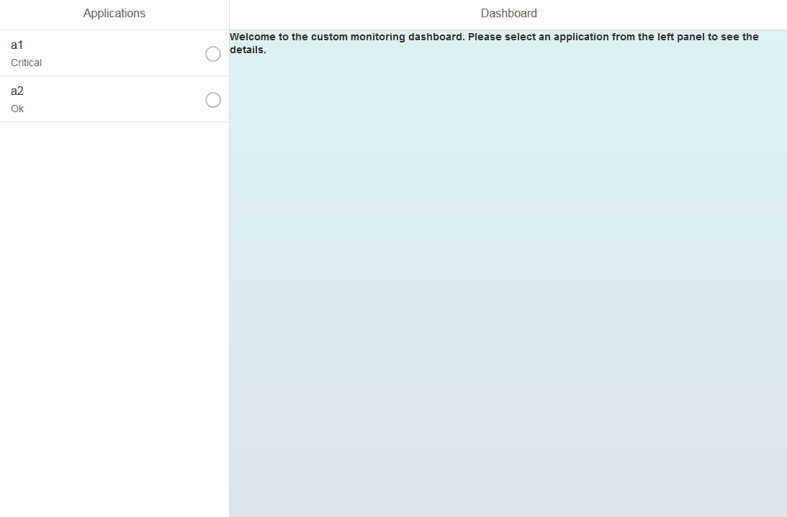
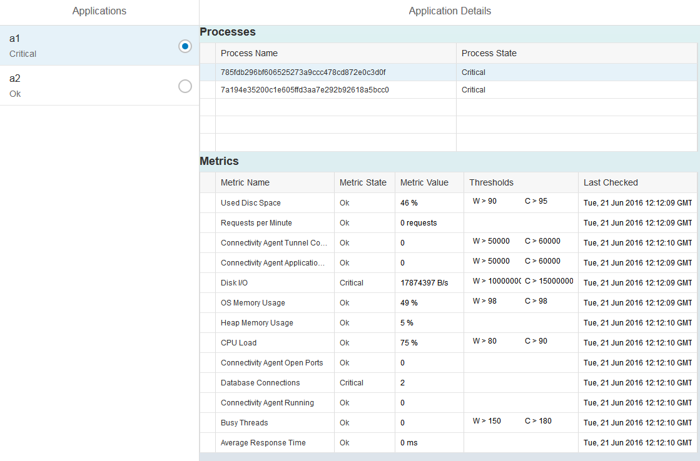

<!-- loioe4aec18cf61747a7afd531a3cfef590c -->

## Prerequisites
-   To test the entire scenario, you need subaccounts in two regions: Europe (Rot/Germany) and US East. For more information, see [Regions and Hosts Available for the Neo Environment](https://help.sap.com/viewer/ea72206b834e4ace9cd834feed6c0e09/Cloud/en-US/d722f7cea9ec408b85db4c3dcba07b52.html) and [SAP BTP Cockpit](https://help.sap.com/viewer/ea72206b834e4ace9cd834feed6c0e09/Cloud/en-US/19d7119265474dd18ec16fad2a0b28c1.html).
-   To retrieve the metrics from Java applications, you need two deployed and running Java applications. For more information, see [Java: Application Operations](https://help.sap.com/viewer/ea72206b834e4ace9cd834feed6c0e09/Cloud/en-US/76f6dcfab9ec481dae0843873271d66c.html).
- You have installed Maven.
- You have downloaded and set up your Eclipse IDE, SAP BTP Tools for Java, and SDK.
  For more information, see [Setting Up the Development Environment](https://help.sap.com/viewer/ea72206b834e4ace9cd834feed6c0e09/Cloud/en-US/e815ca4cbb5710148376c549fd74c0db.html).

## Details
### You will learn
- How to configure a custom application that retrieves metrics for Java applications running in the Neo environment.

The application you create shows the states of the Java applications and can also show the state and metrics of the processes running on those applications.

This tutorial uses a Java project published on GitHub. This project contains a dashboard application that requests the metrics of the following Java applications (running in SAP BTP, Neo environment):

-   `app1` located in `a1` subaccount and `Europe (Rot/Germany)` region

-   `app2` located in `a2` subaccount and `US East` region


After receiving each JSON response, the dashboard application parses the response and retrieves the name and state of each application as well as the name, state, value, thresholds, unit, and timestamp of the metrics for each process. The data is arranged in a list and then shown in the browser as a dashboard.

For more information about the JSON response, see [SAP Monitoring Service Response for Java Applications](https://help.sap.com/viewer/64f7d2b06c6b40a9b3097860c5930641/Cloud/en-US/a8cf72ccc97b4e498ee2c09e69700e3d.html).

To learn more about the whole scenario, read the [Dashboard Scenario blog post](https://blogs.sap.com/2021/02/05/use-the-monitoring-service-to-retrieve-metrics-from-different-java-applications-in-the-neo-environment/).

---

[ACCORDION-BEGIN [Step 1: ](Download the project)]

Download the `cloud-metrics-dashboard` project as a ZIP file from [https://github.com/SAP/cloud-metrics-dashboard](https://github.com/SAP/cloud-metrics-dashboard).

[DONE]

[ACCORDION-END]

[ACCORDION-BEGIN [Step 2: ](Import into Eclipse)]

Extract the files into a local folder and import the folder in Eclipse as an existing Maven project.

> You can also upload your project by copying the URL from GitHub and pasting it as a Git repository path or URI after you switch to the Git perspective. Remember to switch back to a Java perspective afterward.

[VALIDATE_1]
[ACCORDION-END]

[ACCORDION-BEGIN [Step 3: ](Update Configuration.java)]

In Eclipse, open the `Configuration.java` class and update the following information:

- Your logon credentials

- Your Java applications, and their subaccounts and regions (hosts)


```Java
private final String user = "my_username";
private final String password = "my_password";
private final List<ApplicationConfiguration> appsList = new ArrayList<ApplicationConfiguration>();

public void configure(){
                        String landscapeFQDN1 = "api.hana.ondemand.com";
                        String account1 = "a1";
                        String application1 = "app1";
                        ApplicationConfiguration app1Config = new ApplicationConfiguration(application1, account1, landscapeFQDN1);
                        this.appsList.add(app1Config);

                        String landscapeFQDN2 = "api.us1.hana.ondemand.com";
                        String account2 = "a2";
                        String application2 = "app2";
                        ApplicationConfiguration app2Config = new ApplicationConfiguration(application2, account2, landscapeFQDN2);
                        this.appsList.add(app2Config);
}
```

> The example shows only two applications, but you can create more and add them to the list.

[VALIDATE_2]
[ACCORDION-END]

[ACCORDION-BEGIN [Step 4: ](Test your scenario)]

1.   Start your Java applications.

    You can retrieve metrics only for running Java applications.

    > View the status of your Java applications and start them in the SAP BTP cockpit.

2.   Create a Java Web server (for example, Java Web Tomcat 8 server) in Eclipse and start it.

3.   Run your Eclipse project on the server.

4.   Verify the following:

    -   Initially, the dashboard displays all the states of the Java applications.

        !

    -   When you select an application, you can view the states of the application's processes.

    -   When you select a process, you can view the process's metrics.

        !

        > An empty field in the *Thresholds* column signifies that the warning and critical values are set to zeros.

[VALIDATE_3]
[ACCORDION-END]
