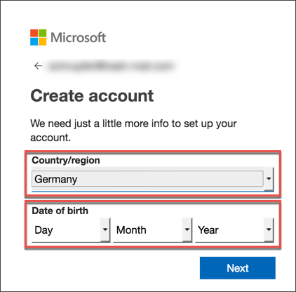
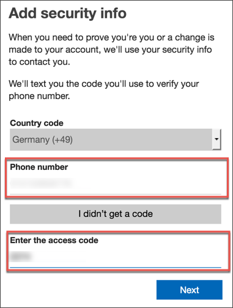
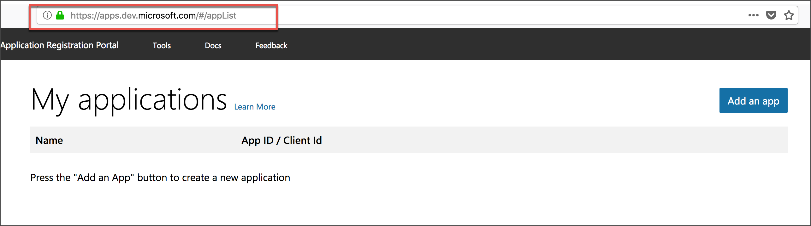

## Details
### You will learn  
  - How to sign up for a free Microsoft account, which you need later to use Microsoft APIs

[ACCORDION-BEGIN [Step 1: ](Create a new Microsoft account)]

Go to **<https://apps.dev.microsoft.com>** and click **Create one** to create a new account.

Enter an existing mail address and click **Next**.

In the following step choose a password for your account and click **Next**.

You will now be asked to provide your first and last name.

Afterwards, provide information about your country and enter your date of birth, and then click **Next**.

[DONE]
[ACCORDION-END]

[ACCORDION-BEGIN [Step 2: ](Verify your mail account)]

Microsoft sends a verification code to the mail address you provided in the beginning.

Enter this code and proceed with **Next**.

[DONE]
[ACCORDION-END]

[ACCORDION-BEGIN [Step 3: ](Add security information)]

Microsoft also asks you to add a phone number. You will, for instance, get notified when somebody tries to modify the account.

Enter a phone number and click **Send Code**. You should receive another verification code on your phone.

You are now done with the registration for an Microsoft account.

Copy the URL of your Application Registration Portal (`https://apps.dev.microsoft.com`) and paste it in the text field below.

[VALIDATE_2]

[ACCORDION-END]

---
