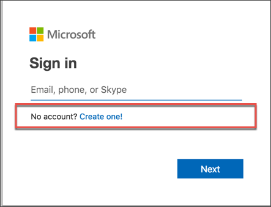
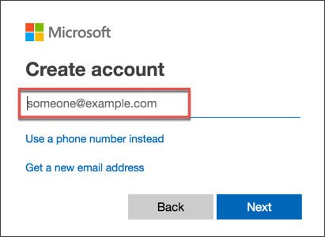
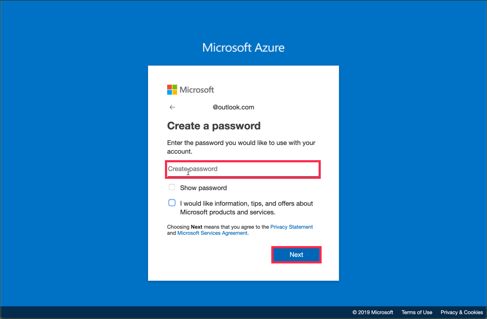
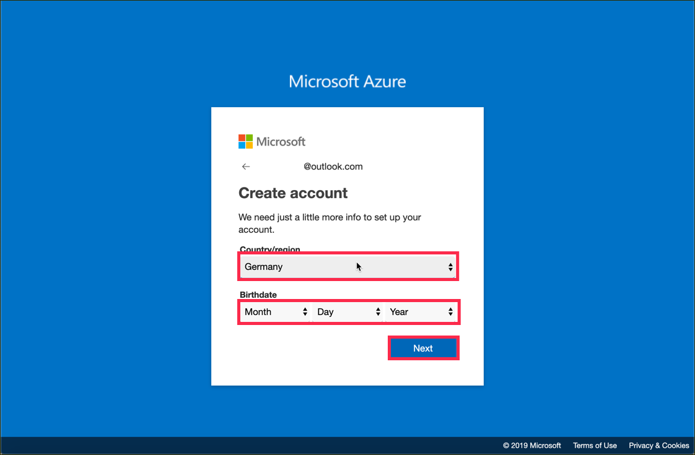
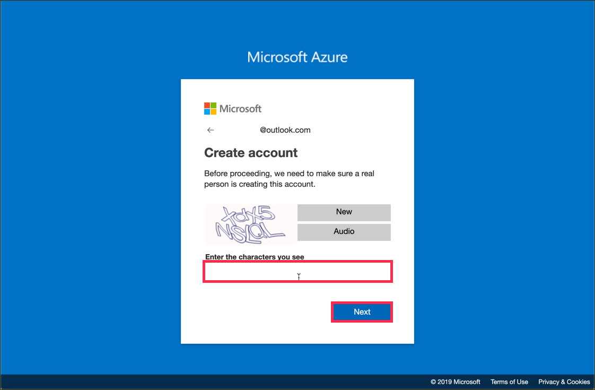
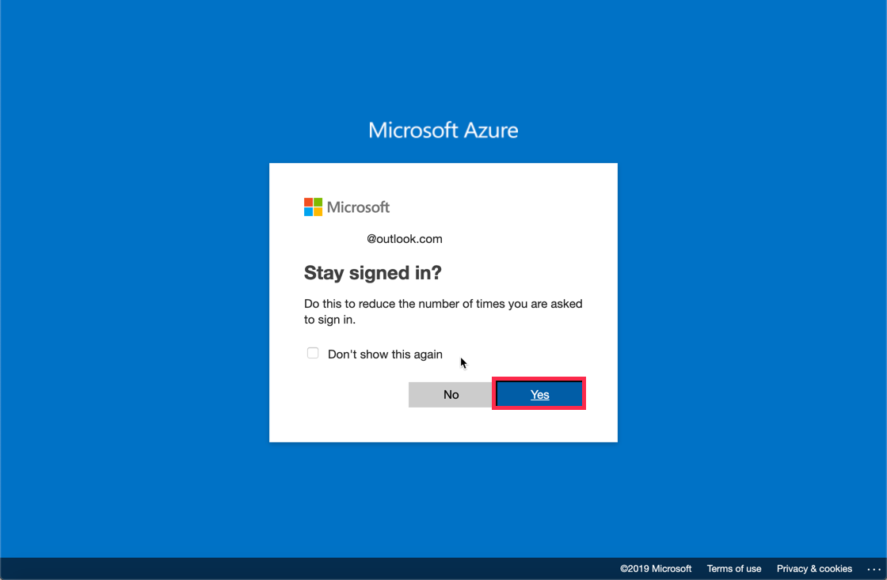
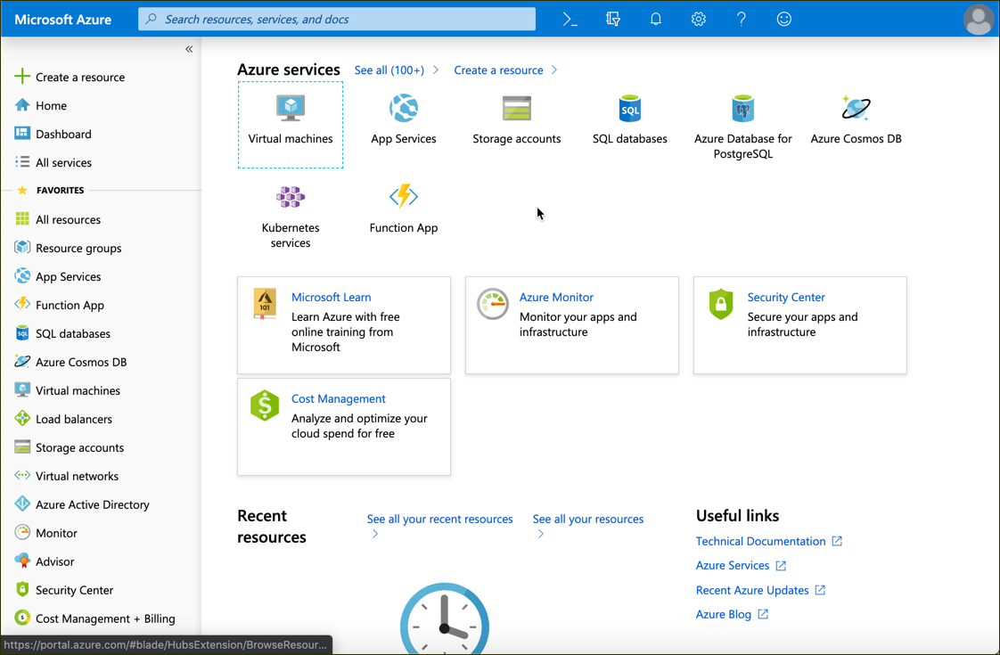

## Details
### You will learn  
  - How to sign up for a free Microsoft Azure account, which you need later to use Microsoft APIs

[ACCORDION-BEGIN [Step : ](Create a new Microsoft account)]

Go to **<https://portal.azure.com/>** and click **Create one** to create a new account.

Click **Get a new email address**. Alternatively, you can also enter an existing mail address and click **Next**.

In the following step choose a password for your account and click **Next**.

[DONE]
[ACCORDION-END]

[ACCORDION-BEGIN [Step : ](Create a password)]

Define a secure password with which you want to secure your access to the Azure portal and confirm with **Next**.

[DONE]
[ACCORDION-END]

[ACCORDION-BEGIN [Step : ](Add security information)]
1. Provide information about your country and enter your date of birth, and then click **Next**.

    

2. Solve the captcha to proof that you are a human and proceed with **Next**.

    

3. You are now done with the registration for an Microsoft account. Confirm the last screen with **Yes** if you would like to stay signed in.

    

You should now be redirect to the Azure portal. Copy the URL of the Portal and paste it in the text field below.

[VALIDATE_1]
[ACCORDION-END]

---
