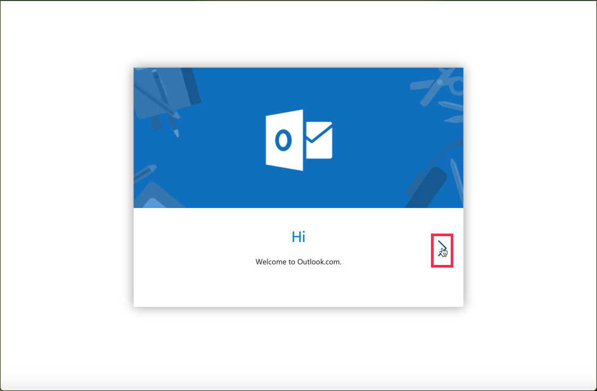
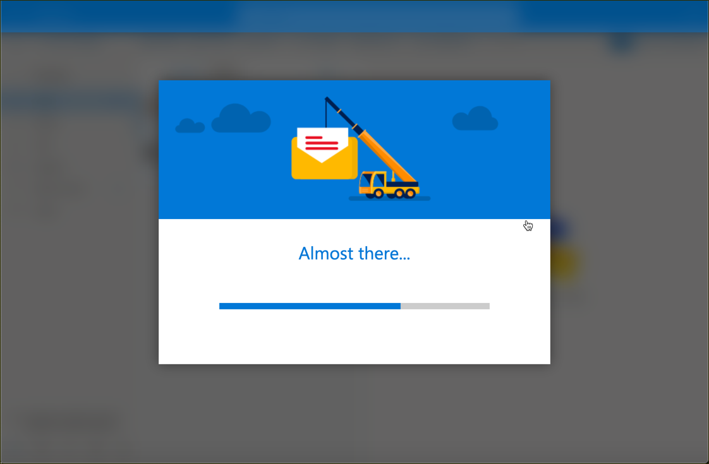
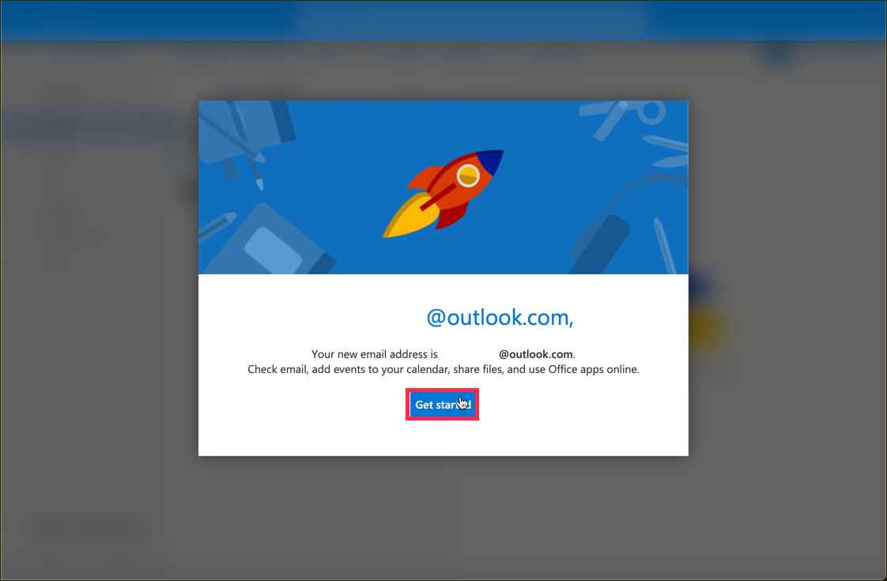

## Prerequisites  
 - A Microsoft account

## Details
### You will learn  
  - How to create an `@outlook.com` mail address

You will setup the `@outlook.com` inbox for your recently created Microsoft Azure account.  This will be needed later to receive and consume some sample data.

---

[ACCORDION-BEGIN [Step : ](Go to your Microsoft profile)]

Go to **`https://outlook.live.com`** where you should see the following flash screen.

Click on the arrow pointing to the right to step through the sign up.

[DONE]
[ACCORDION-END]

[ACCORDION-BEGIN [Step : ](Wait for the signup to finish)]

This sign up might take a couple of seconds.

[DONE]
[ACCORDION-END]
[ACCORDION-BEGIN [Step : ](Confirm your new email address)]

You should now see a popup with your email address.

Write the name of the created `@outlook.com` address in the text field below and confirm with **Get started**

[VALIDATE_1]
[ACCORDION-END]

---
