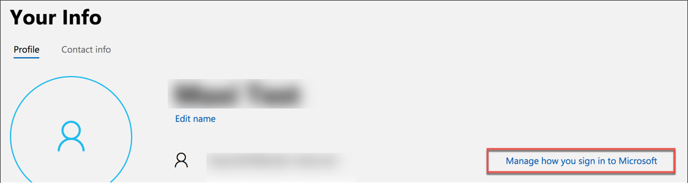
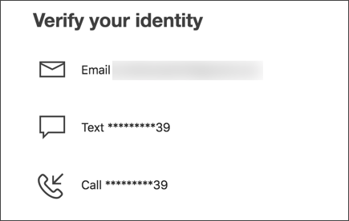
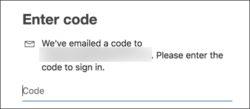
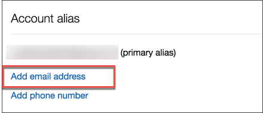
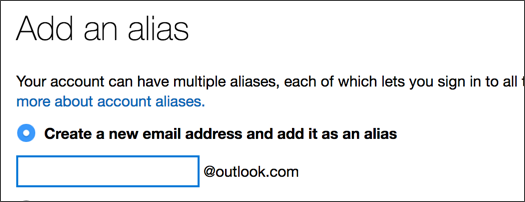

## Prerequisites  
 - A Microsoft account

## Details
### You will learn  
  - How to create an `@outlook.com` mail address

You will configure your recently created Microsoft account and get an `@outlook.com` email address.  This will be needed later to receive and consume some sample data.

---

[ACCORDION-BEGIN [Step 1: ](Go to your Microsoft profile)]

Copy the URL **`https://account.microsoft.com/profile/`** and paste it into your browser, click **Manage how you sign in to Microsoft** to navigate to your account configuration.

Enter your password and proceed with **Sign in**.

Choose one of the verification options to generate a verification code.

Enter your verification code you received on the channel of your choice and go to the next step via **Verify**.

[DONE]
[ACCORDION-END]

[ACCORDION-BEGIN [Step 2: ](Create a new mail address)]

To create a new mail address go to **Add email address**.

You can now create your own `@outlook.com` mail address which will later be used in this mission. Fill in a mail address which you want to have.

Write the name of the created `@outlook.com` address in the text field below then click **Validate**.

[VALIDATE_1]

[ACCORDION-END]

---
