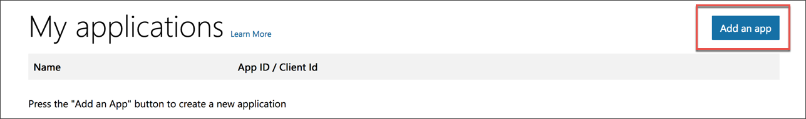
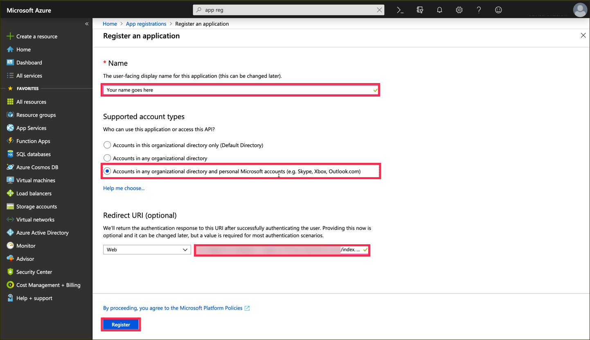
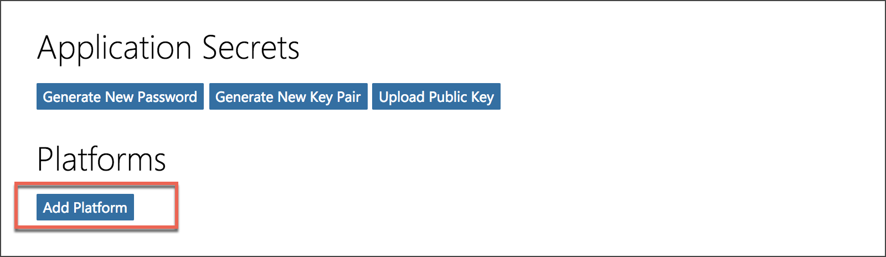
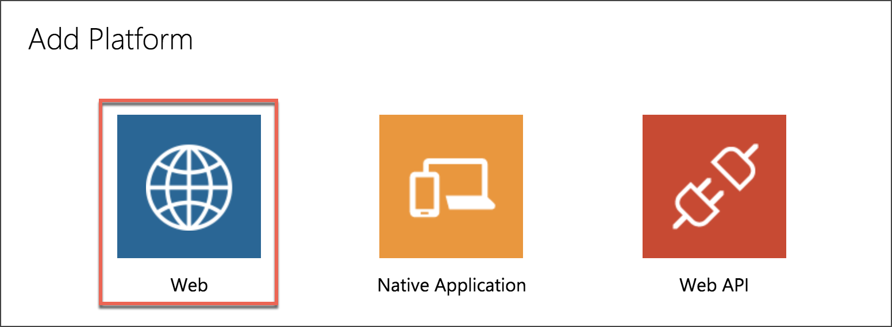
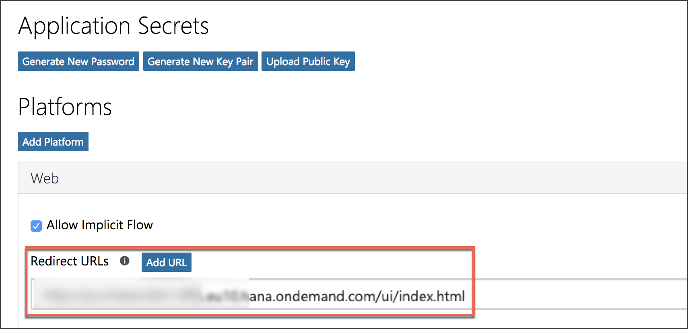
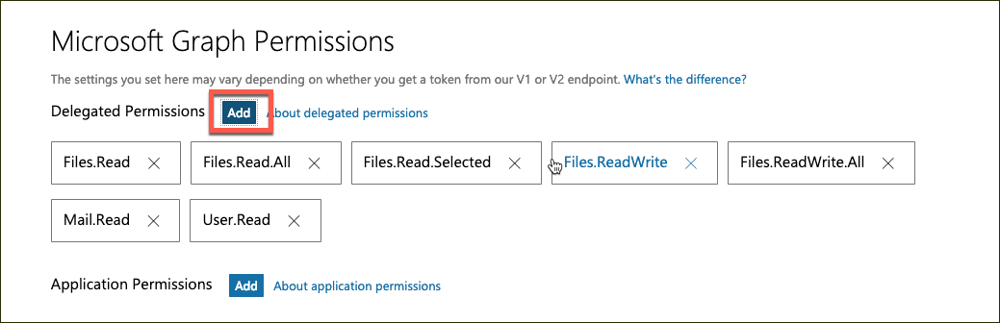
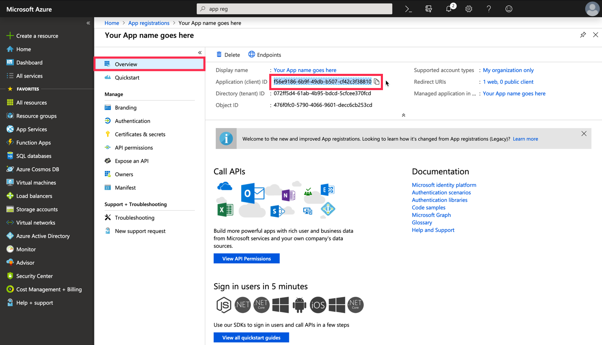

## Details
### You will learn
  - How to register app in the Microsoft Application Registration Portal
  - Why access tokens are needs to access Microsoft Graph

---

[ACCORDION-BEGIN [Step ](Open the fork to register a new app )]

Go to <https://apps.dev.microsoft.com/#/appList> and click on **Add an app** on the upper right corner.

You should now give your application a certain name. This name will not appear anyway and has no technical implication.

[DONE]
[ACCORDION-END]

[ACCORDION-BEGIN [Step : ](Name the app)]

Replace `Your App name goes here` with an application name of your choice and proceed with **Create**.

[DONE]
[ACCORDION-END]

[ACCORDION-BEGIN [Step : ](Specify the platform)]

 Navigate to the **Platforms** sections and click on **Add Platform**.

Select **Web** in order to configure a new application.

[DONE]
[ACCORDION-END]

[ACCORDION-BEGIN [Step : ](Define the redirect URL)]

Add the URL of your SAPUI5 application you have deployed in the previous tutorial.

> You can also add `http://localhost:8000` as an additional Redirect URL in case you wish to test the application locally as well.

[DONE]
[ACCORDION-END]

[ACCORDION-BEGIN [Step : ](Define the accessible permissions)]

To enable your application to search for emails navigate to `Microsoft Graph Permissions`, click on **Add** and select the **`Mail.Read`**, **`Files.Read.All`**, **`Files.Read.Selected`**, **`Files.ReadWrite`**, **`Files.ReadWrite.All`**, and **`User.Read`** permissions.

> These listed permissions are a superset of the permissions your app actually needs. Your application decides at runtime which permissions it actually wants to request.

[DONE]
[ACCORDION-END]

[ACCORDION-BEGIN [Step : ](Get the application Id)]

Save the changes and scroll to the top to **save** app id in your clipboard or a new file, you will need it in the next tutorial.

> You (and the users of your application) can revoke the given permissions at <https://myapps.microsoft.com> [for Microsoft Office 365 users] or <https://account.live.com/consent/Manage> [for `outlook.com` users].

[VALIDATE_1]
[ACCORDION-END]

---
