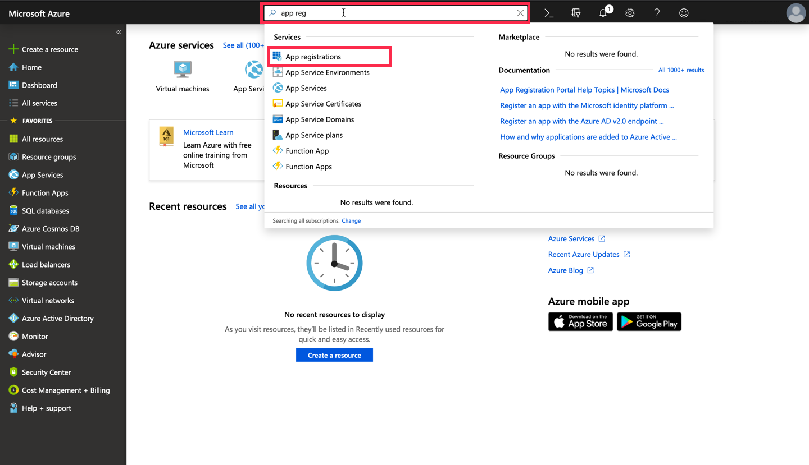
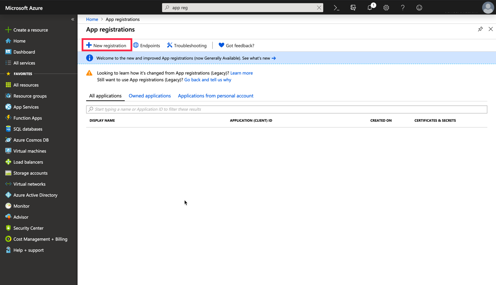
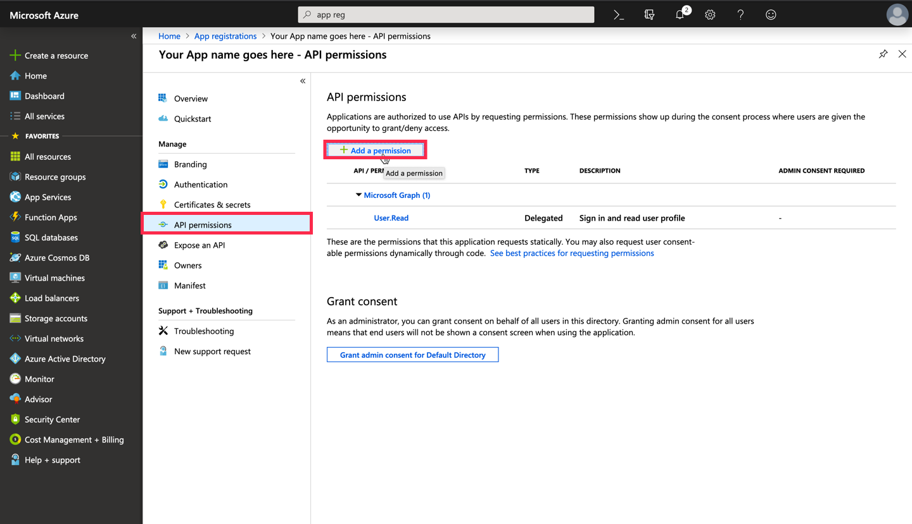
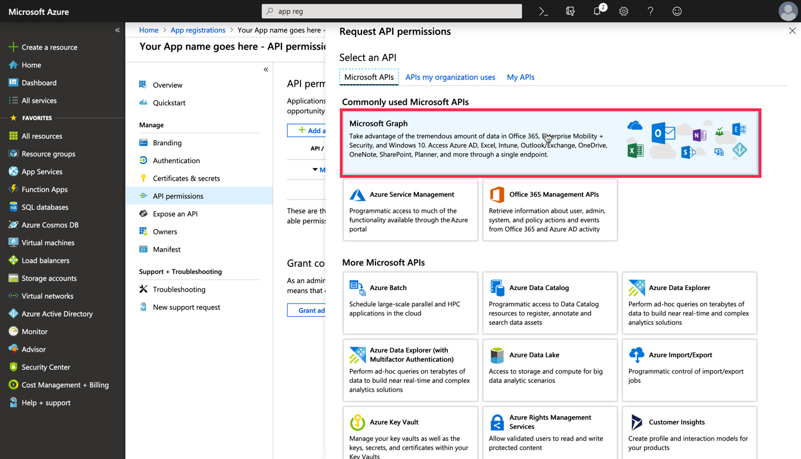
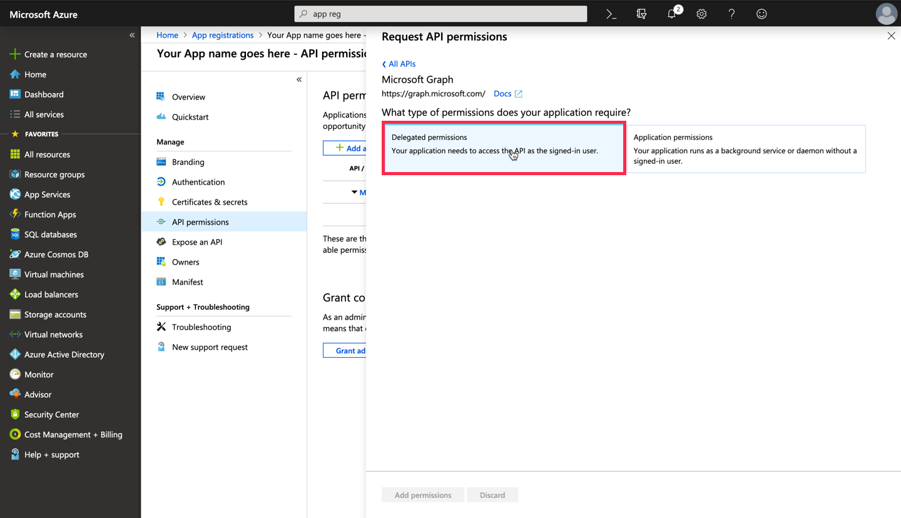
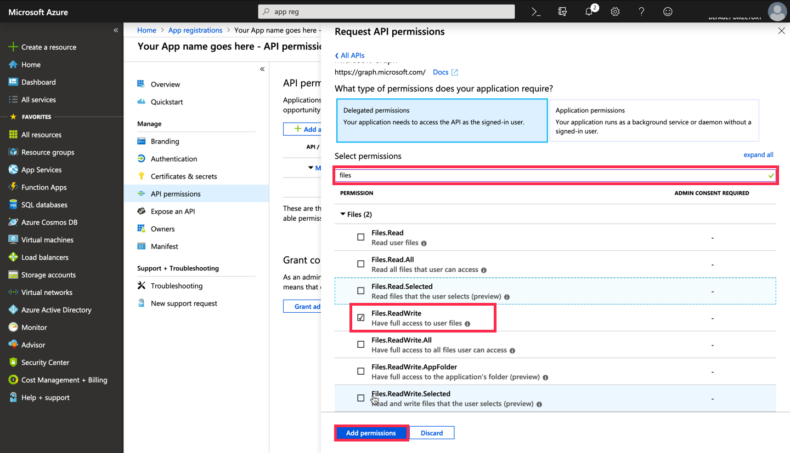
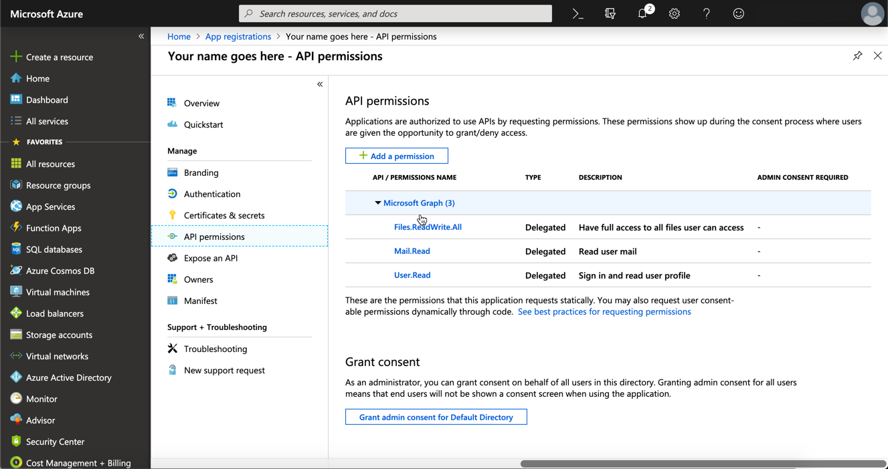
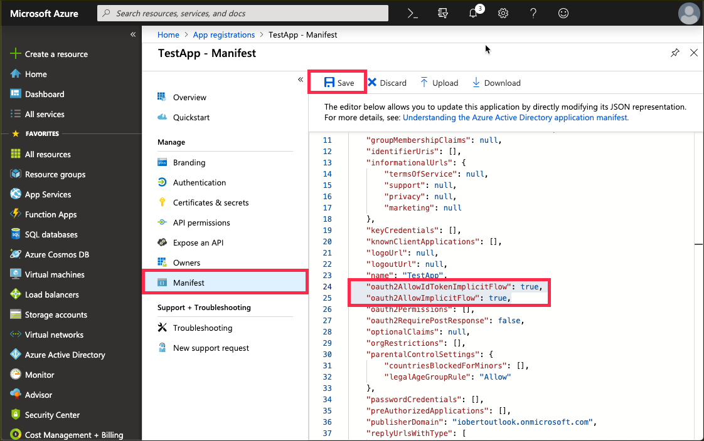

## Details
### You will learn
  - How to register app in the Microsoft Azure Portal
  - Why access tokens are needs to access Microsoft Graph

---

[ACCORDION-BEGIN [Step ](Go to the App Registration page in the Azure Portal)]

Go to <https://portal.azure.com/#blade/Microsoft_AAD_RegisteredApps/ApplicationsListBlade>

Alternatively, you can also search for **`App reg`** in the search bar to get to the same page.

[DONE]
[ACCORDION-END]
[ACCORDION-BEGIN [Step : ](Register a new app)]

Click on **New Registration** on the upper left corner.

[DONE]
[ACCORDION-END]
[ACCORDION-BEGIN [Step : ](Configure the new registration)]

1. You should now give your application a certain name. This name will be visible when the user logs into your app for the very first time.
2. Make sure the **Supported account types** are set to **
Accounts in any organizational directory and personal Microsoft accounts** to allow the usage of personal accounts.
3. Add the URL of your SAPUI5 application you have deployed in the previous tutorial.
4. Proceed with **Register**.

[VALIDATE_1]
[ACCORDION-END]
[ACCORDION-BEGIN [Step : ](Define the permissions)]

1. To enable your application to access data from the Microsoft Graph like emails and documents, navigate to `API Permissions`, click on **Add a permission**.

    

2. Choose the **Microsoft Graph** tile as we want to access those APIs.

    

3. When asked for the type of permissions, select **Delegated Permission** as the user will delegate the app to access the Microsoft Graph API.

     

4. Use the search bar to filter the required permissions. Select the **`Mail.Read`**, **`Files.ReadWrite.All`** and  **`Files.Read`** permissions and confirm with **Add Permission**.

    > These listed permissions are a superset of the permissions your app actually needs. Your application specifies at runtime which permissions it actually wants to request.

     

5. Check that all permission have been added to your app registration.

      

[DONE]
[ACCORDION-END]
[ACCORDION-BEGIN [Step : ](Enable the OAuth2 Implicit Flow)]

1. Navigate to the **Manifest** section in the side panel.
2. Change the fields **oauth2AllowIdTokenImplicitFlow** and **oauth2AllowImplicitFlow** to **`true`** to enable the implicit flow.
3. Confirm with **Save**.

[DONE]
[ACCORDION-END]
[ACCORDION-BEGIN [Step : ](Get the application Id)]

Navigate to the **Overview** section in the side panel and look for the field  **Application (client) ID**. Save this id as you will need it in the next tutorial. You can use the button next to the id to copy it to your clipboard.

> You (and the users of your application) can revoke the given permissions at <https://myapps.microsoft.com> [for Microsoft Office 365 users] or <https://account.live.com/consent/Manage> [for `outlook.com` users].

[DONE]
[ACCORDION-END]

---
