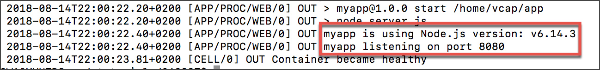
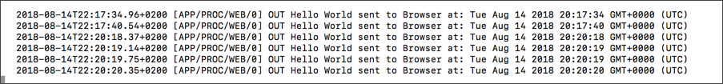

## Prerequisites  
 - A text editor (e.g., Notepad, Atom, Sublime)

## Details
### You will learn  
  - How to add basic logging to an application
  - Different ways to access SAP Business Technology Platform, Cloud Foundry environment application logs
  - Additional Cloud Foundry CLI commands

---

[ACCORDION-BEGIN [Step 1: ](Add some more logging information)]

Your app right produces output in two different ways. On the one hand, it logs which port it is using when your app is started properly. And on the other hand, it sends a response (`'Hello World'`) when the HTTP endpoint is accessed.

Add two more pieces of logging information. Change the `server.js` file accordingly:

```JavaScript
const express = require('express');
const app = express();

app.get('/', function (req, res) {
  res.send('Hello World!');
  console.log('Hello World sent to Browser at: ' + new Date() ); //new line
});

const port = process.env.PORT || 3000;
app.listen(port, function () {
  console.log('myapp is using Node.js version: ' + process.version); //new line
  console.log('myapp listening on port ' + port);
});
```

You added two additional logging statements. The first one logs the time whenever the endpoint is accessed. The second one informs about which Node.js version is used when the web server is started.

> The version of Node.js that is used by SAP BTP, Cloud Foundry environment can differ from the one that is used locally. The `package.json` file doesn't specify which `engine.version` (i.e. version of node ) SAP BTP, Cloud Foundry environment should use. Therefore, SAP BTP, Cloud Foundry environment uses a default version. Step 4 will show the logged out and the version which is actually used by Cloud Foundry. For more information about the usage of `engine.version`, refer to [Cloud Foundry documentation](https://docs.cloudfoundry.org/buildpacks/node/index.html).

[DONE]

[ACCORDION-END]

[ACCORDION-BEGIN [Step 2: ](Delete the existing application)]

It's not necessary to delete a application before you re-deploy it to SAP BTP, Cloud Foundry environment. But at some point in time it might be useful to know this command. Please be aware that the logs will also be removed when you delete an app.

To delete the app, execute the following command:

```bash
cf delete myapp
```

> This step is not mandatory but good to know.

Verify if your application has successfully been removed by checking your application overview:

```bash
cf apps
```

[DONE]

[ACCORDION-END]


[ACCORDION-BEGIN [Step 3: ](Push the updated application)]

To push the updated `Node.js` application, execute the following command in the `nodetutorial` directory.

```bash
cf push
```

Verify if the application has successfully been started by checking your application overview:

```bash
cf apps
```

[VALIDATE_1]

[ACCORDION-END]

[ACCORDION-BEGIN [Step 4: ](Dump application logs)]

There are mainly two different ways how logs can be shown.

The first option is to dump recent log messages of an application to the terminal by:

```bash
cf logs myapp --recent
```  

There you can already see what happened at the deployment process which will be helpful if something went wrong and your application couldn't be started.



> The screenshot should also show a different log output of your application as when it runs locally. The node version was implicitly set: e.g. `'myapp is using Node.js version: v6.14.3'`. The port on which the application is now accessible is also different from the one on your local machine. The application takes the environment variable `'port'` which is here port 8080.

[DONE]

[ACCORDION-END]

[ACCORDION-BEGIN [Step 5: ](Stream application logs)]
The second option is to stream the logs. Unlike the dumping, streaming of logs can be helpful for special use cases like live-debugging your application. The application writes log messages when it serves web requests. Run the following command to access them 'live':

**On macOS / Linux:**

```bash
cf logs myapp | grep -v RTR
```

**On Windows:**
```Command Line
cf logs myapp | findstr /V RTR
```


Every time someone accesses the application via the according URL your terminal will print an new line. `'grep -v RTR'` (on macOS/Linux) or `'findstr /V RTR'` (on Windows) excludes specific logs from the so called Router. This could also be omitted and is only for demonstration purposes.



[DONE]

[ACCORDION-END]


---
