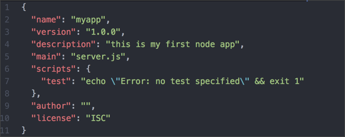

## Prerequisites  
- A text editor (e.g., Notepad, Atom, Sublime)
- [Sign up for a free SAP Business Technology Platform trial account](hcp-create-trial-account)
- [Configure Essential Local Development Tools](group.scp-local-tools)


## Details
### You will learn  
  - How to create a basic web app
  - How to run an app on your machine

---


[ACCORDION-BEGIN [Step 3: ](Create your application)]

1. Create a new dedicated directory for your Node.js application called `nodetutorial` and another directory inside it called `myapp`.  
2. To start the application setup, change to the `myapp` directory and execute `npm init` in the command line. This will walk you through creating a `package.json` file.

    ```bash
    user@host:~/nodetutorial/myapp
    => npm init
    ```

    Use the values from the table below. If no specific value for a property  is needed at this point (# at the value table below) so just hit enter.

    |  Field Name     | Value
    |  :------------- | :-------------
    |  package        | `myapp`
    |  version        | #
    |  description    | `this is my first node app`
    |  entry point    | `server.js`
    |  test command   | #
    |  git repository | #
    |  keywords       | #
    |  author         | #
    |  license        | #

    Open the `package.json` in your `myapp`. directory and compare it to the shown result.

    

    > All npm packages contain a file, usually in the project root, called `package.json`. This file holds various metadata relevant to the project. This file is used to give information to npm that allows it to identify the project as well as handle the project's dependencies.
    >&nbsp;
    > The `package.json` file is located at the root directory of a Node.js project.


3. Create a file called `server.js` (which will act as your web server) in the `myapp` folder and copy the following code to this file and save it:

    ```JavaScript
    const express = require('express');
    const app = express();

    app.get('/', function (req, res) {
      res.send('Hello World!');
    });

    const port = process.env.PORT || 3000;
    app.listen(port, function () {
      console.log('myapp listening on port ' + port);
    });
    ```


[VALIDATE_2]

[ACCORDION-END]

[ACCORDION-BEGIN [Step 4: ](Download dependencies)]

Your application is almost ready. Before you actually can access the web server, there's the need to download the required modules. If you have a look at the `server.js` file you created in the previous step, the `express-module` is used there but not yet available on your machine. Therefore, run the following command to let npm take care of the dependencies:

```bash
user@host:~/nodetutorial/myapp
=> npm install express
```

You should now have a newly (automatically) created directory `node_modules` in the `myapp` directory, where all the dependency modules are located. The `package.json` will be updated with the installed module(s).

You should now have the following directory structure:

```bash
nodetutorial
└── myapp
    ├── node_modules
    ├── package-lock.json
    ├── package.json
    └── server.js
```

[DONE]

[ACCORDION-END]

[ACCORDION-BEGIN [Step 4: ](Start your application)]

Now the application and can be started locally. Simply start it with the following command:

```bash
user@host:~/nodetutorial/myapp
=> node server.js
```

You should see `myapp listening on port 3000` on your command line if everything went well. You should also get a `Hello World` response when accessing your web server at `http://localhost:3000`.

[DONE]

[ACCORDION-END]


---
