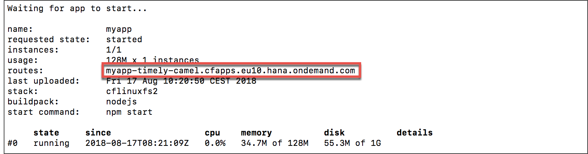
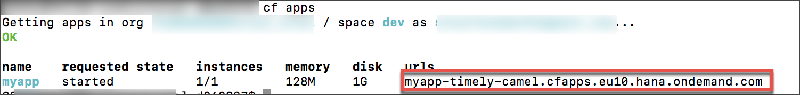

## Prerequisites  
 - A text editor (e.g., Notepad, Atom, Sublime)
 - **Tutorials:** [Install the Cloud Foundry Command Line Interface (CLI)](cp-cf-download-cli)
 - **Tutorials:** [Learn the Fundamentals of the SAP Business Technology Platform, Cloud Foundry environment](cp-cf-fundamentals)
 - A `Node.js` app, like the one described in [Create a Basic Node.js App](cp-node-create-basic-app).

## Details
### You will learn  
  - Which metadata needs to be specified to deploy the `Node.js` app to SAP Business Technology Platform, Cloud Foundry environment
  - How to check whether the application has successfully been deployed

---

[ACCORDION-BEGIN [Step 1: ](Create the manifest file)]

Create a `manifest.yaml` file in the `nodetutorial` directory. This file is the deployment descriptor and contains all required information to deploy an application to a SAP BTP, Cloud Foundry environment instance.

Copy the following content to the recently created file:

```yaml
---
applications:
- name: myapp
  random-route: true
  path: myapp
  memory: 128M
```

>The property `random-route` will generate a route, which does not conflict with any other application in the same Cloud Foundry instance.

You should now have the following directory structure:

```bash
nodetutorial
├── manifest.yaml
└── myapp
    ├── node_modules
    ├── package-lock.json
    ├── package.json
    └── server.js
```


Explanation for the manifest properties:

|  Property Name     | Value
|  :------------- | :-------------
|  `name`           | The application name with which the application will be deployed on Cloud Foundry.
|  `host`          | Where the application (subdomain of the SAP BTP region) should be reachable.
|  `path`           | The path of the local file system from which the content/artifact has to be deployed.
|  `memory`         | The memory quota which should be allocated for this application.
|  `random-route`        | if this property is set to **true**, Cloud Foundry will assign a random route (URL) to the application

Refer to the [official documentation](https://docs.cloudfoundry.org/devguide/deploy-apps/manifest.html) for more fields of the manifest file.

[VALIDATE_1]

[ACCORDION-END]

[ACCORDION-BEGIN [Step 2: ](Push the app to your SAP BTP, Cloud Foundry environment space)]

Make sure you are logged in to your SAP BTP, Cloud Foundry environment endpoint `cf login` and navigate to your space via `cf space <SPACE>`. Execute the following command inside the `nodetutorial` directory:


```bash
user@host:~/nodetutorial
=> cf push
```
>**Note:**

>Make sure you are logged in via **`cf login`** before, otherwise the push command will fail.
The Cloud Foundry command line interface implicitly uses the `manifest.yaml` file to deploy the application. After the deployment process the status of the application should be displayed in the command line:


[DONE]

[ACCORDION-END]

[ACCORDION-BEGIN [Step 3: ](Figure out the application URL)]

To open the application in a browser, there are two ways to figure out the according URL. You should see the URL in the console output when the deployment has completed.



Or you could generally access the application overview. It shows among other information the URL. Accessing the application overview is done via:

```bash
user@host:~/nodetutorial
=> cf apps
```



Access the URL shown in this list. You should get a `'Hello World'` response when accessing the web server at the according URL.

[DONE]

[ACCORDION-END]
---
