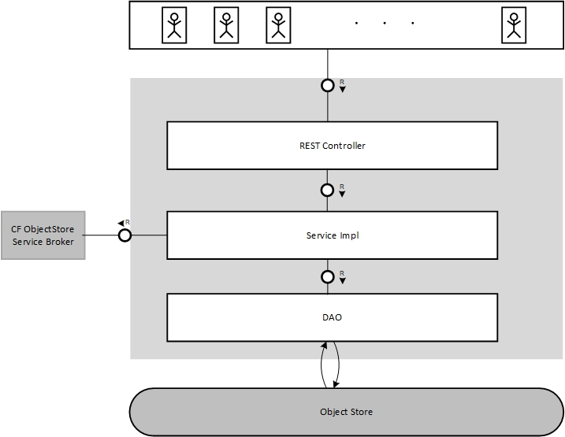
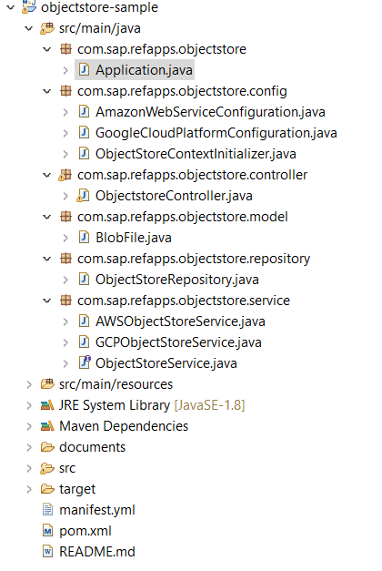
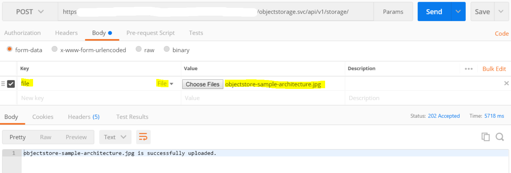

## Prerequisites
 - [Java 8](https://www.oracle.com/technetwork/java/javase/downloads/jdk8-downloads-2133151.html)
 - [Maven 3.3+](https://maven.apache.org/download.cgi)
 - [Eclipse](https://www.eclipse.org/downloads/)
 - [Cloud Foundry CLI](https://developers.sap.com/tutorials/cp-cf-download-cli.html)
 - SAP Business Technology Platform account
 - [Provision Object Store Service](https://discovery-center.cloud.sap/#/serviceCatalog/object-store-service)
 - Basic knowledge of spring
 - Basic knowledge of Cloud Foundry

## Details
### You will learn
  - How to create an Object Store service
  - How to perform CRUD operations on Object Store
  - How to deploy and test the application on Cloud Foundry

This tutorial shows how to create a single code line multi-cloud Java application using spring framework to perform operations like upload, download, delete and list  files in Object Stores. The created application can run on Cloud Foundry consuming the `objectstore` service provided by the platform. The application is referred to as a multi-cloud application because a single code line works with different cloud providers like `Amazon Web Services(AWS)`, `OpenStack` and `Google Cloud Platform(GCP)`.

The application uses the [`Apache jclouds`](https://jclouds.apache.org/) library, which provides a multi-cloud toolkit that gives you the freedom to create applications that are portable across clouds.

**Architecture diagram of the application**


**Project Structure**

---

[ACCORDION-BEGIN [Step 1: ](Import the initial project)]

You can skip the steps of setting up a basic spring boot project and clone/download the skeletal project from the [git repository](https://github.com/SAP/cloud-objectstore-java-sample/tree/tutorial).

Import the project into the IDE (`Eclipse`/ `Intellij`) as maven project.

The project contains the spring boot dependencies for web, configuration processor in `pom.xml`.
It also contains `Application.java` class which is the entry point into the application.

> Note: If you face any issues while building/importing the application, you can remove the content in `.m2` folder and try again.

[DONE]
[ACCORDION-END]

[ACCORDION-BEGIN [Step 2: ](Add required properties, dependencies)]

Edit `pom.xml` file and add the required dependencies.

Add the below property in properties section. This `gson` version is required for `jclouds` to work.
```
<gson.version>2.6.2</gson.version>
```

Add the below dependencies in dependencies section.

```XML
		<!-- jclouds dependencies -->
		<dependency>
    		<groupId>org.apache.jclouds.provider</groupId>
    		<artifactId>aws-s3</artifactId>
    		<version>2.1.2</version>
		</dependency>
		<dependency>
    		<groupId>org.apache.jclouds.provider</groupId>
    		<artifactId>google-cloud-storage</artifactId>
    		<version>2.1.2</version>
		</dependency>
		<dependency>
			<groupId>com.fasterxml.jackson.core</groupId>
			<artifactId>jackson-databind</artifactId>
		</dependency>
		<dependency>
			<groupId>com.google.guava</groupId>
			<artifactId>guava</artifactId>
			<version>27.0.1-jre</version>
		</dependency>
		<dependency>
			<groupId>commons-fileupload</groupId>
			<artifactId>commons-fileupload</artifactId>
			<version>1.3.3</version>
		</dependency>

```
`jclouds` dependencies `aws-s3`, `google-cloud-storage` are required to use APIs of `jclouds` for `AWS`, `GCP` respectively.

You can add the dependency based on the Object Store vendor that you are using.

`Guava` is required by `ContextBuilder` to build `BlobStoreContext` and for I/O operations like converting `InputStream` to `ByteStream`.

`commons-fileupload` is required for uploading files.

`jackson-databind` is required to parse JSON.  

[VALIDATE_2]
[ACCORDION-END]


[ACCORDION-BEGIN [Step 3: ](Create ContextInitializer)]
In this step you will set the application context based on the environment.

Create package: `com.sap.refapps.objectstore.config`

Create class `ObjectStoreContextInitializer` in it.

```Java
package com.sap.refapps.objectstore.config;

import java.io.IOException;
import java.util.Optional;

import org.slf4j.Logger;
import org.slf4j.LoggerFactory;
import org.springframework.context.ApplicationContextInitializer;
import org.springframework.context.ConfigurableApplicationContext;
import org.springframework.core.env.ConfigurableEnvironment;

import com.fasterxml.jackson.databind.JsonNode;
import com.fasterxml.jackson.databind.ObjectMapper;

public class ObjectStoreContextInitializer implements ApplicationContextInitializer<ConfigurableApplicationContext> {

	private static final Logger logger = LoggerFactory.getLogger(ObjectStoreContextInitializer.class);

	private static String activeProfile;

	@Override
	public void initialize(ConfigurableApplicationContext applicationContext) {
		final ConfigurableEnvironment applicationEnvironment = applicationContext.getEnvironment();
		final String profileToActive = getActiveProfile();
		// Active profile is set based on the objectore service connected to.
		// (s3/GCS etc..)
		applicationEnvironment.addActiveProfile(profileToActive);
	}

	/**
	 * This method is used to return the profile name to activate based on
	 * service plans.
	 *
	 * @return profile name
	 */
	public static String getActiveProfile() {
		final String servicePlan = getServicePlan();
		if (servicePlan.equals("s3-standard")) {
			activeProfile = "cloud-aws";
		} else if (servicePlan.equals("gcs-standard")) {
			activeProfile = "cloud-gcp";
		}
		return activeProfile;
	}

	/**
	 * This method is used to parse the service plan name from VCAP_SERVICES
	 *
	 * @return service plan name
	 */
	private static String getServicePlan() {
		Optional<String> servicePlan = Optional.empty();
		final String jsonString = System.getenv("VCAP_SERVICES");
		if (jsonString != null) {
			try {
				ObjectMapper mapper = new ObjectMapper();
				JsonNode root = mapper.readTree(jsonString);
				JsonNode objectstoreNode = root.path("objectstore");

				for (JsonNode node : objectstoreNode) {
					servicePlan = Optional.of(node.path("plan").asText());
				}

			} catch (IOException e) {
				logger.error("Exception occurred: " + e);
			}
		}
		return servicePlan.get();
	}

}

```

>**Note:** Active profile is set based on the Object Store service connected to (`AWS S3/GCS`).


`getServicePlan()` parses the `VCAP_SERVICES` and finds the service plan used.
This service plan can be used to identify the Object Store provider and set the active profile.
`VCAP_SERVICES` is the environmental variable, that gets added whenever an application is bound to a service on CF. It contains the credentials required to connect to the service.

In `getActiveProfile()` method, add more conditional statements based on the service plans of the supported IaaS vendors that you would like to use.

[VALIDATE_3]
[ACCORDION-END]


[ACCORDION-BEGIN [Step 4: ](Register ContextInitializer)]

Edit `Application.java` as shown below. This is required to register the custom `ApplicationContextInitializer` that you created in the previous step.

```Java
package com.sap.refapps.objectstore;

import org.springframework.boot.autoconfigure.SpringBootApplication;
import org.springframework.boot.builder.SpringApplicationBuilder;

import com.sap.refapps.objectstore.config.ObjectStoreContextInitializer;

@SpringBootApplication  
public class Application {  
  public static void main(String[] args) {  
  new SpringApplicationBuilder(Application.class)  
    .initializers(new ObjectStoreContextInitializer()).run(args);  
  }  
}
```

[DONE]
[ACCORDION-END]

[ACCORDION-BEGIN [Step 5: ](Create Configuration class)]

You need to create configuration classes depending on the number of cloud providers you are planning to run the application on. This class stores the required credentials and gets the `BlobStoreContext` by passing these credentials.

If you are using `AWS` as the infrastructure, then follow Step 5.1.

If you are using `GCP` as the infrastructure, then follow Step 5.2.

If you want the application to run on both the infrastructures, then follow both Step 5.1 and 5.2.

### Step 5.1

Create class `AmazonWebServiceConfiguration` in `com.sap.refapps.objectstore.config` package.

```Java
package com.sap.refapps.objectstore.config;

import org.jclouds.ContextBuilder;
import org.jclouds.blobstore.BlobStoreContext;
import org.springframework.boot.context.properties.ConfigurationProperties;
import org.springframework.context.annotation.Configuration;
import org.springframework.context.annotation.Profile;
import org.springframework.context.annotation.PropertySource;

/**
 * This is AWS Credentials Configuration class
 *
 */

@Profile("cloud-aws")
@Configuration
@ConfigurationProperties(prefix = "vcap.services.objectstore-service.credentials")
@PropertySource("classpath:application.properties")
public class AmazonWebServiceConfiguration {

	private String accessKeyId;
	private String bucket;
	private String secretAccessKey;

	public String getAccessKeyId() {
		return accessKeyId;
	}

	public void setAccessKeyId(final String accessKeyId) {
		this.accessKeyId = accessKeyId;
	}

	public String getBucket() {
		return bucket;
	}

	public void setBucket(final String bucket) {
		this.bucket = bucket;
	}

	public String getSecretAccessKey() {
		return secretAccessKey;
	}

	public void setSecretAccessKey(final String secretAccessKey) {
		this.secretAccessKey = secretAccessKey;
	}

	/**
	 * @return blobStoreContext
	 */
	public BlobStoreContext getBlobStoreContext() {
		return ContextBuilder.newBuilder("aws-s3").credentials(this.getAccessKeyId(), this.getSecretAccessKey())
				.buildView(BlobStoreContext.class);
	}

}
```

### Step 5.2

Create class `GoogleCloudPlatformConfiguration` in `com.sap.refapps.objectstore.config` package.

```Java
package com.sap.refapps.objectstore.config;

import java.nio.charset.Charset;
import java.util.Base64;

import org.jclouds.ContextBuilder;
import org.jclouds.blobstore.BlobStoreContext;
import org.jclouds.domain.Credentials;
import org.jclouds.googlecloud.GoogleCredentialsFromJson;
import org.springframework.boot.context.properties.ConfigurationProperties;
import org.springframework.context.annotation.Configuration;
import org.springframework.context.annotation.Profile;
import org.springframework.context.annotation.PropertySource;

import com.google.common.base.Supplier;

/**
 * This is GCP Credentials Configuration class
 *
 */

@Profile("cloud-gcp")
@Configuration
@ConfigurationProperties(prefix = "vcap.services.objectstore-service.credentials")
@PropertySource("classpath:application.properties")
public class GoogleCloudPlatformConfiguration {

	private String base64EncodedPrivateKeyData;
	private String bucket;

	public String getBase64EncodedPrivateKeyData() {
		return base64EncodedPrivateKeyData;
	}

	public String getBucket() {
		return bucket;
	}

	public void setBase64EncodedPrivateKeyData(final String base64EncodedPrivateKeyData) {
		this.base64EncodedPrivateKeyData = base64EncodedPrivateKeyData;
	}

	public void setBucket(final String bucket) {
		this.bucket = bucket;
	}

	/**
	 * @return blobStoreContext
	 */
	public BlobStoreContext getBlobStoreContext() {
		final byte[] decodedKey = Base64.getDecoder().decode(this.getBase64EncodedPrivateKeyData());
		final String decodedCredential = new String(decodedKey, Charset.forName("UTF-8"));
		Supplier<Credentials> supplierCredential = new GoogleCredentialsFromJson(decodedCredential);
		BlobStoreContext blobStoreContext = ContextBuilder.newBuilder("google-cloud-storage")
				.credentialsSupplier(supplierCredential).buildView(BlobStoreContext.class);

		return blobStoreContext;
	}
}

```

`@ConfigurationProperties` is used to inject credential values from `VCAP_SERVICES` into configuration class. Here, ``'objectstore-service'`` is the name of the `objectstore` service instance created on CF.  

`@Profile("cloud-aws")` annotation,  is used  to  load the right configuration and service implementation classes based on the active provider. For example, if the active provider is `"cloud-aws"`, then `AWS` configuration and service classes will be loaded.


[DONE]
[ACCORDION-END]


[ACCORDION-BEGIN [Step 6: ](Create model class for blob file)]

In this step you will create a model class for blob file. This class stores the metadata including size, `contentType`, bucket(container in which the file will be stored), `etag` (unique identifier) and so on of the blob file that you are trying to upload/download from Object Store.

Create package `com.sap.refapps.objectstore.model`.

Create class `BlobFile` in it.


```Java
package com.sap.refapps.objectstore.model;

import java.util.Map;

public class BlobFile {  

  private String etag;  
  private String bucket;  
  private String name;  
  private String url;  
  private String lastModified;  
  private String size;  
  private String contentType;  
  private Map<String,String> userMetadata;  

  public BlobFile() {  
  }  

  public BlobFile(String name) {  
    this.name = name;  
  }  

 public BlobFile(String etag, String bucket, String name, String url, String size, String lastModified,  
    String contenType, Map<String, String> userMetadata) {  
    this.etag = etag;  
    this.bucket = bucket;  
    this.name = name;  
    this.url = url;  
    this.size = size;  
    this.lastModified = lastModified;  
    this.contentType = contenType;  
    this.userMetadata = userMetadata;  
  }  

  public Map<String, String> getUserMetadata() {  
    return userMetadata;  
  }  

  public String getContentType() {  
    return contentType;  
  }  

  public String getLastModified() {  
    return lastModified;  
  }  

  public String getSize() {  
    return size;  
  }  

  public String getEtag() {  
    return etag;  
  }  

  public String getBucket() {  
    return bucket;  
  }  

  public String getName() {  
    return name;  
  }  

  public String getUrl() {  
    return url;  
  }  
}  

```

[DONE]
[ACCORDION-END]

[ACCORDION-BEGIN [Step 7: ](Create REST controller)]

In this step you will create the REST endpoints for upload, download, delete, list operations.
The service class required by the controller will be created in the next step

Create package `com.sap.refapps.objectstore.controller`.

Create class `ObjectstoreController`.

```Java
package com.sap.refapps.objectstore.controller;

import java.io.IOException;
import java.io.InputStream;
import java.util.List;
import java.util.Optional;

import javax.servlet.http.HttpServletRequest;

import org.apache.commons.fileupload.FileItemIterator;
import org.apache.commons.fileupload.FileItemStream;
import org.apache.commons.fileupload.FileUploadException;
import org.apache.commons.fileupload.servlet.ServletFileUpload;
import org.slf4j.Logger;
import org.slf4j.LoggerFactory;
import org.springframework.beans.factory.annotation.Autowired;
import org.springframework.core.io.InputStreamResource;
import org.springframework.http.HttpHeaders;
import org.springframework.http.HttpStatus;
import org.springframework.http.ResponseEntity;
import org.springframework.web.bind.annotation.DeleteMapping;
import org.springframework.web.bind.annotation.GetMapping;
import org.springframework.web.bind.annotation.PathVariable;
import org.springframework.web.bind.annotation.PostMapping;
import org.springframework.web.bind.annotation.RequestMapping;
import org.springframework.web.bind.annotation.ResponseBody;
import org.springframework.web.bind.annotation.RestController;

import com.google.common.io.ByteStreams;
import com.sap.refapps.objectstore.model.BlobFile;
import com.sap.refapps.objectstore.service.ObjectStoreService;

@RestController
@RequestMapping("/objectstorage.svc/api/v1")
public class ObjectstoreController {

	private ObjectStoreService objectStoreService;
	private static Logger logger = LoggerFactory.getLogger(ObjectstoreController.class);

	@Autowired
	public ObjectstoreController(final ObjectStoreService objectStoreService) {
		this.objectStoreService = objectStoreService;
	}

	/**
	 * @return list of blobfiles Function to get the list of objects in the
	 *         objectStore.
	 */
	@GetMapping("/storage")
	@ResponseBody
	public ResponseEntity<List<BlobFile>> listFiles() {

		List<BlobFile> blobFiles = this.objectStoreService.listObjects();
		return new ResponseEntity<>(blobFiles, HttpStatus.OK);
	}

	/**
	 * @param request
	 * @return Message indicating if the file has been uploaded Function to
	 *         upload objects to objectStore.
	 */
	@PostMapping("/storage")
	public ResponseEntity<String> uploadFile(HttpServletRequest request) throws IOException, FileUploadException {

		// Check if we have a file upload request
		boolean isMultipart = ServletFileUpload.isMultipartContent(request);

		String message = "";
		Optional<FileItemStream> fileItemStream = Optional.empty();
		byte[] byteArray = null;

		if (isMultipart) {

			// Create a new file upload handler
			try {
				ServletFileUpload upload = new ServletFileUpload();
				FileItemIterator iter = upload.getItemIterator(request);
				while (iter.hasNext()) {
					fileItemStream = Optional.of(iter.next());
					try (InputStream inputStream = fileItemStream.get().openStream()) {
						byteArray = ByteStreams.toByteArray(inputStream);
						if (!fileItemStream.get().isFormField()) {
							final String contentType = fileItemStream.get().getContentType();
							message = this.objectStoreService.uploadFile(byteArray, fileItemStream.get().getName(),
									contentType);
						}
					} catch (IOException e) {
						logger.error("Error occurred while uploading the object: " + fileItemStream.get().getName() + e);
					}
				}
			} catch (IOException e) {
				logger.error("Error occurred while uploading the object: " + fileItemStream.get().getName() + e);
			}
		}
		return new ResponseEntity<>(message, HttpStatus.ACCEPTED);
	}

	/**
	 * @param fileName
	 * @return inputStream containing the file Function to get a particular
	 *         objects from objectStore.
	 */
	@GetMapping(value = "/storage/{name:.*}")
	public ResponseEntity<InputStreamResource> getFile(@PathVariable(value = "name") String fileName) {

		if (fileName != null) {
			HttpHeaders respHeaders = new HttpHeaders();

			if (this.objectStoreService.isBlobExist(fileName)) {
				respHeaders.setContentDispositionFormData("attachment", fileName);
				InputStreamResource inputStreamResource = new InputStreamResource(
						this.objectStoreService.getFile(fileName));
				return new ResponseEntity<InputStreamResource>(inputStreamResource, respHeaders, HttpStatus.OK);
			} else {
				return errorMessage(fileName + " does not exist in the container", HttpStatus.NOT_FOUND);
			}
		}

		// Default to 200, when input is missing
		return new ResponseEntity<InputStreamResource>(HttpStatus.OK);
	}

	/**
	 * @param fileName
	 * @return Message indicating if the file has been deleted Function to
	 *         delete an object
	 */
	@DeleteMapping("/storage/{name}")
	public ResponseEntity<String> deleteFile(@PathVariable(value = "name") String fileName) {
		String msg = "Could not delete a null object.";
		if (fileName != null) {
			if (this.objectStoreService.isBlobExist(fileName)) {
				if (this.objectStoreService.deleteFile(fileName)) {
					msg = fileName + " is successfully deleted.";
				} else {
					msg = "Error occurred while deleting the object: " + fileName;
					return new ResponseEntity<>(msg, HttpStatus.INTERNAL_SERVER_ERROR);
				}
			} else {
				msg = fileName + " does not exist in the container";
				return errorMessage(msg, HttpStatus.NOT_FOUND);
			}

		}

		return new ResponseEntity<>(msg, HttpStatus.OK);
	}

	/**
	 * @param message
	 * @param status
	 * @return ResponseEntity with HTTP status,headers and body helper function
	 *         to form the responseEntity
	 */
	private static ResponseEntity errorMessage(String message, HttpStatus status) {
		HttpHeaders headers = new HttpHeaders();
		headers.setContentType(org.springframework.http.MediaType.TEXT_PLAIN);

		return ResponseEntity.status(status).headers(headers).body(message);
	}
}

```

[DONE]
[ACCORDION-END]

[ACCORDION-BEGIN [Step 8: ](Create service classes)]

Following the spring guidelines, create a service interface and separate service implementations for each IaaS provider.

Create package `com.sap.refapps.objectstore.service`.

Create interface `ObjectStoreService`.

```Java
package com.sap.refapps.objectstore.service;

import java.io.InputStream;
import java.util.List;
import org.springframework.stereotype.Service;
import com.sap.refapps.objectstore.model.BlobFile;

@Service
public interface ObjectStoreService {

	public String uploadFile(byte[] bytes, String name, String contentType);

	public boolean deleteFile(String fileName);

	public InputStream getFile(String fileName);

	public List<BlobFile> listObjects();

	public boolean isBlobExist(String name);
}
```
Create implementation classes. The repository class required by the services will be created in the next step.

If you are using `AWS` as the Infrastructure, then follow Step 8.1.

If you are using `GCP` as the Infrastructure, then follow Step 8.2.

If you want the application to run on both the Infrastructures, then follow both Step 8.1 and 8.2.

Here again use @profile annotation to help the controller decide which implementation to invoke.

### Step 8.1

Create `AWSObjectStoreService` class in the same package.

```Java
package com.sap.refapps.objectstore.service;

import java.io.InputStream;
import java.util.List;

import org.slf4j.Logger;
import org.slf4j.LoggerFactory;

import org.springframework.beans.factory.annotation.Autowired;
import org.springframework.context.annotation.Profile;
import org.springframework.stereotype.Service;

import com.sap.refapps.objectstore.config.AmazonWebServiceConfiguration;
import com.sap.refapps.objectstore.model.BlobFile;
import com.sap.refapps.objectstore.repository.ObjectStoreRepository;

@Profile("cloud-aws")
@Service
public class AWSObjectStoreService implements ObjectStoreService {

	private final AmazonWebServiceConfiguration awsConfig;
	private final ObjectStoreRepository repository;
	private final String containerName;
	private static Logger logger = LoggerFactory.getLogger(AWSObjectStoreService.class);

	@Autowired
	public AWSObjectStoreService(final AmazonWebServiceConfiguration awsConfig, ObjectStoreRepository repository) {
		this.awsConfig = awsConfig;
		this.repository = repository;
		this.containerName = awsConfig.getBucket();
	}

	@Override
	public String uploadFile(byte[] bytes, String fileName, String contentType) {
		repository.setContext(awsConfig.getBlobStoreContext());
		logger.info("Upload started");
		String message = repository.uploadFile(containerName, bytes, fileName, contentType);
		logger.info("upload completed");
		return message;
	}

	public List<BlobFile> listObjects() {
		repository.setContext(awsConfig.getBlobStoreContext());
		List<BlobFile> files = repository.listFiles(containerName);
		return files;
	}

	@Override
	public InputStream getFile(String fileName) {
		repository.setContext(awsConfig.getBlobStoreContext());
		InputStream inputStream = repository.downloadFile(containerName, fileName);
		return inputStream;
	}

	@Override
	public boolean deleteFile(String fileName) {
		repository.setContext(awsConfig.getBlobStoreContext());
		boolean status = repository.deleteFile(containerName, fileName);
		return status;

	}

	@Override
	public boolean isBlobExist(String fileName) {
		repository.setContext(awsConfig.getBlobStoreContext());
		boolean status = repository.isBlobExist(containerName, fileName);
		return status;
	}
}

```

### Step 8.2

Create class `GCPObjectStoreService` in the same package.

```Java
package com.sap.refapps.objectstore.service;

import java.io.InputStream;
import java.util.List;

import org.slf4j.Logger;
import org.slf4j.LoggerFactory;

import org.springframework.beans.factory.annotation.Autowired;
import org.springframework.context.annotation.Profile;
import org.springframework.stereotype.Service;

import com.sap.refapps.objectstore.config.GoogleCloudPlatformConfiguration;
import com.sap.refapps.objectstore.model.BlobFile;
import com.sap.refapps.objectstore.repository.ObjectStoreRepository;

@Profile("cloud-gcp")
@Service
public class GCPObjectStoreService implements ObjectStoreService {

	private final GoogleCloudPlatformConfiguration gcpConfig;
	private final ObjectStoreRepository repository;
	private final String containerName;
	private static Logger logger = LoggerFactory.getLogger(GCPObjectStoreService.class);

	@Autowired
	public GCPObjectStoreService(final GoogleCloudPlatformConfiguration gcpConfig,
			final ObjectStoreRepository repository) {
		this.gcpConfig = gcpConfig;
		this.repository = repository;
		this.containerName = gcpConfig.getBucket();
	}

	@Override
	public String uploadFile(byte[] bytes, String fileName, String contentType) {
		repository.setContext(gcpConfig.getBlobStoreContext());
		logger.info("Upload started");
		String message = repository.uploadFile(containerName, bytes, fileName, contentType);
		logger.info("upload completed");
		return message;
	}

	public List<BlobFile> listObjects() {
		repository.setContext(gcpConfig.getBlobStoreContext());
		List<BlobFile> listBlobs = repository.listFiles(containerName);
		return listBlobs;
	}

	@Override
	public InputStream getFile(String fileName) {
		repository.setContext(gcpConfig.getBlobStoreContext());
		InputStream inputStream = repository.downloadFile(containerName, fileName);
		return inputStream;
	}

	@Override
	public boolean deleteFile(String fileName) {
		repository.setContext(gcpConfig.getBlobStoreContext());
		boolean blobRemove = repository.deleteFile(containerName, fileName);
		return blobRemove;

	}

	@Override
	public boolean isBlobExist(String fileName) {
		repository.setContext(gcpConfig.getBlobStoreContext());
		boolean blobExist = repository.isBlobExist(containerName, fileName);
		return blobExist;
	}

}

```

[VALIDATE_8]
[ACCORDION-END]

[ACCORDION-BEGIN [Step 9: ](Create repository class)]

The repository class is common for all the Object Store providers and it deals with the actual business logic. This class makes calls to `jclouds` API -- for example, `putBlob()`, `getBlob()` -- to perform operation in Object Store.

Create package `com.sap.refapps.objectstore.repository`.

Create class `ObjectStoreRepository`.

```Java
package com.sap.refapps.objectstore.repository;

import java.io.IOException;
import java.io.InputStream;
import java.text.DecimalFormat;
import java.util.ArrayList;
import java.util.HashMap;
import java.util.Iterator;
import java.util.List;
import java.util.Map;

import org.jclouds.blobstore.BlobStore;
import org.jclouds.blobstore.BlobStoreContext;
import org.jclouds.blobstore.domain.Blob;
import org.jclouds.blobstore.domain.PageSet;
import org.jclouds.blobstore.domain.StorageMetadata;
import org.jclouds.io.Payload;
import org.jclouds.io.payloads.ByteArrayPayload;
import org.slf4j.Logger;
import org.slf4j.LoggerFactory;
import org.springframework.stereotype.Repository;

import com.sap.refapps.objectstore.model.BlobFile;

@Repository
public class ObjectStoreRepository {

	private BlobStoreContext context;
	private BlobStore blobStore;

	private static Logger logger = LoggerFactory.getLogger(ObjectStoreRepository.class);

	public BlobStoreContext getContext() {
		return context;
	}

	public void setContext(BlobStoreContext context) {
		this.context = context;
	}

	/**
	 * @param bucketName
	 * @param data
	 * @param fileName
	 * @return message
	 */
	public String uploadFile(String bucketName, byte[] bytes, String fileName, String contentType) {

		String message = null;

		try {
			// getting blob store
			blobStore = getContext().getBlobStore();

			// creating payload
			Payload payload = new ByteArrayPayload(bytes);

			// adding user metadata to the blob
			Map<String, String> userMetadata = new HashMap<String, String>();
			userMetadata.put("description", "sample content");

			// creating Blob
			Blob blob = blobStore.blobBuilder(fileName).payload(payload).contentType(contentType)
					.userMetadata(userMetadata).build();

			// Multipart upload is currently not supported since it has an issue
			// with OpenStack Swift.
			// multipart issue:
			// (https://issues.apache.org/jira/browse/JCLOUDS-1064).
			blobStore.putBlob(bucketName, blob);
			message = fileName + " is successfully uploaded.";

		} finally {
			getContext().close();
		}

		return message;
	}

	/**
	 * @param bucketName
	 * @return List<BlobFile>
	 */
	public List<BlobFile> listFiles(String bucketName) {

		List<BlobFile> files = new ArrayList<>();
		PageSet<? extends StorageMetadata> list;

		try {
			// getting blobstore
			blobStore = getContext().getBlobStore();

			// List all files from the bucket
			list = blobStore.list(bucketName);

			if (list != null) {
				// Iterate and form the list to be returned
				for (Iterator<? extends StorageMetadata> it = list.iterator(); it.hasNext();) {
					StorageMetadata storageMetadata = it.next();
					Blob blob = blobStore.getBlob(bucketName, storageMetadata.getName());
					files.add(createBlobFile(blob));
				}
			}
		} finally {
			getContext().close();
		}
		return files;
	}

	/**
	 * @param bucketName
	 * @param fileName
	 * @return InputStream
	 */
	public InputStream downloadFile(String bucketName, String fileName) {

		InputStream inputStream = null;
		try {
			// getting blobstore
			blobStore = getContext().getBlobStore();

			// getting blob
			Blob blob = blobStore.getBlob(bucketName, fileName);

			inputStream = blob.getPayload().openStream();
			logger.info(fileName + " is successfully downloaded.");

		} catch (IOException e) {
			logger.error("Error occurred while downloading the object: " + fileName + e);

		} finally {
			getContext().close();
		}

		return inputStream;
	}

	/**
	 * @param bucketName
	 * @param fileName
	 * @return true/false if the blobfile has been deleted
	 */
	public boolean deleteFile(String bucketName, String fileName) {

		boolean isBlobRemoved = false;
		try {
			// getting blobstore
			blobStore = getContext().getBlobStore();
			// removing blob
			blobStore.removeBlob(bucketName, fileName);

			if (!isBlobExist(bucketName, fileName)) {
				isBlobRemoved = true;
				logger.info(fileName + " is successfully deleted.");
			}
		} finally {
			getContext().close();
		}

		return isBlobRemoved;
	}

	public boolean isBlobExist(String bucketName, String fileName) {

		boolean isExist = false;
		try {
			// getting blobstore
			blobStore = getContext().getBlobStore();
			isExist = blobStore.blobExists(bucketName, fileName);
		} finally {
			getContext().close();
		}
		return isExist;
	}

	/**
	 * @param blob
	 * @return blobFile
	 */
	public static BlobFile createBlobFile(final Blob blob) {
		return new BlobFile(blob.getMetadata().getETag(), blob.getMetadata().getContainer(),
				blob.getMetadata().getName(), blob.getMetadata().getUri().toString(),
				readableFileSize(blob.getMetadata().getSize()), blob.getMetadata().getLastModified().toString(),
				blob.getPayload().getContentMetadata().getContentType(), blob.getMetadata().getUserMetadata());

	}

	/**
	 * @param size
	 * @return decimalformat of size of file along with unit
	 */
	private static String readableFileSize(final long size) {
		if (size <= 0)
			return "0";
		final String[] units = new String[] { "B", "KB", "MB", "GB", "TB" };
		int digitGroups = (int) (Math.log10(size) / Math.log10(1024));
		return new DecimalFormat("#,##0.#").format(size / Math.pow(1024, digitGroups)) + " " + units[digitGroups];
	}

}
```

[DONE]
[ACCORDION-END]

[ACCORDION-BEGIN [Step 10: ](Add a manifest file)]

Create a file `manifest.yml` in the root folder of the project.

Add the below content to the file.

```YAML
applications:
- name: objectstore-sample-svc
  host: <unique ID>-objectstore-sample-svc
  memory: 2G
  buildpack: https://github.com/cloudfoundry/java-buildpack.git
  path: target/objectstore-sample-1.0.0.jar
  services:
    - objectstore-service
```

Provide a `unique ID` in the host for the application. The host name has to be unique across the Cloud Foundry landscape.
The service `objectstore-service` will be created in the next step.

[DONE]
[ACCORDION-END]

[ACCORDION-BEGIN [Step 11: ](Build and deploy the application)]

In this step you will create an Object Store service, build and deploy the application on Cloud Foundry.

The steps below should be performed in a command prompt or terminal.

1. Log into Cloud Foundry, enter your username and password, and select the `org`, `space` when prompted.

    ```
    cf api <api>
    cf login
    ```

    `api` is the [URL of the Cloud Foundry landscape](https://help.sap.com/viewer/65de2977205c403bbc107264b8eccf4b/Cloud/en-US/350356d1dc314d3199dca15bd2ab9b0e.html#loio350356d1dc314d3199dca15bd2ab9b0e) that you are trying to connect to.

2. Look for the `objectstore` service in the market place, and view the available plans.

    ```
    cf marketplace
    ```

3. Create service instance.

    `service-plan` is `s3-standard` for `AWS`.

    `service-plan` is `gcs-standard` for `GCP`.

    ```
    cf create-service objectstore <service-plan> objectstore-service
    ```

4. Move to the folder that contains `pom.xml`, and then build and push the application to Cloud Foundry.

    ```
    mvn clean install
    cf push
    ```

    >**Note:** If you face any issues while building/importing the application, you can clear the content in `.m2` folder and try again.

[DONE]
[ACCORDION-END]


[ACCORDION-BEGIN [Step 12: ](Test the application)]

[Postman Client](https://www.getpostman.com/apps) can be used to test / access the REST API endpoints.

### Upload a file

**POST** ` <application URL>/objectstorage.svc/api/v1/storage/`

**Request Body:** form-data with key-value pair. Pass the name of the key as `file`, select `file` in the dropdown, too. Value is path of the file. You can create a `txt` file with some data to test.


On a successful upload operation, you will the get the below response:

  - Status: 202
  - Response Body: `<uploaded_filename> is successfully uploaded`

### List all the files

**GET**  `<application URL>/objectstorage.svc/api/v1/storage/`

**Content-Type:** `application/json`

On a successful get operation, you will the get the below response:

  - Status: 200

  - Response Body:

    ```
    [
      {   
          "etag": "\"79ab51ca348ea601be38845914646c66-1\"",
          "bucket": "hcp-3752ce5a-242e-40a6-801e-3752cf9bd075",
          "name": "sample.docx",
          "url": "https://hcp-3752ce5a-242e-40a6-801e-3752cf9bd075.s3-eu-central-1.amazonaws.com/sample.jpg",
          "lastModified": "Thu Nov 08 08:06:21 UTC 2018",
          "size": "1.4 MB",
          "contentType": "binary/octet-stream",
          "userMetadata": {
              "description": "sample content"
          }
      },
      {
            "etag": "\"423e78a36c57db87f359b2a1b8294beb-1\"",
            "bucket": "hcp-3752ce5a-242e-40a6-801e-3752cf9bd075",
            "name": "resume.pdf",
            "url": "https://hcp-3752ce5a-242e-40a6-801e-3752cf9bd075.s3-eu-central-1.amazonaws.com/resume.pdf",
            "lastModified": "Thu Nov 08 08:07:45 UTC 2018",
            "size": "964.6 KB",
            "contentType": "application/pdf",
            "userMetadata": {
                "description": "sample content"
            }
        }
      ...

    ]
    ```

### Download a file

**GET**  `<application URL/objectstorage.svc/api/v1/storage/{name}`

> By hitting this URL, the object will get downloaded into the local system. <b> So please open the URL in any browser rather than Postman to test it.</b>


### Delete a file

**DELETE**   `<application URL>/objectstorage.svc/api/v1/storage/{name}`

On a successful delete operation, you will the get the below response:

  - Status: 200

  - Response Body: <name> `deleted from ObjectStore.`


[DONE]
[ACCORDION-END]

[ACCORDION-BEGIN [Step 13: ](Extend the application)]

Follow the steps below to extend the application to work with other cloud providers.

1.	Add the required [`jclouds dependency`](https://github.com/apache/jclouds/blob/master/allblobstore/pom.xml) in `pom.xml`

2.	Create configuration class for the provider by checking the required credentials in `VCAP_SERVICES`.

3.	Create service class implementing `objectStoreService` interface.

4.	Add the conditional statements in `ObjectStoreContextInitializer` class to set the active profile based on service plan.

Source code of the application that works on `AWS`, `GCP` and `OpenStack` is published in [git repository](https://github.com/SAP/cloud-objectstore-java-sample).


[DONE]
[ACCORDION-END]

---
