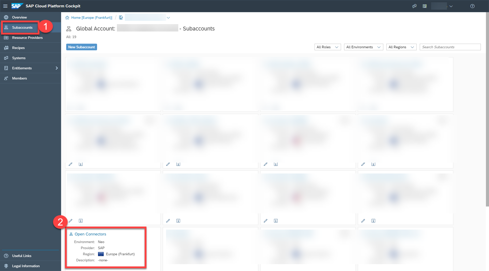
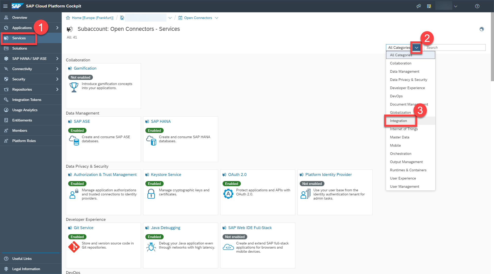
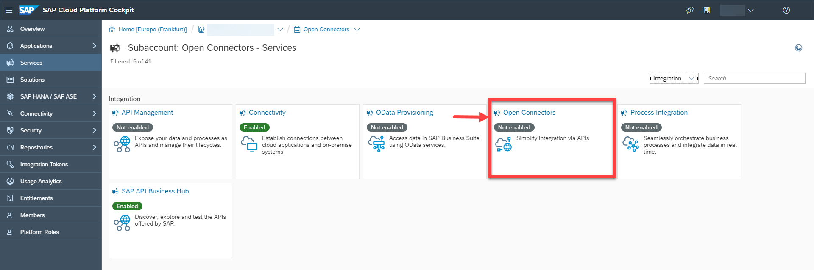
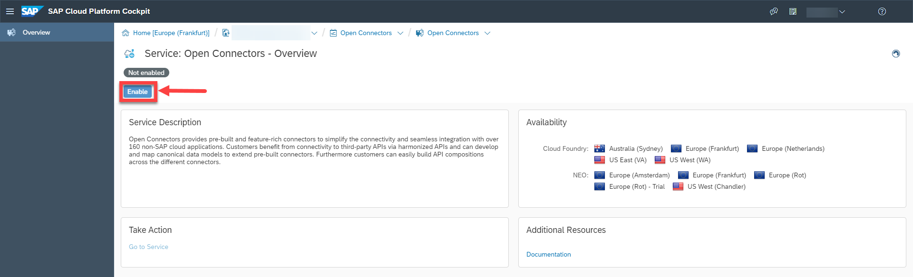
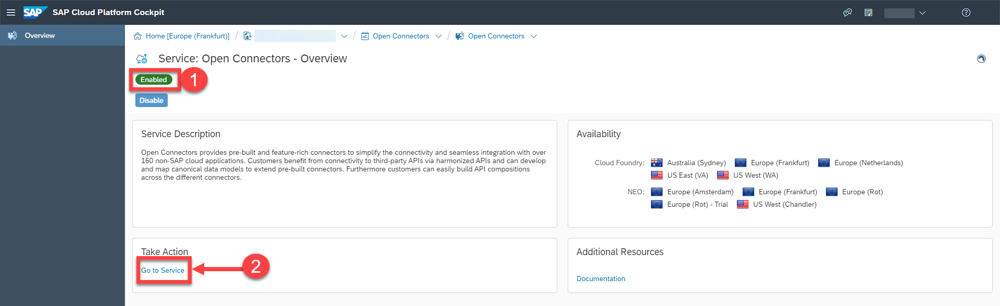
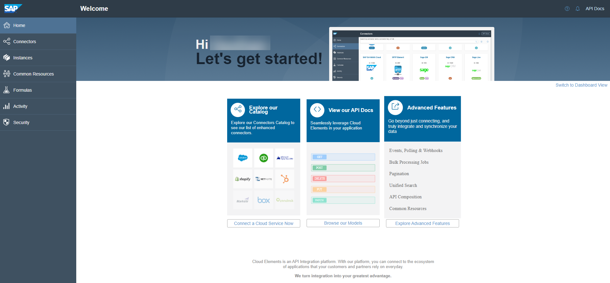

## Prerequisites
 - You have a global account on SAP Cloud Platform.
 - You have navigated to the subaccount in which you want to subscribe to the Open Connectors service.

## Details
### You will learn
  - How to subscribe to the Open Connectors service in the SAP Cloud Platform Neo environment.

You can subscribe to the SAP Cloud Platform Open Connectors service using the self-service app.

---

[ACCORDION-BEGIN [Step 1: ](Access your subaccount)]
Access your subaccount in the SAP Cloud Platform Cockpit.

[VALIDATE_6]
[ACCORDION-END]

[ACCORDION-BEGIN [Step 2: ](Find SAP Cloud Platform Open Connectors Service)]

1. Choose the services tab to access all the services that are available for your account. In the **Categories** dropdown list, choose **Integration**.

    

2. Select the **Open Connectors** tile.

    

[DONE]
[ACCORDION-END]

[ACCORDION-BEGIN [Step 3: ](Enable Open Connectors service)]

Subscribe to the **Open Connectors** service by choosing **Enable**.

Wait for the icon to turn green, indicating that the subscription process is complete.

[DONE]
[ACCORDION-END]

[ACCORDION-BEGIN [Step 4: ](Access Open Connectors)]

1. Access the service by choosing **Go to Service**.

    

2. You will now see the home page of the Open Connectors application

    

[DONE]
[ACCORDION-END]

---
