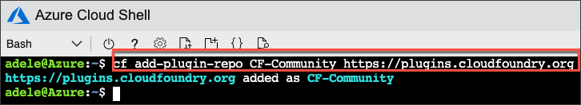
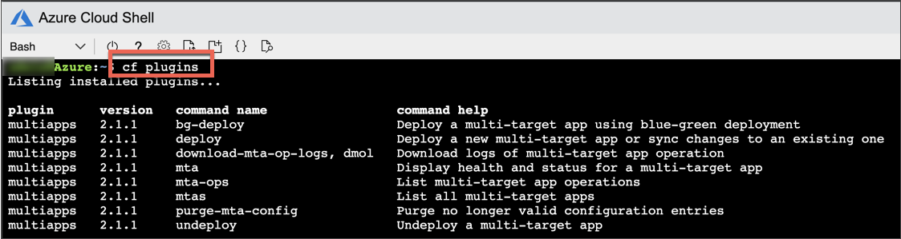
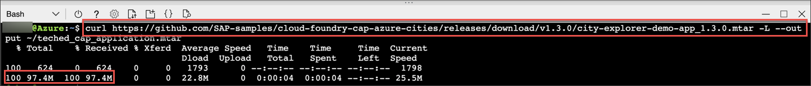
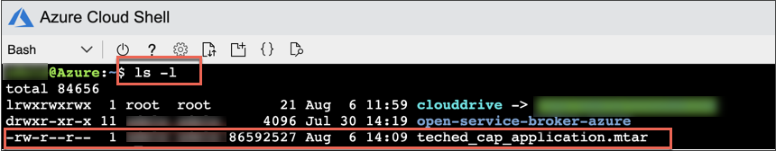
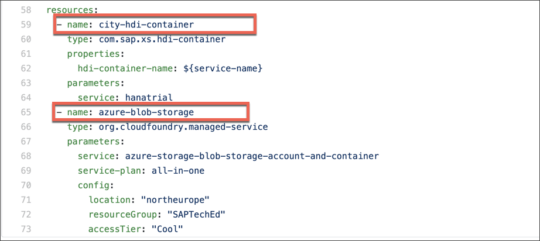
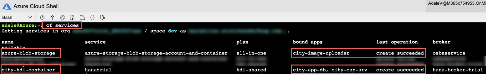

## Details
### You will learn
  - How to install the Multi-Target Application (MTA) plugin for the Cloud Foundry CLI
  - How to create an Azure backing service instance leveraging the Azure service broker
  - How to deploy an MTA to SAP Cloud Platform Cloud Foundry

In this tutorial, you will download a fully working application bundled as a Multi-Target Application and deploy it to your SAP Cloud Platform Cloud Foundry space. On the way, it is necessary to install a plugin for the Cloud Foundry CLI. At the end of this tutorial, you will have a fully functional application running in your SAP Cloud Platform Cloud Foundry environment, using Azure services (managed via Azure service broker) in the background and accessible from the internet.

---

[ACCORDION-BEGIN [Step 1: ](Install CF CLI MTA plugin)]

MTA project operations in Cloud Foundry -- such as deploying or removing applications -- aren't native Cloud Foundry functions but provided via an installable plugin.

Add a new repository for Cloud Foundry plugins by executing the following command in the Azure Cloud Shell:

```Bash
cf add-plugin-repo CF-Community https://plugins.cloudfoundry.org
```



Now the actual MTA plugin can be installed from the previously added repository in your Azure Cloud Shell:

```Bash
cf install-plugin multiapps
```

> If you are asked **Do you want to install the plugin `multiapps`?**, answer with **`y`** and hit **Enter**.

If you want to check out available Cloud Foundry CLI commands caused by the recent installation, execute the following command in the Azure Cloud Shell:

```Bash
cf plugins
```



[VALIDATE_1]
[ACCORDION-END]

[ACCORDION-BEGIN [Step 2: ](Clone GitHub repository with application code)]

The actual SAP Cloud Platform application, which is supposed to use Azure services in the background, is publicly accessible in the form of an already built Multi-Target Application Archive (MTA Archive). Please download the file via your Azure Cloud Shell by executing the following command:

```Bash
curl https://github.com/SAP-samples/cloud-foundry-cap-azure-cities/releases/download/1.7.6/city-explorer-demo-app.mtar -L --output ~/cap-azure-sample-app.mtar
```

!

You should now have downloaded the MTA archive into your directory. Type the following command in your Azure Cloud Shell to list the content of your directory:

```Bash
cd ~ && ls -l
```

Your directory should look similar to the one shown in the screenshot below. Make sure there is the following:  **`cap-azure-sample-app.mtar`**

!

> If you want to have a look at the source code of this application check out the [GitHub repository](https://github.com/SAP-samples/cloud-foundry-cap-azure-cities/).

[DONE]
[ACCORDION-END]

[ACCORDION-BEGIN [Step 3: ](Deploy application to SAP Cloud Platform Cloud Foundry)]

To deploy the previously downloaded application code to SAP Cloud Platform Cloud Foundry, you need to execute one of the previously added Cloud Foundry plugin commands for MTA.

Execute the following command in your Azure Cloud Shell:

```Bash
cd ~ && cf deploy cap-azure-sample-app.mtar
```

This uploads the archive and triggers the deployment process in Cloud Foundry, including provisioning and binding of SAP Cloud Platform services as well as Azure services (managed via Azure service broker).

Below you can see a screenshot of the `mta.yaml` file (part of the downloaded MTA archive) with the needed service instructions. This shows that both an **SAP HANA HDI Container** (SAP HANA Deployment Infrastructure Container) and an **Azure Blob Store** are required for the application. The Azure Blob Store is provisioned using the Azure service broker.



[DONE]
[ACCORDION-END]


[ACCORDION-BEGIN [Step 4: ](Check service status)]

Check if the two services shown in the screenshot of the previous step have been bound to the application as desired.

Execute the following command in the Azure Cloud Shell:

```Bash
cf services
```

Both should have **create succeeded** as **last operation** and bound to the apps shown in the output below.



>The screenshot shows, among other things, which service broker was used to create the services. Thus `SAP HANA HDI Container` service was created via an SAP owned `hana-broker-trial`, whereas the `Azure Blob Store` service was created via the Azure Service Broker deployed and registered in the previous steps.

[DONE]
[ACCORDION-END]

---
