## Details
### You will learn
  - How to clone a GitHub repository
  - Which configuration is needed for the service broker
  - How to deploy an application to your SAP Cloud Platform Cloud Foundry space from the Cloud Foundry CLI

In the following steps, you will deploy the Azure service broker application to your SAP Cloud Platform Cloud Foundry space, which you will use later to provide Azure backing services to an application running SAP Cloud Platform Cloud Foundry.


---

[ACCORDION-BEGIN [Step 1: ](Set the right API endpoint)]

To log onto the right SAP Cloud Platform Cloud Foundry endpoint, the right API endpoint URL is needed. Therefore, log into the [SAP Cloud Platform cockpit](https://account.hanatrial.ondemand.com/) with your SAP Cloud Platform user.

Click on **Enter Your Trial Account**.

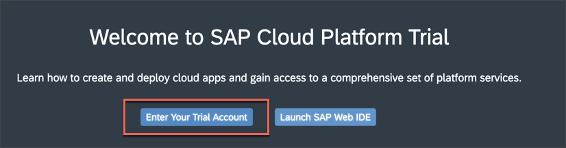

Navigate to the subaccount by clicking on the according tile.

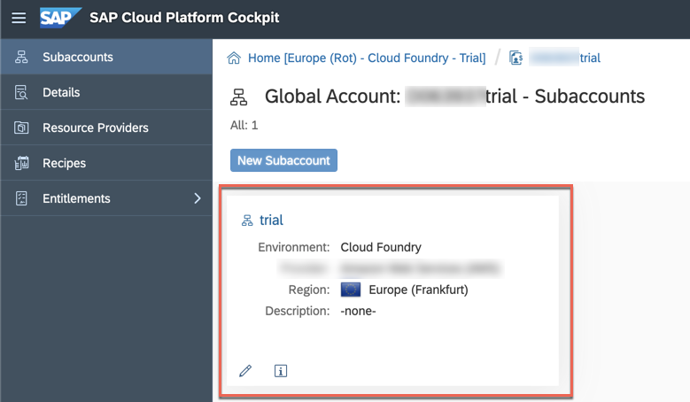

Copy the URL of the API endpoint to your clipboard.

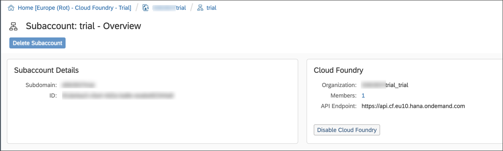

Go back to your Azure Cloud Shell and execute the following command.

>**IMPORTANT:**: Don't forget to replace the API endpoint (`<api-endpoint-url>`) in the command with the URL in your clipboard.

```Bash
 cf api <api-endpoint-url>
```

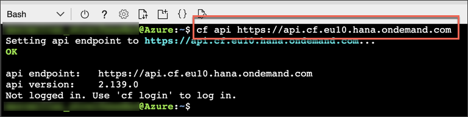

[DONE]
[ACCORDION-END]

[ACCORDION-BEGIN [Step 2: ](Log into SAP Cloud Platform Cloud Foundry space)]

You haven't logged in to your particular SAP Cloud Platform Cloud Foundry space via the Cloud Foundry CLI yet -- you have only set the API endpoint.

Execute the following command in the Azure Cloud Shell and log in with your SAP Cloud Platform credentials (which you have also used in Step 1 of this tutorial to log onto the SAP Cloud Platform cockpit)

```Bash
cf login
```

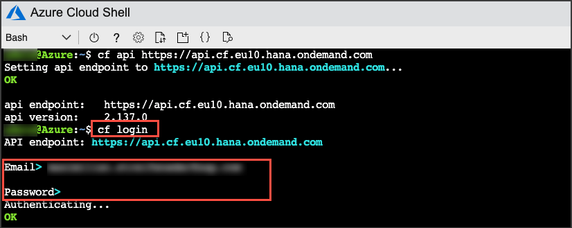

If there are multiple organizations and spaces in your subaccount, please navigate through the prompts by entering the according numbers listed next to the organization/space followed by pressing **Enter**.

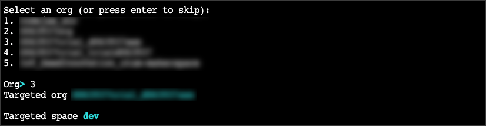

> In case there is only one organization and space, you will automatically be directed to the space.

Finally, the following output should appear in your Azure Cloud Shell.

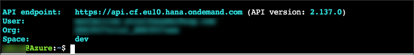

[DONE]
[ACCORDION-END]

[ACCORDION-BEGIN [Step 3: ](Clone GitHub repository)]

The service broker is technically an application that will later be deployed to your SAP Cloud Platform Cloud Foundry space. There's already a public GitHub repository, published by Microsoft, which can be cloned easily.

Execute the following command in the Azure Cloud Shell:

```Bash
git clone https://github.com/Azure/open-service-broker-azure.git
```

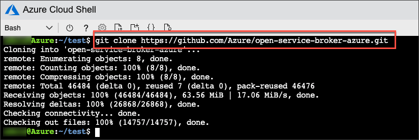

All files of the specified repository should now be downloaded into an **open-service-broker-azure** directory of your Azure Cloud Shell.
Execute the `list` command to list the content of your current directory:

```Bash
ls -l
```

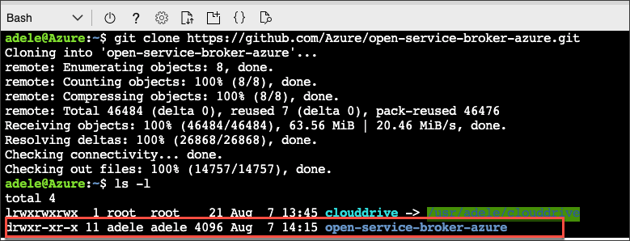

[DONE]
[ACCORDION-END]

[ACCORDION-BEGIN [Step 4: ](Update manifest.yml − Azure subscription information)]

You have recently downloaded the source code for the service broker application. In the next step, the placeholder in the `manifest.yml` (deployment descriptor) will be replaced with the information of your particular Azure subscription.

Open the `manifest.yaml` file (exact path: `open-service-broker/contrib/cf`) in the Azure Cloud Shell via executing the following command:

```Bash
code open-service-broker-azure/contrib/cf/manifest.yml
```

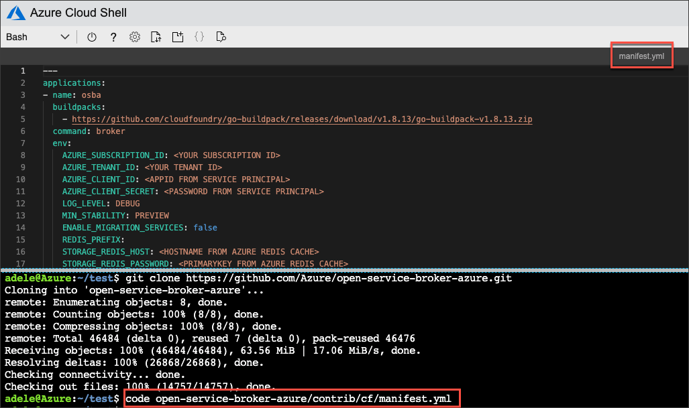

As you can see, there are a couple of placeholders. Replace the `<YOUR SUBSCRIPTION ID>` with your actual subscription ID. You can retrieve it via the following command in your **Azure Cloud Shell**:

```Bash
az account show --query id --output tsv
```
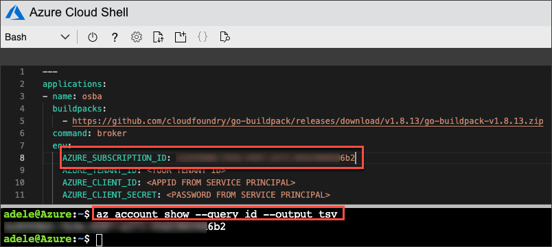

[DONE]
[ACCORDION-END]

[ACCORDION-BEGIN [Step 5: ](Update manifest.yml − Redis Cache information)]

Replace the `<HOSTNAME FROM AZURE REDIS CACHE>` placeholders (there are two!) with the actual hostname of your Redis Cache you have created in the previous tutorial. You can retrieve it via the following command in your Azure Cloud Shell:

>Replace `<name-redis-cache>` with your unique `Redis Cache` name from the previous tutorial. `[hostName]` is not a placeholder and should not be replaced.

```Bash
az redis show --name <name-redis-cache> --resource-group SAPCloudPlatform --query [hostName] --output tsv
```


Replace the `<PRIMARYKEY FROM AZURE REDIS CACHE>` placeholders (there are two!) with the actual primary key Redis Cache you have created in the previous tutorial. You can retrieve it via the following command in your Azure Cloud Shell:

>Replace `<name-redis-cache>` with your unique `Redis Cache` name from the previous tutorial.

```Bash
az redis list-keys -n <name-redis-cache> -g SAPCloudPlatform --query [primaryKey] --output tsv
```

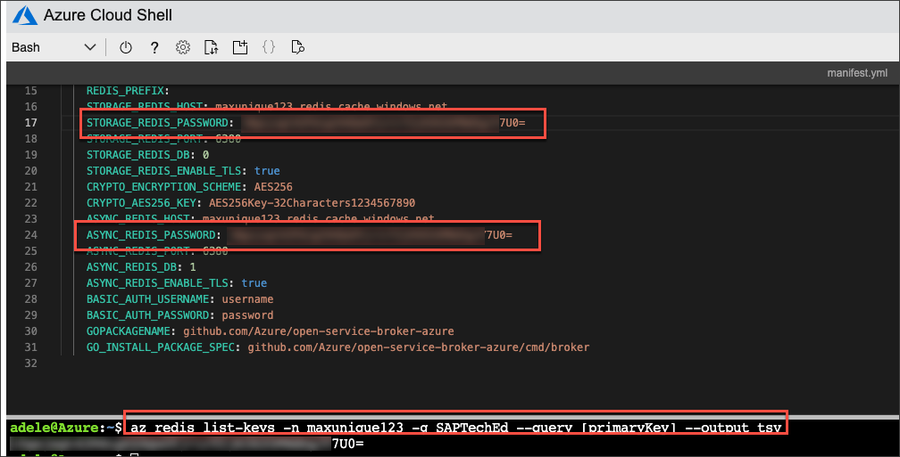

[DONE]
[ACCORDION-END]

[ACCORDION-BEGIN [Step 6: ](Update manifest.yml − service principal information)]

Replace the remaining placeholders `<YOUR TENANT ID>`, `<APPID FROM SERVICE PRINCIPAL>` and `<PASSWORD FROM SERVICE PRINCIPAL>` in the `manifest.yml` with the service principal information you have created in the previous tutorial. (You should have taken a screenshot or copied it into a text document.)

|  Placeholder       | Attribute Name of Service Principal
|  :-------------    | :-------------
|  `<YOUR TENANT ID>`| **`tenant`** value of your Service Principal
|  `<APPID FROM SERVICE PRINCIPAL>`| **`appId`** value of your Service Principal
|  `<PASSWORD FROM SERVICE PRINCIPAL>`| **`password`** value of your Service Principal

[DONE]
[ACCORDION-END]

[ACCORDION-BEGIN [Step 7: ](Update manifest.yml − buildpack information)]

Also replace the provided URL for the `buildpacks`. Use this URL:

`https://github.com/cloudfoundry/go-buildpack/releases/download/v1.8.35/go-buildpack-cflinuxfs3-v1.8.35.zip`

> Please take care that the indentation of this line remains unmodified, otherwise the `manifest.yml` will be recognized as corrupt. There should be four white spaces in the beginning of the line.

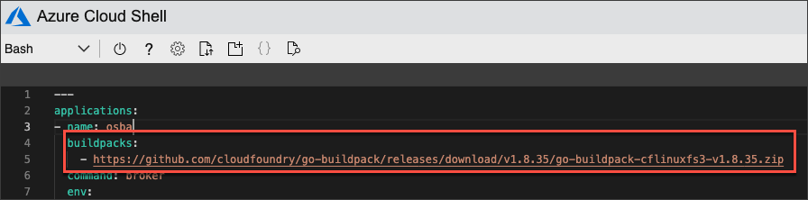

Before you can save and close the file, your service broker application needs a unique name. The service broker application will later be running on a dedicated URL in the SAP Cloud Platform and therefore needs a unique name.

Replace the application name as shown in the screenshot below with your own unique name.

> Please do not use `SAPTechEdMyName12345` as in the screenshot. Use your own unique combination.

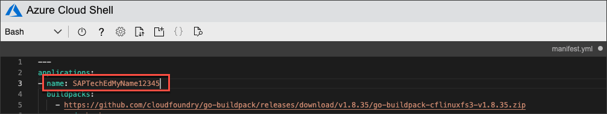

Make sure you have saved the `manifest.yml` file. Saving the file is possible either via **Command + S** or via right-clicking in the editor and choosing the **Save** option.

Check if the file is saved by the appearance of the sign next to the file name as shown in the screenshot below. If it's still there, it's NOT saved.

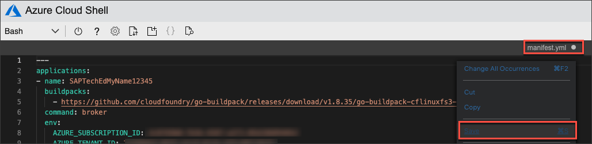

[DONE]
[ACCORDION-END]

[ACCORDION-BEGIN [Step 8: ](Check creation of Redis Cache in Azure)]

The application you will be deploying to SAP Cloud Platform (the service broker application) will use the Redis Cache you have created in the previous tutorial.
If the Redis Cache is not fully provisioned yet (you have only triggered the creation in the previous tutorial), the service broker application will not be functional.

1. Copy the following commands to the **Azure Cloud Shell** and hit enter to execute the commands.
    >Replace `<name-redis-cache>` with your unique `Redis Cache` name from the previous tutorial.

    ```Bash
    while true; do sleep 10; az redis show --name <name-redis-cache> --resource-group SAPCloudPlatform --query provisioningState --output tsv;done
    ```

    This command will check the provisioning state of the Redis Cache. This can take between **5 and 15 minutes** until the the provisioning finishes.
    **Continue with the next step once the output changes to `Succeeded`**.

    > Troubleshooting: If the output of this command is neither `Succeeded` nor `Creating` you either haven't created the Redis Cache correctly in the previous tutorial or you haven't replaced the  `--name` parameter in this step correctly.

    !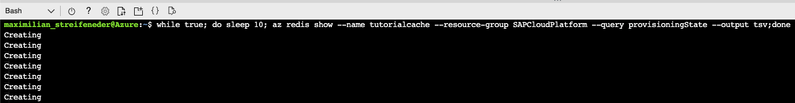

    !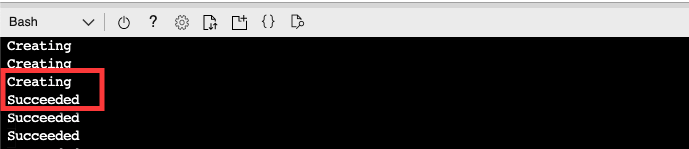

2. Stop the execution of the ongoing command output by pressing **CTRL + C**.

[DONE]
[ACCORDION-END]

[ACCORDION-BEGIN [Step 9: ](Push service broker application to Cloud Foundry space)]

Push (deploy) the application to your SAP Cloud Platform Cloud Foundry space by executing the following command in the Azure Cloud Shell.

```Bash
cd ~/open-service-broker-azure && cf push -f contrib/cf/manifest.yml
```

This will take some time. At the end of the log outputs the status of your deployed application should be similar to this:

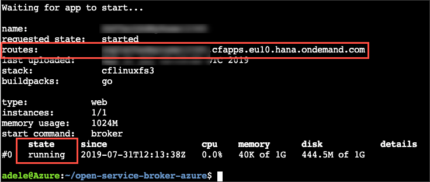

Copy the route information of this log output to your clipboard as it's needed in the next step.

[DONE]
[ACCORDION-END]

[ACCORDION-BEGIN [Step 10: ](Register service broker in Cloud Foundry space)]

The service broker application is now running, but not yet acting as a proper service broker within your space. Thus it's necessary to register the application as a service broker.

Execute the specified command in the Azure Cloud Shell.

> Replace `<application-route>` with the actual application route you have copied in the previous step. Don't remove the `https://`. Please also replace the `<unique-service-broker-name>` own unique combination.

```Bash
cf create-service-broker <unique-service-broker-name> username password https://<application-route> --space-scoped
```

Double-check if the service broker registration was successful by executing the following command in the Azure Cloud Shell:

```Bash
cf service-brokers
```

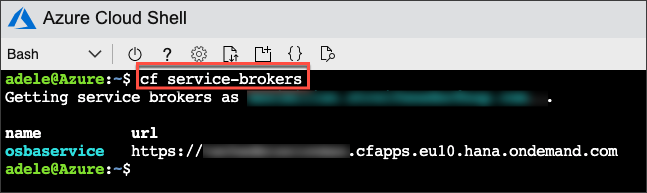


[DONE]
[ACCORDION-END]

[ACCORDION-BEGIN [Step 10: ](Browse marketplace to discover Azure services)]

Since your service broker is now fully functional, you should be able to use the Azure services. To check the available services browse the marketplace by executing the following command in your Azure Cloud Shell:

```Bash
cf marketplace
```

You should now get SAP Cloud Platform services and Azure services listed in the marketplace.

[VALIDATE_1]
[ACCORDION-END]
