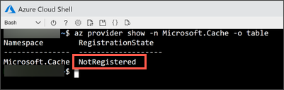
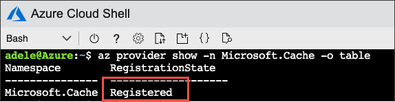
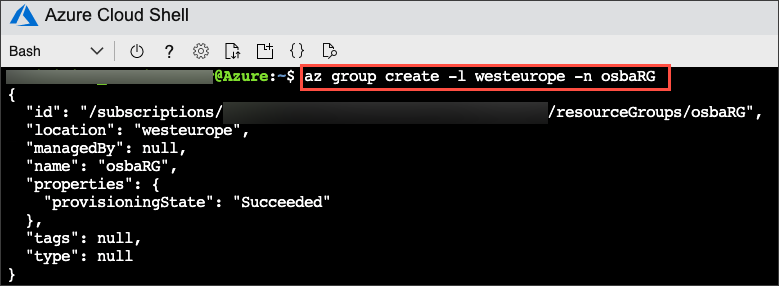
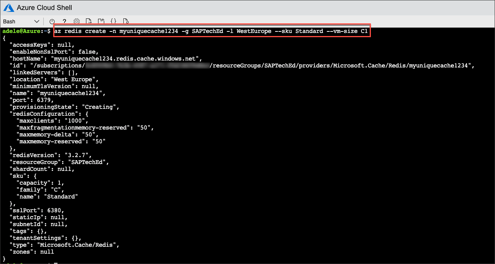
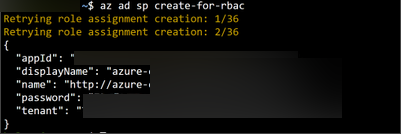

## Prerequisites

## Details
### You will learn
  - How to create a Redis Cache
  - How to create a service principal

---

[ACCORDION-BEGIN [Step 1: ](Set up resource provider)]

The service broker uses Redis as a backing service, so you'll have to set up a Redis Cache. The easiest way to do this is using the Azure Cloud Shell you have initially configured.

Verify if there is already a so-called resource provider `Microsoft.Cache` by issuing the following command:

```Bash
az provider show -n Microsoft.Cache -o table
```



If you get a **Not Registered** as `RegistrationState`, you don't have a resource provider. If this is the case, go on and register it:

```Bash
az provider register --namespace Microsoft.Cache
```

This might take some time. You can check the process by running the `provider show` command in the Azure Cloud Shell.

```Bash
az provider show -n Microsoft.Cache -o table
```



[DONE]
[ACCORDION-END]

[ACCORDION-BEGIN [Step 2: ](Create resource group)]

In Azure, you group resources in so-called resource groups.

The first thing to do is to create a resource group. Call the resource group `SAPCloudPlatform` and locate it in West Europe.

```Bash
az group create -l westeurope -n SAPCloudPlatform
```



[DONE]
[ACCORDION-END]


[ACCORDION-BEGIN [Step 3: ](Create Redis Cache)]

It's time now to create the backing service for the service broker in the form of a Redis Cache.

**Execute** the following command in the Azure Cloud Shell:

>Replace `<unique-cache-name>` with a globally unique technical name for the Redis Cache of your choice.

```Bash
az redis create -n <unique-cache-name> -g SAPCloudPlatform -l WestEurope --sku Standard --vm-size C1
```



[VALIDATE_1]
[ACCORDION-END]

[ACCORDION-BEGIN [Step 4: ](Create a service principal)]

Once you have deployed the service broker to your Cloud Foundry space, a so-called service principal is necessary to let your service broker running on SAP Cloud Platform provision resources in Azure. This is usually done by an account owner or administrator and not done by any developer.

Create a service principal by executing the following command in the Azure Cloud Shell:

```Bash
az ad sp create-for-rbac
```



>**IMPORTANT:** Take a screenshot of the output in the Azure Cloud Shell or copy the information to a text document as you will need the attribute values in the next tutorial.

>**TROUBLESHOOTING:** If your user doesn't have sufficient privileges to execute this command, please contact your administrator.

[DONE]
[ACCORDION-END]


---
