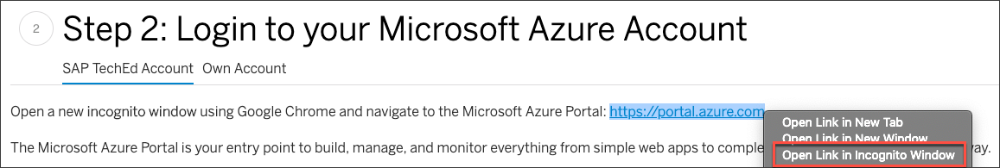
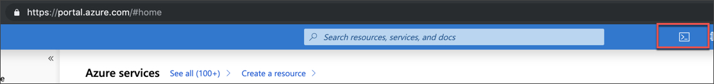
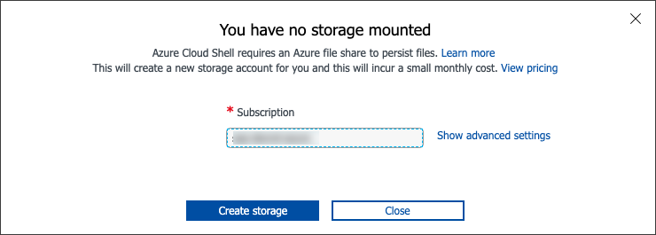
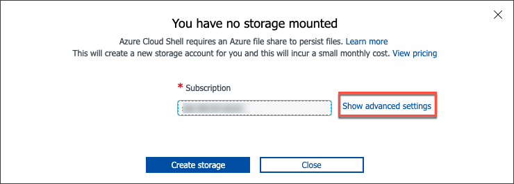
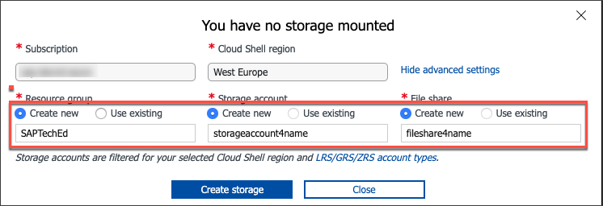
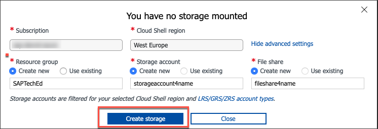
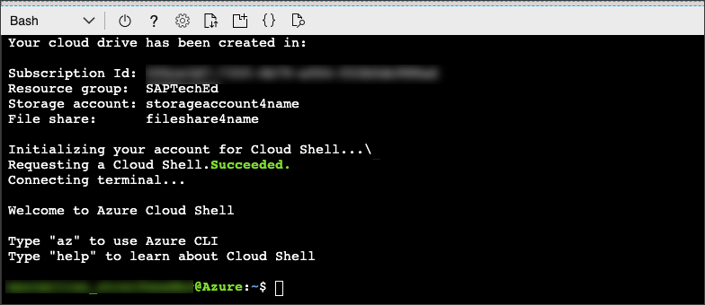
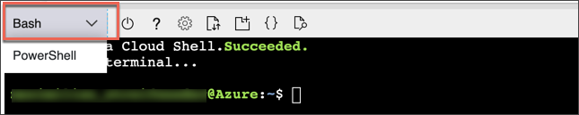
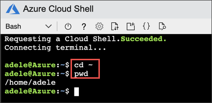

## Prerequisites
 - Make sure you have a Microsoft Azure subscription. [$200 Credits](https://azure.microsoft.com/en-us/offers/ms-azr-0044p/) will be provided if you enter your credit card details at the initial registration.
  - Register for an [SAP Cloud Platform Trial account](hcp-create-trial-account)

## Details
### You will learn
  - How to set up your Azure account to use the Azure Cloud Shell
  - Why using the Azure Cloud Shell is often useful

In this tutorial, you will prepare your Azure Cloud Shell, which you will use later to deploy an application to the SAP Cloud Platform Cloud Foundry environment.

In addition to SAP Cloud Platform services, this application will also use Azure services. The [Open Service Broker API] (https://www.openservicebrokerapi.org/) is used to provision these Azure services and bind them to the application (and possibly delete them later). There are similar use cases for Open Service Broker usage for other Cloud Service Provider, not only for Azure services. The responsible component, running on SAP Cloud Platform Cloud Foundry leveraging the Open Service Broker API, is called service broker.

#### IMPORTANT INSTRUCTIONS

Please note two basic details in this tutorial. If you follow these, you won't have any problems getting to the end successfully.

  - Do not execute any commands in your local terminal on your machine. All commands have to be executed in the Azure Cloud Shell! A local terminal is not used in these tutorials.

If you don't have an Azure subscription yet, no problem. You can easily [register](https://azure.microsoft.com/en-us/offers/ms-azr-0044p/) and as soon as you provide your credit card information, you will be granted 200 US dollars in credits that you can use for this tutorial and beyond. Only when you have exhausted this amount do you have to pay.

---

[ACCORDION-BEGIN [Step 1: ](Log into the SAP Community)]

Register or log into the SAP Community. This will allow you to track the progress of the tutorials.


[DONE]
[ACCORDION-END]


[ACCORDION-BEGIN [Step 2: ](Log into your Microsoft Azure account)]

Open a new **incognito window** using Google Chrome and navigate to the Microsoft Azure Cloud Shell: <https://shell.azure.com>



The Microsoft Azure Cloud Shell is your entry point to build, manage, and monitor everything from simple web apps to complex cloud applications in a unified way on a command line.

Please use the credentials for your own trial/productive account for this and the following tutorials. If you don't have an account yet, please register [here](https://azure.microsoft.com/en-us/offers/ms-azr-0044p/).


[DONE]
[ACCORDION-END]

[ACCORDION-BEGIN [Step 3: ](Launch Azure Cloud Shell)]

Launch the Azure Cloud Shell by clicking on the highlighted control below:



If you have already used the Azure Cloud Shell in your account, this step is not needed and the Azure Cloud Shell is ready to use.

If you are using the Azure Cloud Shell for the first time, you will see the following message.



Click on **Show advanced settings** to be able to choose names for the Storage Account and File share instead of generated IDs.



Keep the values for Subscription and Cloud Shell Region as they are. Choose **Create new** for **Resource Group**, **Storage Account** and **File Share** (as shown below) and enter the following values:

|  Field Name       | Value
|  :-------------   | :-------------
|  Resource Group   | `SAPTechEd`
|  Storage Account  | `storageaccount4tutorial`
|  File Share       | `fileshare4tutorial`



To finish the Azure Cloud Shell setup, click **Create storage**.



Your Azure Cloud Shell is now ready to go.



Please make sure you only use the option **`Bash`** and not PowerShell. Some commands in the following tutorials will only work with bash.



[DONE]
[ACCORDION-END]

[ACCORDION-BEGIN [Step 5: ](Test your setup )]
To verify that your Azure Cloud Shell is working, navigate to your home directory.

Do this by executing the following commands in the Azure Cloud Shell:

```Bash
cd ~
```

Then, print the name of the directory by executing the following the command:

```bash
pwd
```



[VALIDATE_1]
[ACCORDION-END]
