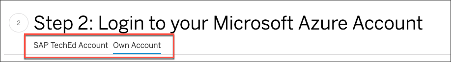
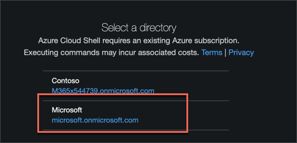
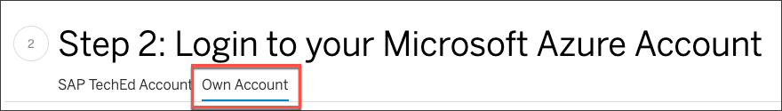

## Prerequisites
 - If you are not attending any SAP TechEd event on site, make sure you have a Microsoft Azure subscription. [$200 Credits](https://azure.microsoft.com/en-us/offers/ms-azr-0044p/) will be provided if you enter your credit card details at the initial registration.
  - Register for an [SAP Cloud Platform Trial account](hcp-create-trial-account)

## Details
### You will learn
  - How to set up your Azure account to use the Azure Cloud Shell
  - Why using the Azure Cloud Shell is often useful

In this tutorial, you will prepare your Azure Cloud Shell, which you will use later to deploy an application to the SAP Cloud Platform Cloud Foundry environment.

In addition to SAP Cloud Platform services, this application will also use Azure services. The [Open Service Broker API] (https://www.openservicebrokerapi.org/) is used to provision these Azure services and bind them to the application (and possibly delete them later). There are similar use cases for Open Service Broker usage for other Cloud Service Provider, not only for Azure services. The responsible component, running on SAP Cloud Platform Cloud Foundry leveraging the Open Service Broker API, is called the service broker.

#### IMPORTANT INSTRUCTIONS

Please note two basic details in this tutorial. If you follow these, you won't have any problems getting to the end successfully.

  - The flow of the tutorial could differ if you are using your Azure account or the ones provided by SAP TechEd staff. In some steps, tabs are visible at the beginning that branch to different statements. Take care of these tabs and choose the appropriate ones. An example:

    

  - Do not execute any commands in your local terminal on your machine. All commands have to be executed in the Azure Cloud Shell! A local terminal is not used in these tutorials.

These tutorials are primarily meant to be completed at the Developer Garage at SAP TechEd, but can also be completed online. In this case, you will need your Azure subscription, as described in the **Prerequisites** at the beginning of this tutorial.

Azure subscriptions are available for SAP TechEd participants to complete these tutorials. Experts at the Microsoft booth in the Developer Garage will provide you the credentials.

If you don't have an Azure subscription yet, no problem. You can easily [register](https://azure.microsoft.com/en-us/offers/ms-azr-0044p/) and as soon as you provide your credit card information, you will be granted 200 US dollars in credits that you can use for this tutorial and beyond. Only when you have exhausted this amount do you have to pay.

---

[ACCORDION-BEGIN [Step 1: ](Log into the SAP Community)]

Register or log into the SAP Community. This will allow you to track the progress of the tutorials and earn prizes at the Developer Garage at SAP TechEd.


[DONE]
[ACCORDION-END]


[ACCORDION-BEGIN [Step 2: ](Log into your Microsoft Azure account)]

Open a new **incognito window** using Google Chrome and navigate to the Microsoft Azure Cloud Shell: <https://shell.azure.com>


The Microsoft Azure Cloud Shell is your entry point to build, manage, and monitor everything from simple web apps to complex cloud applications in a unified way on a command line.

[OPTION BEGIN [SAP TechEd Account]]

The SAP experts at the booth on site will provide you credentials for an account you can use during SAP TechEd.

[OPTION END]

[OPTION BEGIN [Own Account]]

Please use the credentials for your own trial/productive account for this and the following tutorials. If you don't have an account yet, please register [here](https://azure.microsoft.com/en-us/offers/ms-azr-0044p/).

[OPTION END]


[DONE]
[ACCORDION-END]

[ACCORDION-BEGIN [Step 3: ](Launch Azure Cloud Shell)]

Launch the Azure Cloud Shell by clicking on the highlighted control below:


[OPTION BEGIN [SAP TechEd Account]]

The SAP experts have already set up the Azure Cloud Shell. Select the `Microsoft` directory as follows:

> 

>If you are interested in the necessary steps to set up the Azure Cloud Shell, click on the **Own Account** tab.

> 

[OPTION END]

[OPTION BEGIN [Own Account]]

If you have already used the Azure Cloud Shell in your account, this step is not needed and the Azure Cloud Shell is ready to use.

If you are using the Azure Cloud Shell for the first time, you will see the following message.


Click on **Show advanced settings** to be able to choose names for the Storage Account and File share instead of generated IDs.


Keep the values for Subscription and Cloud Shell Region as they are. Choose **Create new** for **Resource Group**, **Storage Account** and **File Share** (as shown below) and enter the following values:

|  Field Name       | Value
|  :-------------   | :-------------
|  Resource Group   | `SAPTechEd`
|  Storage Account  | `storageaccount4tutorial`
|  File Share       | `fileshare4tutorial`


To finish the Azure Cloud Shell setup, click **Create storage**.


Your Azure Cloud Shell is now ready to go.


[OPTION END]

Please make sure you only use the option **`Bash`** and not PowerShell. Some commands in the following tutorials will only work with bash.


[DONE]
[ACCORDION-END]

[ACCORDION-BEGIN [Step 5: ](Test your setup )]
To verify that your Azure Cloud Shell is working, navigate to your home directory.

Do this by executing the following commands in the Azure Cloud Shell:

```Bash
cd ~
```

Then, print the name of the directory by executing the following the command:

```bash
pwd
```


[VALIDATE_1]
[ACCORDION-END]
